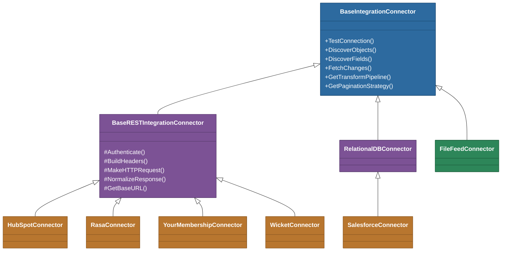

# @memberjunction/integration-connectors

Concrete integration connectors for the MemberJunction Integration Engine. This package provides seven connectors that implement `BaseIntegrationConnector` from `@memberjunction/integration-engine`, covering REST APIs, relational databases, and file feeds. Each connector composes the engine's strategy interfaces to declare authentication, pagination, transforms, incremental sync, and writeback behavior for its target platform.

## Installation

```bash
npm install @memberjunction/integration-connectors
```

## Overview

All connectors inherit from a common base class hierarchy. REST API connectors extend `BaseRESTIntegrationConnector` which provides metadata-driven pagination, template variable expansion, and transform application. Database connectors extend `RelationalDBConnector` for SQL-based fetching. The `FileFeedConnector` extends `BaseIntegrationConnector` directly for flat-file ingestion.



## Key Features

- **Seven connectors** covering CRM (HubSpot), newsletter (Rasa.io), association management (YourMembership, Wicket), CRM/ERP (Salesforce), relational databases, and flat files
- **Strategy composition** -- each connector declares its auth, pagination, transform, rate-limit, incremental sync, and writeback strategies as one-liner overrides
- **Bidirectional sync** -- HubSpot and Wicket support full CRUD writeback; others are read-only with declared strategies for future expansion
- **Incremental sync** -- timestamp watermarks for HubSpot, Rasa, YourMembership, and Wicket; full-load for FileFeed
- **Action metadata generation** -- connectors expose discoverable CRUD/Search/List operations for AI agents and workflow systems
- **Platform-aware transforms** -- automatic UUID normalization, empty-string-to-null coercion, and type conversion based on target database platform

## Usage

### Registering Connectors

Connectors register themselves via `@RegisterClass`. Import the package to trigger registration, then the `ConnectorFactory` resolves them by name:

```typescript
import '@memberjunction/integration-connectors'; // triggers @RegisterClass decorators
import { IntegrationEngine } from '@memberjunction/integration-engine';

await IntegrationEngine.Instance.Config(false, contextUser);
const result = await IntegrationEngine.Instance.RunSync(
    companyIntegrationID,
    contextUser,
    'Manual'
);
```

### HubSpotConnector

REST API connector for HubSpot CRM (v3 API). Supports full bidirectional sync with CRUD operations, custom object discovery, and association endpoints.

**Registration:** `@RegisterClass(BaseIntegrationConnector, 'HubSpotConnector')`

**Capabilities:**
- Bearer token authentication (private app keys or OAuth tokens)
- Cursor-based pagination via `paging.next.after`
- Batch writes via `SimpleBatching(100)`
- Timestamp watermarks on `hs_lastmodifieddate` for incremental sync
- Custom object discovery via `GET /crm/v3/schemas`
- Association endpoint traversal (HubSpot v4 associations API)
- Full CRUD: Create, Update, Delete, Search, List
- Action metadata generation for AI agents and workflow systems

**Configuration:**
```json
{
  "AccessToken": "pat-na1-xxxx",
  "ApiVersion": "v3",
  "MaxRetries": 5,
  "RequestTimeoutMs": 30000,
  "MinRequestIntervalMs": 100
}
```

### RasaConnector

REST API connector for the Rasa.io newsletter platform (v1 API). Read-only connector for syncing subscriber, content, and engagement data.

**Registration:** `@RegisterClass(BaseIntegrationConnector, 'RasaConnector')`

**Capabilities:**
- JWT authentication (Basic auth to JWT token exchange)
- Mixed pagination: offset-based for persons/posts, cursor-based (base64 skip token) for insights/actions, none for insights/topics
- Timestamp watermarks on `updated_since` for persons, `created_since` for insights/actions
- Per-person topic data explosion (flattens nested topics arrays into individual rows)
- Batch buffering for non-paginated endpoints returning more records than BatchSize
- API wrap-around detection via ExternalID deduplication

**Objects:** persons, posts, insights-actions, insights-topics

**Configuration:**
```json
{
  "APIKey": "uuid-api-key",
  "Username": "email@example.com",
  "Password": "password",
  "CommunityIdentifier": "optional-community-id"
}
```

### YourMembershipConnector

REST API connector for the YourMembership (YM) association management system. Read-only connector with session-based auth and member detail enrichment.

**Registration:** `@RegisterClass(BaseIntegrationConnector, 'YourMembershipConnector')`

**Capabilities:**
- Session-based authentication (POST /Ams/Authenticate to SessionId)
- Page-number pagination with YM-specific parameter names (`PageNumber`, `PageSize`)
- Timestamp watermarks on `LastUpdated` for members (client-side filtering -- YM API returns all records)
- Member detail enrichment: list endpoint returns sparse data, detail endpoint is called per-member for full profile
- Adaptive rate limiting: increases interval on 429, recovers toward minimum on success
- Nested group/group-type flattening
- Configurable performance overrides (MaxRetries, RequestTimeoutMs, MinRequestIntervalMs, EnrichBatchSize)

**Objects:** members, events, event-registrations, event-sessions, groups, invoice-items, dues-transactions, donation-history, career-openings

**Configuration:**
```json
{
  "ClientID": "25363",
  "APIKey": "api-key",
  "APIPassword": "password",
  "MaxRetries": 5,
  "MinRequestIntervalMs": 600,
  "EnrichBatchSize": 500
}
```

### WicketConnector

REST API connector for the Wicket membership management platform via its JSON:API interface. Full bidirectional sync with CRUD and advanced search.

**Registration:** `@RegisterClass(BaseIntegrationConnector, 'WicketConnector')`

**Capabilities:**
- JWT Bearer authentication (HS256, generated from API secret with configurable issuer)
- JSON:API response normalization (flattens `data[].attributes` and extracts relationship IDs)
- Page-number pagination with JSON:API bracket notation (`page[number]`, `page[size]`)
- Timestamp watermarks on `updated_at` via `filter[updated_at_gte]`
- Full CRUD: Create (POST), Update (PATCH), Delete (DELETE), GetRecord (GET)
- Advanced search via POST /query endpoints with predicate filters
- Rate limiting (500 req/min, auto-throttle and exponential backoff on 429)

**Objects:** people, organizations, connections, groups, group_members, person_memberships, organization_memberships, memberships, touchpoints, emails, phones, addresses, roles

**Configuration:**
```json
{
  "apiSecret": "your-api-secret",
  "adminUserUUID": "admin-user-uuid",
  "tenantName": "acme",
  "apiUrl": "https://sandbox-api.staging.wicketcloud.com",
  "issuerDomain": "optional-issuer"
}
```

### SalesforceConnector

Minimal connector that currently delegates to `RelationalDBConnector` for reading from mock Salesforce database tables. Strategy declarations reflect Salesforce platform capabilities for future full REST API implementation.

**Registration:** `@RegisterClass(BaseIntegrationConnector, 'SalesforceConnector')`

**Current:** Reads from `sf_Contact`, `sf_Account`, `sf_Opportunity` tables via SQL.

**Declared strategies (pending full implementation):**
- Cursor pagination via `nextRecordsUrl` (SOQL)
- Timestamp watermarks on `SystemModStamp`
- Custom object discovery

### RelationalDBConnector (Base Class)

Abstract base class for connectors that read from SQL Server databases via the `mssql` package. Provides shared logic for connection management, object/field discovery, and batched record fetching with watermark support.

**Configuration:**
```json
{
  "server": "your-sql-server",
  "database": "YourDatabase",
  "user": "username",
  "password": "password"
}
```

**Shared capabilities:**
- `TestConnection` -- runs `SELECT @@VERSION` to verify connectivity
- `DiscoverObjects` -- queries `INFORMATION_SCHEMA.TABLES` for all base tables
- `DiscoverFields` -- queries `INFORMATION_SCHEMA.COLUMNS` for a given table
- `FetchChangesFromTable` -- parameterized incremental fetch with watermark filtering and batch limiting
- Connection pool caching per server+database pair

### FileFeedConnector

Reads data from local CSV files. Always performs a full load (no incremental sync support).

**Registration:** `@RegisterClass(BaseIntegrationConnector, 'FileFeedConnector')`

**Configuration:**
```json
{
  "storagePath": "/absolute/path/to/file.csv",
  "fileType": "csv"
}
```

**Capabilities:**
- `TestConnection` -- checks that the file exists on disk
- `DiscoverObjects` -- returns the file name as the single available object
- `DiscoverFields` -- parses the CSV header row
- `FetchChanges` -- parses all data rows into `ExternalRecord[]` (watermark is ignored)

**CSV parsing rules:**
- First row is treated as the header
- Supports quoted fields with commas inside
- Supports escaped quotes (`""`) inside quoted fields
- Empty values are mapped to `null`

### Strategy Declarations Summary

Each REST connector declares its strategy composition. The engine uses these during sync.

| Connector | Auth | Pagination | Batching | Transforms | Incremental | Writeback | Custom Objects |
|---|---|---|---|---|---|---|---|
| HubSpot | Bearer | Cursor (`after` / `paging.next.after`) | SimpleBatching(100) | EmptyStringToNull | TimestampWatermark(`hs_lastmodifieddate`) | Full CRUD | Yes |
| Rasa | JWT | Mixed: Offset (`skip`/`limit`) + Cursor (base64 skip token) | None | EmptyStringToNull | TimestampWatermark(`updated_since`) / None | Read-only | No |
| YourMembership | Session | PageNumber (`PageNumber`/`PageSize`) | None | EmptyStringToNull | TimestampWatermark(`LastUpdated`) | Read-only | No |
| Wicket | JWT/Bearer (HS256) | PageNumber (`page[number]`/`page[size]`) | None | EmptyStringToNull | TimestampWatermark(`updated_at`) | Full CRUD | No |
| Salesforce | (pending) | Cursor (`nextRecordsUrl`) | None | EmptyStringToNull | TimestampWatermark(`SystemModStamp`) | Read-only (pending) | Yes (pending) |

## API Reference

All connectors implement the `BaseIntegrationConnector` interface:

- `TestConnection(companyIntegration, contextUser)` -- Tests external system connectivity
- `DiscoverObjects(companyIntegration, contextUser)` -- Lists available external objects
- `DiscoverFields(companyIntegration, objectName, contextUser)` -- Lists fields on an object
- `FetchChanges(ctx)` -- Fetches a batch of changed records
- `GetDefaultFieldMappings(objectName, entityName)` -- Suggests default field mappings

REST connectors additionally implement:
- `GetTransformPipeline()` -- Returns the transform pipeline for raw record processing
- `GetPaginationStrategy(objectName)` -- Returns the pagination strategy for an object
- `GetBatchingStrategy()` -- Returns the batching strategy for write operations
- `GetRateLimitStrategy()` -- Returns the rate limiting strategy
- `GetWritebackStrategy()` -- Returns the writeback (CRUD) strategy
- `GetEndpointTraversal(objectName)` -- Returns the endpoint traversal classification
- `GetIncrementalStrategy(objectName)` -- Returns the incremental sync strategy

HubSpot and Wicket writeback connectors additionally support:
- `CreateRecord(ctx)` -- Creates a record in the external system
- `UpdateRecord(ctx)` -- Updates an existing record
- `DeleteRecord(ctx)` -- Deletes a record
- `SearchRecords(ctx)` -- Searches records by criteria
- `GetRecord(ctx)` -- Retrieves a single record by ID

## Dependencies

| Package | Purpose |
|---------|---------|
| [`@memberjunction/integration-engine`](../engine/README.md) | Integration engine, base connector classes, strategy interfaces, and built-in strategy implementations |
| [`@memberjunction/core`](../../MJCore/README.md) | Metadata, RunView, BaseEntity, and entity persistence |
| [`@memberjunction/global`](../../MJGlobal/README.md) | ClassFactory, RegisterClass |
| [`@memberjunction/core-entities`](../../MJCoreEntities/README.md) | Generated entity subclasses for MJ system entities |
| `mssql` | SQL Server connectivity for `RelationalDBConnector` and `SalesforceConnector` |

## Related Packages

| Package | Relationship |
|---------|-------------|
| [`@memberjunction/integration-engine`](../engine/README.md) | The orchestration engine that drives all connectors through the sync pipeline |
| [`@memberjunction/integration-schema-builder`](../schema-builder/README.md) | DDL generation for creating MJ entity tables from external system schemas |
| [`@memberjunction/integration-engine-base`](../engine-base/README.md) | Client-safe metadata cache shared between engine and UI layers |

## Contributing

See the [MemberJunction Contributing Guide](https://github.com/MemberJunction/MJ/blob/main/CONTRIBUTING.md) for details on development workflow, coding standards, and pull request requirements.
