# @memberjunction/integration-engine

The MemberJunction Integration Engine provides orchestration, field mapping, strategy composition, and a connector framework for synchronizing external systems with MJ entities. It coordinates the full sync pipeline -- from fetching external records through authentication and pagination, applying transforms, mapping fields, matching against existing data, and persisting results as MJ entity records.

## Installation

```bash
npm install @memberjunction/integration-engine
```

## Overview

The engine follows a pipeline architecture where external data flows through composable strategy layers before being reconciled with MJ entities.

```mermaid
flowchart LR
    subgraph External["External System"]
        API["REST API"]
    end
    subgraph Connector["Connector -- Strategy Composition"]
        Auth["AuthStrategy"]
        Fetch["PaginationStrategy"]
        Transform["TransformPipeline"]
    end
    subgraph Engine["Integration Engine"]
        Map["FieldMappingEngine"]
        Match["MatchEngine"]
        Apply["Entity Persistence"]
    end
    API --> Auth --> Fetch --> Transform --> Map --> Match --> Apply

    style API fill:#64748b,stroke:#475569,color:#fff
    style Auth fill:#7c5295,stroke:#563a6b,color:#fff
    style Fetch fill:#7c5295,stroke:#563a6b,color:#fff
    style Transform fill:#7c5295,stroke:#563a6b,color:#fff
    style Map fill:#2d6a9f,stroke:#1a4971,color:#fff
    style Match fill:#2d6a9f,stroke:#1a4971,color:#fff
    style Apply fill:#2d8659,stroke:#1a5c3a,color:#fff
    style External fill:#64748b,stroke:#475569,color:#fff
    style Connector fill:#7c5295,stroke:#563a6b,color:#fff
    style Engine fill:#2d6a9f,stroke:#1a4971,color:#fff
```



### Core Components

| Component | Responsibility |
|-----------|---------------|
| `IntegrationEngine` | Top-level coordinator that runs end-to-end sync (fetch, map, match, validate, apply) |
| `BaseIntegrationConnector` | Abstract base for external system connectors; declares strategy methods with safe defaults |
| `BaseRESTIntegrationConnector` | Abstract base for REST API connectors; handles metadata-driven pagination, template variables, and transform application |
| `ConnectorFactory` | Resolves connector instances via `MJGlobal.ClassFactory` |
| `FieldMappingEngine` | Applies field-level transformations from external fields to MJ fields (9 transform types) |
| `MatchEngine` | Determines Create/Update/Delete/Skip for each record |
| `WatermarkService` | Manages incremental sync watermarks |
| `ActionMetadataGenerator` | Generates MJ Action metadata (CRUD, Search, List) from connector introspection |

## Key Features

- **Strategy composition** -- 9 pluggable strategy interfaces (Transform, Pagination, Batching, Auth, Rate Limit, Writeback, Endpoint Traversal, Incremental Sync, Logging) with built-in implementations; connectors compose behavior in one-liner overrides
- **Field mapping engine** -- 9 transform types (direct, regex, split, combine, lookup, format, coerce, substring, custom) with configurable error handling per step
- **Match resolution** -- Automatic Create/Update/Delete/Skip determination by comparing external records against existing MJ entities
- **Incremental sync** -- Watermark-based change tracking with pluggable watermark strategies (timestamp, cursor)
- **Notification callbacks** -- Post-sync notifications with pre-formatted subject/body text suitable for email delivery
- **Built-in transform rules** -- Platform-aware transforms for SQL Server (UUID uppercase) and PostgreSQL (UUID lowercase, JSONB validation, boolean/timestamp coercion)
- **Built-in pagination** -- Cursor, offset, and page-number pagination strategies out of the box
- **Rate limiting** -- Exponential backoff and fixed-interval strategies with configurable retries
- **Action metadata generation** -- Automatic generation of MJ Action metadata from connector introspection for AI agents and workflow systems

## Usage

### Running a Sync

```typescript
import { IntegrationEngine } from '@memberjunction/integration-engine';
import { UserInfo } from '@memberjunction/core';

// Initialize engine metadata
await IntegrationEngine.Instance.Config(false, contextUser);

// Execute a full sync run
const result = await IntegrationEngine.Instance.RunSync(
    companyIntegrationID,
    contextUser,
    'Manual'
);

console.log(`Processed: ${result.RecordsProcessed}`);
console.log(`Created: ${result.RecordsCreated}, Updated: ${result.RecordsUpdated}`);
console.log(`Errors: ${result.RecordsErrored}`);
```

### Sync with Notifications

```typescript
const result = await IntegrationEngine.Instance.RunSync(
    companyIntegrationID,
    contextUser,
    'Scheduled',
    undefined,  // onProgress
    (notification) => {
        if (notification.Severity !== 'Info') {
            emailService.send({
                to: 'ops@example.com',
                subject: notification.Subject,
                text: notification.Body,
            });
        }
    }
);
```

`SyncNotification` properties:
- `Event`: `'SyncCompleted'` | `'SyncCompletedWithErrors'` | `'SyncFailed'`
- `Severity`: `'Info'` | `'Warning'` | `'Error'`
- `Subject` / `Body`: human-readable text ready for email
- `Result`: the full `SyncResult` for programmatic access

### Creating a Custom Connector

Connectors extend `BaseRESTIntegrationConnector` and compose strategies. The connector itself stays thin -- strategy declarations are one-liners, and only truly connector-specific logic (auth, HTTP transport, response normalization) needs implementation.

```typescript
import { RegisterClass } from '@memberjunction/global';
import {
    BaseIntegrationConnector,
    BaseRESTIntegrationConnector,
    type TransformPipeline,
    type PaginationStrategy,
    type RateLimitStrategy,
    type IncrementalSyncStrategy,
    DefaultTransformPipeline,
    EmptyStringToNullRule,
    CursorPagination,
    ExponentialBackoff,
    TimestampWatermark,
} from '@memberjunction/integration-engine';

@RegisterClass(BaseIntegrationConnector, 'MyPlatformConnector')
export class MyPlatformConnector extends BaseRESTIntegrationConnector {
    get IntegrationName() { return 'MyPlatform'; }

    // Compose strategies -- each one line
    GetTransformPipeline() { return new DefaultTransformPipeline([new EmptyStringToNullRule()]); }
    GetPaginationStrategy() { return new CursorPagination('after', 'paging.next.after'); }
    GetRateLimitStrategy() { return new ExponentialBackoff(100, 5); }
    GetIncrementalStrategy() { return new TimestampWatermark('updatedAt'); }

    // Only implement what is truly connector-specific
    protected Authenticate(...) { /* auth logic */ }
    protected BuildHeaders(...) { /* header logic */ }
    protected MakeHTTPRequest(...) { /* HTTP transport */ }
    protected NormalizeResponse(...) { /* response extraction */ }
    protected ExtractPaginationInfo(...) { /* pagination parsing */ }
    protected GetBaseURL(...) { return 'https://api.myplatform.com/v1'; }
}
```

### Transform Pipeline Configuration

The `FieldMappingEngine` supports 9 transform types configured via JSON in the `TransformPipeline` field. These operate on individual field mappings during the map phase (separate from strategy `TransformRule` transforms that operate on raw records during fetch).

| Type | Description | Config |
|------|-------------|--------|
| `direct` | Pass-through with optional default | `{ DefaultValue?: unknown }` |
| `regex` | Regex find/replace | `{ Pattern, Replacement, Flags? }` |
| `split` | Split string, extract by index | `{ Delimiter, Index }` |
| `combine` | Merge multiple fields | `{ SourceFields, Separator }` |
| `lookup` | Case-insensitive value mapping | `{ Map, Default? }` |
| `format` | Date/number formatting | `{ FormatString, FormatType }` |
| `coerce` | Type conversion | `{ TargetType: 'string'\|'number'\|'boolean'\|'date' }` |
| `substring` | Extract portion of string | `{ Start, Length? }` |
| `custom` | JavaScript expression | `{ Expression }` |

Example pipeline that strips non-numeric characters then extracts the first 3 digits (area code from phone number):

```json
[
  { "Type": "regex", "Config": { "Pattern": "[^0-9]", "Replacement": "", "Flags": "g" } },
  { "Type": "substring", "Config": { "Start": 0, "Length": 3 } }
]
```

Each transform step can specify `OnError`:
- `"Fail"` (default) -- throws, halting the record
- `"Skip"` -- skips the field entirely
- `"Null"` -- sets the field to null

### Strategy Interfaces

The engine defines 9 strategy interfaces that connectors compose to declare their behavior. Each strategy has a default (no-op) implementation so connectors only override what they need.

| Strategy | Interface | Purpose | Default |
|----------|-----------|---------|---------|
| Transform | `TransformPipeline` / `TransformRule` | Row-level data transforms (null coercion, UUID normalization, type coercion) | `DefaultTransformPipeline([])` |
| Pagination | `PaginationStrategy` | Builds page params and extracts continuation state | `NoPagination` |
| Batching | `BatchingStrategy` | Splits records into batches for bulk write operations | `NoBatching` |
| Auth | `AuthStrategy` | Authentication, header building, token refresh | (abstract on REST base) |
| Rate Limit | `RateLimitStrategy` | Throttling, retry decisions, backoff calculation | `NoRateLimit` |
| Writeback | `WritebackStrategy` | CRUD operations back to the external system | `ReadOnlyWriteback` |
| Endpoint Traversal | `EndpointTraversal` | Classifies fetch pattern (Simple, Paginated, Templated, Enrichment, Association) | (per-object) |
| Incremental Sync | `IncrementalSyncStrategy` | Watermark type, filter building, watermark extraction | `NoIncrementalSync` |
| Logging | `IntegrationLogger` / `TransactionLogger` | Structured console logging and database-persisted audit trail | (engine-provided) |

### Built-in Strategy Implementations

**Shared transforms (all platforms)**
- `EmptyStringToNullRule` -- converts `""` to `null`
- `TrimWhitespaceRule` -- trims leading/trailing whitespace

**SQL Server transforms**
- `NormalizeUUIDUppercaseRule` -- uppercases UUID strings for SQL Server compatibility

**PostgreSQL transforms**
- `NormalizeUUIDLowercaseRule` -- lowercases UUID strings for PostgreSQL compatibility
- `ValidateJsonbRule` -- validates JSONB field values
- `CoerceBooleanStringsRule` -- converts `"true"`/`"false"` strings to booleans
- `CoerceTimestamptzRule` -- normalizes timestamp strings for `TIMESTAMPTZ`

**Pagination**
- `CursorPagination` -- cursor/token-based (configurable cursor param name and response path)
- `OffsetPagination` -- offset/limit-based
- `PageNumberPagination` -- page number/size-based
- `NoPagination` -- single-request endpoints

**Batching**
- `SimpleBatching(maxBatchSize)` -- splits records into fixed-size batches
- `NoBatching` -- no batching (single-record operations)

**Rate Limiting**
- `ExponentialBackoff(minIntervalMs, maxRetries)` -- exponential backoff with jitter
- `FixedInterval(minIntervalMs, maxRetries)` -- fixed delay between retries
- `NoRateLimit` -- no throttling

**Incremental Sync**
- `TimestampWatermark(fieldName, filterParam?)` -- timestamp-based watermarks
- `NoIncrementalSync` -- full sync every time

**Writeback**
- `ReadOnlyWriteback` -- throws on any write call (default for read-only connectors)

**Transforms**
- `DefaultTransformPipeline(rules[])` -- executes rules in sequence, filtering by target platform

## API Reference

### IntegrationEngine

- `Config(forceRefresh, contextUser)` -- Initializes/refreshes cached metadata
- `RunSync(companyIntegrationID, contextUser, triggerType?, onProgress?, onNotification?)` -- Executes a full sync run

### FieldMappingEngine

- `Apply(records, fieldMaps, entityName)` -- Maps external records to MJ entity fields

### MatchEngine

- `Resolve(records, entityMap, fieldMaps, contextUser)` -- Resolves Create/Update/Delete/Skip

### WatermarkService

- `Load(entityMapID, contextUser)` -- Loads current watermark
- `Update(entityMapID, newValue, contextUser)` -- Updates or creates watermark

### ConnectorFactory

- `Resolve(integration, sourceTypes)` -- Creates connector instance via ClassFactory

### BaseIntegrationConnector (abstract)

- `TestConnection(companyIntegration, contextUser)` -- Tests external system connectivity
- `DiscoverObjects(companyIntegration, contextUser)` -- Lists available external objects
- `DiscoverFields(companyIntegration, objectName, contextUser)` -- Lists fields on an object
- `FetchChanges(ctx)` -- Fetches a batch of changed records
- `GetDefaultFieldMappings(objectName, entityName)` -- Suggests default mappings

Strategy declaration methods (override to compose behavior):
- `GetTransformPipeline()` -- Returns the transform pipeline for raw record processing
- `GetPaginationStrategy(objectName)` -- Returns the pagination strategy for an object
- `GetBatchingStrategy()` -- Returns the batching strategy for write operations
- `GetRateLimitStrategy()` -- Returns the rate limiting strategy
- `GetWritebackStrategy()` -- Returns the writeback (CRUD) strategy
- `GetEndpointTraversal(objectName)` -- Returns the endpoint traversal classification
- `GetIncrementalStrategy(objectName)` -- Returns the incremental sync strategy
- `GetLogger()` -- Returns the integration logger instance

### ActionMetadataGenerator

- `GenerateActions(connector, integrationName)` -- Generates CRUD/Search/List Action metadata from connector introspection

## Dependencies

| Package | Purpose |
|---------|---------|
| [`@memberjunction/core`](../../MJCore/README.md) | Metadata, RunView, BaseEntity, and entity persistence |
| [`@memberjunction/global`](../../MJGlobal/README.md) | ClassFactory, RegisterClass, BaseSingleton |
| [`@memberjunction/core-entities`](../../MJCoreEntities/README.md) | Generated entity subclasses for MJ system entities |
| [`@memberjunction/integration-engine-base`](../engine-base/README.md) | Client-safe metadata cache and shared integration types |

## Related Packages

| Package | Relationship |
|---------|-------------|
| [`@memberjunction/integration-connectors`](../connectors/README.md) | Concrete connector implementations (HubSpot, Rasa, Wicket, YourMembership, Salesforce, FileFeed) |
| [`@memberjunction/integration-schema-builder`](../schema-builder/README.md) | DDL generation for creating MJ entity tables from external system schemas |
| [`@memberjunction/integration-engine-base`](../engine-base/README.md) | Client-safe metadata cache shared between engine and UI layers |

## Contributing

See the [MemberJunction Contributing Guide](https://github.com/MemberJunction/MJ/blob/main/CONTRIBUTING.md) for details on development workflow, coding standards, and pull request requirements.
