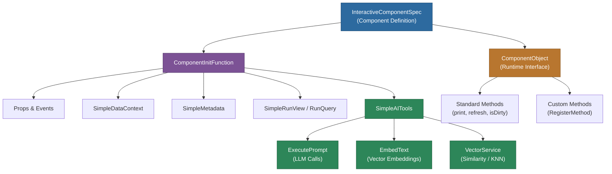

# @memberjunction/interactive-component-types

Type definitions and interfaces for MemberJunction's Interactive Components system, enabling dynamic, data-driven UI components with AI capabilities.

## Overview

The `@memberjunction/interactive-component-types` package provides the foundational types and interfaces for building interactive components in MemberJunction. These components are designed to be dynamically generated, data-aware, and AI-enhanced, allowing for rich user experiences with minimal configuration.



## Key Features

- **Dynamic Component Generation** -- Type-safe specifications for runtime component creation
- **Data Context Management** -- Support for both static and dynamic data loading
- **AI Tool Integration** -- Built-in interfaces for AI operations within components
- **Framework Agnostic** -- Core types that work across React, Angular, and other frameworks
- **Vector Operations** -- Support for similarity calculations and vector-based data operations
- **Metadata Access** -- Direct access to MemberJunction's metadata system

## Installation

```bash
npm install @memberjunction/interactive-component-types
```

## Core Interfaces

### SimpleAITools

Provides AI capabilities to interactive components:

```typescript
interface SimpleAITools {
  // Execute LLM prompts for qualitative analysis
  ExecutePrompt: (params: SimpleExecutePromptParams) => Promise<SimpleExecutePromptResult>
  
  // Generate vector embeddings for similarity calculations
  EmbedText: (params: SimpleEmbedTextParams) => Promise<SimpleEmbedTextResult>
  
  // Vector operations service for KNN, similarity scoring, etc.
  VectorService: SimpleVectorService
}
```

### SimpleExecutePromptParams

Parameters for executing AI prompts within components:

```typescript
interface SimpleExecutePromptParams {
  // System prompt to set context
  systemPrompt: string;
  
  // Optional conversation history
  messages?: Array<{message: string, role: 'user' | 'assistant'}>;
  
  // Preferred models in order of preference
  preferredModels?: string[];
  
  // Model power selection: 'lowest' | 'medium' | 'highest'
  modelPower?: 'lowest' | 'medium' | 'highest';
  
  // Optional user context
  contextUser?: UserInfo;
}
```

### SimpleEmbedTextParams

Parameters for generating text embeddings:

```typescript
interface SimpleEmbedTextParams {
  // Single string or array of strings to embed
  textToEmbed: string | string[];
  
  // Model size selection
  modelSize: 'small' | 'medium';
  
  // Optional user context
  contextUser?: UserInfo;
}
```

### SimpleMetadata

Access to MemberJunction's metadata system:

```typescript
interface SimpleMetadata {
  // Array of all entity metadata
  Entities: EntityInfo[];
  
  // Get entity object for CRUD operations
  GetEntityObject(entityName: string, contextUser?: UserInfo): Promise<BaseEntity>;
}
```

### SimpleRunView

Execute database views dynamically:

```typescript
interface SimpleRunView {
  // Run a single view
  RunView: (params: RunViewParams, contextUser?: UserInfo) => Promise<RunViewResult>
  
  // Run multiple views in parallel
  RunViews: (params: RunViewParams[], contextUser?: UserInfo) => Promise<RunViewResult[]>
}
```

### SimpleRunQuery

Execute predefined queries:

```typescript
interface SimpleRunQuery {
  // Run a predefined query with parameters
  RunQuery: (params: RunQueryParams, contextUser?: UserInfo) => Promise<RunQueryResult>
}
```

## Component Initialization

Interactive components receive initialization functions with access to all tools:

```typescript
type ComponentInitFunction = (
  props: ComponentInitProps,
  events: ComponentEvents,
  data: SimpleDataContext,
  metadata: SimpleMetadata,
  runView: SimpleRunView,
  runQuery: SimpleRunQuery,
  ai: SimpleAITools
) => Promise<void>;
```

## Usage Examples

### Using AI Tools in a Component

```typescript
// In your interactive component initialization
async function initComponent(props, events, data, metadata, runView, runQuery, ai) {
  // Execute a prompt for data analysis
  const analysisResult = await ai.ExecutePrompt({
    systemPrompt: 'You are a data analyst. Analyze the provided dataset.',
    messages: [
      { message: 'What are the key trends?', role: 'user' }
    ],
    modelPower: 'medium'
  });
  
  if (analysisResult.success) {
    console.log('Analysis:', analysisResult.result);
    
    // Parse JSON if available
    if (analysisResult.resultObject) {
      const insights = analysisResult.resultObject;
      // Use insights in your component
    }
  }
  
  // Generate embeddings for similarity matching
  const embedResult = await ai.EmbedText({
    textToEmbed: ['Product A description', 'Product B description'],
    modelSize: 'small'
  });
  
  // Use vector service for similarity calculations
  const similarity = ai.VectorService.cosineSimilarity(
    embedResult.result[0],
    embedResult.result[1]
  );
  
  console.log('Product similarity:', similarity);
}
```

### Accessing Metadata and Running Views

```typescript
async function loadComponentData(props, events, data, metadata, runView) {
  // Get entity metadata
  const userEntity = metadata.Entities.find(e => e.Name === 'Users');
  
  // Run a view to get data
  const viewResult = await runView.RunView({
    EntityName: 'Users',
    ExtraFilter: "Status = 'Active'",
    OrderBy: 'LastName, FirstName',
    MaxRows: 100
  });
  
  if (viewResult.Success) {
    const users = viewResult.Results;
    // Process users data
  }
  
  // Create/update an entity
  const newUser = await metadata.GetEntityObject('Users');
  newUser.NewRecord();
  newUser.Set('FirstName', 'John');
  newUser.Set('LastName', 'Doe');
  await newUser.Save();
}
```

### Running Multiple Operations in Parallel

```typescript
async function loadDashboardData(props, events, data, metadata, runView) {
  // Run multiple views in parallel for better performance
  const [salesData, customerData, productData] = await runView.RunViews([
    { EntityName: 'Sales', ExtraFilter: "Date >= '2024-01-01'" },
    { EntityName: 'Customers', ExtraFilter: "Active = 1" },
    { EntityName: 'Products', OrderBy: 'Name' }
  ]);
  
  // All data loaded in parallel
  console.log('Sales:', salesData.Results);
  console.log('Customers:', customerData.Results);
  console.log('Products:', productData.Results);
}
```

## Component Methods System

### ComponentObject Interface

The `ComponentObject` interface defines the structure returned by compiled components, providing both the React component and method accessors:

```typescript
interface ComponentObject {
  // The React component function
  component: Function;
  
  // Standard methods (all optional)
  print?: () => void;
  refresh?: () => void;
  getCurrentDataState?: () => any;
  getDataStateHistory?: () => Array<{ timestamp: Date; state: any }>;
  validate?: () => boolean | { valid: boolean; errors?: string[] };
  isDirty?: () => boolean;
  reset?: () => void;
  scrollTo?: (target: string | HTMLElement | { top?: number; left?: number }) => void;
  focus?: (target?: string | HTMLElement) => void;
  
  // Dynamic method access
  invokeMethod?: (methodName: string, ...args: any[]) => any;
  hasMethod?: (methodName: string) => boolean;
}
```

### ComponentCallbacks Interface

Components receive callbacks that enable interaction with their container:

```typescript
interface ComponentCallbacks {
  // Open an entity record in the container
  OpenEntityRecord: (entityName: string, key: CompositeKey) => void;
  
  // Register a method that can be called by the container
  RegisterMethod: (methodName: string, handler: Function) => void;
}
```

### How Method Registration Works

1. **Component registers methods** during initialization using the `RegisterMethod` callback
2. **Runtime stores methods** in an internal registry Map
3. **ComponentObject exposes methods** with type-safe accessors for standard methods
4. **Containers call methods** directly or via `invokeMethod()` for custom methods

### Example: Component Registering Methods

```typescript
function DataTableComponent({ callbacks, data, userState }) {
  const [tableData, setTableData] = React.useState(data);
  const [hasChanges, setHasChanges] = React.useState(false);
  const [selectedRows, setSelectedRows] = React.useState([]);
  
  React.useEffect(() => {
    if (callbacks?.RegisterMethod) {
      // Register standard methods
      callbacks.RegisterMethod('getCurrentDataState', () => ({
        data: tableData,
        selectedRows: selectedRows,
        totalCount: tableData.length
      }));
      
      callbacks.RegisterMethod('isDirty', () => hasChanges);
      
      callbacks.RegisterMethod('validate', () => {
        if (tableData.length === 0) {
          return { valid: false, errors: ['Table cannot be empty'] };
        }
        return true;
      });
      
      callbacks.RegisterMethod('reset', () => {
        setTableData(data);
        setSelectedRows([]);
        setHasChanges(false);
      });
      
      // Register custom business logic methods
      callbacks.RegisterMethod('exportSelectedRows', () => {
        return selectedRows.map(idx => tableData[idx]);
      });
      
      callbacks.RegisterMethod('deleteSelected', () => {
        const newData = tableData.filter((_, idx) => !selectedRows.includes(idx));
        setTableData(newData);
        setHasChanges(true);
        setSelectedRows([]);
      });
    }
  }, [callbacks, tableData, selectedRows, hasChanges]);
  
  return <div>{/* Table UI */}</div>;
}
```

### Example: Container Using Methods

```typescript
// After component compilation
const componentObject = compiledComponent as ComponentObject;

// Use standard methods with type safety
if (componentObject.isDirty && componentObject.isDirty()) {
  console.log('Component has unsaved changes');
  
  const validation = componentObject.validate?.();
  if (validation === true || validation?.valid) {
    // Safe to proceed
    const currentState = componentObject.getCurrentDataState?.();
    await saveData(currentState);
  } else {
    console.error('Validation failed:', validation?.errors);
  }
}

// Use custom methods via invokeMethod
if (componentObject.hasMethod?.('exportSelectedRows')) {
  const selectedData = componentObject.invokeMethod('exportSelectedRows');
  await exportToFile(selectedData);
}

// Reset the component
componentObject.reset?.();
```

### Method Declaration in ComponentSpec

Components can declare their supported methods in the spec for static discovery:

```typescript
interface ComponentSpec {
  name: string;
  code: string;
  
  // Optional method declarations for discovery/documentation
  methods?: Array<{
    name: string;
    category?: 'standard' | 'custom';
    description?: string;
    parameters?: Array<{
      name: string;
      type: string;  // Free-form type description
      required?: boolean;
      description?: string;
    }>;
    returnType?: string;  // Free-form type description
  }>;
}
```

Example declaration:

```typescript
const spec: ComponentSpec = {
  name: 'DataTable',
  code: '...',
  methods: [
    {
      name: 'getCurrentDataState',
      category: 'standard',
      description: 'Returns current table data and selection state',
      returnType: '{data: any[], selectedRows: number[], totalCount: number}'
    },
    {
      name: 'exportSelectedRows',
      category: 'custom',
      description: 'Exports currently selected rows',
      returnType: 'any[]'
    },
    {
      name: 'deleteSelected',
      category: 'custom',
      description: 'Deletes selected rows from the table'
    }
  ]
};
```

### Benefits of the Method System

1. **AI Agent Integration**: AI agents can introspect component state for analysis
2. **Validation & State Management**: Containers can check dirty state and validate before saving
3. **Custom Business Logic**: Components can expose domain-specific operations
4. **Framework Agnostic**: Works across Angular, React, and other frameworks
5. **Type Safety**: Standard methods have full TypeScript support
6. **Discoverability**: Method declarations enable static analysis without runtime

## Component Specifications

The package includes comprehensive types for component specifications:

- `InteractiveComponentSpec`: Full component specification including metadata, props, and initialization
- `ComponentDataRequirement`: Defines data loading requirements
- `ComponentOption`: Configuration options for components
- `ComponentLibraryDependency`: External library dependencies
- `ComponentSpecCategory`: Component categorization and metadata

## Vector Service Capabilities

The included `SimpleVectorService` provides:

- **Cosine Similarity**: Calculate similarity between vectors
- **Euclidean Distance**: Measure distance between points
- **K-Nearest Neighbors (KNN)**: Find similar items
- **Clustering**: Group similar items together
- **Dimensionality Reduction**: PCA and t-SNE support

## Best Practices

1. **Model Selection**: Use `modelPower` parameter wisely - 'lowest' for simple tasks, 'highest' for complex analysis
2. **Batch Operations**: Use `RunViews` for parallel data loading instead of sequential `RunView` calls
3. **Embedding Caching**: Cache embeddings when possible as they're deterministic for the same input
4. **Error Handling**: Always check `success` flags in AI operation results
5. **JSON Parsing**: Use `resultObject` when expecting structured data from AI prompts

## Type Safety

All interfaces are fully typed with TypeScript, providing:
- IntelliSense support in IDEs
- Compile-time type checking
- Better code documentation
- Reduced runtime errors

## Dependencies

- `@memberjunction/core`: Core MemberJunction types and interfaces
- `@memberjunction/ai-vectors-memory`: Vector operations and similarity calculations

## License

ISC