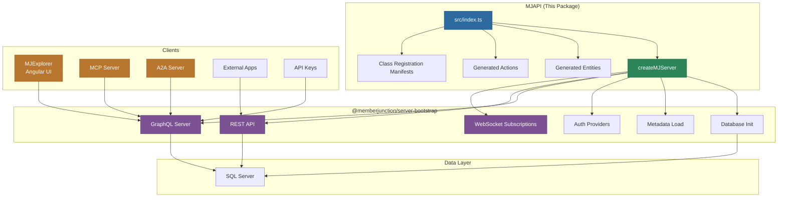

# MemberJunction API Server (MJAPI)

Lightweight wrapper application that leverages `@memberjunction/server` and `@memberjunction/server-bootstrap` to expose MemberJunction's full functionality through GraphQL and REST interfaces. This is the primary server-side entry point for the MemberJunction platform.

## Architecture



## Overview

MJAPI is intentionally minimal. Its `src/index.ts` does only four things:

1. Imports generated entity and action packages for class registration
2. Imports pre-built and supplemental class registration manifests
3. Configures resolver paths for generated GraphQL resolvers
4. Calls `createMJServer()` from `@memberjunction/server-bootstrap`

All heavy lifting (database connections, metadata loading, GraphQL schema generation, REST endpoint creation, authentication, WebSocket subscriptions) is handled by the `server-bootstrap` package.

**Key features provided by the underlying server stack:**

- GraphQL API with auto-generated entity resolvers
- REST API with entity CRUD endpoints
- WebSocket subscriptions for real-time data updates
- Multiple authentication methods (JWT, User API Keys, System API Keys)
- Multi-datasource support with read-write and read-only connections
- External change detection and synchronization
- AI capabilities integration

## Prerequisites

- Node.js 18+ (20+ recommended)
- SQL Server with MemberJunction schema installed
- TypeScript 5.x
- Configuration file (`mj.config.cjs` or equivalent)

## Getting Started

### 1. Configure

Create `mj.config.cjs` in the repository root:

```javascript
module.exports = {
    dbHost: 'localhost',
    dbPort: 1433,
    dbDatabase: 'MemberJunction',
    dbUsername: 'your_username',
    dbPassword: 'your_password',
    mjCoreSchema: '__mj',
    graphqlPort: 4000,
    databaseSettings: {
        connectionTimeout: 30000,
        requestTimeout: 30000,
        metadataCacheRefreshInterval: 60000
    }
};
```

### 2. Build

```bash
# From the workspace root
npm run build

# Or build just the API
cd packages/MJAPI && npm run build
```

### 3. Start

```bash
npm run start:api
```

The GraphQL API is available at `http://localhost:4000/` by default.

## Authentication

| Method | Header | Use Case |
|--------|--------|----------|
| OAuth/JWT | `Authorization: Bearer <token>` | Browser-based apps, SSO |
| User API Key | `X-API-Key: mj_sk_<64-hex>` | Programmatic access, integrations |
| System API Key | `x-mj-api-key: <key>` | Server-to-server communication |

## Configuration Reference

All configuration is in the `mjServerConfig` section of `mj.config.cjs`. Key sections:

| Section | Purpose |
|---------|---------|
| Database (`dbHost`, `dbPort`, etc.) | SQL Server connection settings |
| Server (`graphqlPort`, `graphqlRootPath`) | Server binding configuration |
| `databaseSettings` | Connection timeouts and cache refresh intervals |
| `userHandling` | Auto-create users, roles, application access |
| `restApiOptions` | Enable/disable REST API, entity filtering |
| `askSkip` | AI integration settings |
| Auth (`auth0Domain`, `webClientID`, `tenantID`) | Authentication provider configuration |

See the configuration schema in `@memberjunction/server` for the complete reference.

## Project Structure

```
packages/MJAPI/
  src/
    index.ts              # Entry point -- calls createMJServer()
    generated/            # Auto-generated GraphQL resolvers and manifests
  package.json
  tsconfig.json
```

## Class Registration Manifests

MJAPI uses two manifests to prevent tree-shaking of `@RegisterClass`-decorated classes:

1. **Pre-built manifest** (`@memberjunction/server-bootstrap/mj-class-registrations`): Covers all `@memberjunction/*` packages
2. **Supplemental manifest** (`src/generated/class-registrations-manifest.ts`): Covers user-defined classes, generated at `prestart` with `--exclude-packages @memberjunction`

## Docker Deployment

```bash
# Build
docker build -t memberjunction/api -f docker/MJAPI/Dockerfile .

# Run
docker run -p 4000:4000 -v $(pwd)/mj.config.cjs:/app/mj.config.cjs memberjunction/api
```

The Docker image includes Node.js 20, Flyway for migrations, SQL Server tools, and PM2 for process management.

## Core Dependencies

| Package | Purpose |
|---------|---------|
| `@memberjunction/server` | Core server functionality |
| `@memberjunction/server-bootstrap` | Server initialization and lifecycle |
| `@memberjunction/core` | Core MJ framework |
| `@memberjunction/sqlserver-dataprovider` | SQL Server connectivity |
| `mj_generatedentities` | Generated entity classes |
| `mj_generatedactions` | Generated action classes |

## License

ISC
