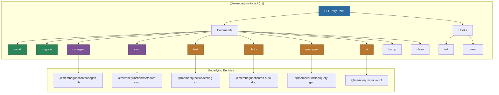

# @memberjunction/cli

The official command-line interface for MemberJunction. Provides tools for installation, database migrations, code generation, metadata sync, AI operations, testing, database documentation, and query generation.

## Architecture



## Overview

The `mj` CLI is built on the oclif framework and acts as a unified entry point for all MemberJunction development tools. Each command group delegates to a specialized package.

## Installation

```bash
# Global (recommended)
npm install -g @memberjunction/cli

# Local
npm install --save-dev @memberjunction/cli
```

**Requires Node.js 20.0.0 or higher.**

## Configuration

Uses [cosmiconfig](https://github.com/davidtheclark/cosmiconfig) to find configuration:

- `mj.config.js` / `mj.config.cjs`
- `.mjrc` / `.mjrc.json` / `.mjrc.yaml`
- `package.json` (in `"mj"` property)

### Database Environment Variables

| Variable | Default | Description |
|----------|---------|-------------|
| `DB_HOST` | `localhost` | SQL Server hostname or IP |
| `DB_PORT` | `1433` | SQL Server port |
| `DB_DATABASE` | | Database name |
| `CODEGEN_DB_USERNAME` | | SQL Server login |
| `CODEGEN_DB_PASSWORD` | | SQL Server password |
| `DB_ENCRYPT` | `true` | Encrypt the connection (required for Azure SQL) |
| `DB_TRUST_SERVER_CERTIFICATE` | `false` | Trust self-signed certificates (set `true` for local dev) |

These can also be set in `mj.config.cjs` as `dbHost`, `dbPort`, `dbDatabase`, `codeGenLogin`, `codeGenPassword`, `dbEncrypt`, and `dbTrustServerCertificate`.

## Commands

### mj install

Interactive installer for new MemberJunction environments.

```bash
mj install
```

Sets up the database schema, applies migrations, and generates initial code.

### mj migrate

Run database migrations (powered by [Skyway](https://github.com/MemberJunction/skyway)).

```bash
mj migrate
mj migrate [--verbose] [--tag <version>] [--schema <name>] [--dir <path>]
```

Options:
- `-v, --verbose`: Enable detailed logging
- `-t, --tag <version>`: Specify a version tag for migrations (e.g., 'v2.10.0')
- `-s, --schema <name>`: Target schema (overrides `coreSchema` from config)
- `--dir <path>`: Migration source directory (overrides `migrationsLocation` from config)

**Schema Handling:**
- When using `--schema`, the specified schema will be automatically created if it doesn't exist
- This enables migrating to new schemas without manual DDL setup
- The schema creation uses Flyway's `createSchemas` feature

Examples:
```bash
# Basic migration
mj migrate

# Migrate to a specific version tag
mj migrate --tag v2.10.0

# Migrate a custom schema with custom migrations directory
mj migrate --schema __BCSaaS --dir ./migrations/v1

# Verbose output for debugging
mj migrate --verbose
```

### mj codegen

Run MemberJunction code generation.

```bash
# Run full code generation
mj codegen

# Generate class registration manifests only
mj codegen manifest
mj codegen manifest --exclude-packages @memberjunction --output ./src/generated/manifest.ts
```

#### v5.0 Entity Name Migration Commands

Starting in MemberJunction v5.0, all 272 core entity names are being normalized with the `"MJ: "` prefix to prevent naming collisions on client systems (e.g., `"Actions"` becomes `"MJ: Actions"`). The database migration handles the rename automatically, but hardcoded entity name strings in your TypeScript source, Angular HTML templates, and metadata JSON files also need updating. These three commands automate that process.

All three commands share the same workflow:
1. **Dry-run first** (default) -- scans and reports what would change, without modifying any files.
2. **Fix mode** (`--fix`) -- applies the changes in place.
3. **Rename map** -- built dynamically by parsing `@RegisterClass(BaseEntity, 'MJ: XYZ')` decorators from `entity_subclasses.ts`. No hardcoded list to maintain.

> These commands will be kept for 1-2 years to support the v5.0 upgrade window, then removed.

##### mj codegen 5-0-fix-entity-names

Scans **TypeScript source files** (`.ts`) using the TypeScript compiler AST to find hardcoded entity names that need the `"MJ: "` prefix. This is the most comprehensive scanner -- it understands code context, not just string matching.

**Detected patterns:**

| Pattern | Example |
|---------|---------|
| `GetEntityObject` calls | `md.GetEntityObject<T>('Actions')` |
| `OpenEntityRecord` calls | `this.OpenEntityRecord('Entities', id)` |
| `navigateToEntity` calls | `navigateToEntity('Templates')` |
| `BuildRelationshipViewParamsByEntityName` calls | `BuildRelationshipViewParamsByEntityName('Roles')` |
| `NewRecordValues` calls | `NewRecordValues('Users')` |
| `IsCurrentTab` calls | `IsCurrentTab('Queries')` |
| `EntityName:` property assignments | `EntityName: 'AI Agent Examples'` |
| `.Name ===` / `.Entity ===` comparisons | `entity.Name === 'Actions'` |
| `@RegisterClass` decorator (BaseEntity) | `@RegisterClass(BaseEntity, 'Actions')` |

**Default exclusions:** `node_modules`, `dist`, `build`, `.git`, `__tests__`, `*.d.ts`, `*.spec.ts`, `*.test.ts`, `generated/`, `Demos/`

```bash
# Dry-run: scan entire packages/ directory
mj codegen 5-0-fix-entity-names --path packages/

# Dry-run: scan a single file
mj codegen 5-0-fix-entity-names --path packages/Angular/Explorer/dashboards/src/Actions/components/actions-overview.component.ts

# Apply fixes
mj codegen 5-0-fix-entity-names --path packages/ --fix

# Custom entity_subclasses.ts location
mj codegen 5-0-fix-entity-names --path packages/ --entity-subclasses ./path/to/entity_subclasses.ts

# Quiet mode (summary only)
mj codegen 5-0-fix-entity-names --path packages/ -q
```

##### mj codegen 5-0-fix-html-entity-names

Scans **Angular HTML template files** (`.html`) using targeted regex patterns for entity name references in template expressions and attribute values.

**Detected patterns:**

| Pattern | Example |
|---------|---------|
| Method calls in event/property bindings | `(click)="navigateToEntity('Actions')"` |
| `OpenEntityRecord` / `openEntityRecord` | `(click)="OpenEntityRecord('Entities', id)"` |
| `BuildRelationshipViewParamsByEntityName` | `[Params]="BuildRelationshipViewParamsByEntityName('Roles')"` |
| `RowsEntityName` attribute | `RowsEntityName="Users"` |
| `JoinEntityName` attribute | `JoinEntityName="Roles"` |

**Default exclusions:** `node_modules`, `dist`, `build`, `.git`, `generated/`, `Demos/`

```bash
# Dry-run: scan Angular templates
mj codegen 5-0-fix-html-entity-names --path packages/Angular/

# Apply fixes
mj codegen 5-0-fix-html-entity-names --path packages/Angular/ --fix

# Verbose output showing individual file progress
mj codegen 5-0-fix-html-entity-names --path packages/ -v
```

##### mj codegen 5-0-fix-metadata-names

Scans **metadata JSON files** (including dotfiles like `.mj-sync.json`) for entity name references that need the `"MJ: "` prefix. Targets the `metadata/` directory used by `mj sync`.

**Detected patterns:**

| Pattern | Example |
|---------|---------|
| `@lookup:` entity name | `@lookup:Entities.Name=Dashboards` |
| `@lookup:` value (in Entities lookups) | `@lookup:MJ: Entities.Name=Actions` |
| Folder config `entity`/`entityName` | `.mj-sync.json` with `"entity": "Dashboards"` |
| `relatedEntities` object keys | `"relatedEntities": { "Actions": [...] }` |
| `fields.Name` in Entities folders | Entity record data files where Name is the entity name |

```bash
# Dry-run: scan metadata directory
mj codegen 5-0-fix-metadata-names --path metadata/

# Apply fixes
mj codegen 5-0-fix-metadata-names --path metadata/ --fix

# Scan a specific subdirectory
mj codegen 5-0-fix-metadata-names --path metadata/resource-types

# Scan and fix a single file
mj codegen 5-0-fix-metadata-names --path metadata/entities/.audit-related-entities.json --fix
```

##### Common flags (all three commands)

| Flag | Short | Description |
|------|-------|-------------|
| `--path <dir\|file>` | `-p` | File or directory to scan. Defaults to current directory. |
| `--fix` | | Apply fixes in place. Without this flag, runs in dry-run mode. |
| `--entity-subclasses <path>` | | Path to `entity_subclasses.ts`. Auto-detected if omitted. |
| `--quiet` | `-q` | Suppress detailed output, show summary only. |
| `--verbose` | `-v` | Show detailed progress for each file scanned. |

##### Recommended migration workflow

```bash
# 1. Scan everything first (dry-run)
mj codegen 5-0-fix-entity-names --path packages/
mj codegen 5-0-fix-html-entity-names --path packages/
mj codegen 5-0-fix-metadata-names --path metadata/

# 2. Review the output, then apply
mj codegen 5-0-fix-entity-names --path packages/ --fix
mj codegen 5-0-fix-html-entity-names --path packages/ --fix
mj codegen 5-0-fix-metadata-names --path metadata/ --fix

# 3. Build and test
npm run build
```

### mj sync

Metadata synchronization between JSON files and the database.

```bash
# Initialize metadata directory
mj sync init

# Check sync status
mj sync status

# Pull metadata from database to files
mj sync pull

# Push metadata from files to database
mj sync push

# Validate metadata files
mj sync validate

# Watch for file changes
mj sync watch

# Reset file state
mj sync file-reset
```

### mj ai

AI-powered operations.

```bash
mj ai
```

### mj test

Testing framework operations (delegates to `@memberjunction/testing-cli`).

```bash
# Run a test
mj test run --name "My Test"

# Run a suite
mj test suite --name "My Suite"

# List tests
mj test list

# View history
mj test history --name "My Test"

# Compare runs
mj test compare --run1 id1 --run2 id2

# Validate test config
mj test validate --name "My Test"
```

### mj dbdoc

Database documentation generation.

```bash
# Initialize documentation
mj dbdoc init

# Analyze database schema
mj dbdoc analyze

# Export documentation
mj dbdoc export

# Check status
mj dbdoc status

# Reset documentation
mj dbdoc reset

# Generate sample queries
mj dbdoc generate-queries
mj dbdoc export-sample-queries
```

### mj querygen

Query generation tools.

```bash
mj querygen generate
mj querygen export
mj querygen validate
```

### mj bump

Version management for packages.

```bash
mj bump
```

### mj clean

Clean build artifacts.

```bash
mj clean
```

## Hooks

| Hook | Timing | Purpose |
|------|--------|---------|
| `init` | Before any command | Loads configuration, initializes environment |
| `prerun` | Before command execution | Validates configuration, connects to database |

## Plugin System

The CLI includes these oclif plugins:

- `@oclif/plugin-help` -- Auto-generated help text
- `@oclif/plugin-version` -- Version display
- `@oclif/plugin-warn-if-update-available` -- Update notifications (checks daily)

## Dependencies

| Package | Purpose |
|---------|---------|
| `@memberjunction/codegen-lib` | Code generation engine |
| `@memberjunction/metadata-sync` | Metadata synchronization |
| `@memberjunction/testing-cli` | Testing framework CLI |
| `@memberjunction/db-auto-doc` | Database documentation |
| `@memberjunction/query-gen` | Query generation |
| `@memberjunction/ai-cli` | AI operations |
| `@memberjunction/config` | Configuration management |
| `@memberjunction/server-bootstrap-lite` | Lightweight server initialization |
| `@memberjunction/sqlserver-dataprovider` | Database connectivity |
| `@oclif/core` | CLI framework |
| `cosmiconfig` | Configuration file loading |
| `@memberjunction/skyway-core` | Database migration execution |
| `simple-git` | Git operations |
| `figlet` | ASCII art for banners |

## License

ISC
