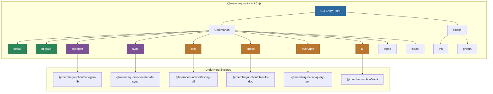

# @memberjunction/cli

The official command-line interface for MemberJunction. Provides tools for installation, database migrations, code generation, metadata sync, AI operations, testing, database documentation, and query generation.

## Architecture



## Overview

The `mj` CLI is built on the oclif framework and acts as a unified entry point for all MemberJunction development tools. Each command group delegates to a specialized package.

## Installation

```bash
# Global (recommended)
npm install -g @memberjunction/cli

# Local
npm install --save-dev @memberjunction/cli
```

**Requires Node.js 20.0.0 or higher.**

## Configuration

Uses [cosmiconfig](https://github.com/davidtheclark/cosmiconfig) to find configuration:

- `mj.config.js` / `mj.config.cjs`
- `.mjrc` / `.mjrc.json` / `.mjrc.yaml`
- `package.json` (in `"mj"` property)

## Commands

### mj install

Interactive installer for new MemberJunction environments.

```bash
mj install
```

Sets up the database schema, applies migrations, and generates initial code.

### mj migrate

Run Flyway database migrations.

```bash
mj migrate
mj migrate [--verbose] [--tag <version>] [--schema <name>] [--dir <path>]
```

Options:
- `-v, --verbose`: Enable detailed logging
- `-t, --tag <version>`: Specify a version tag for migrations (e.g., 'v2.10.0')
- `-s, --schema <name>`: Target schema (overrides `coreSchema` from config)
- `--dir <path>`: Migration source directory (overrides `migrationsLocation` from config)

**Schema Handling:**
- When using `--schema`, the specified schema will be automatically created if it doesn't exist
- This enables migrating to new schemas without manual DDL setup
- The schema creation uses Flyway's `createSchemas` feature

Examples:
```bash
# Basic migration
mj migrate

# Migrate to a specific version tag
mj migrate --tag v2.10.0

# Migrate a custom schema with custom migrations directory
mj migrate --schema __BCSaaS --dir ./migrations/v1

# Verbose output for debugging
mj migrate --verbose
```

### mj codegen

Run MemberJunction code generation.

```bash
# Run full code generation
mj codegen

# Generate class registration manifests only
mj codegen manifest
mj codegen manifest --exclude-packages @memberjunction --output ./src/generated/manifest.ts
```

### mj sync

Metadata synchronization between JSON files and the database.

```bash
# Initialize metadata directory
mj sync init

# Check sync status
mj sync status

# Pull metadata from database to files
mj sync pull

# Push metadata from files to database
mj sync push

# Validate metadata files
mj sync validate

# Watch for file changes
mj sync watch

# Reset file state
mj sync file-reset
```

### mj ai

AI-powered operations.

```bash
mj ai
```

### mj test

Testing framework operations (delegates to `@memberjunction/testing-cli`).

```bash
# Run a test
mj test run --name "My Test"

# Run a suite
mj test suite --name "My Suite"

# List tests
mj test list

# View history
mj test history --name "My Test"

# Compare runs
mj test compare --run1 id1 --run2 id2

# Validate test config
mj test validate --name "My Test"
```

### mj dbdoc

Database documentation generation.

```bash
# Initialize documentation
mj dbdoc init

# Analyze database schema
mj dbdoc analyze

# Export documentation
mj dbdoc export

# Check status
mj dbdoc status

# Reset documentation
mj dbdoc reset

# Generate sample queries
mj dbdoc generate-queries
mj dbdoc export-sample-queries
```

### mj querygen

Query generation tools.

```bash
mj querygen generate
mj querygen export
mj querygen validate
```

### mj bump

Version management for packages.

```bash
mj bump
```

### mj clean

Clean build artifacts.

```bash
mj clean
```

## Hooks

| Hook | Timing | Purpose |
|------|--------|---------|
| `init` | Before any command | Loads configuration, initializes environment |
| `prerun` | Before command execution | Validates configuration, connects to database |

## Plugin System

The CLI includes these oclif plugins:

- `@oclif/plugin-help` -- Auto-generated help text
- `@oclif/plugin-version` -- Version display
- `@oclif/plugin-warn-if-update-available` -- Update notifications (checks daily)

## Dependencies

| Package | Purpose |
|---------|---------|
| `@memberjunction/codegen-lib` | Code generation engine |
| `@memberjunction/metadata-sync` | Metadata synchronization |
| `@memberjunction/testing-cli` | Testing framework CLI |
| `@memberjunction/db-auto-doc` | Database documentation |
| `@memberjunction/query-gen` | Query generation |
| `@memberjunction/ai-cli` | AI operations |
| `@memberjunction/config` | Configuration management |
| `@memberjunction/server-bootstrap-lite` | Lightweight server initialization |
| `@memberjunction/sqlserver-dataprovider` | Database connectivity |
| `@oclif/core` | CLI framework |
| `cosmiconfig` | Configuration file loading |
| `node-flyway` | Database migration execution |
| `simple-git` | Git operations |
| `figlet` | ASCII art for banners |

## License

ISC
