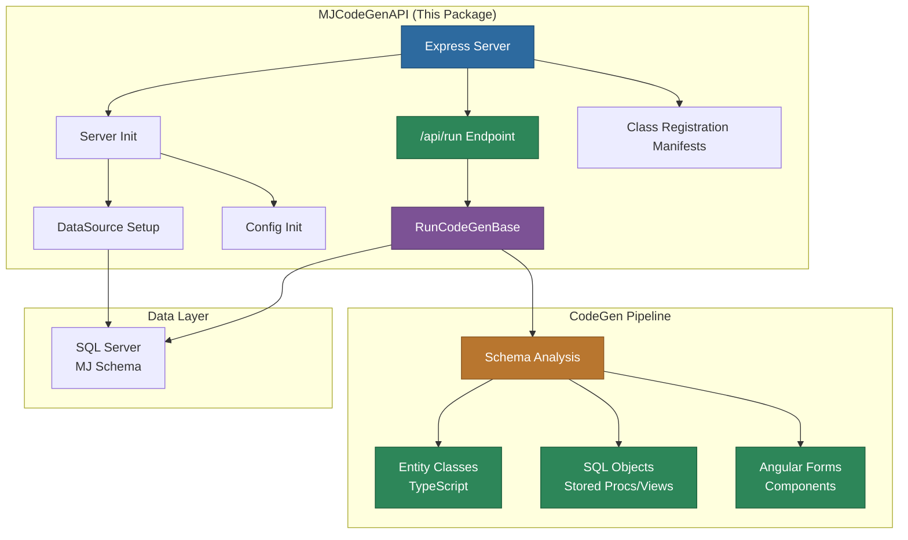

# MemberJunction CodeGen API

A lightweight Express API server that triggers MemberJunction code generation operations. Provides an HTTP endpoint to initiate the full CodeGen pipeline, generating TypeScript classes, SQL objects, and Angular UI components from database schema metadata.

## Architecture



## Overview

MJCodeGenAPI wraps the `@memberjunction/codegen-lib` package in a simple Express HTTP server, enabling code generation to be triggered remotely. This is useful for automated workflows and CI/CD pipelines.

The server:

1. Initializes the MemberJunction configuration and database connection on startup
2. Loads class registration manifests (pre-built + supplemental)
3. Exposes a single `POST /api/run` endpoint that triggers the full CodeGen pipeline
4. Prevents concurrent execution with a promise-based lock

## Prerequisites

- Node.js 18+
- SQL Server with MemberJunction schema
- `mj.config.cjs` configuration file in the repository root
- Environment variables via `.env` (optional, loaded with dotenv)

## Getting Started

### 1. Configure

Ensure `mj.config.cjs` exists in the repository root with database connection settings.

### 2. Build

```bash
cd packages/MJCodeGenAPI && npm run build
```

### 3. Start

```bash
# Production
npm start

# Development with hot reload
npm run dev

# Development with debug port
npm run dev:debug
```

The server starts on the port configured by `___codeGenAPIPort` (default: 3999).

## API

### POST /api/run

Triggers a full code generation run. Returns immediately if a run is already in progress (only one run at a time).

**Request:**
```http
POST /api/run HTTP/1.1
Content-Type: application/json
```

**Response:**
The endpoint runs code generation asynchronously. The server logs progress to stdout.

## Project Structure

```
packages/MJCodeGenAPI/
  src/
    index.ts              # Express server and /api/run handler
    config.ts             # Port configuration
    util.ts               # Server initialization and CodeGen setup
    generated/            # Class registration manifest
  package.json
  tsconfig.json
```

## Class Registration Manifests

Like MJAPI, MJCodeGenAPI uses dual manifests:

1. **Pre-built manifest** (`@memberjunction/server-bootstrap-lite/mj-class-registrations`): Covers all `@memberjunction/*` packages
2. **Supplemental manifest** (`src/generated/class-registrations-manifest.ts`): Generated at build time with `--exclude-packages @memberjunction`

## Dependencies

| Package | Purpose |
|---------|---------|
| `@memberjunction/codegen-lib` | Code generation engine |
| `@memberjunction/core` | Core MJ functionality |
| `@memberjunction/core-entities` | Entity types |
| `@memberjunction/server-bootstrap-lite` | Lightweight server init with class manifests |
| `@memberjunction/sqlserver-dataprovider` | Database connectivity |
| `@memberjunction/global` | Class factory |
| `express` | HTTP server framework |
| `dotenv` | Environment variable loading |
| `rxjs` | Observable patterns for init |

## License

ISC
