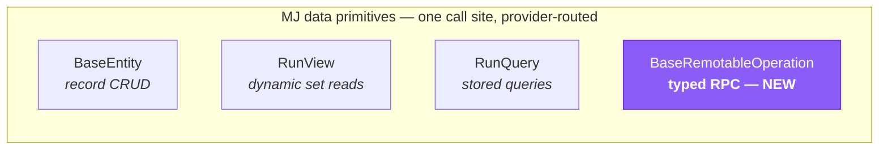
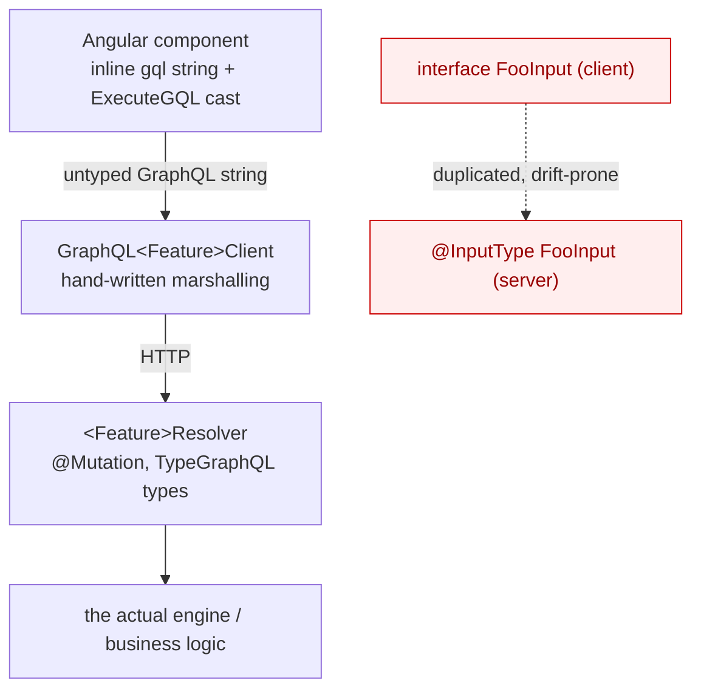
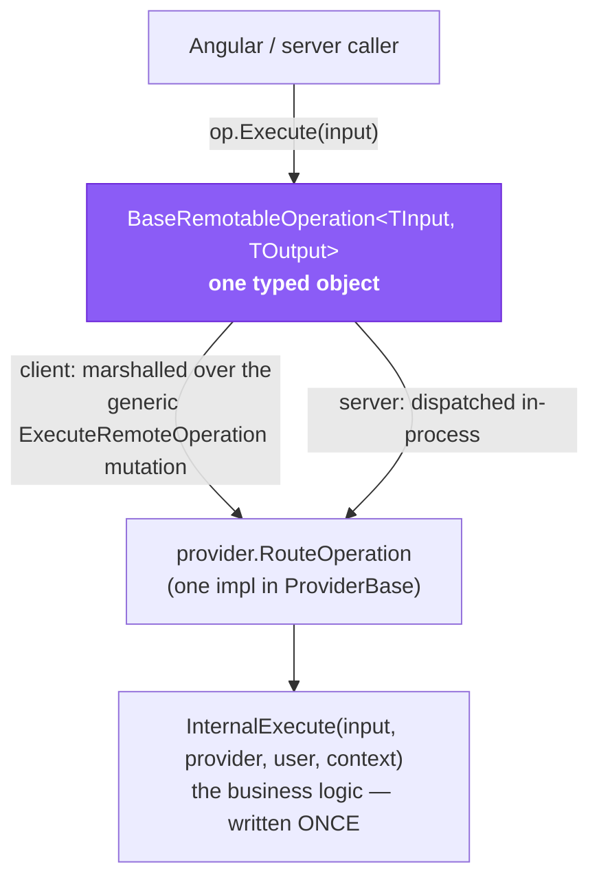
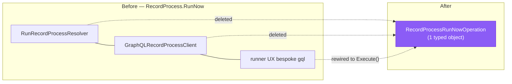
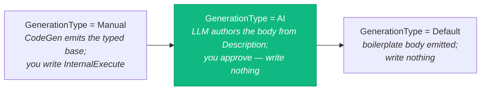
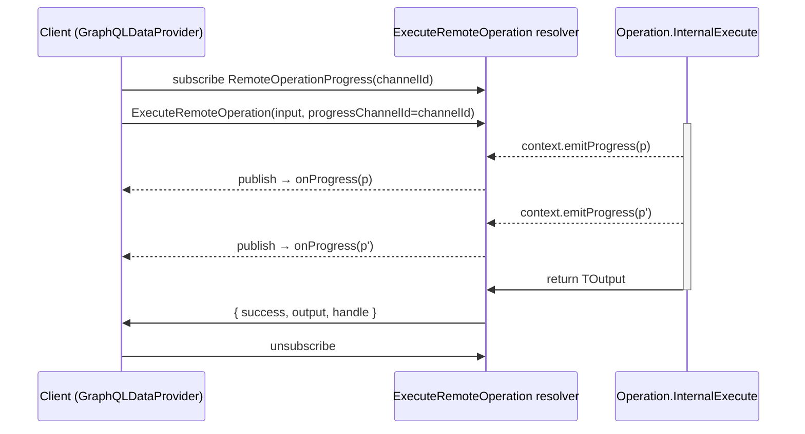

# Remote Operations — Before & After (the showcase)

*A visual tour, for the team, of what the **4th data primitive** replaces — and how much code disappears.*

> TL;DR — A "run X on the server" capability used to mean **four hand-written layers** (a TypeGraphQL
> resolver, a typed GraphQL client, an Angular wrapper, and duplicated I/O types). With Remote Operations it's
> **one typed object** you call the same way on the client and the server. Two real migrations in this PR prove
> it — `Template.Run` (rewired in place) and `RecordProcess.RunNow` (a whole resolver+client pair deleted).

---

## 1. Where it sits — the 4th primitive

MemberJunction already gives you three primitives that share one trait: **one call site, the provider routes
it** (client → GraphQL, server → in-process). Remote Operations completes the set.



`entity.Save()` · `rv.RunView()` · `rq.RunQuery()` · **`op.Execute()`** — same shape, same tier-agnostic DX.

---

## 2. BEFORE — the anatomy of a bespoke capability

To expose one non-CRUD capability ("render a template", "run a process") to the browser, you hand-wrote a
stack — and re-wrote it, slightly differently, for the *next* capability:



**Per capability you owned:** a resolver, a typed client (or an inline `gql` string + a `provider as
GraphQLDataProvider` cast), an Angular wrapper, **and** the input/output types **twice** (client + server),
kept in sync by hand. Multiply by every "run X" feature.

The real `Template.Run` "before" — note the three stringly-typed seams:

```typescript
// template-param-dialog.component.ts  (BEFORE)
const dp = this.ProviderToUse as GraphQLDataProvider;                  // cast
const query = `mutation RunTemplate($templateId: String!, ...) {      // gql string — no compile check
    RunTemplate(templateId: $templateId, contextData: $contextData) { success output error executionTimeMs }
}`;
const result = await dp.ExecuteGQL(query, { contextData: JSON.stringify(...) });   // hand-marshalled
result?.RunTemplate?.output                                            // optional-chained into the unknown
```

---

## 3. AFTER — one Remote Operation



The same `Template.Run` "after" — typed end to end, identical on client and server:

```typescript
const result = await new TemplateRunOperation().Execute({ templateID, data });   // typed in
result.Output?.output                                                            // typed out (string)
```

No resolver. No client. No wrapper. No second copy of the types. Pass a wrong field → **compile error**.

---

## 4. The two real migrations in this PR

| Capability | Before | After | Net |
|---|---|---|---|
| **`Template.Run`** | inline `gql` mutation + `ExecuteGQL` cast in the dialog; `RunTemplateResolver` | `new TemplateRunOperation().Execute(...)`; resolver kept as a `@deprecated` backcompat shim | UI fully typed; 3 stringly-typed seams removed |
| **`RecordProcess.RunNow`** | `RunRecordProcessResolver` (MJServer) **+** `GraphQLRecordProcessClient` (graphql-dataprovider) **+** the Angular runner's bespoke calls | one `RecordProcessRunNowOperation`; the **resolver and client pair deleted** | a whole transport stack retired |



---

## 5. The authoring spectrum — write less, or nothing

A Remote Operation's **typed base** is now CodeGen-emitted from an `MJ: Remote Operations` metadata row (the
typed peer of generated entity subclasses). How much TypeScript you write collapses as you move right:



For **AI** ops, the model codes against a fixed **ambient contract** — `input` (typed), `provider`, `user`,
`context`, plus the always-imported defaults (`RunView`/`Metadata`/`RunQuery`) — and *declares* any extra
library it uses (stored in the JSONType `Libraries` field, turned into imports by the emitter). In this PR a
live model authored a clean `RunView.FromMetadataProvider(provider)` + `count_only` body with **zero** declared
libraries — the long tail of "load rows → shape → return" ops needs no hand-written code at all.

---

## 6. Long-running progress — same call, live updates (RO-3)

A `LongRunning` op emits typed `RemoteOpProgress`; an **attached** caller just passes `onProgress` and gets it
live — in-process immediately, and over the wire via a per-call subscription channel:



No API change — `Execute(input, { onProgress })`. Filtered by `channelId` so concurrent calls never interleave;
best-effort (a channel hiccup never fails the call).

---

## 7. What disappeared — the scorecard

Per capability, Remote Operations removes:

- ❌ a hand-written **TypeGraphQL resolver**
- ❌ a hand-written **typed GraphQL client** (or an inline `gql` string + a provider cast)
- ❌ an **Angular transport wrapper**
- ❌ **duplicated** input/output types (client + server)
- ❌ all **manual marshalling** (`JSON.stringify` / `ExecuteGQL` / optional-chaining into `unknown`)

…and replaces them with **one typed object**, plus — for new ops — **a metadata row** (CodeGen emits the base;
AI can author the body). The transport, auth, progress channel, and approval gating are written **once**, in the
framework, and shared by every operation.

---

## See also

- **[Remote Operations Guide](../../../guides/REMOTE_OPERATIONS_GUIDE.md)** — the full reference (authoring
  modes, calling, auth, long-running, the `RouteOperation` power tool).
- `plans/record-set-processing-and-record-processes.md` §16–§17 (repo root) — the design history (RO-0 … RO-4).
