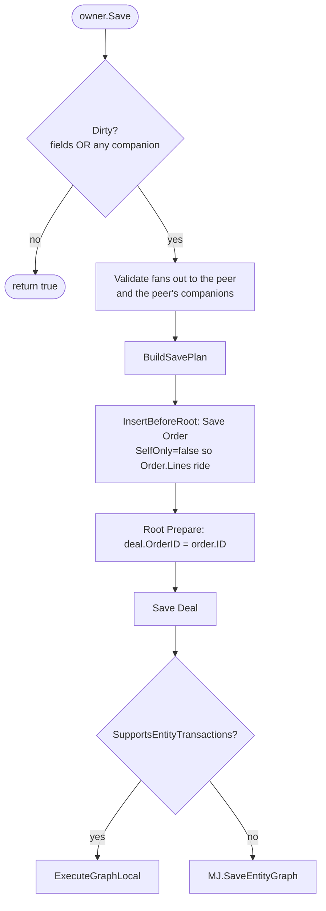

# Embedded Records

> An owner-held 1:1 peer — loaded, validated and persisted as **one unit**, from a
> single `entity.Save()`, on the server *and* in the browser.

This is the third composition axis on `BaseEntity`. IS-A is *vertical* (shared
primary key, table-per-type). Related-record collections are *horizontal 1:N*
(FK on the related row, pointing up). An embedded record is *horizontal 1:1*
with the FK on **this** record, pointing down.

```ts
const deal = await md.GetEntityObject<DealEntity>('Deals');
// GetEntityObject already NewRecord()'d. If OrderID is required, the object exists.
deal.OrderID_Object.OrderDate = new Date('2002-01-01');
await deal.OrderID_Object.Lines.Create();
await deal.Save(); // Order + Lines + stamped Deal.OrderID, one transaction
```

A Deal is not an Order. They do not share a primary key. The order is a
first-class document in another bounded context. Embedding means "this peer
rides my save", not "this peer is a kind of me".

---

## 1. The three axes

| | IS-A | Related-record collection | Embedded record |
|---|---|---|---|
| MJ vocabulary | `ChildEntities`, `IsChildType` | `DeclareRelatedRecords` | `DeclareEmbeddedRecord` |
| Primary key | **Shared** | Its own | Its own |
| Cardinality | At most one per parent | Many | At most one |
| Join | Same PK | FK **on the related row** | FK **on the owner** |
| Save order | Root → leaf | Owner first, stamp child's FK | **Peer first**, stamp owner's FK, then owner |
| Declared by | `Entity.ParentID` | `EntityRelationship.RelatedRecordCollection` | **`EntityField.EmbeddedRecord`** |
| Default-on? | Schema-driven | Opt-in | **Opt-in** — use sparingly |

**The word "child" means IS-A subtype and nothing else.** FK dependents that
point at you are related records. A peer you point at is an embedded record.

See [IS-A Relationships](./isa-relationships.md) and
[Related-Record Collections](./related-record-collections.md).

---

## 2. Public API

Callers never hold the companion. They see the entity:

```ts
deal.OrderID_Object            // T | null   (T when the FK is NOT NULL)
deal.OrderID_EnsureObject()    // T — sync, idempotent
```

`GetEntityObject` is already async and already calls `NewRecord()` on the
create path. `NewRecord()` itself stays **synchronous**. Required FKs
(`AllowsNull = false`) are provisioned there, so this is valid immediately:

```ts
const deal = await md.GetEntityObject<DealEntity>('Deals');
deal.OrderID_Object.OrderDate = new Date('2002-01-01');
```

Nullable FKs stay `null` until you ask:

```ts
if (!deal.QuoteID_Object) {
    deal.QuoteID_EnsureObject(); // sync
}
deal.QuoteID_Object.ValidUntil = nextWeek;
```

`Load()` does not resolve until the owner row **and** every provisioned
embedded (and that record's own `Load()` work — IS-A chain, immediate
companions, nested embeddeds) have finished. Explicit related-record
collections on the peer (`Order.Lines`) stay explicit unless you set
`LoadNested: 'related'` on the JSON.

`LoadFromData()` / `RunView` never fetch embeddeds. Same N+1 rule as
collections. For a set of owners, load them first, then `Ensure`/`Load` the
peers you actually need — or use `LoadNested: 'related'` only on the
single-record path.

---

## 3. Declaring one

### Metadata (preferred)

Set `EntityField.EmbeddedRecord` on the **FK field** — a JSONType blob
shaped like `IEmbeddedRecordConfig`. CodeGen emits the getter and Ensure
method onto the generated class.

```jsonc
// EntityField Deals.OrderID
{
  "OnClear": "orphan",
  "LoadNested": "inherit"
}
```

`RelatedEntity` and the FK name are **not** in the JSON. They are
`RelatedEntityID` and `Name` on the same row. `AllowsNull` on the same row
decides provision. Null blob = today's ordinary FK.

Property names are mechanical: `{FieldName}_Object`, `{FieldName}_EnsureObject`.

### Code

On a shared (client + server) subclass:

```ts
public readonly OrderEmb = this.DeclareEmbeddedRecord<OrderHeaderEntity>({
    ForeignKeyField: 'OrderID',
    RelatedEntity: 'MJ_BizApps_Orders: Order Headers',
    OnClear: 'orphan',
});

public get OrderID_Object(): OrderHeaderEntity | null {
    return this.OrderEmb.Value;
}
public OrderID_EnsureObject(): OrderHeaderEntity {
    return this.OrderEmb.Ensure();
}
```

---

## 4. Save and delete



A clean owner with a dirty peer still saves — `Dirty` rolls up. A header-only
edit on a clean peer stays a single-node plan.

The graph executor's recursion guard is **private** on `BaseEntity`. If you
need to write collections yourself after preparing them (pricing, expansion,
sequence) but still persist the embeds with the header, pass
`SkipRelatedCollections: true` instead:

```ts
await order.Save({ SkipRelatedCollections: true });
// InitialPaymentDetail rode the graph. Lines did not — write them next.
```

The result graph always serializes an exposed peer, even when it is clean.
Request serialize still omits it so a header-only edit stays cheap; result
serialize is what lets the browser mark the peer saved. Without that, the
next `Save()` re-sends `IsNew: true` and the server re-INSERTs the same UUID.

`OnClear` (default `'orphan'`):

| | On owner Save | On owner Delete |
|---|---|---|
| `'orphan'` | Null the FK. Leave the peer. | Leave the peer. |
| `'delete'` | Null the FK, save owner, then delete the peer. | Delete owner, then delete the peer. |
| `'refuse'` | `Clear()` throws. | — |

Default is `'orphan'` because the target is typically a first-class document
(an order, an invoice). Deleting a deal must not delete the order unless you
opt in.

The wire payload is recursive. An embedded order ships its own `Companions`
(Lines, Charges, promotion codes) so a browser `deal.Save()` does not drop
the order graph. Request vs result deserialize modes match collections:
inbound requests `InnerLoad` existing rows first; results adopt verbatim.

---

## 5. Construct cost

Every `GetEntityObject` of an owner that declares an embed constructs the
peer instance (ClassFactory + Config + IS-A parents) even when the FK is
null. That is the price of a sync getter and a sync `Ensure`. It is
**opt-in** — only fields with a non-null `EmbeddedRecord` blob pay it. Use
it on conversion-shaped, low-volume relationships (Deal → Order), not on
every lookup (`CustomerID`, `CategoryID`).

Construction walks nested embeds of **different** entities, so a required
nested FK on a brand-new peer is provisioned when the owner `NewRecord()`s
(and `peer.Nested_EnsureObject()` does not throw). Self-FKs and A→B→A
cycles still construct one extra level — the path set skips the entity
already being built. `Load()` inherit uses a separate `entityName:PK` set
and **throws** on a self-parented or mutually-referential row rather than
walking until the stack dies.

### Collection items

An embed declared **on a collection item** (e.g. `Order.Lines[i].TaxDetailID`)
does not ride `RelatedRecordCollectionWire`. Items carry `{Fields, IsNew}`
only, in both directions. The peer persists on a **server-tier**
`header.Save()` (in-process graph) but is silently dropped over GraphQL.
Re-attach by setting the item's FK, or save the item as its own root. A
runtime warning is logged when a dirty item embed would be omitted from
the wire.

---

## 6. Cross-package types

CodeGen resolves the peer class via `entityPackageName` (schema → npm
package). A peer in the same generated file needs no import. Sales already
depends on `@mj-biz-apps/orders-entities`; CodeGen emits

```ts
import { mjBizAppsOrdersOrderHeaderEntity } from '@mj-biz-apps/orders-entities';
```

Runtime is still `ClassFactory` — the browser gets `OrderHeaderEntity`, the
server gets `OrderEntityServer`. The TypeScript type is the generated class
(which already has `Lines`). A covariant getter on an app subclass can
tighten it.

---

## See also

- [Related-Record Collections](./related-record-collections.md)
- [IS-A Relationships](./isa-relationships.md)
- [Transactions & Batching](../../../guides/TRANSACTIONS_AND_BATCHING_GUIDE.md)
- [Plan](../../../plans/embedded-records.md)
