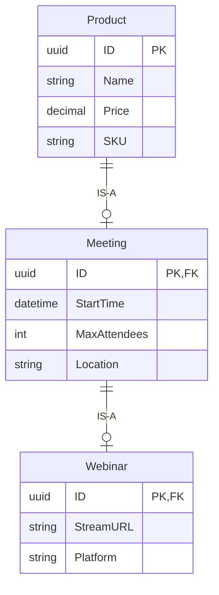
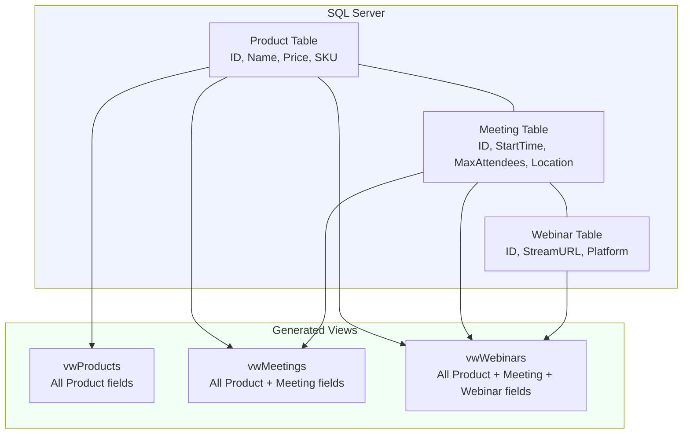
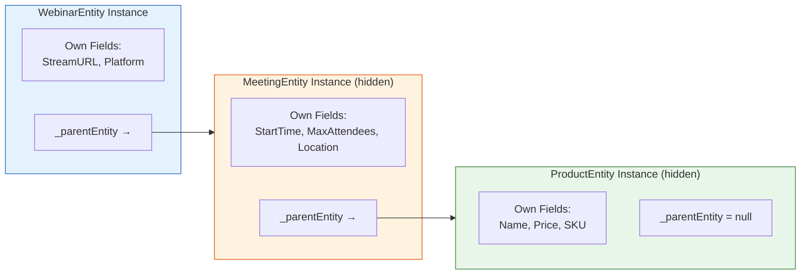
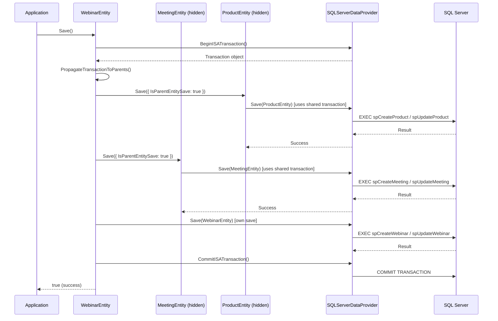
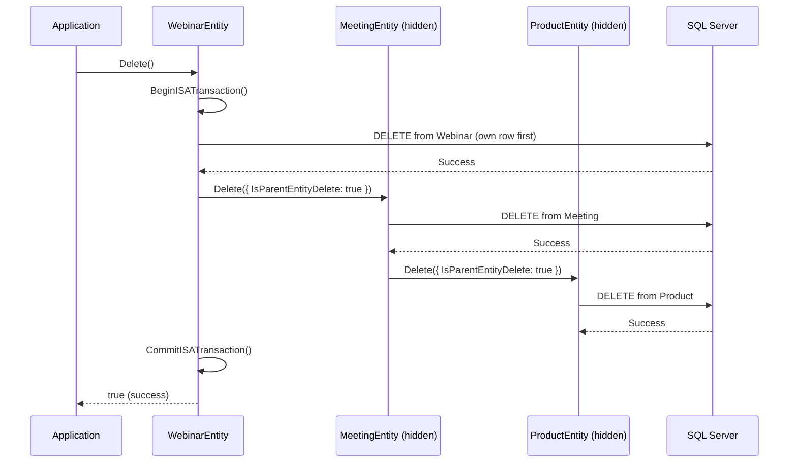
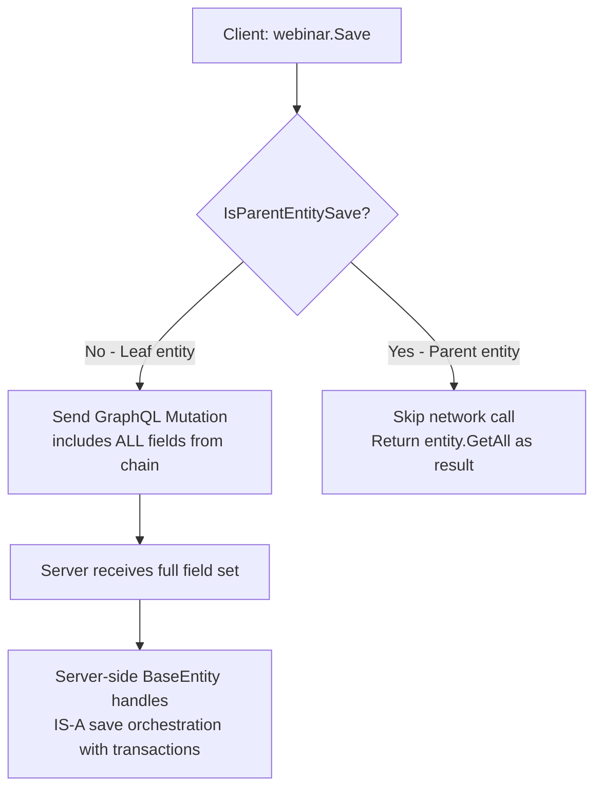

# IS-A Type Relationships in MemberJunction

> **Package**: [@memberjunction/core](../readme.md)
> **Related Guides**: [Virtual Entities](./virtual-entities.md) | [RunQuery Pagination](./runquery-pagination.md)
> **Related Packages**: [@memberjunction/codegen-lib](../../CodeGenLib/README.md) | [@memberjunction/sqlserver-dataprovider](../../SQLServerDataProvider/README.md) | [@memberjunction/graphql-dataprovider](../../GraphQLDataProvider/README.md) | [@memberjunction/ng-core-entity-forms](../../Angular/Explorer/core-entity-forms/README.md)

## Overview

IS-A (Table-Per-Type) relationships enable **entity type inheritance** in MemberJunction. A child entity "IS-A" parent entity — it shares the parent's primary key and inherits all parent fields. This models real-world hierarchies like "a Meeting IS-A Product" or "a Webinar IS-A Meeting IS-A Product".



**Key principles:**
- Child entity shares parent's **primary key** (same UUID)
- Child entity's view includes **all** parent fields via JOINs
- Child entity's table contains **only** its own unique fields
- All IS-A orchestration is handled in `BaseEntity` — no generated subclass code needed

## Architecture

### Data Model



### Entity Metadata

IS-A relationships are stored using the `Entity.ParentID` column:

```
Entity: Product    → ParentID: null     (root)
Entity: Meeting    → ParentID: Product  (child of Product)
Entity: Webinar    → ParentID: Meeting  (child of Meeting, grandchild of Product)
```

### Runtime Object Model



When you work with a `WebinarEntity`:
- `webinar.Set('StreamURL', '...')` → sets on Webinar's own fields
- `webinar.Set('Name', '...')` → routes to `_parentEntity._parentEntity.Set('Name', ...)`
- `webinar.Get('Price')` → returns from ProductEntity (authoritative source)
- `webinar.Save()` → saves Product first, then Meeting, then Webinar (in a transaction)

## EntityInfo Computed Properties

`EntityInfo` (in `entityInfo.ts`) provides these computed properties for IS-A:

```typescript
import { Metadata } from '@memberjunction/core';

const md = new Metadata();
const meeting = md.EntityByName('Meetings');

// IS-A hierarchy detection
meeting.IsChildType;    // true — has ParentID
meeting.IsParentType;   // true — has child entities (Webinars)

// Navigation
meeting.ParentEntity;   // EntityInfo for 'Products'
meeting.ChildEntities;  // [EntityInfo for 'Webinars']
meeting.ParentChain;    // [EntityInfo for 'Products'] (ordered: immediate parent first)

// Field access
meeting.AllParentFields;       // EntityFieldInfo[] — all inherited fields (Name, Price, SKU)
meeting.ParentEntityFieldNames; // Set<string> — cached set of parent field names for routing
```

### Property Reference

| Property | Type | Description |
|----------|------|-------------|
| `ParentEntity` | `EntityInfo \| null` | Immediate parent entity (null for root entities) |
| `ChildEntities` | `EntityInfo[]` | Direct child entities |
| `ParentChain` | `EntityInfo[]` | All ancestors, immediate parent first |
| `IsChildType` | `boolean` | `true` if `ParentID` is set |
| `IsParentType` | `boolean` | `true` if any child entities exist |
| `AllParentFields` | `EntityFieldInfo[]` | All non-PK, non-timestamp fields from parent chain |
| `ParentEntityFieldNames` | `Set<string>` | Cached set of parent field names (for fast lookup) |

## BaseEntity IS-A Orchestration

### Set/Get Routing

When a child entity has `_parentEntity`, field access is automatically routed:

```typescript
// These methods in BaseEntity handle routing transparently:

// Set() — routes parent fields to _parentEntity, mirrors locally for UI
webinar.Set('Name', 'Tech Conference');
// → Sets on _parentEntity._parentEntity (ProductEntity)
// → Also mirrors value on Webinar's local field (for UI binding)

// Get() — returns from authoritative source
webinar.Get('Name');
// → Returns from ProductEntity (authoritative, not the local mirror)

// SetMany() — splits fields between own and parent
webinar.SetMany({ Name: 'Conf', StreamURL: 'https://...' });
// → 'Name' routes to parent chain
// → 'StreamURL' stays on Webinar

// GetAll() — merges all levels
webinar.GetAll();
// → Returns { ID, Name, Price, SKU, StartTime, MaxAttendees, Location, StreamURL, Platform }
```

### Dirty Tracking

```typescript
// Dirty includes parent chain
webinar.Set('Name', 'New Name');  // Modifies Product field
webinar.Dirty;  // true — because _parentEntity._parentEntity is dirty

// Revert cascades through chain
webinar.Revert();  // Reverts Webinar + Meeting + Product
```

### Validation

```typescript
const result = webinar.Validate();
// Runs validation on:
// 1. Product fields (via _parentEntity._parentEntity.Validate())
// 2. Meeting fields (via _parentEntity.Validate())
// 3. Webinar's own fields
// All errors merged into single ValidationResult
```

### Save Orchestration



**Save order:** Parent → ... → Child (Product first, then Meeting, then Webinar)

**On failure:** The entire transaction is rolled back — no partial saves.

### Delete Orchestration



**Delete order:** Child → ... → Parent (Webinar first, then Meeting, then Product)

This order is required because of foreign key constraints — the child row references the parent row.

### Parent Delete Protection

If you try to delete a Product that has a Meeting record:

```typescript
const product = await md.GetEntityObject<ProductEntity>('Products');
await product.InnerLoad(someId);
await product.Delete();
// Error: "Cannot delete Products record — child record exists in Meetings.
//         Delete the child record first, or enable CascadeDeletes on Products."
```

With `CascadeDeletes = true` on the entity, child records are automatically deleted first.

### Disjoint Subtype Enforcement

MemberJunction enforces **disjoint subtypes** by default — a parent record can only be ONE child type at a time. If a Product ID already exists as a Meeting, attempting to create a Publication with the same ID will fail:

```typescript
// Product #123 already exists as a Meeting
const pub = await md.GetEntityObject('Publications');
pub.NewRecord();
pub.Set('ID', '123');  // Same ID as existing Meeting
await pub.Save();
// Error: "Disjoint subtype violation: ID '123' already exists in sibling
//         entity 'Meetings'. An entity can only be one child type."
```

## NewRecord & ID Propagation

When creating a new IS-A child record, the UUID is automatically shared across the entire chain:

```typescript
const webinar = await md.GetEntityObject<WebinarEntity>('Webinars');
webinar.NewRecord();
// Internally:
// 1. Webinar generates UUID (e.g., 'abc-123')
// 2. Calls _parentEntity.NewRecord() → Meeting generates its own UUID
// 3. Propagates Webinar's ID to Meeting: meeting.Set('ID', 'abc-123')
// 4. Meeting calls _parentEntity.NewRecord() → Product generates UUID
// 5. Propagates Meeting's ID to Product: product.Set('ID', 'abc-123')
// Result: All three entities share 'abc-123' as their primary key
```

## Provider Implementation

### SQLServerDataProvider

Implements IS-A transaction methods:

```typescript
// These methods create independent SQL Server transactions
async BeginISATransaction(): Promise<sql.Transaction>
async CommitISATransaction(txn: sql.Transaction): Promise<void>
async RollbackISATransaction(txn: sql.Transaction): Promise<void>
```

The transaction is propagated to each entity in the chain via `entity.ProviderTransaction`, ensuring all SPs execute within the same database transaction.

### GraphQLDataProvider (Client-Side)

On the client, only the **leaf entity** sends a network request. Parent entity saves are handled by `BaseEntity._InnerSave()` which runs the full ORM pipeline (validation, events) but skips the actual network call when `options.IsParentEntitySave === true`:



## CodeGen Integration

### View Generation

For IS-A child entities, CodeGen generates views with parent JOINs:

```sql
-- Generated view for Meetings (child of Products)
CREATE VIEW [dbo].[vwMeetings] AS
SELECT
    m.*,                          -- Meeting's own columns
    p.[Name], p.[Price], p.[SKU]  -- Product's columns via JOIN
FROM
    [dbo].[Meeting] m
INNER JOIN
    [dbo].[Product] p ON m.[ID] = p.[ID]  -- PK-to-PK join
```

### SP Generation

Stored procedures only include the child entity's own table columns:

```sql
-- spCreateMeeting only has Meeting-specific parameters
CREATE PROCEDURE [dbo].[spCreateMeeting]
    @ID uniqueidentifier,
    @StartTime datetime,
    @MaxAttendees int,
    @Location nvarchar(255)
AS
    INSERT INTO [dbo].[Meeting] (ID, StartTime, MaxAttendees, Location)
    VALUES (@ID, @StartTime, @MaxAttendees, @Location);

    SELECT * FROM [dbo].[vwMeetings] WHERE ID = @ID  -- Returns ALL fields including parent
```

### GraphQL Input Types

Input types include parent chain fields so the client can send everything in one mutation:

```graphql
input CreateMeetingInput {
  # Meeting's own fields
  StartTime: DateTime!
  MaxAttendees: Int
  Location: String

  # Inherited from Product (IS-A parent)
  Name: String!
  Price: Float
  SKU: String
}
```

### Entity Class Generation

Generated TypeScript classes include typed accessors for parent fields with JSDoc annotations:

```typescript
export class MeetingEntity extends BaseEntity<MeetingEntity> {
    // Own fields
    get StartTime(): Date { return this.Get('StartTime'); }
    set StartTime(value: Date) { this.Set('StartTime', value); }

    /**
     * IS-A Source: Inherited from Products
     */
    get Name(): string { return this.Get('Name'); }
    set Name(value: string) { this.Set('Name', value); }

    /**
     * IS-A Source: Inherited from Products
     */
    get Price(): number | null { return this.Get('Price'); }
    set Price(value: number | null) { this.Set('Price', value); }
}
```

### Metadata Sync

`manageParentEntityFields()` in CodeGen creates virtual `EntityField` records for inherited fields:

- `IsVirtual = true` — field doesn't exist in child's own table
- `AllowUpdateAPI = true` — distinguishes IS-A parent fields from computed view fields
- Type, Length, Precision, Scale, AllowsNull — copied from parent field

**Collision detection:** If a child table has a column with the same name as a parent field, CodeGen logs a HARD ERROR and skips that entity.

## UI Integration

The enhanced Entity form in `core-entity-forms` displays IS-A information:

### Badges
- **IS-A Child** badge (blue): "IS-A Products" with link to parent
- **Parent Type** badge (green): "2 child types" for entities with children
- **Virtual Entity** badge (purple): For virtual entities (unrelated but co-displayed)

### IS-A Breadcrumb
Shows the full inheritance chain: `[Webinar] IS-A [Meeting] IS-A [Product]`

### Field Source Inspector
Expandable panel showing which fields come from which level:
- **Own fields** (blue tint): Fields defined on this entity's table
- **Inherited fields** (indigo tint): Fields from each parent, grouped by source

### Child Types Panel
Lists all child entities with live record counts (loaded asynchronously).

## Setting Up IS-A Relationships

### Step 1: Create Tables

```sql
-- Parent table
CREATE TABLE [dbo].[Product] (
    ID UNIQUEIDENTIFIER NOT NULL DEFAULT NEWSEQUENTIALID(),
    Name NVARCHAR(255) NOT NULL,
    Price DECIMAL(18,2),
    SKU NVARCHAR(50),
    CONSTRAINT PK_Product PRIMARY KEY (ID)
);

-- Child table — same PK type, FK to parent
CREATE TABLE [dbo].[Meeting] (
    ID UNIQUEIDENTIFIER NOT NULL,
    StartTime DATETIME NOT NULL,
    MaxAttendees INT,
    Location NVARCHAR(255),
    CONSTRAINT PK_Meeting PRIMARY KEY (ID),
    CONSTRAINT FK_Meeting_Product FOREIGN KEY (ID) REFERENCES [dbo].[Product](ID)
);
```

### Step 2: Set ParentID

After running CodeGen to create the entity metadata, set the `ParentID`:

```sql
UPDATE [__mj].[Entity]
SET ParentID = (SELECT ID FROM [__mj].[Entity] WHERE Name = 'Products')
WHERE Name = 'Meetings';
```

### Step 3: Run CodeGen Again

CodeGen will now:
1. Create virtual EntityField records for inherited fields
2. Generate the view with parent JOINs
3. Generate SPs with only the child's own columns
4. Generate GraphQL input types with parent fields
5. Generate TypeScript class with parent field accessors

## API Reference

### EntitySaveOptions (Extended)

```typescript
class EntitySaveOptions {
    IsParentEntitySave?: boolean;  // NEW: Signals this is an IS-A parent save
    IgnoreDirtyState: boolean;
    SkipEntityAIActions?: boolean;
    SkipEntityActions?: boolean;
    ReplayOnly?: boolean;
}
```

### EntityDeleteOptions (Extended)

```typescript
class EntityDeleteOptions {
    IsParentEntityDelete?: boolean;  // NEW: Signals this is an IS-A parent delete
    SkipEntityAIActions?: boolean;
    SkipEntityActions?: boolean;
    ReplayOnly?: boolean;
}
```

### IEntityDataProvider (Extended)

```typescript
interface IEntityDataProvider {
    // Existing methods...
    Load(entity, key, relations, user): Promise<{}>
    Save(entity, user, options): Promise<{}>
    Delete(entity, options, user): Promise<boolean>

    // NEW: IS-A transaction methods (optional)
    BeginISATransaction?(): Promise<unknown>
    CommitISATransaction?(txn: unknown): Promise<void>
    RollbackISATransaction?(txn: unknown): Promise<void>
}
```

### BaseEntity Properties

```typescript
class BaseEntity {
    // NEW: IS-A parent entity reference
    get ISAParentEntity(): BaseEntity | null;

    // NEW: Transaction handle for IS-A operations
    ProviderTransaction: unknown;
}
```

## Troubleshooting

| Issue | Cause | Solution |
|-------|-------|----------|
| Parent fields not appearing in view | `ParentID` not set on entity | Set `Entity.ParentID` to parent entity's ID |
| "Field collision" error in CodeGen | Child table has column with same name as parent field | Rename the child column to avoid conflict |
| Disjoint violation on save | Same ID exists in a sibling child entity | Each record can only be one child type |
| Save fails with rollback | Parent entity validation failed | Check parent entity field requirements |
| Delete blocked on parent | Child records exist | Delete children first or enable `CascadeDeletes` |
| `_parentEntity` is null | Entity not properly initialized | Ensure `GetEntityObject()` is used (not direct constructor) |
