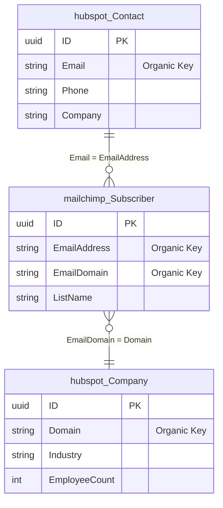

# Organic Keys in MemberJunction

> **Package**: [@memberjunction/core](../readme.md)
> **Related Guides**: [IS-A Relationships](./isa-relationships.md) | [Virtual Entities](./virtual-entities.md)
> **Related Packages**: [@memberjunction/codegen-lib](../../CodeGenLib/README.md) | [@memberjunction/ng-base-forms](../../Angular/Generic/base-forms/README.md) | [@memberjunction/ng-entity-viewer](../../Angular/Generic/entity-viewer/README.md) | [@memberjunction/ng-core-entity-forms](../../Angular/Explorer/core-entity-forms/README.md)

## Overview

**Organic Keys** are a MemberJunction concept for establishing cross-entity relationships based on shared business data (email addresses, phone numbers, tax IDs, domain names, etc.) rather than foreign key references. This enables automatic "related records" views across integration boundaries — for example, showing a CRM Contact's Mailchimp campaigns, QuickBooks invoices, and Zendesk tickets on their form, matched by email address.

### Why Not Foreign Keys?

Foreign keys work beautifully within a single system. But when MemberJunction integrates with external platforms (Mailchimp, QuickBooks, Salesforce, HubSpot, etc.), the external data arrives with its own IDs and schemas. There is no FK from `MailchimpSubscriber.EmailAddress` to `HubspotContact.Email` — only a shared business value. Organic keys formalize this pattern.



### Design Principles

1. **Separation of concerns** — Organic keys are a distinct system from FK-based `EntityRelationship`. No modifications to existing relationship infrastructure.
2. **Metadata-driven** — All configuration lives in MJ metadata tables. No hardcoded entity names or field mappings.
3. **Transitive via SQL views** — When the match requires hopping through intermediate tables, developers create a SQL view that encapsulates the join logic. The organic key system references the view — it doesn't model multi-hop traversal itself.
4. **Minimal table count** — 2 new tables total: `EntityOrganicKey` and `EntityOrganicKeyRelatedEntity`.
5. **Runtime reuse** — Organic key tabs render using the existing `EntityDataGrid` component with no modifications. Only the filter construction is new.
6. **Bidirectional** — Configure organic keys on both sides to enable viewing related records from either direction.

---

## Schema

### EntityOrganicKey

Defines an organic key on an entity — the set of fields that constitute a natural identifier for cross-system matching.

| Column | Type | Description |
|--------|------|-------------|
| `ID` | UNIQUEIDENTIFIER | Primary key |
| `EntityID` | UNIQUEIDENTIFIER | FK to Entity. The entity that owns this organic key. |
| `Name` | NVARCHAR(255) | Human-readable label (e.g., "Email Match", "Domain Match"). Unique per entity. |
| `Description` | NVARCHAR(MAX) | Optional explanation of the key's purpose. |
| `MatchFieldNames` | NVARCHAR(500) | Comma-delimited field names that constitute the key. Single value for simple keys (`"Email"`), multiple for compound keys (`"FirstName,LastName,DateOfBirth"`). |
| `NormalizationStrategy` | NVARCHAR(50) | How values are normalized before comparison. One of: `LowerCaseTrim`, `Trim`, `ExactMatch`, `Custom`. Default: `LowerCaseTrim`. |
| `CustomNormalizationExpression` | NVARCHAR(MAX) | SQL expression template when strategy is `Custom`. Uses `{{FieldName}}` placeholder. |
| `AutoCreateRelatedViewOnForm` | BIT | Reserved for future auto-discovery feature. Default: 0. |
| `Sequence` | INT | Ordering when an entity has multiple organic keys. Lower = higher priority. |
| `Status` | NVARCHAR(20) | `Active` or `Disabled`. Disabled keys are ignored at runtime. |

### EntityOrganicKeyRelatedEntity

Maps a related entity to an organic key, defining how records are matched.

| Column | Type | Description |
|--------|------|-------------|
| `ID` | UNIQUEIDENTIFIER | Primary key |
| `EntityOrganicKeyID` | UNIQUEIDENTIFIER | FK to EntityOrganicKey. |
| `RelatedEntityID` | UNIQUEIDENTIFIER | FK to Entity. The entity whose records will be displayed. |
| **Direct match:** | | |
| `RelatedEntityFieldNames` | NVARCHAR(500) | Comma-delimited field names in the related entity, positionally matching `MatchFieldNames`. NULL for transitive matches. |
| **Transitive match:** | | |
| `TransitiveObjectName` | NVARCHAR(500) | Schema-qualified name of a SQL view/table that bridges to the related entity. |
| `TransitiveObjectMatchFieldNames` | NVARCHAR(500) | Fields in the bridge object matching the organic key values. |
| `TransitiveObjectOutputFieldName` | NVARCHAR(255) | Field in the bridge object that produces the join value. |
| `RelatedEntityJoinFieldName` | NVARCHAR(255) | Field in the related entity matching the bridge output. |
| **Display:** | | |
| `DisplayName` | NVARCHAR(255) | Tab/section label override. Defaults to the related entity's display name. |
| `DisplayLocation` | NVARCHAR(50) | `After Field Tabs` (default) or `Before Field Tabs`. |
| `Sequence` | INT | Ordering within this organic key's related entities. |

**Constraint**: Exactly one of direct or transitive matching must be configured. The `CK_EOKRE_MatchMode` CHECK constraint enforces this.

---

## Query Generation Patterns

The `EntityInfo.BuildOrganicKeyViewParams()` static method generates `RunViewParams` for all four matching patterns. The generated SQL is passed to `RunView` as `ExtraFilter`.

### Pattern 1: Direct Match (Simple Key)

**Config**: HubspotContact.Email → MailchimpSubscriber.EmailAddress

**Generated filter** (when viewing Contact with Email = `'John@Acme.com'`):

```sql
LOWER(LTRIM(RTRIM([EmailAddress]))) = LOWER(LTRIM(RTRIM('John@Acme.com')))
```

### Pattern 2: Direct Match (Compound Key)

**Config**: Contact.(FirstName, LastName, DOB) → HREmployees.(First, Last, DateOfBirth)

**Generated filter**:

```sql
LOWER(LTRIM(RTRIM([First]))) = LOWER(LTRIM(RTRIM('John')))
AND LOWER(LTRIM(RTRIM([Last]))) = LOWER(LTRIM(RTRIM('Doe')))
AND LOWER(LTRIM(RTRIM([DateOfBirth]))) = LOWER(LTRIM(RTRIM('1990-01-15')))
```

### Pattern 3: Transitive Match (Via SQL View)

**Scenario**: Show CampaignSends on a Contact form. CampaignSend has no email field — it links through Subscriber.

**Bridge view**:

```sql
CREATE VIEW mailchimp.vwSubscriberCampaignSendBridge AS
SELECT
    s.EmailAddress,
    cs.ID AS CampaignSendID
FROM mailchimp.Subscriber s
INNER JOIN mailchimp.CampaignSend cs ON cs.SubscriberID = s.ID;
```

**Generated filter**:

```sql
[ID] IN (
    SELECT [CampaignSendID]
    FROM [mailchimp].[vwSubscriberCampaignSendBridge]
    WHERE LOWER(LTRIM(RTRIM([EmailAddress]))) = LOWER(LTRIM(RTRIM('john@acme.com')))
)
```

### Pattern 4: Compound + Transitive Combo

Bridge view with multiple match fields — same subquery pattern with AND conditions inside the WHERE clause.

---

## Normalization Strategies

| Strategy | SQL Expression | Use Case |
|----------|---------------|----------|
| `LowerCaseTrim` | `LOWER(LTRIM(RTRIM(x)))` | Email, names — default |
| `Trim` | `LTRIM(RTRIM(x))` | Case-sensitive IDs, codes |
| `ExactMatch` | `x` (no transformation) | Binary data, pre-normalized values |
| `Custom` | Uses `CustomNormalizationExpression` | Phone numbers, SSNs, any custom pattern |

**Custom expression example** (phone normalization):

```
CustomNormalizationExpression: "REPLACE(REPLACE(REPLACE({{FieldName}}, '-', ''), ' ', ''), '(', '')"
```

Applied to both sides of the comparison — both the field reference and the literal value get the same transformation.

---

## Runtime Architecture

### Core Classes

#### EntityOrganicKeyInfo

Metadata container for an organic key. Located in `entityInfo.ts`.

```typescript
import { EntityOrganicKeyInfo } from '@memberjunction/core';

// Access organic keys from EntityInfo
const entity = metadata.Entities.find(e => e.Name === 'Contacts');
const organicKeys = entity.OrganicKeys; // EntityOrganicKeyInfo[]

for (const ok of organicKeys) {
    console.log(ok.Name);                    // "Email Match"
    console.log(ok.MatchFieldNamesArray);    // ["EmailAddress"]
    console.log(ok.NormalizationStrategy);   // "LowerCaseTrim"
    console.log(ok.RelatedEntities.length);  // 2
}
```

Key properties:
- `MatchFieldNamesArray: string[]` — Parsed field names (from comma-delimited string)
- `RelatedEntities: EntityOrganicKeyRelatedEntityInfo[]` — Sorted by Sequence
- `Status: 'Active' | 'Disabled'` — Only active keys are loaded at runtime

#### EntityOrganicKeyRelatedEntityInfo

Metadata for a single related entity target within an organic key.

```typescript
const relatedEntity = organicKey.RelatedEntities[0];

console.log(relatedEntity.IsDirectMatch);      // true
console.log(relatedEntity.IsTransitiveMatch);  // false
console.log(relatedEntity.RelatedEntity);      // "Mailchimp Subscribers" (virtual field from view)
console.log(relatedEntity.DisplayName);        // "Mailchimp Subscriptions" (or null for default)
```

Key properties:
- `IsDirectMatch: boolean` — True when `RelatedEntityFieldNames` is set
- `IsTransitiveMatch: boolean` — True when `TransitiveObjectName` is set
- `RelatedEntityFieldNamesArray: string[]` — Parsed direct match field names
- `TransitiveObjectMatchFieldNamesArray: string[]` — Parsed transitive match field names

#### EntityInfo.BuildOrganicKeyViewParams()

Static method that generates `RunViewParams` for querying related records via an organic key.

```typescript
import { EntityInfo, RunViewParams } from '@memberjunction/core';

const params: RunViewParams = EntityInfo.BuildOrganicKeyViewParams(
    record,              // BaseEntity — the current record
    relatedEntityInfo,   // EntityOrganicKeyRelatedEntityInfo
    organicKeyInfo,      // EntityOrganicKeyInfo
    filter?,             // Optional additional SQL filter (ANDed)
    maxRecords?          // Optional row limit
);

// params.EntityName = "Mailchimp Subscribers"
// params.ExtraFilter = "LOWER(LTRIM(RTRIM([EmailAddress]))) = LOWER(LTRIM(RTRIM('john@acme.com')))"
```

**Safety features**:
- SQL injection protection via single-quote escaping
- NULL field values return `1=0` (no matches) instead of generating invalid SQL
- Schema-qualified transitive object names are bracket-quoted per part: `[mailchimp].[vwBridge]`

### Metadata Loading

Organic key data is loaded as part of the MJ_Metadata dataset at server startup. Two dataset items fetch all `EntityOrganicKey` and `EntityOrganicKeyRelatedEntity` records. During `PostProcessEntityMetadata`, the data is:

1. Related entities are linked to their parent organic keys by `EntityOrganicKeyID`
2. Only `Active` organic keys are attached to their owning `EntityInfo`
3. Available via `entityInfo.OrganicKeys` from that point forward

No additional database queries are needed at runtime — the organic key metadata is cached alongside all other entity metadata.

---

## Angular UI Integration

### Form Panels (CodeGen-Generated)

When CodeGen generates Angular form templates, it calls `generateOrganicKeyTabs()` for each entity. If the entity has organic keys with related entities configured, CodeGen emits collapsible panels:

```html
<!-- Organic Key: Email Match → Mailchimp Subscriptions Section -->
<mj-collapsible-panel
    SectionKey="organicEmailMatchMailchimpSubscriptions"
    SectionName="Mailchimp Subscriptions"
    Icon="fa-solid fa-paper-plane"
    Variant="related-entity"
    [Form]="this"
    [FormContext]="formContext"
    [BadgeCount]="GetSectionRowCount('organicEmailMatchMailchimpSubscriptions')"
    [DefaultExpanded]="false">
    @if (record.IsSaved) {
    <div>
        <mj-explorer-entity-data-grid
            [Params]="BuildOrganicKeyViewParamsByNames('Email Match','Mailchimp Subscribers')"
            [AllowLoad]="IsSectionExpanded('organicEmailMatchMailchimpSubscriptions')"
            [ShowToolbar]="false"
            (Navigate)="OnFormNavigate($event)"
            (AfterDataLoad)="SetSectionRowCount('organicEmailMatchMailchimpSubscriptions', $event.totalRowCount)">
        </mj-explorer-entity-data-grid>
    </div>
    }
</mj-collapsible-panel>
```

**Key behaviors**:
- **Lazy loading**: Grid data only loads when the section is expanded
- **Badge counts**: Row count appears in the panel header badge after data loads
- **Display location**: Respects `DisplayLocation` setting (Before/After Field Tabs)
- **Reuses existing components**: Same `EntityDataGrid` used for FK relationship panels

### BaseFormComponent Helpers

The `BaseFormComponent` class provides helper methods for organic key data access:

```typescript
// Check if entity has organic keys
if (this.HasOrganicKeys) { ... }

// Access all organic keys
const keys = this.OrganicKeys; // EntityOrganicKeyInfo[]

// Build view params by key name and related entity name
const params = this.BuildOrganicKeyViewParamsByNames('Email Match', 'Mailchimp Subscribers');

// Build view params with full objects
const params = this.BuildOrganicKeyViewParams(relatedEntityInfo, organicKeyInfo);

// Get all organic key related entities (flattened across all keys)
const all = this.AllOrganicKeyRelatedEntities;
// Returns: { OrganicKey: EntityOrganicKeyInfo, RelatedEntity: EntityOrganicKeyRelatedEntityInfo }[]
```

### Entity Record Detail Panel

The entity record detail panel (the slide-out preview when clicking a row in a grid) shows organic key match counts alongside FK relationship counts. When expanded, it loads and displays up to 10 matched records with click-through navigation.

The detail panel uses `EntityInfo.BuildOrganicKeyViewParams()` with a duck-typed record object (since the detail panel works with plain objects, not `BaseEntity` instances).

### Entity Admin Form

The Entity admin form includes an "Organic Keys" section in the navigation rail (fingerprint icon). This section shows:

- **Outgoing**: Organic keys defined on the current entity, with cards showing the key name, normalization strategy, match fields, and each target entity with Direct/Transitive badges
- **Incoming**: Other entities that have organic keys pointing at the current entity
- **Click-through**: Clicking any entity name navigates to that entity's admin form
- **Badge count**: The nav rail shows the total number of organic key connections

All data comes from cached metadata — zero database queries.

---

## CodeGen Integration

### Declarative Configuration via additionalSchemaInfo

The recommended way to set up organic keys is through the `additionalSchemaInfo.json` configuration file. This eliminates the need for manual SQL migrations for organic key metadata.

Add an `OrganicKeys` array to any table configuration:

```json
{
    "hubspot": [
        {
            "TableName": "Contact",
            "OrganicKeys": [
                {
                    "Name": "Email Match",
                    "Description": "Match Hubspot contacts to Mailchimp data by email address",
                    "MatchFieldNames": ["Email"],
                    "NormalizationStrategy": "LowerCaseTrim",
                    "RelatedEntities": [
                        {
                            "SchemaName": "mailchimp",
                            "TableName": "Subscriber",
                            "RelatedFieldNames": ["EmailAddress"],
                            "DisplayName": "Mailchimp Subscriptions"
                        },
                        {
                            "SchemaName": "mailchimp",
                            "TableName": "CampaignSend",
                            "TransitiveView": {
                                "Name": "vwSubscriberCampaignSendBridge",
                                "SchemaName": "mailchimp",
                                "SQL": "SELECT s.EmailAddress, s.EmailDomain, cs.ID AS CampaignSendID FROM mailchimp.Subscriber s INNER JOIN mailchimp.CampaignSend cs ON cs.SubscriberID = s.ID"
                            },
                            "TransitiveMatchFieldNames": ["EmailAddress"],
                            "TransitiveOutputFieldName": "CampaignSendID",
                            "RelatedEntityJoinFieldName": "ID",
                            "DisplayName": "Mailchimp Campaign Sends"
                        }
                    ]
                }
            ]
        }
    ]
}
```

#### Configuration Reference

**OrganicKeyConfig** (per table):

| Field | Type | Required | Default | Description |
|-------|------|----------|---------|-------------|
| `Name` | string | Yes | | Human-readable key name, unique per entity |
| `Description` | string | No | | Explanation of the key's purpose |
| `MatchFieldNames` | string[] | Yes | | Fields on the owning entity that constitute the key |
| `NormalizationStrategy` | string | No | `LowerCaseTrim` | `LowerCaseTrim`, `Trim`, `ExactMatch`, or `Custom` |
| `CustomNormalizationExpression` | string | No | | SQL expression when strategy is `Custom` |
| `Sequence` | number | No | array index | Ordering for multiple keys on one entity |
| `RelatedEntities` | array | Yes | | Target entities to match against |

**OrganicKeyRelatedEntityConfig** (per target):

| Field | Type | Required | Default | Description |
|-------|------|----------|---------|-------------|
| `SchemaName` | string | Yes | | Schema of the related entity |
| `TableName` | string | Yes | | Table name of the related entity |
| `RelatedFieldNames` | string[] | For direct | | Fields in the related entity (positionally aligned with `MatchFieldNames`) |
| `TransitiveObject` | string | For transitive | | Schema-qualified name of existing bridge view/table |
| `TransitiveView` | object | For transitive | | Declarative view definition (CodeGen creates it) |
| `TransitiveMatchFieldNames` | string[] | For transitive | | Fields in the bridge matching the organic key |
| `TransitiveOutputFieldName` | string | For transitive | | Output field joining to the related entity |
| `RelatedEntityJoinFieldName` | string | For transitive | | Field in the related entity matching the output |
| `DisplayName` | string | No | entity name | Tab/section label override |
| `DisplayLocation` | string | No | `After Field Tabs` | `After Field Tabs` or `Before Field Tabs` |
| `Sequence` | number | No | array index | Ordering within the key's targets |

**TransitiveViewConfig** (auto-created bridge view):

| Field | Type | Required | Default | Description |
|-------|------|----------|---------|-------------|
| `Name` | string | Yes | | View name (e.g., `vwSubscriberCampaignSendBridge`) |
| `SchemaName` | string | No | related entity's schema | Schema to create the view in |
| `SQL` | string | Yes | | Raw SQL for the SELECT statement |

#### What CodeGen Does

When `processOrganicKeyConfig()` runs:

1. **Creates transitive views**: If `TransitiveView` is defined, emits `CREATE OR ALTER VIEW` SQL — executed and logged to the CodeGen run file
2. **Upserts `EntityOrganicKey` records**: Matched on `(EntityID, Name)` — creates new or updates existing
3. **Upserts `EntityOrganicKeyRelatedEntity` records**: Matched on `(EntityOrganicKeyID, RelatedEntityID)` — creates new or updates existing
4. **Generates form templates**: `generateOrganicKeyTabs()` reads the metadata and emits collapsible panels with `EntityDataGrid` in the Angular form HTML

All SQL is logged via `LogSQLAndExecute()`, ensuring the CodeGen run SQL file contains a complete, reproducible record for CI/CD pipelines.

---

## End-to-End Setup Guide

This walkthrough creates a complete Hubspot + Mailchimp integration with organic key matching.

### Step 1: Create the Integration Tables

Write a migration that creates your integration schemas and tables:

```sql
-- Create schemas
CREATE SCHEMA hubspot;
CREATE SCHEMA mailchimp;

-- Hubspot Contact
CREATE TABLE hubspot.Contact (
    ID UNIQUEIDENTIFIER NOT NULL DEFAULT NEWSEQUENTIALID(),
    FirstName NVARCHAR(100) NOT NULL,
    LastName NVARCHAR(100) NOT NULL,
    Email NVARCHAR(255) NOT NULL,
    Phone NVARCHAR(50) NULL,
    Company NVARCHAR(255) NULL,
    CONSTRAINT PK_HubspotContact PRIMARY KEY (ID)
);

-- Mailchimp Subscriber
CREATE TABLE mailchimp.Subscriber (
    ID UNIQUEIDENTIFIER NOT NULL DEFAULT NEWSEQUENTIALID(),
    EmailAddress NVARCHAR(255) NOT NULL,
    FirstName NVARCHAR(100) NULL,
    LastName NVARCHAR(100) NULL,
    EmailDomain NVARCHAR(255) NULL,
    ListName NVARCHAR(255) NOT NULL,
    Status NVARCHAR(50) NOT NULL DEFAULT 'Subscribed',
    CONSTRAINT PK_MailchimpSubscriber PRIMARY KEY (ID)
);

-- Mailchimp Campaign
CREATE TABLE mailchimp.Campaign (
    ID UNIQUEIDENTIFIER NOT NULL DEFAULT NEWSEQUENTIALID(),
    Name NVARCHAR(255) NOT NULL,
    Subject NVARCHAR(500) NOT NULL,
    SentAt DATETIME2 NULL,
    Status NVARCHAR(50) NOT NULL DEFAULT 'Draft',
    CONSTRAINT PK_MailchimpCampaign PRIMARY KEY (ID)
);

-- Mailchimp CampaignSend (linked to Subscriber and Campaign via FK)
CREATE TABLE mailchimp.CampaignSend (
    ID UNIQUEIDENTIFIER NOT NULL DEFAULT NEWSEQUENTIALID(),
    CampaignID UNIQUEIDENTIFIER NOT NULL,
    SubscriberID UNIQUEIDENTIFIER NOT NULL,
    SentAt DATETIME2 NOT NULL DEFAULT GETUTCDATE(),
    Opened BIT NOT NULL DEFAULT 0,
    Clicked BIT NOT NULL DEFAULT 0,
    CONSTRAINT PK_MailchimpCampaignSend PRIMARY KEY (ID),
    CONSTRAINT FK_CampaignSend_Campaign FOREIGN KEY (CampaignID)
        REFERENCES mailchimp.Campaign(ID),
    CONSTRAINT FK_CampaignSend_Subscriber FOREIGN KEY (SubscriberID)
        REFERENCES mailchimp.Subscriber(ID)
);
```

### Step 2: Configure Organic Keys

Add organic key configuration to your `additionalSchemaInfo.json`:

```json
{
    "hubspot": [
        {
            "TableName": "Contact",
            "OrganicKeys": [
                {
                    "Name": "Email Match",
                    "Description": "Match contacts to Mailchimp data by email",
                    "MatchFieldNames": ["Email"],
                    "RelatedEntities": [
                        {
                            "SchemaName": "mailchimp",
                            "TableName": "Subscriber",
                            "RelatedFieldNames": ["EmailAddress"],
                            "DisplayName": "Mailchimp Subscriptions"
                        },
                        {
                            "SchemaName": "mailchimp",
                            "TableName": "CampaignSend",
                            "TransitiveView": {
                                "Name": "vwSubscriberCampaignSendBridge",
                                "SchemaName": "mailchimp",
                                "SQL": "SELECT s.EmailAddress, cs.ID AS CampaignSendID FROM mailchimp.Subscriber s INNER JOIN mailchimp.CampaignSend cs ON cs.SubscriberID = s.ID"
                            },
                            "TransitiveMatchFieldNames": ["EmailAddress"],
                            "TransitiveOutputFieldName": "CampaignSendID",
                            "RelatedEntityJoinFieldName": "ID",
                            "DisplayName": "Mailchimp Campaign Sends"
                        }
                    ]
                }
            ]
        }
    ],
    "mailchimp": [
        {
            "TableName": "Subscriber",
            "OrganicKeys": [
                {
                    "Name": "Email Match",
                    "MatchFieldNames": ["EmailAddress"],
                    "RelatedEntities": [
                        {
                            "SchemaName": "hubspot",
                            "TableName": "Contact",
                            "RelatedFieldNames": ["Email"],
                            "DisplayName": "Hubspot Contacts"
                        }
                    ]
                }
            ]
        }
    ]
}
```

### Step 3: Run CodeGen

A single CodeGen run handles everything:

1. Discovers the new tables and creates entity metadata
2. Creates the transitive bridge view (`CREATE OR ALTER VIEW`)
3. Inserts organic key metadata records
4. Generates Angular form templates with organic key panels
5. Logs all SQL to the CodeGen run file for CI/CD

```bash
npm run mj -- codegen
```

### Step 4: Verify

Open a Hubspot Contact record in MJExplorer. You should see:
- **Mailchimp Subscriptions** panel — direct match showing subscribers with the same email
- **Mailchimp Campaign Sends** panel — transitive match showing campaign sends via the bridge view

Open a Mailchimp Subscriber record. You should see:
- **Hubspot Contacts** panel — reverse direct match showing contacts with the same email

Open any entity in the Entity admin form. Navigate to the "Organic Keys" section (fingerprint icon) to see all configured organic key relationships.

---

## Advanced Topics

### Bidirectional Matching

Organic keys are unidirectional by default. To enable viewing from both sides, configure organic keys on both entities:

```json
// hubspot.Contact → mailchimp.Subscriber
{ "Name": "Email Match", "MatchFieldNames": ["Email"], ... }

// mailchimp.Subscriber → hubspot.Contact
{ "Name": "Email Match", "MatchFieldNames": ["EmailAddress"], ... }
```

The Entity admin form automatically shows both directions — outgoing keys (defined on the entity) and incoming keys (defined on other entities targeting this one).

### Compound Keys

Match on multiple fields simultaneously:

```json
{
    "Name": "Name + DOB Match",
    "MatchFieldNames": ["FirstName", "LastName", "DateOfBirth"],
    "RelatedEntities": [
        {
            "SchemaName": "hr",
            "TableName": "Employee",
            "RelatedFieldNames": ["First", "Last", "DOB"]
        }
    ]
}
```

Field names are positionally aligned — `FirstName` matches `First`, `LastName` matches `Last`, `DateOfBirth` matches `DOB`.

### Custom Normalization

For fields that need special normalization (phone numbers, SSNs), use the `Custom` strategy with a SQL expression template:

```json
{
    "Name": "Phone Match",
    "MatchFieldNames": ["Phone"],
    "NormalizationStrategy": "Custom",
    "CustomNormalizationExpression": "REPLACE(REPLACE(REPLACE(REPLACE({{FieldName}}, '-', ''), ' ', ''), '(', ''), ')', '')",
    "RelatedEntities": [...]
}
```

The `{{FieldName}}` placeholder is replaced with the column reference on one side and the literal value on the other, ensuring both sides get the same transformation.

### Transitive Matching

When the target entity doesn't have the matching field directly, use a SQL view that bridges through intermediate tables:

```
Contact.Email → Subscriber.EmailAddress → CampaignSend.SubscriberID
```

The bridge view encapsulates this join:

```sql
SELECT s.EmailAddress, cs.ID AS CampaignSendID
FROM mailchimp.Subscriber s
INNER JOIN mailchimp.CampaignSend cs ON cs.SubscriberID = s.ID
```

You can define the view inline in the config (CodeGen creates it) or reference an existing view.

### Multiple Organic Keys Per Entity

An entity can have multiple organic keys with different match strategies:

```json
{
    "TableName": "Subscriber",
    "OrganicKeys": [
        {
            "Name": "Email Match",
            "MatchFieldNames": ["EmailAddress"],
            "Sequence": 0,
            "RelatedEntities": [...]
        },
        {
            "Name": "Domain Match",
            "MatchFieldNames": ["EmailDomain"],
            "Sequence": 1,
            "RelatedEntities": [...]
        }
    ]
}
```

Each key gets its own set of related entity panels on the form.

---

## Unit Tests

The organic key system includes 20 unit tests in `packages/MJCore/src/__tests__/organicKeys.test.ts` covering:

- Info class construction and default values
- Simple and compound `MatchFieldNamesArray` parsing
- Nested `RelatedEntities` population with sequence sorting
- Direct vs transitive match detection (`IsDirectMatch`, `IsTransitiveMatch`)
- `BuildOrganicKeyViewParams` for all 4 query patterns
- All 4 normalization strategies
- NULL value handling (returns `1=0`)
- SQL injection protection (single-quote escaping)
- Additional filter and maxRecords parameters

Run tests:

```bash
cd packages/MJCore && npm run test
```

---

## Future Considerations

1. **AutoCreate discovery**: When `AutoCreateRelatedViewOnForm = true`, a future feature could scan all entities and auto-discover matching field patterns to create `EntityOrganicKeyRelatedEntity` records automatically.
2. **Fuzzy matching**: Support confidence thresholds for name matching scenarios.
3. **GraphQL exposure**: Make organic key relationships queryable via GraphQL for AI agents and external consumers.
4. **Duplicate detection**: Organic keys inherently identify potential duplicates within the same entity, which could power a merge feature.
5. **Performance optimization**: Indexed computed columns or materialized match tables for high-volume organic keys.
