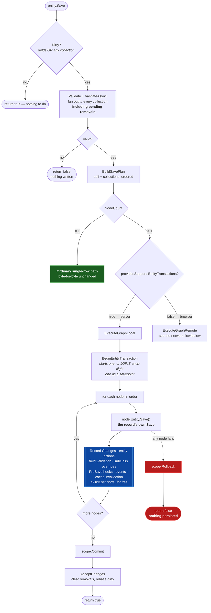
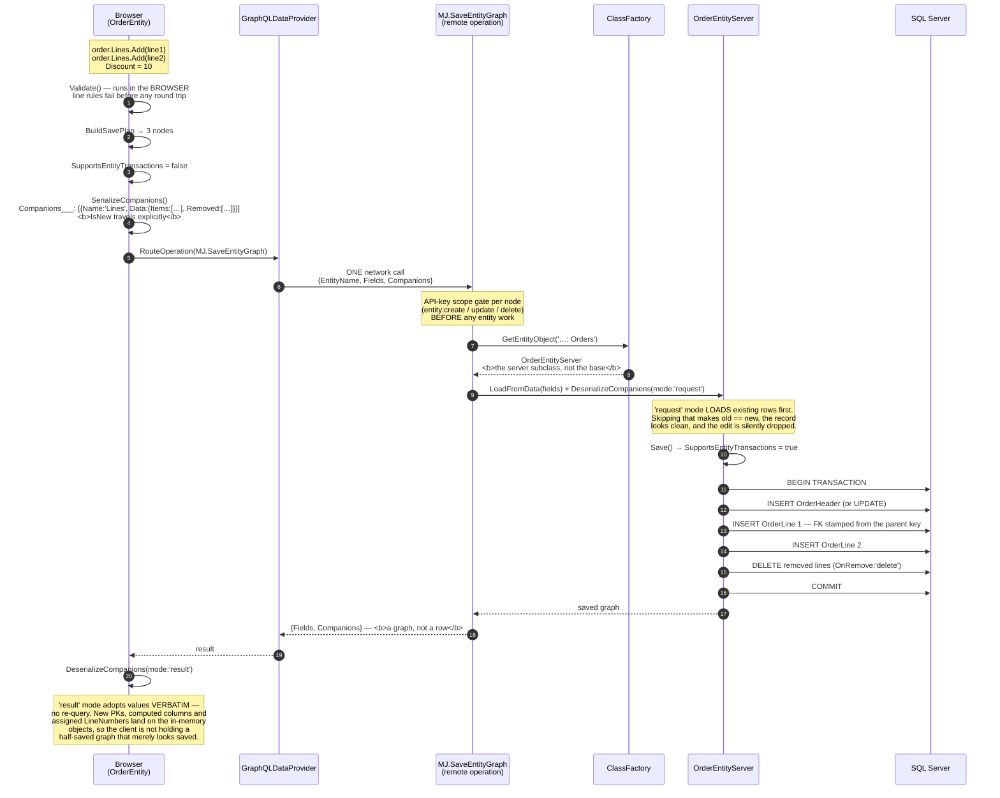
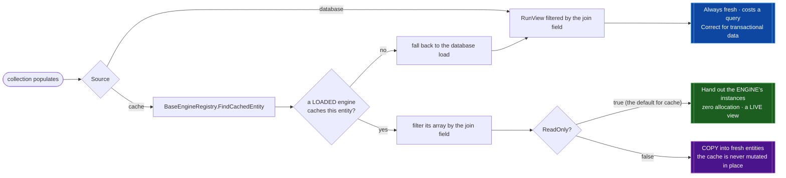

# Related-Record Collections

> A parent record and the rows that point at it — loaded, validated and persisted as **one unit**,
> from a single `entity.Save()`, on the server *and* in the browser.

This is the horizontal counterpart to [IS-A relationships](./isa-relationships.md). IS-A is
*vertical*: one logical record spread across parent and child tables sharing a primary key. A
related-record collection is *horizontal*: a header plus N rows that carry a foreign key back to it —
order lines, journal entry lines, payment allocations, an action's parameters.

| | IS-A subtype | Related-record collection |
|---|---|---|
| MJ vocabulary | `ChildEntities`, `IsChildType`, `_childEntity` | `RelatedEntities`, `EntityRelationshipInfo` |
| Primary key | **Shared** with the parent | **Its own** |
| Cardinality | At most one per parent | Many per parent |
| Join | Same PK | `RelatedEntityJoinField` (a real FK) |
| Declared by | Schema (`Entity.ParentID`) | `EntityRelationship.RelatedRecordCollection` |

**The word "child" means IS-A subtype in MJCore and nothing else.** That is why this feature says
*related records* throughout — `DeclareRelatedRecords`, `RelatedRecordCollection`, `RelatedEntity`,
`RelatedEntityJoinField`. Using "child" for FK dependents would invert the platform's own vocabulary,
and `ChildEntityName` would have become an exact identifier collision meaning two opposite things.

---

## 1. Declaring one

Two ways, producing the identical runtime object.

### Metadata (preferred)

Set `EntityRelationship.RelatedRecordCollection` — a JSONType blob shaped like
`IRelatedRecordCollectionConfig` — and CodeGen emits the declaration onto the **generated** entity
class. Both tiers get it, and no subclass has to exist:

```jsonc
{
  "Name": "Lines",
  "Source": "database",
  "Load": "explicit",
  "OnRemove": "delete",
  "OrderBy": "LineNumber ASC",
  "Sequence": { "Field": "LineNumber", "From": 1 }
}
```

`RelatedEntity` and `RelatedEntityJoinField` are **deliberately not in the JSON** — they are already
columns on the same `EntityRelationship` row. Duplicating them would create two sources of truth with
the JSON copy winning silently, so CodeGen reads two columns plus one blob.

### Code

On a **shared (client + server)** subclass — never a server-only one, or the browser loses it:

```typescript
@RegisterClass(BaseEntity, 'MJ_BizApps_Orders: Orders')
export class OrderEntity extends mjBizAppsOrdersOrderEntity {
    public readonly Lines = this.DeclareRelatedRecords<OrderLineEntity>({
        Name: 'Lines',
        RelatedEntity: 'MJ_BizApps_Orders: Order Lines',
        RelatedEntityJoinField: 'OrderHeaderID',
        OrderBy: 'LineNumber ASC',
        Load: 'explicit',
        OnRemove: 'delete',
        Sequence: { Field: 'LineNumber', From: 1 },
    });

    public override Validate(): ValidationResult {
        const result = super.Validate();          // fans out to every collection
        assertLinesBalance(this.Lines.Items, result);
        return result;
    }
}
```

`ClassFactory` priority auto-increments by load order, so a server-only subclass extending this one
still wins server-side with no configuration — and the browser keeps the collection.

---

## 2. What happens on `Save()` — the local flow



Three properties of that diagram are the whole design:

**A single-node plan is the old path, untouched.** An entity with no collections — or whose
collections are empty — takes the byte-for-byte original save. That is what makes this safe to
declare on core entities that thousands of call sites already save.

**Every node is written by that record's own `Save()`, never by direct SQL.** So Record Changes,
entity actions, validation, subclass `Save` overrides, `PreSave` hooks, events and cache
invalidation all fire per node with no graph-specific plumbing — and there is no way for the graph
path to quietly skip a guarantee the single-record path has.

**Validation runs over the complete set — including removals — before anything is written.** A
cross-record invariant ("debits must equal credits") therefore sees the whole graph, rather than
being evaluated after half of it has landed.

---

## 3. Crossing the network — one call, not N

The client provider cannot open a transaction; that single fact is why every hand-rolled composite
in MJ was server-only. So on a non-transactional provider `BaseEntity` **relocates** the cascade
instead of reimplementing it: it serialises the graph, ships it in one remote operation, and the
server runs the *same* executor.



Why it is shaped this way:

- **`MJ.SaveEntityGraph` rather than a CodeGen wire change.** Adding `Companions___` to every
  entity's generated Create/Update input would touch published GraphQL types across 100+ packages.
  One framework operation covers every entity forever and adds nothing to a published schema — which
  matters under the publish-then-no-breaking-changes policy.
- **`IsNew` travels explicitly** because `NewRecord()` generates a UUID: a brand-new record already
  has a populated primary key and is indistinguishable from an existing one by inspection.
- **The deserialize direction is load-bearing.** Inbound *requests* must load existing rows first, or
  dirty tracking compares new against new and the save is skipped. Authoritative *results* must be
  adopted as-is, or every record costs a wasted round trip. Hence `EntityCompanionDeserializeMode`.
- **A `TransactionGroup` cannot do this.** Under a TG `Save()` *defers* — the parent's PK is not
  available afterwards, there is no read-your-writes, and `Save()` returns `true` before anything
  persists. See [the transactions guide](../../../guides/TRANSACTIONS_AND_BATCHING_GUIDE.md).

---

## 4. Where the records come from — `Source`



`'cache'` is discovered **generically** — the registry finds whichever loaded engine already holds
the entity, so this is not wired to a named engine and any relationship whose child entity is cached
anywhere gets zero-query related records by adding one JSON key.

> It is `database | cache`, not `query | cache`, because in MemberJunction a *Query* is a stored,
> named artifact (`MJ: Queries`, `RunQuery`). `Source: 'query'` would read as "this comes from a
> stored Query" — a different thing entirely.

### The sharing hazard, settled by declaration

A cache-sourced collection holds the **engine's own entity instances**. Anyone holding a
`BaseEntity` can set fields and call `Save()`, and no API can prevent that — so the two flags decide
what you are handed:

| `Source` | `ReadOnly` | You get | Why |
|---|---|---|---|
| `cache` | `true` *(default)* | The engine's instances, as a **live view** | Zero allocation — the point of caching |
| `cache` | `false` | **Copies** | You asked to mutate; the cache must not be collateral |
| `database` | either | Fresh objects | Nothing shared, nothing to protect |

Read-only is enforced where it can be: `Add`, `Create`, `Remove` and `Clear` throw, the collection
contributes nothing to a save plan, and **`Dirty` is always `false`**. That last one is not tidiness
— the items belong to an engine cache, so a record dirtied by unrelated code would otherwise make
every parent holding it claim it needs saving.

### Live, not frozen

A read-only cache collection re-reads its donor on access, so it tracks the engine:

- the engine **mutates in place** (`push`/`splice`) → seen
- the engine **reassigns the property** (the ordered-config refresh path) → also seen, because the
  collection retains `{ engine, propertyName }` and resolves the property fresh rather than
  capturing the array

Revalidation is two reference comparisons; a re-filter happens only when one changes. Field-level
edits need no detection at all — you are already looking at the engine's objects. Writable cache
collections deliberately do **not** track, because those copies belong to you.

---

## 5. `Load` — when it populates

| Mode | Populates | Notes |
|---|---|---|
| `explicit` *(default)* | `await Load()` / `LoadRelatedRecords()` | The right default for `database` |
| `immediate` | During the parent's `Load()` | **Never** from `LoadFromData()` — see below |
| `lazy` | On first read of `Items` | Requires `cache` **and** read-only |
| `never` | Never; `Load()` is a no-op | A write-only staging buffer |

**`immediate` never fires from `LoadFromData()`**, and that exclusion is structural rather than
stylistic. `LoadFromData` is the per-row materialisation path for
`RunView(ResultType:'entity_object')`, so populating there turns one view of 500 rows into 500
queries. For result sets use `RunView({ IncludeRelatedRecords: ['Lines'] })`, which costs **1+K**.

**`lazy` requires cache and read-only** because a property getter cannot `await`: only a synchronous
cache read can fill one, and only *sharing* is synchronous (copying goes through the async
`GetEntityObject`). CodeGen rejects the other combinations rather than emitting a declaration that
compiles and silently never fills.

**A lazy cache miss throws.** Declaring `lazy` asserts that an engine caches the entity; with no
async fallback available, the only alternative is a silently empty array — which is exactly how a
getter feeds `[]` to its callers indefinitely without anyone noticing. A donor holding *zero rows*
is a valid empty answer; only the **absence** of a donor is an error, and the message distinguishes
the two causes because they need opposite fixes:

```
… is declared Load: 'lazy', but BaseAIEngine — which caches 'MJ: AI Agent Actions' —
is not loaded yet. Await that engine's Config() before reading 'Actions', or declare
Load: 'explicit' …
```
```
… but no registered BaseEngine caches 'MJ: Foo'. Lazy loading reads exclusively from
engine caches. Declare Source: 'database' with Load: 'explicit', or add an entity
config for 'MJ: Foo' to an engine.
```

### One call for everything

```typescript
await action.LoadRelatedRecords();          // every declared collection
await agent.LoadRelatedRecords('Prompts');  // just one
```

Cache-backed collections resolve for free; every database-backed one is batched into a **single
`RunViews`**. Four declared collections cost one round trip — or zero.

---

## 6. Removal, sequencing and cycles

**`OnRemove`** — `'delete'` for true composition (the record has no meaning without its parent),
`'orphan'` to leave the row and null the FK (aggregation), `'refuse'` where detaching is always a
bug. Removals are executed **before** inserts, so a freed unique key (a re-sequenced `LineNumber`)
is available to the record about to take it.

**`Sequence`** maintains a gap-free run across adds and removals. Use it for positional fields
(`LineNumber`) and **not** for semantic rankings (`Priority` on a prompt's models) — renumbering a
ranking silently rewrites a deliberate preference.

**Cycles** are reachable on a self-referential collection (`SubAgents` via `ParentID`):
`a.SubAgents.Add(b); b.SubAgents.Add(a)` would recurse until the stack died, because a child node
runs the child's own `Save()`, which builds its own plan. A guard keyed on entity + primary key
detects it and fails with a clear message. It keys on the key rather than object identity — after a
round trip the same row is a different instance, which is precisely the shape a cycle takes — and it
rides on `EntitySaveOptions` rather than a module global, so two concurrent requests touching the
same record cannot produce a phantom cycle.

---

## 7. Behaviour changes for adopters

Declaring a collection changes two things about the parent, both of them fixes:

1. **`Dirty` includes its collections.** A clean parent with new related records used to return
   early from `Save()` and persist nothing while reporting success.
2. **Collection validation ignores `DefaultSkipAsyncValidation`.** That flag governs an entity's own
   async rules; applying it to cross-record invariants is how an entire per-line validation loop
   came to be dead on every save.

Entities without collections are unaffected in every respect.

---

## See also

- [IS-A Relationships](./isa-relationships.md) — the vertical counterpart
- [Transactions & Batching Guide](../../../guides/TRANSACTIONS_AND_BATCHING_GUIDE.md) — provider
  transactions vs TransactionGroups vs entity graphs, and which you want
- [Remote Operations Showcase](./REMOTE_OPERATIONS_SHOWCASE.md) — the primitive the network path rides on
- `.claude/rules/data-access.md` — the short version, loaded on every `.ts` file
