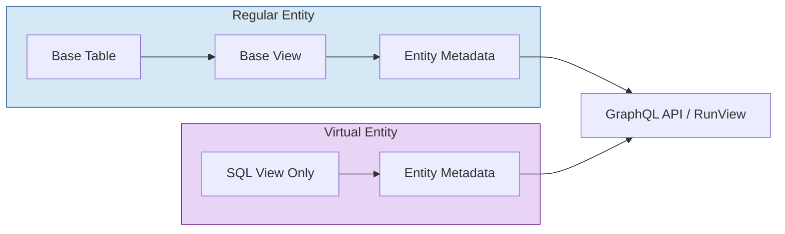
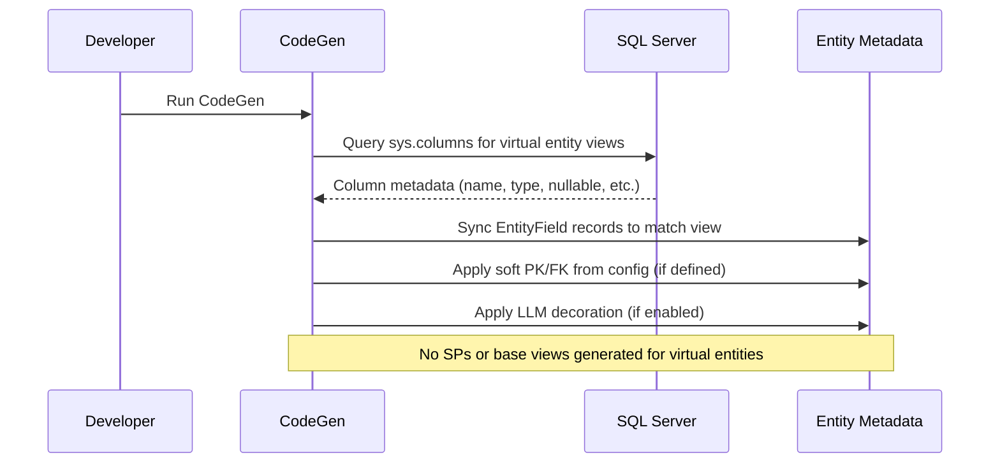
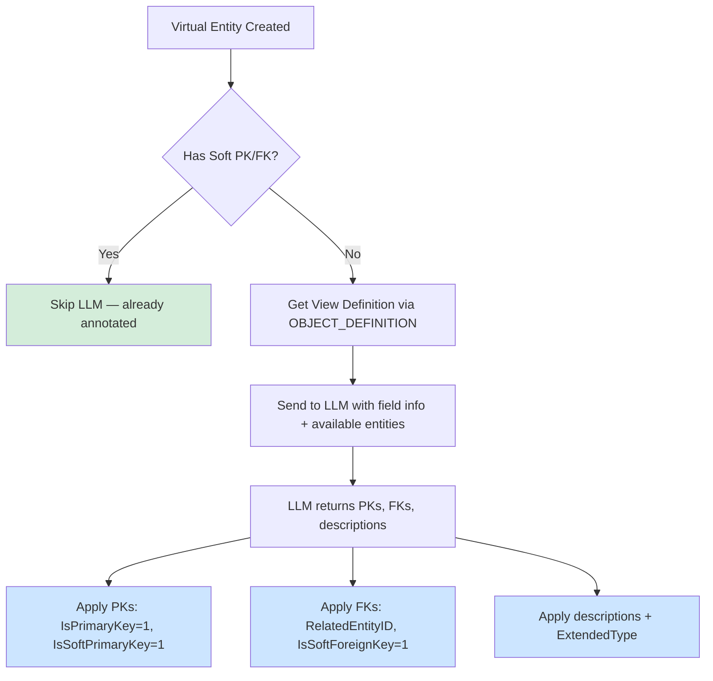

# Virtual Entities in MemberJunction

> **Package**: [@memberjunction/core](../readme.md)
> **Related Guides**: [IS-A Relationships](./isa-relationships.md) | [RunQuery Pagination](./runquery-pagination.md)
> **Related Packages**: [@memberjunction/codegen-lib](../../CodeGenLib/README.md) | [@memberjunction/sqlserver-dataprovider](../../SQLServerDataProvider/README.md)

## Overview

Virtual entities are **read-only entities backed by SQL views** rather than physical database tables. They appear in the MemberJunction metadata catalog alongside regular entities but have no underlying base table — only a base view. This makes them ideal for exposing aggregated data, cross-database views, external system snapshots, or complex computed datasets as first-class entities.



## Key Characteristics

| Property | Regular Entity | Virtual Entity |
|----------|---------------|----------------|
| `VirtualEntity` | `false` | `true` |
| `BaseTable` | Physical table name | Same as `BaseView` |
| `BaseView` | Generated view | Pre-existing view |
| `AllowCreateAPI` | Configurable | Always `false` |
| `AllowUpdateAPI` | Configurable | Always `false` |
| `AllowDeleteAPI` | Configurable | Always `false` |
| Stored procedures | Generated (spCreate/spUpdate/spDelete) | None |
| Field sync | From `INFORMATION_SCHEMA.COLUMNS` | From `sys.columns` on the view |

## Architecture



## Creating Virtual Entities

### Method 1: Config-Driven Creation (Recommended)

Define virtual entities in your `database-metadata-config.json` file (referenced by `additionalSchemaInfo` in `mj.config.cjs`):

```json
{
  "VirtualEntities": [
    {
      "ViewName": "vwSalesSummary",
      "SchemaName": "dbo",
      "EntityName": "Sales Summary",
      "Description": "Read-only summary of sales data across all regions",
      "PrimaryKey": ["SummaryID"],
      "ForeignKeys": [
        {
          "FieldName": "RegionID",
          "SchemaName": "dbo",
          "RelatedTable": "Regions",
          "RelatedField": "ID"
        }
      ]
    }
  ]
}
```

**What happens at CodeGen time:**
1. `processVirtualEntityConfig()` reads the `VirtualEntities` array
2. For each entry, checks if an entity already exists for that view
3. If not, calls `spCreateVirtualEntity` to create the entity record with `VirtualEntity=1`
4. `manageVirtualEntities()` then syncs fields from `sys.columns`
5. `applySoftPKFKConfig()` applies any explicit PK/FK overrides

### Method 2: Direct Database Creation

Call the stored procedure directly:

```sql
EXEC [__mj].spCreateVirtualEntity
    @Name = 'Sales Summary',
    @Description = 'Read-only summary view',
    @BaseView = 'vwSalesSummary',
    @SchemaName = 'dbo'
```

### Method 3: LLM-Assisted Field Decoration

When the `VirtualEntityFieldDecoration` advanced generation feature is enabled, CodeGen uses an LLM to analyze the SQL view definition and automatically identify:

- **Primary keys** — which fields uniquely identify rows
- **Foreign keys** — which fields reference other entities
- **Field descriptions** — what each computed field represents



**Precedence order:** Config-defined PKs/FKs always win. LLM fills gaps that config doesn't cover.

Enable in `mj.config.cjs`:
```javascript
advancedGeneration: {
  enableAdvancedGeneration: true,
  features: [
    { name: 'VirtualEntityFieldDecoration', enabled: true }
  ]
}
```

## Read-Only Enforcement

Virtual entities are enforced as read-only at multiple layers:

### 1. Runtime Guard (BaseEntity)

`BaseEntity.CheckPermissions()` blocks Create, Update, and Delete operations:

```typescript
// In baseEntity.ts CheckPermissions()
if (this.EntityInfo.VirtualEntity &&
    (type === EntityPermissionType.Create ||
     type === EntityPermissionType.Update ||
     type === EntityPermissionType.Delete)) {
    throw new Error(
        `Cannot ${type} on virtual entity '${this.EntityInfo.Name}' — virtual entities are read-only views`
    );
}
```

### 2. API Flags

`AllowCreateAPI`, `AllowUpdateAPI`, and `AllowDeleteAPI` are all set to `false`, which prevents GraphQL mutations from being generated.

### 3. CodeGen

No stored procedures (`spCreate*`, `spUpdate*`, `spDelete*`) are generated for virtual entities.

## Using Virtual Entities in Code

Virtual entities work identically to regular entities for **read operations**:

```typescript
import { Metadata, RunView } from '@memberjunction/core';

// Load via RunView — works exactly like regular entities
const rv = new RunView();
const result = await rv.RunView({
    EntityName: 'Sales Summary',
    ExtraFilter: `RegionID = '${regionId}'`,
    OrderBy: 'TotalSales DESC',
    ResultType: 'simple'
});

// Access metadata
const md = new Metadata();
const entity = md.EntityByName('Sales Summary');
console.log(entity.VirtualEntity);  // true
console.log(entity.BaseView);       // 'vwSalesSummary'

// Load a single record
const record = await md.GetEntityObject('Sales Summary');
await record.InnerLoad(compositeKey);  // Works fine — read operation

// These will throw:
// await record.Save();   // Error: Cannot Create on virtual entity
// await record.Delete(); // Error: Cannot Delete on virtual entity
```

## Field Metadata

### Soft Primary Keys

Virtual entity views have no database constraints, so primary keys are identified as "soft" PKs:

- `IsPrimaryKey = 1` — marks the field as a primary key
- `IsSoftPrimaryKey = 1` — protects from being overwritten by schema sync

### Soft Foreign Keys

Similarly, relationships are defined as "soft" FKs:

- `RelatedEntityID` — points to the related entity
- `RelatedEntityFieldName` — the field on the related entity
- `IsSoftForeignKey = 1` — protects from schema sync

### How Fields Are Synced

During CodeGen, `manageSingleVirtualEntity()` queries `sys.columns` for the view and:

1. **Removes** EntityField records for columns no longer in the view
2. **Creates** EntityField records for new columns
3. **Updates** existing fields if type/length/nullability changed
4. If no field has `IsPrimaryKey=1`, defaults the first field as PK

## UI Representation

In the Entity form (core-entity-forms), virtual entities display:

- **Purple badge** with `fa-eye` icon indicating "Virtual Entity (Read-Only)"
- Underlying **view name** displayed prominently
- No Create/Edit/Delete buttons (operations blocked at runtime)

## Relationship to IS-A Types

Virtual entities and IS-A type relationships are independent features, but they can interact:

- A virtual entity **cannot** be an IS-A parent or child (it has no physical table for JOINs)
- IS-A child entity views include parent fields via JOINs — these are **not** virtual entities
- Both use `IsSoftPrimaryKey` / `IsSoftForeignKey` flags for constraint-less metadata

See the [IS-A Relationships Guide](./isa-relationships.md) for details on type inheritance.

## Configuration Reference

### mj.config.cjs Settings

```javascript
module.exports = {
  // Path to the additional schema info config file
  additionalSchemaInfo: './config/database-metadata-config.json',

  advancedGeneration: {
    enableAdvancedGeneration: true,
    features: [
      {
        name: 'VirtualEntityFieldDecoration',
        description: 'Use AI to analyze SQL view definitions for virtual entities',
        enabled: false  // Set to true to enable LLM decoration
      }
    ]
  }
};
```

### database-metadata-config.json Schema

```json
{
  "version": "1.1",
  "VirtualEntities": [
    {
      "ViewName": "string (required) — SQL view name",
      "SchemaName": "string (optional, default: 'dbo')",
      "EntityName": "string (optional — derived from ViewName if omitted)",
      "Description": "string (optional)",
      "PrimaryKey": ["FieldName1", "FieldName2"],
      "ForeignKeys": [
        {
          "FieldName": "string (required)",
          "SchemaName": "string (optional)",
          "RelatedTable": "string (required)",
          "RelatedField": "string (required)"
        }
      ]
    }
  ]
}
```

## Troubleshooting

| Issue | Cause | Solution |
|-------|-------|----------|
| Fields not syncing | View doesn't exist in database | Verify view exists: `SELECT * FROM sys.views WHERE name = 'vwMyView'` |
| Wrong primary key | No PK in config, LLM disabled | Add `PrimaryKey` to config or enable `VirtualEntityFieldDecoration` |
| Save() throws error | Expected — virtual entities are read-only | Use `entity.EntityInfo.VirtualEntity` to check before attempting writes |
| Entity not created | View name mismatch in config | Ensure `ViewName` matches exactly (case-sensitive) |
| LLM decoration skipped | Entity already has soft annotations | Intentional — explicit config takes precedence over LLM |
