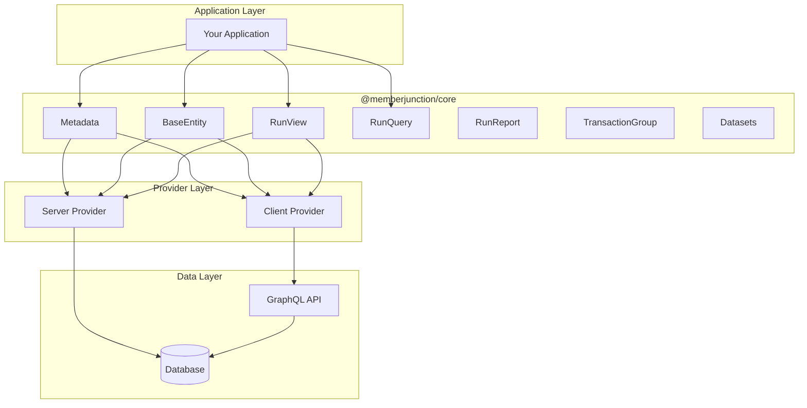

# @memberjunction/core

The `@memberjunction/core` library provides a comprehensive interface for accessing and managing metadata within MemberJunction, along with facilities for working with entities, applications, and various other aspects central to the MemberJunction ecosystem. This library serves as the foundation for all MemberJunction applications and provides essential functionality for data access, manipulation, and metadata management.

## Installation

```bash
npm install @memberjunction/core
```

## Key Features

- **Metadata-Driven Architecture**: Complete access to MemberJunction metadata including entities, fields, relationships, and permissions
- **Entity Data Access**: Type-safe base classes for loading, saving, and manipulating entity records
- **View Execution**: Powerful view running capabilities for both stored and dynamic views with filtering and pagination
- **Query Execution**: Secure parameterized query execution with SQL injection protection
- **Transaction Management**: Support for grouped database transactions with atomic commits
- **Provider Architecture**: Flexible provider model supporting different execution environments (server, client, API)
- **Bulk Data Loading**: Dataset system for efficient loading of related entity collections
- **Vector Embeddings**: Built-in support for AI-powered text embeddings and similarity search
- **Enhanced Logging**: Structured logging with metadata, categories, and verbose control

## Architecture



## Overview

The `@memberjunction/core` library is the central package in the MemberJunction ecosystem, providing:

- **Metadata Management**: Complete access to MemberJunction metadata including entities, fields, relationships, permissions, and more
- **Entity Data Access**: Base classes and utilities for loading, saving, and manipulating entity records
- **View Execution**: Powerful view running capabilities for both stored and dynamic views
- **Query & Report Execution**: Tools for running queries and reports
- **Security & Authorization**: User authentication, role management, and permission handling
- **Transaction Management**: Support for grouped database transactions
- **Provider Architecture**: Flexible provider model supporting different execution environments

## Core Components

### Metadata Class

The `Metadata` class is the primary entry point for accessing MemberJunction metadata and instantiating entity objects.

```typescript
import { Metadata } from '@memberjunction/core';

// Create metadata instance
const md = new Metadata();

// Refresh cached metadata
await md.Refresh();

// Access various metadata collections
const applications = md.Applications;
const entities = md.Entities;
const currentUser = md.CurrentUser;
const roles = md.Roles;
const authorizations = md.Authorizations;
```

#### Key Metadata Properties

- `Applications`: Array of all applications in the system
- `Entities`: Array of all entity definitions
- `CurrentUser`: Current authenticated user (when available)
- `Roles`: System roles
- `AuditLogTypes`: Available audit log types
- `Authorizations`: Authorization definitions
- `Libraries`: Registered libraries
- `Queries`: Query definitions
- `QueryFields`: Query field metadata
- `QueryCategories`: Query categorization
- `QueryPermissions`: Query-level permissions
- `VisibleExplorerNavigationItems`: Navigation items visible to current user
- `AllExplorerNavigationItems`: All navigation items (including hidden)

#### Helper Methods

```typescript
// Get entity ID from name
const entityId = md.EntityIDFromName('Users');

// Get entity name from ID
const entityName = md.EntityNameFromID('12345');

// Find entity by name (case-insensitive)
const userEntity = md.EntityByName('users');

// Find entity by ID
const entity = md.EntityByID('12345');

// Get entity object instance (IMPORTANT: Always use this pattern)
const user = await md.GetEntityObject<UserEntity>('Users');

// NEW in v2.58.0: Load existing records directly with GetEntityObject
const existingUser = await md.GetEntityObject<UserEntity>('Users', CompositeKey.FromID(userId));
```

### GetEntityObject() - Enhanced in v2.58.0

The `GetEntityObject()` method now supports overloaded signatures for both creating new records and loading existing ones in a single call:

#### Creating New Records

```typescript
// Traditional approach - still supported
const user = await md.GetEntityObject<UserEntity>('Users');
user.NewRecord(); // No longer needed - done automatically!

// v2.58.0+ - NewRecord() is called automatically
const newUser = await md.GetEntityObject<UserEntity>('Users');
newUser.FirstName = 'John';
await newUser.Save();
```

#### Loading Existing Records (NEW)

```typescript
// Traditional approach - still supported
const user = await md.GetEntityObject<UserEntity>('Users');
await user.Load(userId);

// v2.58.0+ - Load in a single call using CompositeKey
const existingUser = await md.GetEntityObject<UserEntity>('Users', CompositeKey.FromID(userId));

// Load by custom field
const userByEmail = await md.GetEntityObject<UserEntity>('Users', 
    CompositeKey.FromKeyValuePair('Email', 'user@example.com'));

// Load with composite primary key
const orderItem = await md.GetEntityObject<OrderItemEntity>('OrderItems',
    CompositeKey.FromKeyValuePairs([
        { FieldName: 'OrderID', Value: orderId },
        { FieldName: 'ProductID', Value: productId }
    ]));

// Server-side with context user
const order = await md.GetEntityObject<OrderEntity>('Orders', 
    CompositeKey.FromID(orderId), contextUser);
```

#### Automatic UUID Generation (NEW in v2.58.0)

For entities with non-auto-increment uniqueidentifier primary keys, UUIDs are now automatically generated when calling `NewRecord()`:

```typescript
// UUID is automatically generated for eligible entities
const action = await md.GetEntityObject<ActionEntity>('Actions');
console.log(action.ID); // '550e8400-e29b-41d4-a716-446655440000' (auto-generated)
```

### BaseEntity Class

The `BaseEntity` class is the foundation for all entity record manipulation in MemberJunction. All entity classes generated by the MemberJunction code generator extend this class.

#### Loading Data from Objects (v2.52.0+)

The `LoadFromData()` method is now async to support subclasses that need to perform additional loading operations:

```typescript
// Loading data from a plain object (now async)
const userData = {
    ID: '123',
    FirstName: 'Jane',
    LastName: 'Doe',
    Email: 'jane@example.com'
};

// LoadFromData is now async as of v2.52.0
await user.LoadFromData(userData);

// This change enables subclasses to perform async operations
// Example subclass implementation:
class ExtendedUserEntity extends UserEntity {
    public override async LoadFromData(data: any): Promise<boolean> {
        const result = await super.LoadFromData(data);
        if (result) {
            // Can now perform async operations
            await this.LoadUserPreferences();
            await this.LoadUserRoles();
        }
        return result;
    }
    
    // Important: Also override Load() for consistency
    public override async Load(ID: string): Promise<boolean> {
        const result = await super.Load(ID);
        if (result) {
            await this.LoadUserPreferences();
            await this.LoadUserRoles();
        }
        return result;
    }
}
```

**Important**: Subclasses that perform additional loading should override BOTH `LoadFromData()` and `Load()` methods to ensure consistent behavior regardless of how the entity is populated.

#### Entity Fields

Each entity field is represented by an `EntityField` object that tracks value, dirty state, and metadata:

```typescript
// Access field value
const firstName = user.Get('FirstName');

// Set field value
user.Set('FirstName', 'Jane');

// Check if field is dirty
const isDirty = user.Fields.find(f => f.Name === 'FirstName').Dirty;

// Access field metadata
const field = user.Fields.find(f => f.Name === 'Email');
console.log(field.IsUnique); // true/false
console.log(field.IsPrimaryKey); // true/false
console.log(field.ReadOnly); // true/false
```

#### Working with BaseEntity and Spread Operator

**IMPORTANT**: BaseEntity uses TypeScript getter/setter properties for all entity fields. This means the JavaScript spread operator (`...`) will NOT capture entity field values because getters are not enumerable properties.

```typescript
// ❌ WRONG - Spread operator doesn't capture getter properties
const userData = {
  ...userEntity,  // This will NOT include ID, FirstName, LastName, etc.
  customField: 'value'
};

// ✅ CORRECT - Use GetAll() to get plain object with all field values
const userData = {
  ...userEntity.GetAll(),  // Returns { ID: '...', FirstName: '...', LastName: '...', etc. }
  customField: 'value'
};

// ✅ ALSO CORRECT - Access properties individually
const userData = {
  ID: userEntity.ID,
  FirstName: userEntity.FirstName,
  LastName: userEntity.LastName,
  customField: 'value'
};
```

The `GetAll()` method returns a plain JavaScript object containing all entity field values, which can be safely used with the spread operator. This design choice enables:
- Clean property access syntax (`entity.Name` vs `entity.getName()`)
- Full TypeScript/IntelliSense support
- Easy property overriding in subclasses
- Proper encapsulation with validation and side effects

#### Save Options

```typescript
import { EntitySaveOptions } from '@memberjunction/core';

const options = new EntitySaveOptions();
options.IgnoreDirtyState = true; // Force save even if no changes detected
options.SkipEntityAIActions = true; // Skip AI-related actions
options.SkipEntityActions = true; // Skip entity actions
options.SkipOldValuesCheck = true; // Skip concurrency check (client-side only)

await entity.Save(options);
```

### Entity State Tracking & Events (v2.131.0+)

BaseEntity provides comprehensive state tracking and event notification for all database operations. This enables UI components to show loading indicators, disable buttons during operations, and react to entity lifecycle changes.

#### Operation State Getters

Check if an entity is currently performing a database operation:

```typescript
const user = await md.GetEntityObject<UserEntity>('Users');

// Check individual operation states
if (user.IsSaving) {
    console.log('Save operation in progress...');
}

if (user.IsDeleting) {
    console.log('Delete operation in progress...');
}

if (user.IsLoading) {
    console.log('Load operation in progress...');
}

// Convenience getter - true if ANY operation is in progress
if (user.IsBusy) {
    disableAllButtons();
    showSpinner();
}
```

#### State Getter Reference

| Getter | Description |
|--------|-------------|
| `IsSaving` | Returns `true` when a `Save()` operation is in progress |
| `IsDeleting` | Returns `true` when a `Delete()` operation is in progress |
| `IsLoading` | Returns `true` when a `Load()` operation is in progress |
| `IsBusy` | Returns `true` when any of the above operations is in progress |

#### Operation Lifecycle Events

Subscribe to entity lifecycle events to react when operations start and complete:

```typescript
import { BaseEntityEvent } from '@memberjunction/core';

const user = await md.GetEntityObject<UserEntity>('Users');

// Subscribe to entity events
const subscription = user.RegisterEventHandler((event: BaseEntityEvent) => {
    switch (event.type) {
        // Operation START events
        case 'save_started':
            console.log(`Save started (${event.saveSubType})`); // 'create' or 'update'
            showSavingIndicator();
            break;
        case 'delete_started':
            console.log('Delete started');
            showDeletingIndicator();
            break;
        case 'load_started':
            console.log('Load started for key:', event.payload?.CompositeKey);
            showLoadingIndicator();
            break;

        // Operation COMPLETE events
        case 'save':
            console.log(`Save completed (${event.saveSubType})`);
            hideSavingIndicator();
            showSuccessMessage();
            break;
        case 'delete':
            console.log('Delete completed, old values:', event.payload?.OldValues);
            hideDeletingIndicator();
            break;
        case 'load_complete':
            console.log('Load completed for key:', event.payload?.CompositeKey);
            hideLoadingIndicator();
            break;

        // Other events
        case 'new_record':
            console.log('NewRecord() was called');
            break;
    }
});

// Later: unsubscribe when done
subscription.unsubscribe();
```

#### Event Type Reference

| Event Type | Description | Payload |
|------------|-------------|---------|
| `save_started` | Raised when Save() begins (only if entity will actually save) | `null` |
| `save` | Raised when Save() completes successfully | `null` |
| `delete_started` | Raised when Delete() begins | `null` |
| `delete` | Raised when Delete() completes successfully | `{ OldValues: object }` |
| `load_started` | Raised when Load() begins | `{ CompositeKey: CompositeKey }` |
| `load_complete` | Raised when Load() completes successfully | `{ CompositeKey: CompositeKey }` |
| `new_record` | Raised when NewRecord() is called | `null` |
| `transaction_ready` | Internal: signals transaction preprocessing complete | `null` |

#### Global Event Subscription

Subscribe to entity events globally via MJGlobal to monitor all entity operations across your application:

```typescript
import { MJGlobal, MJEventType, BaseEntity, BaseEntityEvent } from '@memberjunction/core';

// Subscribe to all entity events globally
MJGlobal.Instance.GetEventListener(true).subscribe((event) => {
    if (event.event === MJEventType.ComponentEvent &&
        event.eventCode === BaseEntity.BaseEventCode) {

        const entityEvent = event.args as BaseEntityEvent;
        const entity = entityEvent.baseEntity;

        console.log(`[${entity.EntityInfo.Name}] ${entityEvent.type}`);

        // Global logging, analytics, or audit trail
        if (entityEvent.type === 'save') {
            trackEntitySave(entity.EntityInfo.Name, entityEvent.saveSubType);
        }
    }
});
```

#### Save Debouncing

Multiple rapid calls to `Save()` are automatically debounced - the second call receives the same result as the first:

```typescript
// These two calls result in only ONE database save
const promise1 = entity.Save();
const promise2 = entity.Save(); // Returns same promise, doesn't trigger new save

const [result1, result2] = await Promise.all([promise1, promise2]);
// result1 === result2 (both get the same result from the single save)
```

The same debouncing behavior applies to `Delete()` operations.

#### Awaiting In-Progress Operations

BaseEntity provides built-in methods to wait for any in-progress operation to complete. These methods return immediately if no operation is in progress, or wait for the completion event if one is:

```typescript
// Wait for an in-progress save to complete
await entity.EnsureSaveComplete();

// Wait for an in-progress delete to complete
await entity.EnsureDeleteComplete();

// Wait for an in-progress load to complete
await entity.EnsureLoadComplete();
```

**Method Reference:**

| Method | Waits For | Event Listened |
|--------|-----------|----------------|
| `EnsureSaveComplete()` | `IsSaving` to become false | `save` |
| `EnsureDeleteComplete()` | `IsDeleting` to become false | `delete` |
| `EnsureLoadComplete()` | `IsLoading` to become false | `load_complete` |

**Example: Coordinating Dependent Operations**

```typescript
async function performDependentOperation(entity: BaseEntity) {
    // Ensure any in-progress save is complete before proceeding
    await entity.EnsureSaveComplete();

    // Now safe to perform operations that depend on the saved state
    console.log('Entity is saved, proceeding with dependent operation');
    await someOperationThatNeedsSavedData(entity);
}
```

**Example: Cleanup After Delete**

```typescript
async function deleteAndNavigate(entity: BaseEntity) {
    entity.Delete(); // Fire and forget the delete

    // Wait for the delete to complete before navigating
    await entity.EnsureDeleteComplete();

    // Now safe to navigate away
    navigateToList();
}
```

These methods are useful when:
- You need to ensure data is persisted before performing a dependent operation
- You're coordinating between multiple components that might trigger operations
- You want to avoid race conditions when chaining operations
- You need to perform cleanup after an operation completes

#### UI Integration Example

A complete example showing state tracking in a UI component:

```typescript
class EntityFormComponent {
    private entity: BaseEntity;
    private subscription: Subscription;

    async loadEntity(id: string) {
        this.entity = await md.GetEntityObject<UserEntity>('Users');

        // Set up event handlers
        this.subscription = this.entity.RegisterEventHandler((event) => {
            this.updateUI(event);
        });

        await this.entity.Load(id);
    }

    updateUI(event: BaseEntityEvent) {
        // Update loading states
        this.saveButton.disabled = this.entity.IsBusy;
        this.deleteButton.disabled = this.entity.IsBusy;

        // Show operation-specific indicators
        this.savingSpinner.visible = this.entity.IsSaving;
        this.deletingSpinner.visible = this.entity.IsDeleting;
        this.loadingSpinner.visible = this.entity.IsLoading;

        // React to completion events
        if (event.type === 'save') {
            this.showToast('Saved successfully!');
        } else if (event.type === 'delete') {
            this.navigateToList();
        }
    }

    async save() {
        // IsBusy automatically becomes true during save
        await this.entity.Save();
        // IsBusy automatically becomes false when done
    }

    destroy() {
        this.subscription?.unsubscribe();
    }
}
```

### RunView Class

The `RunView` class provides powerful view execution capabilities for both stored views and dynamic queries.

```typescript
import { RunView, RunViewParams } from '@memberjunction/core';

const rv = new RunView();

// Run a stored view by name
const params: RunViewParams = {
    ViewName: 'Active Users',
    ExtraFilter: 'CreatedDate > \'2024-01-01\'',
    UserSearchString: 'john'
};

const results = await rv.RunView(params);

// Run a dynamic view with entity objects returned
const dynamicResults = await rv.RunView<UserEntity>({
    EntityName: 'Users',
    ExtraFilter: 'IsActive = 1',
    OrderBy: 'LastName ASC, FirstName ASC',
    Fields: ['ID', 'FirstName', 'LastName', 'Email'],
    ResultType: 'entity_object' // Returns actual entity objects
});

// Access typed results
const users = dynamicResults.Results; // Properly typed as UserEntity[]
```

#### RunView Parameters

- `ViewID`: ID of stored view to run
- `ViewName`: Name of stored view to run
- `ViewEntity`: Pre-loaded view entity object (optimal for performance)
- `EntityName`: Entity name for dynamic views
- `ExtraFilter`: Additional SQL WHERE clause
- `OrderBy`: SQL ORDER BY clause (overrides stored view sorting)
- `Fields`: Array of field names to return
- `UserSearchString`: User search term
- `ExcludeUserViewRunID`: Exclude records from specific prior run
- `ExcludeDataFromAllPriorViewRuns`: Exclude all previously returned records
- `SaveViewResults`: Store run results for future exclusion
- `IgnoreMaxRows`: Bypass entity MaxRows setting
- `MaxRows`: Maximum rows to return
- `StartRow`: Row offset for pagination
- `ResultType`: 'simple' (default) or 'entity_object'

### RunQuery Class

The `RunQuery` class provides secure execution of parameterized stored queries with advanced SQL injection protection and type-safe parameter handling.

#### Basic Usage

```typescript
import { RunQuery, RunQueryParams } from '@memberjunction/core';

const rq = new RunQuery();

// Execute by Query ID
const params: RunQueryParams = {
    QueryID: '12345',
    Parameters: {
        StartDate: '2024-01-01',
        EndDate: '2024-12-31',
        Status: 'Active'
    }
};

const results = await rq.RunQuery(params);

// Execute by Query Name and Category Path
const namedParams: RunQueryParams = {
    QueryName: 'Monthly Sales Report',
    CategoryPath: '/Sales/',  // Hierarchical path notation
    Parameters: {
        Month: 12,
        Year: 2024,
        MinAmount: 1000
    }
};

const namedResults = await rq.RunQuery(namedParams);
```

#### Parameterized Queries

RunQuery supports powerful parameterized queries using Nunjucks templates with built-in SQL injection protection:

```sql
-- Example stored query in the database
SELECT 
    o.ID,
    o.OrderDate,
    o.TotalAmount,
    c.CustomerName
FROM Orders o
INNER JOIN Customers c ON o.CustomerID = c.ID
WHERE 
    o.OrderDate >= {{ startDate | sqlDate }} AND
    o.OrderDate <= {{ endDate | sqlDate }} AND
    o.Status IN {{ statusList | sqlIn }} AND
    o.TotalAmount >= {{ minAmount | sqlNumber }}

    AND c.IsActive = {{ isActive | sqlBoolean }}

ORDER BY {{ orderClause | sqlNoKeywordsExpression }}
```

#### SQL Security Filters

RunQuery includes comprehensive SQL filters to prevent injection attacks:

##### sqlString Filter
Safely escapes string values by doubling single quotes and wrapping in quotes:

```sql
-- Template
WHERE CustomerName = {{ name | sqlString }}

-- Input: "O'Brien"
-- Output: WHERE CustomerName = 'O''Brien'
```

##### sqlNumber Filter
Validates and formats numeric values:

```sql
-- Template
WHERE Amount >= {{ minAmount | sqlNumber }}

-- Input: "1000.50"
-- Output: WHERE Amount >= 1000.5
```

##### sqlDate Filter
Formats dates in ISO 8601 format:

```sql
-- Template
WHERE CreatedDate >= {{ startDate | sqlDate }}

-- Input: "2024-01-15"
-- Output: WHERE CreatedDate >= '2024-01-15T00:00:00.000Z'
```

##### sqlBoolean Filter
Converts boolean values to SQL bit representation:

```sql
-- Template
WHERE IsActive = {{ active | sqlBoolean }}

-- Input: true
-- Output: WHERE IsActive = 1
```

##### sqlIdentifier Filter
Safely formats SQL identifiers (table/column names):

```sql
-- Template
SELECT * FROM {{ tableName | sqlIdentifier }}

-- Input: "UserAccounts"
-- Output: SELECT * FROM [UserAccounts]
```

##### sqlIn Filter
Formats arrays for SQL IN clauses:

```sql
-- Template
WHERE Status IN {{ statusList | sqlIn }}

-- Input: ['Active', 'Pending', 'Review']
-- Output: WHERE Status IN ('Active', 'Pending', 'Review')
```

##### sqlNoKeywordsExpression Filter (NEW)
Validates SQL expressions by blocking dangerous keywords while allowing safe expressions:

```sql
-- Template
ORDER BY {{ orderClause | sqlNoKeywordsExpression }}

-- ✅ ALLOWED: "Revenue DESC, CreatedDate ASC"
-- ✅ ALLOWED: "SUM(Amount) DESC"
-- ✅ ALLOWED: "CASE WHEN Amount > 1000 THEN 1 ELSE 0 END"
-- ❌ BLOCKED: "Revenue; DROP  TABLE Users"
-- ❌ BLOCKED: "Revenue UNION SELECT * FROM Secrets"
```

#### Parameter Types and Validation

Query parameters are defined in the `QueryParameter` entity with automatic validation:

```typescript
// Example parameter definitions
{
    name: 'startDate',
    type: 'date',
    isRequired: true,
    description: 'Start date for filtering records',
    sampleValue: '2024-01-01'
},
{
    name: 'statusList',
    type: 'array',
    isRequired: false,
    defaultValue: '["Active", "Pending"]',
    description: 'List of allowed status values'
},
{
    name: 'minAmount',
    type: 'number',
    isRequired: true,
    description: 'Minimum amount threshold'
}
```

#### Query Permissions

Queries support role-based access control:

```typescript
// Check if user can run a query (server-side or client-side)
const query = md.Provider.Queries.find(q => q.ID === queryId);
const canRun = query.UserCanRun(contextUser);
const hasPermission = query.UserHasRunPermissions(contextUser);

// Queries are only executable if:
// 1. User has required role permissions
// 2. Query status is 'Approved'
```

#### Advanced Features

##### Conditional SQL Blocks
Use Nunjucks conditionals for dynamic query structure:

```sql
SELECT 
    CustomerID,
    CustomerName,
    TotalOrders
    
    , TotalRevenue
    
FROM CustomerSummary
WHERE CreatedDate >= {{ startDate | sqlDate }}

    AND Region = {{ region | sqlString }}

```

##### Complex Parameter Examples

```typescript
const complexParams: RunQueryParams = {
    QueryName: 'Advanced Sales Analysis',
    Parameters: {
        // Date range
        startDate: '2024-01-01',
        endDate: '2024-12-31',
        
        // Array parameters
        regions: ['North', 'South', 'East'],
        productCategories: [1, 2, 5, 8],
        
        // Boolean flags
        includeDiscounts: true,
        excludeReturns: false,
        
        // Numeric thresholds
        minOrderValue: 500.00,
        maxOrderValue: 10000.00,
        
        // Dynamic expressions (safely validated)
        orderBy: 'TotalRevenue DESC, CustomerName ASC',
        groupingExpression: 'Region, ProductCategory'
    }
};
```

#### Error Handling

RunQuery provides detailed error information:

```typescript
const result = await rq.RunQuery(params);

if (!result.Success) {
    console.error('Query failed:', result.ErrorMessage);
    
    // Common error types:
    // - "Query not found"
    // - "User does not have permission to run this query"
    // - "Query is not in an approved status (current status: Pending)"
    // - "Parameter validation failed: Required parameter 'startDate' is missing"
    // - "Dangerous SQL keyword detected: DROP"
    // - "Template processing failed: Invalid date: 'not-a-date'"
} else {
    console.log('Query executed successfully');
    console.log('Rows returned:', result.RowCount);
    console.log('Execution time:', result.ExecutionTime, 'ms');
    console.log('Applied parameters:', result.AppliedParameters);
    
    // Process results
    result.Results.forEach(row => {
        console.log('Row data:', row);
    });
}
```

#### Query Categories

Organize queries using categories for better management:

```typescript
// Query by category path
const categoryParams: RunQueryParams = {
    QueryName: 'Top Customers',
    CategoryPath: '/Sales Reports/',  // Hierarchical path notation
    Parameters: { limit: 10 }
};

// Query with category ID
const categoryIdParams: RunQueryParams = {
    QueryName: 'Revenue Trends',
    CategoryID: 'sales-cat-123',
    Parameters: { months: 12 }
};
```

#### Best Practices for RunQuery

1. **Always Use Filters**: Apply the appropriate SQL filter to every parameter
2. **Define Clear Parameters**: Use descriptive names and provide sample values
3. **Set Proper Permissions**: Restrict query access to appropriate roles
4. **Validate Input Types**: Use the built-in type system (string, number, date, boolean, array)
5. **Handle Errors Gracefully**: Check Success and provide meaningful error messages
6. **Use Approved Queries**: Only execute queries with 'Approved' status
7. **Leverage Categories**: Organize queries by functional area or team
8. **Test Parameter Combinations**: Verify all conditional blocks work correctly
9. **Document Query Purpose**: Add clear descriptions for queries and parameters
10. **Review SQL Security**: Regular audit of complex expressions and dynamic SQL

#### Performance Considerations

- **Parameter Indexing**: Ensure filtered columns have appropriate database indexes
- **Query Optimization**: Use efficient JOINs and WHERE clauses
- **Result Limiting**: Consider adding TOP/LIMIT clauses for large datasets
- **Caching**: Results are not automatically cached - implement application-level caching if needed
- **Connection Pooling**: RunQuery leverages provider connection pooling automatically

#### Integration with AI Systems

RunQuery is designed to work seamlessly with AI systems:

- **Token-Efficient Metadata**: Filter definitions are optimized for AI prompts
- **Self-Documenting**: Parameter definitions include examples and descriptions
- **Safe Code Generation**: AI can generate queries using the secure filter system
- **Validation Feedback**: Clear error messages help AI systems learn and adapt

#### Example: Complete Sales Dashboard Query

```sql
-- Stored query: "Sales Dashboard Data"
SELECT 
    DATEPART(month, o.OrderDate) AS Month,
    DATEPART(year, o.OrderDate) AS Year,
    COUNT(*) AS OrderCount,
    SUM(o.TotalAmount) AS TotalRevenue,
    AVG(o.TotalAmount) AS AvgOrderValue,
    COUNT(DISTINCT o.CustomerID) AS UniqueCustomers
    
    , p.CategoryPath
    , SUM(od.Quantity) AS TotalQuantity
    
FROM Orders o

    INNER JOIN OrderDetails od ON o.ID = od.OrderID
    INNER JOIN Products p ON od.ProductID = p.ID

WHERE 
    o.OrderDate >= {{ startDate | sqlDate }} AND
    o.OrderDate <= {{ endDate | sqlDate }} AND
    o.Status IN {{ allowedStatuses | sqlIn }}
    
    AND o.Region = {{ region | sqlString }}
    
    
    AND o.TotalAmount >= {{ minOrderValue | sqlNumber }}
    
GROUP BY 
    DATEPART(month, o.OrderDate),
    DATEPART(year, o.OrderDate)
    
    , p.CategoryPath
    
ORDER BY {{ orderExpression | sqlNoKeywordsExpression }}
```

```typescript
// Execute the dashboard query
const dashboardResult = await rq.RunQuery({
    QueryName: 'Sales Dashboard Data',
    CategoryPath: '/Analytics/',  // Hierarchical path notation
    Parameters: {
        startDate: '2024-01-01',
        endDate: '2024-12-31',
        allowedStatuses: ['Completed', 'Shipped'],
        includeProductBreakdown: true,
        filterByRegion: true,
        region: 'North America',
        minOrderValue: 100,
        orderExpression: 'Year DESC, Month DESC, TotalRevenue DESC'
    }
});

if (dashboardResult.Success) {
    // Process the comprehensive dashboard data
    const monthlyData = dashboardResult.Results;
    console.log(`Generated dashboard with ${monthlyData.length} data points`);
    console.log(`Parameters applied:`, dashboardResult.AppliedParameters);
}
```

### RunReport Class

Execute reports with various output formats:

```typescript
import { RunReport, RunReportParams } from '@memberjunction/core';

const rr = new RunReport();

const params: RunReportParams = {
    ReportID: '12345',
    Parameters: {
        Year: 2024,
        Department: 'Sales'
    }
};

const results = await rr.RunReport(params);
```

### Transaction Management

Group multiple operations in a transaction:

```typescript
import { TransactionGroupBase } from '@memberjunction/core';

// Transaction groups allow you to execute multiple entity operations atomically
// See your specific provider documentation for implementation details

// Example using SQLServerDataProvider:
const transaction = new TransactionGroupBase('MyTransaction');

// Add entities to the transaction
await transaction.AddTransaction(entity1);
await transaction.AddTransaction(entity2);

// Submit all operations as a single transaction
const results = await transaction.Submit();
```

For instance-level transactions in multi-user environments, each provider instance maintains its own transaction state, providing automatic isolation between concurrent requests.

## Entity Relationships

MemberJunction automatically handles entity relationships through the metadata system:

```typescript
// Load an entity with related data
const order = await md.GetEntityObject<OrderEntity>('Orders');
await order.Load(123, ['OrderDetails', 'Customer']);

// Access related entities
const orderDetails = order.OrderDetails; // Array of OrderDetailEntity
const customer = order.Customer; // CustomerEntity
```

## Security & Permissions

The library provides comprehensive security features:

```typescript
const md = new Metadata();

// Check current user
const user = md.CurrentUser;
console.log('Current user:', user.Email);

// Check user roles
const isAdmin = user.RoleName.includes('Admin');

// Entity permissions
const entity = md.EntityByName('Orders');
const canCreate = entity.CanCreate;
const canUpdate = entity.CanUpdate;
const canDelete = entity.CanDelete;
```

## Error Handling

All operations return detailed error information:

```typescript
const entity = await md.GetEntityObject('Users');
const result = await entity.Save();

if (!result) {
    // Access detailed error information
    const error = entity.LatestResult;
    console.error('Error:', error.Message);
    console.error('Details:', error.Details);
    
    // Check validation errors
    if (error.ValidationErrors && error.ValidationErrors.length > 0) {
        error.ValidationErrors.forEach(ve => {
            console.error(`Field ${ve.FieldName}: ${ve.Message}`);
        });
    }
}
```

## Logging

MemberJunction provides enhanced logging capabilities with both simple and advanced APIs:

### Basic Logging

```typescript
import { LogStatus, LogError } from '@memberjunction/core';

// Simple status logging
LogStatus('Operation completed successfully');

// Error logging
LogError('Operation failed', null, additionalData1, additionalData2);

// Logging to file
LogStatus('Writing to file', '/logs/output.log');
```

### Enhanced Logging (v2.59.0+)

The enhanced logging functions provide structured logging with metadata, categories, and conditional verbose output:

#### LogStatusEx - Enhanced Status Logging

```typescript
import { LogStatusEx, IsVerboseLoggingEnabled, SetVerboseLogging } from '@memberjunction/core';

// Simple usage - same as LogStatus
LogStatusEx('Process started');

// Verbose-only logging (respects MJ_VERBOSE environment variable)
LogStatusEx({
    message: 'Detailed trace information',
    verboseOnly: true
});

// With custom verbose check
LogStatusEx({
    message: 'Processing items:',
    verboseOnly: true,
    isVerboseEnabled: () => myConfig.debugMode === true,
    additionalArgs: [item1, item2, item3]
});

// With category and file output
LogStatusEx({
    message: 'Batch job completed',
    category: 'BatchProcessor',
    logToFileName: '/logs/batch.log',
    additionalArgs: [processedCount, errorCount]
});
```

#### LogErrorEx - Enhanced Error Logging

```typescript
import { LogErrorEx } from '@memberjunction/core';

// Simple usage - same as LogError
LogErrorEx('Something went wrong');

// With error object and severity
try {
    await riskyOperation();
} catch (error) {
    LogErrorEx({
        message: 'Failed to complete operation',
        error: error as Error,
        severity: 'critical',
        category: 'DataProcessing'
    });
}

// With metadata and additional arguments
LogErrorEx({
    message: 'Validation failed',
    severity: 'warning',
    category: 'Validation',
    metadata: {
        userId: user.ID,
        attemptCount: 3,
        validationRules: ['email', 'uniqueness']
    },
    additionalArgs: [validationResult, user]
});

// Control stack trace inclusion
LogErrorEx({
    message: 'Network timeout',
    error: timeoutError,
    includeStack: false, // Omit stack trace
    metadata: { url: apiUrl, timeout: 5000 }
});
```

### Verbose Logging Control

Control verbose logging globally across your application:

```typescript
// Check if verbose logging is enabled
if (IsVerboseLoggingEnabled()) {
    // Perform expensive logging operations
    const debugInfo = gatherDetailedDebugInfo();
    LogStatus('Debug info:', debugInfo);
}

// Enable verbose logging in browser environments
SetVerboseLogging(true);

// Verbose logging is controlled by:
// 1. MJ_VERBOSE environment variable (Node.js)
// 2. MJ_VERBOSE global variable (Browser)
// 3. MJ_VERBOSE localStorage item (Browser)
// 4. MJ_VERBOSE URL parameter (Browser)
```

### Logging Features

- **Severity Levels**: `warning`, `error`, `critical` for LogErrorEx
- **Categories**: Organize logs by functional area
- **Metadata**: Attach structured data to logs
- **Varargs Support**: Pass additional arguments that get forwarded to console.log/error
- **File Logging**: Direct logs to files (Node.js environments)
- **Conditional Logging**: Skip verbose logs based on environment settings
- **Error Objects**: Automatic error message and stack trace extraction
- **Cross-Platform**: Works in both Node.js and browser environments

## Provider Architecture

MemberJunction uses a provider model to support different execution environments:

```typescript
import { SetProvider } from '@memberjunction/core';

// Provider setup is typically handled by your application initialization
// The provider determines how data is accessed (direct database, API, etc.)
SetProvider(myProvider);
```

### Metadata Caching Optimization

Starting in v2.0, providers support intelligent metadata caching for improved performance in multi-user environments:

```typescript
// First provider instance loads metadata from the database
const provider1 = new SQLServerDataProvider(connectionPool);
await provider1.Config(config); // Loads metadata from database

// Subsequent instances can reuse cached metadata
const config2 = new SQLServerProviderConfigData(
  connectionPool, 
  '__mj', 
  0, 
  undefined, 
  undefined, 
  false // ignoreExistingMetadata = false to reuse cached metadata
);
const provider2 = new SQLServerDataProvider(connectionPool);
await provider2.Config(config2); // Reuses metadata from provider1
```

This optimization is particularly beneficial in server environments where each request gets its own provider instance.

## Breaking Changes

### v2.131.0
- **Entity State Tracking**: New `IsSaving`, `IsDeleting`, `IsLoading`, and `IsBusy` getters on BaseEntity to track in-progress operations.
- **Operation Lifecycle Events**: New event types `save_started`, `delete_started`, `load_started`, and `load_complete` raised during entity operations. The `save_started` event now only fires when the entity will actually be saved (not skipped due to clean state).
- **Delete Debouncing**: `Delete()` now has the same debouncing behavior as `Save()` - multiple rapid calls return the same promise.
- **Global Event Broadcasting**: All operation events (start and complete) are now broadcast globally via MJGlobal for application-wide monitoring.

### v2.59.0
- **Enhanced Logging Functions**: New `LogStatusEx` and `LogErrorEx` functions provide structured logging with metadata, categories, and severity levels. The existing `LogStatus` and `LogError` functions now internally use the enhanced versions, maintaining full backward compatibility.
- **Verbose Logging Control**: New global functions `IsVerboseLoggingEnabled()` and `SetVerboseLogging()` provide centralized verbose logging control across environments.

### v2.58.0
- **GetEntityObject() now calls NewRecord() automatically**: When creating new entities, `NewRecord()` is now called automatically. While calling it again is harmless, it's no longer necessary.
- **UUID Generation**: Entities with non-auto-increment uniqueidentifier primary keys now have UUIDs generated automatically in `NewRecord()`.

### v2.52.0
- **LoadFromData() is now async**: The `LoadFromData()` method in BaseEntity is now async to support subclasses that need to perform additional asynchronous operations during data loading. Update any direct calls to this method to use `await`.

## Best Practices

1. **Always use Metadata.GetEntityObject()** to create entity instances - never use `new`
2. **Use generic types** with RunView for type-safe results
3. **Handle errors properly** - check return values and LatestResult
4. **Use transactions** for related operations that must succeed/fail together
5. **Leverage metadata** for dynamic UI generation and validation
6. **Respect permissions** - always check CanCreate/Update/Delete before operations
7. **Use ExtraFilter** carefully - ensure SQL injection protection
8. **Cache metadata instances** when possible to improve performance
9. **Override both Load() and LoadFromData()** in subclasses that need additional loading logic to ensure consistent behavior

## Dependencies

This package depends on:

| Package | Description |
|---------|-------------|
| [@memberjunction/global](../MJGlobal/README.md) | Core global utilities, class factory, and singleton patterns |
| rxjs | Reactive programming support for observables |
| zod | Schema validation for entity fields |
| debug | Debug logging utilities |

## Related Packages

### Provider Implementations

- [@memberjunction/sqlserver-dataprovider](../SQLServerDataProvider/README.md) - SQL Server database provider for server-side operations
- [@memberjunction/graphql-dataprovider](../GraphQLDataProvider/README.md) - GraphQL provider for client-side applications

### Entity Extensions

- [@memberjunction/core-entities](../MJCoreEntities/README.md) - Extended entity classes for MemberJunction system entities
- [@memberjunction/generated-entities](../GeneratedEntities/README.md) - Auto-generated entity classes for your database

### UI Frameworks

- [@memberjunction/ng-shared](../Angular/Shared/README.md) - Angular-specific components and services
- [@memberjunction/ng-explorer-core](../Angular/Explorer/core/README.md) - Core Angular explorer components

### AI Integration

- [@memberjunction/ai](../AI/Core/README.md) - AI framework core abstractions
- [@memberjunction/aiengine](../AI/Engine/README.md) - AI orchestration engine

### Communication

- [@memberjunction/communication-engine](../Communication/engine/README.md) - Multi-channel communication framework

### Actions

- [@memberjunction/actions](../Actions/Engine/README.md) - Business logic action framework

## TypeScript Support

This library is written in TypeScript and provides full type definitions. All generated entity classes include proper typing for IntelliSense support.

## Datasets

Datasets are a powerful performance optimization feature in MemberJunction that allows efficient bulk loading of related entity data. Instead of making multiple individual API calls to load different entities, datasets enable you to load collections of related data in a single operation.

### What Are Datasets?

Datasets are pre-defined collections of related entity data that can be loaded together. Each dataset contains multiple "dataset items" where each item represents data from a specific entity. This approach dramatically reduces database round trips and improves application performance.

### How Datasets Work

1. **Dataset Definition**: Datasets are defined in the `Datasets` entity with a unique name and description
2. **Dataset Items**: Each dataset contains multiple items defined in the `Dataset Items` entity, where each item specifies:
   - The entity to load
   - An optional filter to apply
   - A unique code to identify the item within the dataset
3. **Bulk Loading**: When you request a dataset, all items are loaded in parallel in a single database operation
4. **Caching**: Datasets can be cached locally for offline use or improved performance

### Key Benefits

- **Reduced Database Round Trips**: Load multiple entities in one operation instead of many
- **Better Performance**: Parallel loading and optimized queries
- **Caching Support**: Built-in local caching with automatic cache invalidation
- **Offline Capability**: Cached datasets enable offline functionality
- **Consistency**: All data in a dataset is loaded at the same point in time

### The MJ_Metadata Dataset

The most important dataset in MemberJunction is `MJ_Metadata`, which loads all system metadata including:
- Entities and their fields
- Applications and settings
- User roles and permissions
- Query definitions
- Navigation items
- And more...

This dataset is used internally by MemberJunction to bootstrap the metadata system efficiently.

### Dataset API Methods

The Metadata class provides several methods for working with datasets:

#### GetDatasetByName()
Always retrieves fresh data from the server without checking cache:

```typescript
const md = new Metadata();
const dataset = await md.GetDatasetByName('MJ_Metadata');

if (dataset.Success) {
    // Process the dataset results
    for (const item of dataset.Results) {
        console.log(`Loaded ${item.Results.length} records from ${item.EntityName}`);
    }
}
```

#### GetAndCacheDatasetByName()
Retrieves and caches the dataset, using cached version if up-to-date:

```typescript
// This will use cache if available and up-to-date
const dataset = await md.GetAndCacheDatasetByName('ProductCatalog');

// With custom filters for specific items
const filters: DatasetItemFilterType[] = [
    { ItemCode: 'Products', Filter: 'IsActive = 1' },
    { ItemCode: 'Categories', Filter: 'ParentID IS NULL' }
];
const filteredDataset = await md.GetAndCacheDatasetByName('ProductCatalog', filters);
```

#### IsDatasetCacheUpToDate()
Checks if the cached version is current without loading the data:

```typescript
const isUpToDate = await md.IsDatasetCacheUpToDate('ProductCatalog');
if (!isUpToDate) {
    console.log('Cache is stale, refreshing...');
    await md.GetAndCacheDatasetByName('ProductCatalog');
}
```

#### ClearDatasetCache()
Removes a dataset from local cache:

```typescript
// Clear specific dataset
await md.ClearDatasetCache('ProductCatalog');

// Clear dataset with specific filters
await md.ClearDatasetCache('ProductCatalog', filters);
```

### Dataset Filtering

You can apply filters to individual dataset items to load subsets of data:

```typescript
const filters: DatasetItemFilterType[] = [
    {
        ItemCode: 'Orders',
        Filter: "OrderDate >= '2024-01-01' AND Status = 'Active'"
    },
    {
        ItemCode: 'OrderDetails',
        Filter: "OrderID IN (SELECT ID FROM Orders WHERE OrderDate >= '2024-01-01')"
    }
];

const dataset = await md.GetAndCacheDatasetByName('RecentOrders', filters);
```

### Dataset Caching

Datasets are cached using the provider's local storage implementation:
- **Browser**: IndexedDB or localStorage
- **Node.js**: File system or memory cache
- **React Native**: AsyncStorage

The cache key includes:
- Dataset name
- Applied filters (if any)
- Connection string (to prevent cache conflicts between environments)

### Cache Invalidation

The cache is automatically invalidated when:
- Any entity in the dataset has newer data on the server
- Row counts differ between cache and server
- You manually clear the cache

### Creating Custom Datasets

To create your own dataset:

1. Create a record in the `Datasets` entity:
```typescript
const datasetEntity = await md.GetEntityObject<DatasetEntity>('Datasets');
datasetEntity.Name = 'CustomerDashboard';
datasetEntity.Description = 'All data needed for customer dashboard';
await datasetEntity.Save();
```

2. Add dataset items for each entity to include:
```typescript
const itemEntity = await md.GetEntityObject<DatasetItemEntity>('Dataset Items');
itemEntity.DatasetID = datasetEntity.ID;
itemEntity.Code = 'Customers';
itemEntity.EntityID = md.EntityByName('Customers').ID;
itemEntity.Sequence = 1;
itemEntity.WhereClause = 'IsActive = 1';
await itemEntity.Save();
```

### Best Practices

1. **Use Datasets for Related Data**: When you need multiple entities that are logically related
2. **Cache Strategically**: Use `GetAndCacheDatasetByName()` for data that doesn't change frequently
3. **Apply Filters Wisely**: Filters reduce data volume but make cache keys more specific
4. **Monitor Cache Size**: Large datasets can consume significant local storage
5. **Refresh When Needed**: Use `IsDatasetCacheUpToDate()` to check before using cached data

### Example: Loading a Dashboard

```typescript
// Define a dataset for a sales dashboard
const dashboardFilters: DatasetItemFilterType[] = [
    { ItemCode: 'Sales', Filter: "Date >= DATEADD(day, -30, GETDATE())" },
    { ItemCode: 'Customers', Filter: "LastOrderDate >= DATEADD(day, -30, GETDATE())" },
    { ItemCode: 'Products', Filter: "StockLevel < ReorderLevel" }
];

// Load with caching for performance
const dashboard = await md.GetAndCacheDatasetByName('SalesDashboard', dashboardFilters);

if (dashboard.Success) {
    // Extract individual entity results
    const recentSales = dashboard.Results.find(r => r.Code === 'Sales')?.Results || [];
    const activeCustomers = dashboard.Results.find(r => r.Code === 'Customers')?.Results || [];
    const lowStockProducts = dashboard.Results.find(r => r.Code === 'Products')?.Results || [];
    
    // Use the data to render your dashboard
    console.log(`Recent sales: ${recentSales.length}`);
    console.log(`Active customers: ${activeCustomers.length}`);
    console.log(`Low stock products: ${lowStockProducts.length}`);
}
```

## Contributing

When contributing to @memberjunction/core:

1. **Follow TypeScript Best Practices**: Use strict typing, avoid `any` types
2. **Maintain Backward Compatibility**: Existing code should continue to work
3. **Document Breaking Changes**: Add version notes to the Breaking Changes section
4. **Add TSDoc Comments**: Document all public APIs with TSDoc
5. **Test Thoroughly**: Ensure changes work in both server and client environments

See the [MemberJunction Contributing Guide](../../CONTRIBUTING.md) for development setup and guidelines.

## License

ISC License - see LICENSE file for details

## Vector Embeddings Support (v2.90.0+)

MemberJunction now provides built-in support for generating and managing vector embeddings for text fields in entities. This feature enables similarity search, duplicate detection, and AI-powered features across your data.

### Overview

The BaseEntity class now includes methods for generating vector embeddings from text fields and storing them alongside the original data. This functionality is designed to be used by server-side entity subclasses that have access to AI embedding models.

### Core Methods

BaseEntity provides four methods for managing vector embeddings:

```typescript
// Generate embeddings for multiple fields by field names
protected async GenerateEmbeddingsByFieldName(fields: Array<{
    fieldName: string,           // Source text field name
    vectorFieldName: string,     // Target vector storage field name
    modelFieldName: string       // Field to store the model ID used
}>): Promise<boolean>

// Generate embedding for a single field by name
protected async GenerateEmbeddingByFieldName(
    fieldName: string, 
    vectorFieldName: string, 
    modelFieldName: string
): Promise<boolean>

// Generate embeddings for multiple fields using EntityField objects
protected async GenerateEmbeddings(fields: Array<{
    field: EntityField,
    vectorField: EntityField,
    modelField: EntityField
}>): Promise<boolean>

// Generate embedding for a single field
protected async GenerateEmbedding(
    field: EntityField,
    vectorField: EntityField,
    modelField: EntityField
): Promise<boolean>
```

### Implementation Pattern

To use vector embeddings in your entity:

1. **Add Vector Storage Fields** to your database table:
   - A field to store the vector (typically NVARCHAR(MAX))
   - A field to store the model ID that generated the vector

2. **Implement EmbedTextLocal** in your server-side entity subclass:

```typescript
import { BaseEntity, SimpleEmbeddingResult } from "@memberjunction/core";
import { AIEngine } from "@memberjunction/aiengine";

export class MyEntityServer extends MyEntity {
    protected async EmbedTextLocal(textToEmbed: string): Promise<SimpleEmbeddingResult> {
        await AIEngine.Instance.Config(false, this.ContextCurrentUser);
        const result = await AIEngine.Instance.EmbedTextLocal(textToEmbed);
        
        if (!result?.result?.vector || !result?.model?.ID) {
            throw new Error('Failed to generate embedding');
        }
        
        return {
            vector: result.result.vector,
            modelID: result.model.ID
        };
    }
}
```

3. **Call GenerateEmbeddings** in your Save method:

```typescript
public async Save(): Promise<boolean> {
    // Generate embeddings before saving
    await this.GenerateEmbeddingsByFieldName([
        {
            fieldName: "Description",
            vectorFieldName: "DescriptionVector",
            modelFieldName: "DescriptionVectorModelID"
        },
        {
            fieldName: "Content",
            vectorFieldName: "ContentVector",
            modelFieldName: "ContentVectorModelID"
        }
    ]);
    
    return await super.Save();
}
```

### Automatic Features

The embedding generation system includes several automatic optimizations:

- **Dirty Detection**: Only generates embeddings for new records or when source text changes
- **Null Handling**: Clears vector fields when source text is empty
- **Parallel Processing**: Multiple embeddings are generated concurrently for performance
- **Error Resilience**: Returns false on failure without throwing exceptions

### Type Definitions

The `SimpleEmbeddingResult` type is defined in @memberjunction/core:

```typescript
export type SimpleEmbeddingResult = {
    vector: number[];    // The embedding vector
    modelID: string;     // ID of the AI model used
}
```

### Architecture Benefits

This design provides:
- **Clean Separation**: Core orchestration logic in BaseEntity, AI integration in subclasses
- **No Dependency Issues**: BaseEntity doesn't depend on AI packages
- **Reusability**: Any server-side entity can add embeddings with minimal code
- **Type Safety**: Full TypeScript support throughout

### Example: Complete Implementation

```typescript
// In your server-side entity file
import { BaseEntity, SimpleEmbeddingResult } from "@memberjunction/core";
import { RegisterClass } from "@memberjunction/global";
import { ComponentEntityExtended } from "@memberjunction/core-entities";
import { AIEngine } from "@memberjunction/aiengine";

@RegisterClass(BaseEntity, 'Components')
export class ComponentEntityServer extends ComponentEntityExtended {
    public async Save(): Promise<boolean> {
        // Generate embeddings for text fields
        await this.GenerateEmbeddingsByFieldName([
            {
                fieldName: "TechnicalDesign",
                vectorFieldName: "TechnicalDesignVector",
                modelFieldName: "TechnicalDesignVectorModelID"
            },
            {
                fieldName: "FunctionalRequirements",
                vectorFieldName: "FunctionalRequirementsVector",
                modelFieldName: "FunctionalRequirementsVectorModelID"
            }
        ]);
        
        return await super.Save();
    }
    
    protected async EmbedTextLocal(textToEmbed: string): Promise<SimpleEmbeddingResult> {
        await AIEngine.Instance.Config(false, this.ContextCurrentUser);
        const e = await AIEngine.Instance.EmbedTextLocal(textToEmbed);
        
        if (!e?.result?.vector || !e?.model?.ID) {
            throw new Error('Failed to generate embedding - no vector or model ID returned');
        }
        
        return {
            vector: e.result.vector,
            modelID: e.model.ID
        };
    }
}
```

### Best Practices

1. **Database Schema**: Store vectors as JSON strings in NVARCHAR(MAX) fields
2. **Model Tracking**: Always store the model ID to track which model generated each vector
3. **Error Handling**: Implement proper error handling in your EmbedTextLocal override
4. **Performance**: Use batch methods when generating multiple embeddings
5. **Security**: Ensure proper user context is passed for multi-tenant scenarios

## Support

For support, documentation, and examples, visit [MemberJunction.com](https://www.memberjunction.com)