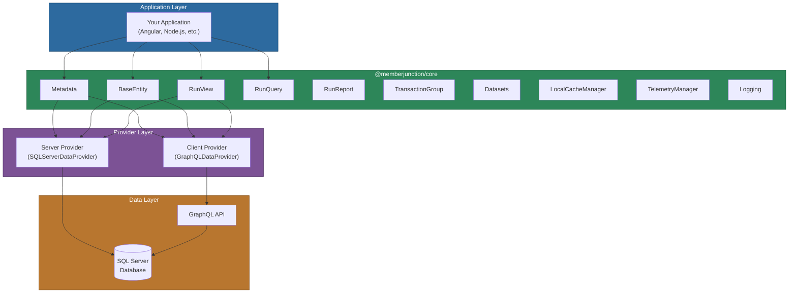
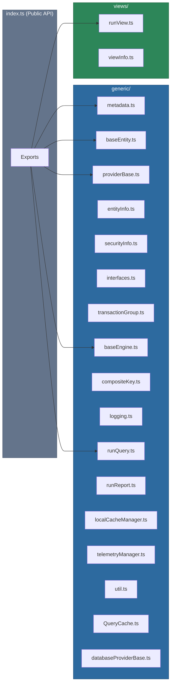
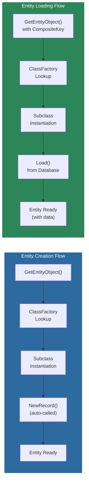
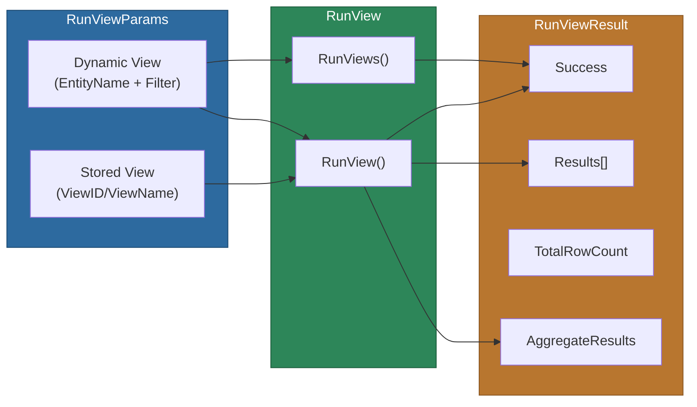
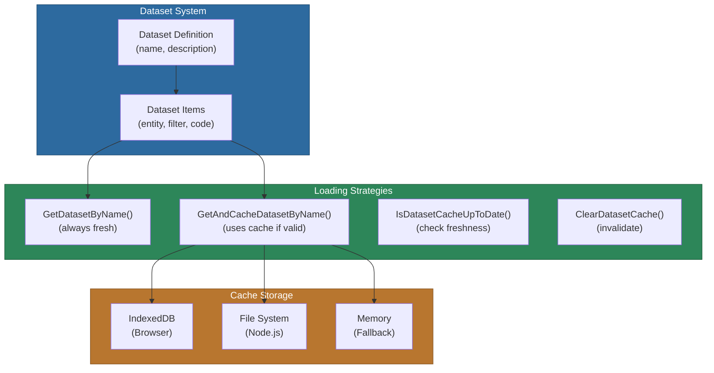
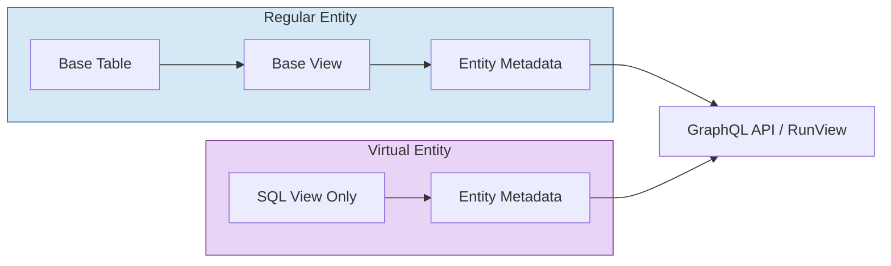
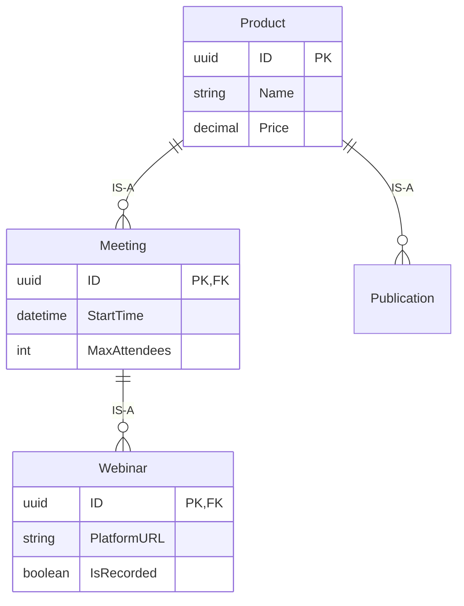

# @memberjunction/core

The `@memberjunction/core` library is the foundational package of the MemberJunction ecosystem. It provides a comprehensive, tier-independent interface for metadata management, entity data access, view and query execution, transaction management, security, and more. All MemberJunction applications -- whether running on the server, in the browser, or via API -- depend on this package.

## Installation

```bash
npm install @memberjunction/core
```

## Architecture Overview



The package uses a **provider model** that allows the same application code to run transparently on different tiers. On the server, a `SQLServerDataProvider` communicates directly with the database. On the client, a `GraphQLDataProvider` routes requests through the GraphQL API. Your code does not need to know which provider is active.

## Key Features

- **Metadata-Driven Architecture** -- Complete access to MemberJunction metadata including entities, fields, relationships, and permissions
- **Entity Data Access** -- Type-safe base classes for loading, saving, and manipulating entity records with dirty tracking and validation
- **View Execution** -- Powerful view running capabilities for both stored and dynamic views with filtering, pagination, and aggregation
- **Query Execution** -- Secure parameterized query execution with Nunjucks templates and SQL injection protection
- **Transaction Management** -- Support for grouped database transactions with atomic commits
- **Provider Architecture** -- Flexible provider model supporting different execution environments (server, client, API)
- **Bulk Data Loading** -- Dataset system for efficient loading of related entity collections
- **Local Caching** -- Intelligent local cache manager with TTL, LRU eviction, and differential updates
- **Vector Embeddings** -- Built-in support for AI-powered text embeddings and similarity search
- **Enhanced Logging** -- Structured logging with metadata, categories, severity levels, and verbose control
- **Telemetry** -- Session-level event tracking for performance monitoring and pattern detection
- **BaseEngine Pattern** -- Abstract engine base class for building singleton services with automatic data loading

## Module Structure



| File | Purpose |
|------|---------|
| `metadata.ts` | Primary entry point for accessing MemberJunction metadata and creating entity objects |
| `baseEntity.ts` | Foundation class for all entity record manipulation with state tracking and events |
| `providerBase.ts` | Abstract base class all providers extend, contains caching and refresh logic |
| `entityInfo.ts` | Entity metadata classes: `EntityInfo`, `EntityFieldInfo`, `EntityRelationshipInfo`, etc. |
| `securityInfo.ts` | Security classes: `UserInfo`, `RoleInfo`, `AuthorizationInfo`, `AuditLogTypeInfo` |
| `interfaces.ts` | Core interfaces: `IMetadataProvider`, `IEntityDataProvider`, `IRunViewProvider`, etc. |
| `compositeKey.ts` | `CompositeKey` and `KeyValuePair` for multi-field primary key support |
| `transactionGroup.ts` | `TransactionGroupBase` for atomic multi-entity operations |
| `baseEngine.ts` | `BaseEngine` abstract singleton for building services with auto-loaded data |
| `runQuery.ts` | `RunQuery` class for secure parameterized query execution |
| `runReport.ts` | `RunReport` class for report generation |
| `logging.ts` | `LogStatus`, `LogError`, `LogStatusEx`, `LogErrorEx`, verbose controls |
| `localCacheManager.ts` | `LocalCacheManager` for client-side caching with TTL and LRU eviction |
| `telemetryManager.ts` | `TelemetryManager` for operation tracking and pattern detection |
| `queryCache.ts` / `QueryCacheConfig.ts` | LRU query result cache with TTL support |
| `databaseProviderBase.ts` | `DatabaseProviderBase` for server-side SQL execution and transactions |
| `util.ts` | Utility functions: `TypeScriptTypeFromSQLType`, `FormatValue`, `CodeNameFromString` |
| `runView.ts` | `RunView` class and `RunViewParams` for executing stored and dynamic views |
| `viewInfo.ts` | View metadata classes: `ViewInfo`, `ViewColumnInfo`, `ViewFilterInfo` |

---

## Core Components

### Metadata

The `Metadata` class is the primary entry point for accessing MemberJunction metadata and instantiating entity objects. It delegates to a provider set at application startup.

```typescript
import { Metadata } from '@memberjunction/core';

const md = new Metadata();

// Refresh cached metadata
await md.Refresh();

// Access metadata collections
const entities = md.Entities;          // EntityInfo[]
const applications = md.Applications;  // ApplicationInfo[]
const currentUser = md.CurrentUser;    // UserInfo
const roles = md.Roles;               // RoleInfo[]
const queries = md.Queries;            // QueryInfo[]
```

#### Metadata Properties

| Property | Type | Description |
|----------|------|-------------|
| `Applications` | `ApplicationInfo[]` | All applications in the system |
| `Entities` | `EntityInfo[]` | All entity definitions with fields, relationships, permissions |
| `CurrentUser` | `UserInfo` | Current authenticated user (client-side only) |
| `Roles` | `RoleInfo[]` | System roles |
| `AuditLogTypes` | `AuditLogTypeInfo[]` | Available audit log types |
| `Authorizations` | `AuthorizationInfo[]` | Authorization definitions |
| `Libraries` | `LibraryInfo[]` | Registered libraries |
| `Queries` | `QueryInfo[]` | Query definitions |
| `QueryFields` | `QueryFieldInfo[]` | Query field metadata |
| `QueryCategories` | `QueryCategoryInfo[]` | Query categorization |
| `QueryPermissions` | `QueryPermissionInfo[]` | Query-level permissions |
| `VisibleExplorerNavigationItems` | `ExplorerNavigationItem[]` | Navigation items visible to the current user |
| `AllExplorerNavigationItems` | `ExplorerNavigationItem[]` | All navigation items (including hidden) |
| `ProviderType` | `'Database' \| 'Network'` | Whether the active provider connects directly to DB or via network |
| `LocalStorageProvider` | `ILocalStorageProvider` | Persistent local storage (IndexedDB, file, memory) |

#### Helper Methods

```typescript
// Look up entities by name or ID
const entityId = md.EntityIDFromName('Users');
const entityName = md.EntityNameFromID('12345');
const entityInfo = md.EntityByName('users');   // case-insensitive
const entity = md.EntityByID('12345');

// Record operations
const name = await md.GetEntityRecordName('Users', compositeKey);
const names = await md.GetEntityRecordNames(infoArray);
const isFavorite = await md.GetRecordFavoriteStatus(userId, 'Orders', key);
await md.SetRecordFavoriteStatus(userId, 'Orders', key, true);

// Dependencies and duplicates
const deps = await md.GetRecordDependencies('Orders', primaryKey);
const entityDeps = await md.GetEntityDependencies('Orders');
const dupes = await md.GetRecordDuplicates(duplicateRequest);

// Record merging
const mergeResult = await md.MergeRecords(mergeRequest);

// Record change history (built-in version control)
const changes = await md.GetRecordChanges<RecordChangeEntity>('Users', primaryKey);

// Transactions
const txGroup = await md.CreateTransactionGroup();
```

### GetEntityObject()

`GetEntityObject<T>()` is the correct way to create entity instances. It uses the MemberJunction class factory to ensure the proper subclass is instantiated and supports two overloads.



#### Creating New Records

```typescript
// NewRecord() is called automatically
const customer = await md.GetEntityObject<CustomerEntity>('Customers');
customer.Name = 'Acme Corp';
await customer.Save();

// Server-side with context user
const order = await md.GetEntityObject<OrderEntity>('Orders', contextUser);
```

#### Loading Existing Records

```typescript
import { CompositeKey } from '@memberjunction/core';

// Load by ID (most common)
const user = await md.GetEntityObject<UserEntity>('Users', CompositeKey.FromID(userId));

// Load by named field
const userByEmail = await md.GetEntityObject<UserEntity>('Users',
    CompositeKey.FromKeyValuePair('Email', 'user@example.com'));

// Load with composite primary key
const orderItem = await md.GetEntityObject<OrderItemEntity>('OrderItems',
    CompositeKey.FromKeyValuePairs([
        { FieldName: 'OrderID', Value: orderId },
        { FieldName: 'ProductID', Value: productId }
    ]));

// Server-side with context user
const order = await md.GetEntityObject<OrderEntity>('Orders',
    CompositeKey.FromID(orderId), contextUser);
```

### BaseEntity

The `BaseEntity` class is the foundation for all entity record manipulation. All entity classes generated by CodeGen extend it.

#### Field Access

```typescript
// Type-safe property access (via generated getters/setters)
const name = user.FirstName;
user.FirstName = 'Jane';

// Dynamic field access
const value = user.Get('FirstName');
user.Set('FirstName', 'Jane');

// Field metadata
const field = user.Fields.find(f => f.Name === 'Email');
console.log(field.Dirty);        // Has the value changed?
console.log(field.IsUnique);     // Unique constraint?
console.log(field.IsPrimaryKey); // Primary key?
console.log(field.ReadOnly);     // Read-only field?
```

#### Save and Delete

```typescript
import { EntitySaveOptions } from '@memberjunction/core';

// Simple save
const success = await entity.Save();

// Save with options
const options = new EntitySaveOptions();
options.IgnoreDirtyState = true;     // Force save even if no changes detected
options.SkipEntityAIActions = true;  // Skip AI-related actions
options.SkipEntityActions = true;    // Skip entity actions
await entity.Save(options);

// Delete
await entity.Delete();
```

#### GetAll() for Spread Operator

BaseEntity uses getter/setter properties, so the spread operator will not capture field values. Use `GetAll()` instead.

```typescript
// WRONG -- spread ignores getter properties
const data = { ...entity };

// CORRECT -- GetAll() returns a plain object with all field values
const data = { ...entity.GetAll(), customField: 'value' };
```

#### State Tracking and Events

BaseEntity provides comprehensive state tracking and lifecycle events.

```typescript
import { BaseEntityEvent } from '@memberjunction/core';

// Check operation states
if (entity.IsSaving)   { /* Save in progress */ }
if (entity.IsDeleting) { /* Delete in progress */ }
if (entity.IsLoading)  { /* Load in progress */ }
if (entity.IsBusy)     { /* Any operation in progress */ }

// Subscribe to lifecycle events
const subscription = entity.RegisterEventHandler((event: BaseEntityEvent) => {
    switch (event.type) {
        case 'save_started':
            console.log(`Save started (${event.saveSubType})`); // 'create' or 'update'
            break;
        case 'save':
            console.log('Save completed');
            break;
        case 'delete_started':
            console.log('Delete started');
            break;
        case 'delete':
            console.log('Delete completed, old values:', event.payload?.OldValues);
            break;
        case 'load_started':
            console.log('Load started for key:', event.payload?.CompositeKey);
            break;
        case 'load_complete':
            console.log('Load completed');
            break;
        case 'new_record':
            console.log('NewRecord() called');
            break;
    }
});

// Unsubscribe when done
subscription.unsubscribe();
```

#### Awaiting In-Progress Operations

```typescript
// Wait for an in-progress save to complete before proceeding
await entity.EnsureSaveComplete();
await entity.EnsureDeleteComplete();
await entity.EnsureLoadComplete();
```

#### Save Debouncing

Multiple rapid calls to `Save()` or `Delete()` are automatically debounced -- the second call receives the same result as the first.

```typescript
const promise1 = entity.Save();
const promise2 = entity.Save(); // Returns same promise, no duplicate save
const [result1, result2] = await Promise.all([promise1, promise2]);
// result1 === result2
```

#### Global Event Subscription

Monitor all entity operations across the application.

```typescript
import { MJGlobal, MJEventType, BaseEntity, BaseEntityEvent } from '@memberjunction/core';

MJGlobal.Instance.GetEventListener(true).subscribe((event) => {
    if (event.event === MJEventType.ComponentEvent &&
        event.eventCode === BaseEntity.BaseEventCode) {
        const entityEvent = event.args as BaseEntityEvent;
        console.log(`[${entityEvent.baseEntity.EntityInfo.Name}] ${entityEvent.type}`);
    }
});
```

#### Validation

```typescript
const result = entity.Validate();
if (!result.Success) {
    for (const error of result.Errors) {
        console.error(`${error.Source}: ${error.Message}`);
    }
}
```

### CompositeKey

The `CompositeKey` class provides flexible primary key representation supporting both single and multi-field primary keys.

```typescript
import { CompositeKey, KeyValuePair } from '@memberjunction/core';

// Single ID field
const key = CompositeKey.FromID('abc-123');

// Named single field
const key2 = CompositeKey.FromKeyValuePair('Email', 'user@example.com');

// Composite key
const key3 = CompositeKey.FromKeyValuePairs([
    { FieldName: 'OrderID', Value: orderId },
    { FieldName: 'ProductID', Value: productId }
]);

// Key operations
const value = key.GetValueByFieldName('ID');
const str = key.ToString();            // "ID=abc-123"
const concat = key.ToConcatenatedString(); // "abc-123"
const valid = key.Validate();           // { IsValid: boolean, ErrorMessage: string }
```

---

### RunView

The `RunView` class provides powerful view execution capabilities for both stored and dynamic queries.



#### Basic Usage

```typescript
import { RunView, RunViewParams } from '@memberjunction/core';

const rv = new RunView();

// Run a stored view by name
const result = await rv.RunView({
    ViewName: 'Active Users',
    ExtraFilter: "CreatedDate > '2024-01-01'"
});

// Run a dynamic view with entity objects returned
const typedResult = await rv.RunView<UserEntity>({
    EntityName: 'Users',
    ExtraFilter: 'IsActive = 1',
    OrderBy: 'LastName ASC, FirstName ASC',
    Fields: ['ID', 'FirstName', 'LastName', 'Email'],
    ResultType: 'entity_object'
});

// Access results
if (typedResult.Success) {
    const users = typedResult.Results; // UserEntity[]
    console.log(`Found ${users.length} users`);
}
```

#### Batch Multiple Views

Use `RunViews` (plural) to execute multiple independent queries in a single operation.

```typescript
const [users, roles, permissions] = await rv.RunViews([
    {
        EntityName: 'Users',
        ExtraFilter: 'IsActive = 1',
        ResultType: 'entity_object'
    },
    {
        EntityName: 'Roles',
        OrderBy: 'Name',
        ResultType: 'entity_object'
    },
    {
        EntityName: 'Entity Permissions',
        ResultType: 'simple'
    }
]);
```

#### Aggregates

Request aggregate calculations that run in parallel with the main query, unaffected by pagination.

```typescript
const result = await rv.RunView<OrderEntity>({
    EntityName: 'Orders',
    ExtraFilter: "Status = 'Completed'",
    MaxRows: 50,
    Aggregates: [
        { expression: 'SUM(TotalAmount)', alias: 'TotalRevenue' },
        { expression: 'COUNT(*)', alias: 'OrderCount' },
        { expression: 'AVG(TotalAmount)', alias: 'AverageOrder' }
    ]
});

// Aggregate results are in result.AggregateResults[]
```

#### ResultType and Fields Optimization

```typescript
// entity_object -- full BaseEntity objects for mutation (Fields is ignored)
const mutableResult = await rv.RunView<UserEntity>({
    EntityName: 'Users',
    ResultType: 'entity_object'
});

// simple -- plain JavaScript objects for read-only use (use Fields for performance)
const readOnlyResult = await rv.RunView<{ ID: string; Name: string }>({
    EntityName: 'Users',
    Fields: ['ID', 'Name'],
    ResultType: 'simple'
});

// count_only -- returns only TotalRowCount, no rows
const countResult = await rv.RunView({
    EntityName: 'Users',
    ExtraFilter: 'IsActive = 1',
    ResultType: 'count_only'
});
```

#### RunViewParams Reference

| Parameter | Type | Description |
|-----------|------|-------------|
| `ViewID` | `string` | ID of stored view to run |
| `ViewName` | `string` | Name of stored view to run |
| `ViewEntity` | `BaseEntity` | Pre-loaded view entity (for performance) |
| `EntityName` | `string` | Entity name for dynamic views |
| `ExtraFilter` | `string` | Additional SQL WHERE clause |
| `OrderBy` | `string` | SQL ORDER BY clause |
| `Fields` | `string[]` | Field names to return (simple mode only) |
| `UserSearchString` | `string` | User search term |
| `MaxRows` | `number` | Maximum rows to return |
| `StartRow` | `number` | Row offset for pagination |
| `ResultType` | `'simple' \| 'entity_object' \| 'count_only'` | Result format |
| `IgnoreMaxRows` | `boolean` | Bypass entity MaxRows setting |
| `SaveViewResults` | `boolean` | Store run results for future exclusion |
| `ExcludeUserViewRunID` | `string` | Exclude records from a specific prior run |
| `ExcludeDataFromAllPriorViewRuns` | `boolean` | Exclude all previously returned records |
| `ForceAuditLog` | `boolean` | Force audit log entry |
| `CacheLocal` | `boolean` | Use LocalCacheManager for caching |
| `CacheLocalTTL` | `number` | Cache TTL in milliseconds |
| `Aggregates` | `AggregateExpression[]` | Aggregate expressions to compute |

---

### RunQuery

The `RunQuery` class provides secure execution of parameterized stored queries with Nunjucks templates and SQL injection protection.

```typescript
import { RunQuery, RunQueryParams } from '@memberjunction/core';

const rq = new RunQuery();

// Execute by Query ID
const result = await rq.RunQuery({
    QueryID: '12345',
    Parameters: {
        StartDate: '2024-01-01',
        EndDate: '2024-12-31',
        Status: 'Active'
    }
});

// Execute by Query Name and Category Path
const namedResult = await rq.RunQuery({
    QueryName: 'Monthly Sales Report',
    CategoryPath: '/Sales/',
    Parameters: { Month: 12, Year: 2024 }
});

// Execute ad-hoc SQL (SELECT/WITH only — validated and run on read-only connection)
const adhocResult = await rq.RunQuery({
    SQL: 'SELECT TOP 100 Name, Status FROM __mj.vwUsers WHERE IsActive = 1'
});

if (result.Success) {
    console.log(`Rows: ${result.RowCount}, Time: ${result.ExecutionTime}ms`);
} else {
    console.error('Query failed:', result.ErrorMessage);
}
```

#### SQL Security Filters

Parameterized queries use Nunjucks templates with built-in SQL injection protection filters:

| Filter | Purpose | Example |
|--------|---------|---------|
| `sqlString` | Escapes strings, wraps in quotes | `{{ name \| sqlString }}` produces `'O''Brien'` |
| `sqlNumber` | Validates numeric values | `{{ amount \| sqlNumber }}` produces `1000.5` |
| `sqlDate` | Formats dates as ISO 8601 | `{{ date \| sqlDate }}` produces `'2024-01-15T00:00:00.000Z'` |
| `sqlBoolean` | Converts to SQL bit | `{{ flag \| sqlBoolean }}` produces `1` |
| `sqlIdentifier` | Brackets identifiers | `{{ table \| sqlIdentifier }}` produces `[UserAccounts]` |
| `sqlIn` | Formats arrays for IN clauses | `{{ list \| sqlIn }}` produces `('A', 'B', 'C')` |
| `sqlNoKeywordsExpression` | Blocks dangerous SQL keywords | Allows `Revenue DESC`, blocks `DROP TABLE` |

---

### RunReport

Execute reports by ID.

```typescript
import { RunReport, RunReportParams } from '@memberjunction/core';

const rr = new RunReport();
const result = await rr.RunReport({ ReportID: '12345' });
```

---

### TransactionGroup

Group multiple entity operations into an atomic transaction.

```typescript
import { Metadata } from '@memberjunction/core';

const md = new Metadata();
const txGroup = await md.CreateTransactionGroup();

// Add entities to the transaction
await txGroup.AddTransaction(entity1);
await txGroup.AddTransaction(entity2);

// Submit all operations as a single transaction
const results = await txGroup.Submit();
```

Each `TransactionResult` in the returned array contains a `Success` flag. If any operation fails, all are rolled back.

---

### Datasets

Datasets enable efficient bulk loading of related entity collections in a single operation, reducing database round trips.



```typescript
import { DatasetItemFilterType } from '@memberjunction/core';

const md = new Metadata();

// Load dataset with caching
const dataset = await md.GetAndCacheDatasetByName('ProductCatalog');

// Load with item-specific filters
const filters: DatasetItemFilterType[] = [
    { ItemCode: 'Products', Filter: 'IsActive = 1' },
    { ItemCode: 'Categories', Filter: 'ParentID IS NULL' }
];
const filteredDataset = await md.GetAndCacheDatasetByName('ProductCatalog', filters);

if (filteredDataset.Success) {
    for (const item of filteredDataset.Results) {
        console.log(`Loaded ${item.Results.length} records for ${item.EntityName}`);
    }
}

// Check if cache is up-to-date
const isUpToDate = await md.IsDatasetCacheUpToDate('ProductCatalog');

// Clear cache
await md.ClearDatasetCache('ProductCatalog');
```

---

### BaseEngine

The `BaseEngine` abstract class is a singleton pattern for building engine/service classes that auto-load and auto-refresh data from entities or datasets.

```typescript
import { BaseEngine, BaseEnginePropertyConfig } from '@memberjunction/core';

export class MyEngine extends BaseEngine<MyEngine> {
    public static get Instance(): MyEngine {
        return super.getInstance<MyEngine>();
    }

    public MyData: SomeEntity[] = [];

    protected get Config(): BaseEnginePropertyConfig[] {
        return [
            {
                PropertyName: 'MyData',
                EntityName: 'Some Entity',
                Filter: 'IsActive = 1',
                OrderBy: 'Name ASC',
                AutoRefresh: true      // Auto-refresh on entity save/delete events
            }
        ];
    }
}

// Usage
await MyEngine.Instance.Config(false, contextUser);
const data = MyEngine.Instance.MyData;
```

Key features:
- Singleton per class via `BaseSingleton`
- Declarative data loading via `BaseEnginePropertyConfig`
- Automatic refresh when entities are saved or deleted (debounced)
- Local caching support via `CacheLocal` and `CacheLocalTTL` options
- Supports both entity and dataset loading

---

### LocalCacheManager

The `LocalCacheManager` provides intelligent client-side caching for RunView and RunQuery results with TTL, LRU eviction, and differential updates.

```typescript
import { LocalCacheManager } from '@memberjunction/core';

const cache = LocalCacheManager.Instance;

// Initialize with a storage provider
cache.Init(localStorageProvider);

// Cache statistics
const stats = cache.GetStats();
console.log(`Entries: ${stats.totalEntries}, Hits: ${stats.hits}, Misses: ${stats.misses}`);

// Clear all cached data
await cache.ClearAll();
```

To use caching with RunView, set `CacheLocal: true` in your `RunViewParams`:

```typescript
const result = await rv.RunView({
    EntityName: 'Products',
    ExtraFilter: 'IsActive = 1',
    CacheLocal: true,
    CacheLocalTTL: 300000  // 5 minutes
});
```

---

### DatabaseProviderBase

An abstract class for server-side providers that need direct SQL execution and transaction control.

```typescript
// Implemented by providers like SQLServerDataProvider
abstract class DatabaseProviderBase extends ProviderBase {
    abstract ExecuteSQL<T>(query: string, parameters?: unknown[], options?: ExecuteSQLOptions): Promise<T[]>;
    abstract BeginTransaction(): Promise<void>;
    abstract CommitTransaction(): Promise<void>;
    abstract RollbackTransaction(): Promise<void>;
}
```

---

## Provider Architecture

MemberJunction uses a provider model set once at application startup via `SetProvider()`.

```typescript
import { SetProvider } from '@memberjunction/core';

// The provider handles all data access transparently
SetProvider(myProvider);
```

This single call configures the provider for `Metadata`, `BaseEntity`, `RunView`, `RunReport`, and `RunQuery` simultaneously.

### Metadata Caching Optimization

Subsequent provider instances can reuse cached metadata from the first loaded instance to avoid redundant database calls in multi-user server environments.

```typescript
const config = new ProviderConfigDataBase(
    connectionPool,
    '__mj',
    undefined,
    undefined,
    false  // ignoreExistingMetadata = false to reuse cached metadata
);
```

---

## Security and Permissions

```typescript
const md = new Metadata();
const user = md.CurrentUser;
console.log(user.Email, user.IsActive, user.Type);

// Entity-level permissions
const entity = md.EntityByName('Orders');
console.log(entity.AllowCreateAPI);  // Can create via API?
console.log(entity.AllowUpdateAPI);  // Can update via API?
console.log(entity.AllowDeleteAPI);  // Can delete via API?

// Role-based permissions
const permissions = entity.Permissions; // EntityPermissionInfo[]
for (const perm of permissions) {
    console.log(perm.RoleName, perm.CanCreate, perm.CanRead, perm.CanUpdate, perm.CanDelete);
}
```

---

## Logging

### Basic Logging

```typescript
import { LogStatus, LogError } from '@memberjunction/core';

LogStatus('Operation completed successfully');
LogError('Something went wrong', null, additionalData);
LogStatus('Writing to file', '/logs/output.log');
```

### Enhanced Logging

```typescript
import { LogStatusEx, LogErrorEx, IsVerboseLoggingEnabled, SetVerboseLogging } from '@memberjunction/core';

// Verbose-only logging
LogStatusEx({
    message: 'Detailed trace information',
    verboseOnly: true,
    category: 'BatchProcessor'
});

// Structured error logging
LogErrorEx({
    message: 'Failed to process request',
    error: new Error('Network timeout'),
    severity: 'critical',
    category: 'NetworkError',
    metadata: { url: 'https://api.example.com', timeout: 5000 },
    includeStack: true
});

// Control verbose logging
SetVerboseLogging(true);   // Browser: sets window.MJ_VERBOSE and localStorage
if (IsVerboseLoggingEnabled()) { /* ... */ }
```

Verbose logging is controlled by the `MJ_VERBOSE` environment variable (Node.js), global variable, localStorage item, or URL parameter (browser).

---

## TelemetryManager

Session-level performance tracking with pattern detection.

```typescript
import { TelemetryManager } from '@memberjunction/core';

const tm = TelemetryManager.Instance;
tm.SetEnabled(true);

// Track an operation
const eventId = tm.StartEvent('RunView', 'MyComponent.LoadData', {
    EntityName: 'Users',
    ResultType: 'entity_object'
});
// ... perform operation
tm.EndEvent(eventId, { cacheHit: false, resultCount: 50 });

// Get patterns for analysis
const patterns = tm.GetPatterns({ category: 'RunView', minCount: 2 });
```

---

## Vector Embeddings Support

BaseEntity includes built-in methods for generating and managing vector embeddings for text fields.

```typescript
import { BaseEntity, SimpleEmbeddingResult } from '@memberjunction/core';

// In a server-side entity subclass:
export class MyEntityServer extends MyEntity {
    public async Save(): Promise<boolean> {
        await this.GenerateEmbeddingsByFieldName([
            {
                fieldName: 'Description',
                vectorFieldName: 'DescriptionVector',
                modelFieldName: 'DescriptionVectorModelID'
            }
        ]);
        return await super.Save();
    }

    protected async EmbedTextLocal(textToEmbed: string): Promise<SimpleEmbeddingResult> {
        // Implement with your AI provider
        return { vector: [...], modelID: '...' };
    }
}
```

Features:
- **Dirty Detection** -- Only generates embeddings when source text changes
- **Null Handling** -- Clears vector fields when source text is empty
- **Parallel Processing** -- Multiple embeddings generated concurrently

---

## Utility Functions

```typescript
import {
    TypeScriptTypeFromSQLType,
    FormatValue,
    CodeNameFromString,
    SQLFullType,
    SQLMaxLength
} from '@memberjunction/core';

// SQL type to TypeScript type mapping
TypeScriptTypeFromSQLType('nvarchar');   // 'string'
TypeScriptTypeFromSQLType('int');         // 'number'
TypeScriptTypeFromSQLType('bit');         // 'boolean'
TypeScriptTypeFromSQLType('datetime');    // 'Date'

// Format values for display
FormatValue('money', 1234.5);             // '$1,234.50'
FormatValue('nvarchar', longText, 2, 'USD', 50); // Truncated with '...'

// Generate code-safe names
CodeNameFromString('First Name');          // 'FirstName'
```

---

## Error Handling

RunView and RunQuery do NOT throw exceptions on failure. Always check `Success`:

```typescript
const result = await rv.RunView<UserEntity>({
    EntityName: 'Users',
    ExtraFilter: 'IsActive = 1'
});

if (result.Success) {
    const users = result.Results;
} else {
    console.error('View failed:', result.ErrorMessage);
}
```

For BaseEntity operations, check the return value and `LatestResult`:

```typescript
const saved = await entity.Save();
if (!saved) {
    const error = entity.LatestResult;
    console.error('Save failed:', error.Message);

    if (error.ValidationErrors?.length > 0) {
        for (const ve of error.ValidationErrors) {
            console.error(`${ve.Source}: ${ve.Message}`);
        }
    }
}
```

---

## Best Practices

1. **Always use `Metadata.GetEntityObject()`** to create entity instances -- never use `new` directly
2. **Use generic types** with `RunView<T>` and `GetEntityObject<T>` for type safety
3. **Use `RunViews` (plural)** to batch multiple independent queries into one operation
4. **Use `ResultType: 'simple'` with `Fields`** for read-only data to improve performance
5. **Check `Success`** on RunView/RunQuery results -- these methods do not throw on failure
6. **Pass `contextUser`** in server-side code for proper security and audit tracking
7. **Use `GetAll()`** instead of the spread operator on BaseEntity instances
8. **Override both `Load()` and `LoadFromData()`** in subclasses that need custom loading logic
9. **Use transactions** for related operations that must succeed or fail together
10. **Leverage entity metadata** for dynamic UI generation and validation

---

## Dependencies

| Package | Description |
|---------|-------------|
| [@memberjunction/global](../MJGlobal/README.md) | Core global utilities, class factory, and singleton patterns |
| [rxjs](https://rxjs.dev/) | Reactive programming support for observables and event streams |
| [zod](https://zod.dev/) | Schema validation for entity fields |
| [debug](https://www.npmjs.com/package/debug) | Debug logging utilities with namespace support |

## Related Packages

### Provider Implementations

| Package | Description |
|---------|-------------|
| [@memberjunction/sqlserver-dataprovider](../SQLServerDataProvider/README.md) | SQL Server database provider for server-side operations |
| [@memberjunction/graphql-dataprovider](../GraphQLDataProvider/README.md) | GraphQL provider for client-side applications |

### Entity Extensions

| Package | Description |
|---------|-------------|
| [@memberjunction/core-entities](../MJCoreEntities/README.md) | Extended entity classes for MemberJunction system entities |

### UI Frameworks

| Package | Description |
|---------|-------------|
| [@memberjunction/ng-shared](../Angular/Shared/README.md) | Angular-specific components and services |
| [@memberjunction/ng-explorer-core](../Angular/Explorer/core/README.md) | Core Angular explorer components |

### AI Integration

| Package | Description |
|---------|-------------|
| [@memberjunction/ai](../AI/Core/README.md) | AI framework core abstractions |
| [@memberjunction/aiengine](../AI/Engine/README.md) | AI orchestration engine |

### Communication

| Package | Description |
|---------|-------------|
| [@memberjunction/communication-engine](../Communication/engine/README.md) | Multi-channel communication framework |

### Actions

| Package | Description |
|---------|-------------|
| [@memberjunction/actions](../Actions/Engine/README.md) | Business logic action framework |

---

## Breaking Changes

### v2.131.0
- **Entity State Tracking**: New `IsSaving`, `IsDeleting`, `IsLoading`, and `IsBusy` getters on BaseEntity.
- **Operation Lifecycle Events**: New event types `save_started`, `delete_started`, `load_started`, and `load_complete`.
- **Delete Debouncing**: `Delete()` now has the same debouncing behavior as `Save()`.
- **Global Event Broadcasting**: All operation events are broadcast globally via MJGlobal.

### v2.59.0
- **Enhanced Logging Functions**: New `LogStatusEx` and `LogErrorEx` with structured logging. Existing `LogStatus` and `LogError` remain fully backward compatible.
- **Verbose Logging Control**: New `IsVerboseLoggingEnabled()` and `SetVerboseLogging()` functions.

### v2.58.0
- **GetEntityObject() auto-calls NewRecord()**: No longer necessary to call `NewRecord()` manually.
- **UUID Generation**: Entities with non-auto-increment uniqueidentifier primary keys get UUIDs automatically.

### v2.52.0
- **LoadFromData() is now async**: Update calls to use `await`.

---

## TypeScript Support

This library is written in TypeScript and provides full type definitions. All generated entity classes include proper typing for IntelliSense support. The package uses TypeScript strict mode and enforces strong typing throughout -- `any` types are not used.

## License

ISC License - see LICENSE file for details.

## Virtual Entities

Virtual entities are **read-only entities backed by SQL views** rather than physical database tables. They appear in the metadata catalog alongside regular entities but have no underlying base table — only a base view. This makes them ideal for exposing aggregated data, cross-database views, or complex computed datasets as first-class entities.



### Key Properties

| Property | Regular Entity | Virtual Entity |
|----------|---------------|----------------|
| `VirtualEntity` | `false` | `true` |
| `BaseTable` | Physical table name | Same as `BaseView` |
| `AllowCreateAPI` | Configurable | Always `false` |
| `AllowUpdateAPI` | Configurable | Always `false` |
| Stored procedures | Generated | None |

### Read-Only Enforcement

Virtual entities are enforced as read-only at multiple layers:

1. **Runtime Guard** — `BaseEntity.CheckPermissions()` blocks Create, Update, and Delete:
   ```typescript
   if (this.EntityInfo.VirtualEntity &&
       (type === EntityPermissionType.Create ||
        type === EntityPermissionType.Update ||
        type === EntityPermissionType.Delete)) {
       throw new Error(
           `Cannot ${type} on virtual entity '${this.EntityInfo.Name}' — virtual entities are read-only`
       );
   }
   ```
2. **API Flags** — `AllowCreateAPI`, `AllowUpdateAPI`, `AllowDeleteAPI` are all `false`
3. **CodeGen** — No stored procedures are generated

### Using Virtual Entities

```typescript
import { Metadata, RunView } from '@memberjunction/core';

// Read operations work identically to regular entities
const rv = new RunView();
const result = await rv.RunView({
    EntityName: 'Sales Summary',
    ExtraFilter: `RegionID = '${regionId}'`,
    ResultType: 'simple'
});

// Access metadata
const md = new Metadata();
const entity = md.EntityByName('Sales Summary');
console.log(entity.VirtualEntity);  // true
console.log(entity.BaseView);       // 'vwSalesSummary'

// Save() and Delete() will throw — virtual entities are read-only
```

> **Full Guide**: See [Virtual Entities Guide](./docs/virtual-entities.md) for config-driven creation, LLM-assisted field decoration, field metadata, and troubleshooting.

## IS-A Type Relationships (Type Inheritance)

MemberJunction supports **IS-A type relationships** (also called Table-Per-Type / TPT) where a child entity shares its parent's primary key and inherits all parent fields. This enables type hierarchies like `Meeting IS-A Product` or `Webinar IS-A Meeting IS-A Product`.



### How It Works

Child entities share the parent's primary key (same UUID). At runtime, `BaseEntity` uses **persistent composition** — each child instance holds a live reference to its parent entity through `_parentEntity`. All field access, dirty tracking, validation, and save/delete orchestration flow through this composition chain automatically.

### EntityInfo IS-A Properties

```typescript
const md = new Metadata();
const meeting = md.EntityByName('Meetings');

meeting.IsChildType;        // true — has a ParentID
meeting.ParentEntityInfo;   // EntityInfo for 'Products'
meeting.ParentChain;        // [ProductsEntityInfo] — all ancestors
meeting.AllParentFields;    // EntityFieldInfo[] — inherited fields (excludes PKs, timestamps)
meeting.ParentEntityFieldNames; // Set<string> — cached for O(1) lookup

const product = md.EntityByName('Products');
product.IsParentType;       // true — has child entities
product.ChildEntities;      // [MeetingsEntityInfo, PublicationsEntityInfo]
product.AllowMultipleSubtypes; // false — disjoint (default)
```

### BaseEntity Set/Get Routing

For IS-A child entities, parent fields are automatically routed to the parent entity:

```typescript
const meetingEntity = await md.GetEntityObject<MeetingEntity>('Meetings');

// Own field — stored locally
meetingEntity.Set('StartTime', new Date());

// Parent field — automatically routed to ProductEntity._parentEntity
meetingEntity.Set('Name', 'Annual Conference');
meetingEntity.Get('Name'); // Returns from _parentEntity (authoritative)

// Dirty tracking spans the chain
meetingEntity.Dirty; // true if ANY field in chain is modified
```

### Disjoint vs Overlapping Subtypes

IS-A relationships support two modes, controlled by the parent entity's `AllowMultipleSubtypes` flag:

**Disjoint (default)** — A parent record can be at most ONE child type. The parent auto-chains to its single child via `ISAChild`, and save/delete delegates through the full chain.

```typescript
// Product -> Meeting -> Webinar (disjoint chain)
const meeting = await md.GetEntityObject<MeetingEntity>('Meetings', key);
meeting.ISAChild;    // WebinarEntity (single child, auto-chained)
meeting.ISAChildren; // null (not overlapping)
meeting.LeafEntity;  // WebinarEntity (traverses to deepest child)
```

**Overlapping** (`AllowMultipleSubtypes = true`) — A parent record can simultaneously exist as MULTIPLE child types. The parent does not auto-chain; instead, `ISAChildren` returns an informational list of which child entity types have records for this PK.

```typescript
// Person -> [Members, Speakers, GoldMembers] (overlapping)
const person = await md.GetEntityObject<PersonEntity>('Persons', key);
person.ISAChild;     // null (no single child to chain to)
person.ISAChildren;  // [{entityName: 'Members'}, {entityName: 'Speakers'}, ...]
person.LeafEntity;   // PersonEntity itself (overlapping parent is its own leaf)

// Each child chains independently upward to Person
const member = await md.GetEntityObject<MemberEntity>('Members', key);
member.ISAParent;    // PersonEntity
member.Save();       // Saves Person -> Member (normal IS-A chain)
```

### Save & Delete Orchestration

- **Save** — Parent entities are saved first (inner-to-outer), then the child. On server, a shared SQL transaction wraps the entire chain.
- **Delete (disjoint)** — Child is deleted first, then parents. Disjoint subtype enforcement prevents a parent from being multiple child types simultaneously.
- **Delete (overlapping)** — Child is deleted, then the parent is checked for remaining children. If other children still exist, the parent is preserved. If no children remain, the parent is also deleted.

### Record Change Propagation (Overlapping)

When saving through one branch of an overlapping hierarchy, Record Change entries are automatically propagated to sibling branches that share the same ancestor. This ensures complete audit history across all child types. Propagation is handled at the provider level (`SQLServerDataProvider.PropagateRecordChangesToSiblings`) using a single SQL batch for efficiency.

> **Full Guide**: See [IS-A Relationships Guide](./docs/isa-relationships.md) for the complete data model, runtime object model, save/delete orchestration sequences, overlapping subtypes, Record Change propagation, provider implementations, CodeGen integration, and troubleshooting.

## Documentation

For detailed guides on specific topics, see the [docs/](./docs/) folder:

- [Virtual Entities](./docs/virtual-entities.md) — Config-driven creation, LLM decoration, read-only enforcement
- [IS-A Relationships](./docs/isa-relationships.md) — Type inheritance, save/delete orchestration, provider integration
- [RunQuery Pagination](./docs/runquery-pagination.md) — Parameterized queries with pagination support

## Support

For support, documentation, and examples, visit [MemberJunction.com](https://www.memberjunction.com).
