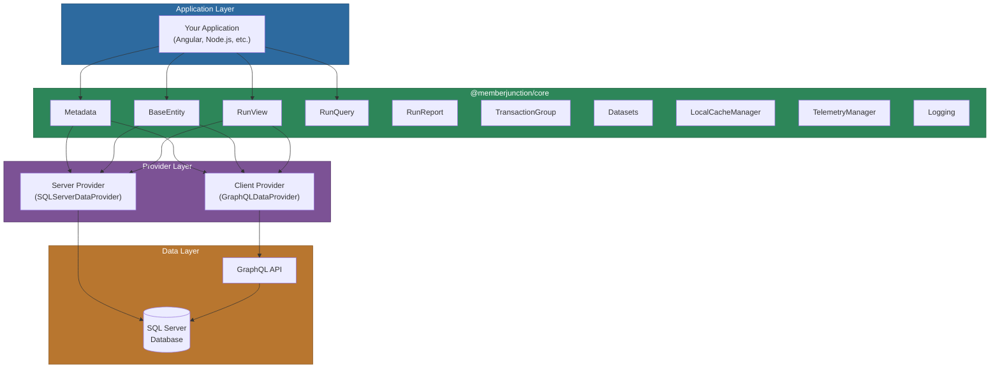
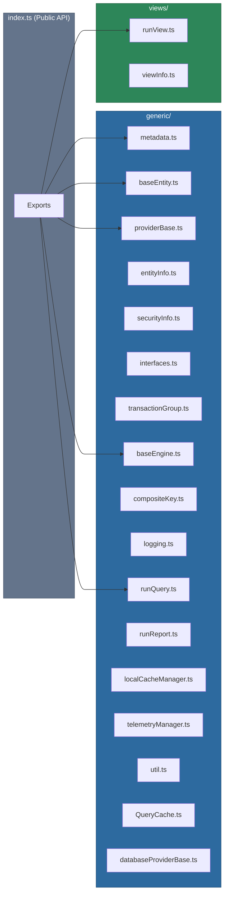
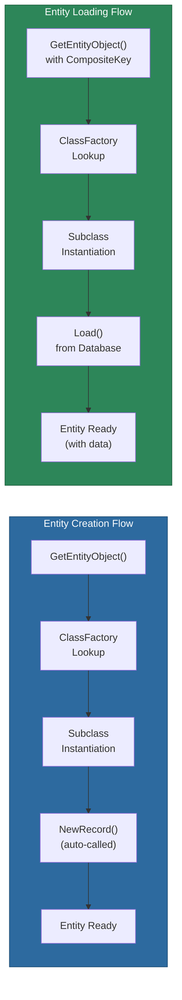
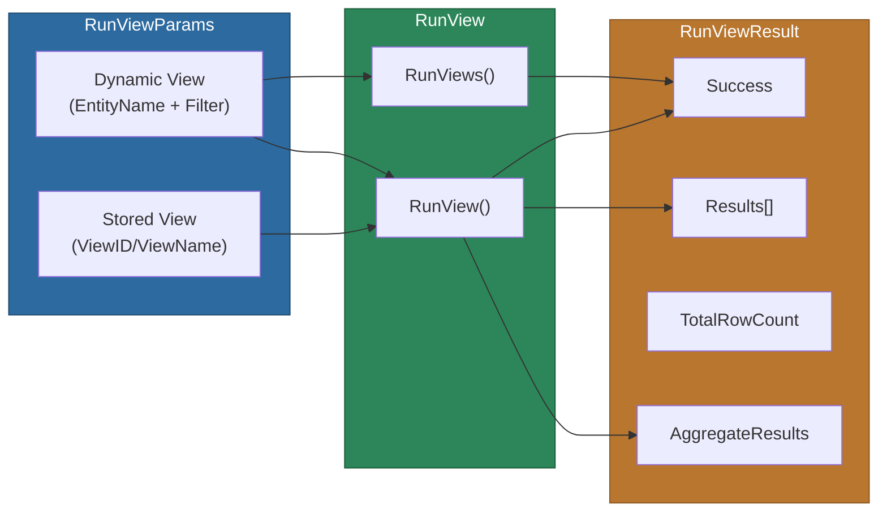
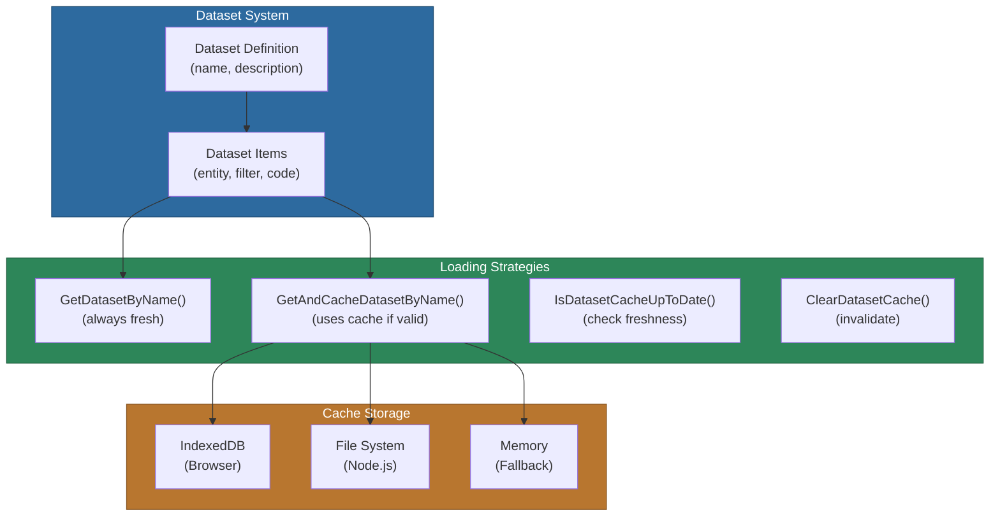
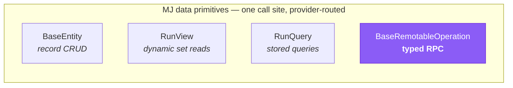
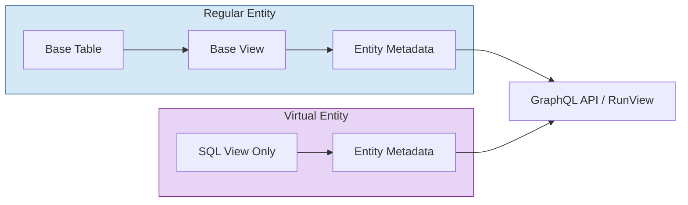
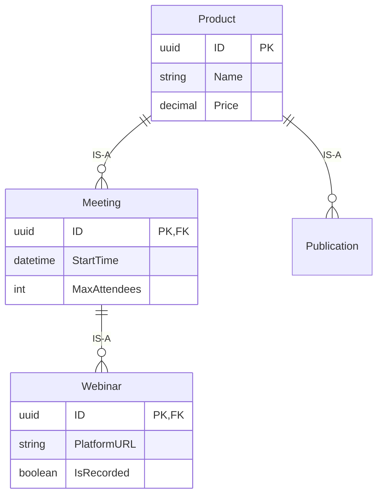

# @memberjunction/core

The `@memberjunction/core` library is the foundational package of the MemberJunction ecosystem. It provides a comprehensive, tier-independent interface for metadata management, entity data access, view and query execution, transaction management, security, and more. All MemberJunction applications -- whether running on the server, in the browser, or via API -- depend on this package.

## Installation

```bash
npm install @memberjunction/core
```

## Architecture Overview


```mermaid
flowchart TB
    subgraph Application["Application Layer"]
        style Application fill:#2d6a9f,stroke:#1a4971,color:#fff
        App["Your Application<br/>(Angular, Node.js, etc.)"]
    end

    subgraph Core["@memberjunction/core"]
        style Core fill:#2d8659,stroke:#1a5c3a,color:#fff
        MD["Metadata"]
        BE["BaseEntity"]
        RV["RunView"]
        RQ["RunQuery"]
        RR["RunReport"]
        TG["TransactionGroup"]
        DS["Datasets"]
        LC["LocalCacheManager"]
        TM["TelemetryManager"]
        LOG["Logging"]
    end

    subgraph Providers["Provider Layer"]
        style Providers fill:#7c5295,stroke:#563a6b,color:#fff
        SP["Server Provider<br/>(SQLServerDataProvider)"]
        CP["Client Provider<br/>(GraphQLDataProvider)"]
    end

    subgraph Data["Data Layer"]
        style Data fill:#b8762f,stroke:#8a5722,color:#fff
        DB[("SQL Server<br/>Database")]
        API["GraphQL API"]
    end

    App --> MD
    App --> BE
    App --> RV
    App --> RQ

    MD --> SP
    MD --> CP
    BE --> SP
    BE --> CP
    RV --> SP
    RV --> CP

    SP --> DB
    CP --> API
    API --> DB
```

The package uses a **provider model** that allows the same application code to run transparently on different tiers. On the server, a `SQLServerDataProvider` communicates directly with the database. On the client, a `GraphQLDataProvider` routes requests through the GraphQL API. Your code does not need to know which provider is active.

## Key Features

- **Metadata-Driven Architecture** -- Complete access to MemberJunction metadata including entities, fields, relationships, and permissions
- **Entity Data Access** -- Type-safe base classes for loading, saving, and manipulating entity records with dirty tracking and validation
- **View Execution** -- Powerful view running capabilities for both stored and dynamic views with filtering, pagination, and aggregation
- **Query Execution** -- Secure parameterized query execution with Nunjucks templates and SQL injection protection
- **Transaction Management** -- Support for grouped database transactions with atomic commits
- **Provider Architecture** -- Flexible provider model supporting different execution environments (server, client, API)
- **Bulk Data Loading** -- Dataset system for efficient loading of related entity collections
- **Local Caching** -- Intelligent local cache manager with TTL, LRU eviction, and differential updates
- **Vector Embeddings** -- Built-in support for AI-powered text embeddings and similarity search
- **Enhanced Logging** -- Structured logging with metadata, categories, severity levels, and verbose control
- **Telemetry** -- Session-level event tracking for performance monitoring and pattern detection
- **BaseEngine Pattern** -- Abstract engine base class for building singleton services with automatic data loading

## Module Structure


```mermaid
flowchart LR
    subgraph index["index.ts (Public API)"]
        style index fill:#64748b,stroke:#475569,color:#fff
        EX["Exports"]
    end

    subgraph generic["generic/"]
        style generic fill:#2d6a9f,stroke:#1a4971,color:#fff
        metadata["metadata.ts"]
        baseEntity["baseEntity.ts"]
        providerBase["providerBase.ts"]
        entityInfo["entityInfo.ts"]
        securityInfo["securityInfo.ts"]
        interfaces["interfaces.ts"]
        transactionGroup["transactionGroup.ts"]
        baseEngine["baseEngine.ts"]
        compositeKey["compositeKey.ts"]
        logging["logging.ts"]
        runQuery["runQuery.ts"]
        runReport["runReport.ts"]
        localCacheManager["localCacheManager.ts"]
        telemetryManager["telemetryManager.ts"]
        util["util.ts"]
        queryCache["QueryCache.ts"]
        databaseProvider["databaseProviderBase.ts"]
    end

    subgraph views["views/"]
        style views fill:#2d8659,stroke:#1a5c3a,color:#fff
        runView["runView.ts"]
        viewInfo["viewInfo.ts"]
    end

    EX --> metadata
    EX --> baseEntity
    EX --> runView
    EX --> providerBase
    EX --> runQuery
    EX --> baseEngine
```

| File | Purpose |
|------|---------|
| `metadata.ts` | Primary entry point for accessing MemberJunction metadata and creating entity objects |
| `baseEntity.ts` | Foundation class for all entity record manipulation with state tracking and events |
| `providerBase.ts` | Abstract base class all providers extend, contains caching and refresh logic |
| `entityInfo.ts` | Entity metadata classes: `EntityInfo`, `EntityFieldInfo`, `EntityRelationshipInfo`, etc. |
| `securityInfo.ts` | Security classes: `UserInfo`, `RoleInfo`, `AuthorizationInfo`, `AuditLogTypeInfo` |
| `interfaces.ts` | Core interfaces: `IMetadataProvider`, `IEntityDataProvider`, `IRunViewProvider`, etc. |
| `compositeKey.ts` | `CompositeKey` and `KeyValuePair` for multi-field primary key support |
| `transactionGroup.ts` | `TransactionGroupBase` for atomic multi-entity operations |
| `baseEngine.ts` | `BaseEngine` abstract singleton for building services with auto-loaded data |
| `runQuery.ts` | `RunQuery` class for secure parameterized query execution |
| `runReport.ts` | `RunReport` class for report generation |
| `logging.ts` | `LogStatus`, `LogError`, `LogStatusEx`, `LogErrorEx`, verbose controls |
| `localCacheManager.ts` | `LocalCacheManager` for client-side caching with TTL and LRU eviction |
| `telemetryManager.ts` | `TelemetryManager` for operation tracking and pattern detection |
| `queryCache.ts` / `QueryCacheConfig.ts` | LRU query result cache with TTL support |
| `databaseProviderBase.ts` | `DatabaseProviderBase` for server-side SQL execution and transactions |
| `util.ts` | Utility functions: `TypeScriptTypeFromSQLType`, `FormatValue`, `CodeNameFromString` |
| `runView.ts` | `RunView` class and `RunViewParams` for executing stored and dynamic views |
| `viewInfo.ts` | View metadata classes: `ViewInfo`, `ViewColumnInfo`, `ViewFilterInfo` |

---

## Core Components

### Metadata

The `Metadata` class is the primary entry point for accessing MemberJunction metadata and instantiating entity objects. It delegates to a provider set at application startup.

```typescript
import { Metadata } from '@memberjunction/core';

const md = new Metadata();

// Refresh cached metadata
await md.Refresh();

// Access metadata collections
const entities = md.Entities;          // EntityInfo[]
const applications = md.Applications;  // ApplicationInfo[]
const currentUser = md.CurrentUser;    // UserInfo
const roles = md.Roles;               // RoleInfo[]
const queries = md.Queries;            // QueryInfo[]
```

#### Metadata Properties

| Property | Type | Description |
|----------|------|-------------|
| `Applications` | `ApplicationInfo[]` | All applications in the system |
| `Entities` | `EntityInfo[]` | All entity definitions with fields, relationships, permissions |
| `CurrentUser` | `UserInfo` | Current authenticated user (client-side only) |
| `Roles` | `RoleInfo[]` | System roles |
| `AuditLogTypes` | `AuditLogTypeInfo[]` | Available audit log types |
| `Authorizations` | `AuthorizationInfo[]` | Authorization definitions |
| `Libraries` | `LibraryInfo[]` | Registered libraries |
| `Queries` | `QueryInfo[]` | Query definitions |
| `QueryFields` | `QueryFieldInfo[]` | Query field metadata |
| `QueryCategories` | `QueryCategoryInfo[]` | Query categorization |
| `QueryPermissions` | `QueryPermissionInfo[]` | Query-level permissions |
| `VisibleExplorerNavigationItems` | `ExplorerNavigationItem[]` | Navigation items visible to the current user |
| `AllExplorerNavigationItems` | `ExplorerNavigationItem[]` | All navigation items (including hidden) |
| `ProviderType` | `'Database' \| 'Network'` | Whether the active provider connects directly to DB or via network |
| `LocalStorageProvider` | `ILocalStorageProvider` | Persistent local storage (IndexedDB, file, memory) |

#### Helper Methods

```typescript
// Look up entities by name or ID
const entityId = md.EntityIDFromName('Users');
const entityName = md.EntityNameFromID('12345');
const entityInfo = md.EntityByName('users');   // case-insensitive
const entity = md.EntityByID('12345');

// Record operations
const name = await md.GetEntityRecordName('Users', compositeKey);
const names = await md.GetEntityRecordNames(infoArray);
const isFavorite = await md.GetRecordFavoriteStatus(userId, 'Orders', key);
await md.SetRecordFavoriteStatus(userId, 'Orders', key, true);

// Dependencies and duplicates
const deps = await md.GetRecordDependencies('Orders', primaryKey);
const entityDeps = await md.GetEntityDependencies('Orders');
const dupes = await md.GetRecordDuplicates(duplicateRequest);

// Record merging
const mergeResult = await md.MergeRecords(mergeRequest);

// Record change history (built-in version control)
const changes = await md.GetRecordChanges<RecordChangeEntity>('Users', primaryKey);

// Transactions
const txGroup = await md.CreateTransactionGroup();
```

### GetEntityObject()

`GetEntityObject<T>()` is the correct way to create entity instances. It uses the MemberJunction class factory to ensure the proper subclass is instantiated and supports two overloads.


```mermaid
flowchart LR
    subgraph Creation["Entity Creation Flow"]
        style Creation fill:#2d6a9f,stroke:#1a4971,color:#fff
        GEO["GetEntityObject()"] --> CF["ClassFactory<br/>Lookup"]
        CF --> SC["Subclass<br/>Instantiation"]
        SC --> NR["NewRecord()<br/>(auto-called)"]
        NR --> READY["Entity Ready"]
    end

    subgraph Loading["Entity Loading Flow"]
        style Loading fill:#2d8659,stroke:#1a5c3a,color:#fff
        GEO2["GetEntityObject()<br/>with CompositeKey"] --> CF2["ClassFactory<br/>Lookup"]
        CF2 --> SC2["Subclass<br/>Instantiation"]
        SC2 --> LD["Load()<br/>from Database"]
        LD --> READY2["Entity Ready<br/>(with data)"]
    end
```

#### Creating New Records

```typescript
// NewRecord() is called automatically
const customer = await md.GetEntityObject<CustomerEntity>('Customers');
customer.Name = 'Acme Corp';
await customer.Save();

// Server-side with context user
const order = await md.GetEntityObject<OrderEntity>('Orders', contextUser);
```

#### Loading Existing Records

```typescript
import { CompositeKey } from '@memberjunction/core';

// Load by ID (most common)
const user = await md.GetEntityObject<UserEntity>('Users', CompositeKey.FromID(userId));

// Load by named field
const userByEmail = await md.GetEntityObject<UserEntity>('Users',
    CompositeKey.FromKeyValuePair('Email', 'user@example.com'));

// Load with composite primary key
const orderItem = await md.GetEntityObject<OrderItemEntity>('OrderItems',
    CompositeKey.FromKeyValuePairs([
        { FieldName: 'OrderID', Value: orderId },
        { FieldName: 'ProductID', Value: productId }
    ]));

// Server-side with context user
const order = await md.GetEntityObject<OrderEntity>('Orders',
    CompositeKey.FromID(orderId), contextUser);
```

### BaseEntity

The `BaseEntity` class is the foundation for all entity record manipulation. All entity classes generated by CodeGen extend it.

#### Field Access

```typescript
// Type-safe property access (via generated getters/setters)
const name = user.FirstName;
user.FirstName = 'Jane';

// Dynamic field access
const value = user.Get('FirstName');
user.Set('FirstName', 'Jane');

// Field metadata
const field = user.Fields.find(f => f.Name === 'Email');
console.log(field.Dirty);        // Has the value changed?
console.log(field.IsUnique);     // Unique constraint?
console.log(field.IsPrimaryKey); // Primary key?
console.log(field.ReadOnly);     // Read-only field?
```

#### Deprecated and Disabled Fields (Active-Status Enforcement)

Every entity field has a `Status` of `Active` (the default), `Deprecated`, or `Disabled`. The column stays physically present in the table and the `EntityField` instance is always created — status only governs whether *code* is allowed to use the field:

- **`Deprecated`** — still functional, but emits a batched console **warning** when accessed, nudging callers off it before removal.
- **`Disabled`** — **throws** on access; the field is off-limits even though the metadata and physical column remain.

**Where enforcement happens (and where it deliberately does not).** The status check lives at the field-access boundary that real code flows through — `BaseEntity.Get()`, `BaseEntity.Set()`, and `BaseEntity.SetMany()` — which is exactly what the generated strongly-typed accessors call:

```typescript
// Generated accessor → BaseEntity.Get/Set → status enforced here
const s = agentRun.AgentState;      // Deprecated → warns; Disabled → throws
agentRun.Set('AgentState', value);  // same enforcement via the dynamic API
```

It is **not** enforced on the low-level `EntityField.Value` accessor. Framework-internal machinery — dirty checking, validation, serialization (`GetAll`), record-change capture, and load-time hydration — reads `EntityField.Value` directly and is therefore exempt by construction. This is what keeps merely **loading or saving** a record that *contains* a deprecated column from false-warning on every operation: only genuine, code-initiated field access counts as "use."

`SetMany()` distinguishes the two via its `ignoreActiveStatusAssertions` parameter — the load/hydration paths pass `true` (populating from the database is not user use), while ordinary user-initiated `SetMany()` calls enforce status.

**Fast path.** Enforcement is gated on `EntityInfo.HasInactiveFields`, a value memoized once per entity definition. Entities whose fields are all `Active` (the overwhelming majority) pay only a single cached boolean check in `Get`/`Set`/`SetMany` — no per-field work and zero overhead in hot read/write loops.

> Note: `EntityField.ActiveStatusAssertions` is retained as a **deprecated no-op** for backward compatibility. There is nothing to toggle at the field level anymore, since `EntityField.Value` no longer asserts.

#### Save and Delete

```typescript
import { EntitySaveOptions } from '@memberjunction/core';

// Simple save
const success = await entity.Save();

// Save with options
const options = new EntitySaveOptions();
options.IgnoreDirtyState = true;     // Force save even if no changes detected
options.SkipEntityAIActions = true;  // Skip AI-related actions
options.SkipEntityActions = true;    // Skip entity actions
await entity.Save(options);

// Delete
await entity.Delete();
```

#### GetAll() for Spread Operator

BaseEntity uses getter/setter properties, so the spread operator will not capture field values. Use `GetAll()` instead.

```typescript
// WRONG -- spread ignores getter properties
const data = { ...entity };

// CORRECT -- GetAll() returns a plain object with all field values
const data = { ...entity.GetAll(), customField: 'value' };
```

#### State Tracking and Events

BaseEntity provides comprehensive state tracking and lifecycle events.

```typescript
import { BaseEntityEvent } from '@memberjunction/core';

// Check operation states
if (entity.IsSaving)   { /* Save in progress */ }
if (entity.IsDeleting) { /* Delete in progress */ }
if (entity.IsLoading)  { /* Load in progress */ }
if (entity.IsBusy)     { /* Any operation in progress */ }

// Subscribe to lifecycle events
const subscription = entity.RegisterEventHandler((event: BaseEntityEvent) => {
    switch (event.type) {
        case 'save_started':
            console.log(`Save started (${event.saveSubType})`); // 'create' or 'update'
            break;
        case 'save':
            console.log('Save completed');
            break;
        case 'delete_started':
            console.log('Delete started');
            break;
        case 'delete':
            console.log('Delete completed, old values:', event.payload?.OldValues);
            break;
        case 'load_started':
            console.log('Load started for key:', event.payload?.CompositeKey);
            break;
        case 'load_complete':
            console.log('Load completed');
            break;
        case 'new_record':
            console.log('NewRecord() called');
            break;
    }
});

// Unsubscribe when done
subscription.unsubscribe();
```

#### Awaiting In-Progress Operations

```typescript
// Wait for an in-progress save to complete before proceeding
await entity.EnsureSaveComplete();
await entity.EnsureDeleteComplete();
await entity.EnsureLoadComplete();
```

#### Save Debouncing

Multiple rapid calls to `Save()` or `Delete()` are automatically debounced -- the second call receives the same result as the first.

```typescript
const promise1 = entity.Save();
const promise2 = entity.Save(); // Returns same promise, no duplicate save
const [result1, result2] = await Promise.all([promise1, promise2]);
// result1 === result2
```

#### Global Event Subscription

Monitor all entity operations across the application.

```typescript
import { MJGlobal, MJEventType, BaseEntity, BaseEntityEvent } from '@memberjunction/core';

MJGlobal.Instance.GetEventListener(true).subscribe((event) => {
    if (event.event === MJEventType.ComponentEvent &&
        event.eventCode === BaseEntity.BaseEventCode) {
        const entityEvent = event.args as BaseEntityEvent;
        console.log(`[${entityEvent.baseEntity.EntityInfo.Name}] ${entityEvent.type}`);
    }
});
```

#### Validation

```typescript
const result = entity.Validate();
if (!result.Success) {
    for (const error of result.Errors) {
        console.error(`${error.Source}: ${error.Message}`);
    }
}
```

### CompositeKey

The `CompositeKey` class provides flexible primary key representation supporting both single and multi-field primary keys.

```typescript
import { CompositeKey, KeyValuePair } from '@memberjunction/core';

// Single ID field
const key = CompositeKey.FromID('abc-123');

// Named single field
const key2 = CompositeKey.FromKeyValuePair('Email', 'user@example.com');

// Composite key
const key3 = CompositeKey.FromKeyValuePairs([
    { FieldName: 'OrderID', Value: orderId },
    { FieldName: 'ProductID', Value: productId }
]);

// Key operations
const value = key.GetValueByFieldName('ID');
const str = key.ToString();            // "ID=abc-123"
const concat = key.ToConcatenatedString(); // "abc-123"
const valid = key.Validate();           // { IsValid: boolean, ErrorMessage: string }
```

---

### RunView

The `RunView` class provides powerful view execution capabilities for both stored and dynamic queries.


```mermaid
flowchart LR
    subgraph Params["RunViewParams"]
        style Params fill:#2d6a9f,stroke:#1a4971,color:#fff
        SV["Stored View<br/>(ViewID/ViewName)"]
        DV["Dynamic View<br/>(EntityName + Filter)"]
    end

    subgraph RunView["RunView"]
        style RunView fill:#2d8659,stroke:#1a5c3a,color:#fff
        RV["RunView()"]
        RVS["RunViews()"]
    end

    subgraph Result["RunViewResult"]
        style Result fill:#b8762f,stroke:#8a5722,color:#fff
        S["Success"]
        R["Results[]"]
        TC["TotalRowCount"]
        AG["AggregateResults"]
    end

    SV --> RV
    DV --> RV
    DV --> RVS
    RV --> S
    RV --> R
    RVS --> S
    RV --> AG
```

#### Basic Usage

```typescript
import { RunView, RunViewParams } from '@memberjunction/core';

const rv = new RunView();

// Run a stored view by name
const result = await rv.RunView({
    ViewName: 'Active Users',
    ExtraFilter: "CreatedDate > '2024-01-01'"
});

// Run a dynamic view with entity objects returned
const typedResult = await rv.RunView<UserEntity>({
    EntityName: 'Users',
    ExtraFilter: 'IsActive = 1',
    OrderBy: 'LastName ASC, FirstName ASC',
    Fields: ['ID', 'FirstName', 'LastName', 'Email'],
    ResultType: 'entity_object'
});

// Access results
if (typedResult.Success) {
    const users = typedResult.Results; // UserEntity[]
    console.log(`Found ${users.length} users`);
}
```

#### Batch Multiple Views

Use `RunViews` (plural) to execute multiple independent queries in a single operation.

```typescript
const [users, roles, permissions] = await rv.RunViews([
    {
        EntityName: 'Users',
        ExtraFilter: 'IsActive = 1',
        ResultType: 'entity_object'
    },
    {
        EntityName: 'Roles',
        OrderBy: 'Name',
        ResultType: 'entity_object'
    },
    {
        EntityName: 'Entity Permissions',
        ResultType: 'simple'
    }
]);
```

#### Aggregates

Request aggregate calculations that run in parallel with the main query, unaffected by pagination.

```typescript
const result = await rv.RunView<OrderEntity>({
    EntityName: 'Orders',
    ExtraFilter: "Status = 'Completed'",
    MaxRows: 50,
    Aggregates: [
        { expression: 'SUM(TotalAmount)', alias: 'TotalRevenue' },
        { expression: 'COUNT(*)', alias: 'OrderCount' },
        { expression: 'AVG(TotalAmount)', alias: 'AverageOrder' }
    ]
});

// Aggregate results are in result.AggregateResults[]
```

#### Keyset (Seek) Pagination — `AfterKey`

For background jobs and bulk processing that iterate through *all* records of a large entity, use `AfterKey` instead of `StartRow`. Keyset pagination stays **O(log N) per page** regardless of depth — `StartRow`/OFFSET pagination becomes progressively slower as the offset grows.

```typescript
import { CompositeKey } from '@memberjunction/core';

let lastSeenKey: CompositeKey | undefined; // undefined => first page

while (true) {
    const result = await rv.RunView({
        EntityName: 'Tax Returns',
        ExtraFilter: 'AddressLine1 IS NOT NULL',
        AfterKey: lastSeenKey,
        MaxRows: 500,
        ResultType: 'entity_object'
    }, contextUser);

    if (!result.Success || result.Results.length === 0) break;
    for (const r of result.Results) { /* process */ }
    if (result.Results.length < 500) break; // partial page = end of data

    const last = result.Results[result.Results.length - 1];
    lastSeenKey = CompositeKey.FromID(last.ID);
}
```

**Constraints** (throw `AfterKeyNotSupportedError` on violation):
- Entity must have a **single-column primary key** on a comparable type.
- `OrderBy`, if set, must reference only the PK column (any `ASC`/`DESC` direction).
- Cannot be combined with non-zero `StartRow`.

Keyset queries automatically bypass the server cache (read + write) — each call uses a different seek key, so caching them is pure overhead.

UI grid pagination (a few hundred pages of a few hundred rows) should stay on `StartRow` — keyset isn't necessary there. See **[KEYSET_PAGINATION_GUIDE.md](../../guides/KEYSET_PAGINATION_GUIDE.md)** for the full pattern, validation rules, and reference implementations.

```typescript
// Defensive: catch the framework's typed error if you want to fall back to OFFSET
import { AfterKeyNotSupportedError } from '@memberjunction/core';

try {
    await rv.RunView({ EntityName: 'SomeEntity', AfterKey: key, MaxRows: 500 }, user);
} catch (e) {
    if (e instanceof AfterKeyNotSupportedError && e.Reason === 'CompositePK') {
        // entity has composite PK — fall back to StartRow-based iteration
    } else {
        throw e;
    }
}
```

Helper: `IsKeysetPaginationOrderableType(sqlTypeName)` — returns true if a column type is acceptable as a keyset PK (essentially all standard SQL types; defensively rejects exotics like `xml`/`sql_variant`/`varbinary`).

#### ResultType and Fields Optimization

```typescript
// entity_object -- full BaseEntity objects for mutation (Fields is ignored)
const mutableResult = await rv.RunView<UserEntity>({
    EntityName: 'Users',
    ResultType: 'entity_object'
});

// simple -- plain JavaScript objects for read-only use (use Fields for performance)
const readOnlyResult = await rv.RunView<{ ID: string; Name: string }>({
    EntityName: 'Users',
    Fields: ['ID', 'Name'],
    ResultType: 'simple'
});

// count_only -- returns only TotalRowCount, no rows
const countResult = await rv.RunView({
    EntityName: 'Users',
    ExtraFilter: 'IsActive = 1',
    ResultType: 'count_only'
});
```

#### RunViewParams Reference

| Parameter | Type | Description |
|-----------|------|-------------|
| `ViewID` | `string` | ID of stored view to run |
| `ViewName` | `string` | Name of stored view to run |
| `ViewEntity` | `BaseEntity` | Pre-loaded view entity (for performance) |
| `EntityName` | `string` | Entity name for dynamic views |
| `ExtraFilter` | `string` | Additional SQL WHERE clause |
| `OrderBy` | `string` | SQL ORDER BY clause |
| `Fields` | `string[]` | Field names to return (simple mode only) |
| `UserSearchString` | `string` | User search term |
| `MaxRows` | `number` | Maximum rows to return |
| `StartRow` | `number` | Row offset (OFFSET-based pagination). Use for UI grids. For deep iteration over large tables, prefer `AfterKey`. |
| `AfterKey` | `CompositeKey` | Keyset (seek) pagination cursor — O(log N) per page regardless of depth. Requires single-column PK. Throws `AfterKeyNotSupportedError` on incompatible entities. See [KEYSET_PAGINATION_GUIDE.md](../../guides/KEYSET_PAGINATION_GUIDE.md). |
| `ResultType` | `'simple' \| 'entity_object' \| 'count_only'` | Result format |
| `IgnoreMaxRows` | `boolean` | Bypass entity MaxRows setting |
| `SaveViewResults` | `boolean` | Store run results for future exclusion |
| `ExcludeUserViewRunID` | `string` | Exclude records from a specific prior run |
| `ExcludeDataFromAllPriorViewRuns` | `boolean` | Exclude all previously returned records |
| `ForceAuditLog` | `boolean` | Force audit log entry |
| `CacheLocal` | `boolean` | Use LocalCacheManager for caching |
| `CacheLocalTTL` | `number` | Cache TTL in milliseconds |
| `BypassCache` | `boolean` | Skip all server-side caching (read and write). Use for maintenance queries that need true DB state after direct SQL inserts. |
| `Aggregates` | `AggregateExpression[]` | Aggregate expressions to compute |

---

### RunQuery

The `RunQuery` class provides secure execution of parameterized stored queries with Nunjucks templates and SQL injection protection.

```typescript
import { RunQuery, RunQueryParams } from '@memberjunction/core';

const rq = new RunQuery();

// Execute by Query ID
const result = await rq.RunQuery({
    QueryID: '12345',
    Parameters: {
        StartDate: '2024-01-01',
        EndDate: '2024-12-31',
        Status: 'Active'
    }
});

// Execute by Query Name and Category Path
const namedResult = await rq.RunQuery({
    QueryName: 'Monthly Sales Report',
    CategoryPath: '/Sales/',
    Parameters: { Month: 12, Year: 2024 }
});

// Execute ad-hoc SQL (SELECT/WITH only — validated and run on read-only connection)
const adhocResult = await rq.RunQuery({
    SQL: 'SELECT TOP 100 Name, Status FROM __mj.vwUsers WHERE IsActive = 1'
});

if (result.Success) {
    console.log(`Rows: ${result.RowCount}, Time: ${result.ExecutionTime}ms`);
} else {
    console.error('Query failed:', result.ErrorMessage);
}
```

#### SQL Security Filters

Parameterized queries use Nunjucks templates with built-in SQL injection protection filters:

| Filter | Purpose | Example |
|--------|---------|---------|
| `sqlString` | Escapes strings, wraps in quotes | `{{ name \| sqlString }}` produces `'O''Brien'` |
| `sqlNumber` | Validates numeric values | `{{ amount \| sqlNumber }}` produces `1000.5` |
| `sqlDate` | Formats dates as ISO 8601 | `{{ date \| sqlDate }}` produces `'2024-01-15T00:00:00.000Z'` |
| `sqlBoolean` | Converts to SQL bit | `{{ flag \| sqlBoolean }}` produces `1` |
| `sqlIdentifier` | Brackets identifiers | `{{ table \| sqlIdentifier }}` produces `[UserAccounts]` |
| `sqlIn` | Formats arrays for IN clauses | `{{ list \| sqlIn }}` produces `('A', 'B', 'C')` |
| `sqlLikeContains` | Wraps value with `%` for LIKE contains | `{{ term \| sqlLikeContains }}` produces `'%Conference%'` |
| `sqlLikeBegins` | Appends `%` for LIKE begins-with | `{{ term \| sqlLikeBegins }}` produces `'Conference%'` |
| `sqlLikeEnds` | Prepends `%` for LIKE ends-with | `{{ term \| sqlLikeEnds }}` produces `'%Conference'` |
| `sqlNoKeywordsExpression` | Blocks dangerous SQL keywords | Allows `Revenue DESC`, blocks `DROP TABLE` |

---

### RunReport

Execute reports by ID.

```typescript
import { RunReport, RunReportParams } from '@memberjunction/core';

const rr = new RunReport();
const result = await rr.RunReport({ ReportID: '12345' });
```

---

### TransactionGroup

Group multiple entity operations into an atomic transaction.

```typescript
import { Metadata } from '@memberjunction/core';

const md = new Metadata();
const txGroup = await md.CreateTransactionGroup();

// Add entities to the transaction
await txGroup.AddTransaction(entity1);
await txGroup.AddTransaction(entity2);

// Submit all operations as a single transaction
const results = await txGroup.Submit();
```

Each `TransactionResult` in the returned array contains a `Success` flag. If any operation fails, all are rolled back.

---

### Datasets

Datasets enable efficient bulk loading of related entity collections in a single operation, reducing database round trips.


```mermaid
flowchart TB
    subgraph Dataset["Dataset System"]
        style Dataset fill:#2d6a9f,stroke:#1a4971,color:#fff
        DEF["Dataset Definition<br/>(name, description)"]
        ITEMS["Dataset Items<br/>(entity, filter, code)"]
    end

    subgraph Loading["Loading Strategies"]
        style Loading fill:#2d8659,stroke:#1a5c3a,color:#fff
        FRESH["GetDatasetByName()<br/>(always fresh)"]
        CACHED["GetAndCacheDatasetByName()<br/>(uses cache if valid)"]
        CHECK["IsDatasetCacheUpToDate()<br/>(check freshness)"]
        CLEAR["ClearDatasetCache()<br/>(invalidate)"]
    end

    subgraph Storage["Cache Storage"]
        style Storage fill:#b8762f,stroke:#8a5722,color:#fff
        IDB["IndexedDB<br/>(Browser)"]
        FS["File System<br/>(Node.js)"]
        MEM["Memory<br/>(Fallback)"]
    end

    DEF --> ITEMS
    ITEMS --> FRESH
    ITEMS --> CACHED
    CACHED --> IDB
    CACHED --> FS
    CACHED --> MEM
```

```typescript
import { DatasetItemFilterType } from '@memberjunction/core';

const md = new Metadata();

// Load dataset with caching
const dataset = await md.GetAndCacheDatasetByName('ProductCatalog');

// Load with item-specific filters
const filters: DatasetItemFilterType[] = [
    { ItemCode: 'Products', Filter: 'IsActive = 1' },
    { ItemCode: 'Categories', Filter: 'ParentID IS NULL' }
];
const filteredDataset = await md.GetAndCacheDatasetByName('ProductCatalog', filters);

if (filteredDataset.Success) {
    for (const item of filteredDataset.Results) {
        console.log(`Loaded ${item.Results.length} records for ${item.EntityName}`);
    }
}

// Check if cache is up-to-date
const isUpToDate = await md.IsDatasetCacheUpToDate('ProductCatalog');

// Clear cache
await md.ClearDatasetCache('ProductCatalog');
```

---

### BaseEngine

The `BaseEngine` abstract class is a singleton pattern for building engine/service classes that auto-load and auto-refresh data from entities or datasets.

```typescript
import { BaseEngine, BaseEnginePropertyConfig } from '@memberjunction/core';

export class MyEngine extends BaseEngine<MyEngine> {
    public static get Instance(): MyEngine {
        return super.getInstance<MyEngine>();
    }

    public MyData: SomeEntity[] = [];

    protected get Config(): BaseEnginePropertyConfig[] {
        return [
            {
                PropertyName: 'MyData',
                EntityName: 'Some Entity',
                Filter: 'IsActive = 1',
                OrderBy: 'Name ASC',
                AutoRefresh: true      // Auto-refresh on entity save/delete events
            }
        ];
    }
}

// Usage
await MyEngine.Instance.Config(false, contextUser);
const data = MyEngine.Instance.MyData;
```

Key features:
- Singleton per class via `BaseSingleton`
- Declarative data loading via `BaseEnginePropertyConfig`
- Automatic refresh when entities are saved or deleted (debounced)
- Local caching support via `CacheLocal` and `CacheLocalTTL` options
- Supports both entity and dataset loading

---

### BaseEngineRegistry — cross-engine cache reverse lookup

Every `BaseEngine` registers itself with the process-wide `BaseEngineRegistry` on
load, so the registry always knows **which loaded engines cache which entities**.
You can use that to ask, from anywhere, *"is this entity already fully in memory?
if so, hand me the array — and don't go to the database."*

This is the introspection behind the Admin → System Diagnostics "loaded engines"
view, plus two reverse-lookup helpers:

```typescript
import { BaseEngineRegistry, UserInfo } from '@memberjunction/core';

// All loaded engines that cache 'Users', unfiltered (full-set) caches first.
// Each match carries the engine, its config, and a LIVE pointer to the array.
const matches = BaseEngineRegistry.Instance.FindCachedEntity<UserInfo>('Users');
// matches[0] => { engineClassName, engine, config, records: UserInfo[], unfiltered }

// Or the one-liner: the best (unfiltered-preferred) cached array, or null.
const users = BaseEngineRegistry.Instance.TryGetCachedRecords<UserInfo>('Users', { unfilteredOnly: true });
if (users) {
    // Small/static entity already in memory — filter/sort locally, zero DB calls.
    const hits = users.filter(u => u.Name.toLowerCase().includes(q));
} else {
    // Not cached as a full set → fall back to a normal RunView against the DB.
}
```

`FindCachedEntity(entityName, { unfilteredOnly? })`:
- Considers **only loaded** engines (a registered-but-unloaded engine has no data).
- Matches an engine config when `Type === 'entity'` and `EntityName` matches (case-insensitive, trimmed).
- Orders **unfiltered caches first** — a config with no `Filter` holds the *complete*
  entity set and is authoritative (safe for "show all" / in-memory search); filtered
  caches (a subset) come after. `unfilteredOnly: true` omits the filtered ones.
- Returns the engine's **live array** (not a copy) — read it, don't mutate it. When the
  config's `ResultType` is `'simple'`, rows are plain objects, not `BaseEntity` instances.
- Returns **all** matches when several engines cache the same entity, so the caller can
  pick (by `engineClassName`, by inspecting `config`, etc.).

`TryGetCachedRecords(entityName, { unfilteredOnly? })` is the convenience wrapper —
the best match's array, or `null`.

**Why it's useful:** UI and service code that needs to look up records for a
small/static entity (FK pickers, dropdowns, validation) can serve the lookup from
an already-loaded engine cache in a single line — no extra DB round-trip, no
per-keystroke query — and transparently fall back to `RunView` when the entity
isn't cached as a full set.

---

### RegisterForStartup

The `@RegisterForStartup` decorator registers singleton engine classes (or any class implementing `IStartupSink`) with the `StartupManager` to automatically run configuration/setup during application boot.

```typescript
import { RegisterForStartup, IStartupSink, IMetadataProvider, UserInfo } from '@memberjunction/core';

@RegisterForStartup({
    priority: 10,                 // Lower numbers run first
    severity: 'fatal',           // 'fatal' (aborts startup), 'error', 'warn', 'silent'
    description: 'My custom startup engine'
})
export class MyStartupEngine implements IStartupSink {
    public static get Instance(): MyStartupEngine {
        return super.getInstance<MyStartupEngine>();
    }

    public async HandleStartup(contextUser?: UserInfo, provider?: IMetadataProvider): Promise<void> {
        // Run configuration and initial load
        await this.Config(false, contextUser, provider);
    }
}
```

#### Deferred Startup & Delay
For non-critical background services (like local AI model loading or vector pre-warming), you can set `deferred: true` to execute asynchronously without blocking the main application boot sequence.

You can also specify `deferredDelay` (in milliseconds) to wait a set duration after synchronous boot finishes before the startup manager triggers the task, preventing resource spikes during boot:

```typescript
@RegisterForStartup({
    deferred: true,
    deferredDelay: 15000, // Delay background loading by 15 seconds
    description: 'Background AI Engine pre-warming'
})
export class AIEngine implements IStartupSink {
    // ...
}
```

---

### LocalCacheManager

The `LocalCacheManager` provides intelligent client-side caching for RunView and RunQuery results with TTL, LRU eviction, and differential updates.

```typescript
import { LocalCacheManager } from '@memberjunction/core';

const cache = LocalCacheManager.Instance;

// Initialize with a storage provider
cache.Init(localStorageProvider);

// Cache statistics
const stats = cache.GetStats();
console.log(`Entries: ${stats.totalEntries}, Hits: ${stats.hits}, Misses: ${stats.misses}`);

// Clear all cached data
await cache.ClearAll();
```

To use caching with RunView, set `CacheLocal: true` in your `RunViewParams`:

```typescript
const result = await rv.RunView({
    EntityName: 'Products',
    ExtraFilter: 'IsActive = 1',
    CacheLocal: true,
    CacheLocalTTL: 300000  // 5 minutes
});
```

To bypass all caching for a specific query (e.g., maintenance actions that need to see
records inserted via direct SQL that bypassed `BaseEntity.Save()`), set `BypassCache: true`:

```typescript
// Always hits the database — skips both cache reads and cache writes
const result = await rv.RunView({
    EntityName: 'Members',
    ExtraFilter: 'State IS NOT NULL',
    BypassCache: true,
    IgnoreMaxRows: true
});
```
#### Cross-Server Cache Invalidation

When multiple MJAPI server instances share a Redis-backed `ILocalStorageProvider`, cache invalidation propagates automatically across all instances. The system uses two complementary mechanisms:

**1. BaseEngine path (engine-managed data):**
When `BaseEntity.Save()` fires, `BaseEngine` catches the MJGlobal event, updates its in-memory arrays, and calls `syncLocalCacheForConfig()` → `LocalCacheManager.UpsertSingleEntity()` → Redis `SetItem()` → pub/sub notification. Other servers receive the notification via `OnExternalCacheChange()` and refresh their engine data.

**2. LocalCacheManager path (all cached data):**
`LocalCacheManager` independently subscribes to MJGlobal `BaseEntityEvent` events. When any entity is saved or deleted, it finds all cached RunView fingerprints for that entity via a reverse index and either updates them in-place (unfiltered queries) or invalidates them (filtered queries). This ensures that **all** cached data — not just engine-managed data — stays consistent across servers.

```
MJAPI-A: BaseEntity.Save()
  → MJGlobal event
  → LocalCacheManager.HandleBaseEntityEvent()
  → Find all cached fingerprints for this entity
  → UpsertSingleEntity() or InvalidateRunViewResult()
  → Redis SetItem() → PUBLISH on mj:__pubsub__
  → MJAPI-B receives → DispatchCacheChange()
  → BaseEngine.OnExternalCacheChange() refreshes arrays
```

**Registering for change notifications:**

```typescript
// Engines and components can register callbacks for specific cache fingerprints
const fingerprint = LocalCacheManager.Instance.GenerateRunViewFingerprint(params);
const unsubscribe = LocalCacheManager.Instance.RegisterChangeCallback(
    fingerprint,
    (event: CacheChangedEvent) => {
        console.log(`Cache updated by server ${event.SourceServerId}`);
        // Refresh local data...
    }
);

// Cleanup when no longer needed
unsubscribe();
```

**Requirements for cross-server invalidation:**
- Redis-backed `ILocalStorageProvider` (`@memberjunction/redis-provider`)
- `enablePubSub: true` in Redis provider config
- `StartListening()` called after provider creation
- `OnCacheChanged` wired to `LocalCacheManager.DispatchCacheChange()`

#### Storage Provider Implementations

`LocalCacheManager` and `ProviderBase` delegate persistence to an `ILocalStorageProvider`. MemberJunction ships with several implementations:

| Provider | Package | Environment | Persistence | Storage Format |
|----------|---------|-------------|-------------|----------------|
| `InMemoryLocalStorageProvider` | `@memberjunction/core` | Server (Node.js) | None — data lost on restart | Native references (no serialization) |
| `BrowserLocalStorageProvider` | `@memberjunction/graphql-dataprovider` | Browser | `localStorage` | JSON-serialized internally |
| `BrowserIndexedDBStorageProvider` | `@memberjunction/graphql-dataprovider` | Browser | IndexedDB | **Native objects via structured clone** |
| `RedisLocalStorageProvider` | [`@memberjunction/redis-provider`](../RedisProvider/) | Server (Node.js) | Redis — shared across instances, survives restarts | JSON-serialized internally |

For production server deployments, the Redis provider is recommended. See the [`@memberjunction/redis-provider` README](../RedisProvider/) for setup instructions.

#### Generic-typed interface

`ILocalStorageProvider` is generic — `SetItem<T>(key, value, category?)` and `GetItem<T>(key, category?)` thread the value's type through the call:

```typescript
interface UserCacheEntry { userId: string; roles: string[]; }

await provider.SetItem<UserCacheEntry>('user:1', { userId: 'u-1', roles: ['admin'] }, 'Users');
const user = await provider.GetItem<UserCacheEntry>('user:1', 'Users');
//          ^^^^^ typed as UserCacheEntry | null — no .parse(), no casting
```

Each implementation handles serialization for its medium internally:

- **IndexedDB** stores objects natively via the structured clone algorithm — `Date`, `Map`, `Set`, typed arrays, and nested objects are preserved as-is on retrieval. **No JSON.parse on read** — significantly faster for cache-heavy workloads.
- **localStorage** and **Redis** JSON-encode/decode internally because their underlying media are string-only. `Date` instances become ISO strings on round-trip; `Map`/`Set` become plain objects.
- **In-memory** stores object references directly — same identity returned on read.

Class instances (with prototype methods) lose their prototype on retrieval across all providers; store the underlying data shape (e.g. via `entity.GetAll()` for `BaseEntity`).

#### Batched reads via `GetItems<T>`

For workflows that need many cached entries at once — most notably the smart-cache-check warm-load path that reads ~85 fingerprints per coalesced engine batch — the interface exposes a batched read:

```typescript
GetItems<T = unknown>(keys: string[], category?: string): Promise<Map<string, T | null>>;
```

Returns a `Map` keyed by the input keys. Missing keys map to `null`. Implementations leverage their backend's native batching primitive:

- **IndexedDB**: single read transaction with N parallel `get()` calls inside it. Trades ~N transactions of overhead for one transaction's commit cost — significant on hot paths because IDB serializes transactions on the same object store. For 85 keys, this is the difference between ~425ms of IDB bookkeeping and ~10ms.
- **Redis**: one `MGET` command, one network round-trip, N values returned. ~N× faster than individual `GET` calls which each pay full RTT.
- **localStorage / in-memory**: implemented as a tight loop for API uniformity (no batching benefit on synchronous backends).

Used internally by `LocalCacheManager.GetRunViewResults` which the smart-cache-check flow calls in two passes (one for the per-fingerprint cache-status payload, one to materialize 'current' entries after the server response). Available to consumer code anywhere multiple cached entries are needed at once.

#### IndexedDB schema versioning

`BrowserIndexedDBStorageProvider` derives its IDB `DB_VERSION` from the `@memberjunction/graphql-dataprovider` package version (`major * 1000 + minor`). Patch releases share the same DB version (cache survives); minor releases trigger a one-time `onupgradeneeded` that wipes all object stores and recreates them empty. Cache repopulates on first use after the upgrade.

This is intentional: it sidesteps the "did this PR change cache format?" review burden — every minor naturally rolls forward to a clean cache. The cost is one slow page load per user per minor (~1s vs. the warm-load path), which is negligible for monthly LTS cadence and well below the perceptual threshold for "instant" on subsequent loads.

For emergency mid-minor cache schema changes, set `MANUAL_CACHE_REVISION` in `storage-providers.ts` to force an extra wipe within the same minor release.

> **Comprehensive Guide**: For a deep dive into the full caching architecture — LocalCacheManager internals, differential updates, eviction policies, BaseEngine integration, Redis cross-server sync, GraphQL cache invalidation subscriptions, and deployment topologies — see the [**Caching & Pub/Sub Guide**](../../guides/CACHING_AND_PUBSUB_GUIDE.md).

---

### DatabaseProviderBase

An abstract class for server-side providers that need direct SQL execution and transaction control.

```typescript
// Implemented by providers like SQLServerDataProvider
abstract class DatabaseProviderBase extends ProviderBase {
    abstract ExecuteSQL<T>(query: string, parameters?: unknown[], options?: ExecuteSQLOptions): Promise<T[]>;
    abstract BeginTransaction(): Promise<void>;
    abstract CommitTransaction(): Promise<void>;
    abstract RollbackTransaction(): Promise<void>;
}
```

---

## Provider Architecture

MemberJunction uses a provider model set once at application startup via `SetProvider()`.

```typescript
import { SetProvider } from '@memberjunction/core';

// The provider handles all data access transparently
SetProvider(myProvider);
```

This single call configures the provider for `Metadata`, `BaseEntity`, `RunView`, `RunReport`, and `RunQuery` simultaneously.

### Metadata Caching Optimization

Subsequent provider instances can reuse cached metadata from the first loaded instance to avoid redundant database calls in multi-user server environments.

```typescript
const config = new ProviderConfigDataBase(
    connectionPool,
    '__mj',
    undefined,
    undefined,
    false  // ignoreExistingMetadata = false to reuse cached metadata
);
```

---

## Security and Permissions

```typescript
const md = new Metadata();
const user = md.CurrentUser;
console.log(user.Email, user.IsActive, user.Type);

// Entity-level permissions
const entity = md.EntityByName('Orders');
console.log(entity.AllowCreateAPI);  // Can create via API?
console.log(entity.AllowUpdateAPI);  // Can update via API?
console.log(entity.AllowDeleteAPI);  // Can delete via API?

// Role-based permissions
const permissions = entity.Permissions; // EntityPermissionInfo[]
for (const perm of permissions) {
    console.log(perm.RoleName, perm.CanCreate, perm.CanRead, perm.CanUpdate, perm.CanDelete);
}
```

---

## Logging

### Basic Logging

```typescript
import { LogStatus, LogError } from '@memberjunction/core';

LogStatus('Operation completed successfully');
LogError('Something went wrong', null, additionalData);
LogStatus('Writing to file', '/logs/output.log');
```

### Enhanced Logging

```typescript
import { LogStatusEx, LogErrorEx, IsVerboseLoggingEnabled, SetVerboseLogging } from '@memberjunction/core';

// Verbose-only logging
LogStatusEx({
    message: 'Detailed trace information',
    verboseOnly: true,
    category: 'BatchProcessor'
});

// Structured error logging
LogErrorEx({
    message: 'Failed to process request',
    error: new Error('Network timeout'),
    severity: 'critical',
    category: 'NetworkError',
    metadata: { url: 'https://api.example.com', timeout: 5000 },
    includeStack: true
});

// Control verbose logging
SetVerboseLogging(true);   // Browser: sets window.MJ_VERBOSE and localStorage
if (IsVerboseLoggingEnabled()) { /* ... */ }
```

Verbose logging is controlled by the `MJ_VERBOSE` environment variable (Node.js), global variable, localStorage item, or URL parameter (browser).

---

## TelemetryManager

Session-level performance tracking with pattern detection.

```typescript
import { TelemetryManager } from '@memberjunction/core';

const tm = TelemetryManager.Instance;
tm.SetEnabled(true);

// Track an operation
const eventId = tm.StartEvent('RunView', 'MyComponent.LoadData', {
    EntityName: 'Users',
    ResultType: 'entity_object'
});
// ... perform operation
tm.EndEvent(eventId, { cacheHit: false, resultCount: 50 });

// Get patterns for analysis
const patterns = tm.GetPatterns({ category: 'RunView', minCount: 2 });
```

---

## Vector Embeddings Support

BaseEntity includes built-in methods for generating and managing vector embeddings for text fields.

```typescript
import { BaseEntity, SimpleEmbeddingResult } from '@memberjunction/core';

// In a server-side entity subclass:
export class MyEntityServer extends MyEntity {
    public async Save(): Promise<boolean> {
        await this.GenerateEmbeddingsByFieldName([
            {
                fieldName: 'Description',
                vectorFieldName: 'DescriptionVector',
                modelFieldName: 'DescriptionVectorModelID'
            }
        ]);
        return await super.Save();
    }

    protected async EmbedTextLocal(textToEmbed: string): Promise<SimpleEmbeddingResult> {
        // Implement with your AI provider
        return { vector: [...], modelID: '...' };
    }
}
```

Features:
- **Dirty Detection** -- Only generates embeddings when source text changes
- **Null Handling** -- Clears vector fields when source text is empty
- **Parallel Processing** -- Multiple embeddings generated concurrently

---

## Ranked Entity Record Search (`SearchEntity` / `SearchEntities`)

A two-tier ranked-search API for finding the most relevant **records** of an entity for a free-text request. Distinct from the other lookups MJ already exposes — see the comparison below.

```typescript
import { Metadata, EntitySearchResult } from '@memberjunction/core';

const md = new Metadata();

// Singular form — search one entity, return ranked record list
const results: EntitySearchResult[] = await md.SearchEntity({
    entityName: 'MJ: Entities',
    searchText: userRequestText,
    options: { mode: 'hybrid', topK: 10, weights: { lexical: 1.0, semantic: 1.5 }, contextUser }
});

// Plural form — search many entities in ONE round-trip
// Returns an array of arrays, aligned by input order
const groups = await md.SearchEntities([
    { entityName: 'Invoices',  searchText: 'overdue payments', options: { topK: 5, contextUser } },
    { entityName: 'Customers', searchText: 'overdue payments', options: { topK: 5, contextUser } },
    { entityName: 'Notes',     searchText: 'overdue payments', options: { topK: 5, contextUser } },
]);
// groups[0] = top Invoices, groups[1] = top Customers, groups[2] = top Notes
```

**Modes:**
- `lexical` — substring / prefix matching on the entity's name field and any `IncludeInUserSearchAPI` fields.
- `semantic` — vector cosine against precomputed embeddings in `MJ: Entity Record Documents.VectorJSON`.
- `hybrid` (default) — weighted RRF blend of the two, tunable via `options.weights` and `options.rrfK`.

**Configuration:** semantic and hybrid modes require an Active `EntityDocument` of type `Search` registered for the target entity. The MJ install seeds one for `MJ: Entities` so the entity catalog is searchable out of the box; users enable it for other entities via metadata (see `/metadata/entity-documents/`).

**Provider implementation:** declared on `IMetadataProvider`, implemented polymorphically by each concrete provider. `GenericDatabaseProvider` runs the ranking in-process (embedding the query via `AIEngine.EmbedTextLocal` and querying `SimpleVectorServiceProvider` directly); `GraphQLDataProvider` proxies the whole batch to the server in one round-trip via the `SearchEntities` resolver. No registration or wiring required at startup.

### How this differs from MJ's other search/lookup APIs

| API | Purpose | Returns |
|---|---|---|
| `EntityByName(name)` / `EntityByID(id)` | Look up an entity **definition** (`EntityInfo`). Deterministic, not ranked. | One `EntityInfo` |
| `FullTextSearch(params)` | Multi-entity server-side text search using each entity's `UserSearchString` rule (LIKE / FTS). Lexical only. | Groups of `FullTextSearchResultItem` |
| **`SearchEntity(params)`** | "Find the N most relevant **records** of *this* entity for this query." Hybrid lexical + semantic. | `EntitySearchResult[]` |
| **`SearchEntities(params[])`** | Batch — same ranking applied to multiple entities in one call. | `EntitySearchResult[][]` aligned by input |
| `SearchEngine.Search()` ([`@memberjunction/search-engine`](../SearchEngine/README.md)) | **Cross-source** unified search across vectors, full-text, entities, and storage. Scoped via `SearchScope` metadata, optional reranker. | Aggregated `SearchResult` |

**Picking the right one** is straightforward: if you know the entity and want ranked records, use `SearchEntity`. If you know the candidate entities, use `SearchEntities` (plural). If you don't know which entity / want cross-source results, use `SearchEngine.Search`. For exact-name metadata lookup, use `EntityByName`.

---

## Weighted Reciprocal Rank Fusion (`ComputeRRF`)

`ComputeRRF` is the canonical RRF implementation used wherever MJ blends ranked result lists (`SearchEntity` / `SearchEntities` hybrid mode, `SearchEngine` cross-scope fusion, dupe detection). It accepts an optional per-list `weights` array:

```typescript
import { ComputeRRF, ScoredCandidate } from '@memberjunction/core';

const fused = ComputeRRF(
    [lexicalResults, semanticResults],
    /* k */ 60,
    /* weights */ [1.0, 1.5]   // semantic contributes 1.5× per rank position
);
```

Formula: `FusedScore(d) = Σ_i w_i / (k + rank_i(d))`. Omitting `weights` is equivalent to all-ones — canonical unweighted RRF.

---

## Utility Functions

```typescript
import {
    TypeScriptTypeFromSQLType,
    FormatValue,
    CodeNameFromString,
    SQLFullType,
    SQLMaxLength
} from '@memberjunction/core';

// SQL type to TypeScript type mapping
TypeScriptTypeFromSQLType('nvarchar');   // 'string'
TypeScriptTypeFromSQLType('int');         // 'number'
TypeScriptTypeFromSQLType('bit');         // 'boolean'
TypeScriptTypeFromSQLType('datetime');    // 'Date'

// Format values for display
FormatValue('money', 1234.5);             // '$1,234.50'
FormatValue('nvarchar', longText, 2, 'USD', 50); // Truncated with '...'

// Generate code-safe names
CodeNameFromString('First Name');          // 'FirstName'
```

---

## Fire-and-Forget Entity Saves (`BaseEntitySaveQueue`)

`BaseEntitySaveQueue` is the entity-aware façade over `@memberjunction/global`'s `KeyedSerialTaskQueue` for **non-blocking persistence** — writing observability/log rows (agent-run steps, action-execution logs, AI prompt runs, record-process details) without blocking the work that produced them on a DB round-trip.

```typescript
import { BaseEntitySaveQueue } from '@memberjunction/core';

const queue = new BaseEntitySaveQueue();

// Fire-and-forget INSERT of a freshly NewRecord()'d entity.
queue.Insert(logEntity);

// Fire-and-forget UPDATE chained after that entity's INSERT. The mutation runs INSIDE the
// post-INSERT task, so the INSERT's finalizeSave reload can never revert it.
queue.Update(logEntity, (e) => { e.Set('EndedAt', new Date()); e.Set('Status', 'Completed'); });

// At a run/goal boundary, flush to await all pending saves + surface failure counts.
const { failures } = await queue.Flush();
```

**Why the `Update(applyMutation)` shape matters.** A fire-and-forget INSERT serializes the entity's current fields and, on completion, `BaseEntity.finalizeSave` reloads the inserted row (`init()` + `SetMany`). Any field mutated on that same instance *while the INSERT is in flight* is reverted, and a force-persisted UPDATE then writes the stale values — the classic "stuck at Running" bug. Because the queue runs `applyMutation` **inside** the post-INSERT task, the mutation always lands after the reload, making that race **impossible by construction**.

| Method | Purpose |
|---|---|
| `Insert(entity)` | Fire-and-forget create. The entity instance is the serialization key, so a later `Update` of the same instance waits for it. |
| `Update(entity, applyMutation?)` | Fire-and-forget, force-persisted (`IgnoreDirtyState`) update chained after the INSERT; `applyMutation` runs post-INSERT (race-safe). |
| `Flush()` | Await all pending saves; returns `{ failures, rejections }`. Call at a run/goal boundary. |
| `new BaseEntitySaveQueue({ onError })` | Route failure messages to a structured logger (e.g. a category/metadata logger) instead of the default `LogError`. |

Single-primary-key entities only; the queue logs (never throws) on a failed save, since these rows are observability and must not break the work that produced them.

---

## Error Handling

RunView and RunQuery do NOT throw exceptions on failure. Always check `Success`:

```typescript
const result = await rv.RunView<UserEntity>({
    EntityName: 'Users',
    ExtraFilter: 'IsActive = 1'
});

if (result.Success) {
    const users = result.Results;
} else {
    console.error('View failed:', result.ErrorMessage);
}
```

For BaseEntity operations, check the return value and `LatestResult`:

```typescript
const saved = await entity.Save();
if (!saved) {
    const error = entity.LatestResult;
    console.error('Save failed:', error.Message);

    if (error.ValidationErrors?.length > 0) {
        for (const ve of error.ValidationErrors) {
            console.error(`${ve.Source}: ${ve.Message}`);
        }
    }
}
```

---

## Best Practices

1. **Always use `Metadata.GetEntityObject()`** to create entity instances -- never use `new` directly
2. **Use generic types** with `RunView<T>` and `GetEntityObject<T>` for type safety
3. **Use `RunViews` (plural)** to batch multiple independent queries into one operation
4. **Use `ResultType: 'simple'` with `Fields`** for read-only data to improve performance
5. **Check `Success`** on RunView/RunQuery results -- these methods do not throw on failure
6. **Pass `contextUser`** in server-side code for proper security and audit tracking
7. **Use `GetAll()`** instead of the spread operator on BaseEntity instances
8. **Override both `Load()` and `LoadFromData()`** in subclasses that need custom loading logic
9. **Use transactions** for related operations that must succeed or fail together
10. **Leverage entity metadata** for dynamic UI generation and validation

---

## Dependencies

| Package | Description |
|---------|-------------|
| [@memberjunction/global](../MJGlobal/README.md) | Core global utilities, class factory, and singleton patterns |
| [rxjs](https://rxjs.dev/) | Reactive programming support for observables and event streams |
| [zod](https://zod.dev/) | Schema validation for entity fields |
| [debug](https://www.npmjs.com/package/debug) | Debug logging utilities with namespace support |

## Related Packages

### Provider Implementations

| Package | Description |
|---------|-------------|
| [@memberjunction/sqlserver-dataprovider](../SQLServerDataProvider/README.md) | SQL Server database provider for server-side operations |
| [@memberjunction/graphql-dataprovider](../GraphQLDataProvider/README.md) | GraphQL provider for client-side applications |

### Entity Extensions

| Package | Description |
|---------|-------------|
| [@memberjunction/core-entities](../MJCoreEntities/readme.md) | Extended entity classes for MemberJunction system entities |

### UI Frameworks

| Package | Description |
|---------|-------------|
| [@memberjunction/ng-shared](../Angular/Generic/shared/README.md) | Angular-specific components and services |
| [@memberjunction/ng-explorer-core](../Angular/Explorer/explorer-core/README.md) | Core Angular explorer components |

### AI Integration

| Package | Description |
|---------|-------------|
| [@memberjunction/ai](../AI/Core/readme.md) | AI framework core abstractions |
| [@memberjunction/aiengine](../AI/Engine/README.md) | AI orchestration engine |

### Communication

| Package | Description |
|---------|-------------|
| [@memberjunction/communication-engine](../Communication/engine/README.md) | Multi-channel communication framework |

### Actions

| Package | Description |
|---------|-------------|
| [@memberjunction/actions](../Actions/Engine/README.md) | Business logic action framework |

---

## Breaking Changes

### v2.131.0
- **Entity State Tracking**: New `IsSaving`, `IsDeleting`, `IsLoading`, and `IsBusy` getters on BaseEntity.
- **Operation Lifecycle Events**: New event types `save_started`, `delete_started`, `load_started`, and `load_complete`.
- **Delete Debouncing**: `Delete()` now has the same debouncing behavior as `Save()`.
- **Global Event Broadcasting**: All operation events are broadcast globally via MJGlobal.

### v2.59.0
- **Enhanced Logging Functions**: New `LogStatusEx` and `LogErrorEx` with structured logging. Existing `LogStatus` and `LogError` remain fully backward compatible.
- **Verbose Logging Control**: New `IsVerboseLoggingEnabled()` and `SetVerboseLogging()` functions.

### v2.58.0
- **GetEntityObject() auto-calls NewRecord()**: No longer necessary to call `NewRecord()` manually.
- **UUID Generation**: Entities with non-auto-increment uniqueidentifier primary keys get UUIDs automatically.

### v2.52.0
- **LoadFromData() is now async**: Update calls to use `await`.

---

## TypeScript Support

This library is written in TypeScript and provides full type definitions. All generated entity classes include proper typing for IntelliSense support. The package uses TypeScript strict mode and enforces strong typing throughout -- `any` types are not used.

## License

ISC License - see LICENSE file for details.

## Remote Operations (the 4th Data Primitive)

`BaseRemotableOperation<TInput, TOutput>` (defined in this package) is a typed, provider-routed server capability invoked from **one call site** on both the client (marshalled over GraphQL) and the server (in-process) — the missing peer of the three primitives MJCore already gives you:


```mermaid
graph LR
    subgraph "MJ data primitives — one call site, provider-routed"
        A["BaseEntity<br/><i>record CRUD</i>"]
        B["RunView<br/><i>dynamic set reads</i>"]
        C["RunQuery<br/><i>stored queries</i>"]
        D["BaseRemotableOperation<br/><b>typed RPC</b>"]
    end
    style D fill:#8b5cf6,color:#fff,stroke:#6d28d9
```

`entity.Save()` · `rv.RunView()` · `rq.RunQuery()` · **`op.Execute()`** — same shape, same tier-agnostic DX.

Before this primitive, exposing one non-CRUD capability ("render a template", "run a process") to the browser meant hand-writing a stack — a TypeGraphQL resolver, a typed GraphQL client (or an inline `gql` string + a provider cast), an Angular wrapper, **and** the input/output types twice (client + server), kept in sync by hand. A Remote Operation replaces all of it with one typed object:

```typescript
// typed in, typed out — identical on client and server; a wrong field is a compile error
const result = await new TemplateRunOperation().Execute({ templateID, data });
result.Output?.output;
```

New operations are declared as `MJ: Remote Operations` metadata rows; CodeGen emits the typed base, and the body is written by hand (**Manual**), authored by an LLM from the row's `Description` and approved (**AI**), or left as emitted boilerplate (**Default**). Transport, auth, the long-running progress channel, and approval gating are written **once** in the framework and shared by every operation.

> **Visual before/after**: See the [**Remote Operations Showcase**](./docs/REMOTE_OPERATIONS_SHOWCASE.md) — a diagram-driven tour of the layers this removes, built from two real migrations. *(Best starting point for sharing with the team.)*
>
> **Full Guide**: See the [**Remote Operations Guide**](../../guides/REMOTE_OPERATIONS_GUIDE.md) for when to use it (vs. an Action or a bespoke resolver), the three authoring modes, calling conventions, the auth chain, and long-running progress.

## Virtual Entities

Virtual entities are **read-only entities backed by SQL views** rather than physical database tables. They appear in the metadata catalog alongside regular entities but have no underlying base table — only a base view. This makes them ideal for exposing aggregated data, cross-database views, or complex computed datasets as first-class entities.


```mermaid
flowchart LR
    subgraph Regular["Regular Entity"]
        RT[Base Table] --> RV[Base View]
        RV --> RE[Entity Metadata]
    end

    subgraph Virtual["Virtual Entity"]
        VV[SQL View Only] --> VE[Entity Metadata]
    end

    RE --> API[GraphQL API / RunView]
    VE --> API

    style Virtual fill:#e8d5f5,stroke:#7b2d8e
    style Regular fill:#d5e8f5,stroke:#2d5f8e
```

### Key Properties

| Property | Regular Entity | Virtual Entity |
|----------|---------------|----------------|
| `VirtualEntity` | `false` | `true` |
| `BaseTable` | Physical table name | Same as `BaseView` |
| `AllowCreateAPI` | Configurable | Always `false` |
| `AllowUpdateAPI` | Configurable | Always `false` |
| Stored procedures | Generated | None |

### Read-Only Enforcement

Virtual entities are enforced as read-only at multiple layers:

1. **Runtime Guard** — `BaseEntity.CheckPermissions()` blocks Create, Update, and Delete:
   ```typescript
   if (this.EntityInfo.VirtualEntity &&
       (type === EntityPermissionType.Create ||
        type === EntityPermissionType.Update ||
        type === EntityPermissionType.Delete)) {
       throw new Error(
           `Cannot ${type} on virtual entity '${this.EntityInfo.Name}' — virtual entities are read-only`
       );
   }
   ```
2. **API Flags** — `AllowCreateAPI`, `AllowUpdateAPI`, `AllowDeleteAPI` are all `false`
3. **CodeGen** — No stored procedures are generated

### Using Virtual Entities

```typescript
import { Metadata, RunView } from '@memberjunction/core';

// Read operations work identically to regular entities
const rv = new RunView();
const result = await rv.RunView({
    EntityName: 'Sales Summary',
    ExtraFilter: `RegionID = '${regionId}'`,
    ResultType: 'simple'
});

// Access metadata
const md = new Metadata();
const entity = md.EntityByName('Sales Summary');
console.log(entity.VirtualEntity);  // true
console.log(entity.BaseView);       // 'vwSalesSummary'

// Save() and Delete() will throw — virtual entities are read-only
```

> **Full Guide**: See [Virtual Entities Guide](./docs/virtual-entities.md) for config-driven creation, LLM-assisted field decoration, field metadata, and troubleshooting.

## IS-A Type Relationships (Type Inheritance)

MemberJunction supports **IS-A type relationships** (also called Table-Per-Type / TPT) where a child entity shares its parent's primary key and inherits all parent fields. This enables type hierarchies like `Meeting IS-A Product` or `Webinar IS-A Meeting IS-A Product`.


```mermaid
erDiagram
    Product ||--o{ Meeting : "IS-A"
    Product ||--o{ Publication : "IS-A"
    Meeting ||--o{ Webinar : "IS-A"

    Product {
        uuid ID PK
        string Name
        decimal Price
    }
    Meeting {
        uuid ID PK,FK
        datetime StartTime
        int MaxAttendees
    }
    Webinar {
        uuid ID PK,FK
        string PlatformURL
        boolean IsRecorded
    }
```

### How It Works

Child entities share the parent's primary key (same UUID). At runtime, `BaseEntity` uses **persistent composition** — each child instance holds a live reference to its parent entity through `_parentEntity`. All field access, dirty tracking, validation, and save/delete orchestration flow through this composition chain automatically.

### EntityInfo IS-A Properties

```typescript
const md = new Metadata();
const meeting = md.EntityByName('Meetings');

meeting.IsChildType;        // true — has a ParentID
meeting.ParentEntityInfo;   // EntityInfo for 'Products'
meeting.ParentChain;        // [ProductsEntityInfo] — all ancestors
meeting.AllParentFields;    // EntityFieldInfo[] — inherited fields (excludes PKs, timestamps)
meeting.ParentEntityFieldNames; // Set<string> — cached for O(1) lookup

const product = md.EntityByName('Products');
product.IsParentType;       // true — has child entities
product.ChildEntities;      // [MeetingsEntityInfo, PublicationsEntityInfo]
product.AllowMultipleSubtypes; // false — disjoint (default)
```

### BaseEntity Set/Get Routing

For IS-A child entities, parent fields are automatically routed to the parent entity:

```typescript
const meetingEntity = await md.GetEntityObject<MeetingEntity>('Meetings');

// Own field — stored locally
meetingEntity.Set('StartTime', new Date());

// Parent field — automatically routed to ProductEntity._parentEntity
meetingEntity.Set('Name', 'Annual Conference');
meetingEntity.Get('Name'); // Returns from _parentEntity (authoritative)

// Dirty tracking spans the chain
meetingEntity.Dirty; // true if ANY field in chain is modified
```

### Disjoint vs Overlapping Subtypes

IS-A relationships support two modes, controlled by the parent entity's `AllowMultipleSubtypes` flag:

**Disjoint (default)** — A parent record can be at most ONE child type. The parent auto-chains to its single child via `ISAChild`, and save/delete delegates through the full chain.

```typescript
// Product -> Meeting -> Webinar (disjoint chain)
const meeting = await md.GetEntityObject<MeetingEntity>('Meetings', key);
meeting.ISAChild;    // WebinarEntity (single child, auto-chained)
meeting.ISAChildren; // null (not overlapping)
meeting.LeafEntity;  // WebinarEntity (traverses to deepest child)
```

**Overlapping** (`AllowMultipleSubtypes = true`) — A parent record can simultaneously exist as MULTIPLE child types. The parent does not auto-chain; instead, `ISAChildren` returns an informational list of which child entity types have records for this PK.

```typescript
// Person -> [Members, Speakers, GoldMembers] (overlapping)
const person = await md.GetEntityObject<PersonEntity>('Persons', key);
person.ISAChild;     // null (no single child to chain to)
person.ISAChildren;  // [{entityName: 'Members'}, {entityName: 'Speakers'}, ...]
person.LeafEntity;   // PersonEntity itself (overlapping parent is its own leaf)

// Each child chains independently upward to Person
const member = await md.GetEntityObject<MemberEntity>('Members', key);
member.ISAParent;    // PersonEntity
member.Save();       // Saves Person -> Member (normal IS-A chain)
```

### Save & Delete Orchestration

- **Save** — Parent entities are saved first (inner-to-outer), then the child. On server, a shared SQL transaction wraps the entire chain.
- **Delete (disjoint)** — Child is deleted first, then parents. Disjoint subtype enforcement prevents a parent from being multiple child types simultaneously.
- **Delete (overlapping)** — Child is deleted, then the parent is checked for remaining children. If other children still exist, the parent is preserved. If no children remain, the parent is also deleted.

### Record Change Propagation (Overlapping)

When saving through one branch of an overlapping hierarchy, Record Change entries are automatically propagated to sibling branches that share the same ancestor. This ensures complete audit history across all child types. Propagation is handled at the provider level (`SQLServerDataProvider.PropagateRecordChangesToSiblings`) using a single SQL batch for efficiency.

> **Full Guide**: See [IS-A Relationships Guide](./docs/isa-relationships.md) for the complete data model, runtime object model, save/delete orchestration sequences, overlapping subtypes, Record Change propagation, provider implementations, CodeGen integration, and troubleshooting.

## Organic Keys (Cross-System Matching)

MemberJunction supports **Organic Keys** for establishing relationships between entities based on shared business data (email addresses, phone numbers, domains, etc.) rather than foreign key constraints. This is essential for cross-system integrations where external platforms (Mailchimp, QuickBooks, HubSpot, etc.) share data values but not primary keys.

Key capabilities:
- **Direct matching**: Field-to-field comparison with configurable normalization (LowerCaseTrim, Trim, ExactMatch, Custom)
- **Compound keys**: Match on multiple fields simultaneously (FirstName + LastName + DOB)
- **Transitive matching**: Bridge through intermediate tables via SQL views for multi-hop relationships
- **Bidirectional**: Configure on both sides for complete cross-system navigation
- **CodeGen integration**: Declare organic keys in `additionalSchemaInfo.json` — CodeGen creates bridge views, inserts metadata, and generates form panels automatically

```typescript
// Access organic keys at runtime
const organicKeys = entity.OrganicKeys; // EntityOrganicKeyInfo[]

// Build query params for matching
const params = EntityInfo.BuildOrganicKeyViewParams(record, relatedEntity, organicKey);
// params.ExtraFilter = "LOWER(LTRIM(RTRIM([EmailAddress]))) = LOWER(LTRIM(RTRIM('john@acme.com')))"
```

> **Full Guide**: See [Organic Keys Guide](./docs/organic-keys.md) for the complete schema, all 4 query patterns, normalization strategies, CodeGen configuration, Angular UI integration, and an end-to-end setup walkthrough.

## Entity Field Rules

`EntityFieldRules` is the **metadata-aware** layer on top of the pure field-rules engine in
[`@memberjunction/global`](../MJGlobal/README.md#field-rules-engine). The pure engine is deliberately
metadata-blind — it computes a per-field diff from a plain `Record<string, unknown>` and an injected
lookup resolver, so it runs anywhere. `EntityFieldRules` adds the things that only make sense when the
**target is a real MJ entity** and that need this package's metadata layer:

| Adds | Why it needs core |
|---|---|
| **`Validate(entityName, ruleSet)`** — target field exists? writable (not PK/read-only/virtual)? source `field` refs valid? | `EntityInfo` / `EntityFieldInfo` |
| **Type coercion** — a formula yielding `"42"` becomes numeric `42` for a numeric column | `EntityFieldInfo.TSType` |
| **Built-in lookup resolver** for `lookup` rule sources | `RunView` |
| **`ApplyToEntity(entity, ruleSet, { DryRun })`** — write the computed values + `Save()` (Record Changes captures before/after) | `BaseEntity` |

**Scope:** the *target is always an MJ entity*; the *source* may be the entity's own fields plus an
optional injected `Context` (a data context, a query result, an agent's output, related-entity lookups)
— all data you already hold. When the *other side* is a **live external system**, that is the domain of
[`@memberjunction/integration`](../Integration/engine/README.md#field-mapping--the-shared-transform-engine),
which uses the same pure transform engine. `EntityFieldRules` is a writer *to* entities, not a
bidirectional mapper.

```ts
import { EntityFieldRules } from '@memberjunction/core';
import type { FieldRuleSet } from '@memberjunction/global';

const ruleSet: FieldRuleSet = {
    Rules: [
        { TargetField: 'Description', Source: { Kind: 'formula', Expression: "fields.Name + ' (normalized)'" } },
        { TargetField: 'Status', Source: { Kind: 'static', Value: 'Inactive' }, Condition: 'DaysSinceActivity > 365' },
    ],
};

// 1) Pre-flight (synchronous, safe to run in a UX on every edit)
const check = EntityFieldRules.Validate('Accounts', ruleSet);
if (!check.Valid) console.warn(check.Errors);

// 2) Dry-run preview (computes the diff, writes nothing)
const rules = new EntityFieldRules(contextUser);
const preview = await rules.ApplyToEntity(account, ruleSet, { DryRun: true });
// preview.Changes → per-field old → new; preview.Saved === false

// 3) Apply for real (writes + Save → Record Changes versioning)
const result = await rules.ApplyToEntity(account, ruleSet);
```

> For **bulk** updates across a view / list / filtered set, the `FieldRulesProcessor` in
> `@memberjunction/record-set-processor` runs `EntityFieldRules` per record with batching, concurrency,
> and dry-run — that's the rules-based bulk-update tool.

## Documentation

For detailed guides on specific topics, see the [docs/](./docs/) folder:

- [Virtual Entities](./docs/virtual-entities.md) — Config-driven creation, LLM decoration, read-only enforcement
- [IS-A Relationships](./docs/isa-relationships.md) — Type inheritance, save/delete orchestration, provider integration
- [Organic Keys](./docs/organic-keys.md) — Cross-system matching by shared business data (email, phone, domain), CodeGen integration, transitive views
- [RunQuery Pagination](./docs/runquery-pagination.md) — Parameterized queries with pagination support
- [Full-Text Search](./docs/FULL_TEXT_SEARCH_GUIDE.md) — Database-native FTS via `Metadata.FullTextSearch()`, SQL Server FREETEXT / PostgreSQL tsvector, provider architecture, Knowledge Hub integration

### Scoring Utilities

- **`ComputeRRF(rankedLists, k?)`** — Reciprocal Rank Fusion for combining ranked result lists from different retrieval methods. Score-scale independent — works on ordinal position, making it ideal for fusing vector similarity results with full-text search results. Located in `@memberjunction/core` (exported from `src/generic/scoring/ReciprocalRankFusion.ts`).
- **`ScoredCandidate`** — Interface for RRF input/output: `{ ID: string, Score: number, Metadata?: Record<string, unknown> }`

## Support

For support, documentation, and examples, visit [MemberJunction.com](https://www.memberjunction.com).
