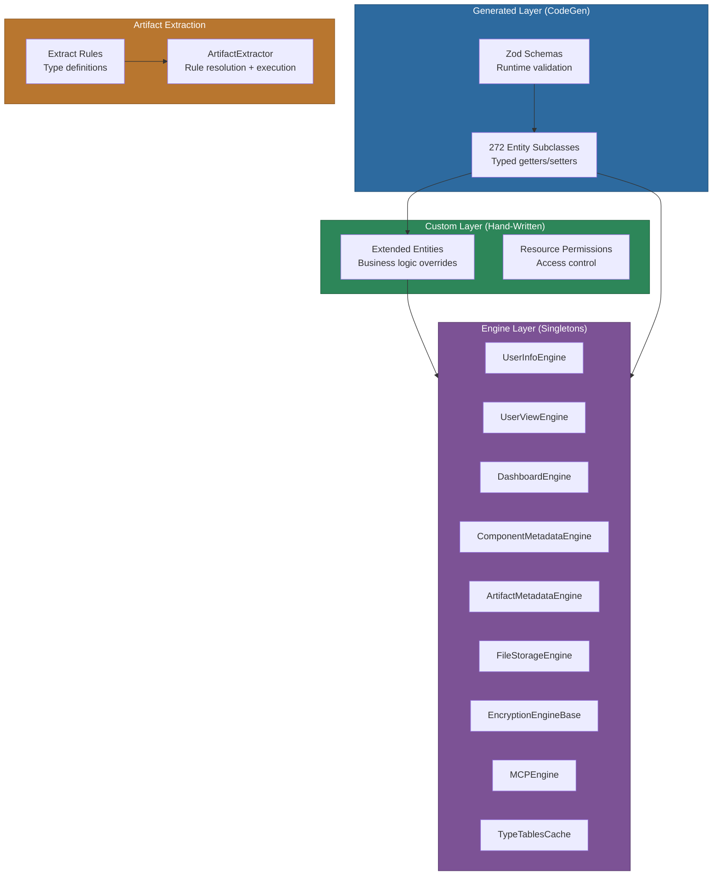
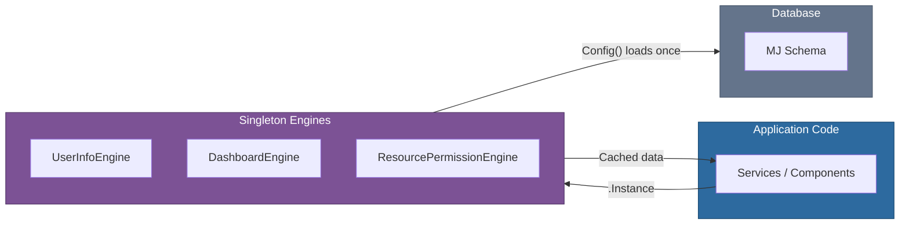
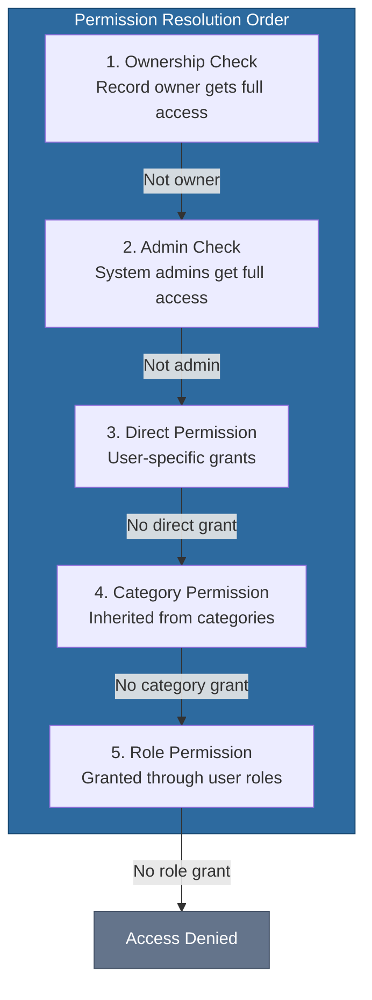
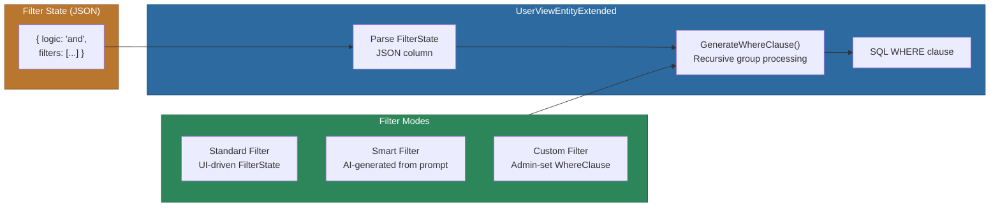

# @memberjunction/core-entities

Strongly-typed entity classes, singleton engine caches, and domain logic for every entity in MemberJunction's core metadata schema. This package is the primary data-access layer that all MJ applications -- server and client -- depend on to interact with the MJ data model in a type-safe, validated way.

All entity subclasses in this package are **auto-generated by CodeGen**. Manual edits to files under `src/generated/` will be overwritten. Custom business logic is layered on top via extended classes in `src/custom/`.

## Installation

```bash
npm install @memberjunction/core-entities
```

## Overview

The package is structured into four layers that build on each other:



### Generated Entity Classes

CodeGen scans the MemberJunction database schema and produces:

- **Zod schema objects** for every entity, providing runtime validation with field-level descriptions, related-entity annotations, and value-list constraints.
- **Entity subclasses** extending `BaseEntity<T>` with strongly-typed getter/setter properties for every column, typed `Load()` methods, and JSDoc annotations including SQL types, defaults, and foreign key references.

There are currently **272 generated entity classes** covering approximately 78,000 lines of code in a single `entity_subclasses.ts` file.

### Extended Entity Classes

Several entities require custom business logic beyond what CodeGen can generate. Extended classes use `@RegisterClass` to override the generated base class in MJ's class factory:

| Extended Class | Entity Name | Purpose |
|---|---|---|
| `UserViewEntityExtended` | User Views | Filter/column JSON parsing, WHERE clause generation, smart filter AI stub, permission checks |
| `DashboardEntityExtended` | Dashboards | Default config initialization, permission-based validation on save/delete |
| `EntityEntityExtended` | Entities | Auto-sets `AutoUpdateDescription` when description is manually changed |
| `EntityFieldEntityExtended` | Entity Fields | Prevents modification of database-reflected properties, auto-sets `AutoUpdateDescription` |
| `ComponentEntityExtended` | MJ: Components | Syncs derived fields from Specification JSON, keeps `spec` property in sync |
| `TemplateEntityExtended` | Templates | Content/param management, template input validation |
| `ScheduledActionEntityExtended` | Scheduled Actions | Auto-generates CronExpression from schedule type settings |
| `ListDetailEntityExtended` | List Details | Composite key handling, duplicate detection on save |
| `EnvironmentEntityExtended` | MJ: Environments | Exposes static `DefaultEnvironmentID` constant |
| `ResourcePermissionEntityExtended` | Resource Permissions | Notification workflow on permission request/approval |

### Singleton Engines

Engine classes extend `BaseEngine<T>` to provide cached, singleton access to groups of related entities. They load data once and keep it in memory, with auto-refresh when underlying data changes.



### Artifact Extraction System

A metadata-driven system for extracting structured attributes from artifact content using declarative JavaScript-based rules with hierarchical inheritance through parent artifact types.

## Key Features

- **272 strongly-typed entity classes** covering all MemberJunction core schema entities
- **Zod runtime validation** with field-level constraints and value list enums
- **Extended entity classes** with permission checks, workflow logic, and JSON state parsing
- **9 singleton engine caches** eliminating redundant database queries
- **Resource permission engine** with role-based access control (View/Edit/Owner levels)
- **Dashboard permission engine** with owner/direct/category permission hierarchy
- **User view engine** with filter-to-SQL conversion and smart filter AI support
- **Artifact extraction** with hierarchical rule inheritance and sandboxed execution
- **Encryption engine base** for field-level encryption metadata caching

## Usage

### Working with Entity Objects

Always use `Metadata.GetEntityObject<T>()` to create entity instances -- never instantiate entity classes directly. This ensures the MJ class factory resolves the correct (potentially extended) subclass.

```typescript
import { Metadata } from '@memberjunction/core';
import { UserEntity, ApplicationEntity } from '@memberjunction/core-entities';

const md = new Metadata();

// Load an existing record
const user = await md.GetEntityObject<UserEntity>('Users');
await user.Load('some-user-id');
console.log(user.Email);
console.log(user.FirstName);

// Create a new record
const app = await md.GetEntityObject<ApplicationEntity>('Applications');
app.NewRecord();
app.Name = 'My Application';
app.Description = 'A custom application';
await app.Save();
```

### Loading Collections with RunView

Use `RunView` with generics for loading collections of entity records:

```typescript
import { RunView } from '@memberjunction/core';
import { ActionEntity } from '@memberjunction/core-entities';

const rv = new RunView();
const result = await rv.RunView<ActionEntity>({
    EntityName: 'Actions',
    ExtraFilter: `Status='Active'`,
    OrderBy: 'Name',
    ResultType: 'entity_object'
});

if (result.Success) {
    for (const action of result.Results) {
        console.log(action.Name, action.Status);
    }
}
```

### Using the UserViewEntityExtended

The extended User View entity parses JSON state columns into structured objects and generates SQL WHERE clauses:

```typescript
import { Metadata } from '@memberjunction/core';
import { UserViewEntityExtended, ViewInfo } from '@memberjunction/core-entities';

// Load a view by name using the convenience class
const view = await ViewInfo.GetViewEntityByName('Active Contacts');

// Access parsed column and filter info
const columns = view.Columns;       // ViewColumnInfo[]
const filters = view.Filter;        // ViewFilterInfo[]
const sortInfo = view.ViewSortInfo;  // ViewSortInfo[]

// Check user permissions
if (view.UserCanEdit) {
    view.Name = 'Updated View Name';
    await view.Save(); // Auto-regenerates WhereClause from FilterState
}
```

### Using Singleton Engines

All engines follow the same pattern: get the singleton instance, call `Config()` to load data, then access cached properties.

```typescript
import {
    UserInfoEngine,
    DashboardEngine,
    ResourcePermissionEngine
} from '@memberjunction/core-entities';

// UserInfoEngine -- notifications, favorites, settings, applications
const userEngine = UserInfoEngine.Instance;
await userEngine.Config(false, contextUser);
const notifications = userEngine.UnreadNotifications;
const favorites = userEngine.UserFavorites;

// Debounced settings (batches rapid updates)
userEngine.SetSettingDebounced('ui-preference/theme', 'dark');

// DashboardEngine -- dashboards, categories, permissions
const dashEngine = DashboardEngine.Instance;
await dashEngine.Config(false, contextUser);
const accessible = dashEngine.GetAccessibleDashboards(userId);
const canEdit = dashEngine.CanUserEditDashboard(dashboardId, userId);

// ResourcePermissionEngine -- role-based resource access
const permEngine = ResourcePermissionEngine.Instance;
await permEngine.Config(false, contextUser);
const level = permEngine.GetUserResourcePermissionLevel(resourceTypeId, recordId, user);
// Returns 'View' | 'Edit' | 'Owner' | null
```

### Artifact Extraction

Extract structured attributes from artifact content using declarative rules:

```typescript
import { ArtifactExtractor } from '@memberjunction/core-entities';

// Resolve extract rules with inheritance from parent types
const rules = ArtifactExtractor.ResolveExtractRules([
    childArtifactType,   // Most specific (overrides parent rules by name)
    parentArtifactType   // Least specific
]);

// Extract attributes from content
const result = await ArtifactExtractor.ExtractAttributes({
    content: '{"subject": "Q4 Campaign", "body": "..."}',
    extractRules: rules,
    throwOnError: false,
    timeout: 5000
});

// Access extracted values
const name = ArtifactExtractor.GetStandardProperty(result.attributes, 'name');
const description = ArtifactExtractor.GetStandardProperty(result.attributes, 'description');

// Serialize for database storage
const serialized = ArtifactExtractor.SerializeForStorage(result.attributes);
```

### Encryption Metadata

The `EncryptionEngineBase` provides cached access to encryption keys, algorithms, and key sources:

```typescript
import { EncryptionEngineBase } from '@memberjunction/core-entities';

const engine = EncryptionEngineBase.Instance;
await engine.Config(false, contextUser);

// Validate a key is usable
const validation = engine.ValidateKey(keyId);
if (!validation.isValid) {
    console.error(validation.error);
}

// Get full key configuration (key + algorithm + source)
const config = engine.GetKeyConfiguration(keyId);
```

## API Reference

### Generated Entity Classes

Every generated entity class provides:

| Member | Description |
|---|---|
| `Load(ID, relationships?)` | Load a record by primary key |
| `Save(options?)` | Persist changes to the database |
| `Delete(options?)` | Delete the record |
| `NewRecord()` | Initialize a blank record for creation |
| `Validate()` | Run Zod schema validation |
| Typed getters/setters | One per database column, with JSDoc annotations |

### UserViewEntityExtended

| Member | Type | Description |
|---|---|---|
| `Filter` | `ViewFilterInfo[]` | Parsed filter state from JSON |
| `Columns` | `ViewColumnInfo[]` | Parsed column configuration from JSON |
| `ViewSortInfo` | `ViewSortInfo[]` | Parsed sort state |
| `OrderByClause` | `string` | SQL ORDER BY clause |
| `ViewEntityInfo` | `EntityInfo` | Metadata for the view's entity |
| `ParsedDisplayState` | `ViewDisplayState \| null` | View mode and display preferences |
| `UserCanEdit` | `boolean` | Whether current user can edit this view |
| `UserCanView` | `boolean` | Whether current user can view this view |
| `UserCanDelete` | `boolean` | Whether current user can delete this view |
| `SetDefaultsFromEntity(e)` | method | Initialize columns from entity metadata |
| `UpdateWhereClause()` | method | Regenerate WHERE clause from filter state |

### ViewInfo (Static Utility)

| Method | Description |
|---|---|
| `GetViewsForUser(entityId?, contextUser?)` | Load all views for a user |
| `GetViewID(viewName)` | Look up a view ID by name |
| `GetViewEntity(viewId, contextUser?)` | Get a cached view by ID |
| `GetViewEntityByName(viewName, contextUser?)` | Get a cached view by name |

### UserInfoEngine

| Member | Description |
|---|---|
| `UserNotifications` | Notifications for current user (newest first) |
| `UnreadNotifications` | Unread notifications only |
| `Workspaces` | User's workspaces |
| `UserApplications` | Installed applications (sorted by sequence) |
| `UserFavorites` | Favorited records (newest first) |
| `UserRecordLogs` | Recent record access history |
| `UserSettings` | User settings key-value pairs |
| `GetSetting(key)` | Get a setting value by key |
| `SetSetting(key, value)` | Create or update a setting |
| `SetSettingDebounced(key, value)` | Debounced setting update for rapid UI changes |
| `FlushPendingSettings()` | Force-save all debounced settings |
| `InstallApplication(appId)` | Install an application for the user |
| `DisableApplication(appId)` | Disable (but not delete) an application |
| `CreateDefaultApplications()` | Create records for default-for-new-user apps |
| `NotificationPreferences` | User's notification preferences |

### DashboardEngine

| Member | Description |
|---|---|
| `Dashboards` | All cached dashboards |
| `DashboardCategories` | All dashboard categories |
| `DashboardPartTypes` | Dashboard widget/part types |
| `GetDashboardPermissions(id, userId)` | Get effective permissions (owner/direct/category) |
| `CanUserReadDashboard(id, userId)` | Check read access |
| `CanUserEditDashboard(id, userId)` | Check edit access |
| `CanUserDeleteDashboard(id, userId)` | Check delete access |
| `GetAccessibleDashboards(userId)` | All dashboards user can read |
| `GetSharedDashboards(userId)` | Dashboards shared with user (not owned) |
| `GetAccessibleCategories(userId)` | Categories user can access |

### ResourcePermissionEngine

| Member | Description |
|---|---|
| `ResourceTypes` | All resource type definitions |
| `Permissions` | All resource permission records |
| `GetResourcePermissions(typeId, recordId)` | Get all permissions for a resource |
| `GetUserResourcePermissionLevel(typeId, recordId, user)` | Get highest permission level (View/Edit/Owner/null) |
| `GetUserAvailableResources(user, typeId?)` | Get all resources a user can access |

### UserViewEngine

| Member | Description |
|---|---|
| `AllViews` | All cached views |
| `GetViewById(id)` | Look up view by ID |
| `GetViewByName(name)` | Look up view by name |
| `GetViewsForEntity(entityId)` | Views for a specific entity |
| `GetViewsForCurrentUser()` | Views owned by current user |
| `GetAccessibleViewsForEntity(entityId)` | Owned + shared views with permission checks |
| `GetDefaultViewForEntity(entityId)` | Default view for an entity |

### ArtifactExtractor

| Method | Description |
|---|---|
| `ResolveExtractRules(typeChain)` | Resolve rules with hierarchical inheritance |
| `ExtractAttributes(config)` | Execute extraction rules against content |
| `SerializeForStorage(attributes)` | Convert attributes to database-storable format |
| `DeserializeFromStorage(stored)` | Convert stored attributes back to runtime objects |
| `GetStandardProperty(attributes, prop)` | Find a standard property value (name/description/etc.) |

### Other Engines

| Engine | Purpose |
|---|---|
| `EncryptionEngineBase` | Caches encryption keys, algorithms, and key sources |
| `FileStorageEngine` | Caches file storage accounts and providers |
| `MCPEngine` | Caches MCP servers, connections, and tools |
| `ComponentMetadataEngine` | Caches component definitions, libraries, and registries |
| `ArtifactMetadataEngine` | Caches artifact type definitions |
| `TypeTablesCache` | Caches entity relationship display components |

## Permission Model

The package implements a layered permission model used across views, dashboards, and resources:



Permission levels are hierarchical: **Owner** > **Edit** > **View**. The engine returns the highest applicable level across all sources (direct user grants and role-based grants).

## View Filter Architecture

The `UserViewEntityExtended` converts structured filter JSON into SQL WHERE clauses:



Supported filter operators: `eq`, `neq`, `gt`, `gte`, `lt`, `lte`, `startswith`, `endswith`, `contains`, `doesnotcontain`, `isnull`, `isempty`, `isnotnull`, `isnotempty`. Filters support arbitrary nesting with `and`/`or` logic groups.

## Important: CodeGen and This Package

This package's `src/generated/entity_subclasses.ts` file is **entirely auto-generated** by the MemberJunction CodeGen system. Key implications:

- **Never edit generated files** -- changes will be overwritten on the next CodeGen run.
- **Custom logic goes in `src/custom/`** -- create an extended class with `@RegisterClass` to override the generated base.
- **Entity names matter** -- some entities use the `MJ: ` prefix (e.g., `MJ: Components`, `MJ: Environments`). Always verify names in the generated file's `@RegisterClass` decorators.
- **Zod schemas are authoritative** -- they reflect the exact database constraints including value lists, nullable fields, and default values.

## Dependencies

- [@memberjunction/core](../MJCore/README.md) -- Base entity classes, metadata system, RunView, BaseEngine
- [@memberjunction/global](../MJGlobal/README.md) -- `@RegisterClass` decorator, global utilities
- [@memberjunction/ai](../AI/README.md) -- AI integration types (used by some engine classes)
- [@memberjunction/interactive-component-types](../InteractiveComponentTypes/README.md) -- ComponentSpec type for component entity extensions
- [zod](https://zod.dev/) -- Runtime schema validation

## Related Packages

- [@memberjunction/core](../MJCore/README.md) -- Framework foundation this package builds on
- [@memberjunction/core-entities-server](../MJCoreEntitiesServer/README.md) -- Server-side extensions of entities defined here (e.g., smart filter AI implementation)
- [@memberjunction/server](../MJServer/README.md) -- Server that uses these entities for API operations

## Contributing

See the [MemberJunction Contributing Guide](../../CONTRIBUTING.md) for development setup and guidelines.
