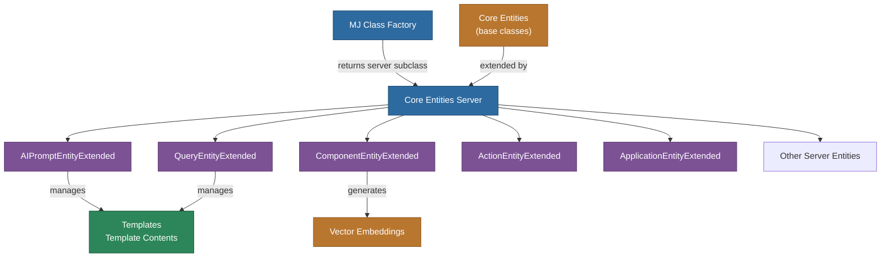

# @memberjunction/core-entities-server

Server-side entity subclasses for MemberJunction that provide extended functionality and business logic for core entities when running in a Node.js environment.

## Overview

This package contains server-side implementations of MemberJunction entity subclasses that require server-specific functionality such as direct database access, file system operations, server-side API integrations, complex business logic, and automatic creation/management of related entities.



### Key Differences from Core Entities

- **Core Entities**: Work everywhere, basic CRUD operations, suitable for client-side usage
- **Core Entities Server**: Server-only, extended functionality, can directly interact with system resources

## Installation

```bash
npm install @memberjunction/core-entities-server
```

## Usage

### Basic Setup

```typescript
import { LoadCoreEntitiesServerSubClasses } from '@memberjunction/core-entities-server';

// Load all server-side entity subclasses at application startup
LoadCoreEntitiesServerSubClasses();
```

**Important**: Call `LoadCoreEntitiesServerSubClasses()` early in your application initialization to ensure the server-side subclasses are registered with the MemberJunction metadata system before any entities are instantiated.

### Example: AI Prompt Entity

The package includes an extended AI Prompt entity that automatically manages Template and Template Contents records:

```typescript
import { Metadata } from '@memberjunction/core';

// The metadata system will automatically use the server-side subclass
const md = new Metadata();
const aiPrompt = await md.GetEntityObject<AIPromptEntity>('AI Prompts');

// Setting TemplateText will automatically create/update Template records
aiPrompt.TemplateText = `You are a helpful assistant...`;

// Save will handle all the Template management automatically
await aiPrompt.Save();
```

## Available Server-Side Entities

### AIPromptEntityExtendedServer

Extends the base AI Prompt entity with automatic Template management:

- **Virtual Property**: `TemplateText` - A convenient way to get/set the prompt template content
- **Automatic Template Creation**: Creates Template and Template Contents records when saving
- **Automatic Template Updates**: Updates existing templates when content changes
- **Proper Relationship Management**: Maintains proper foreign key relationships

### ComponentEntityExtended_Server (v2.90.0+)

Extends the Component entity with automatic vector embedding generation:

- **Automatic Embeddings**: Generates vector embeddings for FunctionalRequirements and TechnicalDesign fields
- **Model Tracking**: Stores the AI model ID used for each embedding
- **Smart Updates**: Only regenerates embeddings when source text changes
- **Parallel Processing**: Generates multiple embeddings concurrently for performance

### QueryEntityExtendedServer

Extends the Query entity with automatic Template management similar to AIPromptEntity:

- **Virtual Property**: `TemplateText` - Manages the SQL query template content
- **Automatic Template Management**: Creates and updates Template records when saving
- **Dynamic SQL Support**: Supports parameterized queries with Nunjucks templates

## Architecture

### Entity Registration

The package uses MemberJunction's entity subclassing system:

1. At startup, `LoadCoreEntitiesServerSubClasses()` is called
2. This registers all server-side entity subclasses with the metadata system
3. When code requests an entity (e.g., "AI Prompts"), the metadata system returns the server-side subclass
4. The server-side subclass extends the base entity with additional functionality

### Virtual Properties

Server-side entities can expose virtual properties that don't exist in the database but provide convenient access to complex data:

```typescript
export class AIPromptEntityExtendedServer extends AIPromptEntity {
    private _TemplateText?: string;

    get TemplateText(): string | undefined {
        return this._TemplateText;
    }

    set TemplateText(value: string | undefined) {
        this._TemplateText = value;
    }
}
```

## Development Guidelines

### Creating New Server-Side Entities

1. Create a new file in `src/custom/`
2. Import and extend the base entity class
3. Add server-specific functionality
4. Register the subclass in the loader

Example:

```typescript
import { BaseEntity, RegisterClass } from '@memberjunction/core';
import { UserEntity } from '@memberjunction/core-entities';

@RegisterClass(BaseEntity, 'Users')
export class UserEntityExtendedServer extends UserEntity {
    async BeforeSave(): Promise<boolean> {
        // Server-side validation or processing
        if (this.Email) {
            // Verify email domain against company whitelist
            const validDomain = await this.checkEmailDomain(this.Email);
            if (!validDomain) {
                throw new Error('Invalid email domain');
            }
        }
        return super.BeforeSave();
    }

    private async checkEmailDomain(email: string): Promise<boolean> {
        // Server-side logic to validate email domain
        return true;
    }
}
```

### Best Practices

1. **Keep It Server-Side**: Only include code that must run on the server
2. **Extend, Don't Replace**: Always extend the base entity class, don't replace core functionality
3. **Handle Errors Gracefully**: Server-side operations can fail - handle errors appropriately
4. **Document Virtual Properties**: Clearly document any virtual properties and their behavior
5. **Test Thoroughly**: Server-side logic can be complex - ensure comprehensive testing

## Integration with Other MJ Packages

This package works seamlessly with:

- `@memberjunction/core`: Provides the base entity system
- `@memberjunction/core-entities`: Provides the base entity classes
- `@memberjunction/server`: Can be used in MJ server applications
- `@memberjunction/cli`: Used by CLI tools like MetadataSync

## Vector Embeddings Support (v2.90.0+)

This package provides a utility helper for server-side entities to easily implement vector embedding generation using the MemberJunction AI Engine.

### EmbedTextLocalHelper

A shared utility function that simplifies embedding generation for any server-side entity:

```typescript
import { EmbedTextLocalHelper } from '@memberjunction/core-entities-server';
import { BaseEntity, SimpleEmbeddingResult } from '@memberjunction/core';

@RegisterClass(BaseEntity, 'MyEntity')
export class MyEntityServer extends MyEntity {
    protected async EmbedTextLocal(textToEmbed: string): Promise<SimpleEmbeddingResult> {
        return EmbedTextLocalHelper(this, textToEmbed);
    }
}
```

The helper:
- Configures the AI Engine with the current user context
- Calls the embedding generation
- Validates the response
- Returns a properly typed `SimpleEmbeddingResult`

### Using Vector Embeddings in Your Entity

1. **Add database fields** for storing vectors and model IDs
2. **Override EmbedTextLocal** using the helper function
3. **Call GenerateEmbeddings** in your Save method:

```typescript
public async Save(): Promise<boolean> {
    await this.GenerateEmbeddingsByFieldName([
        {
            fieldName: "Content",
            vectorFieldName: "ContentVector",
            modelFieldName: "ContentVectorModelID"
        }
    ]);
    return await super.Save();
}
```

## Common Use Cases

### 1. Automatic Related Entity Management
```typescript
// AI Prompts automatically manage their Template records
const prompt = await md.GetEntityObject<AIPromptEntity>('AI Prompts');
prompt.TemplateText = "New prompt content";
await prompt.Save(); // Template and Template Contents created/updated automatically
```

### 2. Vector Embedding Generation
```typescript
// Components automatically generate embeddings for text fields
const component = await md.GetEntityObject<ComponentEntity>('MJ: Components');
component.FunctionalRequirements = "The system shall...";
component.TechnicalDesign = "Architecture overview...";
await component.Save(); // Embeddings generated automatically
```

### 3. Server-Side Validation
```typescript
@RegisterClass(BaseEntity, 'Documents')
export class DocumentEntityServer extends DocumentEntity {
    async BeforeSave(): Promise<boolean> {
        // Scan document for viruses using server-side scanner
        if (this.Content) {
            const isSafe = await virusScanner.scan(this.Content);
            if (!isSafe) {
                throw new Error('Document failed security scan');
            }
        }
        return super.BeforeSave();
    }
}
```

### 3. Complex Business Logic
```typescript
@RegisterClass(BaseEntity, 'Orders')
export class OrderEntityServer extends OrderEntity {
    async AfterSave(): Promise<boolean> {
        // Send order to fulfillment system
        await fulfillmentAPI.submitOrder(this);
        
        // Update inventory
        await inventorySystem.decrementStock(this.OrderItems);
        
        return super.AfterSave();
    }
}
```

## SQL Parser

The `SQLParser` utility class extracts table/view references and column references from SQL statements. It uses `node-sql-parser` for AST-based parsing with automatic regex fallback when the AST parser fails. This class has **no dependency on MJ Metadata** — it returns raw parse results that callers cross-reference against entities themselves.

### When to Use

- **Virtual entity decoration**: Parse a view's SQL to identify which source entities it pulls from
- **Query entity metadata**: Parse SQL queries to find referenced tables and columns
- **Any server-side SQL analysis**: Extract structural information from SQL without executing it

### Basic Usage — Plain SQL

```typescript
import { SQLParser } from '@memberjunction/core-entities-server';

const sql = `
  SELECT c.Name, c.Email, o.OrderDate, o.Total
  FROM [dbo].[Customer] c
  INNER JOIN [dbo].[Order] o ON o.CustomerID = c.ID
  WHERE o.Status = 'Active'
`;

const result = SQLParser.Parse(sql);

// Tables found in the query
for (const table of result.Tables) {
  console.log(`${table.SchemaName}.${table.TableName} (alias: ${table.Alias})`);
}
// Output:
//   dbo.Customer (alias: c)
//   dbo.Order (alias: o)

// Columns referenced in the query
for (const col of result.Columns) {
  console.log(`${col.TableQualifier ? col.TableQualifier + '.' : ''}${col.ColumnName}`);
}
// Output:
//   c.Name, c.Email, o.OrderDate, o.Total, o.CustomerID, c.ID, o.Status

// Whether AST parsing succeeded (true) or regex fallback was used (false)
console.log(`Used AST: ${result.UsedASTParsing}`);
```

### Nunjucks Template SQL

For SQL that contains Nunjucks template syntax (e.g., MemberJunction query templates), use `ParseWithTemplatePreprocessing`. This replaces template expressions with safe placeholder values before parsing:

```typescript
import { SQLParser } from '@memberjunction/core-entities-server';

const templateSQL = `
  SELECT * FROM [dbo].[Customer]
  WHERE Status = {{ status | sqlString }}
  
    AND RegionID = {{ regionId | sqlNumber }}
  
`;

// Nunjucks syntax is replaced with placeholders, then parsed normally
const result = SQLParser.ParseWithTemplatePreprocessing(templateSQL);
console.log(result.Tables); // [{ TableName: 'Customer', SchemaName: 'dbo', Alias: 'Customer' }]
```

### Cross-Referencing with Entity Metadata

The parser returns raw table/column references. To resolve them to MemberJunction entities:

```typescript
import { Metadata } from '@memberjunction/core';
import { SQLParser } from '@memberjunction/core-entities-server';

const parseResult = SQLParser.Parse(viewDefinitionSQL);
const md = new Metadata();

for (const tableRef of parseResult.Tables) {
  const entity = md.Entities.find(e =>
    (e.BaseTable.toLowerCase() === tableRef.TableName.toLowerCase() ||
     e.BaseView.toLowerCase() === tableRef.TableName.toLowerCase()) &&
    e.SchemaName.toLowerCase() === tableRef.SchemaName.toLowerCase()
  );

  if (entity) {
    console.log(`Table ${tableRef.TableName} → Entity "${entity.Name}"`);
    // Access entity.Fields for full field metadata
  }
}
```

### Return Types

```typescript
interface SQLParseResult {
  Tables: SQLTableReference[];   // All table/view references (FROM, JOIN, subqueries, CTEs)
  Columns: SQLColumnReference[]; // All column references (SELECT, WHERE, JOIN ON, etc.)
  UsedASTParsing: boolean;       // true = AST parsed, false = regex fallback
}

interface SQLTableReference {
  TableName: string;    // Table or view name
  SchemaName: string;   // Schema name (defaults to 'dbo')
  Alias: string;        // Query alias, or table name if no alias
}

interface SQLColumnReference {
  ColumnName: string;        // Column name
  TableQualifier: string | null; // Table alias prefix (e.g., "c" in "c.Name")
}
```

### How It Works

1. **AST Parsing** (preferred): Uses `node-sql-parser` with `TransactSQL` dialect to build an AST, then recursively walks it to extract table references from `FROM`/`JOIN` clauses, subqueries, and CTEs, plus column references from `SELECT`, `WHERE`, `GROUP BY`, `ORDER BY`, and `ON` conditions.

2. **Regex Fallback**: If AST parsing fails (complex SQL, dialect edge cases), a regex-based extractor finds `FROM`/`JOIN` table references. Column references are not extracted in regex mode (the `Columns` array will be empty).

3. **Nunjucks Preprocessing**: `ParseWithTemplatePreprocessing` first renders the SQL through a Nunjucks environment with placeholder filters (`sqlString` → `'placeholder'`, `sqlNumber` → `0`, etc.), stripping template blocks while preserving the SQL structure. If Nunjucks rendering fails, it falls back to regex-based template removal.

## Troubleshooting

### Entity subclass not being used
Ensure `LoadCoreEntitiesServerSubClasses()` is called before any entity instantiation.

### Module loading errors
This package uses CommonJS. Ensure your Node.js application is configured to handle CommonJS modules.

### Virtual properties not persisting
Virtual properties are not saved to the database. Use them as convenient accessors that manage real database fields behind the scenes.

## Future Enhancements

- Additional server-side entity implementations
- Integration with file storage providers
- Advanced caching mechanisms
- Batch processing utilities
- Background job integration

## Contributing

When contributing new server-side entities:

1. Follow the existing patterns
2. Document all virtual properties
3. Include comprehensive tests
4. Ensure no client-side dependencies
5. Update this README with new entities

## License

This package is part of the MemberJunction open-source project.