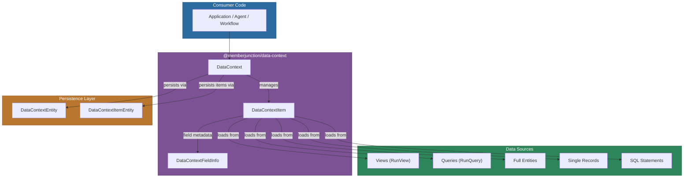
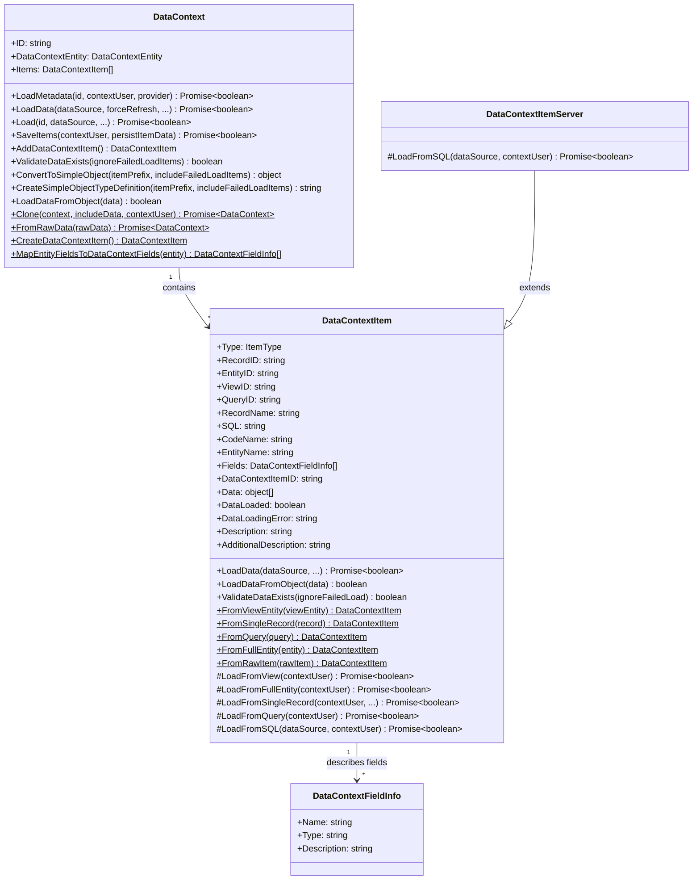
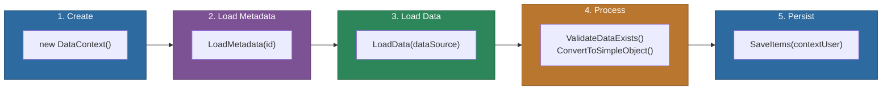
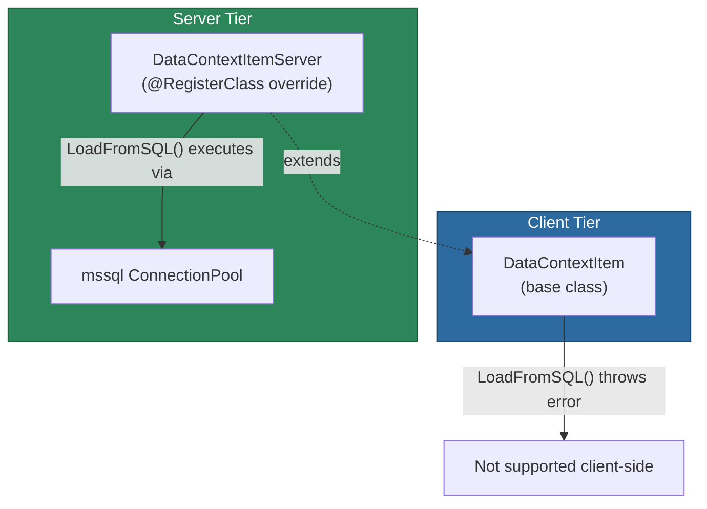

# @memberjunction/data-context

The `@memberjunction/data-context` library provides a metadata-driven framework for managing collections of related data items in MemberJunction applications. It enables developers to define, load, persist, and manipulate data from multiple sources -- views, queries, entities, single records, and raw SQL -- through a unified, type-safe API that works across both client and server tiers.

## Architecture Overview



## Installation

```bash
npm install @memberjunction/data-context
```

## Key Concepts

A **Data Context** is a named collection of **Data Context Items**, each of which represents a distinct data source. An item can be one of five types:

| Type            | Description                                      | Required Fields                  |
|-----------------|--------------------------------------------------|----------------------------------|
| `view`          | A saved MemberJunction User View                 | `ViewID`, `EntityID`             |
| `query`         | A registered MemberJunction Query                | `QueryID`                        |
| `full_entity`   | All records from an entity                       | `EntityID`                       |
| `single_record` | One record, optionally with related entity data  | `EntityID`, `RecordID`           |
| `sql`           | A raw SQL statement (server-side only)            | `SQL`                            |

## Class Hierarchy



## Data Lifecycle



## Usage

### Loading an Existing Data Context

Use `Load()` to fetch both metadata and data in a single call:

```typescript
import { DataContext } from '@memberjunction/data-context';

const context = new DataContext();
const loaded = await context.Load(
  dataContextID,   // ID of the data context record
  dataSource,      // Required only for SQL-type items (server-side)
  false,           // forceRefresh -- reload even if data is cached
  true,            // loadRelatedDataOnSingleRecords
  10,              // maxRecordsPerRelationship
  contextUser      // required on server-side
);

if (loaded) {
  context.Items.forEach(item => {
    console.log(`${item.Description}: ${item.Data?.length ?? 0} rows`);
  });
}
```

Alternatively, call `LoadMetadata()` and `LoadData()` separately for finer control:

```typescript
const context = new DataContext();
await context.LoadMetadata(dataContextID, contextUser);

// Inspect or modify items before loading data
console.log(`Items to load: ${context.Items.length}`);

await context.LoadData(dataSource, false, true, 10, contextUser);
```

### Creating Items Programmatically

Each item type has a dedicated static factory method.

#### From a View

```typescript
import { UserViewEntityExtended } from '@memberjunction/core-entities';

const viewEntity: UserViewEntityExtended = await md.GetEntityObject<UserViewEntityExtended>('User Views');
await viewEntity.Load(viewID);

const viewItem = DataContextItem.FromViewEntity(viewEntity);
context.Items.push(viewItem);
```

#### From a Single Record

```typescript
import { BaseEntity } from '@memberjunction/core';

const record: BaseEntity = await md.GetEntityObject('Customers');
await record.Load(recordID);

const recordItem = DataContextItem.FromSingleRecord(record);
context.Items.push(recordItem);
```

#### From a Query

```typescript
import { QueryInfo } from '@memberjunction/core';

const queryInfo = md.Queries.find(q => q.Name === 'Monthly Revenue');
if (queryInfo) {
  const queryItem = DataContextItem.FromQuery(queryInfo);
  context.Items.push(queryItem);
}
```

#### From a Full Entity

```typescript
import { EntityInfo } from '@memberjunction/core';

const entityInfo = md.Entities.find(e => e.Name === 'Products');
if (entityInfo) {
  const entityItem = DataContextItem.FromFullEntity(entityInfo);
  context.Items.push(entityItem);
}
```

### Loading Data for Items

```typescript
// Load data for all items in the context
const allLoaded = await context.LoadData(
  dataSource,  // required for SQL-type items
  false,       // forceRefresh
  true,        // loadRelatedDataOnSingleRecords
  10           // maxRecordsPerRelationship
);

// Or load data for a single item
const itemLoaded = await context.Items[0].LoadData(
  dataSource, false, true, 10, contextUser
);
```

### Loading Pre-fetched Data

If you already have the data available (for example, from a cache or external API), load it directly:

```typescript
// Load into a single item
const item = context.Items[0];
item.LoadDataFromObject(myDataArray);

// Load into all items at once (2D array, one sub-array per item in order)
context.LoadDataFromObject([
  rowsForItem0,
  rowsForItem1,
  rowsForItem2
]);
```

### Saving Data Context Items

```typescript
const saved = await context.SaveItems(
  contextUser,  // context user for server-side operations
  true          // persistItemData -- also save loaded data as JSON
);

if (saved) {
  // Each item now has a DataContextItemID populated
  context.Items.forEach(item => {
    console.log(`Saved item ${item.DataContextItemID}`);
  });
}
```

Items are saved in a single transaction group -- either all succeed or none are committed.

### Working with Loaded Data

```typescript
// Validate all items have data
if (context.ValidateDataExists()) {
  // Convert to a flat keyed object
  const simpleObj = context.ConvertToSimpleObject('item_', false);
  // Result: { item_0: [...], item_1: [...], ... }

  // Generate a TypeScript-style type definition string
  const typeDef = context.CreateSimpleObjectTypeDefinition('item_');
  // Output: {item_0: []; // View: Customer List, From Entity: Customers\n...}
}

// Check individual items for errors
context.Items.forEach(item => {
  if (item.DataLoaded && item.Data) {
    console.log(`${item.Description}: ${item.Data.length} rows`);
  } else if (item.DataLoadingError) {
    console.error(`Failed: ${item.DataLoadingError}`);
  }
});
```

### Cloning a Data Context

```typescript
const clonedContext = await DataContext.Clone(
  originalContext,
  true,         // includeData -- copy loaded data into the clone
  contextUser
);

if (clonedContext) {
  console.log(`Cloned context ID: ${clonedContext.ID}`);
}
```

### Reconstructing from Raw Data

```typescript
const context = await DataContext.FromRawData(rawObject);
// rawObject should have { ID, Items: [ { Type, RecordID, ... }, ... ] }
```

## Server-Side SQL Support

The base `DataContextItem` class throws an error when `LoadFromSQL()` is called because raw SQL execution is inherently a server-side operation. The companion package `@memberjunction/data-context-server` provides `DataContextItemServer`, which overrides this method using an `mssql` connection pool:



`DataContextItemServer` is registered via `@RegisterClass` with a higher priority, so the MemberJunction class factory automatically returns the server variant when the server package is included. No code changes are needed -- just include `@memberjunction/data-context-server` in your server project's dependencies.

## API Reference

### DataContext

| Method | Returns | Description |
|--------|---------|-------------|
| `LoadMetadata(id, contextUser?, provider?)` | `Promise<boolean>` | Loads metadata for the context and all its items from the database |
| `LoadData(dataSource, forceRefresh?, loadRelated?, maxRecords?, contextUser?)` | `Promise<boolean>` | Loads data for all items; must call `LoadMetadata()` first |
| `Load(id, dataSource, forceRefresh?, loadRelated?, maxRecords?, contextUser?)` | `Promise<boolean>` | Combined metadata + data load in one call |
| `SaveItems(contextUser?, persistItemData?)` | `Promise<boolean>` | Persists all items to the database in a single transaction |
| `AddDataContextItem()` | `DataContextItem` | Creates a new item and adds it to `Items` |
| `ValidateDataExists(ignoreFailedLoadItems?)` | `boolean` | Returns true if all items have their `Data` property set |
| `ConvertToSimpleObject(itemPrefix?, includeFailedLoadItems?)` | `object` | Converts context to a flat keyed object |
| `CreateSimpleObjectTypeDefinition(itemPrefix?, includeFailedLoadItems?)` | `string` | Generates a type definition string for the simple object |
| `LoadDataFromObject(data)` | `boolean` | Loads pre-fetched data as a 2D array mapped by item index |
| `Clone(context, includeData?, contextUser?)` (static) | `Promise<DataContext>` | Deep-clones a context and its items into new database records |
| `FromRawData(rawData)` (static) | `Promise<DataContext>` | Reconstructs a `DataContext` from a plain object |
| `CreateDataContextItem()` (static) | `DataContextItem` | Creates a new item via the class factory (does not add to context) |
| `MapEntityFieldsToDataContextFields(entity)` (static) | `DataContextFieldInfo[]` | Maps `EntityInfo` fields to simplified field info objects |

### DataContextItem

| Property | Type | Description |
|----------|------|-------------|
| `Type` | `'view' \| 'query' \| 'full_entity' \| 'sql' \| 'single_record'` | The data source type |
| `RecordID` | `string` | Primary key for `single_record` items (comma-separated for composite keys) |
| `EntityID` | `string` | Entity identifier (not used for `query` or `sql` types) |
| `ViewID` | `string` | View identifier (only for `view` type) |
| `QueryID` | `string` | Query identifier (only for `query` type) |
| `RecordName` | `string` | Display name of the view, query, or entity |
| `SQL` | `string` | SQL statement (only for `sql` type) |
| `CodeName` | `string` | System-generated unique code name within the context |
| `EntityName` | `string` | Entity name (not used for `query` or `sql` types) |
| `Fields` | `DataContextFieldInfo[]` | Field metadata for the item |
| `DataContextItemID` | `string` | Database record ID (populated after save) |
| `Data` | `object[]` | The loaded data rows |
| `DataLoaded` | `boolean` | Whether data has been successfully loaded |
| `DataLoadingError` | `string` | Error message if loading failed |
| `Description` | `string` (readonly) | Auto-generated description based on type |
| `AdditionalDescription` | `string` | Optional supplementary description |

| Static Factory Method | Description |
|----------------------|-------------|
| `FromViewEntity(viewEntity)` | Creates an item from a `UserViewEntityExtended` |
| `FromSingleRecord(record)` | Creates an item from a `BaseEntity` instance |
| `FromQuery(query)` | Creates an item from a `QueryInfo` |
| `FromFullEntity(entity)` | Creates an item from an `EntityInfo` |
| `FromRawItem(rawItem)` | Creates an item from a plain object |

### DataContextFieldInfo

| Property | Type | Description |
|----------|------|-------------|
| `Name` | `string` | Field name |
| `Type` | `string` | Field data type |
| `Description` | `string` (optional) | Field description |

## Dependencies

| Package | Purpose |
|---------|---------|
| `@memberjunction/global` | Class factory and `@RegisterClass` decorator |
| `@memberjunction/core` | Core framework: `Metadata`, `RunView`, `RunQuery`, `BaseEntity`, `EntityInfo`, `UserInfo` |
| `@memberjunction/core-entities` | Generated entity classes: `DataContextEntity`, `DataContextItemEntity`, `UserViewEntityExtended` |

## Best Practices

1. **Always load metadata before data.** Use `LoadMetadata()` then `LoadData()`, or use the combined `Load()` method.
2. **Check `DataLoaded` and `DataLoadingError`** on each item after loading. `LoadData()` does not throw exceptions for individual item failures -- it returns `false` and populates the error properties.
3. **Pass `contextUser` on the server side.** Server code serves multiple users concurrently and must include the context user for proper security and audit tracking.
4. **Use `maxRecordsPerRelationship`** to limit the amount of related data loaded for `single_record` items, especially in production environments.
5. **Validate before processing.** Call `ValidateDataExists()` before working with data to ensure all items are ready.
6. **Leverage transactions.** `SaveItems()` automatically wraps all item saves in a transaction group for atomicity.
7. **Include `@memberjunction/data-context-server`** in server projects if any items use the `sql` type. The class factory handles the override automatically.

## License

ISC
