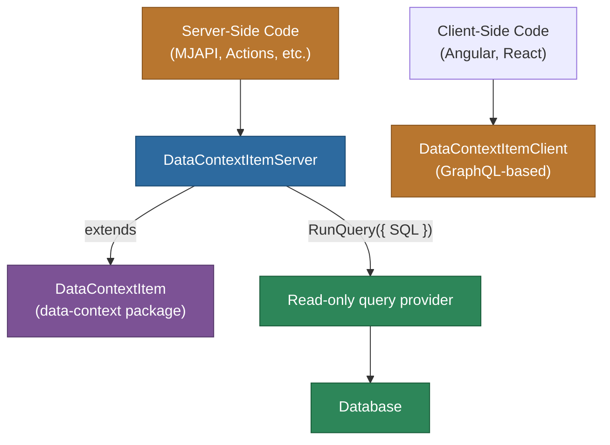

# @memberjunction/data-context-server

Server-side implementation of the MemberJunction Data Context system. Loads the data of `sql`-type `DataContextItem` objects by running their SQL through a query provider's screened ad-hoc path.

## Overview

The `@memberjunction/data-context-server` package extends the base `DataContextItem` class from `@memberjunction/data-context` with a server-side implementation of `LoadFromSQL`. It runs the item's SQL through `RunQuery({ SQL })` on a query provider, the same ad-hoc path `ExecuteAdhocQuery` uses, so the SQL must be a single read statement. On PostgreSQL that path also runs it in a read-only transaction that is rolled back. It never sends SQL to a raw connection pool. This is the server counterpart to the client-side GraphQL-based data context loading.


```mermaid
graph TD
    A["DataContextItemServer"] -->|extends| B["DataContextItem<br/>(data-context package)"]
    A -->|"RunQuery({ SQL })"| C["Read-only query provider"]
    C --> D["Database"]

    E["Server-Side Code<br/>(MJAPI, Actions, etc.)"] --> A
    F["Client-Side Code<br/>(Angular, React)"] --> G["DataContextItemClient<br/>(GraphQL-based)"]

    style A fill:#2d6a9f,stroke:#1a4971,color:#fff
    style B fill:#7c5295,stroke:#563a6b,color:#fff
    style C fill:#2d8659,stroke:#1a5c3a,color:#fff
    style D fill:#2d8659,stroke:#1a5c3a,color:#fff
    style E fill:#b8762f,stroke:#8a5722,color:#fff
    style G fill:#b8762f,stroke:#8a5722,color:#fff
```

## Installation

```bash
npm install @memberjunction/data-context-server
```

## How It Works

The package registers `DataContextItemServer` as a subclass of `DataContextItem` using MemberJunction's `@RegisterClass` decorator. When server-side code creates a `DataContextItem`, the class factory automatically returns the server implementation.

```typescript
import '@memberjunction/data-context-server';
// DataContextItem instances can now load `sql` items on the server
```

The `LoadFromSQL` method:
1. Receives a query provider (`IRunQueryProvider`) as the data source. MJServer passes its read-only provider.
2. Refuses when there is no context user, or when the data source is not a query provider (for example a raw connection pool)
3. Runs `DataContextItem.SQL` through `RunQuery({ SQL })` for the context user. The provider accepts only a single read statement.
4. Stores the result rows in `DataContextItem.Data`
5. Returns success/failure with error details on `DataLoadingError`

Callers decide who may run an item's SQL. MJServer's `GetDataContextData` and `GetDataContextItemData` queries allow it only for the data context's owner or an administrator, never for a scope-limited session, and only on the read-only provider.

## Dependencies

| Package | Purpose |
|---------|---------|
| `@memberjunction/core` | `IRunQueryProvider`, `UserInfo`, `LogError` |
| `@memberjunction/global` | RegisterClass decorator |
| `@memberjunction/data-context` | Base DataContextItem class |

## License

Business Source License 1.1 — see [LICENSE](../../LICENSE) for details.
