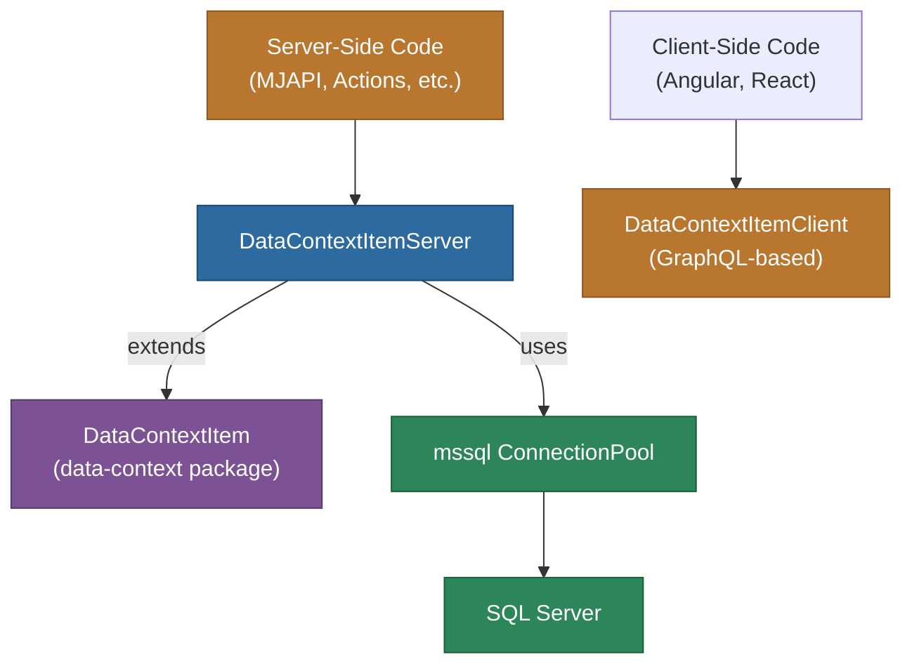

# @memberjunction/data-context-server

Server-side implementation of the MemberJunction Data Context system. Provides SQL-based data loading for `DataContextItem` objects using direct database connections.

## Overview

The `@memberjunction/data-context-server` package extends the base `DataContextItem` class from `@memberjunction/data-context` with a server-side implementation that executes SQL queries directly against SQL Server using `mssql` connection pools. This is the server counterpart to the client-side GraphQL-based data context loading.



## Installation

```bash
npm install @memberjunction/data-context-server
```

## How It Works

The package registers `DataContextItemServer` as a subclass of `DataContextItem` using MemberJunction's `@RegisterClass` decorator. When server-side code creates a `DataContextItem`, the class factory automatically returns the server implementation that uses direct SQL execution rather than GraphQL.

```typescript
import '@memberjunction/data-context-server';
// DataContextItem instances now use direct SQL execution on the server
```

The `LoadFromSQL` method:
1. Receives a SQL Server `ConnectionPool` as the data source
2. Creates a new `Request` from the pool
3. Executes the `DataContextItem.SQL` query directly
4. Stores the resulting recordset in `DataContextItem.Data`
5. Returns success/failure with error details on `DataLoadingError`

## Dependencies

| Package | Purpose |
|---------|---------|
| `@memberjunction/core` | UserInfo, LogError utilities |
| `@memberjunction/global` | RegisterClass decorator |
| `@memberjunction/data-context` | Base DataContextItem class |
| `mssql` | SQL Server connectivity |

## License

ISC
