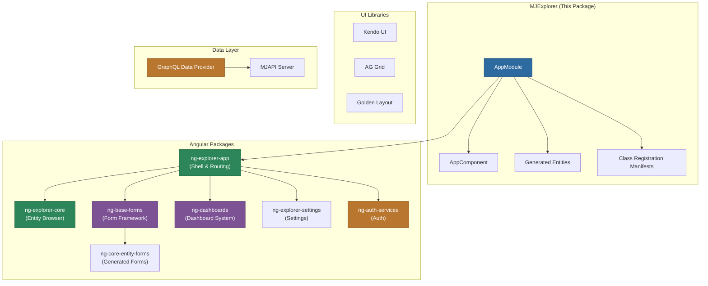
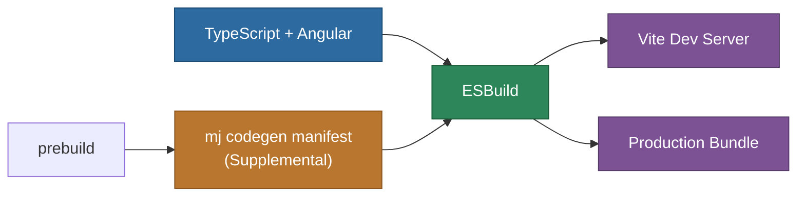

# MemberJunction Explorer (MJExplorer)

The primary web-based user interface for the MemberJunction platform. Built with Angular 21, powered by ESBuild and Vite, and backed by a comprehensive library of MJ Angular packages for entity management, dashboards, reports, and AI interactions.

## Architecture



## Overview

MJExplorer is a thin Angular application shell that assembles a rich set of MemberJunction Angular packages into a complete user experience. The application itself contains minimal custom code -- the bulk of functionality lives in the `@memberjunction/ng-*` packages.

**Key features:**

- **Entity Management**: Browse, view, create, update, and delete records across all entities
- **Custom Forms**: Extensible form system with both generated and custom form components
- **Dashboards**: Interactive dashboard system with customizable widgets and layouts
- **Reports**: Comprehensive reporting with export functionality
- **User Views**: Custom views with filtering, sorting, and grouping
- **Authentication**: Microsoft Entra ID (MSAL) and Auth0 integration
- **Real-time Updates**: WebSocket subscriptions for live data synchronization
- **File Management**: Integrated file storage and management
- **Full-text Search**: Search across entities and records
- **AI Integration**: AI-powered features via the MJ AI subsystem

## Prerequisites

- Node.js 18+ (20+ recommended)
- npm 9+
- MemberJunction API server running (default: `http://localhost:4000`)
- Valid authentication configuration (MSAL or Auth0)

## Getting Started

### 1. Configure Authentication

Set up your authentication provider in `src/environments/`:

```typescript
// environment.ts
export const environment = {
    production: false,
    CLIENT_ID: 'your-azure-ad-client-id',
    TENANT_ID: 'your-azure-ad-tenant-id',
    MJ_CORE_WS_URL: 'ws://localhost:4000',
    MJ_CORE_HTTP_URL: 'http://localhost:4000',
    AUTH_TYPE: 'msal'  // or 'auth0'
};
```

### 2. Build

```bash
# From workspace root
npm run build

# Or just Explorer
cd packages/MJExplorer && npm run build
```

### 3. Start Development Server

```bash
npm run start:explorer
# or
cd packages/MJExplorer && npm start
```

The dev server starts on `http://localhost:4201` with Vite HMR for fast iteration.

## Build Pipeline



- Uses Angular's `application` builder powered by ESBuild
- Dev server uses Vite with HMR for fast iteration
- `@memberjunction/*` packages are excluded from Vite prebundling (they are symlinked workspace packages)
- Source maps configured for full debugging of symlinked packages

## Class Registration Manifests

MJExplorer uses dual manifests to prevent tree-shaking of `@RegisterClass`-decorated components:

1. **Pre-built manifest** (`@memberjunction/ng-bootstrap/mj-class-registrations`): All `@memberjunction/*` Angular packages
2. **Supplemental manifest** (`src/app/generated/class-registrations-manifest.ts`): User-defined components, generated at `prebuild` with `--exclude-packages @memberjunction`

## Project Structure

```
packages/MJExplorer/
  src/
    app/
      app.module.ts         # Root NgModule
      app.component.ts      # Root component
      generated/            # Class registration manifest
      demo/                 # Demo/example components
    environments/           # Environment-specific configs
    assets/                 # Static assets
  angular.json              # Angular build configuration
  package.json
  tsconfig.json
```

## Key Angular Package Dependencies

| Package | Purpose |
|---------|---------|
| `@memberjunction/ng-explorer-app` | Application shell, routing, navigation |
| `@memberjunction/ng-explorer-core` | Entity browsing, list views |
| `@memberjunction/ng-base-forms` | Form framework and base components |
| `@memberjunction/ng-core-entity-forms` | Auto-generated entity CRUD forms |
| `@memberjunction/ng-dashboards` | Dashboard framework and widgets |
| `@memberjunction/ng-explorer-settings` | User and application settings |
| `@memberjunction/ng-explorer-modules` | Additional feature modules |
| `@memberjunction/ng-auth-services` | Authentication services (MSAL, Auth0) |
| `@memberjunction/ng-bootstrap` | Angular class registration bootstrap |
| `@memberjunction/ng-shared` | Shared components and utilities |
| `@memberjunction/ng-tabstrip` | Tab-based navigation |
| `@memberjunction/ng-timeline` | Timeline visualization |
| `@memberjunction/ng-join-grid` | Relationship grid component |
| `@memberjunction/ng-record-changes` | Version history display |
| `@memberjunction/graphql-dataprovider` | GraphQL client for MJAPI |

## UI Component Libraries

| Library | Usage |
|---------|-------|
| Kendo UI for Angular | Grids, dropdowns, buttons, dialogs, inputs, navigation |
| AG Grid | High-performance data grids |
| Golden Layout | Flexible window management |
| dhtmlx-gantt | Gantt chart visualization |

## Scripts

| Script | Description |
|--------|-------------|
| `npm start` | Start dev server on port 4201 with Vite HMR |
| `npm run build` | Production build with ESBuild |
| `npm run start:stage` | Start with staging configuration |
| `npm run build:stage` | Build with staging configuration |
| `npm run watch` | Build in watch mode |
| `npm test` | Run unit tests |

## License

ISC
