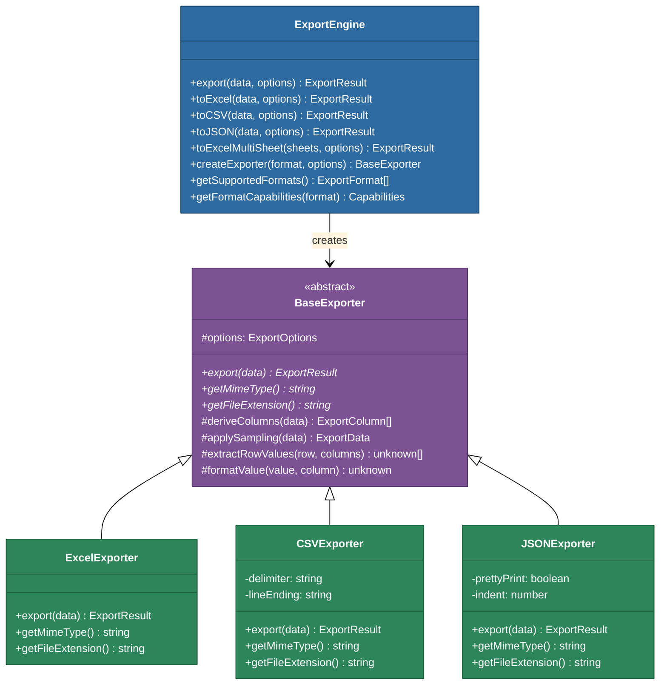
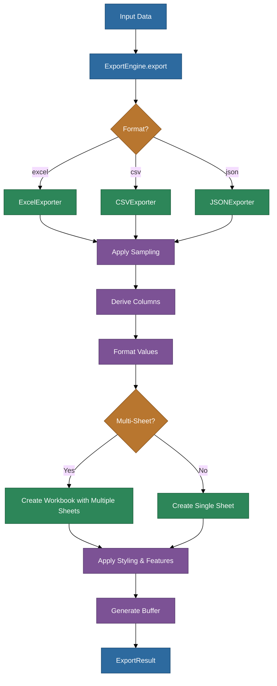
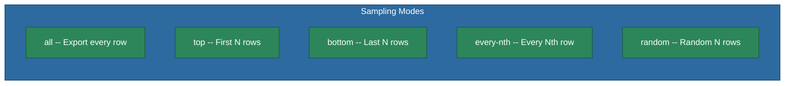
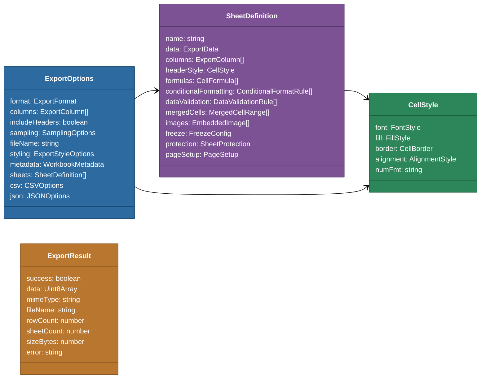

# @memberjunction/export-engine

A versatile data export engine for MemberJunction that supports Excel (.xlsx), CSV, and JSON output formats. The package provides a unified API for exporting data with rich formatting, multi-sheet workbooks, row sampling, conditional formatting, data validation, and more.

## Architecture



## Export Flow



## Installation

```bash
npm install @memberjunction/export-engine
```

## Quick Start

### Basic Excel Export

```typescript
import { ExportEngine } from '@memberjunction/export-engine';

const data = [
  { name: 'Alice', age: 30, department: 'Engineering' },
  { name: 'Bob', age: 25, department: 'Marketing' },
  { name: 'Carol', age: 35, department: 'Engineering' }
];

const result = await ExportEngine.toExcel(data, {
  fileName: 'employees'
});
// result.data is a Uint8Array containing the .xlsx file
```

### CSV Export

```typescript
const result = await ExportEngine.toCSV(data, {
  fileName: 'employees',
  includeHeaders: true
});
```

### JSON Export

```typescript
const result = await ExportEngine.toJSON(data, {
  fileName: 'employees'
});
```

### Format-Agnostic Export

```typescript
const result = await ExportEngine.export(data, {
  format: 'excel', // or 'csv' or 'json'
  fileName: 'report'
});
```

## Supported Formats

| Format | Extension | Multi-Sheet | Styling | Formulas | Images | Data Validation |
|--------|-----------|-------------|---------|----------|--------|-----------------|
| Excel  | `.xlsx`   | Yes         | Yes     | Yes      | Yes    | Yes             |
| CSV    | `.csv`    | No          | No      | No       | No     | No              |
| JSON   | `.json`   | No          | No      | No       | No     | No              |

## Row Sampling

The engine supports five sampling modes to control which rows are exported from large datasets:



```typescript
// Export only the top 50 rows
const result = await ExportEngine.toExcel(data, {
  sampling: { mode: 'top', count: 50 }
});

// Export every 10th row
const result = await ExportEngine.toExcel(data, {
  sampling: { mode: 'every-nth', interval: 10 }
});

// Export 100 random rows
const result = await ExportEngine.toExcel(data, {
  sampling: { mode: 'random', count: 100 }
});
```

## Column Definitions

Columns can be explicitly defined for fine-grained control over headers, widths, data types, and formatting:

```typescript
import { ExportEngine, ExportColumn } from '@memberjunction/export-engine';

const columns: ExportColumn[] = [
  { name: 'id', displayName: 'ID', width: 10, hidden: true },
  { name: 'name', displayName: 'Full Name', width: 25 },
  { name: 'salary', displayName: 'Annual Salary', dataType: 'currency', numberFormat: '$#,##0.00' },
  { name: 'startDate', displayName: 'Start Date', dataType: 'date', numberFormat: 'yyyy-mm-dd' },
  { name: 'active', displayName: 'Active', dataType: 'boolean' }
];

const result = await ExportEngine.toExcel(data, { columns });
```

If columns are not provided, the engine derives them automatically from the data keys (for objects) or generates generic names (for arrays).

## Excel Styling

### Simple Styling Options

The `ExportStyleOptions` interface provides convenient shortcuts for common formatting:

```typescript
const result = await ExportEngine.toExcel(data, {
  styling: {
    boldHeaders: true,
    headerBackgroundColor: '4472C4',     // hex color without #
    headerTextColor: 'FFFFFF',
    alternatingRowColors: true,
    alternateRowColor: 'F5F5F5',
    freezeHeader: true,
    autoFilter: true
  }
});
```

### Advanced Cell Styling

For full control, use the `CellStyle` interface which supports font, fill, border, alignment, and number format:

```typescript
import { CellStyle, CommonStyles } from '@memberjunction/export-engine';

const headerStyle: CellStyle = {
  font: { bold: true, size: 12, color: 'FFFFFF' },
  fill: { pattern: 'solid', fgColor: '2D6A9F' },
  alignment: { horizontal: 'center', vertical: 'middle', wrapText: true },
  border: {
    bottom: { style: 'medium', color: '000000' }
  }
};
```

### Pre-built Common Styles

The `CommonStyles` object provides ready-to-use styles:

| Style | Description |
|-------|-------------|
| `CommonStyles.bold` | Bold text |
| `CommonStyles.italic` | Italic text |
| `CommonStyles.redText` | Red-colored text |
| `CommonStyles.greenText` | Green-colored text |
| `CommonStyles.blueText` | Blue-colored text |
| `CommonStyles.yellowHighlight` | Yellow background highlight |
| `CommonStyles.lightGrayBg` | Light gray background |
| `CommonStyles.centered` | Center-aligned text |
| `CommonStyles.rightAligned` | Right-aligned text |
| `CommonStyles.wrapped` | Text wrapping enabled |
| `CommonStyles.currency` | Currency number format (`$#,##0.00`) |
| `CommonStyles.percentage` | Percentage format (`0.00%`) |
| `CommonStyles.date` | Date format (`yyyy-mm-dd`) |
| `CommonStyles.dateTime` | DateTime format (`yyyy-mm-dd hh:mm:ss`) |
| `CommonStyles.thinBorder` | Thin border on all sides |
| `CommonStyles.header` | Bold white text on blue background, centered |

### Merging Styles

Use `mergeCellStyles` to combine multiple style objects:

```typescript
import { mergeCellStyles, CommonStyles } from '@memberjunction/export-engine';

const combinedStyle = mergeCellStyles(
  CommonStyles.bold,
  CommonStyles.centered,
  CommonStyles.thinBorder
);
```

## Multi-Sheet Excel Workbooks

Create workbooks with multiple sheets, each with independent data, styling, and features:

```typescript
import { ExportEngine, SheetDefinition, CommonStyles } from '@memberjunction/export-engine';

const sheets: SheetDefinition[] = [
  {
    name: 'Sales Data',
    data: salesRecords,
    headerStyle: CommonStyles.header,
    alternateRowStyle: CommonStyles.lightGrayBg,
    freeze: { row: 2 },           // Freeze header row
    autoFilter: true,
    tabColor: '2D8659'
  },
  {
    name: 'Summary',
    data: summaryRecords,
    formulas: [
      { cell: 'B10', formula: 'SUM(B2:B9)' },
      { cell: 'B11', formula: 'AVERAGE(B2:B9)' }
    ],
    mergedCells: [
      { startRow: 1, startColumn: 1, endRow: 1, endColumn: 3 }
    ]
  }
];

const result = await ExportEngine.toExcelMultiSheet(sheets, {
  fileName: 'quarterly-report',
  metadata: {
    author: 'Finance Team',
    title: 'Q1 2024 Report',
    company: 'Acme Corp'
  }
});
```

### Sheet Features

Each `SheetDefinition` supports:

| Feature | Description |
|---------|-------------|
| `columns` / `headers` | Column definitions or simple header names |
| `headerStyle` / `dataStyle` | Styling for header and data rows |
| `alternateRowStyle` | Style applied to alternating rows |
| `rowStyles` | Style overrides for specific rows |
| `cellStyles` | Style overrides for specific cells or ranges |
| `formulas` | Cell formulas (e.g., `SUM`, `AVERAGE`) |
| `conditionalFormatting` | Rules-based formatting |
| `dataValidation` | Input validation rules (dropdowns, ranges) |
| `mergedCells` | Merged cell ranges |
| `images` | Embedded PNG, JPEG, or GIF images |
| `freeze` | Frozen rows and/or columns |
| `autoFilter` | Auto-filter dropdowns on headers |
| `pageSetup` | Print layout (paper size, orientation, margins) |
| `protection` | Sheet protection with granular permissions |
| `tabColor` | Worksheet tab color |
| `outlineProperties` | Row/column grouping configuration |

## Data Validation

Add dropdown lists, numeric range checks, and other validation rules to cells:

```typescript
const sheet: SheetDefinition = {
  name: 'Data Entry',
  data: [],
  dataValidation: [
    {
      range: 'C2:C100',
      type: 'list',
      allowedValues: ['Active', 'Inactive', 'Pending'],
      showError: true,
      errorTitle: 'Invalid Status',
      errorMessage: 'Please select a valid status.'
    },
    {
      range: 'D2:D100',
      type: 'whole',
      operator: 'between',
      formula1: 1,
      formula2: 100,
      showError: true,
      errorStyle: 'stop',
      errorMessage: 'Enter a number between 1 and 100.'
    }
  ]
};
```

## Conditional Formatting

Apply dynamic styles based on cell values:

```typescript
const sheet: SheetDefinition = {
  name: 'Performance',
  data: performanceData,
  conditionalFormatting: [
    {
      range: 'B2:B50',
      type: 'cellIs',
      operator: 'greaterThan',
      value: 90,
      style: { font: { bold: true, color: '008000' } },
      priority: 1
    },
    {
      range: 'B2:B50',
      type: 'cellIs',
      operator: 'lessThan',
      value: 50,
      style: { font: { color: 'FF0000' }, fill: { pattern: 'solid', fgColor: 'FFE0E0' } },
      priority: 2
    }
  ]
};
```

## Embedded Images

Embed images directly into worksheets:

```typescript
const sheet: SheetDefinition = {
  name: 'Report',
  data: reportData,
  images: [
    {
      data: logoBase64String,       // base64-encoded image or Buffer
      type: 'png',
      position: { col: 1, row: 1 },
      size: { width: 200, height: 60 }
    }
  ]
};
```

## CSV Options

Fine-tune CSV output with format-specific settings:

```typescript
const result = await ExportEngine.toCSV(data, {
  csv: {
    delimiter: ';',               // Default: ','
    lineTerminator: '\n',         // Default: '\r\n'
    quoteChar: '"',               // Default: '"'
    alwaysQuote: false,
    includeBOM: true,             // UTF-8 BOM for Excel compatibility
    encoding: 'utf-8'
  }
});
```

The CSV exporter automatically handles escaping of delimiters, quotes, and newlines within field values, and includes a UTF-8 BOM by default for compatibility with Microsoft Excel.

## JSON Options

Configure JSON serialization:

```typescript
const result = await ExportEngine.toJSON(data, {
  json: {
    pretty: true,                 // Pretty-print output (default: true)
    indent: 4,                    // Indentation size (default: 2)
    includeMetadata: true,        // Wrap data in metadata envelope
    dateFormat: 'iso'             // Date format: 'iso', 'timestamp', or 'locale'
  }
});
```

## Workbook Metadata

Set document properties on Excel workbooks:

```typescript
const result = await ExportEngine.toExcel(data, {
  metadata: {
    author: 'Data Team',
    title: 'Monthly Report',
    subject: 'Sales Analysis',
    description: 'Aggregated sales data for January 2024',
    keywords: ['sales', 'monthly', 'report'],
    category: 'Reports',
    company: 'Acme Corp',
    manager: 'Jane Smith'
  }
});
```

## Export Result

Every export returns an `ExportResult` object:

```typescript
interface ExportResult {
  success: boolean;               // Whether the export succeeded
  data?: Uint8Array;              // Exported file content as a byte array
  mimeType?: string;              // MIME type (e.g., 'application/vnd.openxmlformats-officedocument.spreadsheetml.sheet')
  fileName?: string;              // Suggested filename with extension
  rowCount?: number;              // Total rows exported (across all sheets)
  columnCount?: number;           // Number of columns
  sheetCount?: number;            // Number of sheets (Excel only)
  sheetStats?: Array<{            // Per-sheet statistics
    name: string;
    rowCount: number;
    columnCount: number;
  }>;
  sizeBytes?: number;             // File size in bytes
  error?: string;                 // Error message if success is false
}
```

Always check `result.success` before using the data:

```typescript
const result = await ExportEngine.toExcel(data);

if (result.success) {
  console.log(`Exported ${result.rowCount} rows to ${result.fileName} (${result.sizeBytes} bytes)`);
  // Use result.data (Uint8Array) to save, download, or transmit
} else {
  console.error('Export failed:', result.error);
}
```

## Type System



### Union Types

The package uses union types for all enumerated values:

| Type | Values |
|------|--------|
| `ExportFormat` | `'excel'` \| `'csv'` \| `'json'` |
| `SamplingMode` | `'all'` \| `'top'` \| `'bottom'` \| `'every-nth'` \| `'random'` |
| `ColumnDataType` | `'string'` \| `'number'` \| `'date'` \| `'boolean'` \| `'currency'` \| `'percentage'` |
| `BorderLineStyle` | `'thin'` \| `'medium'` \| `'thick'` \| `'dotted'` \| `'dashed'` \| `'double'` |
| `HorizontalAlignment` | `'left'` \| `'center'` \| `'right'` \| `'fill'` \| `'justify'` |
| `VerticalAlignment` | `'top'` \| `'middle'` \| `'bottom'` |
| `FillPattern` | `'none'` \| `'solid'` \| `'darkGray'` \| `'mediumGray'` \| `'lightGray'` \| ... |

## Format Capabilities Query

Programmatically check what features a format supports:

```typescript
const capabilities = ExportEngine.getFormatCapabilities('excel');
// { multiSheet: true, formulas: true, styling: true, images: true,
//   dataValidation: true, conditionalFormatting: true, protection: true }

const csvCapabilities = ExportEngine.getFormatCapabilities('csv');
// { multiSheet: false, formulas: false, styling: false, images: false,
//   dataValidation: false, conditionalFormatting: false, protection: false }
```

## Consumers Within MemberJunction

This package is used by several MemberJunction components:

- **`@memberjunction/ng-export-service`** -- Angular service wrapping the engine for UI-driven exports
- **`@memberjunction/ng-entity-viewer`** -- Entity data grid export integration
- **`@memberjunction/ng-query-viewer`** -- Query result grid export integration
- **`@memberjunction/core-actions`** -- Server-side Excel file writing action
- **`@memberjunction/ng-dashboards`** -- Data explorer dashboard export features

## Dependencies

| Package | Purpose |
|---------|---------|
| `exceljs` | Excel workbook generation (`.xlsx` format) |

CSV and JSON exporters have zero external dependencies.

## Building

```bash
cd packages/MJExportEngine
npm run build
```
