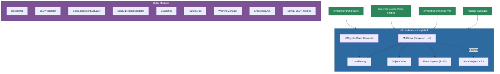
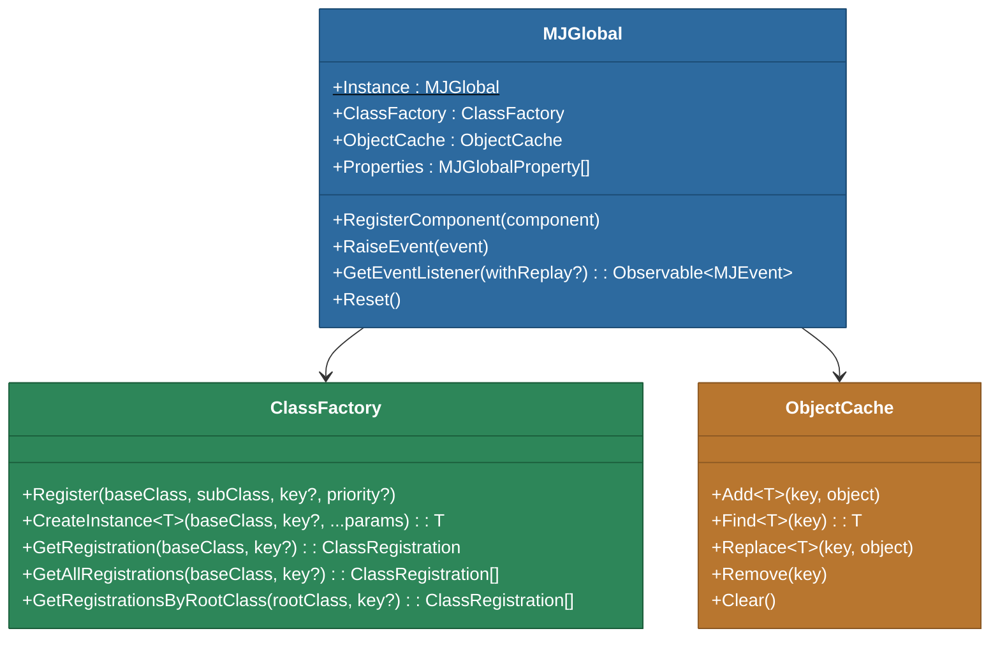
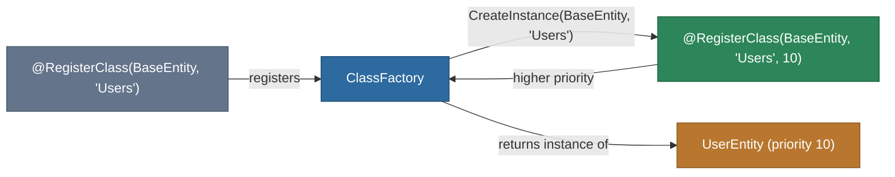
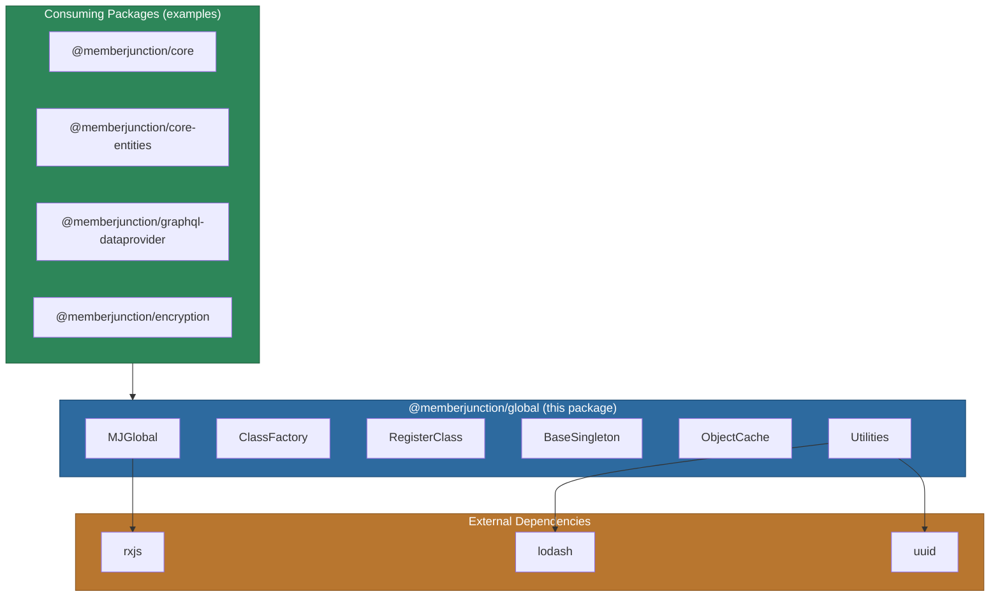

# @memberjunction/global

The foundational package for the entire MemberJunction ecosystem. `@memberjunction/global` provides the core infrastructure that every other MJ package depends on: a singleton coordination hub, a dynamic class factory with decorator-based registration, cross-environment global state management, and a collection of essential utilities for validation, diffing, caching, pattern matching, and more.

This package has **zero MJ dependencies** and sits at the very bottom of the dependency graph, making it safe to import from anywhere in the stack without circular dependency concerns.

## Architecture Overview



## Installation

```bash
npm install @memberjunction/global
```

## Core Concepts

### MJGlobal -- The Singleton Hub

`MJGlobal` is the central coordination point for the MemberJunction runtime. It is a singleton (via `BaseSingleton<T>`) that provides access to the class factory, a global event bus, a property bag, and an in-memory object cache.



```typescript
import { MJGlobal } from '@memberjunction/global';

// Access the singleton
const g = MJGlobal.Instance;

// Use the class factory
const instance = g.ClassFactory.CreateInstance<MyBase>(MyBase, 'some-key');

// Use the object cache
g.ObjectCache.Add('config', { debug: true });
const config = g.ObjectCache.Find<{ debug: boolean }>('config');

// Use the global property bag
g.Properties.push({ key: 'appName', value: 'MyApp' });
```

### Class Factory and @RegisterClass

The class factory is MemberJunction's dependency injection system. It allows any module to register a subclass for a given base class and key, so that later code can request an instance by base class and key and automatically receive the most specific (highest-priority) subclass.



**Decorator usage:**

```typescript
import { RegisterClass } from '@memberjunction/global';

// Register a subclass for a base class with a key
@RegisterClass(BaseFormComponent, 'Users')
export class UserFormComponent extends BaseFormComponent {
    // ...
}

// Priority controls which registration wins
@RegisterClass(BaseFormComponent, 'Users', 10)
export class CustomUserFormComponent extends UserFormComponent {
    // Wins over UserFormComponent because priority 10 > auto-assigned
}
```

**Programmatic registration:**

```typescript
MJGlobal.Instance.ClassFactory.Register(
    BaseEntity,      // base class
    UserEntity,      // subclass
    'Users',         // key
    5                // priority (optional)
);
```

**Instance creation:**

```typescript
const entity = MJGlobal.Instance.ClassFactory.CreateInstance<BaseEntity>(
    BaseEntity,
    'Users'
);
// Returns an instance of the highest-priority registered subclass for 'Users'
```

### Event System

MJGlobal provides a publish/subscribe event bus built on RxJS. Events can be observed in real-time or with replay (a `ReplaySubject` buffering up to 100 events for 30 seconds).

```typescript
import { MJGlobal, MJEventType } from '@memberjunction/global';

// Subscribe to events (with replay for late subscribers)
MJGlobal.Instance.GetEventListener(true).subscribe(event => {
    if (event.event === MJEventType.LoggedIn) {
        console.log('User logged in:', event.args);
    }
});

// Raise an event
MJGlobal.Instance.RaiseEvent({
    event: MJEventType.ComponentEvent,
    eventCode: 'data-loaded',
    args: { recordCount: 42 },
    component: myComponent
});
```

**Built-in event types:**

| Event Type | Description |
|---|---|
| `ComponentRegistered` | A component was registered with MJGlobal |
| `ComponentUnregistered` | A component was unregistered |
| `ComponentEvent` | Generic component-level event |
| `LoggedIn` | User authentication succeeded |
| `LoggedOut` | User logged out |
| `LoginFailed` | Authentication attempt failed |
| `LogoutFailed` | Logout attempt failed |
| `ManualResizeRequest` | Request for UI components to recalculate layout |
| `DisplaySimpleNotificationRequest` | Request to show a notification to the user |

### BaseSingleton\<T\>

A generic abstract base class for implementing the singleton pattern. It uses the global object store (`window` in browsers, `global` in Node.js) to guarantee a single instance even when module code is duplicated across multiple bundle paths.

```typescript
import { BaseSingleton } from '@memberjunction/global';

export class MyService extends BaseSingleton<MyService> {
    public static get Instance(): MyService {
        return super.getInstance<MyService>();
    }

    public DoWork(): void {
        // service logic
    }
}

// Usage
MyService.Instance.DoWork();
```

## Utility Modules

### DeepDiffer -- Object Comparison

Recursively compares two objects and produces a detailed, human-readable diff with change tracking.

```typescript
import { DeepDiffer, DiffChangeType } from '@memberjunction/global';

const differ = new DeepDiffer({
    maxDepth: 10,
    treatNullAsUndefined: true,
    includeUnchanged: false
});

const result = differ.diff(
    { name: 'Alice', age: 30, tags: ['dev'] },
    { name: 'Alice', age: 31, tags: ['dev', 'lead'] }
);

console.log(result.summary);
// { added: 1, removed: 0, modified: 2, unchanged: 0, totalPaths: 3 }

console.log(result.formatted);
// === Deep Diff Summary ===
// Total changes: 3
//   Added: 1
//   Modified: 2
// ...
```

### JSONValidator -- Template-Based Validation

A lightweight validator that checks objects against example templates using special field-name syntax for validation rules.

```typescript
import { JSONValidator } from '@memberjunction/global';

const validator = new JSONValidator();

const template = {
    "name": "example",               // required
    "email?": "user@example.com",    // optional (? suffix)
    "config*": {},                   // required, any content (* suffix)
    "tags:[1+]": ["tag1"],           // array with 1+ items
    "count:number": 0,               // must be a number
    "title:string:!empty": ""        // must be a non-empty string
};

const result = validator.validate(myData, template);
if (!result.Success) {
    console.log(result.Errors);
}
```

**Supported validation rules:**

| Syntax | Meaning |
|---|---|
| `field?` | Field is optional |
| `field*` | Required, accepts any content |
| `field:string` | Must be a string |
| `field:number` | Must be a number |
| `field:boolean` | Must be a boolean |
| `field:object` | Must be a plain object |
| `field:array` | Must be an array |
| `field:!empty` | Must not be empty |
| `field:[N+]` | Array with at least N elements |
| `field:[N-M]` | Array with N to M elements |
| `field:[=N]` | Array with exactly N elements |

### SafeExpressionEvaluator

Evaluates boolean expressions against context objects securely, blocking injection patterns like `eval()`, `require()`, `process.`, template literals, and more.

```typescript
import { SafeExpressionEvaluator } from '@memberjunction/global';

const evaluator = new SafeExpressionEvaluator();

const result = evaluator.evaluate(
    "customer.tier == 'premium' && order.total > 1000",
    {
        customer: { tier: 'premium' },
        order: { total: 1500 }
    }
);

if (result.success) {
    console.log(result.value); // true
}
```

Supports comparisons (`==`, `!=`, `<`, `>`, `<=`, `>=`), logical operators (`&&`, `||`, `!`), dot-notation property access, bracket-notation array access, and safe string/array methods (`.includes()`, `.startsWith()`, `.some()`, `.every()`, etc.).

### SQLExpressionValidator

Validates user-provided SQL expressions against injection attacks. Provides context-aware validation (WHERE clauses, ORDER BY, aggregates, field references) with an allowlist of safe SQL functions.

```typescript
import { SQLExpressionValidator } from '@memberjunction/global';

const validator = SQLExpressionValidator.Instance;

// Validate a WHERE clause
const result = validator.validate("Status = 'Active' AND Total > 100", {
    context: 'where_clause'
});
// result.valid === true

// Unsafe input is rejected
const bad = validator.validate("Name = 'test'; 1=1", {
    context: 'where_clause'
});
// bad.valid === false
// bad.error === "Semicolons are not allowed in SQL expressions"
```

### ClassUtils -- Reflection Helpers

Functions for introspecting class hierarchies at runtime.

```typescript
import {
    GetSuperclass,
    GetRootClass,
    IsSubclassOf,
    IsRootClass,
    GetClassInheritance,
    GetFullClassHierarchy,
    GetClassName,
    IsClassConstructor
} from '@memberjunction/global';

const chain = GetClassInheritance(MyDerivedClass);
// [{ name: 'MyBaseClass', reference: ... }, { name: 'MyRootClass', reference: ... }]

const isChild = IsSubclassOf(ChildClass, ParentClass); // true
const root = GetRootClass(ChildClass); // returns the top-most user-defined class
```

### PatternUtils -- Wildcard and Regex Matching

Converts wildcard patterns and regex strings to `RegExp` objects for flexible text matching.

```typescript
import { parsePattern, matchesAnyPattern } from '@memberjunction/global';

const regex = parsePattern('*AIPrompt*');   // matches strings containing "AIPrompt"
const exact = parsePattern('Users');        // matches exactly "Users" (case-insensitive)
const re = parsePattern('/^sp_Create/i');   // parsed as a regex literal

const matches = matchesAnyPattern('AIPromptRuns', ['*Prompt*', '*Agent*']); // true
```

### ObjectCache

A simple in-memory key-value cache with type-safe generic accessors. Keys are case-insensitive.

```typescript
import { MJGlobal } from '@memberjunction/global';

const cache = MJGlobal.Instance.ObjectCache;

cache.Add('user-prefs', { theme: 'dark' });
const prefs = cache.Find<{ theme: string }>('User-Prefs'); // case-insensitive lookup
cache.Replace('user-prefs', { theme: 'light' });
cache.Remove('user-prefs');
cache.Clear();
```

### WarningManager

A singleton warning system with session-level deduplication, debounced output, and tree-structured formatting. Tracks deprecation warnings, field-not-found warnings, and redundant load warnings.

```typescript
import { WarningManager } from '@memberjunction/global';

const wm = WarningManager.Instance;

// Configure
wm.UpdateConfig({ DebounceMs: 5000, GroupWarnings: true });

// Record warnings (deduplicated and batched automatically)
wm.RecordEntityDeprecationWarning('User Preferences', 'BaseEntity::constructor');
wm.RecordFieldNotFoundWarning('Users', 'DeletedColumn', 'BaseEntity::SetMany');
wm.RecordRedundantLoadWarning('AI Models', ['DashboardEngine', 'AIEngine']);

// Force immediate output if needed
wm.FlushWarnings();
```

### EncryptionUtils

Constants and utility functions for working with encrypted field values. Located in this foundational package so any package can detect encrypted values without depending on the full Encryption package.

```typescript
import {
    IsValueEncrypted,
    IsEncryptedSentinel,
    ENCRYPTION_MARKER,
    ENCRYPTED_SENTINEL
} from '@memberjunction/global';

IsValueEncrypted('$ENC$keyId$AES-256-GCM$iv$ciphertext$authTag'); // true
IsValueEncrypted('[!ENCRYPTED$]');                                 // true (sentinel)
IsValueEncrypted('plain text');                                    // false
IsEncryptedSentinel('[!ENCRYPTED$]');                              // true
```

### String and JSON Utilities

A collection of utility functions for common string and JSON operations.

| Function | Description |
|---|---|
| `CleanJSON(input)` | Extracts and formats JSON from various formats (double-escaped, markdown blocks, mixed content) |
| `SafeJSONParse<T>(json, logErrors?)` | Parses JSON returning `T` or `null` without throwing |
| `CleanAndParseJSON<T>(input, logErrors?)` | Combines `CleanJSON` and `SafeJSONParse` in one call |
| `ParseJSONRecursive(obj, options?)` | Recursively parses nested JSON strings within objects |
| `CleanJavaScript(code)` | Extracts JavaScript from markdown code blocks |
| `CopyScalarsAndArrays<T>(input, resolveCircular?)` | Deep-copies scalar and array properties, optionally handling circular references |
| `convertCamelCaseToHaveSpaces(s)` | `"AIAgentRun"` becomes `"AI Agent Run"` |
| `stripWhitespace(s)` | Removes all whitespace from a string |
| `generatePluralName(singular, options?)` | Handles irregular and regular English pluralization |
| `getIrregularPlural(word)` | Looks up irregular plural forms |
| `adjustCasing(word, options?)` | Capitalizes first letter, entire word, or leaves as-is |
| `stripTrailingChars(s, chars, skipIfExact?)` | Removes trailing substring |
| `replaceAllSpaces(s)` | Removes all space characters |
| `compareStringsByLine(str1, str2, log?)` | Line-by-line diff with character-level detail |
| `IsOnlyTimezoneShift(date1, date2)` | Detects if two dates differ only by a whole-hour timezone offset |
| `InvokeManualResize(delay?, component?)` | Broadcasts a `ManualResizeRequest` event |
| `uuidv4()` | Generates a v4 UUID |
| `GetGlobalObjectStore()` | Returns `window` (browser) or `global` (Node.js) for cross-environment state |

### ValidationTypes

Standard validation result types used across the framework.

```typescript
import { ValidationResult, ValidationErrorInfo, ValidationErrorType } from '@memberjunction/global';

const result = new ValidationResult();
result.Success = false;
result.Errors.push(
    new ValidationErrorInfo('fieldName', 'Value is required', null, ValidationErrorType.Failure)
);
```

## Module Dependency Flow



## API Reference

### MJGlobal

| Member | Type | Description |
|---|---|---|
| `Instance` | `MJGlobal` (static) | Returns the singleton instance |
| `ClassFactory` | `ClassFactory` | Access the class registration and instantiation system |
| `ObjectCache` | `ObjectCache` | In-memory key-value cache |
| `Properties` | `MJGlobalProperty[]` | Global property bag for arbitrary key-value storage |
| `RegisterComponent(component)` | `void` | Register an `IMJComponent` |
| `RaiseEvent(event)` | `void` | Publish an `MJEvent` to all listeners |
| `GetEventListener(withReplay?)` | `Observable<MJEvent>` | Subscribe to the event stream |
| `Reset()` | `void` | Reset all internal state (use with extreme caution) |

### ClassFactory

| Method | Returns | Description |
|---|---|---|
| `Register(baseClass, subClass, key?, priority?, skipNullKeyWarning?, autoRegisterWithRootClass?)` | `void` | Register a subclass for a base class and optional key |
| `CreateInstance<T>(baseClass, key?, ...params)` | `T \| null` | Create an instance of the highest-priority registered subclass |
| `GetRegistration(baseClass, key?)` | `ClassRegistration \| null` | Get the highest-priority registration |
| `GetAllRegistrations(baseClass, key?)` | `ClassRegistration[]` | Get all registrations for a base class and optional key |
| `GetRegistrationsByRootClass(rootClass, key?)` | `ClassRegistration[]` | Get registrations by root class in the hierarchy |

### RegisterClass Decorator

```typescript
function RegisterClass(
    baseClass: unknown,
    key?: string | null,
    priority?: number,
    skipNullKeyWarning?: boolean,
    autoRegisterWithRootClass?: boolean
): (constructor: Function) => void;
```

### ObjectCache

| Method | Returns | Description |
|---|---|---|
| `Add<T>(key, object)` | `void` | Add entry; throws if key exists |
| `Find<T>(key)` | `T \| null` | Case-insensitive key lookup |
| `Replace<T>(key, object)` | `void` | Replace or add entry |
| `Remove(key)` | `void` | Remove entry by key |
| `Clear()` | `void` | Remove all entries |

### DeepDiffer

| Method | Returns | Description |
|---|---|---|
| `diff<T>(oldValue, newValue)` | `DeepDiffResult` | Generate a full diff between two values |
| `updateConfig(config)` | `void` | Update configuration options |

### JSONValidator

| Method | Returns | Description |
|---|---|---|
| `validate(data, template, path?)` | `ValidationResult` | Validate data against a template |
| `validateAgainstSchema(data, schemaJson)` | `ValidationResult` | Validate against a JSON string schema |
| `cleanValidationSyntax<T>(data)` | `T` | Strip validation markers from keys |

### SafeExpressionEvaluator

| Method | Returns | Description |
|---|---|---|
| `evaluate(expression, context, enableDiagnostics?)` | `ExpressionEvaluationResult` | Evaluate a single boolean expression |
| `evaluateMultiple(expressions, context)` | `Record<string, ExpressionEvaluationResult>` | Evaluate multiple expressions |

### SQLExpressionValidator

| Method | Returns | Description |
|---|---|---|
| `Instance` (static) | `SQLExpressionValidator` | Singleton accessor |
| `validate(expression, options)` | `SQLValidationResult` | Validate a SQL expression |

### WarningManager

| Method | Returns | Description |
|---|---|---|
| `Instance` (static) | `WarningManager` | Singleton accessor |
| `UpdateConfig(config)` | `void` | Update warning configuration |
| `GetConfig()` | `Readonly<WarningConfig>` | Get current configuration |
| `RecordEntityDeprecationWarning(entityName, callerName)` | `boolean` | Record an entity deprecation warning |
| `RecordFieldDeprecationWarning(entityName, fieldName, callerName)` | `boolean` | Record a field deprecation warning |
| `RecordFieldNotFoundWarning(entityName, fieldName, context)` | `boolean` | Record a field-not-found warning |
| `RecordRedundantLoadWarning(entityName, engines)` | `boolean` | Record a redundant data loading warning |
| `FlushWarnings()` | `void` | Force immediate output of all pending warnings |
| `Reset()` | `void` | Clear all tracking state |

## Dependencies

| Package | Purpose |
|---|---|
| `rxjs` | Observable-based event system (`Subject`, `ReplaySubject`) |
| `lodash` | Deep comparison, type checking, object utilities |
| `uuid` | UUID v4 generation |

## Related Packages

| Package | Relationship |
|---|---|
| `@memberjunction/core` | Builds on MJGlobal; adds Metadata, RunView, BaseEntity, and more |
| `@memberjunction/core-entities` | Generated entity subclasses registered via `@RegisterClass` |
| `@memberjunction/encryption` | Full encryption implementation; uses `EncryptionUtils` constants from this package |
| `@memberjunction/server` | Server-side runtime that depends on MJGlobal for class factory and events |
| `@memberjunction/graphql-dataprovider` | Client-side data provider registered through the class factory |

## Build

```bash
# From the package directory
cd packages/MJGlobal
npm run build
```

The build step runs `tsc` followed by `tsc-alias` for path alias resolution.
