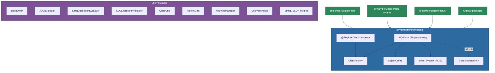
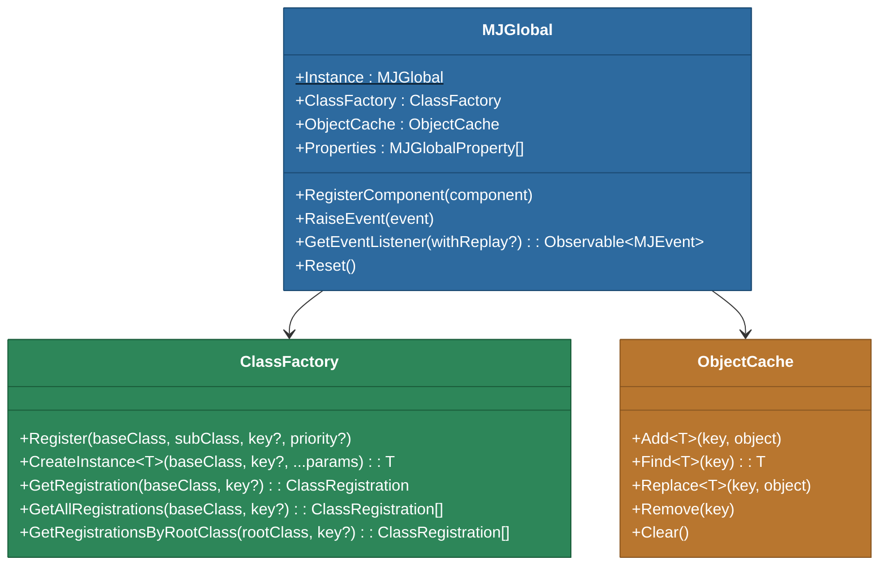
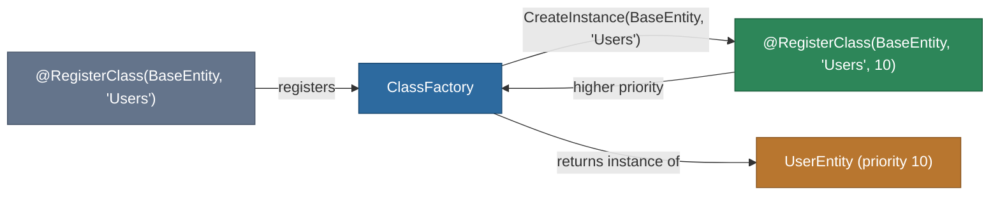
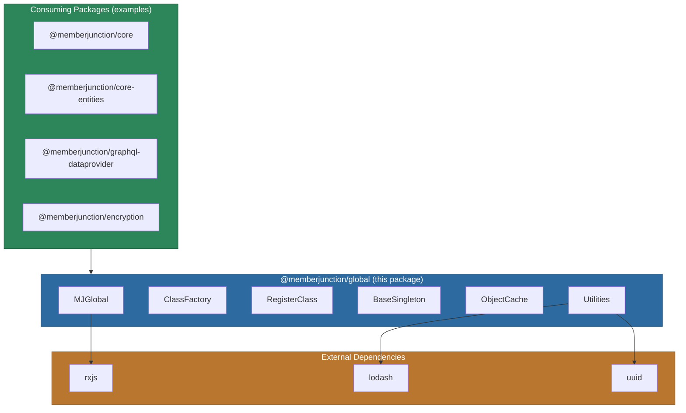

# @memberjunction/global

The foundational package for the entire MemberJunction ecosystem. `@memberjunction/global` provides the core infrastructure that every other MJ package depends on: a singleton coordination hub, a dynamic class factory with decorator-based registration, cross-environment global state management, and a collection of essential utilities for validation, diffing, caching, pattern matching, and more.

This package has **zero MJ dependencies** and sits at the very bottom of the dependency graph, making it safe to import from anywhere in the stack without circular dependency concerns.

## Architecture Overview


```mermaid
graph TD
    subgraph MJGlobal["@memberjunction/global"]
        direction TB
        MJG["MJGlobal (Singleton Hub)"]
        CF["ClassFactory"]
        RC["@RegisterClass Decorator"]
        OC["ObjectCache"]
        BS["BaseSingleton&lt;T&gt;"]
        EV["Event System (RxJS)"]

        MJG --> CF
        MJG --> OC
        MJG --> EV
        RC --> CF
        MJG -.->|extends| BS
    end

    subgraph Utilities["Utility Modules"]
        direction TB
        DD["DeepDiffer"]
        JV["JSONValidator"]
        SE["SafeExpressionEvaluator"]
        SQ["SQLExpressionValidator"]
        CU["ClassUtils"]
        PU["PatternUtils"]
        WM["WarningManager"]
        EU["EncryptionUtils"]
        UT["String / JSON Utilities"]
    end

    Core["@memberjunction/core"] --> MJGlobal
    Entities["@memberjunction/core-entities"] --> MJGlobal
    Server["@memberjunction/server"] --> MJGlobal
    Angular["Angular packages"] --> MJGlobal

    style MJGlobal fill:#2d6a9f,stroke:#1a4971,color:#fff
    style Utilities fill:#7c5295,stroke:#563a6b,color:#fff
    style Core fill:#2d8659,stroke:#1a5c3a,color:#fff
    style Entities fill:#2d8659,stroke:#1a5c3a,color:#fff
    style Server fill:#2d8659,stroke:#1a5c3a,color:#fff
    style Angular fill:#2d8659,stroke:#1a5c3a,color:#fff
```

## Installation

```bash
npm install @memberjunction/global
```

## Core Concepts

### MJGlobal -- The Singleton Hub

`MJGlobal` is the central coordination point for the MemberJunction runtime. It is a singleton (via `BaseSingleton<T>`) that provides access to the class factory, a global event bus, a property bag, and an in-memory object cache.


```mermaid
classDiagram
    class MJGlobal {
        +Instance : MJGlobal$
        +ClassFactory : ClassFactory
        +ObjectCache : ObjectCache
        +Properties : MJGlobalProperty[]
        +RegisterComponent(component)
        +RaiseEvent(event)
        +GetEventListener(withReplay?) : Observable~MJEvent~
        +Reset()
    }
    class ClassFactory {
        +Register(baseClass, subClass, key?, priority?)
        +CreateInstance~T~(baseClass, key?, ...params) : T
        +GetRegistration(baseClass, key?) : ClassRegistration
        +GetAllRegistrations(baseClass, key?) : ClassRegistration[]
        +GetRegistrationsByRootClass(rootClass, key?) : ClassRegistration[]
    }
    class ObjectCache {
        +Add~T~(key, object)
        +Find~T~(key) : T
        +Replace~T~(key, object)
        +Remove(key)
        +Clear()
    }
    MJGlobal --> ClassFactory
    MJGlobal --> ObjectCache

    style MJGlobal fill:#2d6a9f,stroke:#1a4971,color:#fff
    style ClassFactory fill:#2d8659,stroke:#1a5c3a,color:#fff
    style ObjectCache fill:#b8762f,stroke:#8a5722,color:#fff
```

```typescript
import { MJGlobal } from '@memberjunction/global';

// Access the singleton
const g = MJGlobal.Instance;

// Use the class factory
const instance = g.ClassFactory.CreateInstance<MyBase>(MyBase, 'some-key');

// Use the object cache
g.ObjectCache.Add('config', { debug: true });
const config = g.ObjectCache.Find<{ debug: boolean }>('config');

// Use the global property bag
g.Properties.push({ key: 'appName', value: 'MyApp' });
```

### Class Factory and @RegisterClass

The class factory is MemberJunction's dependency injection system. It allows any module to register a subclass for a given base class and key, so that later code can request an instance by base class and key and automatically receive the most specific (highest-priority) subclass.


```mermaid
flowchart LR
    A["@RegisterClass(BaseEntity, 'Users')"] -->|registers| CF["ClassFactory"]
    B["@RegisterClass(BaseEntity, 'Users', 10)"] -->|higher priority| CF
    CF -->|"CreateInstance(BaseEntity, 'Users')"| B
    CF -->|returns instance of| SUB["UserEntity (priority 10)"]

    style A fill:#64748b,stroke:#475569,color:#fff
    style B fill:#2d8659,stroke:#1a5c3a,color:#fff
    style CF fill:#2d6a9f,stroke:#1a4971,color:#fff
    style SUB fill:#b8762f,stroke:#8a5722,color:#fff
```

**Decorator usage:**

```typescript
import { RegisterClass } from '@memberjunction/global';

// Register a subclass for a base class with a key
@RegisterClass(BaseFormComponent, 'Users')
export class UserFormComponent extends BaseFormComponent {
    // ...
}

// Priority controls which registration wins
@RegisterClass(BaseFormComponent, 'Users', 10)
export class CustomUserFormComponent extends UserFormComponent {
    // Wins over UserFormComponent because priority 10 > auto-assigned
}
```

**Programmatic registration:**

```typescript
MJGlobal.Instance.ClassFactory.Register(
    BaseEntity,      // base class
    UserEntity,      // subclass
    'Users',         // key
    5                // priority (optional)
);
```

**Instance creation:**

```typescript
const entity = MJGlobal.Instance.ClassFactory.CreateInstance<BaseEntity>(
    BaseEntity,
    'Users'
);
// Returns an instance of the highest-priority registered subclass for 'Users'
```

### Structured registration: `@RegisterClassEx` + metadata

When a registration needs anything beyond `(baseClass, key, priority)` — toggling the rarely-used flags, or attaching **metadata** for runtime filtering — reach for `@RegisterClassEx`. It's the same registration under the hood, but accepts a typed options bag instead of trailing positional booleans:

```typescript
import { RegisterClassEx } from '@memberjunction/global';

@RegisterClassEx(BaseFormPanel, {
    key: 'content-sources:tag-pipeline',
    skipNullKeyWarning: true,
    metadata: {
        entity: 'MJ: Content Sources',
        slot: 'after-fields',
        sortKey: 100,
    },
})
export class TagPipelinePanel extends BaseFormPanel { /* ... */ }
```

The `metadata` field is stored on the `ClassRegistration` and is purely a runtime aid for discovery — it has no effect on the priority / key lookup. Pair it with one of the discovery helpers below:

| Helper                                                | Use when …                                                                                                                                       |
|------------------------------------------------------|---------------------------------------------------------------------------------------------------------------------------------------------------|
| `GetAllRegistrationsByMetadata(base, predicate)`     | You have structured discriminators (`entity`, `slot`, `sortKey`, etc.) and want to filter on multiple fields. Recommended default.               |
| `GetAllRegistrationsByKeyPrefix(base, prefix)`       | Registrations share a structured key prefix (e.g. `"breed:..."` / `"<EntityName>:..."`) and you want everything below that prefix.               |
| `GetAllRegistrationsByKeyPattern(base, regex)`       | More nuanced key matching than a prefix can express.                                                                                              |

```typescript
// Discover every panel that should appear in a given form's slot
const panels = MJGlobal.Instance.ClassFactory.GetAllRegistrationsByMetadata(
    BaseFormPanel,
    (m) => m?.entity === 'MJ: Content Sources' && m?.slot === 'after-fields',
);
// Sort by metadata.sortKey, then by Priority, then by registration order
panels.sort((a, b) => {
    const aSort = (a.Metadata?.sortKey as number) ?? 0;
    const bSort = (b.Metadata?.sortKey as number) ?? 0;
    return bSort !== aSort ? bSort - aSort : b.Priority - a.Priority;
});
```

`@RegisterClass` also accepts an optional sixth positional `metadata` arg for parity, but the options-bag form scales better past three arguments and reads better at call sites — prefer `@RegisterClassEx` for new code.

### Event System

MJGlobal provides a publish/subscribe event bus built on RxJS. Events can be observed in real-time or with replay (a `ReplaySubject` buffering up to 100 events for 30 seconds).

```typescript
import { MJGlobal, MJEventType } from '@memberjunction/global';

// Subscribe to events (with replay for late subscribers)
MJGlobal.Instance.GetEventListener(true).subscribe(event => {
    if (event.event === MJEventType.LoggedIn) {
        console.log('User logged in:', event.args);
    }
});

// Raise an event
MJGlobal.Instance.RaiseEvent({
    event: MJEventType.ComponentEvent,
    eventCode: 'data-loaded',
    args: { recordCount: 42 },
    component: myComponent
});
```

**Built-in event types:**

| Event Type | Description |
|---|---|
| `ComponentRegistered` | A component was registered with MJGlobal |
| `ComponentUnregistered` | A component was unregistered |
| `ComponentEvent` | Generic component-level event |
| `LoggedIn` | User authentication succeeded |
| `LoggedOut` | User logged out |
| `LoginFailed` | Authentication attempt failed |
| `LogoutFailed` | Logout attempt failed |
| `ManualResizeRequest` | Request for UI components to recalculate layout |
| `DisplaySimpleNotificationRequest` | Request to show a notification to the user |

### BaseSingleton\<T\>

A generic abstract base class for implementing the singleton pattern. It uses the global object store (`window` in browsers, `global` in Node.js) to guarantee a single instance even when module code is duplicated across multiple bundle paths.

```typescript
import { BaseSingleton } from '@memberjunction/global';

export class MyService extends BaseSingleton<MyService> {
    public static get Instance(): MyService {
        return super.getInstance<MyService>();
    }

    public DoWork(): void {
        // service logic
    }
}

// Usage
MyService.Instance.DoWork();
```

## Utility Modules

### DeepDiffer -- Object Comparison

Recursively compares two objects and produces a detailed, human-readable diff with change tracking.

```typescript
import { DeepDiffer, DiffChangeType } from '@memberjunction/global';

const differ = new DeepDiffer({
    maxDepth: 10,
    treatNullAsUndefined: true,
    includeUnchanged: false
});

const result = differ.diff(
    { name: 'Alice', age: 30, tags: ['dev'] },
    { name: 'Alice', age: 31, tags: ['dev', 'lead'] }
);

console.log(result.summary);
// { added: 1, removed: 0, modified: 2, unchanged: 0, totalPaths: 3 }

console.log(result.formatted);
// === Deep Diff Summary ===
// Total changes: 3
//   Added: 1
//   Modified: 2
// ...
```

### JSONValidator -- Template-Based Validation

A lightweight validator that checks objects against example templates using special field-name syntax for validation rules.

```typescript
import { JSONValidator } from '@memberjunction/global';

const validator = new JSONValidator();

const template = {
    "name": "example",               // required
    "email?": "user@example.com",    // optional (? suffix)
    "config*": {},                   // required, any content (* suffix)
    "tags:[1+]": ["tag1"],           // array with 1+ items
    "count:number": 0,               // must be a number
    "title:string:!empty": ""        // must be a non-empty string
};

const result = validator.validate(myData, template);
if (!result.Success) {
    console.log(result.Errors);
}
```

**Supported validation rules:**

| Syntax | Meaning |
|---|---|
| `field?` | Field is optional |
| `field*` | Required, accepts any content |
| `field:string` | Must be a string |
| `field:number` | Must be a number |
| `field:boolean` | Must be a boolean |
| `field:object` | Must be a plain object |
| `field:array` | Must be an array |
| `field:!empty` | Must not be empty |
| `field:[N+]` | Array with at least N elements |
| `field:[N-M]` | Array with N to M elements |
| `field:[=N]` | Array with exactly N elements |

### SafeExpressionEvaluator

Evaluates boolean expressions against context objects securely, blocking injection patterns like `eval()`, `require()`, `process.`, template literals, and more.

```typescript
import { SafeExpressionEvaluator } from '@memberjunction/global';

const evaluator = new SafeExpressionEvaluator();

const result = evaluator.evaluate(
    "customer.tier == 'premium' && order.total > 1000",
    {
        customer: { tier: 'premium' },
        order: { total: 1500 }
    }
);

if (result.success) {
    console.log(result.value); // true
}
```

Supports comparisons (`==`, `!=`, `<`, `>`, `<=`, `>=`), logical operators (`&&`, `||`, `!`), dot-notation property access, bracket-notation array access, and safe string/array methods (`.includes()`, `.startsWith()`, `.some()`, `.every()`, etc.).

### SQLExpressionValidator

Validates user-provided SQL expressions and full queries against injection attacks. Provides context-aware validation (WHERE clauses, ORDER BY, aggregates, field references, full queries) with an allowlist of safe SQL functions.

**Expression validation** (WHERE clauses, aggregates, ORDER BY):

```typescript
import { SQLExpressionValidator } from '@memberjunction/global';

const validator = SQLExpressionValidator.Instance;

// Validate a WHERE clause
const result = validator.validate("Status = 'Active' AND Total > 100", {
    context: 'where_clause'
});
// result.valid === true

// Unsafe input is rejected
const bad = validator.validate("Name = 'test'; 1=1", {
    context: 'where_clause'
});
// bad.valid === false
```

**Full query validation** (ad-hoc SELECT/WITH statements):

```typescript
// Validate a complete SQL query — allows SELECT, JOINs, subqueries, set operations, comments
const result = validator.validateFullQuery('SELECT TOP 10 * FROM __mj.vwUsers WHERE IsActive = 1');
// result.valid === true

// Mutations and dangerous operations are blocked
const bad = validator.validateFullQuery("INSERT INTO Users (Name) VALUES ('hacked')");
// bad.valid === false, bad.trigger === 'INSERT'
```

The `full_query` context allows keywords that are legitimate in SELECT statements (EXISTS, ANY, ALL, UNION, INTERSECT, EXCEPT, IF) while still blocking all mutations (INSERT, UPDATE, DELETE, DROP, etc.), dangerous operations (EXEC, OPENROWSET, WAITFOR), and multi-statement injection (semicolons).

### ClassUtils -- Reflection Helpers

Functions for introspecting class hierarchies at runtime.

```typescript
import {
    GetSuperclass,
    GetRootClass,
    IsSubclassOf,
    IsRootClass,
    GetClassInheritance,
    GetFullClassHierarchy,
    GetClassName,
    IsClassConstructor
} from '@memberjunction/global';

const chain = GetClassInheritance(MyDerivedClass);
// [{ name: 'MyBaseClass', reference: ... }, { name: 'MyRootClass', reference: ... }]

const isChild = IsSubclassOf(ChildClass, ParentClass); // true
const root = GetRootClass(ChildClass); // returns the top-most user-defined class
```

### PatternUtils -- Wildcard and Regex Matching

Converts wildcard patterns and regex strings to `RegExp` objects for flexible text matching.

```typescript
import { parsePattern, matchesAnyPattern } from '@memberjunction/global';

const regex = parsePattern('*AIPrompt*');   // matches strings containing "AIPrompt"
const exact = parsePattern('Users');        // matches exactly "Users" (case-insensitive)
const re = parsePattern('/^sp_Create/i');   // parsed as a regex literal

const matches = matchesAnyPattern('AIPromptRuns', ['*Prompt*', '*Agent*']); // true
```

### ObjectCache

A simple in-memory key-value cache with type-safe generic accessors. Keys are case-insensitive.

```typescript
import { MJGlobal } from '@memberjunction/global';

const cache = MJGlobal.Instance.ObjectCache;

cache.Add('user-prefs', { theme: 'dark' });
const prefs = cache.Find<{ theme: string }>('User-Prefs'); // case-insensitive lookup
cache.Replace('user-prefs', { theme: 'light' });
cache.Remove('user-prefs');
cache.Clear();
```

### KeyedSerialTaskQueue

An entity-agnostic primitive for **fire-and-forget work that must serialize per key**. Tasks enqueued under the same key (compared by object identity) run strictly in order — the next can't start until the prior settles — while tasks under different keys run concurrently. Failures are tallied for a later `flush()` and never propagate outward, so the enqueue site is never blocked, nor broken, by a background failure.

It is **self-bounding**: only in-flight tasks are retained (they drop out as they settle) and failures accumulate into counters, so a long-lived queue that never flushes does not grow without bound.

```typescript
import { KeyedSerialTaskQueue } from '@memberjunction/global';

const queue = new KeyedSerialTaskQueue({ onError: (err, label) => console.error(label, err) });

// Same key (the `record` object) → these run in order; different keys → concurrent.
queue.enqueue(record, () => insert(record));
queue.enqueue(record, () => update(record), { label: 'update', isOk: (ok) => ok === true });

const { failures, rejections } = await queue.flush(); // await in-flight tasks + read/reset the failure tally
```

The canonical consumer is `BaseEntitySaveQueue` in `@memberjunction/core`, which builds the fire-and-forget entity-save pattern (INSERT then chained UPDATE, with the "mutate-after-insert" race made structurally impossible) on top of this primitive.

### WarningManager

A singleton warning system with session-level deduplication, debounced output, and tree-structured formatting. Tracks deprecation warnings, field-not-found warnings, and redundant load warnings.

```typescript
import { WarningManager } from '@memberjunction/global';

const wm = WarningManager.Instance;

// Configure
wm.UpdateConfig({ DebounceMs: 5000, GroupWarnings: true });

// Record warnings (deduplicated and batched automatically)
wm.RecordEntityDeprecationWarning('User Preferences', 'BaseEntity::constructor');
wm.RecordFieldNotFoundWarning('Users', 'DeletedColumn', 'BaseEntity::SetMany');
wm.RecordRedundantLoadWarning('AI Models', ['DashboardEngine', 'AIEngine']);

// Force immediate output if needed
wm.FlushWarnings();
```

### EncryptionUtils

Constants and utility functions for working with encrypted field values. Located in this foundational package so any package can detect encrypted values without depending on the full Encryption package.

```typescript
import {
    IsValueEncrypted,
    IsEncryptedSentinel,
    ENCRYPTION_MARKER,
    ENCRYPTED_SENTINEL
} from '@memberjunction/global';

IsValueEncrypted('$ENC$keyId$AES-256-GCM$iv$ciphertext$authTag'); // true
IsValueEncrypted('[!ENCRYPTED$]');                                 // true (sentinel)
IsValueEncrypted('plain text');                                    // false
IsEncryptedSentinel('[!ENCRYPTED$]');                              // true
```

### String and JSON Utilities

A collection of utility functions for common string and JSON operations.

| Function | Description |
|---|---|
| `CleanJSON(input)` | Extracts and formats JSON from various formats (double-escaped, markdown blocks, mixed content) |
| `SafeJSONParse<T>(json, logErrors?)` | Parses JSON returning `T` or `null` without throwing |
| `CleanAndParseJSON<T>(input, logErrors?)` | Combines `CleanJSON` and `SafeJSONParse` in one call |
| `ParseJSONRecursive(obj, options?)` | Recursively parses nested JSON strings within objects |
| `CleanJavaScript(code)` | Extracts JavaScript from markdown code blocks |
| `CopyScalarsAndArrays<T>(input, resolveCircular?)` | Deep-copies scalar and array properties, optionally handling circular references |
| `convertCamelCaseToHaveSpaces(s)` | `"AIAgentRun"` becomes `"AI Agent Run"` |
| `stripWhitespace(s)` | Removes all whitespace from a string |
| `generatePluralName(singular, options?)` | Handles irregular and regular English pluralization |
| `getIrregularPlural(word)` | Looks up irregular plural forms |
| `adjustCasing(word, options?)` | Capitalizes first letter, entire word, or leaves as-is |
| `stripTrailingChars(s, chars, skipIfExact?)` | Removes trailing substring |
| `replaceAllSpaces(s)` | Removes all space characters |
| `compareStringsByLine(str1, str2, log?)` | Line-by-line diff with character-level detail |
| `IsOnlyTimezoneShift(date1, date2)` | Detects if two dates differ only by a whole-hour timezone offset |
| `InvokeManualResize(delay?, component?)` | Broadcasts a `ManualResizeRequest` event |
| `uuidv4()` | Generates a v4 UUID |
| `GetGlobalObjectStore()` | Returns `window` (browser) or `global` (Node.js) for cross-environment state |

### ValidationTypes

Standard validation result types used across the framework.

```typescript
import { ValidationResult, ValidationErrorInfo, ValidationErrorType } from '@memberjunction/global';

const result = new ValidationResult();
result.Success = false;
result.Errors.push(
    new ValidationErrorInfo('fieldName', 'Value is required', null, ValidationErrorType.Failure)
);
```

## Module Dependency Flow


```mermaid
flowchart TB
    subgraph MJGlobal["@memberjunction/global (this package)"]
        direction LR
        G["MJGlobal"]
        CF["ClassFactory"]
        RC["RegisterClass"]
        BS["BaseSingleton"]
        OC["ObjectCache"]
        U["Utilities"]
    end

    subgraph External["External Dependencies"]
        RX["rxjs"]
        LO["lodash"]
        UUID["uuid"]
    end

    G --> RX
    U --> LO
    U --> UUID

    subgraph Consumers["Consuming Packages (examples)"]
        direction LR
        MJC["@memberjunction/core"]
        MCE["@memberjunction/core-entities"]
        GQL["@memberjunction/graphql-dataprovider"]
        ENC["@memberjunction/encryption"]
    end

    Consumers --> MJGlobal

    style MJGlobal fill:#2d6a9f,stroke:#1a4971,color:#fff
    style External fill:#b8762f,stroke:#8a5722,color:#fff
    style Consumers fill:#2d8659,stroke:#1a5c3a,color:#fff
```

## API Reference

### MJGlobal

| Member | Type | Description |
|---|---|---|
| `Instance` | `MJGlobal` (static) | Returns the singleton instance |
| `ClassFactory` | `ClassFactory` | Access the class registration and instantiation system |
| `ObjectCache` | `ObjectCache` | In-memory key-value cache |
| `Properties` | `MJGlobalProperty[]` | Global property bag for arbitrary key-value storage |
| `RegisterComponent(component)` | `void` | Register an `IMJComponent` |
| `RaiseEvent(event)` | `void` | Publish an `MJEvent` to all listeners |
| `GetEventListener(withReplay?)` | `Observable<MJEvent>` | Subscribe to the event stream |
| `Reset()` | `void` | Reset all internal state (use with extreme caution) |

### ClassFactory

| Method | Returns | Description |
|---|---|---|
| `Register(baseClass, subClass, key?, priority?, skipNullKeyWarning?, autoRegisterWithRootClass?)` | `void` | Register a subclass for a base class and optional key |
| `CreateInstance<T>(baseClass, key?, ...params)` | `T \| null` | Create an instance of the highest-priority registered subclass (sync) |
| `CreateInstanceAsync<T>(baseClass, key?, ...params)` | `Promise<T \| null>` | Async version that triggers lazy loaders if registration not found |
| `GetRegistration(baseClass, key?)` | `ClassRegistration \| null` | Get the highest-priority registration (sync) |
| `GetRegistrationAsync(baseClass, key?)` | `Promise<ClassRegistration \| null>` | Async version that triggers lazy loaders if registration not found |
| `GetAllRegistrations(baseClass, key?)` | `ClassRegistration[]` | Get all registrations for a base class and optional key |
| `GetRegistrationsByRootClass(rootClass, key?)` | `ClassRegistration[]` | Get registrations by root class in the hierarchy |
| `RegisterLazyLoader(loader)` | `void` | Register a callback `(baseClassName, key) => Promise<boolean>` called when a registration is not found. Multiple loaders can be registered and are called in order. |

### RegisterClass Decorator

```typescript
function RegisterClass(
    baseClass: unknown,
    key?: string | null,
    priority?: number,
    skipNullKeyWarning?: boolean,
    autoRegisterWithRootClass?: boolean
): (constructor: Function) => void;
```

### ObjectCache

| Method | Returns | Description |
|---|---|---|
| `Add<T>(key, object)` | `void` | Add entry; throws if key exists |
| `Find<T>(key)` | `T \| null` | Case-insensitive key lookup |
| `Replace<T>(key, object)` | `void` | Replace or add entry |
| `Remove(key)` | `void` | Remove entry by key |
| `Clear()` | `void` | Remove all entries |

### DeepDiffer

| Method | Returns | Description |
|---|---|---|
| `diff<T>(oldValue, newValue)` | `DeepDiffResult` | Generate a full diff between two values |
| `updateConfig(config)` | `void` | Update configuration options |

### JSONValidator

| Method | Returns | Description |
|---|---|---|
| `validate(data, template, path?)` | `ValidationResult` | Validate data against a template |
| `validateAgainstSchema(data, schemaJson)` | `ValidationResult` | Validate against a JSON string schema |
| `cleanValidationSyntax<T>(data)` | `T` | Strip validation markers from keys |

### SafeExpressionEvaluator

| Method | Returns | Description |
|---|---|---|
| `evaluate(expression, context, enableDiagnostics?)` | `ExpressionEvaluationResult` | Evaluate a single boolean expression |
| `evaluateMultiple(expressions, context)` | `Record<string, ExpressionEvaluationResult>` | Evaluate multiple expressions |

### SQLExpressionValidator

| Method | Returns | Description |
|---|---|---|
| `Instance` (static) | `SQLExpressionValidator` | Singleton accessor |
| `validate(expression, options)` | `SQLValidationResult` | Validate a SQL expression with context-specific rules |
| `validateFullQuery(sql)` | `SQLValidationResult` | Validate a full SELECT/WITH query (convenience for `validate(sql, { context: 'full_query' })`) |

### WarningManager

| Method | Returns | Description |
|---|---|---|
| `Instance` (static) | `WarningManager` | Singleton accessor |
| `UpdateConfig(config)` | `void` | Update warning configuration |
| `GetConfig()` | `Readonly<WarningConfig>` | Get current configuration |
| `RecordEntityDeprecationWarning(entityName, callerName)` | `boolean` | Record an entity deprecation warning |
| `RecordFieldDeprecationWarning(entityName, fieldName, callerName)` | `boolean` | Record a field deprecation warning |
| `RecordFieldNotFoundWarning(entityName, fieldName, context)` | `boolean` | Record a field-not-found warning |
| `RecordRedundantLoadWarning(entityName, engines)` | `boolean` | Record a redundant data loading warning |
| `FlushWarnings()` | `void` | Force immediate output of all pending warnings |
| `Reset()` | `void` | Clear all tracking state |

## Dependencies

| Package | Purpose |
|---|---|
| `rxjs` | Observable-based event system (`Subject`, `ReplaySubject`) |
| `lodash` | Deep comparison, type checking, object utilities |
| `uuid` | UUID v4 generation |

## Field Rules Engine

A **framework-agnostic** engine for computing field values from declarative rules and a composable
transform pipeline. It is the shared substrate behind two MemberJunction features — and is designed so
*any* code can use it, because it lives here in `global` with zero dependencies beyond this package:

| Layer | Package | Use it when |
|---|---|---|
| **Pure engine** (this package) | `@memberjunction/global` | You have a **plain record** (`Record<string, unknown>`) — from anywhere — and want to compute/transform field values. No entity, no DB required. |
| **`EntityFieldRules`** | `@memberjunction/core` | The **target is an MJ entity** — you want metadata validation, automatic type coercion, RunView-backed lookups, and write-back with Record Changes versioning. Builds on this engine. |
| **`FieldMappingEngine`** | `@memberjunction/integration` | The **other side is a live external system** (its own protocol, auth, match resolution, sync direction). Uses this engine for the per-field transforms. |

> One engine, three purpose-built layers. Pick the lowest one that fits: if you only have a dict, use this; if you're updating an entity, use core; if you're syncing an external system, that's integration's job.

### Two pieces

**1. `FieldTransformEngine` — a transform pipeline over `(value, fields)`**

Runs an ordered list of `TransformStep`s. Step types: `direct`, `regex`, `split`, `combine`, `lookup`
(in-memory map), `format`, `coerce`, `substring`, `custom` (a `(value, fields) => result` expression,
compiled once and LRU-cached). Per-step `OnError` is `Skip` | `Null` | `Fail` (default `Null` — grace).

```ts
import { FieldTransformEngine } from '@memberjunction/global';

const e = new FieldTransformEngine();
e.ExecutePipeline('19.99', {}, [{ Type: 'coerce', Config: { TargetType: 'number' } }]).Value; // 19.99
e.Evaluate("fields.First + ' ' + fields.Last", undefined, { First: 'Ada', Last: 'Lovelace' });  // 'Ada Lovelace'
```

**2. `FieldRulesEvaluator` — rules → a per-field diff (no mutation)**

A `FieldRule` sets a `TargetField` from a `Source` — `static` | `field` | `formula` | `lookup` —
optionally through a `Transforms` pipeline, gated by an optional `Condition` (a **safe** boolean
expression via this package's `SafeExpressionEvaluator`). `ComputeChanges` returns a `FieldChange[]`
(old → new per rule) **without applying anything** — which is exactly what makes a **dry-run preview**
possible: the caller decides whether to write.

```ts
import { FieldRulesEvaluator, type FieldRuleSet } from '@memberjunction/global';

const ruleSet: FieldRuleSet = {
    Rules: [
        { TargetField: 'FullName', Source: { Kind: 'formula', Expression: "fields.FirstName + ' ' + fields.LastName" } },
        { TargetField: 'Tier', Source: { Kind: 'static', Value: 'Gold' }, Condition: 'Revenue > 1000' },
    ],
};

// LookupResolver is optional — only needed for `lookup` sources. core's EntityFieldRules supplies a
// RunView-backed one; here you inject your own (or omit it).
const changes = await new FieldRulesEvaluator().ComputeChanges(
    { FirstName: 'Ada', LastName: 'Lovelace', FullName: '', Revenue: 5000, Tier: 'Bronze' },
    ruleSet,
);
// → [{ Field: 'FullName', OldValue: '', NewValue: 'Ada Lovelace', Changed: true, Applied: true }, …]
```

### Safety

- `Condition` expressions use the **safe** evaluator (blocklisted patterns, no statements).
- `formula` / `custom` value expressions compile with `new Function` (the same model as the established
  integration `custom` transform) — author them from privileged users/agents, not untrusted input.
- The engine performs **no I/O**; `lookup` reaches a database only through the resolver you inject.

### See also

- **`EntityFieldRules`** in [`@memberjunction/core`](../MJCore/README.md#entity-field-rules) — the metadata-aware layer for updating entities (validation, coercion, lookups, apply).
- **`FieldMappingEngine`** in [`@memberjunction/integration`](../Integration/engine/README.md#field-mapping--the-shared-transform-engine) — external-system field mapping built on this engine.

## Related Packages

| Package | Relationship |
|---|---|
| `@memberjunction/core` | Builds on MJGlobal; adds Metadata, RunView, BaseEntity, and more |
| `@memberjunction/core-entities` | Generated entity subclasses registered via `@RegisterClass` |
| `@memberjunction/encryption` | Full encryption implementation; uses `EncryptionUtils` constants from this package |
| `@memberjunction/server` | Server-side runtime that depends on MJGlobal for class factory and events |
| `@memberjunction/graphql-dataprovider` | Client-side data provider registered through the class factory |

## Build

```bash
# From the package directory
cd packages/MJGlobal
npm run build
```

The build step runs `tsc` followed by `tsc-alias` for path alias resolution.
