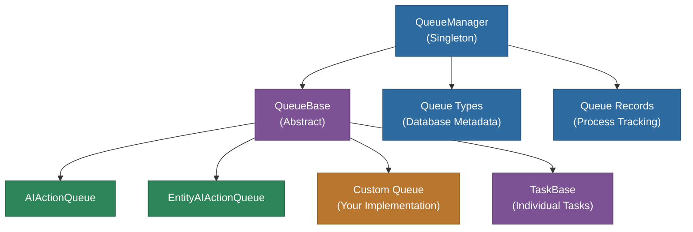
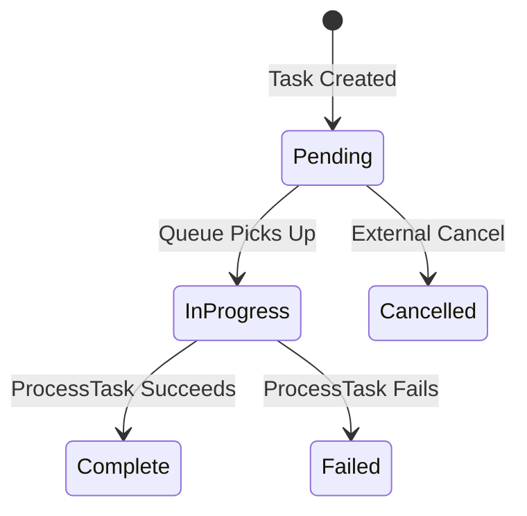
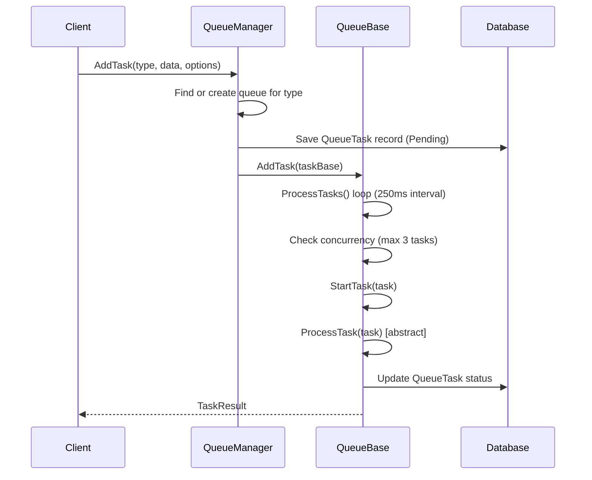

# @memberjunction/queue

A server-side queue management framework for MemberJunction applications that provides database-backed task persistence, concurrent processing, and heartbeat monitoring.

## Overview

The `@memberjunction/queue` package delivers a robust queuing system for background task processing. It manages task lifecycle from creation through execution, with automatic queue provisioning, configurable concurrency limits, and process-level health tracking.



## Installation

```bash
npm install @memberjunction/queue
```

## Architecture

### Task Lifecycle



### Processing Flow



## Core Components

### QueueManager

The `QueueManager` is a singleton that coordinates all active queues. It auto-creates queue instances per type and captures process-level metadata (PID, hostname, network interfaces) for monitoring.

```typescript
import { QueueManager } from '@memberjunction/queue';

// Initialize (typically at application startup)
await QueueManager.Config(contextUser);

// Add a task by queue type name
const task = await QueueManager.AddTask(
  'Email Notification',
  { recipient: 'user@example.com', subject: 'Welcome' },
  { priority: 1 },
  contextUser
);

if (task) {
  console.log(`Task created: ${task.ID}`);
}
```

### QueueBase

Abstract base class for all queue implementations. Subclasses implement `ProcessTask()` to define task execution logic.

```typescript
import { QueueBase, TaskBase, TaskResult } from '@memberjunction/queue';
import { RegisterClass } from '@memberjunction/global';
import { UserInfo } from '@memberjunction/core';

@RegisterClass(QueueBase, 'Email Notification')
export class EmailNotificationQueue extends QueueBase {
  protected async ProcessTask(
    task: TaskBase,
    contextUser: UserInfo
  ): Promise<TaskResult> {
    const { recipient, subject, body } = task.Data;
    await sendEmail(recipient, subject, body);
    return {
      success: true,
      userMessage: 'Email sent successfully',
      output: { sentAt: new Date() },
      exception: null
    };
  }
}
```

### TaskBase

Represents an individual task with its payload, options, and database-backed record.

| Property | Type | Description |
|----------|------|-------------|
| `ID` | `string` | Unique task identifier from database |
| `Status` | `TaskStatus` | Current status (Pending, InProgress, Complete, Failed, Cancelled) |
| `Data` | `object` | Task payload data |
| `Options` | `TaskOptions` | Configuration (e.g., priority) |
| `TaskRecord` | `QueueTaskEntity` | Underlying database entity |

### TaskResult

Returned by `ProcessTask()` to communicate outcome.

| Property | Type | Description |
|----------|------|-------------|
| `success` | `boolean` | Whether the task completed successfully |
| `userMessage` | `string` | Human-readable result message |
| `output` | `object` | Task output data |
| `exception` | `object` | Error details if failed |

## Built-in Queues

### AIActionQueue

Processes AI actions through the MemberJunction AI Engine.

```typescript
const task = await QueueManager.AddTask(
  'AI Action',
  { actionName: 'GenerateText', prompt: 'Summarize this document' },
  {},
  contextUser
);
```

### EntityAIActionQueue

Processes entity-specific AI actions.

```typescript
const task = await QueueManager.AddTask(
  'Entity AI Action',
  { entityName: 'Products', entityID: '123', actionName: 'GenerateDescription' },
  {},
  contextUser
);
```

## Configuration

Queue behavior is controlled through constructor parameters:

| Parameter | Default | Description |
|-----------|---------|-------------|
| `_maxTasks` | `3` | Maximum concurrent tasks per queue |
| `_checkInterval` | `250` | Polling interval in milliseconds |

## Database Schema

The queue system persists state across three tables:

| Table | Purpose |
|-------|---------|
| `__mj.QueueType` | Defines available queue types |
| `__mj.Queue` | Tracks active queue instances with process info and heartbeat |
| `__mj.QueueTask` | Stores individual tasks with status, data, and output |

## Dependencies

| Package | Purpose |
|---------|---------|
| `@memberjunction/core` | Entity management and metadata |
| `@memberjunction/global` | Class registration and global state |
| `@memberjunction/core-entities` | Queue and task entity types |
| `@memberjunction/ai` | AI functionality for built-in queues |
| `@memberjunction/aiengine` | AI Engine integration |

## License

ISC
