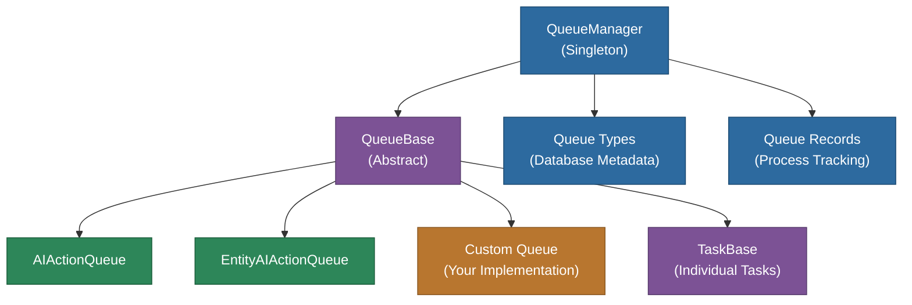
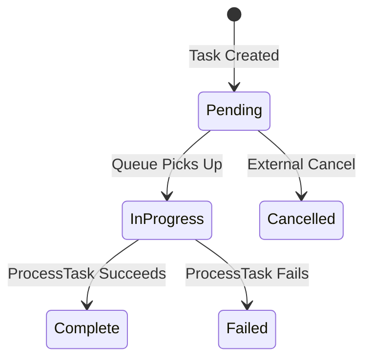
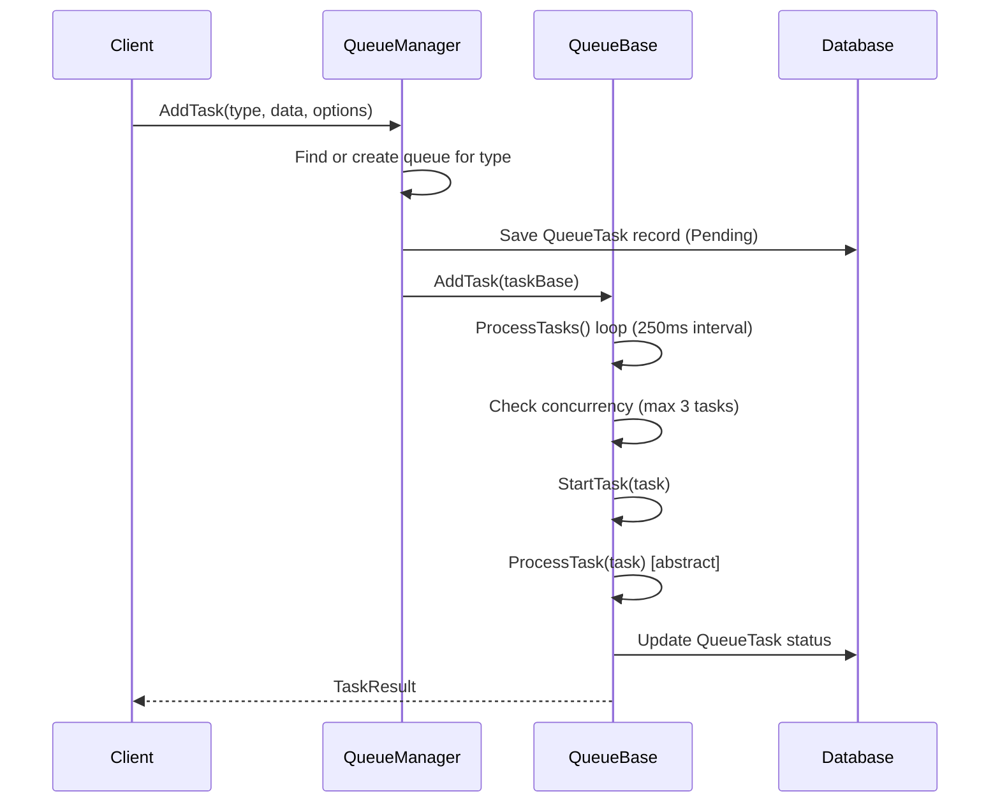

# @memberjunction/queue

A server-side queue management framework for MemberJunction applications that provides database-backed task persistence, concurrent processing, and heartbeat monitoring.

## Overview

The `@memberjunction/queue` package delivers a robust queuing system for background task processing. It manages task lifecycle from creation through execution, with automatic queue provisioning, configurable concurrency limits, and process-level health tracking.


```mermaid
graph TD
    A["QueueManager<br/>(Singleton)"] --> B["QueueBase<br/>(Abstract)"]
    B --> C["AIActionQueue"]
    B --> D["EntityAIActionQueue"]
    B --> E["Custom Queue<br/>(Your Implementation)"]

    A --> F["Queue Types<br/>(Database Metadata)"]
    A --> G["Queue Records<br/>(Process Tracking)"]
    B --> H["TaskBase<br/>(Individual Tasks)"]

    style A fill:#2d6a9f,stroke:#1a4971,color:#fff
    style B fill:#7c5295,stroke:#563a6b,color:#fff
    style C fill:#2d8659,stroke:#1a5c3a,color:#fff
    style D fill:#2d8659,stroke:#1a5c3a,color:#fff
    style E fill:#b8762f,stroke:#8a5722,color:#fff
    style F fill:#2d6a9f,stroke:#1a4971,color:#fff
    style G fill:#2d6a9f,stroke:#1a4971,color:#fff
    style H fill:#7c5295,stroke:#563a6b,color:#fff
```

## Installation

```bash
npm install @memberjunction/queue
```

## Architecture

### Task Lifecycle


```mermaid
stateDiagram-v2
    [*] --> Pending: Task Created
    Pending --> InProgress: Queue Picks Up
    InProgress --> Complete: ProcessTask Succeeds
    InProgress --> Failed: ProcessTask Fails
    Pending --> Cancelled: External Cancel
```

### Processing Flow


```mermaid
sequenceDiagram
    participant Client
    participant QM as QueueManager
    participant QB as QueueBase
    participant DB as Database

    Client->>QM: AddTask(type, data, options)
    QM->>QM: Find or create queue for type
    QM->>DB: Save QueueTask record (Pending)
    QM->>QB: AddTask(taskBase)
    QB->>QB: ProcessTasks() loop (250ms interval)
    QB->>QB: Check concurrency (max 3 tasks)
    QB->>QB: StartTask(task)
    QB->>QB: ProcessTask(task) [abstract]
    QB->>DB: Update QueueTask status
    QB-->>Client: TaskResult
```

## Core Components

### QueueManager

The `QueueManager` is a singleton that coordinates all active queues. It auto-creates queue instances per type and captures process-level metadata (PID, hostname, network interfaces) for monitoring.

```typescript
import { QueueManager } from '@memberjunction/queue';

// Initialize (typically at application startup)
await QueueManager.Config(contextUser);

// Add a task by queue type name
const task = await QueueManager.AddTask(
  'Email Notification',
  { recipient: 'user@example.com', subject: 'Welcome' },
  { priority: 1 },
  contextUser
);

if (task) {
  console.log(`Task created: ${task.ID}`);
}
```

### QueueBase

Abstract base class for all queue implementations. Subclasses implement `ProcessTask()` to define task execution logic.

```typescript
import { QueueBase, TaskBase, TaskResult } from '@memberjunction/queue';
import { RegisterClass } from '@memberjunction/global';
import { UserInfo } from '@memberjunction/core';

@RegisterClass(QueueBase, 'Email Notification')
export class EmailNotificationQueue extends QueueBase {
  protected async ProcessTask(
    task: TaskBase,
    contextUser: UserInfo
  ): Promise<TaskResult> {
    const { recipient, subject, body } = task.Data;
    await sendEmail(recipient, subject, body);
    return {
      success: true,
      userMessage: 'Email sent successfully',
      output: { sentAt: new Date() },
      exception: null
    };
  }
}
```

### TaskBase

Represents an individual task with its payload, options, and database-backed record.

| Property | Type | Description |
|----------|------|-------------|
| `ID` | `string` | Unique task identifier from database |
| `Status` | `TaskStatus` | Current status (Pending, InProgress, Complete, Failed, Cancelled) |
| `Data` | `object` | Task payload data |
| `Options` | `TaskOptions` | Configuration (e.g., priority) |
| `TaskRecord` | `QueueTaskEntity` | Underlying database entity |

### TaskResult

Returned by `ProcessTask()` to communicate outcome.

| Property | Type | Description |
|----------|------|-------------|
| `success` | `boolean` | Whether the task completed successfully |
| `userMessage` | `string` | Human-readable result message |
| `output` | `object` | Task output data |
| `exception` | `object` | Error details if failed |

## Built-in Queues

### AIActionQueue

Processes AI actions through the MemberJunction AI Engine.

```typescript
const task = await QueueManager.AddTask(
  'AI Action',
  { actionName: 'GenerateText', prompt: 'Summarize this document' },
  {},
  contextUser
);
```

### EntityAIActionQueue

Processes entity-specific AI actions.

```typescript
const task = await QueueManager.AddTask(
  'Entity AI Action',
  { entityName: 'Products', entityID: '123', actionName: 'GenerateDescription' },
  {},
  contextUser
);
```

## Configuration

Queue behavior is controlled through constructor parameters:

| Parameter | Default | Description |
|-----------|---------|-------------|
| `_maxTasks` | `3` | Maximum concurrent tasks per queue |
| `_checkInterval` | `250` | Polling interval in milliseconds |

## Database Schema

The queue system persists state across three tables:

| Table | Purpose |
|-------|---------|
| `__mj.QueueType` | Defines available queue types |
| `__mj.Queue` | Tracks active queue instances with process info and heartbeat |
| `__mj.QueueTask` | Stores individual tasks with status, data, and output |

## Durable processing on the work queue (opt-in)

Tasks added with `QueueManager.AddTask('<Queue Type>', data, options, user)` normally run on an in-memory queue in
the calling process, which is lost on restart. Each queue type can instead be routed to the durable work queue.

This package does **not** depend on the work queue. It exposes a seam, `LegacyQueueRouterRegistry`; the server
package `@memberjunction/work-queue-legacy-bridge` registers a router into it when `ServerBootstrap` imports it. A
process that never imports the bridge (CodeGen, MetadataSync, the CLI) has no router and runs every task in-process.

1. Set the work-queue topic `mjqueue.<queue type slug>` **and** its `MJQueue.LegacyQueueDriver` subscription to
   `Active`. Topics are seeded (Disabled) for the shipped types:

   | Queue type | Topic | Subscription |
   | --- | --- | --- |
   | `AI Action` | `mjqueue.ai-action` | `mjqueue.ai-action.legacy-driver` |
   | `Entity AI Action` | `mjqueue.entity-ai-action` | `mjqueue.entity-ai-action.legacy-driver` |

2. Run that subscription on at least one server: add it (or `'*'`) to `workQueue.subscriptions` in `mj.config.cjs`
   on an instance with the work-queue host enabled.

Once both topic and subscription are active, `AddTask` publishes `{ queueTypeName, data, options, userID }` to the
topic and returns `undefined` (there is no in-process `TaskBase`). The `MJQueue.LegacyQueueDriver` handler resolves
the `QueueBase` driver registered for the queue type and runs the task through `QueueBase.ExecuteTask` **as the user
who called `AddTask`**. A failed `TaskResult` is retried with the subscription's backoff and then dead-lettered; a
result marked `failureKind: 'Fatal'`, or a queue type with no registered driver, is dead-lettered immediately. Dead
letters are inspected and replayed with the work-queue operator commands (`mj queue dead-letters`, `mj queue replay`).

Routing falls back to the in-process queue when no router is registered, the topic is missing or not Active, no
subscription on it is Active or Paused, the task data is not plain JSON, or the publish is rejected.

`QueueBase.ProcessTask` has no cancellation parameter, so a routed task cannot be stopped mid-run by a work-queue
cancel or a lost lease; its outcome is simply discarded. Set the subscription's `LeaseSeconds` above the driver's
longest run.

Your own `QueueBase` drivers route the same way: create a topic named `LegacyQueueTopicName('<your type>')` (from
the bridge package) on the `Database` transport with a subscription whose `HandlerKey` is `MJQueue.LegacyQueueDriver`.
Queue type names that differ only in case or punctuation share one topic.

### Entity AI Action task data

Providers enqueue an `EntityAIActionTaskReference` (`entityName` + canonical `recordID`) rather than a live
`BaseEntity`. `EntityAIActionQueue` reloads the record when the task runs. If the record cannot be loaded the task
fails with `failureKind: 'RecordNotFound'`: in-process it is recorded as `Failed`; on the work queue it is retried
(PostgreSQL enqueues before its transaction commits) and, if still missing on the last attempt, completed with a
warning because the record was deleted.

## Dependencies

| Package | Purpose |
|---------|---------|
| `@memberjunction/core` | Entity management and metadata |
| `@memberjunction/global` | Class registration and global state |
| `@memberjunction/core-entities` | Queue and task entity types |
| `@memberjunction/ai` | AI functionality for built-in queues |
| `@memberjunction/aiengine` | AI Engine integration |

## License

Business Source License 1.1 — see [LICENSE](../../LICENSE) for details.
