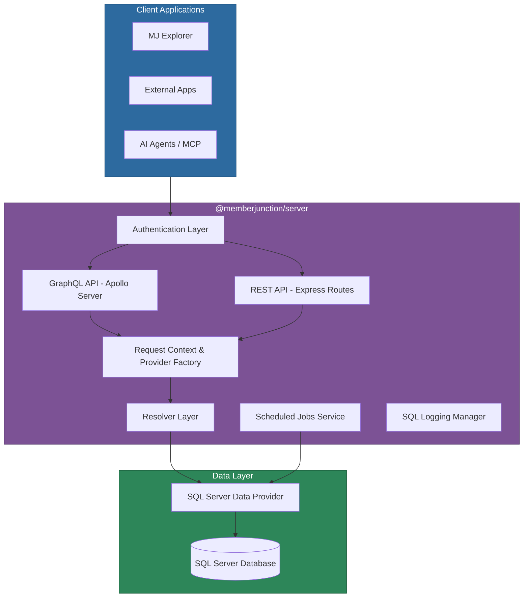
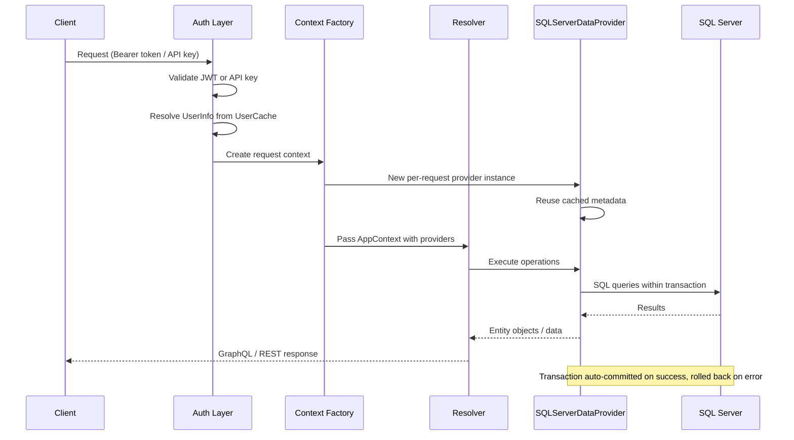
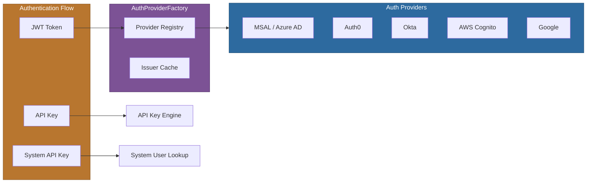
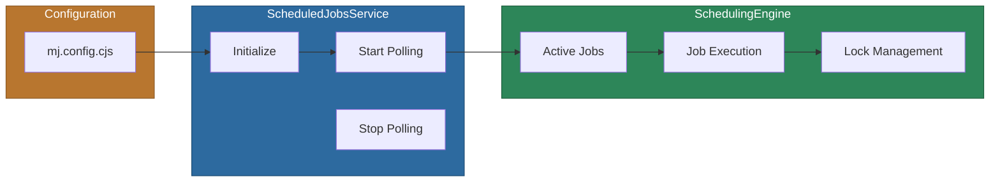

# @memberjunction/server

The MemberJunction server package provides the complete API server infrastructure for MemberJunction applications. It delivers both GraphQL and REST APIs with a unified authentication layer, per-request transaction isolation, pluggable authentication providers, scope-based API key authorization, scheduled job orchestration, SQL logging, and built-in AI operation endpoints. This package is the primary integration point between client applications and the MemberJunction data layer.

## Installation

```bash
npm install @memberjunction/server
```

## Overview

MJServer acts as the central API gateway for MemberJunction, sitting between client applications (MJExplorer, external integrations, AI agents) and the SQL Server database via the `@memberjunction/sqlserver-dataprovider`. It initializes database connections, loads entity metadata, builds a GraphQL schema from dynamically discovered resolver modules, optionally exposes a REST API, and manages the full request lifecycle including authentication, per-request provider isolation, and transaction management.



### Key Features

- **Dual API Support**: GraphQL (Apollo Server) and REST APIs with consistent authentication and authorization
- **Pluggable Authentication**: Support for Azure AD/Entra ID (MSAL), Auth0, Okta, AWS Cognito, and Google via the `IAuthProvider` interface
- **API Key Authorization**: User-level (`X-API-Key`) and system-level (`x-mj-api-key`) API keys with scope-based access control
- **Per-Request Provider Isolation**: Each GraphQL request receives its own `SQLServerDataProvider` instance for transaction safety
- **Multi-Database Support**: Separate read-write and read-only database connection pools
- **Transaction Management**: Automatic transaction wrapping for GraphQL mutations with savepoint support
- **Scheduled Jobs**: Built-in job scheduler with configurable polling, concurrency limits, and lock management
- **SQL Logging**: Real-time SQL statement capture with session management, user filtering, and migration-format output
- **AI Integration**: Resolvers for AI prompt execution, agent orchestration, text embeddings, and Skip AI
- **Real-time Support**: WebSocket subscriptions via `graphql-ws`
- **Response Compression**: Built-in gzip compression with configurable thresholds
- **Encryption Handling**: Transparent field-level encryption/decryption with configurable API exposure policies
- **CloudEvents**: Optional CloudEvent emission for entity lifecycle events
- **Telemetry**: Configurable server-side telemetry with multiple verbosity levels
- **Extensible Architecture**: Custom resolvers, entity subclasses, and new user handling via `@RegisterClass`
- **Server Extensions**: Plugin architecture for auto-discovering and loading extension modules (webhooks, messaging adapters, custom integrations) via `@RegisterClass` + `mj.config.cjs`

## Configuration

MJServer uses a layered configuration system with the following priority (highest to lowest):

1. Environment variables
2. `mj.config.cjs` file (discovered via [cosmiconfig](https://github.com/cosmiconfig/cosmiconfig))
3. `DEFAULT_SERVER_CONFIG` hardcoded defaults

### Environment Variables

| Variable | Description | Default |
|----------|-------------|---------|
| `DB_HOST` | Database server hostname | `localhost` |
| `DB_PORT` | Database server port | `1433` |
| `DB_DATABASE` | Database name | (required) |
| `DB_USERNAME` | Database username | (required) |
| `DB_PASSWORD` | Database password | (required) |
| `DB_READ_ONLY_USERNAME` | Read-only connection username | (optional) |
| `DB_READ_ONLY_PASSWORD` | Read-only connection password | (optional) |
| `DB_TRUST_SERVER_CERTIFICATE` | Trust self-signed certs | `false` |
| `DB_INSTANCE_NAME` | Named SQL Server instance | (optional) |
| `MJ_CORE_SCHEMA` | MJ metadata schema name | `__mj` |
| `GRAPHQL_PORT` | Server listen port | `4000` |
| `GRAPHQL_ROOT_PATH` | GraphQL endpoint path | `/` |
| `GRAPHQL_BASE_URL` | Server base URL | `http://localhost` |
| `MJAPI_PUBLIC_URL` | Public callback URL (e.g. ngrok) | (optional) |
| `ENABLE_INTROSPECTION` | Allow GraphQL introspection | `false` |
| `MJ_API_KEY` | System-level API key | (optional) |
| `TENANT_ID` | Azure AD tenant ID | (optional) |
| `WEB_CLIENT_ID` | Azure AD client ID | (optional) |
| `AUTH0_DOMAIN` | Auth0 domain | (optional) |
| `AUTH0_CLIENT_ID` | Auth0 client ID | (optional) |
| `AUTH0_CLIENT_SECRET` | Auth0 client secret | (optional) |
| `WEBSITE_RUN_FROM_PACKAGE` | Azure read-only filesystem flag | (optional) |
| `MJ_REST_API_ENABLED` | Enable/disable REST API | (from config) |
| `MJ_REST_API_INCLUDE_ENTITIES` | Comma-separated entity include list | (optional) |
| `MJ_REST_API_EXCLUDE_ENTITIES` | Comma-separated entity exclude list | (optional) |
| `MJ_TELEMETRY_ENABLED` | Enable server telemetry | `true` |
| `METADATA_CACHE_REFRESH_INTERVAL` | Metadata refresh interval (ms) | `180000` |

### Configuration File (`mj.config.cjs`)

```javascript
module.exports = {
  dbHost: 'myserver.database.windows.net',
  dbDatabase: 'MemberJunction',
  dbUsername: 'mj_user',
  dbPassword: 'secret',
  mjCoreSchema: '__mj',
  graphqlPort: 4000,

  userHandling: {
    autoCreateNewUsers: true,
    newUserLimitedToAuthorizedDomains: false,
    newUserRoles: ['UI', 'Developer'],
    contextUserForNewUserCreation: 'admin@example.com',
    CreateUserApplicationRecords: true,
  },

  databaseSettings: {
    connectionTimeout: 45000,
    requestTimeout: 30000,
    metadataCacheRefreshInterval: 180000,
    connectionPool: {
      max: 50,
      min: 5,
      idleTimeoutMillis: 30000,
      acquireTimeoutMillis: 30000,
    },
  },

  restApiOptions: {
    enabled: true,
    includeEntities: ['User*', 'Entity*'],
    excludeEntities: ['Password', 'APIKey*'],
    includeSchemas: ['public'],
    excludeSchemas: ['internal'],
  },

  scheduledJobs: {
    enabled: true,
    systemUserEmail: 'system@example.com',
    maxConcurrentJobs: 5,
  },

  sqlLogging: {
    enabled: true,
    allowedLogDirectory: './logs/sql',
    maxActiveSessions: 5,
    sessionTimeout: 3600000,
  },

  telemetry: {
    enabled: true,
    level: 'standard',  // 'minimal' | 'standard' | 'verbose' | 'debug'
  },
};
```

## Usage

### Basic Server Setup

Import the `serve` function and provide paths to your custom resolver modules. The server automatically includes its own built-in resolvers.

```typescript
import { serve } from '@memberjunction/server';
import { resolve } from 'node:path';

const localPath = (p: string) => resolve(__dirname, p);

const resolverPaths = [
  'resolvers/**/*Resolver.{js,ts}',
  'generic/*Resolver.{js,ts}',
  'generated/generated.ts',
];

serve(resolverPaths.map(localPath));
```

### Advanced Server Options

The `serve` function accepts an optional `MJServerOptions` object for lifecycle hooks and REST API overrides.

```typescript
import { serve, createApp, MJServerOptions } from '@memberjunction/server';

const options: MJServerOptions = {
  onBeforeServe: async () => {
    // Custom initialization after schema is built, before HTTP listen
    console.log('Server is about to start...');
  },
  restApiOptions: {
    enabled: true,
    includeEntities: ['User*', 'Entity*'],
    excludeEntities: ['Password', 'APIKey*'],
  },
};

serve(resolverPaths.map(localPath), createApp(), options);
```

### Custom New User Handling

Override the default new user creation behavior by subclassing `NewUserBase` and registering it with a higher priority.

```typescript
import { RegisterClass } from '@memberjunction/global';
import { NewUserBase } from '@memberjunction/server';

@RegisterClass(NewUserBase, undefined, 1)
export class CustomNewUserHandler extends NewUserBase {
  public override async createNewUser(
    firstName: string,
    lastName: string,
    email: string
  ) {
    // Custom logic: create linked records, assign roles, etc.
    return super.createNewUser(firstName, lastName, email, 'Other');
  }
}
```

Import the file before calling `serve` to ensure registration:

```typescript
import './auth/customNewUserHandler';
import { serve } from '@memberjunction/server';
// ...
serve(resolverPaths);
```

## Architecture

### Request Lifecycle



### Per-Request Provider Isolation

Each GraphQL request receives its own `SQLServerDataProvider` instance, ensuring complete transaction isolation between concurrent requests. Metadata is cached and reused across providers for efficiency.

```typescript
// Automatically created per request in context.ts:
const provider = new SQLServerDataProvider();
await provider.Config({
  connectionPool: pool,
  MJCoreSchemaName: '__mj',
  ignoreExistingMetadata: false,  // Reuse cached metadata
});

// Included in AppContext for resolvers:
context.providers = [
  { provider: readWriteProvider, type: 'Read-Write' },
  { provider: readOnlyProvider, type: 'Read-Only' },  // if configured
];
```

### Authentication Architecture

MJServer uses a pluggable authentication provider system built on the `IAuthProvider` interface and `AuthProviderFactory`.



Providers are registered via `@RegisterClass(BaseAuthProvider, 'type-key')` and automatically discovered at startup. Each provider implements:

- `validateConfig()` -- Validates required configuration
- `getSigningKey()` -- Retrieves JWKS signing keys with retry logic
- `extractUserInfo()` -- Extracts email, name from provider-specific JWT claims
- `matchesIssuer()` -- Matches JWT `iss` claim to the provider

Configure providers in `mj.config.cjs` under `authProviders` or via environment variables (see Configuration section).

### API Key Authentication

The server supports two types of API key authentication:

**User API Keys** (`X-API-Key` header, `mj_sk_*` format):
- Authenticate as a specific user
- Support expiration dates and individual revocation
- Subject to scope-based authorization
- Usage is logged for audit

**System API Key** (`x-mj-api-key` header):
- Single shared key set via `MJ_API_KEY` environment variable
- Authenticates as the system user with elevated privileges
- Used for server-to-server communication

### Scope-Based Authorization

API keys are subject to a two-level scope evaluation: the application ceiling (maximum allowed scopes for MJAPI, MCP Server, etc.) and the individual key's assigned scopes.

| Scope | Description |
|-------|-------------|
| `full_access` | Bypass all scope checks |
| `entity:read` | Read entity records |
| `entity:create` | Create records |
| `entity:update` | Update records |
| `entity:delete` | Delete records |
| `view:run` | Execute RunView queries |
| `agent:execute` | Execute AI agents |
| `agent:monitor` | Check agent run status |
| `action:execute` | Execute MJ Actions |
| `prompt:execute` | Execute AI prompts |
| `query:run` | Execute queries |
| `metadata:entities:read` | Read entity metadata |
| `metadata:agents:read` | Read agent metadata |
| `communication:send` | Send emails/messages |

Add scope checks to custom resolvers:

```typescript
import { ResolverBase } from '@memberjunction/server';

@Resolver()
export class MyResolver extends ResolverBase {
  @Mutation(() => MyResult)
  async myOperation(@Ctx() ctx: AppContext): Promise<MyResult> {
    // Checks scope for API key auth; no-op for JWT auth
    await this.CheckAPIKeyScopeAuthorization('my:scope', 'resource-name', ctx.userPayload);
    // Proceed with operation...
  }
}
```

Alternatively, use the standalone utility functions:

```typescript
import { CheckAPIKeyScope, RequireScope } from '@memberjunction/server';

// Standalone function
await CheckAPIKeyScope(ctx.userPayload.apiKeyId, 'view:run', ctx.userPayload.userRecord, {
  resource: 'Users',
});

// Pre-built scope checker
const requireViewRun = RequireScope('view:run');
await requireViewRun(ctx);
```

## GraphQL API

### Custom Directives

- **`@RequireSystemUser`**: Restricts a field or mutation to system-user-only access. Applied at the schema level; non-system users receive an `AuthorizationError`.
- **`@Public`**: Marks a field as publicly accessible without authentication. All other fields require an active, authenticated user by default.

### Built-in Resolvers

The server includes resolvers for the following domains:

| Resolver | Operations |
|----------|------------|
| `EntityResolver` | CRUD operations for all entities |
| `RunViewResolver` | RunView by ID, name, or dynamic entity |
| `RunAIPromptResolver` | Execute AI prompts, simple prompts, text embeddings |
| `RunAIAgentResolver` | Execute AI agents with session and streaming support |
| `ActionResolver` | Execute MJ Actions |
| `QueryResolver` | Execute and create saved queries |
| `AdhocQueryResolver` | Execute ad-hoc SQL queries (SELECT/WITH only, read-only connection) |
| `ReportResolver` | Run and manage reports |
| `DatasetResolver` | Dataset operations |
| `UserViewResolver` | User view management |
| `UserResolver` | User profile operations |
| `UserFavoriteResolver` | Favorite record management |
| `MergeRecordsResolver` | Record merge operations |
| `SyncDataResolver` / `SyncRolesUsersResolver` | Data synchronization |
| `FileResolver` / `FileCategoryResolver` | File and category management |
| `EntityCommunicationsResolver` | Entity-level communications |
| `EntityRecordNameResolver` | Record name resolution |
| `TransactionGroupResolver` | Transaction group management |
| `ComponentRegistryResolver` | Component registry queries |
| `MCPResolver` | MCP server operations |
| `APIKeyResolver` | API key management |
| `SqlLoggingConfigResolver` | SQL logging session management |
| `TelemetryResolver` | Server telemetry queries |
| `ColorResolver` | Color palette operations |
| `InfoResolver` | Server info queries |
| `PotentialDuplicateRecordResolver` | Duplicate detection |
| `RunTestResolver` | Test execution |
| `RunTemplateResolver` | Template execution |
| `TaskResolver` | Task orchestration |

### Transaction Management

GraphQL mutations are automatically wrapped in transactions through the per-request provider:

```graphql
mutation {
  CreateUser(input: { FirstName: "John", LastName: "Doe" }) { ID }
  CreateUserRole(input: { UserID: "...", RoleID: "..." }) { ID }
}
# Both operations execute within the same provider's transaction scope.
# Success: both committed together. Error: both rolled back.
```

### WebSocket Subscriptions

Real-time updates are supported via WebSocket at the same path as the GraphQL endpoint:

```typescript
// Server-side: already configured
const webSocketServer = new WebSocketServer({
  server: httpServer,
  path: graphqlRootPath,
});
```

### ResolverBase

All built-in resolvers extend `ResolverBase`, which provides:

| Method | Description |
|--------|-------------|
| `CreateRecord()` | Create entity with before/after hooks |
| `UpdateRecord()` | Update with optimistic concurrency detection |
| `DeleteRecord()` | Delete with before/after hooks |
| `RunViewByIDGeneric()` | Execute a saved view by ID |
| `RunViewByNameGeneric()` | Execute a saved view by name |
| `RunDynamicViewGeneric()` | Execute an ad-hoc view on an entity |
| `RunViewsGeneric()` | Batch-execute multiple views |
| `CheckUserReadPermissions()` | Validate entity-level read access |
| `CheckAPIKeyScopeAuthorization()` | Validate API key scope |
| `MapFieldNamesToCodeNames()` | Map field names for GraphQL transport |
| `FilterEncryptedFieldsForAPI()` | Handle encryption policy for API responses |
| `EmitCloudEvent()` | Emit CloudEvents for entity lifecycle |
| `ListenForEntityMessages()` | Subscribe to entity event messages |
| `BeforeCreate()` / `AfterCreate()` | Lifecycle hooks for create |
| `BeforeUpdate()` / `AfterUpdate()` | Lifecycle hooks for update |
| `BeforeDelete()` / `AfterDelete()` | Lifecycle hooks for delete |

## REST API

In addition to GraphQL, MJServer provides a REST API at `/api/v1/`. By default it is disabled and can be enabled via configuration.

For comprehensive REST API documentation including endpoints, security configuration, wildcard filtering, and examples, see [REST_API.md](./REST_API.md).

Key endpoints:

| Endpoint | Method | Description |
|----------|--------|-------------|
| `/api/v1/entities/:entityName` | GET | List entity records |
| `/api/v1/entities/:entityName` | POST | Create a record |
| `/api/v1/entities/:entityName/:id` | GET | Get a record by ID |
| `/api/v1/entities/:entityName/:id` | PUT | Update a record |
| `/api/v1/entities/:entityName/:id` | DELETE | Delete a record |
| `/api/v1/views/:entityName` | POST | Run a view |
| `/api/v1/views/batch` | POST | Batch view execution |
| `/api/v1/metadata/entities` | GET | List entity metadata |
| `/api/v1/users/current` | GET | Get current user |

## SQL Logging

The server includes a runtime SQL logging system for debugging and migration generation. Requires `Owner`-level user privileges.

```graphql
# Start a logging session
mutation {
  startSqlLogging(input: {
    fileName: "debug-session.sql"
    filterToCurrentUser: true
    options: {
      sessionName: "Debug Session"
      prettyPrint: true
      statementTypes: "both"
      formatAsMigration: false
    }
  }) {
    id
    filePath
    sessionName
  }
}

# Query active sessions
query {
  activeSqlLoggingSessions {
    id
    sessionName
    statementCount
  }
}

# Stop a session
mutation {
  stopSqlLogging(sessionId: "session-id")
}
```

Configuration in `mj.config.cjs`:

```javascript
sqlLogging: {
  enabled: true,
  allowedLogDirectory: './logs/sql',
  maxActiveSessions: 5,
  sessionTimeout: 3600000,
  autoCleanupEmptyFiles: true,
  defaultOptions: {
    formatAsMigration: false,
    statementTypes: 'both',  // 'queries' | 'mutations' | 'both'
    prettyPrint: true,
    logRecordChangeMetadata: false,
  },
}
```

## Scheduled Jobs

MJServer integrates with the `@memberjunction/scheduling-engine` to execute scheduled jobs defined in MemberJunction metadata.



Configuration:

```javascript
scheduledJobs: {
  enabled: true,
  systemUserEmail: 'system@example.com',
  maxConcurrentJobs: 5,
  defaultLockTimeout: 600000,    // 10 minutes
  staleLockCleanupInterval: 300000, // 5 minutes
}
```

The service starts automatically during server initialization and shuts down gracefully on SIGTERM/SIGINT.

## AI Integration

### AI Prompt Execution

```graphql
mutation {
  RunAIPrompt(input: {
    PromptName: "Summarize Content"
    ModelID: "model-guid"
    Temperature: 0.7
    Messages: [{ role: "user", content: "Summarize this article..." }]
  }) {
    Success
    Result
    TokenUsage { InputTokens OutputTokens }
  }
}
```

### Simple Prompt Execution

```graphql
mutation {
  ExecuteSimplePrompt(input: {
    SystemPrompt: "You are a helpful assistant."
    UserMessage: "What is MemberJunction?"
    ModelPowerLevel: "Standard"
  }) {
    Success
    Result
  }
}
```

### Text Embeddings

```graphql
mutation {
  EmbedText(input: {
    Texts: ["Hello world", "MemberJunction framework"]
    ModelSize: "small"
  }) {
    Success
    Embeddings
    Dimensions
    Model
  }
}
```

### AI Agent Execution

```graphql
mutation {
  RunAIAgent(input: {
    AgentID: "agent-guid"
    SessionID: "session-guid"
    UserMessage: "Find all active users"
  }) {
    Success
    Result
    SessionID
  }
}
```

All AI operations have system-user variants (e.g., `RunAIPromptSystemUser`) that use the `@RequireSystemUser` directive for server-to-server operations.

## API Reference

### Core Exports

#### Server Functions

| Export | Description |
|--------|-------------|
| `serve(resolverPaths, app?, options?)` | Main server initialization function |
| `createApp()` | Creates a new Express application instance |

#### Types

| Export | Description |
|--------|-------------|
| `AppContext` | GraphQL resolver context type |
| `UserPayload` | Authenticated user payload |
| `DataSourceInfo` | Database connection descriptor |
| `ProviderInfo` | Per-request provider descriptor |
| `MJServerOptions` | Options for `serve()` |
| `ConfigInfo` | Full server configuration type |
| `MJServerEvent` | Server lifecycle event type |

#### Authentication

| Export | Description |
|--------|-------------|
| `IAuthProvider` | Authentication provider interface |
| `AuthProviderFactory` | Provider registry and factory |
| `NewUserBase` | Base class for custom new user handling |
| `TokenExpiredError` | Token expiration error class |
| `getSystemUser(dataSource?)` | Retrieve the system user |
| `getSigningKeys(issuer)` | Get JWT signing keys for an issuer |
| `extractUserInfoFromPayload(payload)` | Extract user info from JWT claims |
| `verifyUserRecord(email, ...)` | Verify and optionally create a user record |

#### Scope Authorization

| Export | Description |
|--------|-------------|
| `CheckAPIKeyScope(apiKeyId, scopePath, contextUser, options?)` | Check API key scope |
| `CheckAPIKeyScopeAndLog(apiKeyId, scopePath, contextUser, usageDetails, options?)` | Check scope with usage logging |
| `RequireScope(scopePath, options?)` | Create a reusable scope checker |
| `RequireViewRun` | Pre-built scope checker for `view:run` |
| `RequireQueryRun` | Pre-built scope checker for `query:run` |
| `RequireAgentExecute` | Pre-built scope checker for `agent:execute` |

#### Resolver Base Classes

| Export | Description |
|--------|-------------|
| `ResolverBase` | Base class for all resolvers |
| `RunViewResolver` | Base resolver for view operations |
| `PushStatusResolver` | Status update resolver with pub/sub |

#### Utility Functions

| Export | Description |
|--------|-------------|
| `GetReadOnlyDataSource(dataSources, options?)` | Get read-only connection pool |
| `GetReadWriteDataSource(dataSources)` | Get read-write connection pool |
| `GetReadOnlyProvider(providers, options?)` | Get read-only provider instance |
| `GetReadWriteProvider(providers, options?)` | Get read-write provider instance |

#### GraphQL Inputs

| Export | Description |
|--------|-------------|
| `KeyValuePairInput` | Generic key-value input type |
| `DeleteOptionsInput` | Delete operation options |

#### Directives

| Export | Description |
|--------|-------------|
| `RequireSystemUser` | Decorator restricting access to system users |
| `Public` | Decorator marking endpoints as publicly accessible |
| `configInfo` | Parsed server configuration singleton |
| `DEFAULT_SERVER_CONFIG` | Default configuration values |

## Performance

### Response Compression

Responses larger than 1KB are automatically compressed using gzip at compression level 6. Binary content types (images, video, audio) are excluded.

### Connection Pooling

Database connections are managed via `mssql` connection pools. Configure pool size in `databaseSettings.connectionPool`:

```javascript
connectionPool: {
  max: 50,      // Maximum connections
  min: 5,       // Minimum connections
  idleTimeoutMillis: 30000,
  acquireTimeoutMillis: 30000,
}
```

**Recommended settings:**
- Development: `max: 10, min: 2`
- Production: `max: 50, min: 5`
- High load: `max: 100, min: 10`

### Metadata Caching

Entity metadata is loaded once at startup and shared across all per-request provider instances. The cache refresh interval is configurable:

```javascript
databaseSettings: {
  metadataCacheRefreshInterval: 180000,  // 3 minutes
}
```

### Authentication Token Caching

Validated JWT tokens are cached using an LRU cache, avoiding repeated cryptographic verification for the same token within its lifetime.

## Server Extensions

MJServer supports a plugin architecture that enables auto-discovery and lifecycle management of extension modules. Extensions register Express routes, handle their own authentication, and participate in health checks and graceful shutdown — all without modifying MJServer source code.

### How It Works

1. Extensions implement `BaseServerExtension` from `@memberjunction/server-extensions-core`
2. Extensions register via `@RegisterClass(BaseServerExtension, 'DriverClassName')`
3. Configuration in `mj.config.cjs` defines which extensions to load
4. MJServer's `ServerExtensionLoader` discovers and initializes all enabled extensions at startup

### Configuration

```javascript
// mj.config.cjs
module.exports = {
    serverExtensions: [
        {
            Enabled: true,
            DriverClass: 'SlackMessagingExtension',
            RootPath: '/webhook/slack',
            Settings: {
                AgentID: 'your-agent-guid',
                BotToken: process.env.SLACK_BOT_TOKEN,
                SigningSecret: process.env.SLACK_SIGNING_SECRET,
            }
        },
        {
            Enabled: true,
            DriverClass: 'TeamsMessagingExtension',
            RootPath: '/webhook/teams',
            Settings: {
                AgentID: 'your-agent-guid',
                MicrosoftAppId: process.env.MICROSOFT_APP_ID,
                MicrosoftAppPassword: process.env.MICROSOFT_APP_PASSWORD,
            }
        }
    ]
};
```

### Health Monitoring

MJServer exposes an aggregate health check endpoint for all loaded extensions:

```
GET /health/extensions
```

Returns `200` when all extensions are healthy, `503` when any extension reports unhealthy.

### Available Extensions

| Package | Extensions | Description |
|---------|-----------|-------------|
| [`@memberjunction/messaging-adapters`](../MessagingAdapters/) | `SlackMessagingExtension`, `TeamsMessagingExtension` | Slack & Teams integration for MJ AI agents |

### Creating Custom Extensions

See [`@memberjunction/server-extensions-core`](../ServerExtensionsCore/) for documentation on building custom extensions.

## Graceful Shutdown

The server registers handlers for `SIGTERM` and `SIGINT` to:

1. Shut down all server extensions (in reverse order of loading)
2. Stop the scheduled jobs service
3. Close the HTTP server
4. Force-exit after a 10-second timeout if graceful shutdown stalls

Unhandled promise rejections are caught and logged without crashing the server.

## Dependencies

### Core MemberJunction Packages

| Package | Purpose |
|---------|---------|
| [@memberjunction/core](../MJCore/README.md) | Core metadata, entities, RunView |
| [@memberjunction/core-entities](../MJCoreEntities/README.md) | Generated entity classes |
| [@memberjunction/global](../MJGlobal/README.md) | ClassFactory, event system |
| [@memberjunction/sqlserver-dataprovider](../SQLServerDataProvider/README.md) | SQL Server data provider |
| [@memberjunction/graphql-dataprovider](../GraphQLDataProvider/README.md) | GraphQL field mapping |
| [@memberjunction/config](../Config/README.md) | Configuration utilities |
| [@memberjunction/api-keys](../APIKeys/README.md) | API key engine and scope evaluation |
| [@memberjunction/encryption](../Encryption/README.md) | Field-level encryption engine |

### AI Packages

| Package | Purpose |
|---------|---------|
| [@memberjunction/ai](../AI/README.md) | AI engine abstraction |
| [@memberjunction/ai-prompts](../AI/Prompts/README.md) | AI prompt execution |
| [@memberjunction/ai-agents](../AI/Agents/README.md) | AI agent framework |
| [@memberjunction/ai-core-plus](../AI/CorePlus/README.md) | AI prompt parameters |
| [@memberjunction/aiengine](../AIEngine/README.md) | AI engine orchestration |
| [@memberjunction/ai-provider-bundle](../AI/ProviderBundle/README.md) | Bundled AI providers |

### Infrastructure Packages

| Package | Purpose |
|---------|---------|
| [@memberjunction/scheduling-engine](../SchedulingEngine/README.md) | Scheduled job execution |
| [@memberjunction/actions](../Actions/README.md) | Action framework |
| [@memberjunction/templates](../Templates/README.md) | Template engine |
| [@memberjunction/notifications](../Notifications/README.md) | Notification system |
| [@memberjunction/storage](../Storage/README.md) | File storage |
| [@memberjunction/communication-ms-graph](../Communication/providers/MSGraphProvider/README.md) | MS Graph communications |
| [@memberjunction/communication-sendgrid](../Communication/providers/SendGridProvider/README.md) | SendGrid communications |

### Third-Party Dependencies

| Package | Purpose |
|---------|---------|
| `@apollo/server` | GraphQL server |
| `express` | HTTP framework |
| `type-graphql` | TypeScript GraphQL decorators |
| `mssql` | SQL Server client |
| `jsonwebtoken` / `jwks-rsa` | JWT verification |
| `graphql-ws` / `ws` | WebSocket subscriptions |
| `compression` | Response compression |
| `cosmiconfig` | Configuration file discovery |
| `cloudevents` | CloudEvent emission |
| `zod` | Configuration schema validation |

## Related Packages

- [@memberjunction/server-bootstrap](../ServerBootstrap/README.md) -- Pre-built class registration manifest for tree-shaking prevention
- [MJAPI](../../MJAPI/README.md) -- Reference server application that consumes this package
- [@memberjunction/core](../MJCore/README.md) -- Core framework that MJServer exposes via API

## Troubleshooting

| Issue | Solution |
|-------|----------|
| Authentication errors | Verify environment variables for your auth provider are set |
| Database connection failures | Check `DB_HOST`, `DB_PORT`, `DB_USERNAME`, `DB_PASSWORD` |
| No resolvers found | Verify resolver paths passed to `serve()` are absolute and use correct glob patterns |
| Transaction errors | Review mutation logic; check that entity operations are within the per-request provider |
| SQL logging access denied | Ensure user has `Type = 'Owner'` in the Users table |
| Metadata not loading | Check `MJ_CORE_SCHEMA` matches your database schema name |
| Token expired errors | Expected behavior for long-lived sessions; client should refresh tokens |

Enable verbose logging:

```bash
DEBUG=mj:*
NODE_ENV=development
```

## Contributing

See the [MemberJunction Contributing Guide](../../CONTRIBUTING.md) for development setup and guidelines.
