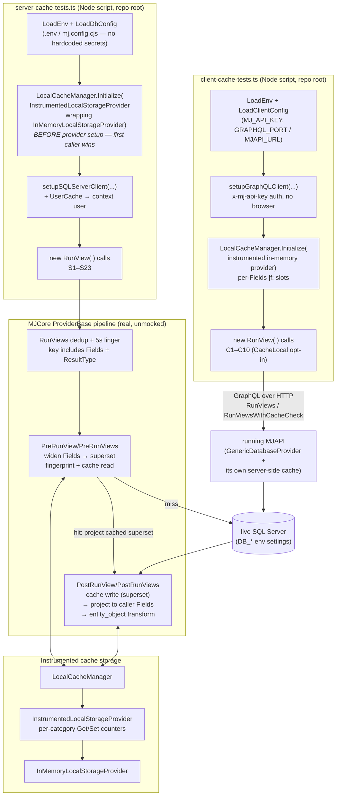
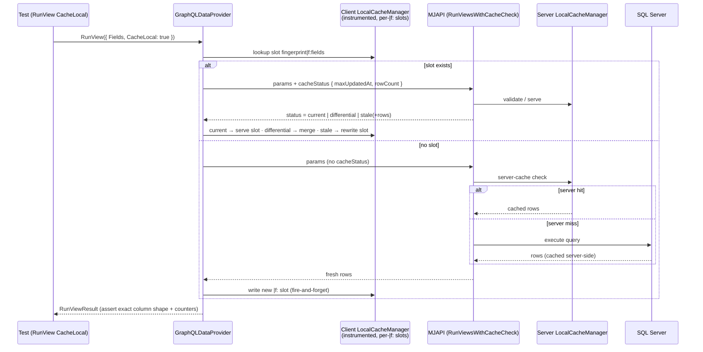

# RunView Caching — Live Integration Test Scripts

Live, end-to-end integration tests for MemberJunction's RunView caching pipeline, exercising
the **real** server componentry (SQLServerDataProvider against live SQL Server) and the
**real** client componentry (GraphQLDataProvider against a running MJAPI) — the exact same
code paths MJAPI and MJExplorer run in production, just bootstrapped from Node scripts.

This sits **between** the unit-test layer (mocked providers, vitest) and the full
browser-driven regression suite: real database, real GraphQL transport, real cache
managers — but scripted, fast (~10s server / ~25s client), and assertion-precise. It
tests the **seams between packages** that unit tests mock away and browser tests
traverse but cannot assert (a browser test never notices a 2-column cached payload,
and it can't count cache reads).

## Contents

| File | Purpose |
|---|---|
| `server-cache-tests.ts` | 23 tests against SQLServerDataProvider (`TrustLocalCacheCompletely = true`) |
| `client-cache-tests.ts` | 10 tests against a running MJAPI via GraphQLDataProvider (`TrustLocalCacheCompletely = false`) |
| `lib/harness.ts` | Env/config loading, minimal test runner, shape assertions, instrumented storage provider |

---

## The design under test (30-second refresher)

MJ's RunView cache stores **one full-width superset per entity+filter** and projects
per-caller on every read:

- The **server cache fingerprint** deliberately *excludes* `Fields` and `ResultType` —
  when a query is cacheable, `params.Fields` is widened to ALL entity fields before the
  DB hit, so a single cache entry can satisfy any future field subset.
- **Projection** (`ProjectRowsToFields`) restores the caller's requested shape on cache
  **hits** (filtering the cached superset) AND on cache **misses** (filtering the widened
  DB result) — identical shapes regardless of cache temperature.
- **PK contract**: explicitly requested `Fields` ALWAYS include the entity's primary
  key(s) — on every path (cached, non-cached, smart-cache, differential). Differential
  merges and entity linking depend on the PK, and the direct SQL path always included it.
- The **dedup/linger key** (in-flight request sharing + 5s linger window) *includes*
  `Fields` and `ResultType`, because the dedup layer shares the FINAL pipeline output —
  rows already projected and transformed for one caller.
- The **client cache fingerprint** appends `|f:<normalized fields>` — the client never
  widens (narrow wire payloads are the point) and never projects on read, so each field
  subset gets its own exact-match slot.

| Layer | Keyed by Fields? | Why |
|---|---|---|
| Server cache fingerprint | No | Stores full-width superset; projects per-read |
| Dedup / linger key | **Yes** (+ ResultType) | Shares post-projection output verbatim |
| Client cache fingerprint | **Yes** (`\|f:` suffix) | Stores rows as returned; no projection on read |

These suites verify every row of that table against the live stack.

---

## How it works

### Architecture



### Client smart-cache round trip (what `CacheLocal: true` does)



### The two proof techniques

**1. `UniqueFilter(column, tag)`** — every test that needs a guaranteed-cold cache entry
uses an always-true filter that is textually unique per tag
(`Name <> 'zzz-cache-test-<tag>'`). `ExtraFilter` is part of the fingerprint, so each tag
yields a fresh entry while matching the same rows — cold-cache determinism with **zero
data mutation**.

**2. `InstrumentedLocalStorageProvider`** — wraps the real in-memory storage with
per-category Get/Set counters. Tests don't guess whether the cache was used; they prove
it: a miss shows a `RunViewCache` write, a hit shows none, a linger-served dedup result
shows **zero storage traffic at all**, and `BypassCache` must leave the counters
untouched. Counters are scoped per category because `LocalCacheManager` also persists
its registry index asynchronously in a different category.

---

## Test inventory

### Server suite (S1–S23)

| # | Verifies |
|---|---|
| S1 | Cold miss with narrow `Fields` returns ONLY requested columns + writes the cache |
| S2 | Hit returns the identical shape (miss/hit symmetry — the original defect) + `ExecutionTime: 0` |
| S3 | A different field subset is served from the same superset entry, no rewrite |
| S4 | No `Fields` → full entity width (pass-through) |
| S5 | Case-insensitive field matching; original column casing preserved |
| S6 | `entity_object` results are full `BaseEntity` instances even from a cached superset |
| S7 | `BypassCache` skips cache read AND write, narrow fields end-to-end |
| S8 | `TotalRowCount` parity across miss/hit |
| S9 | Batch `RunViews`: each result projected to its OWN param's fields |
| S10 | Mixed hit+miss batch: warm index from cache, cold index from DB, both correct |
| S11 | Linger-window callers with different `Fields` get their own shapes (dedup key regression) |
| S12 | Linger-window callers with different `ResultType` get their own representations |
| S13 | Identical repeat in the linger window is served with zero storage traffic |
| S14 | Different `ExtraFilter` values fingerprint independently |
| S15 | `OrderBy` honored on miss and hit |
| S16 | `MaxRows` limits rows and fingerprints separately from the unlimited query |
| S17 | *(gated)* Save invalidates filtered entries; delete removes the row |
| S18 | AfterKey keyset pages never touch the cache and never poison the entity+filter slot |
| S19 | `count_only` returns `TotalRowCount` with zero rows and never poisons the row cache |
| S20 | Poisoning regression: full-width query after a narrow `BypassCache` stays full-width |
| S21 | `entity_object` ignores narrow `Fields` — instances always carry the full field set |
| S22 | Concurrent identical `RunViews` share one execution (at most one cache write) |
| S23 | *(gated)* Unfiltered auto-maintained cache upserts on save / removes on delete IN PLACE — post-mutation reads still served from cache with zero DB hits |

### Client suite (C1–C10)

| # | Verifies |
|---|---|
| C1 | Narrow `Fields` shape survives the GraphQL transport end-to-end (no CacheLocal) |
| C2 | Server miss/hit symmetry over the wire (second call past the linger window) |
| C3 | `CacheLocal` miss writes a client slot; repeat validates `current` and serves locally |
| C4 | Different subset gets its OWN `\|f:` slot — no cross-subset serving |
| C5 | Full-width (`'*'`) request is not satisfied by a narrow slot |
| C6 | `entity_object` materializes as `BaseEntity` client-side, including from cache |
| C7 | Client dedup keying: different `Fields` in the linger window get their own shapes |
| C8 | Mixed-CacheLocal batch projects each result to its own param |
| C9 | `count_only` works over the GraphQL transport (TotalRowCount, zero rows, no poisoning) |
| C10 | *(gated)* Client slot save→revalidate→delete→revalidate round trip (differential/stale refresh) |

---

## Running

Both scripts run from the **repo root** (cwd-relative `.env` / `mj.config.cjs`):

```bash
# Server-side suite — needs only the database
npx tsx packages/MJServer/integration-test-scripts/server-cache-tests.ts

# Server-side suite including the save/delete invalidation test
# (creates + deletes ONE "MJ: User Settings" row for the context user)
RUN_MUTATION_TESTS=1 npx tsx packages/MJServer/integration-test-scripts/server-cache-tests.ts

# Client-side suite — needs MJAPI running (cd packages/MJAPI && npm run start)
npx tsx packages/MJServer/integration-test-scripts/client-cache-tests.ts
```

Exit codes: `0` all passed · `1` failures · `2` bootstrap/connectivity error.

These scripts are **not** part of the MJServer build (its tsconfig includes `./src` only)
and have no package.json footprint — they resolve workspace packages through the monorepo
root `node_modules` and run directly via `tsx`.

### Environment variables used (all looked up, never hardcoded)

| Variable | Used by | Meaning |
|---|---|---|
| `DB_HOST` / `DB_PORT` / `DB_USERNAME` / `DB_PASSWORD` / `DB_DATABASE` | server suite | SQL Server connection (`mj.config.cjs` `databaseSettings` takes precedence) |
| `MJ_TEST_USER_EMAIL` | server suite | Optional context-user override (defaults to the Owner-type user) |
| `MJ_API_KEY` | client suite | System API key MJAPI accepts via `x-mj-api-key` |
| `GRAPHQL_PORT` / `GRAPHQL_ROOT_PATH` / `MJAPI_URL` | client suite | Endpoint resolution; `MJAPI_URL` overrides the composed localhost URL |
| `RUN_MUTATION_TESTS` | server suite | `1` enables the save/delete invalidation test |

---

## Bugs this suite found — all FIXED and re-verified live (2026-06-11)

The suite found three product bugs on its first day; all three are fixed on this branch
and the once-red tests are now green regression guards.

1. **S7/S20 — BypassCache cache poisoning (FIXED).** `PostRunViews`' cache-write gate
   omitted `BypassCache`/`AfterKey`, so server-side `RunView({BypassCache:true})`
   (which routes through the batch path) wrote its narrow, un-widened rows under the
   Fields-agnostic superset fingerprint — a following full-width query was served 2
   columns from cache. Fix: one shared `runViewCacheEligible()` predicate
   (BypassCache / AfterKey / count_only / entity-allowed) now gates widening, cache
   reads, cache writes, AND auto-cache in all pre/post hooks — the four sites can no
   longer drift apart.

2. **C3/C4/C5/C8 — smart-cache server path bypassed widening and projection (FIXED).**
   `GenericDatabaseProvider.RunViewsWithCacheCheck` cached narrow results under the
   Fields-agnostic fingerprint and served cached rows unprojected, so one client's
   `CacheLocal` shape poisoned the slot for every subsequent caller. Fix: the method
   now widens eligible items at entry (same predicate), caches only the wide superset,
   and every serve leg (server-cache shortcut, full-query, stale fallback, differential
   rows) projects down to each caller's requested fields ∪ PK before returning.

3. **S17 — DELETE-driven invalidation failed for filtered entries (FIXED).**
   `BaseEntity.Delete()` raises the delete event then immediately wipes the entity via
   `NewRecord()`; the cache handler runs fire-and-forget async and read
   `baseEntity.GetAll()` AFTER the wipe — null PKs, silent skip, ghost rows in every
   cached filtered view. Fix: the handler now prefers the event payload's pre-delete
   `OldValues` snapshot (carried on the delete event for exactly this reason) when
   building the invalidation key.

Also resolved in the same pass:
- **`count_only` implemented** — `BuildTotalRowCountSQL` only emitted the COUNT query
  when rows were limited (its pagination purpose), so a bare `count_only` silently
  returned 0. It now always emits the count for `count_only`, and `count_only` is
  cache-ineligible (its empty Results under a ResultType-agnostic fingerprint would
  poison row queries). Verified server-side (S19) and over GraphQL (C9).
- **PK contract adopted** — explicitly requested `Fields` now always include the
  primary key(s) on every path, resolving the cached-vs-direct shape asymmetry.
- **Caller params no longer mutated** — `RunView`/`RunViews` shallow-clone params at
  entry, so the pipeline's Fields widening never leaks into caller objects.
- **`SetStorageProvider` exonerated** — the earlier suspicion that a post-init swap
  broke save-invalidation was re-tested with correct settle timing: save AND delete
  invalidation work fine after a swap. The original failure was the (since-fixed)
  delete bug plus too-short settle windows.

---

## Gotchas when writing tests here (learned the hard way)

1. **Construct fresh param objects per call.** The pipeline widens `params.Fields` in
   place on cacheable calls — reusing a params object makes your second call a
   different (all-fields) request. Use a `makeParams()` factory.
2. **Scope counter assertions to the `'RunViewCache'` category.** The registry index
   persists asynchronously in another category and will randomly bump global counters.
3. **Initialize the instrumented cache BEFORE provider setup — server AND client.**
   `Initialize` is first-caller-wins; both `setupSQLServerClient` and
   `setupGraphQLClient` initialize it via `StartupManager` during setup. Initializing
   afterwards is a SILENT no-op: caching still works (against the provider's own
   storage) but your instrumented counters never see traffic — assertions on writes
   fail while all behavior assertions pass, which looks exactly like a product bug.
4. **Outlive the 5-second dedup linger window** (sleep ~5.2s) when a test needs the
   second call to genuinely reach the cache or the server rather than the in-flight
   dedup slot.
5. **Mutation tests: settle after Save/Delete.** Cache invalidation is fire-and-forget
   off BaseEntity events — allow ~2s before asserting, and clean up in `finally`.
6. **Mind the deferred engines.** `StartupManager` kicks `AIEngine` ~15s after
   bootstrap; it runs its own RunViews in the background. UniqueFilter isolation keeps
   it from touching your fingerprints, but global counters will move.

## Extending the suite

- Add tests with `suite.Test('name', async () => { ... })` — they run sequentially in
  registration order, and several intentionally build on cache state from earlier tests.
- Use a fresh `UniqueFilter` tag for each new test that needs a cold cache entry.
- Keep everything read-only by default; gate any data mutation behind an env flag and
  clean up in a `finally` block (see S17).
- The harness (`lib/harness.ts`) is deliberately dependency-light and copy-friendly —
  if a second suite area appears (RunQuery caching, dataset caching, RLS, keyset
  pagination), promote it to a shared location rather than duplicating it.
