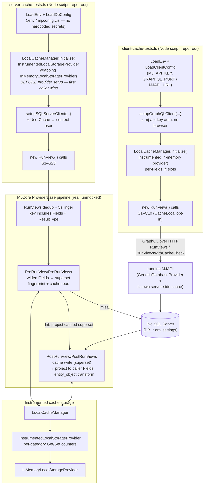
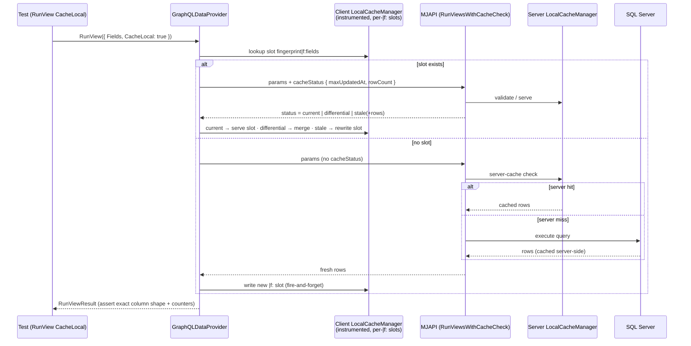

# RunView Caching — Live Integration Test Scripts

Live, end-to-end integration tests for MemberJunction's RunView caching pipeline, exercising
the **real** server componentry (SQLServerDataProvider against live SQL Server) and the
**real** client componentry (GraphQLDataProvider against a running MJAPI) — the exact same
code paths MJAPI and MJExplorer run in production, just bootstrapped from Node scripts.

This sits **between** the unit-test layer (mocked providers, vitest) and the full
browser-driven regression suite: real database, real GraphQL transport, real cache
managers — but scripted, fast (~10s server / ~25s client), and assertion-precise. It
tests the **seams between packages** that unit tests mock away and browser tests
traverse but cannot assert (a browser test never notices a 2-column cached payload,
and it can't count cache reads).

## Contents

| File | Purpose |
|---|---|
| `server-cache-tests.ts` | 26 tests against SQLServerDataProvider (`TrustLocalCacheCompletely = true`) |
| `client-cache-tests.ts` | 12 tests against a running MJAPI via GraphQLDataProvider (`TrustLocalCacheCompletely = false`) |
| `runquery-cache-tests.ts` | 9 tests for RunQuery result caching: TTL mode, smart CacheValidationSQL validation, fingerprinting, adversarial break attempts. **Creates and deletes its own Query fixtures** — see the file header |
| `record-process-tests.ts` | **Deterministic** — drives `RecordSetProcessor` over an in-memory source: ProcessRun/Detail persistence (the tracker's fire-and-forget queue), mixed counts, throw-isolation, circuit breaker, batching, bounded concurrency (6 tests) |
| `rls-isolation-tests.ts` | **Deterministic** — Row-Level Security multi-user isolation: `{{UserID}}` predicate substitution, two users get distinct predicates (cache fingerprint can't leak A→B), adaptive live RunView scoping check (3 tests) |
| `prompt-runner-tests.ts` | **Live model tier (gated)** — runs real prompts through AIPromptRunner and verifies the persisted `MJ: AI Prompt Runs` rows (3 prompts) |
| `agent-runner-tests.ts` | **Live model tier (gated)** — runs Sage, Query Builder, Demo Flow Agent, Demo Loop Agent (×3 prompts), Research Agent (×3 prompts) and deep-verifies run + steps + prompt runs + action logs + sub-agent runs (9 tests) |
| `concurrent-tests.ts` | **Live model tier (gated)** — N concurrent prompt runs + concurrent agent runs each persist independently (no cross-run corruption — stresses the queue's per-entity keying) |
| `run-all.ts` | Aggregator — runs every suite in sequence, one exit code (the gated suites skip unless `RUN_AGENT_TESTS=1`) |
| `lib/harness.ts` | Env/config loading, minimal test runner, shape assertions, instrumented storage provider |
| `lib/ai-bootstrap.ts` | Live provider stack + `AIEngine.Config` + the deep persisted-record verifiers for the AI suites |

> **Two tiers.** The cache/runquery suites are **deterministic, credential-free, and CI-ready today**. The agent/prompt suites are a **live model tier** — they make real LLM calls (cost tokens, need credentials), so they're gated behind `RUN_AGENT_TESTS=1` and skip by default. See **[Agent & Prompt suites](#agent--prompt-suites-live-model-tier)** below.

---

## The design under test (30-second refresher)

MJ's RunView cache stores **one full-width superset per entity+filter** and projects
per-caller on every read:

- The **server cache fingerprint** deliberately *excludes* `Fields` and `ResultType` —
  when a query is cacheable, `params.Fields` is widened to ALL entity fields before the
  DB hit, so a single cache entry can satisfy any future field subset.
- **Projection** (`ProjectRowsToFields`) restores the caller's requested shape on cache
  **hits** (filtering the cached superset) AND on cache **misses** (filtering the widened
  DB result) — identical shapes regardless of cache temperature.
- **PK contract**: explicitly requested `Fields` ALWAYS include the entity's primary
  key(s) — on every path (cached, non-cached, smart-cache, differential). Differential
  merges and entity linking depend on the PK, and the direct SQL path always included it.
- The **dedup/linger key** (in-flight request sharing + 5s linger window) *includes*
  `Fields` and `ResultType`, because the dedup layer shares the FINAL pipeline output —
  rows already projected and transformed for one caller.
- The **client cache fingerprint** appends `|f:<normalized fields>` — the client never
  widens (narrow wire payloads are the point) and never projects on read, so each field
  subset gets its own exact-match slot.

| Layer | Keyed by Fields? | Why |
|---|---|---|
| Server cache fingerprint | No | Stores full-width superset; projects per-read |
| Dedup / linger key | **Yes** (+ ResultType) | Shares post-projection output verbatim |
| Client cache fingerprint | **Yes** (`\|f:` suffix) | Stores rows as returned; no projection on read |

These suites verify every row of that table against the live stack.

---

## How it works

### Architecture



### Client smart-cache round trip (what `CacheLocal: true` does)



### The two proof techniques

**1. `UniqueFilter(column, tag)`** — every test that needs a guaranteed-cold cache entry
uses an always-true filter that is textually unique per tag
(`Name <> 'zzz-cache-test-<tag>'`). `ExtraFilter` is part of the fingerprint, so each tag
yields a fresh entry while matching the same rows — cold-cache determinism with **zero
data mutation**.

**2. `InstrumentedLocalStorageProvider`** — wraps the real in-memory storage with
per-category Get/Set counters. Tests don't guess whether the cache was used; they prove
it: a miss shows a `RunViewCache` write, a hit shows none, a linger-served dedup result
shows **zero storage traffic at all**, and `BypassCache` must leave the counters
untouched. Counters are scoped per category because `LocalCacheManager` also persists
its registry index asynchronously in a different category.

---

## Test inventory

### Server suite (S1–S26)

| # | Verifies |
|---|---|
| S1 | Cold miss with narrow `Fields` returns ONLY requested columns + writes the cache |
| S2 | Hit returns the identical shape (miss/hit symmetry — the original defect) + `ExecutionTime: 0` |
| S3 | A different field subset is served from the same superset entry, no rewrite |
| S4 | No `Fields` → full entity width (pass-through) |
| S5 | Case-insensitive field matching; original column casing preserved |
| S6 | `entity_object` results are full `BaseEntity` instances even from a cached superset |
| S7 | `BypassCache` skips cache read AND write, narrow fields end-to-end |
| S8 | `TotalRowCount` parity across miss/hit |
| S9 | Batch `RunViews`: each result projected to its OWN param's fields |
| S10 | Mixed hit+miss batch: warm index from cache, cold index from DB, both correct |
| S11 | Linger-window callers with different `Fields` get their own shapes (dedup key regression) |
| S12 | Linger-window callers with different `ResultType` get their own representations |
| S13 | Identical repeat in the linger window is served with zero storage traffic |
| S14 | Different `ExtraFilter` values fingerprint independently |
| S15 | `OrderBy` honored on miss and hit |
| S16 | `MaxRows` limits rows and fingerprints separately from the unlimited query |
| S17 | *(gated)* Save invalidates filtered entries; delete removes the row |
| S24 | *(gated)* `AllowCaching=false` flipped LIVE on an entity → zero cache reads/writes, direct-path shapes, flag restored |
| S25 | `TrustServerCacheCompletely=false` entities (real metadata — e.g. `MJ: Audit Logs`) never touch the server cache |
| S26 | `MJ: Record Changes` hardcoded cache exemption (rows arrive via raw SQL) |
| S18 | AfterKey keyset pages never touch the cache and never poison the entity+filter slot |
| S19 | `count_only` returns `TotalRowCount` with zero rows and never poisons the row cache |
| S20 | Poisoning regression: full-width query after a narrow `BypassCache` stays full-width |
| S21 | `entity_object` ignores narrow `Fields` — instances always carry the full field set |
| S22 | Concurrent identical `RunViews` share one execution (at most one cache write) |
| S23 | *(gated)* Unfiltered auto-maintained cache upserts on save / removes on delete IN PLACE — post-mutation reads still served from cache with zero DB hits |

### Client suite (C1–C12)

| # | Verifies |
|---|---|
| C1 | Narrow `Fields` shape survives the GraphQL transport end-to-end (no CacheLocal) |
| C2 | Server miss/hit symmetry over the wire (second call past the linger window) |
| C3 | `CacheLocal` miss writes a client slot; repeat validates `current` and serves locally |
| C4 | Different subset gets its OWN `\|f:` slot — no cross-subset serving |
| C5 | Full-width (`'*'`) request is not satisfied by a narrow slot |
| C6 | `entity_object` materializes as `BaseEntity` client-side, including from cache |
| C7 | Client dedup keying: different `Fields` in the linger window get their own shapes |
| C8 | Mixed-CacheLocal batch projects each result to its own param |
| C9 | `count_only` works over the GraphQL transport (TotalRowCount, zero rows, no poisoning) |
| C10 | *(gated)* Client slot save→revalidate→delete→revalidate round trip (differential/stale refresh) |
| C11 | Client RunQuery with `CacheLocal` — slot written, repeat revalidates over GraphQL |
| C12 | Trust=0 entities: server never caches; client slots written ONLY when the result carries `__mj_UpdatedAt` (stamp-less responses are unvalidatable and correctly refused) |

### RunQuery suite (Q1–Q9) — self-contained fixtures, mutates + cleans up

| # | Verifies |
|---|---|
| Q1 | No `CacheLocal` → the RunQuery cache is never touched |
| Q2 | TTL mode: miss writes a slot; repeat serves it (`CacheHit: true`, `ExecutionTime: 0`) |
| Q3 | `CacheLocalTTL` expiry: expired slots re-execute and rewrite |
| Q4 | BREAK: `MaxRows` fingerprints separately — no cross-shape serving |
| Q5 | TTL mode serves stale-by-design within the TTL, fresh after expiry (documented semantics) |
| Q6 | Smart validation: matching cacheStatus → `current` (no rows); mutated data → `stale` (+fresh rows) |
| Q7 | Queries without `CacheValidationSQL` answer `no_validation` with fresh rows |
| Q8 | BREAK: failed executions are never cached |
| Q9 | BREAK: parameter key ORDER yields separate-but-correct slots (never wrong results) |

---

## Running

Both scripts run from the **repo root** (cwd-relative `.env` / `mj.config.cjs`):

```bash
# Server-side suite — needs only the database
npx tsx packages/MJServer/integration-test-scripts/server-cache-tests.ts

# Server-side suite including the save/delete invalidation test
# (creates + deletes ONE "MJ: User Settings" row for the context user)
RUN_MUTATION_TESTS=1 npx tsx packages/MJServer/integration-test-scripts/server-cache-tests.ts

# Client-side suite — needs MJAPI running (cd packages/MJAPI && npm run start)
npx tsx packages/MJServer/integration-test-scripts/client-cache-tests.ts
```

Exit codes: `0` all passed · `1` failures · `2` bootstrap/connectivity error.

These scripts are **not** part of the MJServer build (its tsconfig includes `./src` only)
and have no package.json footprint — they resolve workspace packages through the monorepo
root `node_modules` and run directly via `tsx`.

### Environment variables used (all looked up, never hardcoded)

| Variable | Used by | Meaning |
|---|---|---|
| `DB_HOST` / `DB_PORT` / `DB_USERNAME` / `DB_PASSWORD` / `DB_DATABASE` | server suite | SQL Server connection (`mj.config.cjs` `databaseSettings` takes precedence) |
| `MJ_TEST_USER_EMAIL` | server suite | Optional context-user override (defaults to the Owner-type user) |
| `MJ_API_KEY` | client suite | System API key MJAPI accepts via `x-mj-api-key` |
| `GRAPHQL_PORT` / `GRAPHQL_ROOT_PATH` / `MJAPI_URL` | client suite | Endpoint resolution; `MJAPI_URL` overrides the composed localhost URL |
| `RUN_MUTATION_TESTS` | server suite | `1` enables the save/delete invalidation test |

---

## Bugs this suite found — all FIXED and re-verified live (2026-06-11)

The suite found three product bugs on its first day; all three are fixed on this branch
and the once-red tests are now green regression guards.

1. **S7/S20 — BypassCache cache poisoning (FIXED).** `PostRunViews`' cache-write gate
   omitted `BypassCache`/`AfterKey`, so server-side `RunView({BypassCache:true})`
   (which routes through the batch path) wrote its narrow, un-widened rows under the
   Fields-agnostic superset fingerprint — a following full-width query was served 2
   columns from cache. Fix: one shared `runViewCacheEligible()` predicate
   (BypassCache / AfterKey / count_only / entity-allowed) now gates widening, cache
   reads, cache writes, AND auto-cache in all pre/post hooks — the four sites can no
   longer drift apart.

2. **C3/C4/C5/C8 — smart-cache server path bypassed widening and projection (FIXED).**
   `GenericDatabaseProvider.RunViewsWithCacheCheck` cached narrow results under the
   Fields-agnostic fingerprint and served cached rows unprojected, so one client's
   `CacheLocal` shape poisoned the slot for every subsequent caller. Fix: the method
   now widens eligible items at entry (same predicate), caches only the wide superset,
   and every serve leg (server-cache shortcut, full-query, stale fallback, differential
   rows) projects down to each caller's requested fields ∪ PK before returning.

3. **S17 — DELETE-driven invalidation failed for filtered entries (FIXED).**
   `BaseEntity.Delete()` raises the delete event then immediately wipes the entity via
   `NewRecord()`; the cache handler runs fire-and-forget async and read
   `baseEntity.GetAll()` AFTER the wipe — null PKs, silent skip, ghost rows in every
   cached filtered view. Fix: the handler now prefers the event payload's pre-delete
   `OldValues` snapshot (carried on the delete event for exactly this reason) when
   building the invalidation key.

Also resolved in the same pass:
- **`count_only` implemented** — `BuildTotalRowCountSQL` only emitted the COUNT query
  when rows were limited (its pagination purpose), so a bare `count_only` silently
  returned 0. It now always emits the count for `count_only`, and `count_only` is
  cache-ineligible (its empty Results under a ResultType-agnostic fingerprint would
  poison row queries). Verified server-side (S19) and over GraphQL (C9).
- **PK contract adopted** — explicitly requested `Fields` now always include the
  primary key(s) on every path, resolving the cached-vs-direct shape asymmetry.
- **Caller params no longer mutated** — `RunView`/`RunViews` shallow-clone params at
  entry, so the pipeline's Fields widening never leaks into caller objects.
- **`SetStorageProvider` exonerated** — the earlier suspicion that a post-init swap
  broke save-invalidation was re-tested with correct settle timing: save AND delete
  invalidation work fine after a swap. The original failure was the (since-fixed)
  delete bug plus too-short settle windows.


### Round 2 findings (2026-06-11, while building the RunQuery suite)

4. **`RunQueryParams.CacheLocal` / `CacheLocalTTL` were documented but INERT (FIXED).**
   The entire query-cache stack existed — `RunQueryCache` storage with TTL enforcement,
   `GenerateRunQueryFingerprint`, the server's `RunQueriesWithCacheCheck` validation
   engine, the GraphQL resolver and client method, even `CacheHit`/`CacheKey` fields on
   `RunQueryResult` — but nothing in the standard `RunQuery()` flow ever engaged any of
   it, on either tier. Fix (`ProviderBase.RunQuery`): `CacheLocal` now works as
   documented — server providers serve TTL slots directly; client providers revalidate
   via `RunQueriesWithCacheCheck` (`current` → slot, `stale`/`no_validation` → fresh
   rows + slot rewrite); saved queries only (ad-hoc SQL never cached); `MaxRows`/`StartRow`
   folded into the fingerprint so differently-shaped requests can't share a slot.

5. **Aggregate-query validation stamps could never validate `current` (FIXED).**
   Fresh/stale responses stamped `maxUpdatedAt` by scanning RESULT rows — meaningless
   for aggregate queries (no `__mj_UpdatedAt` column → always empty), so a cached slot
   could never validate `current` against the validation SQL's `MAX(...)` once
   underlying rows existed: permanent re-fetch. Fix (`GenericDatabaseProvider`):
   responses for queries with `CacheValidationSQL` are stamped from the VALIDATION SQL's
   own status (first fetches included), so stamps and checks compare in the same domain
   by construction.

**Contract note for `CacheValidationSQL` authors**: return `[MaxUpdatedAt]` and
`[RowCount]` (bracket them — `RowCount` is a reserved word) describing the FRESHNESS
DOMAIN of the query. Stamps and validation checks both come from this SQL, so it defines
its own consistency; typically `MAX(__mj_UpdatedAt)` + `COUNT(*)` over the underlying
tables the query reads.

---

## Gotchas when writing tests here (learned the hard way)

1. **Construct fresh param objects per call.** The pipeline widens `params.Fields` in
   place on cacheable calls — reusing a params object makes your second call a
   different (all-fields) request. Use a `makeParams()` factory.
2. **Scope counter assertions to the `'RunViewCache'` category.** The registry index
   persists asynchronously in another category and will randomly bump global counters.
3. **Initialize the instrumented cache BEFORE provider setup — server AND client.**
   `Initialize` is first-caller-wins; both `setupSQLServerClient` and
   `setupGraphQLClient` initialize it via `StartupManager` during setup. Initializing
   afterwards is a SILENT no-op: caching still works (against the provider's own
   storage) but your instrumented counters never see traffic — assertions on writes
   fail while all behavior assertions pass, which looks exactly like a product bug.
4. **Outlive the 5-second dedup linger window** (sleep ~5.2s) when a test needs the
   second call to genuinely reach the cache or the server rather than the in-flight
   dedup slot.
5. **Mutation tests: settle after Save/Delete.** Cache invalidation is fire-and-forget
   off BaseEntity events — allow ~2s before asserting, and clean up in `finally`.
6. **Mind the deferred engines.** `StartupManager` kicks `AIEngine` ~15s after
   bootstrap; it runs its own RunViews in the background. UniqueFilter isolation keeps
   it from touching your fingerprints, but global counters will move.


---

## Agent & Prompt suites (live model tier)

`prompt-runner-tests.ts` and `agent-runner-tests.ts` extend the harness to the AI execution stack —
real `AIPromptRunner` / `AgentRunner` runs against the live database + real model providers, then
**deep-verification of the persisted output**. They are the live end-to-end regression guard for the
fire-and-forget `BaseEntitySaveQueue` (the "stuck at Running" race fix): every run/step/log must be
finalized, never left at `Running` with a null completion timestamp.

### What they verify

| Suite | Runs | Asserts on the persisted records |
|---|---|---|
| `prompt-runner-tests.ts` | one prompt via `AIPromptRunner.ExecutePrompt` (then `WaitForPendingPromptRunSaves()`) | `MJ: AI Prompt Runs` — terminal `Status`, **`CompletedAt` set**, and on success a non-empty `Result` + recorded `ExecutionTimeMS`/tokens |
| `agent-runner-tests.ts` | **Sage**, **Demo Loop Agent**, **Query Builder** via `AgentRunner.RunAgent` | `MJ: AI Agent Runs` (finalized, not stuck) · **every** `MJ: AI Agent Run Steps` (terminal + `CompletedAt`) · each Prompt step's `TargetLogID` → `MJ: AI Prompt Runs` · each Actions/Tool step → `MJ: Action Execution Logs` (`EndedAt` + `ResultCode`) · each Sub-Agent step → child `MJ: AI Agent Runs` (recursive) |

`AwaitingFeedback` / `Paused` are recognized as **valid** suspended states (an agent legitimately asking
for input) — only a run/step still at `Running` is the bug. Output is non-deterministic, so assertions
are **structural** (it ran, it persisted correctly), not exact-output.

### Running

```bash
# Whole suite — deterministic tier runs, live tier skips (default)
npx tsx packages/MJServer/integration-test-scripts/run-all.ts

# Live model tier (costs tokens, needs model credentials in the env/DB)
RUN_AGENT_TESTS=1 npx tsx packages/MJServer/integration-test-scripts/run-all.ts
# or individually:
RUN_AGENT_TESTS=1 npx tsx packages/MJServer/integration-test-scripts/agent-runner-tests.ts
```

| Variable | Meaning |
|---|---|
| `RUN_AGENT_TESTS=1` | Opt into the live model tier (otherwise both AI suites skip with exit 0) |
| `PROMPT_TEST_NAME` / `PROMPT_TEST_DATA` | Which prompt to run + its template data (default: first Active prompt, empty data) |
| `SAGE_MESSAGE` / `DEMO_LOOP_MESSAGE` / `QUERY_BUILDER_MESSAGE` | Per-agent input message overrides |
| `AGENT_SETTLE_MS` | Wait (default 3000ms) for the fire-and-forget step/prompt/log saves to land before reading them back |

Verified live (2026-06-20): prompt 1/1; Sage / Demo Loop Agent / Query Builder 3/3 (Query Builder also
exercises a sub-agent — its child run is recursively verified).

---

## Roadmap: graduating into the Testing Framework as a first-class "Integration Test" type

These scripts are deliberately framework-light — a proving ground. The destination is
MJ's metadata-driven **[Testing Framework](../../TestingFramework/README.md)**
([EngineBase](../../TestingFramework/EngineBase/README.md) ·
[Engine](../../TestingFramework/Engine/README.md) ·
[CLI](../../TestingFramework/CLI/README.md)), where tests are TestType / TestSuite /
Test metadata and execution is pluggable: each TestType names a `DriverClass` extending
[`BaseTestDriver`](../../TestingFramework/Engine/src/drivers/BaseTestDriver.ts), registered
via `@RegisterClass(BaseTestDriver, '<DriverName>')` — see
[`AgentEvalDriver`](../../TestingFramework/Engine/src/drivers/AgentEvalDriver.ts) for the
existing reference implementation.

**The plan** (handoff: @jordanfanapour):

1. **New TestType: `Integration Test`** with an `IntegrationTestDriver` that does what
   `lib/harness.ts` does today — bootstrap the real provider stack as a library
   (`setupSQLServerClient` + instrumented `LocalCacheManager`, optionally
   `setupGraphQLClient` against a running MJAPI) — then execute registered checks and
   report structured pass/fail/timing through the framework's normal result records.
2. **Each suite here becomes Test metadata** (suite → TestSuite, test → Test rows), so
   coverage is versioned, discoverable in the UI, runnable via the testing CLI, and
   composable into release gates alongside agent evals.
3. **CI/release integration**: the suites are already deterministic, env-driven
   (no hardcoded secrets), exit-code-clean, and mutation-gated — designed to slot into
   the release build (e.g., the Docker regression stage) so every release gets this
   coverage at near-zero marginal cost. Tier: PR unit tests → headless integration
   tests (this layer) → browser/computer-use regression.

### Concrete migration recipe — an `IntegrationTestDriver` TestType (studied 2026-06-20)

The framework (`packages/TestingFramework/`) is the right long-term home and adding an out-of-package
driver is cheap (the `ComputerUseTestDriver` in `packages/AI/MJComputerUse` proves out-of-package drivers
work). To port the AI suites here into metadata-driven tests:

1. **Driver** — `@RegisterClass(BaseTestDriver, 'IntegrationTestDriver') class IntegrationTestDriver extends BaseTestDriver`, implement `Execute(context)`: run the prompt/agent, run the deep verifiers from `lib/ai-bootstrap.ts` as the assertions, and return a `DriverExecutionResult` (`status`, `targetLogId` → the AI Agent Run, `actualOutput`, `durationMs`, `totalCost`). Export it + add a manifest entry (`npm run mj:manifest`).
2. **TestType seed** — `metadata/test-types/.integration-test-type.json` with `DriverClass: "IntegrationTestDriver"`.
3. **Test seeds** — `metadata/tests/...` referencing the type, with `Configuration`/`InputDefinition` carrying the agent/prompt + the expected structural checks. Run via `mj test suite ...`; results land in `MJ: Test Runs`.

**Why we built standalone scripts first (and the gaps to close before migrating):** (a) the reference
`AgentEvalDriver` currently **hard-disables its oracle assertions** (`skipOracles = true`) — it passes on
agent *completion* only, so real assertions need finishing or a custom deterministic oracle; (b) there is
**no prompt driver** yet; (c) there is **no CI lane with a database** — `.github/workflows/test.yml` runs
Vitest only, no DB/LLM. Our scripts are fully deterministic on the cache/runquery tier and need none of
that. **Path to the PR gate:** stand up a DB-enabled CI job that runs `run-all.ts` (deterministic tier as a
blocking gate; the gated live-model tier as a nightly/opt-in lane to control cost + flakiness), then port to
the driver once the oracle path is finished — gaining run history, suites, variable matrices, and the UI.

### The headless pattern, and where else to apply it

The technique that found 5 product bugs here generalizes: **mock the top layer, keep
everything else real** — real DB, real engines, real transport when needed; no browser,
no Playwright. Bootstrap follows
[`run-dupe-detection.ts`](../../AI/Vectors/Dupe/scripts/run-dupe-detection.ts)'s
library-bootstrap pattern. High-value next candidates (scouted 2026-06-11):

| Candidate | Entry points | Why (bug surface) |
|---|---|---|
| **Scheduled Jobs engine** | [`ScheduledJobEngine`](../../Scheduling/engine/src/ScheduledJobEngine.ts) | Distributed lease locking, concurrency caps, stale-lease sweeps, stats integrity — classic race-condition territory |
| **API Key engine + scope evaluator** | [`APIKeyEngine`](../../APIKeys/Engine/src/APIKeyEngine.ts), `ScopeEvaluator`/`PatternMatcher` | Auth pattern matching, wildcard expansion, key validation round-trips, usage logging — security-relevant |
| **MetadataSync push/pull** | [`sync-engine`](../../MetadataSync/src/lib/sync-engine.ts), Push/Pull services | Dependency ordering, FK integrity, round-trip determinism, rollback correctness |
| **AI Agent framework** | [`base-agent.ts`](../../AI/Agents/src/base-agent.ts), `AgentRunner`, `PayloadManager` | Stub the LLM (deterministic prompt-runner mock), keep DB/run-persistence/payload/scratchpad real — state-machine + persistence bugs |
| **Query parameter pipeline** | [`queryParameterProcessor`](../../QueryProcessor/src/queryParameterProcessor.ts) + composition macros | Type coercion, Nunjucks safety, `{{query:"..."}}` macro resolution, SQL Server vs PostgreSQL parity |

Also viable: Version History engine, Search engine fusion (mock the vector provider),
Templates engine rendering, RLS/multi-user isolation (the one security-shaped gap in
the current suites), dataset caching, and CodeGen determinism. The agent framework and
CodeGen are the big prizes — both have huge surface and zero headless coverage today.

### What to build FIRST when picking this up (@jordanfanapour, cc @rkihm-bc)

Prioritized backlog for the caching/RunView/RunQuery layer itself — these close the
remaining coverage gaps and are ordered by bug-finding value:

1. **RLS / multi-user isolation** *(do this first — it's security-shaped)*. Every test
   in all three suites runs as a single context user. The cache fingerprint embeds the
   RLS where-clause, which *should* segregate users — but nothing proves user A's
   row-level-filtered cache entry can never serve user B, on either tier (server
   superset slots AND client smart-cache `current` validation). A bug here is a data
   leak, not a wrong column count. Fixture: two users with different RLS policies,
   then the standard harness pattern.
2. **Dataset caching.** The third cache family (`DatasetCache` category,
   `GetAndCacheDatasetByName`) has zero coverage — and app startup rides on it. The
   instrumented-storage technique applies directly.
3. **Aggregates through the cache.** `AggregateResults` are stored and re-served and
   `aggHash` is part of the fingerprint — never asserted. A stale or
   cross-contaminated aggregate silently shows wrong KPI numbers; nobody files a bug
   for that, it just looks like data.
4. **Quick wins (same pattern as S16):** `StartRow` pagination and `UserSearchString`
   fingerprint separation; saved views (`ViewID`/`ViewName`) through the cache —
   including asserting the *documented* behavior that two views resolving to the same
   entity+filter intentionally share one cache entry.
5. **Cross-server invalidation over Redis.** The production multi-server topology
   (Redis storage provider, remote-invalidate pub/sub, `HandleRemoteInvalidateEvent`)
   is untested live. Docker-workbench-shaped: two MJAPI processes, save in one,
   assert invalidation in the other — wants the Testing Framework's infrastructure
   rather than ad-hoc scripts.
6. **PostgreSQL parity.** These suites are SQL Server-only, but
   GenericDatabaseProvider is dual-platform and PG-parity regressions have happened
   before (see the `TotalRowCount` alias-folding note in `BuildTotalRowCountSQL`).
   Running these exact suites against a PG backend is the cheapest coverage lever
   available — zero new test code.
7. **Stress / eviction.** Cache behavior under `maxSizeBytes` pressure and eviction
   sweeps; true racing save+read invalidation (current tests use settle windows — a
   hammer test could expose timing windows). Higher flake risk; best built in the
   framework with proper retry semantics.
8. **RunQuery follow-ups:** client e2e against a `CacheValidationSQL` fixture visible
   to MJAPI's QueryEngine (needs fixture-then-restart orchestration or engine refresh
   over the API), and Query category TTL inheritance
   (`DefaultCacheEnabled`/`CacheInheritanceEnabled` → `MJQueryEntityExtended.CacheConfig`),
   whose consumers deserve an audit of their own.

Beyond this layer, the next *subsystems* to onboard are in the candidates table above —
Scheduled Jobs, API Keys, MetadataSync, Agent framework (stubbed LLM), query parameter
pipeline, CodeGen determinism.

## Extending the suite

- Add tests with `suite.Test('name', async () => { ... })` — they run sequentially in
  registration order, and several intentionally build on cache state from earlier tests.
- Use a fresh `UniqueFilter` tag for each new test that needs a cold cache entry.
- Keep everything read-only by default; gate any data mutation behind an env flag and
  clean up in a `finally` block (see S17).
- The harness (`lib/harness.ts`) is deliberately dependency-light and copy-friendly —
  if a second suite area appears (RunQuery caching, dataset caching, RLS, keyset
  pagination), promote it to a shared location rather than duplicating it.
