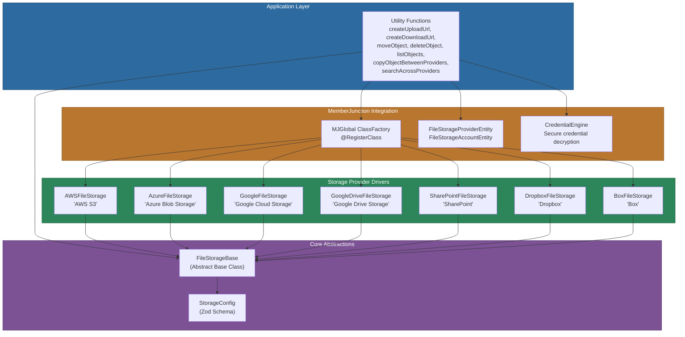
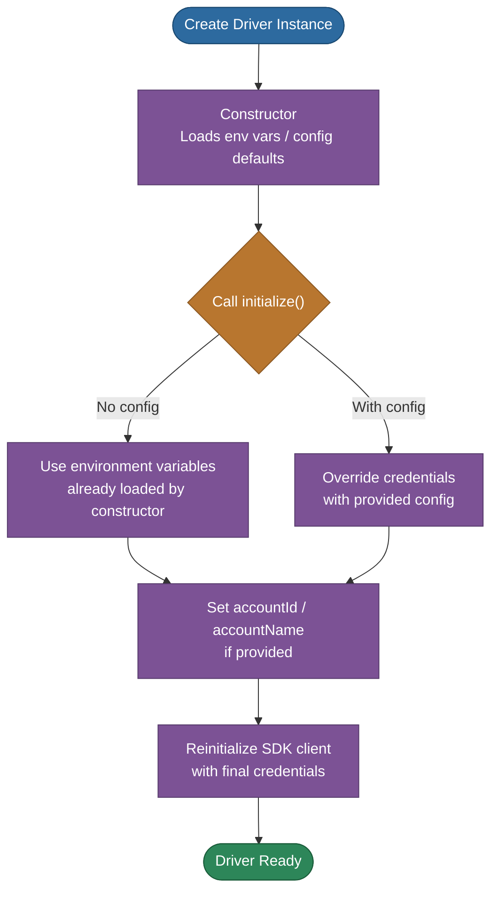
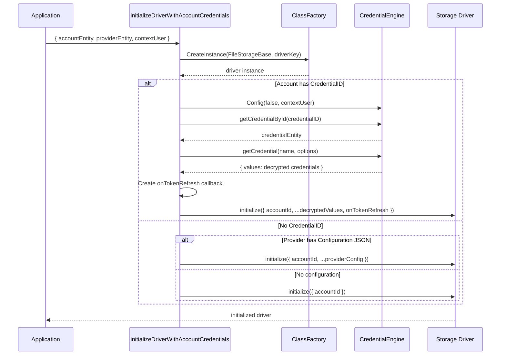
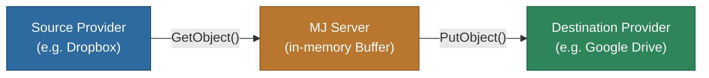
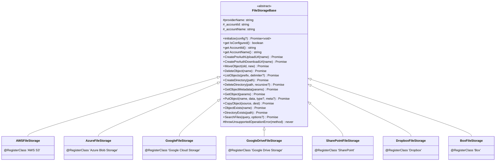

# @memberjunction/storage

The `@memberjunction/storage` library provides a unified interface for interacting with various cloud storage providers. It abstracts the complexities of different storage services behind a consistent API, making it easy to work with files stored across different cloud platforms.

Part of the [MemberJunction](https://github.com/MemberJunction/MJ) framework.

## Overview

This library is a key component of the MemberJunction platform, providing seamless file storage operations across multiple cloud providers. It offers a provider-agnostic approach to file management, allowing applications to switch between storage providers without code changes. The package supports both simple single-tenant deployments using environment variables and enterprise multi-tenant deployments using the MemberJunction Credential Engine for secure credential management.

## Architecture

The library is organized around an abstract base class (`FileStorageBase`) with concrete driver implementations for each supported cloud storage provider. A set of high-level utility functions in `util.ts` bridge the gap between MemberJunction entities and the underlying drivers. Configuration is handled through Zod-validated schemas loaded from `mj.config.cjs` or environment variables.



## Features

- **Unified API**: Consistent methods across all storage providers via the `FileStorageBase` abstract class
- **Type-Safe**: Full TypeScript support with comprehensive type definitions
- **Flexible Provider Selection**: Use any number of storage providers simultaneously based on your application needs
- **Pre-authenticated URLs**: Secure upload and download operations using time-limited URLs
- **Metadata Support**: Store and retrieve custom metadata with your files
- **Error Handling**: Provider-specific errors are normalized with clear error messages
- **Zod-Validated Configuration**: All configuration schemas are validated at load time via Zod
- **Enterprise Credential Management**: Integrates with `@memberjunction/credentials` for secure, multi-tenant credential storage and decryption
- **Cross-Provider Copy**: Copy files between different storage providers server-side
- **Multi-Provider Search**: Search for files across multiple providers or accounts in parallel
- **Token Refresh Persistence**: Automatic callback system to persist new OAuth tokens (critical for providers like Box that rotate refresh tokens)
- **Extensible**: Easy to add new storage providers by extending `FileStorageBase`

### Supported Storage Providers

| Provider | Driver Key | Search | Pre-auth URLs | Native Directories |
|---|---|---|---|---|
| [AWS S3](https://aws.amazon.com/s3/) | `AWS S3` | No | Yes | Simulated |
| [Azure Blob Storage](https://azure.microsoft.com/en-us/products/storage/blobs) | `Azure Blob Storage` | No | Yes | Simulated |
| [Google Cloud Storage](https://cloud.google.com/storage) | `Google Cloud Storage` | No | Yes | Simulated |
| [Google Drive](https://developers.google.com/drive/api/guides/about-sdk) | `Google Drive Storage` | Yes (content) | Yes | Native |
| [Microsoft SharePoint](https://learn.microsoft.com/en-us/sharepoint/dev/) | `SharePoint` | Yes (content) | Yes | Native |
| [Dropbox](https://www.dropbox.com/developers/documentation) | `Dropbox` | Yes (content) | Yes | Native |
| [Box](https://developer.box.com/guides/) | `Box` | Yes (metadata) | Yes | Native |

### File Operations

- Upload files (via pre-authenticated URLs or direct Buffer upload)
- Download files (via pre-authenticated URLs or direct Buffer download)
- Copy and move files (within and across providers)
- Delete files and directories (with optional recursive deletion)
- List files and directories with full metadata
- Create and manage directories
- Get detailed file metadata without downloading content
- Check file/directory existence
- Search files using native provider search APIs

## Installation

```bash
npm install @memberjunction/storage
```

## Dependencies

This package depends on:

| Package | Purpose |
|---|---|
| `@memberjunction/core` | Core MemberJunction functionality (logging, UserInfo) |
| `@memberjunction/core-entities` | Entity definitions (FileStorageProviderEntity, FileStorageAccountEntity) |
| `@memberjunction/global` | Global class factory and `@RegisterClass` decorator |
| `@memberjunction/credentials` | Credential Engine for secure credential decryption |
| `@aws-sdk/client-s3`, `@aws-sdk/s3-request-presigner` | AWS S3 SDK |
| `@azure/storage-blob`, `@azure/identity` | Azure Blob Storage SDK |
| `@google-cloud/storage` | Google Cloud Storage SDK |
| `googleapis` | Google Drive API |
| `@microsoft/microsoft-graph-client` | SharePoint via Microsoft Graph |
| `dropbox` | Dropbox SDK |
| `box-node-sdk` | Box SDK |
| `cosmiconfig` | Configuration file loading |
| `zod` | Configuration schema validation |
| `env-var` | Environment variable parsing |
| `mime-types` | MIME type detection |

## Usage

### Initialization Flow

Every storage driver follows a two-step initialization pattern. The `initialize()` method is smart enough to handle both simple deployments (environment variables) and multi-tenant deployments (database credentials).



### Simple Deployment (Environment Variables)

For single-tenant applications, development, testing, or simple production deployments:

```bash
# Example: Azure Blob Storage
export STORAGE_AZURE_CONTAINER=your-container-name
export STORAGE_AZURE_ACCOUNT_NAME=your-account-name
export STORAGE_AZURE_ACCOUNT_KEY=your-account-key
```

```typescript
import { AzureFileStorage } from '@memberjunction/storage';

// Constructor loads environment variables
const storage = new AzureFileStorage();

// ALWAYS call initialize() - no config needed for env var deployments
await storage.initialize();

// Provider is now ready to use
await storage.ListObjects('/');
```

### Multi-Tenant Enterprise (Database Credentials)

For enterprise applications managing multiple storage accounts via the MemberJunction entity system and Credential Engine:

```typescript
import { FileStorageEngine } from '@memberjunction/core-entities';
import { initializeDriverWithAccountCredentials } from '@memberjunction/storage';

// Load account from database
const engine = FileStorageEngine.Instance;
await engine.Config(false, contextUser);

const accountWithProvider = engine.GetAccountWithProvider(accountId);

// Infrastructure utility handles credential decryption and initialization
const storage = await initializeDriverWithAccountCredentials({
  accountEntity: accountWithProvider.account,
  providerEntity: accountWithProvider.provider,
  contextUser
});

// Provider is ready - credentials were automatically decrypted and initialized
await storage.ListObjects('/');
```

The `initializeDriverWithAccountCredentials()` utility:
- Creates the driver instance via the MJGlobal ClassFactory
- Retrieves the credential by ID from the Credential Engine
- Decrypts the credential values
- Configures a token refresh callback to persist rotated tokens back to the database
- Calls `initialize()` with decrypted values and account information

### Enterprise Credential Flow



### Using Utility Functions

The library provides high-level utility functions that work with MemberJunction's entity system:

```typescript
import {
  createUploadUrl,
  createDownloadUrl,
  moveObject,
  deleteObject,
  listObjects,
  copyObject
} from '@memberjunction/storage';
import { FileStorageProviderEntity } from '@memberjunction/core-entities';
import { Metadata } from '@memberjunction/core';

async function fileOperationsExample() {
  const md = new Metadata();
  const provider = await md.GetEntityObject<FileStorageProviderEntity>('File Storage Providers');
  await provider.Load('your-provider-id');

  // Create pre-authenticated upload URL
  const { updatedInput, UploadUrl } = await createUploadUrl(
    provider,
    {
      ID: '123',
      Name: 'documents/report.pdf',
      ProviderID: provider.ID
    }
  );

  // The client can use the UploadUrl directly to upload the file
  console.log(`Upload URL: ${UploadUrl}`);
  console.log(`File status: ${updatedInput.Status}`); // 'Uploading'
  console.log(`Content type: ${updatedInput.ContentType}`); // 'application/pdf'

  // If a ProviderKey was returned, use it for future operations
  const fileIdentifier = updatedInput.ProviderKey || updatedInput.Name;

  // Create pre-authenticated download URL
  const downloadUrl = await createDownloadUrl(provider, fileIdentifier);

  // List directory contents
  const contents = await listObjects(provider, 'documents/');
  for (const file of contents.objects) {
    console.log(`${file.name} (${file.size} bytes)`);
  }

  // Copy a file
  await copyObject(provider, fileIdentifier, 'documents/report-backup.pdf');

  // Move a file
  await moveObject(provider, fileIdentifier, 'archive/report.pdf');

  // Delete a file
  await deleteObject(provider, 'archive/report.pdf');
}
```

### Direct Provider Usage

You can work directly with a storage provider by instantiating it:

```typescript
import { AzureFileStorage, FileStorageBase } from '@memberjunction/storage';
import { MJGlobal } from '@memberjunction/global';

async function directProviderExample() {
  // Method 1: Direct instantiation (simple deployment with env vars)
  const storage = new AzureFileStorage();
  await storage.initialize();

  // Method 2: Using class factory (dynamic provider selection)
  const storage2 = MJGlobal.Instance.ClassFactory.CreateInstance<FileStorageBase>(
    FileStorageBase,
    'Azure Blob Storage'
  );
  await storage2.initialize();

  // List all files in a directory
  const result = await storage.ListObjects('documents/');
  console.log('Files:', result.objects);
  console.log('Directories:', result.prefixes);

  // Upload a file directly with metadata
  const content = Buffer.from('Hello, World!');
  await storage.PutObject(
    'documents/reports/hello.txt',
    content,
    'text/plain',
    { author: 'John Doe', department: 'Engineering' }
  );

  // Get file metadata without downloading content
  const metadata = await storage.GetObjectMetadata({
    fullPath: 'documents/reports/hello.txt'
  });
  console.log('File metadata:', metadata);

  // Download file content
  const fileContent = await storage.GetObject({
    fullPath: 'documents/reports/hello.txt'
  });
  console.log('File content:', fileContent.toString('utf8'));

  // Copy a file
  await storage.CopyObject(
    'documents/reports/hello.txt',
    'documents/archive/hello-backup.txt'
  );

  // Check if a file exists
  const exists = await storage.ObjectExists('documents/reports/hello.txt');

  // Check if a directory exists
  const dirExists = await storage.DirectoryExists('documents/reports/');

  // Delete a directory and all its contents
  await storage.DeleteDirectory('documents/reports/', true);
}
```

### Cross-Provider File Copy

Transfer files between different storage providers server-side:

```typescript
import { copyObjectBetweenProviders } from '@memberjunction/storage';

const result = await copyObjectBetweenProviders(
  sourceProviderEntity,
  destProviderEntity,
  'documents/report.pdf',
  'imported/report.pdf',
  {
    sourceUserContext: { userID: currentUser.ID, contextUser },
    destinationUserContext: { userID: currentUser.ID, contextUser }
  }
);

if (result.success) {
  console.log(`Transferred ${result.bytesTransferred} bytes`);
}
```



### Searching Files

Providers with native search capabilities support the `SearchFiles` method:

```typescript
import { FileStorageBase, UnsupportedOperationError } from '@memberjunction/storage';

try {
  // Simple search
  const results = await storage.SearchFiles('quarterly report');

  for (const file of results.results) {
    console.log(`  ${file.path} (${file.size} bytes)`);
    if (file.excerpt) {
      console.log(`    Excerpt: ${file.excerpt}`);
    }
  }

  // Advanced search with filters
  const filtered = await storage.SearchFiles('budget 2024', {
    fileTypes: ['pdf', 'docx'],
    modifiedAfter: new Date('2024-01-01'),
    pathPrefix: 'documents/finance/',
    maxResults: 50,
    searchContent: true
  });

  if (filtered.hasMore) {
    console.log(`Total matches: ${filtered.totalMatches}`);
  }
} catch (error) {
  if (error instanceof UnsupportedOperationError) {
    console.log('This provider does not support file search');
  }
}
```

### Multi-Provider and Multi-Account Search

Search across multiple providers or accounts in parallel:

```typescript
import { searchAcrossProviders, searchAcrossAccounts } from '@memberjunction/storage';

// Search across multiple providers
const providerResults = await searchAcrossProviders(
  [googleDriveProvider, dropboxProvider, boxProvider],
  'quarterly report',
  {
    maxResultsPerProvider: 25,
    fileTypes: ['pdf', 'docx'],
    providerUserContexts: new Map([
      [googleDriveProvider.ID, { userID: currentUser.ID, contextUser }],
      [dropboxProvider.ID, { userID: currentUser.ID, contextUser }]
    ])
  }
);

for (const pr of providerResults.providerResults) {
  if (pr.success) {
    console.log(`${pr.providerName}: ${pr.results.length} results`);
  } else {
    console.log(`${pr.providerName}: ${pr.errorMessage}`);
  }
}

// Enterprise: Search across multiple accounts (including multiple accounts of same type)
const accountResults = await searchAcrossAccounts(
  [
    { accountEntity: researchDropbox, providerEntity: dropboxProvider },
    { accountEntity: marketingDropbox, providerEntity: dropboxProvider },
    { accountEntity: engineeringGDrive, providerEntity: gdriveProvider }
  ],
  'quarterly report',
  {
    maxResultsPerAccount: 25,
    fileTypes: ['pdf', 'docx'],
    contextUser: currentUser
  }
);

console.log(`Total results: ${accountResults.totalResultsReturned}`);
console.log(`Successful: ${accountResults.successfulAccounts}`);
console.log(`Failed: ${accountResults.failedAccounts}`);
```

## Configuration

### Configuration File (`mj.config.cjs`)

Storage providers can be configured via the `mj.config.cjs` file at the repository root. The configuration is validated using Zod schemas at load time.

```javascript
module.exports = {
  storageProviders: {
    aws: {
      accessKeyID: 'your-key',
      secretAccessKey: 'your-secret',
      region: 'us-east-1',
      defaultBucket: 'my-bucket',
      keyPrefix: '/'
    },
    azure: {
      accountName: 'your-account',
      accountKey: 'your-key',
      connectionString: 'optional-conn-string',
      defaultContainer: 'my-container'
    },
    googleCloud: {
      projectID: 'your-project',
      keyFilename: '/path/to/keyfile.json',
      keyJSON: '{"type":"service_account",...}',
      defaultBucket: 'my-bucket'
    },
    googleDrive: {
      clientID: 'your-client-id',
      clientSecret: 'your-client-secret',
      refreshToken: 'your-refresh-token',
      rootFolderID: 'optional-root-folder'
    },
    dropbox: {
      accessToken: 'your-access-token',
      refreshToken: 'your-refresh-token',
      clientID: 'your-app-key',
      clientSecret: 'your-app-secret',
      rootPath: '/optional/root'
    },
    box: {
      clientID: 'your-client-id',
      clientSecret: 'your-client-secret',
      accessToken: 'your-access-token',
      refreshToken: 'your-refresh-token',
      enterpriseID: 'your-enterprise-id',
      rootFolderID: '0'
    },
    sharePoint: {
      clientID: 'your-client-id',
      clientSecret: 'your-client-secret',
      tenantID: 'your-tenant-id',
      siteID: 'your-site-id',
      driveID: 'your-drive-id',
      rootFolderID: 'optional-root-folder'
    }
  }
};
```

### Environment Variables

Each provider also supports environment variable configuration. Environment variables take lower priority than config file values (config file wins if both are present).

#### AWS S3

| Variable | Description |
|---|---|
| `STORAGE_AWS_ACCESS_KEY_ID` | AWS access key ID |
| `STORAGE_AWS_SECRET_ACCESS_KEY` | AWS secret access key |
| `STORAGE_AWS_REGION` | AWS region (e.g., `us-east-1`) |
| `STORAGE_AWS_BUCKET_NAME` | S3 bucket name |
| `STORAGE_AWS_KEY_PREFIX` | Key prefix (defaults to `/`) |

#### Azure Blob Storage

| Variable | Description |
|---|---|
| `STORAGE_AZURE_ACCOUNT_NAME` | Storage account name |
| `STORAGE_AZURE_ACCOUNT_KEY` | Storage account key |
| `STORAGE_AZURE_CONNECTION_STRING` | Connection string (alternative to name/key) |
| `STORAGE_AZURE_CONTAINER` or `STORAGE_AZURE_DEFAULT_CONTAINER` | Container name |

#### Google Cloud Storage

| Variable | Description |
|---|---|
| `STORAGE_GOOGLE_KEY_JSON` | JSON string of service account credentials |
| `STORAGE_GOOGLE_CLOUD_KEY_FILENAME` | Path to service account key file |
| `STORAGE_GOOGLE_BUCKET_NAME` or `STORAGE_GOOGLE_CLOUD_DEFAULT_BUCKET` | GCS bucket name |
| `STORAGE_GOOGLE_CLOUD_PROJECT_ID` | Google Cloud project ID |

#### Google Drive

| Variable | Description |
|---|---|
| `STORAGE_GOOGLE_DRIVE_CLIENT_ID` | OAuth client ID |
| `STORAGE_GOOGLE_DRIVE_CLIENT_SECRET` | OAuth client secret |
| `STORAGE_GOOGLE_DRIVE_REFRESH_TOKEN` | OAuth refresh token |
| `STORAGE_GOOGLE_DRIVE_REDIRECT_URI` | OAuth redirect URI |
| `STORAGE_GDRIVE_ROOT_FOLDER_ID` | Root folder ID (optional) |
| `STORAGE_GDRIVE_KEY_FILE` | Service account key file (legacy) |
| `STORAGE_GDRIVE_CREDENTIALS_JSON` | Service account credentials JSON (legacy) |

#### SharePoint

| Variable | Description |
|---|---|
| `STORAGE_SHAREPOINT_CLIENT_ID` | Azure AD client ID |
| `STORAGE_SHAREPOINT_CLIENT_SECRET` | Azure AD client secret |
| `STORAGE_SHAREPOINT_TENANT_ID` | Azure AD tenant ID |
| `STORAGE_SHAREPOINT_SITE_ID` | SharePoint site ID |
| `STORAGE_SHAREPOINT_DRIVE_ID` | Document library drive ID |
| `STORAGE_SHAREPOINT_ROOT_FOLDER_ID` | Root folder ID (optional) |

#### Dropbox

| Variable | Description |
|---|---|
| `STORAGE_DROPBOX_ACCESS_TOKEN` | Dropbox access token |
| `STORAGE_DROPBOX_REFRESH_TOKEN` | Dropbox refresh token |
| `STORAGE_DROPBOX_CLIENT_ID` or `STORAGE_DROPBOX_APP_KEY` | App key |
| `STORAGE_DROPBOX_CLIENT_SECRET` or `STORAGE_DROPBOX_APP_SECRET` | App secret |
| `STORAGE_DROPBOX_ROOT_PATH` | Root path (optional) |

#### Box

| Variable | Description |
|---|---|
| `STORAGE_BOX_CLIENT_ID` | Box client ID |
| `STORAGE_BOX_CLIENT_SECRET` | Box client secret |
| `STORAGE_BOX_ACCESS_TOKEN` | Box access token |
| `STORAGE_BOX_REFRESH_TOKEN` | Box refresh token |
| `STORAGE_BOX_ENTERPRISE_ID` | Box enterprise ID (for JWT auth) |
| `STORAGE_BOX_ROOT_FOLDER_ID` | Root folder ID (optional) |

## API Reference

### Core Types

#### `CreatePreAuthUploadUrlPayload`

```typescript
type CreatePreAuthUploadUrlPayload = {
  UploadUrl: string;       // Pre-authenticated URL for upload
  ProviderKey?: string;    // Optional provider-specific key for future reference
};
```

#### `GetObjectParams` / `GetObjectMetadataParams`

```typescript
type GetObjectParams = {
  objectId?: string;   // Provider-specific ID (preferred for performance)
  fullPath?: string;   // Full path to the object (fallback)
};
```

#### `StorageObjectMetadata`

```typescript
type StorageObjectMetadata = {
  name: string;           // Object name (filename)
  path: string;           // Directory path
  fullPath: string;       // Complete path including name
  size: number;           // Size in bytes
  contentType: string;    // MIME type
  lastModified: Date;     // Last modification date
  isDirectory: boolean;   // Whether this is a directory
  etag?: string;          // Entity tag for caching
  cacheControl?: string;  // Cache control directives
  customMetadata?: Record<string, string>;
};
```

#### `StorageListResult`

```typescript
type StorageListResult = {
  objects: StorageObjectMetadata[];  // Files found
  prefixes: string[];                // Directories found
};
```

#### `FileSearchOptions`

```typescript
type FileSearchOptions = {
  maxResults?: number;                       // Maximum results (default: 100)
  fileTypes?: string[];                      // Filter by MIME types or extensions
  modifiedAfter?: Date;                      // Only files modified after this date
  modifiedBefore?: Date;                     // Only files modified before this date
  pathPrefix?: string;                       // Search within specific directory
  searchContent?: boolean;                   // Search file contents (default: false)
  providerSpecific?: Record<string, unknown>;// Provider-specific options
};
```

#### `FileSearchResult`

```typescript
type FileSearchResult = {
  path: string;                              // Full path to file
  name: string;                              // Filename only
  size: number;                              // Size in bytes
  contentType: string;                       // MIME type
  lastModified: Date;                        // Last modification date
  relevance?: number;                        // Relevance score (0.0-1.0)
  excerpt?: string;                          // Text excerpt with match context
  matchInFilename?: boolean;                 // Whether match is in filename
  objectId?: string;                         // Provider-specific ID for direct access
  customMetadata?: Record<string, string>;
  providerData?: Record<string, unknown>;
};
```

#### `FileSearchResultSet`

```typescript
type FileSearchResultSet = {
  results: FileSearchResult[];    // Array of matching files
  totalMatches?: number;          // Total matches (if available)
  hasMore: boolean;               // More results available?
  nextPageToken?: string;         // Token for next page
};
```

#### `StorageProviderConfig`

```typescript
interface StorageProviderConfig {
  accountId?: string;        // FileStorageAccount ID (multi-tenant tracking)
  accountName?: string;      // Account display name (logging)
  [key: string]: unknown;   // Provider-specific configuration values
}
```

#### `UnsupportedOperationError`

Custom error class thrown when a provider does not support a specific operation (e.g., `SearchFiles` on AWS S3).

### FileStorageBase Methods

All storage providers implement these methods:

| Method | Returns | Description |
|---|---|---|
| `initialize(config?)` | `Promise<void>` | Initialize the driver. Always call after construction. |
| `CreatePreAuthUploadUrl(objectName)` | `Promise<CreatePreAuthUploadUrlPayload>` | Generate pre-authenticated upload URL |
| `CreatePreAuthDownloadUrl(objectName)` | `Promise<string>` | Generate pre-authenticated download URL |
| `MoveObject(oldName, newName)` | `Promise<boolean>` | Move/rename a file |
| `DeleteObject(objectName)` | `Promise<boolean>` | Delete a file |
| `ListObjects(prefix, delimiter?)` | `Promise<StorageListResult>` | List files and directories |
| `CreateDirectory(directoryPath)` | `Promise<boolean>` | Create a directory |
| `DeleteDirectory(path, recursive?)` | `Promise<boolean>` | Delete a directory |
| `GetObjectMetadata(params)` | `Promise<StorageObjectMetadata>` | Get file metadata without downloading |
| `GetObject(params)` | `Promise<Buffer>` | Download file content |
| `PutObject(name, data, contentType?, metadata?)` | `Promise<boolean>` | Upload file content directly |
| `CopyObject(source, destination)` | `Promise<boolean>` | Copy a file |
| `ObjectExists(objectName)` | `Promise<boolean>` | Check if a file exists |
| `DirectoryExists(directoryPath)` | `Promise<boolean>` | Check if a directory exists |
| `SearchFiles(query, options?)` | `Promise<FileSearchResultSet>` | Search files (throws `UnsupportedOperationError` if not supported) |
| `get IsConfigured` | `boolean` | Check if driver is properly configured |
| `get AccountId` | `string \| undefined` | Get the associated account ID |
| `get AccountName` | `string \| undefined` | Get the associated account name |

### Utility Functions

High-level functions that integrate with MemberJunction's entity system:

| Function | Description |
|---|---|
| `createUploadUrl(provider, input, userContext?)` | Create pre-authenticated upload URL with automatic MIME type detection |
| `createDownloadUrl(provider, keyOrName, userContext?)` | Create pre-authenticated download URL |
| `moveObject(provider, oldKey, newKey, userContext?)` | Move a file within a provider |
| `copyObject(provider, source, destination, userContext?)` | Copy a file within a provider |
| `deleteObject(provider, keyOrName, userContext?)` | Delete a file |
| `listObjects(provider, prefix, delimiter?, userContext?)` | List files and directories |
| `copyObjectBetweenProviders(source, dest, sourcePath, destPath, options?)` | Transfer file between providers |
| `searchAcrossProviders(providers, query, options?)` | Search multiple providers in parallel |
| `searchAcrossAccounts(accounts, query, options)` | Search multiple accounts in parallel (enterprise) |
| `initializeDriverWithAccountCredentials(options)` | Initialize driver using enterprise credential model |
| `initializeDriverWithUserCredentials(options)` | Initialize driver with user context (deprecated) |

### Configuration Functions

| Function | Description |
|---|---|
| `getStorageConfig()` | Get full storage configuration (loads from `mj.config.cjs` on first call) |
| `getStorageProvidersConfig()` | Get just the storage providers configuration |
| `getProviderConfig(provider)` | Get configuration for a specific provider by key |
| `clearStorageConfig()` | Clear cached configuration (useful for testing) |

## Implementing Additional Providers

The library is designed to be extensible. To add a new storage provider:

### 1. Create a New Provider Class

```typescript
import {
  FileStorageBase,
  StorageProviderConfig,
  StorageObjectMetadata,
  StorageListResult,
  CreatePreAuthUploadUrlPayload,
  GetObjectParams,
  GetObjectMetadataParams,
  FileSearchOptions,
  FileSearchResultSet,
} from '@memberjunction/storage';
import { RegisterClass } from '@memberjunction/global';

@RegisterClass(FileStorageBase, 'My Custom Storage')
export class MyCustomStorage extends FileStorageBase {
  protected readonly providerName = 'My Custom Storage';

  private _apiKey: string | undefined;
  private _isConfigured = false;

  constructor() {
    super();
    // Load from environment variables
    this._apiKey = process.env.STORAGE_MYCUSTOM_API_KEY;
  }

  public async initialize(config?: StorageProviderConfig): Promise<void> {
    await super.initialize(config); // Sets accountId and accountName
    if (config) {
      // Override env var defaults with config values if present
      if (config.apiKey) this._apiKey = config.apiKey as string;
    }
    this._isConfigured = !!this._apiKey;
  }

  public get IsConfigured(): boolean {
    return this._isConfigured;
  }

  // Implement all abstract methods...

  public async SearchFiles(query: string, options?: FileSearchOptions): Promise<FileSearchResultSet> {
    // If not supported:
    this.throwUnsupportedOperationError('SearchFiles');
  }
}
```

### 2. Export from Index

Add to `src/index.ts`:

```typescript
export * from './drivers/MyCustomStorage';
```

## Class Hierarchy



## Error Handling

### UnsupportedOperationError

Thrown when a provider does not support a specific operation:

```typescript
try {
  await storage.SearchFiles('quarterly report');
} catch (error) {
  if (error instanceof UnsupportedOperationError) {
    console.log(`Provider doesn't support search: ${error.message}`);
    // Fall back to ListObjects with client-side filtering
  }
}
```

### Provider-Specific Errors

Each provider may throw errors specific to its underlying SDK. These are not wrapped, allowing you to handle provider-specific error conditions:

```typescript
try {
  await storage.GetObject({ fullPath: 'non-existent-file.txt' });
} catch (error) {
  // Handle provider-specific errors
  if (error.code === 'NoSuchKey') {        // AWS S3
    console.log('File not found');
  } else if (error.code === 'BlobNotFound') { // Azure
    console.log('Blob not found');
  }
}
```

## Testing

The package includes Jest-based unit tests for the base class behavior and the enterprise credential initialization flow.

```bash
# Run tests
npm test

# Run tests in watch mode
npm run test:watch

# Run tests with coverage
npm run test:coverage
```

Test files are located at:
- `src/__tests__/FileStorageBase.test.ts` -- Tests for the `FileStorageBase` abstract class, `initialize()` method, and account information handling
- `src/__tests__/util.test.ts` -- Tests for `initializeDriverWithAccountCredentials` and the enterprise credential model

## Build

```bash
# Build the package
npm run build

# Watch mode for development
npm run watch
```

The package uses TypeScript with `tsc` and `tsc-alias` for path alias resolution. Output is emitted to the `dist/` directory.

## Best Practices

1. **Always call `initialize()`**: After creating a provider instance, always call `initialize()` before using the driver, even if no configuration is needed.
2. **Use ProviderKey**: Always check for and use `ProviderKey` if returned by `CreatePreAuthUploadUrl` for subsequent operations.
3. **Use `objectId` when available**: The `GetObject` and `GetObjectMetadata` methods accept either `objectId` or `fullPath`. Using `objectId` bypasses path resolution and is significantly faster.
4. **Use enterprise credential model**: Prefer `initializeDriverWithAccountCredentials` over direct instantiation for multi-tenant applications.
5. **Handle unsupported operations**: Wrap `SearchFiles` calls in try/catch for `UnsupportedOperationError` since not all providers support search.
6. **Directory paths**: Always use trailing slashes for directory paths (e.g., `documents/` not `documents`).
7. **Content types**: Always specify content types for better browser handling and security.
8. **Buffer operations**: `GetObject` and `PutObject` load entire files into memory; consider pre-authenticated URLs for large files.
9. **Batch searches**: Use `searchAcrossProviders` or `searchAcrossAccounts` for parallel multi-source search instead of sequential calls.

## License

ISC
