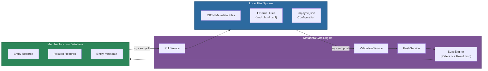
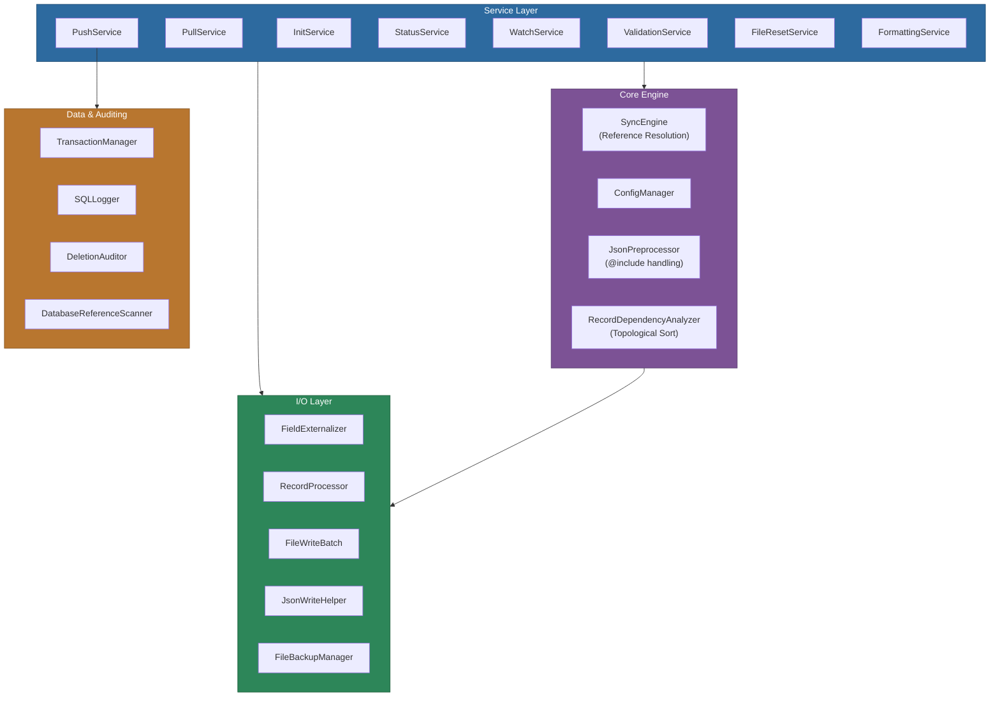
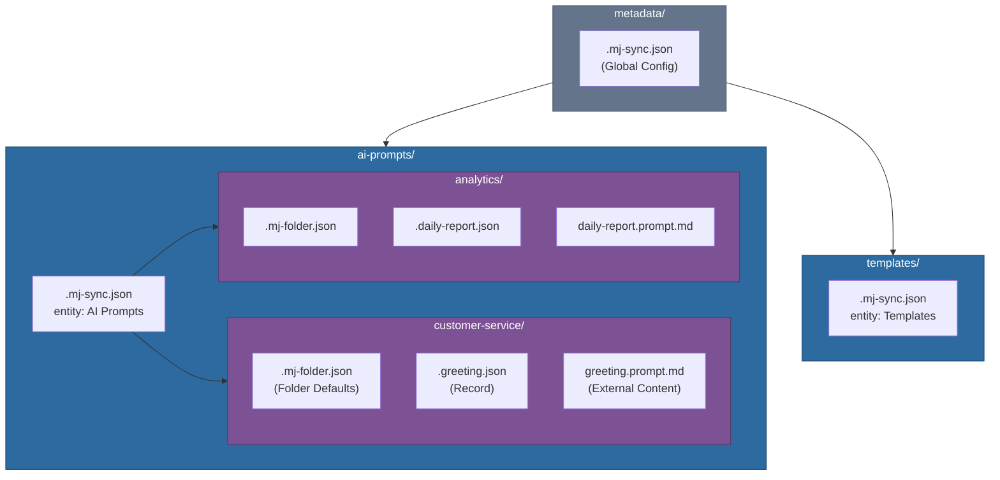
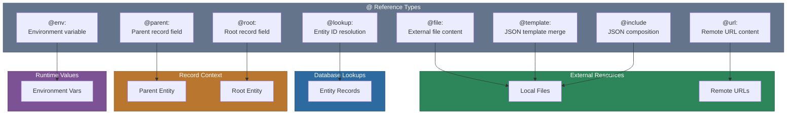
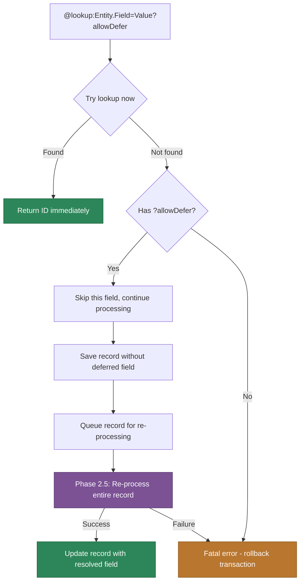
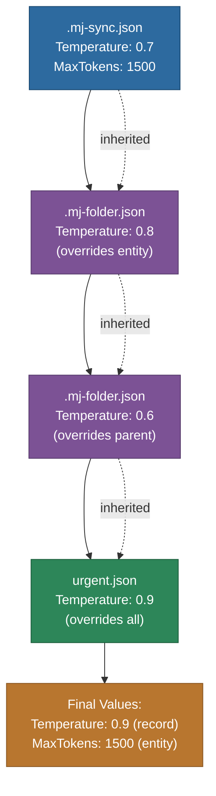
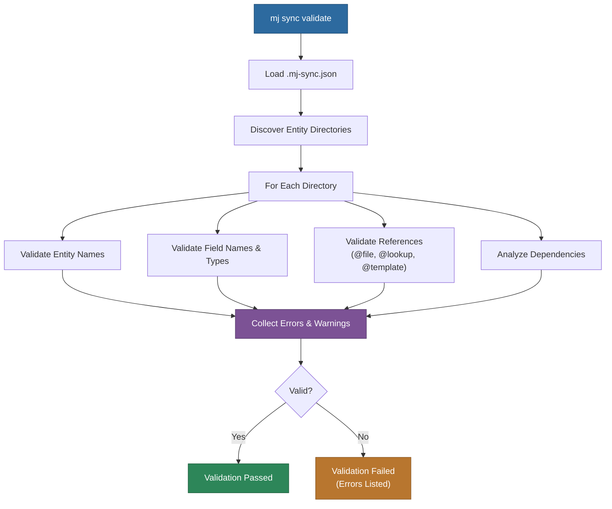

# @memberjunction/metadata-sync

A library for synchronizing MemberJunction database metadata with local file system representations. This library is integrated into the MemberJunction CLI (`mj`) and is accessed through `mj sync` commands. It enables developers and non-technical users to manage MJ metadata using their preferred editors and version control systems while maintaining the database as the source of truth.

## Installation

MetadataSync is included with the MemberJunction CLI. Install the CLI globally:

```bash
npm install -g @memberjunction/cli
```

Then use the sync commands:
```bash
mj sync --help
```

## Overview

MemberJunction is a powerful metadata-driven system where configuration, business logic, AI prompts, templates, and more are stored as metadata in the database. This approach provides tremendous flexibility and runtime configurability, but it can create friction in modern development workflows.

The Metadata Sync tool bridges the gap between database-stored metadata and file-based workflows by:
- Pulling metadata entities from database to JSON files with external file support
- Pushing local file changes back to the database
- Supporting embedded collections for related entities
- Enabling version control for all MJ metadata through Git
- Supporting CI/CD workflows for metadata deployment
- Providing a familiar file-based editing experience



### Why This Tool Matters

**For Developers:**
- **Full IDE Support**: Edit complex prompts and templates with syntax highlighting, IntelliSense, and all your favorite editor features
- **Version Control**: Track every change with Git -- see diffs, blame, history, and collaborate through pull requests
- **Branch-based Development**: Work on features in isolation, test changes, and merge when ready
- **CI/CD Integration**: Automatically deploy metadata changes as code moves through environments
- **Bulk Operations**: Use familiar command-line tools (grep, sed, find) to make sweeping changes
- **Offline Development**: Work on metadata without database connectivity

**For Non-Technical Users:**
- **Familiar Tools**: Edit prompts in Word, Notepad++, or any text editor
- **No Database Access Needed**: IT can set up sync, users just edit files
- **Folder Organization**: Intuitive file/folder structure instead of database IDs
- **Easy Sharing**: Send prompt files via email or shared drives
- **Simple Backups**: Copy/paste folders for personal backups

**For Organizations:**
- **Migration Path**: Metadata flows naturally from dev to staging to production with code
- **Compliance**: Full audit trail through version control
- **Collaboration**: Multiple team members can work on different metadata simultaneously
- **Disaster Recovery**: File-based backups complement database backups
- **Cross-System Sync**: Export from one MJ instance, import to another

### The Best of Both Worlds

This tool preserves the power of MJ's metadata-driven architecture while adding the convenience of file-based workflows. The database remains the source of truth for runtime operations, while files become the medium for creation, editing, and deployment.

## Key Features

### Hybrid File Storage
- **JSON files**: Store structured metadata for entities
- **External files**: Store large text fields (prompts, templates, etc.) in appropriate formats (.md, .html, .sql)
- **File references**: Use `@file:filename.ext` to link external files from JSON

### Embedded Collections
- **Related Entities**: Store related records as arrays within parent JSON files
- **Hierarchical References**: Use `@parent:` and `@root:` to reference parent/root entity fields
- **Automatic Metadata**: Related entities maintain their own primaryKey and sync metadata
- **Nested Support**: Support for multiple levels of nested relationships

### Synchronization Operations
- **Pull**: Download metadata from database to local files
  - Optionally pull related entities based on configuration
  - Filter support for selective pulling
- **Push**: Upload local file changes to database
  - Process embedded collections automatically
  - Verbose mode (`-v`) for detailed output
  - Directory filtering with `--include` and `--exclude` options
- **Status**: Show what would change without making modifications
  - Directory filtering with `--include` and `--exclude` options

### Directory Filtering
- **Selective Processing**: Use `--include` or `--exclude` to filter which entity directories are processed
- **Pattern Support**: Supports glob patterns like `ai-*`, `*-test`, etc.
- **Mutually Exclusive**: Cannot use both `--include` and `--exclude` together

### Development Workflow Integration
- Watch mode for automatic syncing during development
- Dry-run mode to preview changes
- CI/CD mode for automated deployments
- Integration with existing mj.config.cjs configuration

## Architecture



## Supported Entities

The tool works with any MemberJunction entity -- both core system entities and user-created entities. Each entity type can have its own directory structure, file naming conventions, and related entity configurations.

### Important Limitation: Database-Reflected Metadata

**This tool should NOT be used to modify metadata that is reflected from the underlying database catalog.** Examples include:
- Entity field data types
- Column lengths/precision
- Primary key definitions
- Foreign key relationships
- Table/column existence

These properties are designed to flow **from** the database catalog **up** into MJ metadata, not the other way around. Attempting to modify these via file sync could create inconsistencies between the metadata and actual database schema.

The tool is intended for managing business-level metadata such as:
- Descriptions and documentation
- Display names and user-facing text
- Categories and groupings
- Custom properties and settings
- AI prompts, templates, and other content
- Permissions and security settings
- Any other data that is not reflected **up** from the underlying system database catalogs

For more information about how CodeGen reflects system-level data from the database into the MJ metadata layer, see the [CodeGen documentation](../CodeGen/README.md).

## File Structure

The tool uses a hierarchical directory structure with cascading defaults:
- Each top-level directory represents an entity type
- `.mj-sync.json` files define entities and base defaults
- `.mj-folder.json` files define folder-specific defaults (optional)
- Metadata JSON files follow the `filePattern` configured in `.mj-sync.json`
- External files (`.md`, `.html`, etc.) are referenced from the JSON files
- Defaults cascade down through the folder hierarchy



### Example Structure
```
metadata/
+-- .mj-sync.json                    # Global sync configuration
+-- ai-prompts/
|   +-- .mj-sync.json               # Defines entity: "AI Prompts"
|   +-- customer-service/
|   |   +-- .mj-folder.json         # Folder metadata (CategoryID, etc.)
|   |   +-- .greeting.json          # AI Prompt record with embedded models
|   |   +-- greeting.prompt.md      # Prompt content (referenced)
|   |   +-- greeting.notes.md       # Notes field (referenced)
|   +-- analytics/
|       +-- .mj-folder.json         # Folder metadata (CategoryID, etc.)
|       +-- .daily-report.json      # AI Prompt record
|       +-- daily-report.prompt.md  # Prompt content (referenced)
+-- templates/                       # Reusable JSON templates
|   +-- standard-prompt-settings.json
|   +-- standard-ai-models.json
+-- template-entities/
    +-- .mj-sync.json               # Defines entity: "Templates"
    +-- email/
    |   +-- .mj-folder.json
    |   +-- .welcome.json
    |   +-- welcome.template.html
    +-- reports/
        +-- .mj-folder.json
        +-- .invoice.json
        +-- invoice.template.html
```

### File Format Options

#### Single Record per File (Default)
Each JSON file contains one record:
```json
{
  "fields": { ... },
  "relatedEntities": { ... }
}
```

#### Multiple Records per File
JSON files can contain arrays of records:
```json
[
  {
    "fields": { ... },
    "relatedEntities": { ... }
  },
  {
    "fields": { ... },
    "relatedEntities": { ... }
  }
]
```

This is useful for grouping related records in a single file, reducing file clutter for entities with many small records, and maintaining logical groupings while using `@file:` references for large content.

## JSON Metadata Format

### Individual Record
```json
{
  "fields": {
    "Name": "Customer Greeting",
    "Description": "Friendly customer service greeting",
    "TypeID": "@lookup:AI Prompt Types.Name=Chat",
    "CategoryID": "@lookup:AI Prompt Categories.Name=Customer Service",
    "Temperature": 0.7,
    "MaxTokens": 1000,
    "Prompt": "@file:greeting.prompt.md",
    "Notes": "@file:../shared/notes/greeting-notes.md",
    "SystemPrompt": "@url:https://raw.githubusercontent.com/company/prompts/main/system/customer-service.md"
  },
  "primaryKey": {
    "ID": "550e8400-e29b-41d4-a716-446655440000"
  },
  "sync": {
    "lastModified": "2024-01-15T10:30:00Z",
    "checksum": "sha256:abcd1234..."
  }
}
```

### Record with Embedded Collections
```json
{
  "fields": {
    "Name": "Customer Service Chat",
    "Description": "Main customer service prompt",
    "TypeID": "@lookup:AI Prompt Types.Name=Chat",
    "TemplateText": "@file:customer-service.md",
    "Status": "Active"
  },
  "relatedEntities": {
    "MJ: AI Prompt Models": [
      {
        "fields": {
          "PromptID": "@parent:ID",
          "ModelID": "@lookup:AI Models.Name=GPT 4.1",
          "VendorID": "@lookup:MJ: AI Vendors.Name=OpenAI",
          "Priority": 1,
          "Status": "Active"
        },
        "primaryKey": {
          "ID": "BFA2433E-F36B-1410-8DB0-00021F8B792E"
        },
        "sync": {
          "lastModified": "2025-06-07T17:18:31.687Z",
          "checksum": "a642ebea748cb1f99467af2a7e6f4ffd3649761be27453b988af973bed57f070"
        }
      },
      {
        "fields": {
          "PromptID": "@parent:ID",
          "ModelID": "@lookup:AI Models.Name=Claude 4 Sonnet",
          "Priority": 2,
          "Status": "Active"
        }
      }
    ]
  },
  "primaryKey": {
    "ID": "C2A1433E-F36B-1410-8DB0-00021F8B792E"
  },
  "sync": {
    "lastModified": "2025-06-07T17:18:31.698Z",
    "checksum": "7cbd241cbf0d67c068c1434e572a78c87bb31751cbfe7734bfd32f8cea17a2c9"
  }
}
```

### Composite Primary Key Example
```json
{
  "primaryKey": {
    "UserID": "550e8400-e29b-41d4-a716-446655440000",
    "RoleID": "660f9400-f39c-51e5-b827-557766551111"
  },
  "fields": {
    "GrantedAt": "2024-01-15T10:30:00Z",
    "GrantedBy": "@lookup:Users.Email=admin@company.com",
    "ExpiresAt": "2025-01-15T10:30:00Z",
    "Notes": "@file:user-role-notes.md"
  },
  "sync": {
    "lastModified": "2024-01-15T10:30:00Z",
    "checksum": "sha256:abcd1234..."
  }
}
```

### Reserved Keys

| Key | Purpose |
|-----|---------|
| `fields` | Entity field values |
| `relatedEntities` | Embedded related entity records |
| `primaryKey` | Record identifier |
| `sync` | Sync metadata (lastModified, checksum) |
| `__mj_sync_notes` | System-managed resolution tracking |
| `deleteRecord` | Deletion directive |

Any key that is not one of the reserved keys above is preserved but ignored during sync operations. By convention, use an underscore prefix (`_`) for comment keys:

```json
{
  "_comments": [
    "This file configures encryption settings for the Test Tables entity"
  ],
  "fields": {
    "Name": "Test Tables",
    "BaseView": "vwTestTables"
  },
  "primaryKey": {
    "ID": "0fde4c2c-26b1-45e9-b504-5d4a6f4201cf"
  }
}
```

## Special Reference Types

The tool supports special reference types that can be used in any field that accepts text content. These references are processed during push/pull operations to handle external content, lookups, and environment-specific values.



### @file: References
When a field value starts with `@file:`, the tool will:
1. Read content from the specified file for push operations
2. Write content to the specified file for pull operations
3. Track both files for change detection
4. **For JSON files**: Automatically process any `@include` directives within them

Examples:
- `@file:greeting.prompt.md` -- File in same directory as JSON
- `@file:./shared/common-prompt.md` -- Relative path
- `@file:../templates/standard-header.md` -- Parent directory reference
- `@file:spec.json` -- JSON file with `@include` directives (processed automatically)

### @url: References
When a field value starts with `@url:`, the tool will:
1. Fetch content from the URL during push operations
2. Cache the content with appropriate headers
3. Support both HTTP(S) and file:// protocols

Examples:
- `@url:https://example.com/prompts/greeting.md` -- Remote content
- `@url:https://raw.githubusercontent.com/company/prompts/main/customer.md` -- GitHub raw content

### @lookup: References
Enable entity relationships using human-readable values:
- Basic syntax: `@lookup:EntityName.FieldName=Value`
- Multi-field syntax: `@lookup:EntityName.Field1=Value1&Field2=Value2`
- Auto-create syntax: `@lookup:EntityName.FieldName=Value?create`
- With additional fields: `@lookup:EntityName.FieldName=Value?create&Field2=Value2`
- Deferred lookup syntax: `@lookup:EntityName.FieldName=Value?allowDefer`
- Combined flags: `@lookup:EntityName.FieldName=Value?create&allowDefer`

Examples:
- `@lookup:AI Prompt Types.Name=Chat` -- Single field lookup, fails if not found
- `@lookup:Users.Email=john@example.com&Department=Sales` -- Multi-field lookup for precise matching
- `@lookup:AI Prompt Categories.Name=Examples?create` -- Creates if missing
- `@lookup:AI Prompt Categories.Name=Examples?create&Description=Example prompts` -- Creates with description
- `@lookup:Dashboards.Name=Data Explorer?allowDefer` -- Defers lookup if not found, retries at end of push

#### Multi-Field Lookups
When you need to match records based on multiple criteria, use the multi-field syntax:
```json
{
  "CategoryID": "@lookup:AI Prompt Categories.Name=Actions&Status=Active",
  "ManagerID": "@lookup:Users.Email=manager@company.com&Department=Engineering&Status=Active"
}
```

#### Deferred Lookups (?allowDefer)

The `?allowDefer` flag enables handling of circular dependencies between entities during push operations. Use this when Entity A references Entity B and Entity B references Entity A -- or any situation where a lookup target might not exist yet during initial processing.

**How it works:**

The flag is permission-based, not imperative. The lookup is always attempted first, and only deferred if it fails:



**When to use `?allowDefer`:**
- When Entity A references Entity B, and Entity B references Entity A
- When you are creating related records that need to reference each other
- When the lookup target might not exist yet during initial processing

**Processing phases:**
1. During the initial push phase, if a lookup with `?allowDefer` fails (record not found), the **field is skipped** but the record still saves
2. The record IS saved during the initial pass (without the deferred field value), allowing other records to reference it
3. The record is queued for re-processing in Phase 2.5
4. After all other records are processed, deferred records are re-processed using the exact same logic
5. If retry succeeds, the record is updated with the resolved field; if it fails, an error is reported and the transaction rolls back

**Example: Application / Dashboard circular reference**

The Applications entity can have `DefaultNavItems` (a JSON field) that contains nested references to Dashboards, while Dashboards have an `ApplicationID` that references Applications.

Since Applications are processed before Dashboards (alphabetical order), the Dashboard lookup in `DefaultNavItems` needs `?allowDefer`:

```json
// .data-explorer-application.json
{
  "fields": {
    "Name": "Data Explorer",
    "DefaultNavItems": [
      {
        "Label": "Explorer",
        "ResourceType": "Dashboard",
        "RecordID": "@lookup:Dashboards.Name=Data Explorer?allowDefer"
      }
    ]
  }
}

// .data-explorer-dashboard.json
// Note: No ?allowDefer needed - Applications are processed first
{
  "fields": {
    "Name": "Data Explorer",
    "ApplicationID": "@lookup:Applications.Name=Data Explorer"
  }
}
```

**Combining flags:**
You can combine `?allowDefer` with `?create`:
```json
"CategoryID": "@lookup:Categories.Name=New Category?create&allowDefer"
```
This means: "Look up the category, create if missing, and if the lookup still fails for some reason, defer it."

**Important notes:**
- Deferred records are processed before the final commit (Phase 2.5)
- If any deferred record fails on retry, the entire push transaction is rolled back
- Use sparingly -- only for genuine circular dependencies
- The record must have a primaryKey defined in the metadata file

### @parent: References
Reference fields from the immediate parent entity in embedded collections:
- `@parent:ID` -- Get the parent's ID field
- `@parent:Name` -- Get the parent's Name field
- Works with any field from the parent entity

### @root: References
Reference fields from the root entity in nested structures:
- `@root:ID` -- Get the root entity's ID
- `@root:CategoryID` -- Get the root's CategoryID
- Useful for deeply nested relationships

### @env: References
Support environment-specific values:
- `@env:VARIABLE_NAME`
- Useful for different environments (dev/staging/prod)

### Primary Key Handling
The tool automatically detects primary key fields from entity metadata:
- **Single primary keys**: Most common, stored as `{"ID": "value"}` or `{"CustomKeyName": "value"}`
- **Composite primary keys**: Multiple fields that together form the primary key
- **Auto-detection**: Tool reads entity metadata to determine primary key structure
- **Reference support**: Primary key values can use `@lookup`, `@parent`, and other reference types

#### Using @lookup in Primary Keys
You can use `@lookup` references in primary key fields to avoid hardcoding GUIDs. This is especially useful when decorating existing records:

```json
{
  "fields": {
    "Encrypt": true,
    "AllowDecryptInAPI": false
  },
  "primaryKey": {
    "ID": "@lookup:Entity Fields.EntityID=@lookup:Entities.Name=Test Tables&Name=ServerOnlyEncrypted"
  }
}
```

In this example:
1. The inner `@lookup:Entities.Name=Test Tables` resolves to the Entity ID
2. That ID is used to find the Entity Field with the matching `EntityID` and `Name`
3. The resulting Entity Field ID becomes the primary key

**Note:** Primary key lookups must resolve immediately -- the `?allowDefer` flag is not supported in primary key fields since the primary key is needed to determine if a record exists.

### Automatic JSON Stringification with Reference Processing

When a field value is an array or object, the tool automatically:
1. **Recursively processes** all `@lookup:`, `@file:`, `@parent:`, `@root:` references inside the object
2. **Converts to JSON string** with pretty formatting (2-space indentation) for database storage
3. **Maintains clean structure** in source files while storing as strings in database

This is useful for JSON-typed fields like `Configuration`, `Settings`, `Metadata`, etc.

```json
{
  "fields": {
    "Name": "Agent Memory Manager Job",
    "CronExpression": "0 */15 * * * *",
    "Configuration": {
      "AgentID": "@lookup:AI Agents.Name=Memory Manager",
      "InitialMessage": "Analyze recent conversations",
      "Settings": {
        "MaxNotes": 5,
        "Strategy": "Relevant",
        "TargetAgentID": "@lookup:AI Agents.Name=Sage"
      }
    }
  }
}
```

When pushed to the database, the `Configuration` field is resolved (lookups become GUIDs) and stringified as JSON for storage.

### deleteRecord Directive
The tool supports deleting records from the database using a special `deleteRecord` directive in JSON files:

```json
{
  "fields": {
    "Name": "Obsolete Prompt",
    "Description": "This prompt is no longer needed"
  },
  "primaryKey": {
    "ID": "550e8400-e29b-41d4-a716-446655440000"
  },
  "deleteRecord": {
    "delete": true
  }
}
```

After successfully deleting the record, the tool updates the JSON file with a `deletedAt` timestamp. Important notes:
- **Primary key required**: You must specify the `primaryKey` to identify which record to delete
- **One-time operation**: Once `deletedAt` is set, the deletion will not be attempted again
- **SQL logging**: Delete operations are included in SQL logs when enabled
- **Foreign key constraints**: Deletions may fail if other records reference this record
- **Dry-run support**: Use `--dry-run` to preview what would be deleted
- **Takes precedence**: If `deleteRecord` is present, normal create/update operations are skipped

## Content Composition

### {@include} References in Files
Enable content composition within non-JSON files (like .md, .html, .txt) using JSDoc-style include syntax:
- Pattern: `{@include path/to/file.ext}`
- Supports relative paths from the containing file
- Recursive includes (includes within includes)
- Circular reference detection prevents infinite loops
- Works seamlessly with `@file:` references

```markdown
# My Prompt Template

## System Instructions
{@include ./shared/system-instructions.md}

## Context
{@include ../common/context-header.md}

## Task
Please analyze the following...
```

### @include References in JSON Files

Enable modular JSON composition by including external JSON files directly into your metadata files:

**Object Context -- Property Spreading (Default)**
```json
{
  "name": "Parent Record",
  "@include": "child.json",
  "description": "Additional fields"
}
```

**Multiple Includes with Dot Notation (Eliminates VS Code Warnings)**
```json
{
  "name": "Parent Record",
  "@include.data": "shared/data-fields.json",
  "description": "Middle field",
  "@include.config": "shared/config-fields.json",
  "status": "Active"
}
```
Use dot notation (`@include.anything`) to include multiple files at different positions in your object. The part after the dot is ignored by the processor but makes each key unique, eliminating VS Code's duplicate key warnings.

**Array Context -- Element Insertion**
```json
[
  {"name": "First item"},
  "@include:child.json",
  {"name": "Last item"}
]
```

**Explicit Mode Control**
```json
{
  "@include": {
    "file": "child.json",
    "mode": "spread"
  }
}
```

#### Modes

- **"spread" mode**: Merges all properties from the included file into the parent object. Only works when including an object into an object. Parent properties override child properties on conflict. This is the default mode for objects.
- **"element" mode**: Directly inserts the JSON content at that position. Works with any JSON type (object, array, string, number, etc.). Default mode for arrays when using string syntax.

#### Path Resolution
- All paths are relative to the file containing the @include
- Supports: `"child.json"`, `"./child.json"`, `"../shared/base.json"`, `"subfolder/config.json"`
- Circular references are detected and prevented

#### Processing Order
1. `@include` directives are processed first (recursively)
2. `@file` references are recursively resolved (including nested ones in JSON)
3. Then `@template` references
4. Finally, other `@` references (`@lookup`, etc.)

This ensures that included content can contain other special references that will be properly resolved.

### @template: References
Enable JSON template composition for reusable configurations:

**String Template Reference:**
```json
{
  "relatedEntities": {
    "MJ: AI Prompt Models": "@template:templates/standard-ai-models.json"
  }
}
```

**Object Template Merging:**
```json
{
  "fields": {
    "Name": "My Prompt",
    "@template": "templates/standard-prompt-settings.json",
    "Temperature": 0.9
  }
}
```

**Multiple Template Merging** (later templates override earlier ones):
```json
{
  "fields": {
    "@template": [
      "templates/base-settings.json",
      "templates/customer-service-defaults.json"
    ],
    "Name": "Customer Bot"
  }
}
```

## Default Value Inheritance

The tool implements a cascading inheritance system for field defaults, similar to CSS or OOP inheritance:

1. **Entity-level defaults** (in `.mj-sync.json`) -- Base defaults for all records
2. **Folder-level defaults** (in `.mj-folder.json`) -- Override/extend entity defaults
3. **Nested folder defaults** -- Override/extend parent folder defaults
4. **Record-level values** -- Override all inherited defaults



### Inheritance Example
```
ai-prompts/.mj-sync.json           -> Temperature: 0.7, MaxTokens: 1500
+-- customer-service/.mj-folder.json -> Temperature: 0.8 (overrides)
|   +-- greeting.json               -> Uses Temperature: 0.8, MaxTokens: 1500
|   +-- escalation/.mj-folder.json  -> Temperature: 0.6 (overrides again)
|       +-- urgent.json             -> Temperature: 0.9 (record override)
```

## Resolution Tracking with `__mj_sync_notes`

When you use `@lookup` or `@parent` references in your metadata files, MetadataSync can track how these references were resolved during push operations. This information is written to a `__mj_sync_notes` key in each record, providing transparency into the resolution process.

**Note:** This feature is **disabled by default** to keep metadata files clean. Enable it when you need to debug lookup resolutions or understand how references are being resolved.

### Enabling Resolution Tracking

Add `emitSyncNotes` to your `.mj-sync.json` configuration:

**Root-level configuration** (applies to all entity directories):
```json
{
  "version": "1.0",
  "emitSyncNotes": true,
  "directoryOrder": ["..."]
}
```

**Entity-level override** (in an entity directory's `.mj-sync.json`):
```json
{
  "entity": "AI Prompts",
  "emitSyncNotes": true
}
```

The inheritance works as follows:
- Entity-level `emitSyncNotes` takes precedence if explicitly set
- If not set at entity level, inherits from root `.mj-sync.json`
- Defaults to `false` if not set anywhere

### Example Output

```json
{
  "fields": {
    "Name": "ServerOnlyEncrypted",
    "Encrypt": true,
    "EncryptionKeyID": "@lookup:MJ: Encryption Keys.Name=Test Encryption Key"
  },
  "primaryKey": {
    "ID": "@lookup:Entity Fields.EntityID=@lookup:Entities.Name=Test Tables&Name=ServerOnlyEncrypted"
  },
  "sync": {
    "lastModified": "2025-12-25T16:14:32.605Z",
    "checksum": "7e989e08396f6cffb8b2d70958018b21..."
  },
  "__mj_sync_notes": [
    {
      "type": "lookup",
      "field": "primaryKey.ID",
      "expression": "@lookup:Entity Fields.EntityID=@lookup:Entities.Name=Test Tables&Name=ServerOnlyEncrypted",
      "resolved": "F501E294-5F5F-44C6-AD06-5C9754A13D29",
      "nested": [
        {
          "expression": "@lookup:Entities.Name=Test Tables",
          "resolved": "0fde4c2c-26b1-45e9-b504-5d4a6f4201cf"
        }
      ]
    },
    {
      "type": "lookup",
      "field": "fields.EncryptionKeyID",
      "expression": "@lookup:MJ: Encryption Keys.Name=Test Encryption Key",
      "resolved": "85B814C8-A01B-4AE3-A252-DC9D54C914C7"
    }
  ]
}
```

### Note Structure

| Field | Description |
|-------|-------------|
| `type` | Resolution type: `"lookup"` for `@lookup` references, `"parent"` for `@parent` references |
| `field` | Field path where the resolution occurred (e.g., `"primaryKey.ID"`, `"fields.CategoryID"`) |
| `expression` | The original reference expression before resolution |
| `resolved` | The resolved value (typically a GUID) |
| `nested` | (Optional) Array of nested resolutions for expressions containing nested `@lookup` references |

The `__mj_sync_notes` key uses a double underscore prefix (`__`) to clearly indicate it is system-managed. Do not manually edit this section -- it is regenerated on each push when `emitSyncNotes` is enabled.

## CLI Commands

All MetadataSync functionality is accessed through the MemberJunction CLI (`mj`) under the `sync` namespace:

```bash
# Initialize a directory for metadata sync
mj sync init

# Validate metadata files
mj sync validate
mj sync validate --dir="./metadata"
mj sync validate --verbose
mj sync validate --format=json
mj sync validate --save-report

# Pull metadata from database to files
mj sync pull --entity="AI Prompts"
mj sync pull --entity="AI Prompts" --filter="CategoryID='customer-service-id'"
mj sync pull --entity="AI Prompts" --multi-file="all-prompts"

# Push local changes to database
mj sync push
mj sync push --dir="ai-prompts"
mj sync push -v
mj sync push --dry-run
mj sync push --parallel-batch-size=20

# Directory filtering
mj sync push --exclude="actions"
mj sync push --exclude="actions,templates"
mj sync push --exclude="*-test,*-old"
mj sync push --include="prompts,agent-types"
mj sync push --include="ai-*"

# Status and watch
mj sync status
mj sync watch

# CI/CD mode
mj sync push --ci

# Skip validation
mj sync push --no-validate

# Reset file checksums
mj sync file-reset
```

## Configuration

The tool uses the existing `mj.config.cjs` for database configuration and a hierarchical structure of `.mj-sync.json` and `.mj-folder.json` files for sync behavior.

### Root Configuration (metadata/.mj-sync.json)
```json
{
  "version": "1.0.0",
  "directoryOrder": [
    "prompts",
    "agent-types"
  ],
  "ignoreDirectories": [
    "output",
    "examples"
  ],
  "push": {
    "validateBeforePush": true,
    "requireConfirmation": true,
    "autoCreateMissingRecords": false,
    "alwaysPush": false
  },
  "sqlLogging": {
    "enabled": true,
    "outputDirectory": "./sql_logging",
    "formatAsMigration": false,
    "filterPatterns": ["*EntityFieldValue*"],
    "filterType": "exclude"
  },
  "userRoleValidation": {
    "enabled": true,
    "allowedRoles": ["Administrator", "Developer"],
    "allowUsersWithoutRoles": false
  },
  "watch": {
    "debounceMs": 1000,
    "ignorePatterns": ["*.tmp", "*.bak"]
  },
  "emitSyncNotes": false
}
```

### Entity Configuration (metadata/ai-prompts/.mj-sync.json)
```json
{
  "entity": "AI Prompts",
  "filePattern": "*.json",
  "defaults": {
    "TypeID": "@lookup:AI Prompt Types.Name=Chat",
    "Temperature": 0.7,
    "MaxTokens": 1500,
    "Status": "Active"
  },
  "pull": {
    "filePattern": "*.json",
    "updateExistingRecords": true,
    "createNewFileIfNotFound": true,
    "mergeStrategy": "merge",
    "filter": "Status = 'Active'",
    "externalizeFields": [
      {
        "field": "Prompt",
        "pattern": "@file:{Name}.prompt.md"
      }
    ],
    "relatedEntities": {
      "MJ: AI Prompt Models": {
        "entity": "MJ: AI Prompt Models",
        "foreignKey": "PromptID",
        "filter": "Status = 'Active'"
      }
    }
  }
}
```

### Folder Defaults (metadata/ai-prompts/customer-service/.mj-folder.json)
```json
{
  "defaults": {
    "CategoryID": "@lookup:AI Prompt Categories.Name=Customer Service",
    "Temperature": 0.8,
    "Tags": ["customer-service", "support"]
  }
}
```

### Push Configuration Options

#### autoCreateMissingRecords

When set to `true`, the push command automatically creates records when a primaryKey is specified but the record does not exist in the database. Useful when migrating data between environments or restoring records from backups.

```json
{
  "push": {
    "autoCreateMissingRecords": true
  }
}
```

#### alwaysPush

When set to `true`, forces ALL records to be saved to the database regardless of their dirty state. This bypasses the normal dirty checking mechanism.

Use cases:
- Ensuring complete synchronization after database restoration
- Bypassing dirty detection issues
- Force refreshing all database records with file content

```json
{
  "push": {
    "alwaysPush": true
  }
}
```

**Note**: This flag should be used judiciously as it causes database writes for all records. Enable temporarily when needed, then disable for normal operations.

### Directory Processing Order

Directory order is configured in the root-level `.mj-sync.json` file only (not inherited by subdirectories):

```json
{
  "version": "1.0.0",
  "directoryOrder": [
    "prompts",
    "agent-types"
  ]
}
```

- Directories listed in `directoryOrder` are processed first, in the specified order
- Remaining directories are processed after the ordered ones, in alphabetical order
- Use this to ensure parent entities are created before children that reference them

### Ignore Directories

Ignore directories are configured in `.mj-sync.json` files and are **cumulative** through the directory hierarchy:

```json
{
  "version": "1.0.0",
  "ignoreDirectories": [
    "output",
    "examples",
    "templates"
  ]
}
```

Child directories inherit parent ignore patterns and can add their own.

### SQL Logging

SQL logging captures all database operations during push commands for creating migration files, debugging, and deployment:

```json
{
  "sqlLogging": {
    "enabled": true,
    "outputDirectory": "./sql_logging",
    "formatAsMigration": true,
    "filterPatterns": ["*AIPrompt*", "/^EXEC sp_/i"],
    "filterType": "exclude"
  }
}
```

| Option | Type | Default | Description |
|--------|------|---------|-------------|
| `enabled` | boolean | false | Enable SQL logging during push operations |
| `outputDirectory` | string | "./sql_logging" | Directory for SQL log files |
| `formatAsMigration` | boolean | false | Format as Flyway migration files |
| `filterPatterns` | string[] | undefined | Patterns to filter SQL statements |
| `filterType` | "exclude" or "include" | "exclude" | How to apply filter patterns |

**Filter Pattern Types:**
- **Regex patterns**: Start with `/` and optionally end with flags (e.g., `/spCreate.*Run/i`)
- **Simple wildcards**: Use `*` as a wildcard (e.g., `*AIPrompt*`)

### User Role Validation

Validates UserID fields against specific roles in the MemberJunction system:

```json
{
  "userRoleValidation": {
    "enabled": true,
    "allowedRoles": [
      "Administrator",
      "Developer",
      "Content Manager"
    ],
    "allowUsersWithoutRoles": false
  }
}
```

| Option | Type | Default | Description |
|--------|------|---------|-------------|
| `enabled` | boolean | false | Enable user role validation |
| `allowedRoles` | string[] | [] | Role names that are allowed |
| `allowUsersWithoutRoles` | boolean | false | Allow users without any assigned roles |

## Pull Configuration

The pull command supports smart update capabilities with extensive configuration options:

```json
{
  "entity": "AI Prompts",
  "filePattern": "*.json",
  "pull": {
    "filePattern": "*.json",
    "createNewFileIfNotFound": true,
    "newFileName": ".all-new.json",
    "appendRecordsToExistingFile": true,
    "updateExistingRecords": true,
    "preserveFields": ["customField", "localNotes"],
    "mergeStrategy": "merge",
    "backupBeforeUpdate": true,
    "filter": "Status = 'Active'",
    "externalizeFields": [
      {
        "field": "TemplateText",
        "pattern": "@file:{Name}.template.md"
      }
    ],
    "excludeFields": ["InternalID", "TempField"],
    "lookupFields": {
      "CategoryID": {
        "entity": "AI Prompt Categories",
        "field": "Name"
      }
    },
    "relatedEntities": {
      "MJ: AI Prompt Models": {
        "entity": "MJ: AI Prompt Models",
        "foreignKey": "PromptID",
        "filter": "Status = 'Active'"
      }
    },
    "ignoreNullFields": false,
    "ignoreVirtualFields": false
  }
}
```

### Pull Configuration Options

| Option | Type | Default | Description |
|--------|------|---------|-------------|
| `filePattern` | string | Entity filePattern | Pattern for finding existing files |
| `createNewFileIfNotFound` | boolean | true | Create files for records not found locally |
| `newFileName` | string | -- | Filename for new records when appending |
| `appendRecordsToExistingFile` | boolean | false | Append new records to a single file |
| `updateExistingRecords` | boolean | true | Update existing records in local files |
| `preserveFields` | string[] | [] | Fields that retain local values during updates |
| `mergeStrategy` | string | "merge" | How to merge: "merge", "overwrite", or "skip" |
| `backupBeforeUpdate` | boolean | false | Create timestamped backups before updates |
| `backupDirectory` | string | ".backups" | Directory for backup files |
| `filter` | string | -- | SQL WHERE clause for filtering records |
| `externalizeFields` | array/object | -- | Fields to save as external files |
| `excludeFields` | string[] | [] | Fields to omit from pulled data |
| `lookupFields` | object | -- | Foreign keys to convert to @lookup references |
| `relatedEntities` | object | -- | Related entities to pull as embedded collections |
| `ignoreNullFields` | boolean | false | Exclude fields with null values |
| `ignoreVirtualFields` | boolean | false | Exclude virtual fields (view-only fields) |

### Merge Strategies

- **`merge`** (default): Combines fields from database and local file, with database values taking precedence for existing fields
- **`overwrite`**: Completely replaces local record with database version (except preserved fields)
- **`skip`**: Leaves existing records unchanged, only adds new records

### Understanding excludeFields vs preserveFields

| | excludeFields | preserveFields |
|--|---------------|----------------|
| **Purpose** | Completely omit fields from files | Protect local values from overwrite |
| **Use Case** | Remove system/internal fields | Keep custom local modifications |
| **Effect** | Fields never appear in JSON | Fields exist but retain local values |
| **Example** | Internal IDs, timestamps | Custom file paths, local notes |

When a preserved field contains a `@file:` reference, the tool updates the content at the existing file path rather than creating a new file with a generated name.

### Externalize Fields Patterns

The `externalizeFields` configuration supports dynamic file naming with placeholders:

```json
"externalizeFields": [
  {
    "field": "TemplateText",
    "pattern": "@file:{Name}.template.md"
  },
  {
    "field": "SQLQuery",
    "pattern": "@file:queries/{CategoryName}/{Name}.sql"
  }
]
```

Supported placeholders:
- `{Name}` -- The entity's name field value
- `{ID}` -- The entity's primary key
- `{FieldName}` -- The field being externalized
- `{AnyFieldName}` -- Any field from the entity record

All values are sanitized for filesystem compatibility (lowercase, spaces to hyphens, special characters removed).

### Virtual Fields Configuration

The `ignoreVirtualFields` option controls whether virtual fields (computed view-only fields) are included in pulled data.

With `ignoreVirtualFields: false` (default):
```json
{
  "fields": {
    "Name": "Test Action",
    "CategoryID": "@lookup:Action Categories.Name=System",
    "Category": "System",
    "UserID": "123",
    "User": "John Smith"
  }
}
```

With `ignoreVirtualFields: true`:
```json
{
  "fields": {
    "Name": "Test Action",
    "CategoryID": "@lookup:Action Categories.Name=System",
    "UserID": "123"
  }
}
```

## Embedded Collections

The tool supports managing related entities as embedded collections within parent JSON files:

```json
{
  "fields": {
    "Name": "Parent Entity"
  },
  "relatedEntities": {
    "Child Entity": [
      {
        "fields": {
          "ParentID": "@parent:ID",
          "Name": "Child 1"
        },
        "relatedEntities": {
          "Grandchild Entity": [
            {
              "fields": {
                "ChildID": "@parent:ID",
                "RootID": "@root:ID",
                "Name": "Grandchild 1"
              }
            }
          ]
        }
      }
    ]
  }
}
```

Benefits:
- **Single File Management**: Keep related data together
- **Atomic Operations**: Parent and children sync together
- **Cleaner Organization**: Fewer files to manage
- **Relationship Clarity**: Visual representation of data relationships

## Recursive Patterns

The tool supports automatic recursive patterns for self-referencing entities, eliminating the need to manually define each nesting level for hierarchical data structures.

```json
{
  "pull": {
    "relatedEntities": {
      "AI Agents": {
        "entity": "AI Agents",
        "foreignKey": "ParentID",
        "recursive": true,
        "maxDepth": 10
      }
    }
  }
}
```

| Option | Type | Default | Description |
|--------|------|---------|-------------|
| `recursive` | boolean | false | Enable automatic recursive fetching |
| `maxDepth` | number | 10 | Maximum recursion depth |

When `recursive: true` is set:
1. The tool automatically fetches child records at each level
2. Continues until no more children are found or max depth is reached
3. Circular reference protection prevents infinite loops by tracking processed record IDs
4. All recursive levels use the same `lookupFields`, `externalizeFields`, etc.

## Parallel Processing

MetadataSync supports parallel processing of records during push operations for improved performance with large datasets.

Records are automatically grouped into dependency levels:
- **Level 0**: Records with no dependencies
- **Level 1**: Records that depend only on Level 0 records
- **Level 2**: Records that depend on Level 0 or Level 1 records

Records within the same dependency level can be safely processed in parallel.

```bash
# Default processing
mj sync push

# Process 20 records in parallel
mj sync push --parallel-batch-size=20

# Maximum parallelism (50 records)
mj sync push --parallel-batch-size=50

# Conservative approach for debugging
mj sync push --parallel-batch-size=1
```

## Validation System

The MetadataSync tool includes a comprehensive validation system that checks metadata files for correctness before pushing to the database.



### Automatic Validation
By default, validation runs automatically before push operations:
```bash
# These commands validate first, then proceed if valid
mj sync push
mj sync pull --entity="AI Prompts"
```

### Manual Validation
```bash
mj sync validate
mj sync validate --dir="./metadata"
mj sync validate --verbose
mj sync validate --format=json
mj sync validate --save-report
```

### Skip Validation
```bash
# Skip validation checks (use with caution)
mj sync push --no-validate
mj sync pull --entity="AI Prompts" --no-validate
```

### What Gets Validated

**Entity Validation:**
- Entity names exist in database metadata
- Entity is accessible to current user
- Entity allows data modifications

**Field Validation:**
- Field names exist on the entity
- Virtual properties (getter/setter methods) are automatically detected
- Fields are settable (not system fields)
- Field values match expected data types
- Required fields are checked intelligently (skips fields with defaults, computed fields, ReadOnly fields)
- Foreign key relationships are valid

**Reference Validation:**
- `@file:` references point to existing files
- `@lookup:` references find matching records
- `@template:` references load valid JSON
- `@parent:` and `@root:` have proper context
- Circular references are detected

**Dependency Order Validation:**
- Entities are processed in dependency order
- Parent entities exist before children
- Circular dependencies are detected and reported

### Validation Output

#### Human-Readable Format (Default)
```
Validation Report

Files:          4
Entities:       29
Errors:         2
Warnings:       5

Errors

1. Field "Status" does not exist on entity "Templates"
   Entity: Templates
   Field: Status
   File: ./metadata/templates/.my-template.json

2. File not found: ./shared/footer.html
   Entity: Templates
   Field: FooterHTML
   File: ./metadata/templates/.my-template.json
```

#### JSON Format (CI/CD)
```json
{
  "isValid": false,
  "summary": {
    "totalFiles": 4,
    "totalEntities": 29,
    "totalErrors": 2,
    "totalWarnings": 5
  },
  "errors": [
    {
      "type": "field",
      "entity": "Templates",
      "field": "Status",
      "file": "./metadata/templates/.my-template.json",
      "message": "Field \"Status\" does not exist on entity \"Templates\"",
      "suggestion": "Check spelling of 'Status'."
    }
  ]
}
```

### Common Validation Errors

| Error | Cause | Solution |
|-------|-------|----------|
| `Field "X" does not exist` | Typo or wrong entity | Check entity definition in generated files |
| `Entity "X" not found` | Wrong entity name | Use exact entity name from database |
| `File not found` | Bad @file: reference | Check file path is relative and exists |
| `Lookup not found` | No matching record | Verify lookup value or use ?create |
| `Circular dependency` | A -> B -> A references | Restructure to avoid cycles |
| `Required field missing` | Missing required field | Add field with appropriate value |

## Programmatic Usage

### Services Overview

The MetadataSync package exports several service classes for programmatic use:

| Service | Purpose |
|---------|---------|
| `InitService` | Initialize directory structure for metadata sync |
| `PullService` | Pull metadata from database to local files |
| `PushService` | Push local file changes to database |
| `StatusService` | Compare local files with database state |
| `WatchService` | Watch for file changes and auto-sync |
| `ValidationService` | Validate metadata files for correctness |
| `FileResetService` | Reset file checksums and primary keys |
| `FormattingService` | Format validation results for display |

### Using ValidationService

```typescript
import { ValidationService, FormattingService } from '@memberjunction/metadata-sync';

// Create validator instance
const validator = new ValidationService({
    verbose: false,
    outputFormat: 'human',
    maxNestingDepth: 10,
    checkBestPractices: true
});

// Validate a directory
const result = await validator.validateDirectory('/path/to/metadata');

// Check results
if (result.isValid) {
    console.log('Validation passed!');
} else {
    console.log(`Found ${result.errors.length} errors`);

    // Format results for display
    const formatter = new FormattingService();
    const humanOutput = formatter.formatValidationResult(result, true);
    console.log(humanOutput);

    // Or get JSON output
    const jsonOutput = formatter.formatValidationResultAsJson(result);

    // Or get markdown report
    const markdownReport = formatter.formatValidationResultAsMarkdown(result);
}
```

### Using PushService

```typescript
import { SyncEngine, PushService } from '@memberjunction/metadata-sync';
import { initializeProvider, getSystemUser } from '@memberjunction/metadata-sync';

// Initialize the data provider
await initializeProvider();
const systemUser = await getSystemUser();

// Create services
const syncEngine = new SyncEngine(systemUser);
const pushService = new PushService(syncEngine, systemUser);

// Push with callbacks
const result = await pushService.push(
    { dir: './metadata', verbose: true },
    {
        onProgress: (msg) => console.log(msg),
        onSuccess: (msg) => console.log(msg),
        onError: (msg) => console.error(msg)
    }
);

console.log(`Created: ${result.created}, Updated: ${result.updated}`);
```

### CI/CD Integration

```yaml
# Example GitHub Actions workflow
- name: Validate Metadata
  run: |
    npm install @memberjunction/cli
    npx mj sync validate --dir=./metadata --format=json > validation-results.json

- name: Check Validation Results
  run: |
    if [ $(jq '.isValid' validation-results.json) = "false" ]; then
      echo "Metadata validation failed!"
      jq '.errors' validation-results.json
      exit 1
    fi

- name: Push Metadata to Production
  run: |
    npx mj sync push --ci --dir=./metadata
```

## Creating Error-Free Entity Files

### Quick Start Checklist

Before creating entity JSON files, follow this checklist:

1. **Find the Entity Definition** -- Open `packages/MJCoreEntities/src/generated/entity_subclasses.ts` and search for the entity class
2. **Check Required Fields** -- Look for fields without `?` in TypeScript definitions
3. **Validate Field Names** -- Use exact field names from the BaseEntity class (case-sensitive)
4. **Use Correct File Naming** -- Configuration files must start with dot (`.mj-sync.json`)
5. **Set Up Directory Structure** -- Create `.mj-sync.json` with proper glob patterns

### Step-by-Step Entity File Creation

#### Step 1: Research the Entity
```bash
# Open in your IDE:
packages/MJCoreEntities/src/generated/entity_subclasses.ts

# Search for your entity class (Ctrl+F):
class TemplateEntity
```

#### Step 2: Create Directory Structure
```bash
mkdir templates
cd templates

# Create entity config (dot-prefixed configuration file)
echo '{
  "entity": "Templates",
  "filePattern": "*.json"
}' > .mj-sync.json
```

#### Step 3: Create Your First Entity File
```json
{
  "fields": {
    "Name": "My First Template",
    "Description": "A test template",
    "UserID": "ECAFCCEC-6A37-EF11-86D4-000D3A4E707E"
  }
}
```

#### Step 4: Test and Validate
```bash
# Dry run to check for errors
mj sync push --dir="templates" --dry-run

# If successful, do actual push
mj sync push --dir="templates"
```

### Common Required Fields Pattern

**Always Required:**
- `ID` -- Primary key (GUID, auto-generated if not provided)
- `Name` -- Human-readable name
- `UserID` -- Creator/owner (use System User: `ECAFCCEC-6A37-EF11-86D4-000D3A4E707E`)

**Be Careful With:**
- `Status` fields -- Some entities have them, others do not
- Enum fields -- Must match exact values from database
- DateTime fields -- Use ISO format: `2024-01-15T10:30:00Z`

### Troubleshooting Quick Reference

| Error Message | Cause | Solution |
|---------------|-------|----------|
| `No entity directories found` | Missing .mj-sync.json or wrong filePattern | Check .mj-sync.json exists and uses `"*.json"` |
| `Field 'X' does not exist on entity 'Y'` | Using non-existent field | Check BaseEntity class in entity_subclasses.ts |
| `User ID cannot be null` | Missing required UserID | Add `"UserID": "ECAFCCEC-6A37-EF11-86D4-000D3A4E707E"` |
| `Processing 0 records` | Files do not match filePattern | Check files match pattern in .mj-sync.json |
| Failed validation | Wrong data type or format | Check BaseEntity class for field types |

## Console Output

### Normal Mode
Shows high-level progress:
```
Processing AI Prompts in demo/ai-prompts
  -> Processing 2 related MJ: AI Prompt Models records
Created: 1
Updated: 2
```

### Verbose Mode (-v flag)
Shows detailed field-level operations with hierarchical indentation:
```
Processing AI Prompts in demo/ai-prompts
  Setting Name: "Example Greeting Prompt 3" -> "Example Greeting Prompt 3"
  Setting Description: "A simple example prompt..." -> "A simple example prompt..."
  -> Processing 2 related MJ: AI Prompt Models records
    Setting PromptID: "@parent:ID" -> "C2A1433E-F36B-1410-8DB0-00021F8B792E"
    Setting ModelID: "@lookup:AI Models.Name=GPT 4.1" -> "123-456-789"
    Setting Priority: 1 -> 1
    Created MJ: AI Prompt Models record
```

## Use Cases

### Developer Workflow
1. Install the MJ CLI: `npm install -g @memberjunction/cli`
2. `mj sync pull --entity="AI Prompts"` to get latest prompts with their models
3. Edit prompts and adjust model configurations in VS Code
4. Test locally with `mj sync push --dry-run`
5. Commit changes to Git
6. PR review with diff visualization
7. CI/CD runs `mj sync push --ci` on merge

### Content Team Workflow
1. Pull prompts to local directory
2. Edit in preferred markdown editor
3. Adjust model priorities in JSON
4. Preview changes
5. Push updates back to database

### CI/CD Integration
```yaml
- name: Push Metadata to Production
  run: |
    npm install -g @memberjunction/cli
    mj sync push --ci --entity="AI Prompts"
```

## Dependencies

This package depends on:
- [@memberjunction/core](../MJCore/README.md) -- Core MemberJunction framework (Metadata, RunView, BaseEntity)
- [@memberjunction/core-entities](../MJCoreEntities/README.md) -- Generated entity subclasses
- [@memberjunction/global](../MJGlobal/README.md) -- Global utilities and class factory
- [@memberjunction/config](../Config/README.md) -- Configuration management
- [@memberjunction/sqlserver-dataprovider](../SQLServerDataProvider/README.md) -- SQL Server data access
- [@memberjunction/graphql-dataprovider](../GraphQLDataProvider/README.md) -- GraphQL data access
- [@memberjunction/server-bootstrap-lite](../ServerBootstrapLite/README.md) -- Server-side class registration

Key third-party dependencies:
- `chokidar` -- File watching for watch mode
- `fast-glob` -- Fast file pattern matching
- `cosmiconfig` -- Configuration file discovery
- `zod` -- Runtime validation
- `chalk` -- Terminal output formatting

## Migration from Standalone MetadataSync

If you were previously using the standalone `mj-sync` command:

1. **Update your installation**: Install the MJ CLI instead of standalone MetadataSync
   ```bash
   npm install -g @memberjunction/cli
   ```

2. **Update your scripts**: Replace `mj-sync` with `mj sync` in all scripts
   ```bash
   # Old command (standalone package)
   mj-sync push --dir="metadata"

   # New command
   mj sync push --dir="metadata"
   ```

3. **Configuration unchanged**: All `.mj-sync.json` configuration files work exactly the same

## Contributing

See the [MemberJunction Contributing Guide](../../CONTRIBUTING.md) for development setup and guidelines.
