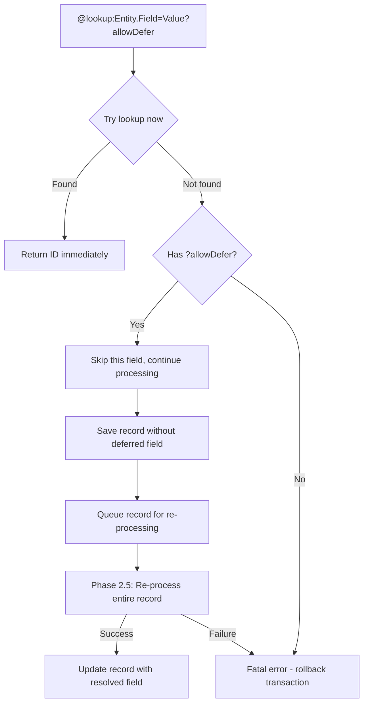

# MemberJunction Metadata Sync

A library for synchronizing MemberJunction database metadata with local file system representations. This library is integrated into the MemberJunction CLI (`mj`) and is accessed through `mj sync` commands. It enables developers and non-technical users to manage MJ metadata using their preferred editors and version control systems while maintaining the database as the source of truth.

## Installation

MetadataSync is included with the MemberJunction CLI. Install the CLI globally:

```bash
npm install -g @memberjunction/cli
```

Then use the sync commands:
```bash
mj sync --help
```

## Purpose

MemberJunction is a powerful metadata-driven system where configuration, business logic, AI prompts, templates, and more are stored as metadata in the database. This approach provides tremendous flexibility and runtime configurability, but it can create friction in modern development workflows.

### Why This Tool Matters

**For Developers:**
- **Full IDE Support**: Edit complex prompts and templates with syntax highlighting, IntelliSense, and all your favorite editor features
- **Version Control**: Track every change with Git - see diffs, blame, history, and collaborate through pull requests
- **Branch-based Development**: Work on features in isolation, test changes, and merge when ready
- **CI/CD Integration**: Automatically deploy metadata changes as code moves through environments
- **Bulk Operations**: Use familiar command-line tools (grep, sed, find) to make sweeping changes
- **Offline Development**: Work on metadata without database connectivity

**For Non-Technical Users:**
- **Familiar Tools**: Edit prompts in Word, Notepad++, or any text editor
- **No Database Access Needed**: IT can set up sync, users just edit files
- **Folder Organization**: Intuitive file/folder structure instead of database IDs
- **Easy Sharing**: Send prompt files via email or shared drives
- **Simple Backups**: Copy/paste folders for personal backups

**For Organizations:**
- **Migration Path**: Metadata flows naturally from dev → staging → production with code
- **Compliance**: Full audit trail through version control
- **Collaboration**: Multiple team members can work on different metadata simultaneously
- **Disaster Recovery**: File-based backups complement database backups
- **Cross-System Sync**: Export from one MJ instance, import to another

### The Best of Both Worlds

This tool preserves the power of MJ's metadata-driven architecture while adding the convenience of file-based workflows. The database remains the source of truth for runtime operations, while files become the medium for creation, editing, and deployment.

## Overview

The Metadata Sync tool bridges the gap between database-stored metadata and file-based workflows by:
- Pulling metadata entities from database to JSON files with external file support
- Pushing local file changes back to the database
- Supporting embedded collections for related entities
- Enabling version control for all MJ metadata through Git
- Supporting CI/CD workflows for metadata deployment
- Providing a familiar file-based editing experience

## Key Features

### Hybrid File Storage
- **JSON files**: Store structured metadata for entities
- **External files**: Store large text fields (prompts, templates, etc.) in appropriate formats (.md, .html, .sql)
- **File references**: Use `@file:filename.ext` to link external files from JSON

### Embedded Collections
- **Related Entities**: Store related records as arrays within parent JSON files
- **Hierarchical References**: Use `@parent:` and `@root:` to reference parent/root entity fields
- **Automatic Metadata**: Related entities maintain their own primaryKey and sync metadata
- **Nested Support**: Support for multiple levels of nested relationships

### Synchronization Operations
- **Pull**: Download metadata from database to local files
  - Optionally pull related entities based on configuration
  - Filter support for selective pulling
- **Push**: Upload local file changes to database
  - Process embedded collections automatically
  - Verbose mode (`-v`) for detailed output
  - Directory filtering with `--include` and `--exclude` options
- **Status**: Show what would change without making modifications
  - Directory filtering with `--include` and `--exclude` options

### Directory Filtering
- **Selective Processing**: Use `--include` or `--exclude` to filter which entity directories are processed
- **Pattern Support**: Supports glob patterns like `ai-*`, `*-test`, etc.
- **Mutually Exclusive**: Cannot use both `--include` and `--exclude` together
- **Use Cases**:
  - Speed up development by excluding large/slow directories
  - Focus on specific entities during debugging
  - Create specialized sync workflows for different teams

### Development Workflow Integration
- Watch mode for automatic syncing during development
- Dry-run mode to preview changes
- CI/CD mode for automated deployments
- Integration with existing mj.config.cjs configuration

## Supported Entities

The tool works with any MemberJunction entity - both core system entities and user-created entities. Each entity type can have its own directory structure, file naming conventions, and related entity configurations.

### Important Limitation: Database-Reflected Metadata

**This tool should NOT be used to modify metadata that is reflected from the underlying database catalog.** Examples include:
- Entity field data types
- Column lengths/precision
- Primary key definitions
- Foreign key relationships
- Table/column existence

These properties are designed to flow **from** the database catalog **up** into MJ metadata, not the other way around. Attempting to modify these via file sync could create inconsistencies between the metadata and actual database schema.

The tool is intended for managing business-level metadata such as:
- Descriptions and documentation
- Display names and user-facing text
- Categories and groupings
- Custom properties and settings
- AI prompts, templates, and other content
- Permissions and security settings
- Any other data that is not reflected **up** from the underlying system database catalogs

For more information about how CodeGen reflects system-level data from the database into the MJ metadata layer, see the [CodeGen documentation](../CodeGen/README.md).

## Creating Error-Free Entity Files

### Quick Start Checklist

Before creating entity JSON files, follow this checklist to avoid common mistakes:

✅ **1. Find the Entity Definition**
- Open `packages/MJCoreEntities/src/generated/entity_subclasses.ts` or `packages/GeneratedEntities/src/generated/entity_subclasses.ts`
- Search for `class [EntityName]Entity` (e.g., `class TemplateEntity`)
- Review JSDoc comments and property definitions to identify required vs optional fields

✅ **2. Check Required Fields**
- Look for JSDoc comments with `@required` annotations
- Fields without `?` in TypeScript definitions are typically required
- Always include `Name` (almost always required)
- Always include `UserID` (use System User ID: `ECAFCCEC-6A37-EF11-86D4-000D3A4E707E`)

✅ **3. Validate Field Names**
- Use exact field names from the BaseEntity class definition
- Field names are case-sensitive
- Don't assume fields exist (e.g., not all entities have `Status`)

✅ **4. Use Correct File Naming**
- Configuration files (.mj-sync.json, .mj-folder.json) must start with dot
- Metadata files follow the `filePattern` in your .mj-sync.json
- Most common: `"filePattern": "*.json"` (matches any .json file)
- Alternative: `"filePattern": ".*.json"` (matches dot-prefixed .json files)

✅ **5. Set Up Directory Structure**
- Create `.mj-sync.json` in the entity directory
- Use glob patterns: `"filePattern": "*.json"` (not regex: `".*.json"`)

### Discovering Entity Structure

**CRITICAL**: Before creating entity files, you must understand the entity's field structure. Most errors occur because users are unfamiliar with the required fields, data types, and constraints.

#### Finding Entity Definitions

The approach depends on whether you're working inside or outside the MemberJunction monorepo:

##### Working Inside MJ Monorepo

Entity classes are located in:

- **Core MJ Entities**: `packages/MJCoreEntities/src/generated/entity_subclasses.ts`
  - System entities like Users, Roles, EntityFields, etc.
  - AI-related entities like AI Prompts, AI Models, etc.
  
- **Custom Entities**: `packages/GeneratedEntities/src/generated/entity_subclasses.ts`  
  - Your application-specific entities
  - Business domain entities

##### Working Outside MJ Monorepo (In Your Own Project)

Entity classes are located in:

- **Core MJ Entities**: `node_modules/@memberjunction/core-entities/dist/generated/entity_subclasses.js`
  - Note: This is compiled JavaScript, but your IDE should provide IntelliSense
  - For TypeScript definitions: `node_modules/@memberjunction/core-entities/dist/generated/entity_subclasses.d.ts`
  
- **Custom Entities**: Your project's generated entities location (varies by project structure)
  - Common locations: `src/generated/`, `packages/entities/`, or similar
  - Look for files containing your custom entity classes

##### Best Practice: Use Your IDE's IntelliSense

**Recommended approach for all scenarios:**

1. **Import the entity class** in your IDE:
   ```typescript
   import { TemplateEntity } from '@memberjunction/core-entities';
   ```

2. **Create an instance and explore with IntelliSense**:
   ```typescript
   const template = new TemplateEntity();
   // Type "template." and let your IDE show available properties
   ```

3. **Check the class definition** (F12 or "Go to Definition") to see:
   - JSDoc comments with field descriptions
   - Required vs optional fields
   - Field types and validation rules
   - Relationships and constraints

#### How to Find Required Fields

1. **Use IDE IntelliSense** (Recommended):
   - Import the entity class
   - Create an instance: `const entity = new TemplateEntity();`
   - Use "Go to Definition" (F12) to see the BaseEntity class
   - Look for JSDoc comments and field definitions

2. **Examine the BaseEntity Class**:
   - Find the entity class (e.g., `class TemplateEntity`)
   - Look at property declarations with JSDoc comments
   - Check for required vs optional field annotations
   - Review any validation methods or constraints

3. **Runtime Metadata Discovery**:
   ```typescript
   import { Metadata } from '@memberjunction/core';
   
   const md = new Metadata();
   const entityInfo = md.EntityByName('Templates');
   console.log('Required fields:', entityInfo.Fields.filter(f => !f.AllowsNull));
   ```

#### Example: Templates Entity Structure
```typescript
// BaseEntity class (accessible via IDE IntelliSense)
export class TemplateEntity extends BaseEntity {
  /**
   * Primary key - auto-generated GUID
   */
  ID: string;
  
  /**
   * Template name - REQUIRED
   * @required
   */
  Name: string;
  
  /**
   * Template description - optional
   */
  Description?: string;
  
  /**
   * User who created this template - REQUIRED
   * Must be a valid User ID
   * @required
   * @foreignKey Users.ID
   */
  UserID: string;
  
  /**
   * Category for organizing templates - optional
   * @foreignKey TemplateCategories.ID
   */
  CategoryID?: string;
  
  // Note: Status field may not exist on all entities!
}
```

#### Common Required Fields Pattern

Most MJ entities follow these patterns:

**Always Required:**
- `ID` - Primary key (GUID) - auto-generated if not provided
- `Name` - Human-readable name
- `UserID` - Creator/owner (use System User: `ECAFCCEC-6A37-EF11-86D4-000D3A4E707E`)

**Often Required:**
- `Description` - Usually optional but recommended
- Foreign key fields ending in `ID` - Check if they have `.optional()`

**Be Careful With:**
- `Status` fields - Some entities have them, others don't
- Enum fields - Must match exact values from database
- DateTime fields - Use ISO format: `2024-01-15T10:30:00Z`

### Common Mistakes and Solutions

#### ❌ Mistake 1: Using Non-Existent Fields
```json
{
  "fields": {
    "Name": "My Template",
    "Status": "Active"  // ❌ Templates entity may not have Status field
  }
}
```

**✅ Solution**: Check the BaseEntity class first
```typescript
// In entity_subclasses.ts - if you don't see Status here, don't use it
export class TemplateEntity extends BaseEntity {
  Name: string;  // Required
  Description?: string;  // Optional (note the ?)
  // No Status field defined
}
```

#### ❌ Mistake 2: Missing Required Fields
```json
{
  "fields": {
    "Name": "My Template"
    // ❌ Missing required UserID
  }
}
```

**✅ Solution**: Include all required fields
```json
{
  "fields": {
    "Name": "My Template",
    "UserID": "ECAFCCEC-6A37-EF11-86D4-000D3A4E707E"
  }
}
```

#### ❌ Mistake 3: Wrong File Pattern in .mj-sync.json
```json
{
  "entity": "Templates",
  "filePattern": ".*.json"  // ❌ This is regex, not glob
}
```

**✅ Solution**: Use glob patterns
```json
{
  "entity": "Templates", 
  "filePattern": "*.json"  // ✅ Correct glob pattern
}
```

#### ❌ Mistake 4: Incorrect Data Types
```json
{
  "fields": {
    "Name": "My Template",
    "CreatedAt": "2024-01-15",  // ❌ Wrong datetime format
    "Priority": "1"  // ❌ Should be number, not string
  }
}
```

**✅ Solution**: Use correct data types
```json
{
  "fields": {
    "Name": "My Template",
    "CreatedAt": "2024-01-15T10:30:00Z",  // ✅ ISO format
    "Priority": 1  // ✅ Number type
  }
}
```

#### ❌ Mistake 5: Files Not Being Detected
```
mydir/
├── .mj-sync.json (with "filePattern": "*.json")
├── template1.txt  // ❌ Wrong extension
└── .template2.json  // ❌ Dot prefix when pattern is "*.json"
```

**✅ Solution**: Match your filePattern
```
mydir/
├── .mj-sync.json (with "filePattern": "*.json")
├── template1.json  // ✅ Matches *.json pattern
└── template2.json  // ✅ Matches *.json pattern
```

### Step-by-Step Entity File Creation

#### Step 1: Research the Entity
```bash
# Open in your IDE:
packages/MJCoreEntities/src/generated/entity_subclasses.ts

# Search for your entity class (Ctrl+F):
class TemplateEntity

# Note the required vs optional fields:
Name: string;           // Required (no ?)
UserID: string;         // Required (no ?)  
Description?: string;   // Optional (note the ?)
```

#### Step 2: Create Directory Structure
```bash
mkdir templates
cd templates

# Create entity config (dot-prefixed configuration file)
echo '{
  "entity": "Templates",
  "filePattern": "*.json"
}' > .mj-sync.json
```

#### Step 3: Create Your First Entity File
```bash
# Create metadata file (follows filePattern from .mj-sync.json)
echo '{
  "fields": {
    "Name": "My First Template",
    "Description": "A test template",
    "UserID": "ECAFCCEC-6A37-EF11-86D4-000D3A4E707E"
  }
}' > my-first-template.json
```

#### Step 4: Test and Validate
```bash
# Dry run to check for errors
mj sync push --dir="templates" --dry-run

# If successful, do actual push
mj sync push --dir="templates"
```

### AI/LLM Guidelines

When using AI tools (like Claude, ChatGPT, etc.) to generate entity files:

**🤖 For AI Assistants:**

1. **Always check entity definitions first** - Never assume field names or requirements
2. **Look up the exact BaseEntity class** in the generated entity files
3. **Use the System User ID** (`ECAFCCEC-6A37-EF11-86D4-000D3A4E707E`) for UserID fields
4. **Include only fields that exist** in the entity definition
5. **Use proper data types** as defined in the BaseEntity class
6. **Remember file naming rules**:
   - Configuration files (.mj-sync.json) must have dot prefix
   - Metadata files follow the filePattern in .mj-sync.json
7. **Use glob patterns** in .mj-sync.json, not regex patterns

**📝 Prompt Template for AI:**
```
I need to create entity files for the [EntityName] entity in MemberJunction.

Please:
1. First, check the entity definition in packages/MJCoreEntities/src/generated/entity_subclasses.ts
2. Find the class [EntityName]Entity (e.g., class TemplateEntity)
3. Review JSDoc comments and property definitions to identify required vs optional fields
4. Create a .mj-sync.json file with correct glob pattern
5. Create sample metadata JSON files following the filePattern
6. Use UserID: "ECAFCCEC-6A37-EF11-86D4-000D3A4E707E" for required UserID fields
7. Follow the exact field names and data types from the BaseEntity class definition

CRITICAL: Configuration files (.mj-sync.json) must start with dot, but metadata files follow the filePattern specified in the configuration.
```

### Understanding File Naming Rules

**Configuration Files (Always Dot-Prefixed):**
- ✅ `.mj-sync.json` - Entity configuration
- ✅ `.mj-folder.json` - Folder defaults
- ❌ `mj-sync.json` - Won't be recognized

**Metadata Files (Follow filePattern):**
With `"filePattern": "*.json"`:
- ✅ `my-template.json` - Will be processed
- ✅ `greeting.json` - Will be processed  
- ❌ `.my-template.json` - Won't match pattern
- ❌ `package.json` - Will be ignored (add to ignore list if needed)

With `"filePattern": ".*.json"`:
- ✅ `.my-template.json` - Will be processed
- ✅ `.greeting.json` - Will be processed
- ❌ `my-template.json` - Won't match pattern
- ❌ `package.json` - Won't match pattern

### Troubleshooting Quick Reference

| Error Message | Cause | Solution |
|---------------|-------|----------|
| `No entity directories found` | Missing .mj-sync.json or wrong filePattern | Check .mj-sync.json exists and uses `"*.json"` |
| `Field 'X' does not exist on entity 'Y'` | Using non-existent field | Check BaseEntity class in entity_subclasses.ts |
| `User ID cannot be null` | Missing required UserID | Add `"UserID": "ECAFCCEC-6A37-EF11-86D4-000D3A4E707E"` |
| `Processing 0 records` | Files don't match filePattern | Check files match pattern in .mj-sync.json |
| Failed validation | Wrong data type or format | Check BaseEntity class for field types |

### System User ID Reference

**Always use this GUID for UserID fields:**
```
ECAFCCEC-6A37-EF11-86D4-000D3A4E707E
```

This is the System User ID that should be used when creating entity records through the MetadataSync tool. Using any other ID or leaving it null will cause validation errors.

## File Structure

The tool uses a hierarchical directory structure with cascading defaults:
- Each top-level directory represents an entity type
- `.mj-sync.json` files define entities and base defaults
- `.mj-folder.json` files define folder-specific defaults (optional)
- Only dot-prefixed JSON files (e.g., `.prompt-template.json`, `.category.json`) are treated as metadata records
- Regular JSON files without the dot prefix are ignored, allowing package.json and other config files to coexist
- External files (`.md`, `.html`, etc.) are referenced from the JSON files
- Defaults cascade down through the folder hierarchy

### File Naming Convention

**Metadata files must be prefixed with a dot (.)** to be recognized by the sync tool. This convention:
- Clearly distinguishes metadata files from regular configuration files
- Allows `package.json`, `tsconfig.json` and other standard files to coexist without being processed
- Follows established patterns like `.gitignore` and `.eslintrc.json`

Examples:
- ✅ `.greeting.json` - Will be processed as metadata
- ✅ `.customer-prompt.json` - Will be processed as metadata  
- ❌ `greeting.json` - Will be ignored
- ❌ `package.json` - Will be ignored

### File Format Options

#### Single Record per File (Default)
Each JSON file contains one record:
```json
{
  "fields": { ... },
  "relatedEntities": { ... }
}
```

#### Multiple Records per File
JSON files can contain arrays of records:
```json
[
  {
    "fields": { ... },
    "relatedEntities": { ... }
  },
  {
    "fields": { ... },
    "relatedEntities": { ... }
  }
]
```

This is useful for:
- Grouping related records in a single file
- Reducing file clutter for entities with many small records
- Maintaining logical groupings while using `@file:` references for large content

### Example Structure
```
metadata/
├── .mj-sync.json                    # Global sync configuration
├── ai-prompts/
│   ├── .mj-sync.json               # Defines entity: "AI Prompts"
│   ├── customer-service/
│   │   ├── .mj-folder.json         # Folder metadata (CategoryID, etc.)
│   │   ├── .greeting.json          # AI Prompt record with embedded models
│   │   ├── greeting.prompt.md      # Prompt content (referenced)
│   │   └── greeting.notes.md       # Notes field (referenced)
│   └── analytics/
│       ├── .mj-folder.json         # Folder metadata (CategoryID, etc.)
│       ├── .daily-report.json      # AI Prompt record
│       └── daily-report.prompt.md  # Prompt content (referenced)
├── templates/                       # Reusable JSON templates
│   ├── standard-prompt-settings.json # Common prompt configurations
│   ├── standard-ai-models.json     # Standard model configurations
│   ├── high-performance-models.json # High-power model configurations
│   └── customer-service-defaults.json # CS-specific defaults
└── template-entities/
    ├── .mj-sync.json               # Defines entity: "Templates"
    ├── email/
    │   ├── .mj-folder.json         # Folder metadata
    │   ├── .welcome.json           # Template record (dot-prefixed)
    │   └── welcome.template.html   # Template content (referenced)
    └── reports/
        ├── .mj-folder.json         # Folder metadata
        ├── .invoice.json           # Template record (dot-prefixed)
        └── invoice.template.html   # Template content (referenced)
```

## JSON Metadata Format

### Individual Record (e.g., ai-prompts/customer-service/.greeting.json)
```json
{
  "fields": {
    "Name": "Customer Greeting",
    "Description": "Friendly customer service greeting",
    "TypeID": "@lookup:AI Prompt Types.Name=Chat",
    "CategoryID": "@lookup:AI Prompt Categories.Name=Customer Service",
    "Temperature": 0.7,
    "MaxTokens": 1000,
    "Prompt": "@file:greeting.prompt.md",
    "Notes": "@file:../shared/notes/greeting-notes.md",
    "SystemPrompt": "@url:https://raw.githubusercontent.com/company/prompts/main/system/customer-service.md"
  },
  "primaryKey": {
    "ID": "550e8400-e29b-41d4-a716-446655440000"
  },
  "sync": {
    "lastModified": "2024-01-15T10:30:00Z",
    "checksum": "sha256:abcd1234..."
  }
}
```

### Record with Embedded Collections
```json
{
  "fields": {
    "Name": "Customer Service Chat",
    "Description": "Main customer service prompt",
    "TypeID": "@lookup:AI Prompt Types.Name=Chat",
    "TemplateText": "@file:customer-service.md",
    "Status": "Active"
  },
  "relatedEntities": {
    "MJ: AI Prompt Models": [
      {
        "fields": {
          "PromptID": "@parent:ID",
          "ModelID": "@lookup:AI Models.Name=GPT 4.1",
          "VendorID": "@lookup:MJ: AI Vendors.Name=OpenAI",
          "Priority": 1,
          "Status": "Active"
        },
        "primaryKey": {
          "ID": "BFA2433E-F36B-1410-8DB0-00021F8B792E"
        },
        "sync": {
          "lastModified": "2025-06-07T17:18:31.687Z",
          "checksum": "a642ebea748cb1f99467af2a7e6f4ffd3649761be27453b988af973bed57f070"
        }
      },
      {
        "fields": {
          "PromptID": "@parent:ID",
          "ModelID": "@lookup:AI Models.Name=Claude 4 Sonnet",
          "Priority": 2,
          "Status": "Active"
        }
      }
    ]
  },
  "primaryKey": {
    "ID": "C2A1433E-F36B-1410-8DB0-00021F8B792E"
  },
  "sync": {
    "lastModified": "2025-06-07T17:18:31.698Z",
    "checksum": "7cbd241cbf0d67c068c1434e572a78c87bb31751cbfe7734bfd32f8cea17a2c9"
  }
}
```

### Composite Primary Key Example
```json
{
  "primaryKey": {
    "UserID": "550e8400-e29b-41d4-a716-446655440000",
    "RoleID": "660f9400-f39c-51e5-b827-557766551111"
  },
  "fields": {
    "GrantedAt": "2024-01-15T10:30:00Z",
    "GrantedBy": "@lookup:Users.Email=admin@company.com",
    "ExpiresAt": "2025-01-15T10:30:00Z",
    "Notes": "@file:user-role-notes.md"
  },
  "sync": {
    "lastModified": "2024-01-15T10:30:00Z",
    "checksum": "sha256:abcd1234..."
  }
}
```

## Adding Comments to JSON Metadata Files

Since JSON does not natively support comments, MetadataSync provides a convention for adding documentation to your metadata files using custom keys that are preserved but ignored during sync operations.

### Comment Convention

Any key that is not one of the reserved MetadataSync keys (`fields`, `relatedEntities`, `primaryKey`, `sync`, `deleteRecord`) will be preserved in your JSON files but ignored during push/pull operations. By convention, use an underscore prefix (`_`) for comment keys to clearly distinguish them from future MetadataSync features.

**Reserved keys (processed by MetadataSync):**
- `fields` - Entity field values
- `relatedEntities` - Embedded related entity records
- `primaryKey` - Record identifier
- `sync` - Sync metadata (lastModified, checksum)
- `__mj_sync_notes` - System-managed resolution tracking (see [Resolution Tracking](#resolution-tracking-with-__mj_sync_notes))
- `deleteRecord` - Deletion directive

**Recommended comment pattern:**
- `_comments` - Array of comment strings
- `_note` - Single comment string
- `_description` - Descriptive text
- Any key starting with `_` - Reserved for user documentation

### Example: Top-Level Comments
```json
{
  "_comments": [
    "This file configures encryption settings for the Test Tables entity",
    "The encryption key is defined in /metadata/encryption-keys/"
  ],
  "fields": {
    "Name": "Test Tables",
    "BaseView": "vwTestTables"
  },
  "primaryKey": {
    "ID": "0fde4c2c-26b1-45e9-b504-5d4a6f4201cf"
  }
}
```

### Example: Comments on Related Entities
```json
{
  "_comments": ["Parent entity configuration"],
  "fields": {
    "Name": "My Entity"
  },
  "relatedEntities": {
    "Entity Fields": [
      {
        "fields": {
          "Encrypt": true,
          "AllowDecryptInAPI": false
        },
        "_comments": ["This field stores server-only encrypted data"],
        "primaryKey": {
          "ID": "F501E294-5F5F-44C6-AD06-5C9754A13D29"
        }
      },
      {
        "fields": {
          "Encrypt": true,
          "AllowDecryptInAPI": true
        },
        "_comments": ["This field is decrypted for API responses"],
        "primaryKey": {
          "ID": "CF4B94E4-8E68-4692-B13A-9A0D51D397B7"
        }
      }
    ]
  }
}
```

### Key Ordering Preservation

MetadataSync preserves the original order of keys in your JSON files. When you run `mj sync push` or `mj sync pull`, your comments will remain exactly where you placed them:

```json
{
  "_comments": ["This comment stays at the top"],
  "fields": { ... },
  "_note": "This note stays between fields and relatedEntities",
  "relatedEntities": { ... }
}
```

### Best Practices

1. **Use underscore prefix**: Start custom keys with `_` to reserve the alphabetic namespace for future MetadataSync features
2. **Use arrays for multi-line comments**: `"_comments": ["Line 1", "Line 2"]` provides clean formatting
3. **Place comments near relevant content**: Add `_comments` inside related entity objects to document specific records
4. **Document complex configurations**: Use comments to explain lookup references, encryption settings, or business rules
5. **Version control friendly**: Comments make metadata files more readable in code reviews and git diffs

## Resolution Tracking with `__mj_sync_notes`

When you use `@lookup` or `@parent` references in your metadata files, MetadataSync can track how these references were resolved during push operations. This information is written to a `__mj_sync_notes` key in each record, providing transparency into the resolution process.

**Note:** This feature is **disabled by default** to keep metadata files clean. Enable it when you need to debug lookup resolutions or understand how references are being resolved.

### Enabling Resolution Tracking

To enable `__mj_sync_notes`, add the `emitSyncNotes` setting to your `.mj-sync.json` configuration:

**Root-level configuration** (applies to all entity directories):
```json
{
  "version": "1.0",
  "emitSyncNotes": true,
  "directoryOrder": ["..."]
}
```

**Entity-level override** (in an entity directory's `.mj-sync.json`):
```json
{
  "entity": "AI Prompts",
  "emitSyncNotes": true
}
```

The inheritance works as follows:
- Entity-level `emitSyncNotes` takes precedence if explicitly set
- If not set at entity level, inherits from root `.mj-sync.json`
- Defaults to `false` if not set anywhere

This allows you to enable tracking globally and disable it for specific entities, or vice versa.

### Purpose

The `__mj_sync_notes` feature helps you:
- **Debug lookup issues**: See exactly what value a `@lookup` resolved to
- **Understand parent references**: Track how `@parent:` references were resolved
- **Verify nested lookups**: View the resolution chain for nested `@lookup` expressions
- **Document resolved values**: Provides a reference for what GUIDs correspond to which lookup expressions

### How It Works

After each `mj sync push` operation, records with `@lookup` or `@parent` references will have a `__mj_sync_notes` section added automatically:

```json
{
  "fields": {
    "Name": "ServerOnlyEncrypted",
    "Encrypt": true,
    "EncryptionKeyID": "@lookup:MJ: Encryption Keys.Name=Test Encryption Key"
  },
  "primaryKey": {
    "ID": "@lookup:Entity Fields.EntityID=@lookup:Entities.Name=Test Tables&Name=ServerOnlyEncrypted"
  },
  "sync": {
    "lastModified": "2025-12-25T16:14:32.605Z",
    "checksum": "7e989e08396f6cffb8b2d70958018b21..."
  },
  "__mj_sync_notes": [
    {
      "type": "lookup",
      "field": "primaryKey.ID",
      "expression": "@lookup:Entity Fields.EntityID=@lookup:Entities.Name=Test Tables&Name=ServerOnlyEncrypted",
      "resolved": "F501E294-5F5F-44C6-AD06-5C9754A13D29",
      "nested": [
        {
          "expression": "@lookup:Entities.Name=Test Tables",
          "resolved": "0fde4c2c-26b1-45e9-b504-5d4a6f4201cf"
        }
      ]
    },
    {
      "type": "lookup",
      "field": "fields.EncryptionKeyID",
      "expression": "@lookup:MJ: Encryption Keys.Name=Test Encryption Key",
      "resolved": "85B814C8-A01B-4AE3-A252-DC9D54C914C7"
    }
  ]
}
```

### Note Structure

Each resolution note contains:

| Field | Description |
|-------|-------------|
| `type` | Resolution type: `"lookup"` for `@lookup` references, `"parent"` for `@parent` references |
| `field` | Field path where the resolution occurred (e.g., `"primaryKey.ID"`, `"fields.CategoryID"`) |
| `expression` | The original reference expression before resolution |
| `resolved` | The resolved value (typically a GUID) |
| `nested` | (Optional) Array of nested resolutions for expressions containing nested `@lookup` references |

### System-Managed Key

The `__mj_sync_notes` key uses a double underscore prefix (`__`) to clearly indicate it is system-managed:
- **Do not manually edit** this section - it is regenerated on each push when `emitSyncNotes` is enabled
- When `emitSyncNotes` is disabled (the default), existing `__mj_sync_notes` keys are automatically removed on push
- When enabled, the key is automatically removed if a record has no `@lookup` or `@parent` references
- Key ordering is preserved - `__mj_sync_notes` appears after `sync` in the file

### Example: Parent Reference Resolution

When using `@parent:` references in related entities:

```json
{
  "fields": {
    "Name": "My Template"
  },
  "relatedEntities": {
    "Template Contents": [
      {
        "fields": {
          "TemplateID": "@parent:ID",
          "Content": "Hello World"
        },
        "__mj_sync_notes": [
          {
            "type": "parent",
            "field": "fields.TemplateID",
            "expression": "@parent:ID",
            "resolved": "A1B2C3D4-E5F6-7890-ABCD-EF1234567890"
          }
        ]
      }
    ]
  }
}
```

## Default Value Inheritance

The tool implements a cascading inheritance system for field defaults, similar to CSS or OOP inheritance:

1. **Entity-level defaults** (in `.mj-sync.json`) - Base defaults for all records
2. **Folder-level defaults** (in `.mj-folder.json`) - Override/extend entity defaults
3. **Nested folder defaults** - Override/extend parent folder defaults
4. **Record-level values** - Override all inherited defaults

### Inheritance Example
```
ai-prompts/.mj-sync.json         → Temperature: 0.7, MaxTokens: 1500
├── customer-service/.mj-folder.json → Temperature: 0.8 (overrides)
│   ├── greeting.json            → Uses Temperature: 0.8, MaxTokens: 1500
│   └── escalation/.mj-folder.json → Temperature: 0.6 (overrides again)
│       └── urgent.json          → Temperature: 0.9 (record override)
```

Final values for `urgent.json`:
- Temperature: 0.9 (from record)
- MaxTokens: 1500 (from entity defaults)
- All other fields from folder hierarchy

## Special Conventions

The tool supports special reference types that can be used in ANY field that accepts text content. These references are processed during push/pull operations to handle external content, lookups, and environment-specific values.

### Primary Key Handling
The tool automatically detects primary key fields from entity metadata:
- **Single primary keys**: Most common, stored as `{"ID": "value"}` or `{"CustomKeyName": "value"}`
- **Composite primary keys**: Multiple fields that together form the primary key
- **Auto-detection**: Tool reads entity metadata to determine primary key structure
- **No hardcoding**: Works with any primary key field name(s)
- **Reference support**: Primary key values can use `@lookup`, `@parent`, and other reference types

#### Using @lookup in Primary Keys
You can use `@lookup` references in primary key fields to avoid hardcoding GUIDs. This is especially useful when decorating existing records:

```json
{
  "fields": {
    "Encrypt": true,
    "AllowDecryptInAPI": false
  },
  "primaryKey": {
    "ID": "@lookup:Entity Fields.EntityID=@lookup:Entities.Name=Test Tables&Name=ServerOnlyEncrypted"
  }
}
```

In this example:
1. The inner `@lookup:Entities.Name=Test Tables` resolves to the Entity ID
2. That ID is used to find the Entity Field with the matching `EntityID` and `Name`
3. The resulting Entity Field ID becomes the primary key

**Note:** Primary key lookups must resolve immediately - the `?allowDefer` flag is not supported in primary key fields since the primary key is needed to determine if a record exists.

### deleteRecord Directive
The tool now supports deleting records from the database using a special `deleteRecord` directive in JSON files. This allows you to remove obsolete records as part of your metadata sync workflow:

#### How to Delete a Record
1. Add a `deleteRecord` section to any record JSON file
2. Set `delete: true` to mark the record for deletion
3. Run `mj sync push` to execute the deletion
4. The tool will update the JSON with a deletion timestamp

#### Syntax
```json
{
  "fields": {
    "Name": "Obsolete Prompt",
    "Description": "This prompt is no longer needed"
  },
  "primaryKey": {
    "ID": "550e8400-e29b-41d4-a716-446655440000"
  },
  "deleteRecord": {
    "delete": true
  }
}
```

#### After Deletion
After successfully deleting the record, the tool updates the JSON file:
```json
{
  "fields": {
    "Name": "Obsolete Prompt",
    "Description": "This prompt is no longer needed"
  },
  "primaryKey": {
    "ID": "550e8400-e29b-41d4-a716-446655440000"
  },
  "deleteRecord": {
    "delete": true,
    "deletedAt": "2024-01-15T14:30:00.000Z"
  }
}
```

#### Important Notes
- **Primary key required**: You must specify the `primaryKey` to identify which record to delete
- **One-time operation**: Once `deletedAt` is set, the deletion won't be attempted again
- **SQL logging**: Delete operations are included in SQL logs when enabled
- **Foreign key constraints**: Deletions may fail if other records reference this record
- **Dry-run support**: Use `--dry-run` to preview what would be deleted
- **Takes precedence**: If `deleteRecord` is present, normal create/update operations are skipped

#### Use Cases
- Removing deprecated prompts, templates, or configurations
- Cleaning up test data
- Synchronizing deletions across environments
- Maintaining clean metadata through version control

### @file: References
When a field value starts with `@file:`, the tool will:
1. Read content from the specified file for push operations
2. Write content to the specified file for pull operations
3. Track both files for change detection
4. **For JSON files**: Automatically process any `@include` directives within them

Examples:
- `@file:greeting.prompt.md` - File in same directory as JSON
- `@file:./shared/common-prompt.md` - Relative path
- `@file:../templates/standard-header.md` - Parent directory reference
- `@file:spec.json` - JSON file with `@include` directives (processed automatically)

### @url: References
When a field value starts with `@url:`, the tool will:
1. Fetch content from the URL during push operations
2. Cache the content with appropriate headers
3. Support both HTTP(S) and file:// protocols

Examples:
- `@url:https://example.com/prompts/greeting.md` - Remote content
- `@url:https://raw.githubusercontent.com/company/prompts/main/customer.md` - GitHub raw content
- `@url:file:///shared/network/drive/prompts/standard.md` - Local file URL

### @lookup: References (ENHANCED)
Enable entity relationships using human-readable values:
- Basic syntax: `@lookup:EntityName.FieldName=Value`
- Multi-field syntax: `@lookup:EntityName.Field1=Value1&Field2=Value2`
- Auto-create syntax: `@lookup:EntityName.FieldName=Value?create`
- With additional fields: `@lookup:EntityName.FieldName=Value?create&Field2=Value2`
- Deferred lookup syntax: `@lookup:EntityName.FieldName=Value?allowDefer`
- Combined flags: `@lookup:EntityName.FieldName=Value?create&allowDefer`

Examples:
- `@lookup:AI Prompt Types.Name=Chat` - Single field lookup, fails if not found
- `@lookup:Users.Email=john@example.com&Department=Sales` - Multi-field lookup for precise matching
- `@lookup:AI Prompt Categories.Name=Examples?create` - Creates if missing
- `@lookup:AI Prompt Categories.Name=Examples?create&Description=Example prompts` - Creates with description
- `@lookup:Dashboards.Name=Data Explorer?allowDefer` - Defers lookup if not found, retries at end of push

#### Multi-Field Lookups
When you need to match records based on multiple criteria, use the multi-field syntax:
```json
{
  "CategoryID": "@lookup:AI Prompt Categories.Name=Actions&Status=Active",
  "ManagerID": "@lookup:Users.Email=manager@company.com&Department=Engineering&Status=Active"
}
```

This ensures you get the exact record you want when multiple records might have the same value in a single field.

#### Deferred Lookups (?allowDefer)

The `?allowDefer` flag enables handling of circular dependencies between entities during push operations. Use this when Entity A references Entity B and Entity B references Entity A - or any situation where a lookup target might not exist yet during initial processing.

**How it works:**

The flag is permission-based, not imperative. The lookup is always attempted first, and only deferred if it fails:



**When to use `?allowDefer`:**
- When Entity A references Entity B, and Entity B references Entity A
- When you're creating related records that need to reference each other
- When the lookup target might not exist yet during initial processing

**Processing phases:**
1. During the initial push phase, if a lookup with `?allowDefer` fails (record not found), the **field is skipped** but the record still saves
2. The record IS saved during the initial pass (without the deferred field value), allowing other records to reference it
3. The record is queued for re-processing in Phase 2.5
4. After all other records are processed, deferred records are re-processed using the exact same logic
5. If retry succeeds, the record is updated with the resolved field; if it fails, an error is reported and the transaction rolls back

**Example: Application ↔ Dashboard circular reference**

The Applications entity can have `DefaultNavItems` (a JSON field) that contains nested references to Dashboards, while Dashboards have an `ApplicationID` that references Applications.

Since Applications are processed before Dashboards (alphabetical order), the Dashboard lookup in `DefaultNavItems` needs `?allowDefer`:

```json
// .data-explorer-application.json
{
  "fields": {
    "Name": "Data Explorer",
    "DefaultNavItems": [
      {
        "Label": "Explorer",
        "ResourceType": "Dashboard",
        "RecordID": "@lookup:Dashboards.Name=Data Explorer?allowDefer"
      }
    ]
  }
}

// .data-explorer-dashboard.json
// Note: No ?allowDefer needed - Applications are processed first
{
  "fields": {
    "Name": "Data Explorer",
    "ApplicationID": "@lookup:Applications.Name=Data Explorer"
  }
}
```

**Processing order:**
1. Applications are processed first (per `directoryOrder` in `.mj-sync.json`):
   - The Dashboard lookup fails (Dashboard doesn't exist yet)
   - Because `?allowDefer` is set, the `DefaultNavItems` field is skipped
   - Application IS saved (without the `DefaultNavItems` value)
   - Application record is queued for re-processing
2. Dashboards are processed:
   - Dashboard references Application via `ApplicationID` - this lookup succeeds because Application was saved in step 1
   - Dashboard is created normally
3. Deferred records are re-processed (Phase 2.5):
   - The Application record is processed again using the exact same logic
   - The Dashboard lookup now succeeds since Dashboard exists in the database
   - Application is updated with the resolved `DefaultNavItems` field

**Console output:**
```
Processing Applications...
   ⏳ Deferring lookup for Applications.DefaultNavItems -> Dashboards
   📋 Queued Applications for deferred processing (record saved, some fields pending)
   ✓ Created: 1

Processing Dashboards...
   ✓ Created: 1

⏳ Processing 1 deferred record...
   ✓ Applications (ID=867CB743-...) - updated
   ✓ Resolved 1 deferred record (0 created, 1 updated)
```

**Important:** The `?allowDefer` flag queues the entire record for re-processing, not just the failed field. This ensures the exact same processing logic is used on retry, including proper handling of nested lookups within JSON structures, `@parent` references, and all other field processing.

**Combining flags:**
You can combine `?allowDefer` with `?create`:
```json
"CategoryID": "@lookup:Categories.Name=New Category?create&allowDefer"
```
This means: "Look up the category, create if missing, and if the lookup still fails for some reason, defer it."

**Important notes:**
- Deferred records are processed before the final commit (Phase 2.5)
- If any deferred record fails on retry, the entire push transaction is rolled back
- Use sparingly - only for genuine circular dependencies
- The record must have a primaryKey defined in the metadata file

### @parent: References 
Reference fields from the immediate parent entity in embedded collections:
- `@parent:ID` - Get the parent's ID field
- `@parent:Name` - Get the parent's Name field
- Works with any field from the parent entity

### @root: References
Reference fields from the root entity in nested structures:
- `@root:ID` - Get the root entity's ID
- `@root:CategoryID` - Get the root's CategoryID
- Useful for deeply nested relationships

### @env: References
Support environment-specific values:
- `@env:VARIABLE_NAME`
- Useful for different environments (dev/staging/prod)

### Automatic JSON Stringification with Reference Processing

When a field value is an array or object, the tool automatically:
1. **Recursively processes** all `@lookup:`, `@file:`, `@parent:`, `@root:` references inside the object
2. **Converts to JSON string** with pretty formatting (2-space indentation) for database storage
3. **Maintains clean structure** in source files while storing as strings in database

This is extremely powerful for JSON-typed fields like `Configuration`, `Settings`, `Metadata`, etc.

#### Basic Example
```json
{
  "fields": {
    "Name": "My Entity",
    "Configuration": {
      "setting1": "value1",
      "setting2": {
        "nested": true,
        "items": [1, 2, 3]
      }
    },
    "Tags": ["tag1", "tag2", "tag3"]
  }
}
```

The `Configuration` and `Tags` fields will automatically be converted to JSON strings when pushed to the database.

#### Advanced Example: References Inside JSON Fields

**This is the powerful part** - you can use `@lookup:` and other references INSIDE object-typed fields:

```json
{
  "fields": {
    "Name": "Agent Memory Manager Job",
    "CronExpression": "0 */15 * * * *",
    "Configuration": {
      "AgentID": "@lookup:AI Agents.Name=Memory Manager",
      "InitialMessage": "Analyze recent conversations",
      "Settings": {
        "MaxNotes": 5,
        "Strategy": "Relevant",
        "TargetAgentID": "@lookup:AI Agents.Name=Sage"
      }
    }
  }
}
```

When pushed to the database, this becomes:
```json
{
  "Configuration": "{\"AgentID\":\"actual-uuid-here\",\"InitialMessage\":\"Analyze recent conversations\",\"Settings\":{\"MaxNotes\":5,\"Strategy\":\"Relevant\",\"TargetAgentID\":\"another-uuid-here\"}}"
}
```

**Benefits:**
- ✅ **Human-readable**: Use agent names, not UUIDs in your metadata
- ✅ **Maintainable**: Changes to entity names don't break references
- ✅ **Type-safe**: Structured objects in source, properly stringified for DB
- ✅ **Nested support**: References work at any depth in the object tree

#### Common Use Cases

**Scheduled Job Configuration:**
```json
{
  "Configuration": {
    "AgentID": "@lookup:AI Agents.Name=Report Generator",
    "Schedule": "daily",
    "Recipients": "@lookup:Users.Email=admin@company.com"
  }
}
```

**Action Parameters:**
```json
{
  "DefaultParameters": {
    "TargetEntityID": "@lookup:Entities.Name=Customers",
    "TemplateID": "@lookup:Templates.Name=Welcome Email",
    "Settings": {
      "SendImmediate": true,
      "Priority": "High"
    }
  }
}
```

**AI Configuration:**
```json
{
  "AIConfig": {
    "PreferredModelID": "@lookup:AI Models.Name=GPT 4.1",
    "FallbackModels": [
      "@lookup:AI Models.Name=Claude Sonnet 3.7",
      "@lookup:AI Models.Name=Gemini Pro"
    ],
    "Temperature": 0.7
  }
}
```

### {@include} References in Files
Enable content composition within non-JSON files (like .md, .html, .txt) using JSDoc-style include syntax:
- Pattern: `{@include path/to/file.ext}`
- Supports relative paths from the containing file
- Recursive includes (includes within includes)
- Circular reference detection prevents infinite loops
- Works seamlessly with `@file:` references

#### How It Works
When a JSON metadata file uses `@file:` to reference an external file, the MetadataSync tool:
1. Loads the referenced file
2. Scans for `{@include}` patterns
3. Recursively resolves all includes
4. Returns the fully composed content

#### Example Usage
```markdown
# My Prompt Template

## System Instructions
{@include ./shared/system-instructions.md}

## Context
{@include ../common/context-header.md}

## Task
Please analyze the following...
```

#### Complex Example with Nested Includes
Directory structure:
```
prompts/
├── customer-service/
│   ├── greeting.json          # Uses @file:greeting.md
│   ├── greeting.md            # Contains {@include} references
│   └── shared/
│       ├── tone.md
│       └── guidelines.md
└── common/
    ├── company-info.md
    └── legal-disclaimer.md
```

greeting.json:
```json
{
  "fields": {
    "Name": "Customer Greeting",
    "Prompt": "@file:greeting.md"
  }
}
```

greeting.md:
```markdown
# Customer Service Greeting

{@include ./shared/tone.md}

## Guidelines
{@include ./shared/guidelines.md}

## Company Information
{@include ../common/company-info.md}

## Legal
{@include ../common/legal-disclaimer.md}
```

The final content pushed to the database will have all includes fully resolved.

Benefits:
- **DRY Principle**: Share common content across multiple files
- **Maintainability**: Update shared content in one place
- **Flexibility**: Build complex documents from modular parts
- **Validation**: Automatic checking of included file existence and circular references

### @include References in JSON Files

Enable modular JSON composition by including external JSON files directly into your metadata files. This feature allows you to break large JSON configurations into smaller, reusable components.

#### Syntax Options

**Object Context - Property Spreading (Default)**
```json
{
  "name": "Parent Record",
  "@include": "child.json",
  "description": "Additional fields"
}
```
The included file's properties are spread into the parent object.

**Multiple Includes with Dot Notation (Eliminates VS Code Warnings)**
```json
{
  "name": "Parent Record",
  "@include.data": "shared/data-fields.json",
  "description": "Middle field",
  "@include.config": "shared/config-fields.json",
  "status": "Active"
}
```
Use dot notation (`@include.anything`) to include multiple files at different positions in your object. The part after the dot is ignored by the processor but makes each key unique, eliminating VS Code's duplicate key warnings. The includes are processed in the order they appear, allowing precise control over property ordering.

**Array Context - Element Insertion**
```json
[
  {"name": "First item"},
  "@include:child.json",
  {"name": "Last item"}
]
```
The included file's content is inserted as array element(s).

**Explicit Mode Control**
```json
{
  "@include": {
    "file": "child.json",
    "mode": "spread"  // or "element"
  }
}
```

#### Modes Explained

**"spread" mode**: 
- Merges all properties from the included file into the parent object
- Only works when including an object into an object
- Parent properties override child properties if there are conflicts
- Default mode for objects

**"element" mode**:
- Directly inserts the JSON content at that position
- Works with any JSON type (object, array, string, number, etc.)
- Replaces the @include directive with the actual content
- Default mode for arrays when using string syntax

#### Path Resolution
- All paths are relative to the file containing the @include
- Supports: `"child.json"`, `"./child.json"`, `"../shared/base.json"`, `"subfolder/config.json"`
- Circular references are detected and prevented

#### Complex Example

Directory structure:
```
metadata/
├── components/
│   ├── dashboard.json
│   ├── base-props.json
│   └── items/
│       └── dashboard-items.json
└── shared/
    └── common-settings.json
```

dashboard.json:
```json
{
  "fields": {
    "Name": "Analytics Dashboard",
    "@include.common": "../shared/common-settings.json",
    "Type": "Dashboard",
    "@include.defaults": "../shared/default-values.json",
    "Configuration": {
      "@include": {"file": "./base-props.json", "mode": "element"}
    }
  },
  "relatedEntities": {
    "Dashboard Items": [
      "@include:./items/dashboard-items.json"
    ]
  }
}
```

common-settings.json:
```json
{
  "CategoryID": "@lookup:Categories.Name=Analytics",
  "Status": "Active",
  "Priority": 1
}
```

base-props.json:
```json
{
  "refreshInterval": 60,
  "theme": "dark",
  "layout": "grid"
}
```

dashboard-items.json:
```json
[
  {"name": "Revenue Chart", "type": "chart"},
  {"name": "User Stats", "type": "stats"},
  {"name": "Activity Feed", "type": "feed"}
]
```

Result after processing:
```json
{
  "fields": {
    "Name": "Analytics Dashboard",
    "CategoryID": "@lookup:Categories.Name=Analytics",
    "Status": "Active", 
    "Priority": 1,
    "Type": "Dashboard",
    "Configuration": {
      "refreshInterval": 60,
      "theme": "dark",
      "layout": "grid"
    }
  },
  "relatedEntities": {
    "Dashboard Items": [
      {"name": "Revenue Chart", "type": "chart"},
      {"name": "User Stats", "type": "stats"},
      {"name": "Activity Feed", "type": "feed"}
    ]
  }
}
```

#### Use Cases
- **Shared Configurations**: Reuse common settings across multiple entities
- **Modular Records**: Build complex records from smaller components
- **Template Libraries**: Create libraries of reusable JSON fragments
- **Environment Configs**: Include environment-specific settings
- **Large Data Sets**: Break up large JSON files for better maintainability
- **VS Code Compatibility**: Use dot notation to avoid duplicate key warnings when including multiple files

#### Practical Example: Component with Multiple Includes
```json
{
  "name": "DashboardComponent",
  "type": "dashboard",
  "@include.dataRequirements": "../shared/data-requirements.json",
  "functionalRequirements": "Dashboard displays real-time metrics...",
  "@include.libraries": "../shared/chart-libraries.json",
  "technicalDesign": "Component uses React hooks for state...",
  "@include.eventHandlers": "../shared/event-handlers.json",
  "code": "const Dashboard = () => { ... }"
}
```
In this example, data requirements, libraries, and event handlers are spread into the component definition at their specific positions, maintaining a logical property order while avoiding VS Code warnings about duplicate `@include` keys.

#### @include in Referenced JSON Files
When using `@file:` to reference a JSON file, any `@include` directives within that JSON file are automatically processed:

#### @file References in Included JSON Files
The system now automatically resolves `@file` references found within JSON files that are pulled in via `@include`. This allows for complete nesting of references:

```json
// main-entity.json
{
  "fields": {
    "Name": "MyComponent",
    "Specification": "@file:files/component-spec.json"
  }
}

// files/component-spec.json
{
  "name": "ComponentSpec",
  "@include.base": "../shared/base-spec.json",
  "customFields": {
    "feature": "advanced"
  },
  "@include.libs": "../shared/libraries.json"
}
```

The `component-spec.json` file's `@include` directives are processed before the content is returned to the `Specification` field, ensuring all includes are resolved.

#### Nested @file References in JSON Files
The system now recursively processes `@file` references within JSON files loaded via `@file`. This enables powerful composition patterns:

```json
// components.json
{
  "fields": {
    "Name": "RecentDealsList",
    "Specification": "@file:spec/recent-deals-list.spec.json"
  }
}

// spec/recent-deals-list.spec.json
{
  "name": "RecentDealsList",
  "description": "List of recent deals",
  "code": "@file:../code/recent-deals-list.js",  // This nested @file is now resolved!
  "style": "@file:../styles/deals.css",
  "config": {
    "template": "@file:../templates/deal-row.html"  // Even deeply nested @file references work
  }
}
```

All `@file` references are recursively resolved, regardless of nesting depth. The final result will have all file contents properly loaded and embedded.

#### Processing Order
1. @include directives are processed first (recursively)
2. @file references are recursively resolved (including nested ones in JSON)
3. Then @template references
4. Finally, other @ references (@lookup, etc.)

This ensures that included content can contain other special references that will be properly resolved.

**New Feature**: @file references within @included JSON files are now automatically resolved. This means you can have:
- A main JSON file with `@include` directives
- The included JSON files can have `@file` references to load code, templates, etc.
- Those @file references are resolved to their actual content
- If the @file points to a JSON file with @include directives, those are also processed

### @template: References
Enable JSON template composition for reusable configurations:

#### String Template Reference
Use `@template:` to replace any value with template content:
```json
{
  "relatedEntities": {
    "MJ: AI Prompt Models": "@template:templates/standard-ai-models.json"
  }
}
```

#### Object Template Merging
Use `@template` field within objects to merge template content:
```json
{
  "fields": {
    "Name": "My Prompt",
    "@template": "templates/standard-prompt-settings.json",
    "Temperature": 0.9  // Overrides template value
  }
}
```

#### Multiple Template Merging
Merge multiple templates in order (later templates override earlier ones):
```json
{
  "fields": {
    "@template": [
      "templates/base-settings.json",
      "templates/customer-service-defaults.json"
    ],
    "Name": "Customer Bot"  // Local fields override all templates
  }
}
```

#### Nested Templates
Templates can reference other templates:
```json
// templates/high-performance-models.json
[
  {
    "fields": {
      "@template": "../templates/model-defaults.json",
      "ModelID": "@lookup:AI Models.Name=GPT 4o"
    }
  }
]
```

#### Template Benefits
- **DRY Principle**: Define configurations once, use everywhere
- **Maintainability**: Update template to affect all uses
- **Flexibility**: Use at any JSON level
- **Composability**: Build complex configurations from simple parts
- **Override Support**: Local values always override template values

## CLI Commands

All MetadataSync functionality is accessed through the MemberJunction CLI (`mj`) under the `sync` namespace. The commands previously available through `mj-sync` are now integrated as `mj sync` commands:

```bash
# Validate all metadata files
mj sync validate

# Validate a specific directory
mj sync validate --dir="./metadata"

# Validate with detailed output
mj sync validate --verbose

# Validate with JSON output for CI/CD
mj sync validate --format=json

# Save validation report to markdown file
mj sync validate --save-report

# Initialize a directory for metadata sync
mj sync init

# Pull all AI Prompts from database to ai-prompts directory
mj sync pull --entity="AI Prompts"

# Pull specific records by filter
mj sync pull --entity="AI Prompts" --filter="CategoryID='customer-service-id'"

# Pull multiple records into a single file
mj sync pull --entity="AI Prompts" --multi-file="all-prompts"
mj sync pull --entity="AI Prompts" --filter="Status='Active'" --multi-file="active-prompts.json"

# Push all changes from current directory and subdirectories
mj sync push

# Push only specific entity directory
mj sync push --dir="ai-prompts"

# Push with verbose output
mj sync push -v
mj sync push --verbose

# Dry run to see what would change
mj sync push --dry-run

# Push with parallel processing
mj sync push --parallel-batch-size=20  # Process 20 records in parallel (default: 10, max: 50)

# Directory filtering - exclude specific directories
mj sync push --exclude="actions"                    # Exclude single directory
mj sync push --exclude="actions,templates"          # Exclude multiple directories (comma-separated)
mj sync push --exclude="*-test,*-old"              # Exclude using glob patterns

# Directory filtering - include only specific directories
mj sync push --include="prompts,agent-types"        # Include only these directories
mj sync push --include="ai-*"                       # Include using glob patterns

# Filtering works with other options
mj sync push --dir="metadata" --exclude="actions" --dry-run
mj sync status --exclude="actions,templates"

# Show status of local vs database
mj sync status

# Watch for changes and auto-push
mj sync watch

# CI/CD mode (push with no prompts, fails on validation errors)
mj sync push --ci

# Push/Pull without validation
mj sync push --no-validate
mj sync pull --entity="AI Prompts" --no-validate

# Reset file checksums after manual edits
mj sync file-reset
```

## Configuration

The tool uses the existing `mj.config.cjs` for database configuration, eliminating the need for separate connection settings.

Configuration follows a hierarchical structure:
- **Root config**: Global settings for all operations
- **Entity configs**: Each entity directory has its own config defining the entity type
- **Inheritance**: All files within an entity directory are treated as records of that entity type

### Push Configuration Options

The push command supports several configuration options to control how records are synchronized to the database:

#### autoCreateMissingRecords

When set to `true`, the push command will automatically create new records when a primaryKey is specified but the record doesn't exist in the database. This is useful when:
- Migrating data between environments
- Restoring records from backups
- Initializing a new database with known IDs

```json
{
  "push": {
    "autoCreateMissingRecords": true
  }
}
```

**Warning**: When enabled, you'll see: `🔧 WARNING: autoCreateMissingRecords is enabled - Missing records with primaryKey will be created`

#### alwaysPush

When set to `true`, forces ALL records to be saved to the database regardless of their dirty state. This bypasses the normal dirty checking mechanism and ensures every record is written to the database.

Use cases:
- **Ensuring complete synchronization** - When you need absolute certainty that all metadata is in sync
- **Bypassing dirty detection issues** - If file content changes aren't being detected properly
- **Force refresh** - When you want to refresh all database records with file content
- **After database restoration** - To ensure metadata matches file system after database operations

```json
{
  "push": {
    "alwaysPush": true
  }
}
```

**Warning**: When enabled, you'll see: `⚡ WARNING: alwaysPush is enabled - ALL records will be saved to database regardless of changes`

**Note**: This flag should be used judiciously as it will cause database writes for all records, even those that haven't changed. It's recommended to enable this temporarily when needed, then disable it for normal operations.

### Parallel Processing

MetadataSync now supports parallel processing of records during push operations, significantly improving performance for large datasets.

#### How It Works

Records are automatically grouped into dependency levels:
- **Level 0**: Records with no dependencies
- **Level 1**: Records that depend only on Level 0 records
- **Level 2**: Records that depend on Level 0 or Level 1 records
- And so on...

Records within the same dependency level can be safely processed in parallel since they have no dependencies on each other.

#### Configuration

Use the `--parallel-batch-size` flag to control parallelism:

```bash
# Default: 10 records in parallel
mj sync push

# Process 20 records in parallel
mj sync push --parallel-batch-size=20

# Maximum parallelism (50 records)
mj sync push --parallel-batch-size=50

# Conservative approach for debugging
mj sync push --parallel-batch-size=1
```

#### Performance Benefits

- **2-3x faster** for typical metadata pushes
- **5-10x faster** for records with many file references (@file) or lookups (@lookup)
- Most beneficial when processing large numbers of independent records

#### When to Use

**Recommended for:**
- Large initial data imports
- Bulk metadata updates
- CI/CD pipelines with time constraints

**Use conservative settings for:**
- Debugging sync issues
- Working with complex dependencies
- Limited database connection pools

### Directory Processing Order

The MetadataSync tool now supports custom directory processing order to handle dependencies between entity types. This feature ensures that dependent entities are processed in the correct order.

#### Directory Order Configuration

Directory order is configured in the root-level `.mj-sync.json` file only (not inherited by subdirectories):

```json
{
  "version": "1.0.0",
  "directoryOrder": [
    "prompts",
    "agent-types"
  ]
}
```

#### How It Works

- **Ordered Processing**: Directories listed in `directoryOrder` are processed first, in the specified order
- **Remaining Directories**: Any directories not listed are processed after the ordered ones, in alphabetical order
- **Dependency Management**: Ensures prompts are created before agent types that reference them
- **Flexible**: Only specify the directories that have order requirements

#### Example Use Cases

1. **AI Prompts → Agent Types**: Create prompts before agent types that reference them
2. **Categories → Items**: Create category records before items that reference them
3. **Parent → Child**: Process parent entities before child entities with foreign key dependencies

### Ignore Directories

The MetadataSync tool supports ignoring specific directories during push/pull operations. This is useful for:
- Excluding output or example directories from processing
- Skipping temporary or build directories
- Organizing support files without them being processed as metadata

#### Configuration

Ignore directories are configured in `.mj-sync.json` files and are **cumulative** through the directory hierarchy:

```json
{
  "version": "1.0.0",
  "ignoreDirectories": [
    "output",
    "examples",
    "templates"
  ]
}
```

#### How It Works

- **Cumulative Inheritance**: Each directory inherits ignore patterns from its parent directories
- **Relative Paths**: Directory names are relative to the location of the `.mj-sync.json` file
- **Simple Patterns**: Supports exact directory names (e.g., "output", "temp")
- **Additive**: Child directories can add their own ignore patterns to parent patterns

#### Example

```
metadata/.mj-sync.json            → ignoreDirectories: ["output", "temp"]
├── prompts/.mj-sync.json         → ignoreDirectories: ["examples"]
│   ├── output/                   → IGNORED (from root)
│   ├── examples/                 → IGNORED (from prompts)
│   └── production/.mj-sync.json  → ignoreDirectories: ["drafts"]
│       ├── drafts/               → IGNORED (from production)
│       └── output/               → IGNORED (inherited from root)
```

In this example:
- Root level ignores "output" and "temp" everywhere
- Prompts directory adds "examples" to the ignore list
- Production subdirectory further adds "drafts"
- All patterns are cumulative, so production inherits all parent ignores

### SQL Logging 

The MetadataSync tool now supports SQL logging for capturing all database operations during push commands. This feature is useful for:
- Creating migration files from MetadataSync operations
- Debugging database changes
- Understanding what SQL operations occur during push
- Creating migration scripts for deployment to other environments

#### SQL Logging Configuration

SQL logging is configured in the root-level `.mj-sync.json` file only (not inherited by subdirectories):

```json
{
  "version": "1.0.0",
  "sqlLogging": {
    "enabled": true,
    "outputDirectory": "./sql_logging",
    "formatAsMigration": true
  }
}
```

#### SQL Logging Options

| Option | Type | Default | Description |
|--------|------|---------|-------------|
| `enabled` | boolean | false | Whether to enable SQL logging during push operations |
| `outputDirectory` | string | "./sql_logging" | Directory to output SQL log files (relative to command execution directory) |
| `formatAsMigration` | boolean | false | Whether to format SQL as migration-ready files with Flyway schema placeholders |
| `filterPatterns` | string[] | undefined | Array of patterns to filter SQL statements (see below) |
| `filterType` | "exclude" \| "include" | "exclude" | How to apply filter patterns |

#### SQL Log File Format

When `formatAsMigration` is `false`, log files are named:
```
metadatasync-push-YYYY-MM-DDTHH-MM-SS.sql
```

When `formatAsMigration` is `true`, log files are named as Flyway migrations:
```
VYYYYMMDDHHMMSS__MetadataSync_Push.sql
```

Migration files include:
- Header comments with timestamp and description
- Schema placeholders that can be replaced during deployment
- Properly formatted SQL statements with parameters

#### Example Usage

1. **Enable SQL logging** in your root `.mj-sync.json`:
   ```json
   {
     "version": "1.0.0",
     "sqlLogging": {
       "enabled": true,
       "outputDirectory": "./migrations",
       "formatAsMigration": true
     }
   }
   ```

2. **Run push command** as normal:
   ```bash
   mj sync push
   ```

3. **Review generated SQL** in the output directory:
   ```
   migrations/
   └── V20241215103045__MetadataSync_Push.sql
   ```

The SQL logging runs in parallel with the actual database operations, ensuring minimal performance impact while capturing all SQL statements for review and potential migration use.

#### SQL Filtering Patterns

The `filterPatterns` option allows you to include or exclude specific SQL statements from logging. It supports both regex patterns and simple wildcard patterns:

**Pattern Types:**
- **Regex patterns**: Start with `/` and optionally end with flags (e.g., `/spCreate.*Run/i`)
- **Simple wildcards**: Use `*` as a wildcard (e.g., `*AIPrompt*`)

**Examples:**

```json
{
  "sqlLogging": {
    "enabled": true,
    "filterPatterns": [
      "*AIPrompt*",           // Exclude anything containing "AIPrompt"
      "/^EXEC sp_/i",         // Exclude stored procedures starting with "sp_"
      "*EntityFieldValue*",   // Exclude EntityFieldValue operations
      "/INSERT INTO (__mj|mj)/i"  // Exclude inserts to system tables
    ],
    "filterType": "exclude"   // Default - exclude matching patterns
  }
}
```

**Include Mode Example:**
```json
{
  "sqlLogging": {
    "enabled": true,
    "filterPatterns": [
      "*User*",               // Only log User-related SQL
      "*Role*",               // Only log Role-related SQL
      "/sp_ChangePassword/i"  // Include password change procedures
    ],
    "filterType": "include"   // Only log statements matching patterns
  }
}
```

**Simple Wildcard Syntax:**
- `*pattern*` - Contains pattern (case-insensitive)
- `pattern*` - Starts with pattern
- `*pattern` - Ends with pattern
- `pattern` - Exact match

### User Role Validation 

MetadataSync now supports validating UserID fields against specific roles in the MemberJunction system. This ensures that only users with appropriate roles can be referenced in metadata files.

#### Configuration

Add the `userRoleValidation` configuration to your root `.mj-sync.json` file:

```json
{
  "version": "1.0.0",
  "userRoleValidation": {
    "enabled": true,
    "allowedRoles": [
      "Administrator",
      "Developer",
      "Content Manager"
    ],
    "allowUsersWithoutRoles": false
  }
}
```

#### Configuration Options

| Option | Type | Default | Description |
|--------|------|---------|-------------|
| `enabled` | boolean | false | Enable user role validation for UserID fields |
| `allowedRoles` | string[] | [] | List of role names that are allowed |
| `allowUsersWithoutRoles` | boolean | false | Allow users without any assigned roles |

#### How It Works

1. During validation, all user roles are loaded from the database and cached
2. For each UserID field in metadata files, the validator checks:
   - If the user exists and has roles assigned
   - If the user has at least one of the allowed roles
3. Validation fails if:
   - A UserID references a user without any roles (unless `allowUsersWithoutRoles` is true)
   - A UserID references a user whose roles are not in the `allowedRoles` list

#### Example

Given a metadata file with a UserID field:

```json
{
  "fields": {
    "Name": "Admin Action",
    "UserID": "user-123"
  }
}
```

The validation will:
1. Check if user-123 exists in the system
2. Verify that user-123 has one of the allowed roles
3. Report an error if the user doesn't have appropriate roles

#### Error Messages

```
✗ UserID 'user-123' does not have any assigned roles
  Suggestion: User must have one of these roles: Administrator, Developer

✗ UserID 'user-456' has roles [Viewer] but none are in allowed list
  Suggestion: Allowed roles: Administrator, Developer, Content Manager
```

### Root Configuration (metadata/.mj-sync.json)
```json
{
  "version": "1.0.0",
  "directoryOrder": [
    "prompts",
    "agent-types"
  ],
  "push": {
    "validateBeforePush": true,
    "requireConfirmation": true,
    "autoCreateMissingRecords": false,
    "alwaysPush": false
  },
  "sqlLogging": {
    "enabled": true,
    "outputDirectory": "./sql_logging",
    "formatAsMigration": false
  },
  "userRoleValidation": {
    "enabled": true,
    "allowedRoles": ["Administrator", "Developer"],
    "allowUsersWithoutRoles": false
  },
  "watch": {
    "debounceMs": 1000,
    "ignorePatterns": ["*.tmp", "*.bak"]
  }
}
```

### Entity Configuration (metadata/ai-prompts/.mj-sync.json)
```json
{
  "entity": "AI Prompts",
  "filePattern": ".*.json",
  "defaults": {
    "TypeID": "@lookup:AI Prompt Types.Name=Chat",
    "Temperature": 0.7,
    "MaxTokens": 1500,
    "Status": "Active"
  },
  "pull": {
    "filePattern": ".*.json",
    "updateExistingRecords": true,
    "createNewFileIfNotFound": true,
    "mergeStrategy": "merge",
    "filter": "Status = 'Active'",
    "externalizeFields": [
      {
        "field": "Prompt",
        "pattern": "@file:{Name}.prompt.md"
      }
    ],
    "relatedEntities": {
      "MJ: AI Prompt Models": {
        "entity": "MJ: AI Prompt Models",
        "foreignKey": "PromptID",
        "filter": "Status = 'Active'"
      }
    }
  }
}
```

### Folder Defaults (metadata/ai-prompts/customer-service/.mj-folder.json)
```json
{
  "defaults": {
    "CategoryID": "@lookup:AI Prompt Categories.Name=Customer Service",
    "Temperature": 0.8,
    "Tags": ["customer-service", "support"]
  }
}
```

### Nested Folder Defaults (metadata/ai-prompts/customer-service/escalation/.mj-folder.json)
```json
{
  "defaults": {
    "Tags": ["customer-service", "support", "escalation", "priority"],
    "MaxTokens": 2000,
    "Temperature": 0.6
  }
}
```

## Embedded Collections 

The tool now supports managing related entities as embedded collections within parent JSON files. This is ideal for entities that have a strong parent-child relationship.

### Benefits
- **Single File Management**: Keep related data together
- **Atomic Operations**: Parent and children sync together
- **Cleaner Organization**: Fewer files to manage
- **Relationship Clarity**: Visual representation of data relationships

## Recursive Patterns 

The tool now supports automatic recursive patterns for self-referencing entities, eliminating the need to manually define each nesting level for hierarchical data structures.

### Benefits
- **Simplified Configuration**: No need to manually define each hierarchy level
- **Automatic Depth Handling**: Adapts to actual data depth dynamically
- **Reduced Maintenance**: Configuration stays simple regardless of data changes
- **Safeguards**: Built-in protection against infinite loops and excessive memory usage

### Recursive Configuration

Enable recursive patterns for self-referencing entities:

```json
{
  "pull": {
    "entities": {
      "AI Agents": {
        "relatedEntities": {
          "AI Agents": {
            "entity": "AI Agents",
            "foreignKey": "ParentID",
            "recursive": true,        // Enable recursive fetching
            "maxDepth": 10,          // Optional depth limit (omit for default of 10)
            "filter": "Status = 'Active'"
          }
        }
      }
    }
  }
}
```

### How It Works

When `recursive: true` is set:

1. **Automatic Child Fetching**: The tool automatically fetches child records at each level
2. **Dynamic Depth**: Continues until no more children are found or max depth is reached
3. **Circular Reference Protection**: Prevents infinite loops by tracking processed record IDs
4. **Consistent Configuration**: All recursive levels use the same `lookupFields`, `externalizeFields`, etc.

### Before vs After

**Before (Manual Configuration):**
```json
{
  "pull": {
    "relatedEntities": {
      "AI Agents": {
        "entity": "AI Agents", 
        "foreignKey": "ParentID",
        "relatedEntities": {
          "AI Agents": {
            "entity": "AI Agents",
            "foreignKey": "ParentID",
            "relatedEntities": {
              "AI Agents": {
                "entity": "AI Agents",
                "foreignKey": "ParentID"
                // Must manually add more levels...
              }
            }
          }
        }
      }
    }
  }
}
```

**After (Recursive Configuration):**
```json
{
  "pull": {
    "relatedEntities": {
      "AI Agents": {
        "entity": "AI Agents",
        "foreignKey": "ParentID", 
        "recursive": true,
        "maxDepth": 10
      }
    }
  }
}
```

### Configuration Options

| Option | Type | Default | Description |
|--------|------|---------|-------------|
| `recursive` | boolean | false | Enable automatic recursive fetching |
| `maxDepth` | number | 10 | Maximum recursion depth to prevent infinite loops |

### Safeguards

- **Circular Reference Detection**: Tracks processed record IDs to prevent infinite loops
- **Maximum Depth Limit**: Configurable depth limit (default: 10) prevents excessive memory usage
- **Performance Monitoring**: Verbose mode shows recursion depth and skipped circular references
- **Backward Compatibility**: Existing configurations continue to work unchanged

### Configuration for Pull

The pull command now supports smart update capabilities with extensive configuration options:

```json
{
  "entity": "AI Prompts",
  "filePattern": ".*.json",
  "pull": {
    "filePattern": ".*.json",
    "createNewFileIfNotFound": true,
    "newFileName": ".all-new.json",
    "appendRecordsToExistingFile": true,
    "updateExistingRecords": true,
    "preserveFields": ["customField", "localNotes"],
    "mergeStrategy": "merge",
    "backupBeforeUpdate": true,
    "filter": "Status = 'Active'",
    "externalizeFields": [
      {
        "field": "TemplateText",
        "pattern": "@file:{Name}.template.md"
      },
      {
        "field": "PromptText",
        "pattern": "@file:prompts/{Name}.prompt.md"
      }
    ],
    "excludeFields": ["InternalID", "TempField"],
    "lookupFields": {
      "CategoryID": {
        "entity": "AI Prompt Categories",
        "field": "Name"
      },
      "TypeID": {
        "entity": "AI Prompt Types",
        "field": "Name"
      }
    },
    "relatedEntities": {
      "MJ: AI Prompt Models": {
        "entity": "MJ: AI Prompt Models",
        "foreignKey": "PromptID",
        "filter": "Status = 'Active'",
        "lookupFields": {
          "ModelID": {
            "entity": "AI Models",
            "field": "Name"
          }
        }
      }
    }
  }
}
```

#### Pull Configuration Options

| Option | Type | Default | Description |
|--------|------|---------|-------------|
| `filePattern` | string | Entity filePattern | Pattern for finding existing files to update |
| `createNewFileIfNotFound` | boolean | true | Create files for records not found locally |
| `newFileName` | string | - | Filename for new records when appending (see warning below) |
| `appendRecordsToExistingFile` | boolean | false | Append new records to a single file |
| `updateExistingRecords` | boolean | true | Update existing records found in local files |
| `preserveFields` | string[] | [] | Fields that retain local values during updates (see detailed explanation below) |
| `mergeStrategy` | string | "merge" | How to merge updates: "merge", "overwrite", or "skip" |
| `backupBeforeUpdate` | boolean | false | Create timestamped backups before updating files |
| `backupDirectory` | string | ".backups" | Directory name for backup files (relative to entity directory) |
| `filter` | string | - | SQL WHERE clause for filtering records |
| `externalizeFields` | array/object | - | Fields to save as external files with optional patterns |
| `excludeFields` | string[] | [] | Fields to completely omit from pulled data (see detailed explanation below) |
| `lookupFields` | object | - | Foreign keys to convert to @lookup references |
| `relatedEntities` | object | - | Related entities to pull as embedded collections |
| `ignoreNullFields` | boolean | false | Exclude fields with null values from pulled data |
| `ignoreVirtualFields` | boolean | false | Exclude virtual fields (view-only fields) from pulled data |

> **⚠️ Important Configuration Warning**
> 
> When both `appendRecordsToExistingFile: true` and `newFileName` are set, ALL new records will be appended to the single file specified by `newFileName`, effectively ignoring the standard per-record file pattern. This can lead to unexpected file organization:
> 
> ```json
> // This configuration will put ALL new records in .all-new.json
> "pull": {
>   "appendRecordsToExistingFile": true,
>   "newFileName": ".all-new.json"  // ⚠️ Overrides individual file creation
> }
> ```
> 
> **Recommended configurations:**
> - For individual files per record: Set `appendRecordsToExistingFile: false` (or omit it)
> - For grouped new records: Set both `appendRecordsToExistingFile: true` and `newFileName`
> - For mixed approach: Omit `newFileName` to let new records follow the standard pattern

#### Merge Strategies

- **`merge`** (default): Combines fields from database and local file, with database values taking precedence for existing fields
- **`overwrite`**: Completely replaces local record with database version (except preserved fields)
- **`skip`**: Leaves existing records unchanged, only adds new records

#### Understanding excludeFields vs preserveFields

These two configuration options serve different purposes for managing fields during pull operations:

##### excludeFields
- **Purpose**: Completely omit specified fields from your local files
- **Use Case**: Remove internal/system fields you don't want in version control
- **Effect**: Fields never appear in the JSON files
- **Example**: Excluding internal IDs, timestamps, or sensitive data

##### preserveFields  
- **Purpose**: Protect local customizations from being overwritten during updates
- **Use Case**: Keep locally modified values while updating other fields
- **Effect**: Fields exist in files but retain their local values during pull
- **Example**: Preserving custom file paths, local notes, or environment-specific values
- **Special Behavior for @file: references**: When a preserved field contains a `@file:` reference, the tool will update the content at the existing file path rather than creating a new file with a generated name

##### Example Configuration
```json
{
  "pull": {
    "excludeFields": ["TemplateID", "InternalNotes", "CreatedAt"],
    "preserveFields": ["TemplateText", "OutputExample", "LocalConfig"]
  }
}
```

With this configuration:
- **TemplateID, InternalNotes, CreatedAt** → Never appear in local files
- **TemplateText, OutputExample, LocalConfig** → Keep their local values during updates

##### Common Scenario: Customized File References
When you customize file paths (e.g., changing `@file:templates/skip-conductor.md` to `@file:templates/conductor.md`), use `preserveFields` to protect these customizations:

```json
{
  "pull": {
    "preserveFields": ["TemplateText", "OutputExample"],
    "externalizeFields": [
      {
        "field": "TemplateText",
        "pattern": "@file:templates/{Name}.template.md"
      }
    ]
  }
}
```

This ensures your custom paths aren't overwritten when pulling updates from the database.

**How it works:**
1. **Without preserveFields**: Pull would create a new file using the pattern (e.g., `templates/skip-conductor.template.md`) and update the JSON to point to it
2. **With preserveFields**: Pull keeps your custom path (e.g., `@file:templates/conductor.md`) in the JSON and updates the content at that existing location

This is particularly useful when:
- You've reorganized your file structure after initial pull
- You've renamed files to follow your own naming conventions
- You want to maintain consistent paths across team members

#### Backup Configuration

When `backupBeforeUpdate` is enabled, the tool creates timestamped backups before updating existing files:

- **Backup Location**: Files are backed up to the `backupDirectory` (default: `.backups`) within the entity directory
- **Backup Naming**: Original filename + timestamp + `.backup` extension (e.g., `.greeting.json` → `.greeting.2024-03-15T10-30-45-123Z.backup`)
- **Extension**: All backup files use the `.backup` extension, preventing them from being processed by push/pull/status commands
- **Deduplication**: Only one backup is created per file per pull operation, even if the file contains multiple records

Example configuration:
```json
"pull": {
  "backupBeforeUpdate": true,
  "backupDirectory": ".backups"  // Custom backup directory name
}
```

#### Virtual Fields Configuration

The `ignoreVirtualFields` option controls whether virtual fields are included in pulled data:

```json
"pull": {
  "ignoreVirtualFields": true  // Exclude virtual fields from pulled data
}
```

**What are Virtual Fields?**
Virtual fields are computed fields that exist only in database views, not in the underlying tables. They typically contain:
- Foreign key display names (e.g., `"User": "John Smith"` alongside `"UserID": "123"`)
- Computed/calculated values
- Aggregate data from related tables
- Derived fields from database functions

**When to use `ignoreVirtualFields: true`:**
- **Cleaner JSON files**: Remove read-only display fields that don't need version control
- **Reducing file size**: Eliminate redundant data that's computed from other fields
- **Preventing confusion**: Avoid fields that can't be modified during push operations
- **Database-focused workflow**: When you only want to manage actual table columns

**When to use `ignoreVirtualFields: false` (default):**
- **Complete data capture**: Include all available information for reference
- **Display purposes**: Keep human-readable field values for easy review
- **Documentation**: Maintain context about related entity names and computed values

**Example difference:**

With `ignoreVirtualFields: false`:
```json
{
  "fields": {
    "Name": "Test Action",
    "CategoryID": "@lookup:Action Categories.Name=System",
    "Category": "System",  // ← Virtual field (display name)
    "UserID": "123",
    "User": "John Smith"   // ← Virtual field (display name)
  }
}
```

With `ignoreVirtualFields: true`:
```json
{
  "fields": {
    "Name": "Test Action", 
    "CategoryID": "@lookup:Action Categories.Name=System",
    "UserID": "123"
    // Virtual fields excluded
  }
}
```

#### Externalize Fields Patterns

The `externalizeFields` configuration supports dynamic file naming with placeholders:

```json
"externalizeFields": [
  {
    "field": "TemplateText",
    "pattern": "@file:{Name}.template.md"
  },
  {
    "field": "SQLQuery", 
    "pattern": "@file:queries/{CategoryName}/{Name}.sql"
  }
]
```

Supported placeholders:
- `{Name}` - The entity's name field value
- `{ID}` - The entity's primary key
- `{FieldName}` - The field being externalized
- `{AnyFieldName}` - Any field from the entity record

All values are sanitized for filesystem compatibility (lowercase, spaces to hyphens, special characters removed).

### Nested Related Entities
Support for multiple levels of nesting:
```json
{
  "fields": {
    "Name": "Parent Entity"
  },
  "relatedEntities": {
    "Child Entity": [
      {
        "fields": {
          "ParentID": "@parent:ID",
          "Name": "Child 1"
        },
        "relatedEntities": {
          "Grandchild Entity": [
            {
              "fields": {
                "ChildID": "@parent:ID",
                "RootID": "@root:ID",
                "Name": "Grandchild 1"
              }
            }
          ]
        }
      }
    ]
  }
}
```

## Console Output

### Normal Mode
Shows high-level progress:
```
Processing AI Prompts in demo/ai-prompts
  ↳ Processing 2 related MJ: AI Prompt Models records
Created: 1
Updated: 2
```

### Verbose Mode (-v flag)
Shows detailed field-level operations with hierarchical indentation:
```
Processing AI Prompts in demo/ai-prompts
  Setting Name: "Example Greeting Prompt 3" -> "Example Greeting Prompt 3"
  Setting Description: "A simple example prompt..." -> "A simple example prompt..."
  ↳ Processing 2 related MJ: AI Prompt Models records
    Setting PromptID: "@parent:ID" -> "C2A1433E-F36B-1410-8DB0-00021F8B792E"
    Setting ModelID: "@lookup:AI Models.Name=GPT 4.1" -> "123-456-789"
    Setting Priority: 1 -> 1
    ✓ Created MJ: AI Prompt Models record
```

## Use Cases

### Developer Workflow
1. Install the MJ CLI: `npm install -g @memberjunction/cli`
2. `mj sync pull --entity="AI Prompts"` to get latest prompts with their models
3. Edit prompts and adjust model configurations in VS Code
4. Test locally with `mj sync push --dry-run`
5. Commit changes to Git
6. PR review with diff visualization
7. CI/CD runs `mj sync push --ci` on merge

### Content Team Workflow
1. Pull prompts to local directory
2. Edit in preferred markdown editor
3. Adjust model priorities in JSON
4. Preview changes
5. Push updates back to database

### CI/CD Integration
```yaml
- name: Push Metadata to Production
  run: |
    npm install -g @memberjunction/cli
    mj sync push --ci --entity="AI Prompts"
```

## Benefits

1. **Version Control**: Full Git history for all metadata changes
2. **Collaboration**: Standard PR workflows for metadata updates  
3. **Tooling**: Use any editor (VS Code, Sublime, etc.)
4. **Backup**: File-based backups of critical metadata
5. **Portability**: Easy migration between environments
6. **Automation**: CI/CD pipeline integration
7. **Related Data**: Manage parent-child relationships easily

## Technical Architecture

- Built with Node.js and TypeScript
- Uses oclif for CLI framework
- Integrates with MJ Core infrastructure
- Leverages existing data providers
- Supports watch mode via chokidar
- Checksums for change detection
- Dynamic primary key detection from entity metadata
- No hardcoded assumptions about entity structure
- Proper database connection cleanup

## Validation System

The MetadataSync tool includes a comprehensive validation system that checks your metadata files for correctness before pushing to the database. This helps catch errors early and ensures data integrity.

### Validation Features

#### Automatic Validation
By default, validation runs automatically before push and pull operations:
```bash
# These commands validate first, then proceed if valid
mj sync push
mj sync pull --entity="AI Prompts"
```

#### Manual Validation
Run validation without performing any sync operations:
```bash
# Validate current directory
mj sync validate

# Validate specific directory
mj sync validate --dir="./metadata"

# Verbose output shows all files checked
mj sync validate --verbose
```

#### CI/CD Integration
Get JSON output for automated pipelines:
```bash
# JSON output for parsing
mj sync validate --format=json

# In CI mode, validation failures cause immediate exit
mj sync push --ci
```

#### Validation During Push

**Important:** The `push` command automatically validates your metadata before pushing to the database:
- ❌ **Push stops on any validation errors** - You cannot push invalid metadata
- 🛑 **In CI mode** - Push fails immediately without prompts
- 💬 **In interactive mode** - You'll be asked if you want to continue despite errors
- ✅ **Clean validation** - Push proceeds automatically

#### Skip Validation
For emergency fixes or when you know validation will fail:
```bash
# Skip validation checks (USE WITH CAUTION!)
mj sync push --no-validate
mj sync pull --entity="AI Prompts" --no-validate
```

⚠️ **Warning:** Using `--no-validate` may push invalid metadata to your database, potentially breaking your application. Only use this flag when absolutely necessary.

### What Gets Validated

#### Entity Validation
- ✓ Entity names exist in database metadata
- ✓ Entity is accessible to current user
- ✓ Entity allows data modifications

#### Field Validation
- ✓ Field names exist on the entity
- ✓ Virtual properties (getter/setter methods) are automatically detected
- ✓ Fields are settable (not system fields)
- ✓ Field values match expected data types
- ✓ Required fields are checked intelligently:
  - Skips fields with default values
  - Skips computed/virtual fields (e.g., `Action` derived from `ActionID`)
  - Skips fields when related virtual property is used (e.g., `TemplateID` when `TemplateText` is provided)
  - Skips ReadOnly and AutoUpdateOnly fields
- ✓ Foreign key relationships are valid

#### Reference Validation
- ✓ `@file:` references point to existing files
- ✓ `@lookup:` references find matching records
- ✓ `@template:` references load valid JSON
- ✓ `@parent:` and `@root:` have proper context
- ✓ Circular references are detected

#### Best Practice Checks
- ⚠️ Deep nesting (>10 levels) generates warnings
- ⚠️ Missing required fields are flagged
- ⚠️ Large file sizes trigger performance warnings
- ⚠️ Naming convention violations

#### Dependency Order Validation
- ✓ Entities are processed in dependency order
- ✓ Parent entities exist before children
- ✓ Circular dependencies are detected
- ✓ Suggests corrected directory order

### Validation Output

#### Human-Readable Format (Default)
```
════════════════════════════════════════════════════════════
║                    Validation Report                     ║
════════════════════════════════════════════════════════════

┌────────────────────────────────────────────────┐
│ Files:          4                              │
│ Entities:       29                             │
│ Errors:         2                              │
│ Warnings:       5                              │
├────────────────────────────────────────────────┤
│ Errors by Type:                                │
│   field:        1                              │
│   reference:    1                              │
├────────────────────────────────────────────────┤
│ Warnings by Type:                              │
│   bestpractice: 3                              │
│   nesting:      2                              │
└────────────────────────────────────────────────┘

Errors

1. Field "Status" does not exist on entity "Templates"
   Entity: Templates
   Field: Status
   File: ./metadata/templates/.my-template.json
   → Suggestion: Check spelling of 'Status'. Run 'mj sync list-entities' to see available entities.

2. File not found: ./shared/footer.html
   Entity: Templates
   Field: FooterHTML
   File: ./metadata/templates/.my-template.json
   → Suggestion: Ensure file './shared/footer.html' exists and path is relative to the metadata directory.
```

#### JSON Format (CI/CD)
```json
{
  "isValid": false,
  "summary": {
    "totalFiles": 4,
    "totalEntities": 29,
    "totalErrors": 2,
    "totalWarnings": 5,
    "errorsByType": {
      "field": 1,
      "reference": 1
    },
    "warningsByType": {
      "bestpractice": 3,
      "nesting": 2
    }
  },
  "errors": [
    {
      "type": "field",
      "entity": "Templates",
      "field": "Status",
      "file": "./metadata/templates/.my-template.json",
      "message": "Field \"Status\" does not exist on entity \"Templates\"",
      "suggestion": "Check spelling of 'Status'. Run 'mj sync list-entities' to see available entities."
    }
  ],
  "warnings": [...]
}
```

### Virtual Properties Support

Some MemberJunction entities include virtual properties - getter/setter methods that aren't database fields but provide convenient access to related data. The validation system automatically detects these properties.

#### Example: TemplateText Virtual Property
The `Templates` entity includes a `TemplateText` virtual property that:
- Automatically manages `Template` and `TemplateContent` records
- Isn't a database field but appears as a property on the entity class
- Can be used in metadata files just like regular fields

```json
{
  "fields": {
    "Name": "My Template",
    "TemplateText": "@file:template.html"  // Virtual property - works!
  }
}
```

The validator checks both database metadata AND entity class properties, ensuring virtual properties are properly recognized.

### Intelligent Required Field Validation

The validator intelligently handles required fields to avoid false warnings:

#### Fields with Default Values
Required fields that have database defaults are not flagged:
```json
{
  "fields": {
    "Name": "My Entity"
    // CreatedAt is required but has default value - no warning
  }
}
```

#### Computed/Virtual Fields
Fields that are computed from other fields are skipped:
```json
{
  "fields": {
    "ActionID": "123-456-789"
    // Action field is computed from ActionID - no warning
  }
}
```

#### Virtual Property Relationships
When using virtual properties, related required fields are skipped:
```json
{
  "fields": {
    "Name": "My Prompt",
    "TemplateText": "@file:template.md"
    // TemplateID and Template are not required when TemplateText is used
  }
}
```

### Common Validation Errors

| Error | Cause | Solution |
|-------|-------|----------|
| `Field "X" does not exist` | Typo or wrong entity | Check entity definition in generated files |
| `Entity "X" not found` | Wrong entity name | Use exact entity name from database |
| `File not found` | Bad @file: reference | Check file path is relative and exists |
| `Lookup not found` | No matching record | Verify lookup value or use ?create |
| `Circular dependency` | A→B→A references | Restructure to avoid cycles |
| `Required field missing` | Missing required field | Add field with appropriate value |

### Validation Configuration

Control validation behavior in your workflow:

```json
{
  "push": {
    "validateBeforePush": true  // Default: true
  },
  "pull": {
    "validateBeforePull": false  // Default: false
  }
}
```

### Best Practices

1. **Run validation during development**: `mj sync validate` frequently
2. **Fix errors before warnings**: Errors block operations, warnings don't
3. **Use verbose mode** to understand issues: `mj sync validate -v`
4. **Include in CI/CD**: Parse JSON output for automated checks
5. **Don't skip validation** unless absolutely necessary

## Troubleshooting

### Validation Errors

If validation fails:

1. **Read the error message carefully** - It includes specific details
2. **Check the suggestion** - Most errors include how to fix them
3. **Use verbose mode** for more context: `mj sync validate -v`
4. **Verify entity definitions** in generated entity files
5. **Check file paths** are relative to the metadata directory

### Performance Issues

For large metadata sets:

1. **Disable best practice checks**: `mj sync validate --no-best-practices`
2. **Validate specific directories**: `mj sync validate --dir="./prompts"`
3. **Reduce nesting depth warning**: `mj sync validate --max-depth=20`

## Programmatic Usage

### Using ValidationService in Your Code

The MetadataSync validation can be used programmatically in any Node.js project:

```typescript
import { ValidationService, FormattingService } from '@memberjunction/metadata-sync';
import { ValidationOptions } from '@memberjunction/metadata-sync/dist/types/validation';

// Initialize validation options
const options: ValidationOptions = {
    verbose: false,
    outputFormat: 'human',
    maxNestingDepth: 10,
    checkBestPractices: true
};

// Create validator instance
const validator = new ValidationService(options);

// Validate a directory
const result = await validator.validateDirectory('/path/to/metadata');

// Check results
if (result.isValid) {
    console.log('Validation passed!');
} else {
    console.log(`Found ${result.errors.length} errors`);
    
    // Format results for display
    const formatter = new FormattingService();
    
    // Get human-readable output
    const humanOutput = formatter.formatValidationResult(result, true);
    console.log(humanOutput);
    
    // Get JSON output
    const jsonOutput = formatter.formatValidationResultAsJson(result);
    
    // Get beautiful markdown report
    const markdownReport = formatter.formatValidationResultAsMarkdown(result);
}
```

### ValidationResult Structure

The validation service returns a structured object with complete details:

```typescript
interface ValidationResult {
    isValid: boolean;
    errors: ValidationError[];
    warnings: ValidationWarning[];
    summary: {
        totalFiles: number;
        totalEntities: number;
        totalErrors: number;
        totalWarnings: number;
        fileResults: Map<string, FileValidationResult>;
    };
}

interface ValidationError {
    type: 'entity' | 'field' | 'reference' | 'circular' | 'dependency' | 'nesting' | 'bestpractice';
    severity: 'error' | 'warning';
    entity?: string;
    field?: string;
    file: string;
    message: string;
    suggestion?: string;
    details?: any;
}
```

### Integration Example

```typescript
import { ValidationService } from '@memberjunction/metadata-sync';

export async function validateBeforeDeploy(metadataPath: string): Promise<boolean> {
    const validator = new ValidationService({
        checkBestPractices: true,
        maxNestingDepth: 10
    });
    
    const result = await validator.validateDirectory(metadataPath);
    
    if (!result.isValid) {
        // Log errors to your monitoring system
        result.errors.forEach(error => {
            logger.error('Metadata validation error', {
                type: error.type,
                entity: error.entity,
                field: error.field,
                file: error.file,
                message: error.message
            });
        });
        
        // Optionally save report
        const report = new FormattingService().formatValidationResultAsMarkdown(result);
        await fs.writeFile('validation-report.md', report);
        
        return false;
    }
    
    return true;
}
```

### CI/CD Integration

```yaml
# Example GitHub Actions workflow
- name: Validate Metadata
  run: |
    npm install @memberjunction/cli
    npx mj sync validate --dir=./metadata --format=json > validation-results.json
    
- name: Check Validation Results
  run: |
    if [ $(jq '.isValid' validation-results.json) = "false" ]; then
      echo "Metadata validation failed!"
      jq '.errors' validation-results.json
      exit 1
    fi
```

## Future Enhancements

- Plugin system for custom entity handlers
- Merge conflict resolution UI
- Bulk operations across entities
- Extended validation rules
- Schema migration support
- Team collaboration features
- Bidirectional sync for related entities
- Custom transformation pipelines

## Migration from Standalone MetadataSync

If you were previously using the standalone `mj-sync` command:

1. **Update your installation**: Install the MJ CLI instead of standalone MetadataSync
   ```bash
   npm install -g @memberjunction/cli
   ```

2. **Update your scripts**: Replace `mj-sync` with `mj sync` in all scripts and documentation
   ```bash
   # Old command (standalone package)
   mj-sync push --dir="metadata"
   
   # New command
   mj sync push --dir="metadata"
   ```

3. **Configuration unchanged**: All `.mj-sync.json` configuration files work exactly the same

4. **Same functionality**: The underlying MetadataSync library is identical, just accessed through the unified CLI
