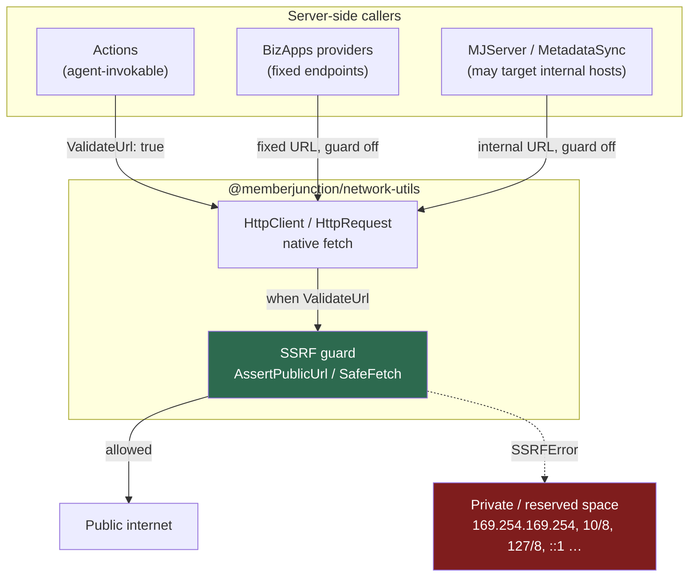
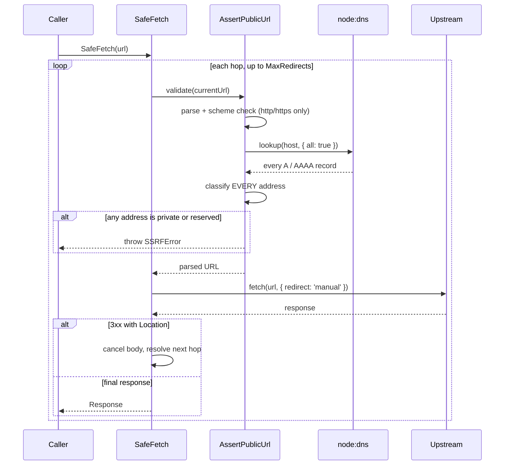

# @memberjunction/network-utils

Low-level, **server-side only** network utilities for MemberJunction: an SSRF guard that stops the server being tricked into fetching internal addresses, and a dependency-free HTTP client built on Node's native `fetch`. This package has **no MemberJunction dependencies and no third-party dependencies** — only `node:dns` and `node:net` — so it sits below everything else and any server-side package can use it without risking a cycle.

## Installation

```bash
npm install @memberjunction/network-utils
```

No peer dependencies, no optional extras, no configuration. Node 18 or later, for native `fetch`.

> **Node only.** This package imports `node:dns` and `node:net` and must never be pulled into a browser bundle. That constraint is precisely why the SSRF guard does not live in `@memberjunction/global`, which ships to the browser.

## Overview

Two concerns live here, and they belong together.

**The SSRF guard.** Any server-side code that fetches a URL it did not hard-code is a read-SSRF risk. An attacker who can influence that URL — through an AI agent, an Action parameter, a workflow, or an API field — can make the server fetch an address only the server can reach, and read the response back. The cloud metadata endpoint (`http://169.254.169.254/`) is the classic target, because on an unhardened instance it hands out IAM credentials to anything that asks.

**The HTTP client.** MJ previously reached for `axios` in eleven packages. Replacing it with one native-`fetch` client removes a third-party dependency from the supply chain, and — more importantly — creates a single place every outbound request passes through. That is what makes the guard *enforceable*: it is one option flag (`ValidateUrl`) away at every call site, which is impossible when each package brings its own HTTP library.



## Key Features

- **Resolves before it trusts.** Checks every A/AAAA record a hostname maps to, not just the first, closing the multi-record DNS bypass.
- **Re-validates every redirect hop**, closing the redirect bypass that defeats one-time hostname checks.
- **Fails closed.** An unparseable address, an unresolvable host, or an unrecognized scheme is rejected rather than passed through.
- **Zero dependencies.** `node:dns` and `node:net` only — nothing to audit, nothing to keep patched.
- **A familiar HTTP client** with `BaseURL`, default headers, timeouts, typed responses, and hooks that replace axios interceptors.
- **Security errors are their own type.** `SSRFError` never masquerades as a transport failure, so a blocked URL is never retried or counted as an outage.

## Quick Start

### Fetching a URL you control

```ts
import { HttpGet, HttpPost } from '@memberjunction/network-utils';

const response = await HttpGet<Payload>('https://api.example.com/things', {
    Query: { page: 1, tag: ['a', 'b'] },        // -> ?page=1&tag=a&tag=b
    Headers: { Authorization: `Bearer ${token}` },
    Timeout: 30000,
});

response.Data;      // parsed body, typed as Payload
response.Status;    // 200
response.Headers;   // lower-cased keys

await HttpPost('https://api.example.com/things', { name: 'Widget' });   // JSON-encoded
```

### Fetching a URL someone else controls

```ts
import { SafeFetch, SSRFError } from '@memberjunction/network-utils';

try {
    const response = await SafeFetch(userSuppliedUrl);
    const html = await response.text();
} catch (error) {
    if (error instanceof SSRFError) {
        return { Success: false, ResultCode: 'SSRF_BLOCKED', Message: error.message };
    }
    throw error;
}
```

### A configured client for one upstream API

```ts
import { HttpClient } from '@memberjunction/network-utils';

const client = new HttpClient({
    BaseURL: 'https://graph.facebook.com/v18.0',
    Timeout: 30000,
    Headers: { Accept: 'application/json' },

    OnRequest: (config) => ({                              // replaces a request interceptor
        ...config,
        Query: { ...config.Query, access_token: token },
    }),

    OnRetry: async (error) => {                            // replaces an error interceptor
        if (error.Status !== 429) return false;
        await sleep(60_000);
        return true;                                       // bounded by MaxRetries (default 3)
    },
});

const feed = await client.Get<Feed>('/me/feed');
```

## Choosing an entry point

| You have | Use | Why |
|---|---|---|
| A hard-coded provider URL, one call | `HttpGet` / `HttpPost` / … | Simplest thing that works |
| A hard-coded provider URL, many calls sharing auth | `new HttpClient({ … })` | Base URL, headers, and retry policy in one place |
| A URL from an agent, Action param, API caller, or stored data | `SafeFetch` | Guarded, and you get the raw `Response` |
| The same, but you want the body parsed for you | `SafeHttpRequest` | `HttpRequest` with `ValidateUrl` forced on |
| An address you already resolved | `IsBlockedIPAddress` | Pure, synchronous, no DNS |
| A URL to check but not fetch | `AssertPublicUrl` | Validation only |

---

## The SSRF guard

### Why a scheme check is not enough

The obvious defence — "reject anything that isn't `http`/`https`, and reject hostnames that look internal" — fails against three independent bypasses:

| Bypass | What it looks like | Why a naive check misses it |
|---|---|---|
| **Literal addresses in disguise** | `http://0x7f.1/`, `http://2130706433/`, `http://[::ffff:127.0.0.1]/` | All are loopback; none of them string-match `127.0.0.1` |
| **DNS with a private answer** | `http://evil.example.com/` resolving to `10.0.0.5` | The hostname is a perfectly ordinary public name |
| **Redirects** | A public URL replying `302 Location: http://169.254.169.254/` | The URL you validated is not the URL you end up fetching |

A variation on the second — **DNS rebinding** — is subtler still: publish two A records, one public and one private, and let the resolver choose. Checking only the first address returned means the guard and the connection can disagree.

This package addresses all three: addresses are classified numerically after resolution rather than by string matching, *every* resolved address must be public, and every redirect hop is re-validated.

### How `SafeFetch` works



### Blocked ranges

**IPv4**

| Range | What it is |
|---|---|
| `0.0.0.0/8` | "This" network / unspecified |
| `10.0.0.0/8` | Private (RFC 1918) |
| `100.64.0.0/10` | Carrier-grade NAT |
| `127.0.0.0/8` | Loopback |
| `169.254.0.0/16` | Link-local — **includes `169.254.169.254`, the cloud metadata endpoint** |
| `172.16.0.0/12` | Private (RFC 1918) |
| `192.0.0.0/24` | IETF protocol assignments |
| `192.0.2.0/24` | TEST-NET-1 |
| `192.88.99.0/24` | 6to4 relay anycast |
| `192.168.0.0/16` | Private (RFC 1918) |
| `198.18.0.0/15` | Benchmarking |
| `198.51.100.0/24` | TEST-NET-2 |
| `203.0.113.0/24` | TEST-NET-3 |
| `224.0.0.0/4` | Multicast |
| `240.0.0.0/4` | Reserved, including the `255.255.255.255` broadcast address |

**IPv6**

| Range | What it is |
|---|---|
| `::1` | Loopback |
| `::` | Unspecified |
| `fc00::/7` | Unique local addresses |
| `fe80::/10` | Link-local |
| `ff00::/8` | Multicast |
| `::ffff:a.b.c.d` | IPv4-mapped — unwrapped, then run through the IPv4 rules |
| `::a.b.c.d` | IPv4-compatible — same treatment |

### What this does *not* protect against

Being straight about the limits matters more than the feature list:

- **A TOCTOU rebinding race.** There is an unavoidable gap between validating an address and connecting to it, during which DNS can change. Closing it entirely requires pinning the resolved address at the socket layer (a custom agent that dials the validated IP with the original `Host` header). This package validates; it does not pin. For most MJ threat models — an agent coaxed into fetching a URL — that residual risk is acceptable, but it is real, and it is the right next step if this guard ever fronts something highly sensitive.
- **Write-SSRF side effects.** The guard stops the server *reaching* private space. It does not reason about what a request *does*. A `POST` to a permitted public URL is still a `POST`.
- **Data exfiltration to a public host.** A public URL is allowed by design. If the risk you care about is data leaving, you want an allowlist, not a denylist.
- **Anything you route around.** Calling `fetch` directly, or leaving `ValidateUrl` off on a caller-controlled URL, bypasses all of this.

### Why the guard defaults to off

`ValidateUrl` defaults to **`false`** on `HttpRequest` and `HttpClient`. That is deliberate, and worth understanding before you change it:

- Most MJ call sites talk to **fixed, well-known provider endpoints** (`api.twitter.com`, `graph.facebook.com`). Guarding those buys nothing and costs a DNS lookup per request.
- Some legitimately talk to **internal hosts** — MJServer posting to its own CodeGen API on localhost, MetadataSync resolving an `@url:` reference on a developer's machine. Guarding those by default would break them.

So the rule is not "always on", it is **on wherever the URL is caller-controlled** — anything reachable by an AI agent, an Action parameter, an API caller, or data those can write. `SafeFetch` and `SafeHttpRequest` have it on and cannot be turned off.

---

## The HTTP client

### Responses

Every request resolves to an `HttpResponse<T>`:

```ts
interface HttpResponse<T> {
    Data: T;                            // parsed per ResponseType
    Status: number;
    StatusText: string;
    Headers: Record<string, string>;    // keys are always lower-cased
    Url: string;                        // final URL, after redirects
    Ok: boolean;                        // Status is 2xx
}
```

Supply the type parameter at the call site so `Data` is typed rather than `unknown`:

```ts
const response = await HttpGet<{ items: Item[] }>(url);
response.Data.items;   // typed
```

### Errors

Non-2xx responses throw `HttpError` — matching axios's default — but with everything flattened onto the error rather than nested under a `response` property that may or may not exist:

```ts
try {
    await client.Get('/thing');
} catch (error) {
    if (!IsHttpError(error)) throw error;

    if (error.IsCancelled) return;            // the caller aborted; expected
    if (error.IsTimeout) { /* our Timeout elapsed */ }
    else if (error.Status === 404) { /* ... */ }
    else if (error.Status === 429) await backOff(error.Headers['retry-after']);
}
```

`Status` is `0` when the request never produced a response, so `error.Status === 404` is always safe to write. Pass `ThrowOnError: false` to get the response back instead — the equivalent of axios's `validateStatus: () => true`.

`SSRFError` is deliberately **not** an `HttpError` and is never wrapped in one, so a security decision can never be confused with an unreachable host, retried by a retry hook, or logged as an outage.

### Request bodies

| You pass | What happens |
|---|---|
| A plain object or array | JSON-encoded, `Content-Type: application/json` added unless you set one |
| `URLSearchParams` | Passed through; `fetch` sets `application/x-www-form-urlencoded` |
| `FormData` | Passed through; `fetch` sets `multipart/form-data` **with the boundary** |
| `string`, `Blob`, `ArrayBuffer`, typed arrays, `ReadableStream` | Passed through untouched |
| Anything, on `GET`/`HEAD` | Ignored — those methods take no body |

> Use the global WHATWG `FormData` and `Blob`, not the `form-data` npm package. The latter produces a Node stream that native `fetch` cannot consume, and its `getHeaders()` has no equivalent — `fetch` derives the multipart boundary itself.

### Response types

`ResponseType` accepts `json` (default), `text`, `arraybuffer`, `blob`, `stream`, and `none`. The `json` reader is forgiving in two ways that match axios: an empty body yields `null` rather than throwing, and a body that is not valid JSON is returned as raw text rather than throwing — which keeps you working when a server mislabels its `Content-Type`.

### Query strings

`null` and `undefined` entries are omitted entirely rather than becoming the strings `"null"`/`"undefined"`; arrays expand to repeated keys (`?tag=a&tag=b`); `Date` values render as ISO 8601.

### Defaults

| Option | Default |
|---|---|
| `Method` | `GET` |
| `ResponseType` | `json` (`none` for `HEAD`) |
| `Timeout` | `30000` ms (`0` disables) |
| `ThrowOnError` | `true` |
| `ValidateUrl` | `false` |
| `MaxRedirects` | `5` |
| `MaxRetries` (client) | `3` |

---

## Migrating from axios

The shape deliberately mirrors the parts of axios MJ actually used, so call sites port over mechanically.

| axios | here |
|---|---|
| `axios.get(url, { params, headers, timeout })` | `HttpGet(url, { Query, Headers, Timeout })` |
| `axios.post(url, body, config)` | `HttpPost(url, body, config)` |
| `axios.request({ url, method, data, params })` | `HttpRequest({ Url, Method, Body, Query })` |
| `axios.create({ baseURL, headers, timeout })` | `new HttpClient({ BaseURL, Headers, Timeout })` |
| `response.data` / `.status` / `.headers` | `response.Data` / `.Status` / `.Headers` |
| `axios.isAxiosError(e)` | `IsHttpError(e)` |
| `axios.isCancel(e)` | `IsCancellationError(e)` |
| `e.response?.status` / `e.response?.data` | `e.Status` / `e.Data` (always present) |
| `validateStatus: () => true` | `ThrowOnError: false` |
| `auth: { username, password }` | `BasicAuth: { Username, Password }` |
| `signal` | `Signal` |
| `responseType: 'arraybuffer'` | `ResponseType: 'arraybuffer'` |
| `transformRequest` for form encoding | Pass a `URLSearchParams` body |
| `interceptors.request.use(fn)` | `OnRequest` |
| `interceptors.response.use(onOk)` | `OnResponse` |
| `interceptors.response.use(_, onErr)` | `OnRetry` |

### Interceptors become hooks

The one genuine difference. axios interceptors are entries appended to a mutable, instance-global chain; recovering from an error means re-issuing the request yourself. Here, the hooks are plain options — visible at the construction site, not modifiable from elsewhere — and retry is expressed as a boolean.

```ts
// Before — axios
instance.interceptors.response.use(
    (response) => response,
    async (error) => {
        if (error.response?.status === 429) {
            await sleep(60_000);
            return instance.request(error.config);   // you re-issue it
        }
        return Promise.reject(error);
    },
);

// After — network-utils
new HttpClient({
    OnRetry: async (error) => {
        if (error.Status !== 429) return false;
        await sleep(60_000);
        return true;                                  // the client re-issues it, bounded
    },
});
```

`OnRequest` runs again before each retry, so a token refreshed inside `OnRetry` is picked up automatically:

```ts
new HttpClient({
    OnRequest: (config) => ({
        ...config,
        Headers: { ...config.Headers, Authorization: `Bearer ${this.getAccessToken()}` },
    }),
    OnRetry: async (error) => {
        if (error.Status !== 401) return false;
        await this.refreshAccessToken();
        return true;                                  // next attempt gets the new token
    },
});
```

---

## Testing against this package

Mock the module rather than the network. Two things catch people out:

1. **`HttpClient` must be mocked with a `function`, not an arrow function** — arrows are not constructible, so `new HttpClient()` throws.
2. Mock resolved values are `HttpResponse` shaped: `Data`, not `data`.

```ts
const http = vi.hoisted(() => ({
    instance: { Get: vi.fn(), Post: vi.fn(), Put: vi.fn(), Delete: vi.fn(), Request: vi.fn() },
    standalone: { HttpGet: vi.fn(), HttpPost: vi.fn() },
}));

vi.mock('@memberjunction/network-utils', () => ({
    HttpClient: vi.fn(function () { return http.instance; }),   // NOT () => http.instance
    HttpError: class HttpError extends Error {
        Status = 0;
        Data: unknown = undefined;
        Headers: Record<string, string> = {};
    },
    IsHttpError: vi.fn((e: unknown) => typeof e === 'object' && e !== null && 'Status' in e),
    ...http.standalone,
}));

// then, in a test:
http.instance.Get.mockResolvedValue({ Data: { id: 1 }, Headers: {}, Status: 200 });
```

To test the guard itself, mock `node:dns` so a hostname resolves wherever you need it to — see `src/__tests__/SSRFGuard.test.ts` for a working harness covering rebinding, IPv4-mapped IPv6, and fail-closed behavior.

## API Reference

### SSRF guard

| Export | Signature | Purpose |
|---|---|---|
| `SafeFetch` | `(url: string, init?: SafeFetchInit) => Promise<Response>` | `fetch` with per-hop SSRF re-validation |
| `AssertPublicUrl` | `(url: string) => Promise<URL>` | Validate without fetching; throws `SSRFError` |
| `IsBlockedIPAddress` | `(address: string) => boolean` | Classify one IP literal; pure, no DNS |
| `SSRFError` | `class extends Error` | Thrown when a URL is blocked |
| `SafeFetchInit` | `RequestInit & { MaxRedirects?: number }` | `SafeFetch` options |

### HTTP client

| Export | Signature | Purpose |
|---|---|---|
| `HttpRequest` | `<T>(config: HttpRequestConfig) => Promise<HttpResponse<T>>` | One request, full config |
| `HttpGet` / `HttpDelete` / `HttpHead` | `<T>(url, config?) => Promise<HttpResponse<T>>` | Method shorthands |
| `HttpPost` / `HttpPut` / `HttpPatch` | `<T>(url, body?, config?) => Promise<HttpResponse<T>>` | Method shorthands with a body |
| `SafeHttpRequest` | `<T>(config) => Promise<HttpResponse<T>>` | `HttpRequest` with `ValidateUrl` forced on |
| `HttpClient` | `class` | Configured client — replaces `axios.create(...)` |
| `HttpError` | `class extends Error` | Non-2xx, timeout, cancellation, or transport failure |
| `IsHttpError` | `(e: unknown) => e is HttpError` | Replaces `isAxiosError` |
| `IsCancellationError` | `(e: unknown) => boolean` | Replaces `isCancel` |
| `BuildQueryString` | `(query: Record<string, HttpQueryValue>) => string` | Query serialization |

### Types

`HttpMethod`, `HttpResponseType`, `HttpQueryValue`, `HttpResponse<T>`, `HttpRequestConfig`, `HttpClientOptions`.

## Security Considerations

- **Turn the guard on wherever the URL is caller-controlled.** It is off by default for the reasons above; that default is a convenience for fixed endpoints, not a judgement that guarding is optional.
- **Do not echo the blocked address back to the caller.** `SSRFError`'s message is deliberately non-specific. Reporting *which* address a hostname resolved to turns the guard into an internal network scanner for whoever supplied the URL.
- **Do not retry an `SSRFError`.** It is a decision, not a transient fault. The client already excludes it from `OnRetry`.
- **Denylists have an edge.** This blocks the documented private and reserved ranges. If your threat model needs certainty rather than good coverage, use an allowlist of permitted hosts instead — and note the TOCTOU limitation above.
- **The guard is not authorization.** It prevents reaching private space; it does not decide whether *this* user may fetch *that* public resource.

## Troubleshooting

**`SSRFError: URL resolves to a private or reserved address and was blocked`**
The hostname resolved to something in a blocked range. On a developer machine this is usually intentional — `localhost` and Docker-internal hostnames are blocked by design. If the target is legitimately internal, it should not be going through the guard at all; use `HttpRequest` with `ValidateUrl` off.

**`SSRFError: Unable to resolve hostname '...'`**
The guard fails closed: a name that will not resolve is rejected rather than handed to `fetch`. Check DNS and the spelling of the host.

**`Exceeded maximum of N redirects`**
A redirect loop, or a chain longer than `MaxRedirects` (default 5). Raise it if the upstream genuinely needs more hops.

**`Request to ... timed out after 30000ms`**
The default timeout elapsed. Raise `Timeout`, or pass `0` to disable it for a genuinely long-running call.

**`HttpClient is not a constructor` in tests**
The mock used an arrow function. See [Testing against this package](#testing-against-this-package).

**A multipart upload is rejected by the upstream**
Check you are using the global `FormData`/`Blob` rather than the `form-data` npm package, and that you are not setting `Content-Type` by hand — doing so overwrites the boundary `fetch` generated.

## Dependencies

None. This package depends on no MemberJunction package and no third-party package; it imports only `node:dns` and `node:net` from the Node standard library. That is a deliberate constraint — it is what lets the package sit at the bottom of the dependency graph and be safely consumed by anything server-side.

## License

Business Source License 1.1 — see [LICENSE](../../LICENSE) for details.
