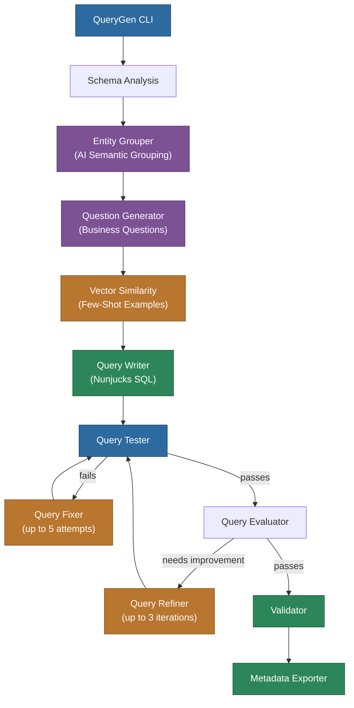

# @memberjunction/query-gen

AI-powered SQL query template generator for MemberJunction. Analyzes your database schema, generates meaningful business questions, creates SQL queries, tests them, refines them through iterative feedback, and exports them to MemberJunction metadata format.

## Overview



QueryGen automates the creation of SQL query templates through an 11-phase AI-powered pipeline:

1. **Schema Analysis** - Loads entities and relationship graphs from MemberJunction metadata
2. **Entity Grouping** - Uses AI to generate semantically meaningful entity combinations (2-3 related entities)
3. **Business Question Generation** - AI creates domain-specific questions for each entity group
4. **Vector Similarity Search** - Finds similar golden queries using weighted cosine similarity for few-shot learning
5. **SQL Template Generation** - AI generates Nunjucks-parameterized SQL with proper syntax
6. **Query Testing** - Executes SQL against database to validate functionality
7. **Error Fixing** - AI automatically corrects SQL syntax and logic errors (up to 5 attempts)
8. **Query Evaluation** - AI assesses if query answers the business question correctly
9. **Query Refinement** - AI improves queries based on evaluation feedback (up to 3 iterations)
10. **Comprehensive Validation** - Validates all generated queries against schema and execution
11. **Export** - Outputs to MJ metadata format (JSON files) or directly to database

**Status**: Production-ready with complete implementation of all 11 phases.

## Installation

```bash
# From MJ repository root
cd packages/QueryGen
npm install
npm run build

# Link for global CLI usage (optional)
npm link
```

## Quick Start

QueryGen is integrated into the MemberJunction CLI (`mj`) for seamless workflow integration. You can also use the standalone CLI for direct access.

### Using MemberJunction CLI (Recommended)

```bash
# Generate queries for all entities
mj querygen generate

# Generate with verbose output
mj querygen generate -v

# Generate for specific entities
mj querygen generate --entities "Customers,Orders,Products"

# Exclude specific schemas
mj querygen generate --exclude-schemas "sys,INFORMATION_SCHEMA"

# Validate existing queries
mj querygen validate

# Export queries from database
mj querygen export
```

### Using Standalone CLI

```bash
# Generate queries for all entities
mj-querygen generate

# Generate with verbose output
mj-querygen generate -v

# Generate for specific entities
mj-querygen generate -e Customers Orders Products

# Exclude specific schemas
mj-querygen generate -s sys INFORMATION_SCHEMA
```

### Additional Examples

```bash
# Validate queries with MJ CLI
mj querygen validate --path ./metadata/queries

# Export from database with MJ CLI
mj querygen export --output ./exported-queries

# Or use standalone CLI
mj-querygen validate -p ./metadata/queries
mj-querygen export -o ./exported-queries
```

## Configuration

### CLI Options

#### Generate Command

```bash
mj-querygen generate [options]

Options:
  -e, --entities <names...>        Specific entities to generate queries for
  -x, --exclude-entities <names...> Entities to exclude from generation
  -s, --exclude-schemas <names...>  Schemas to exclude (default: sys, INFORMATION_SCHEMA)
  -m, --max-entities <number>       Max entities per group (default: 3)
  -r, --max-refinements <number>    Max refinement iterations (default: 3)
  -f, --max-fixes <number>          Max error-fixing attempts (default: 5)
  --model <name>                    Preferred AI model (overrides config)
  --vendor <name>                   Preferred AI vendor (overrides config)
  -o, --output <path>               Output directory (default: ./metadata/queries)
  --mode <mode>                     Output mode: metadata|database|both (default: metadata)
  -v, --verbose                     Enable verbose output
  -h, --help                        Display help information
```

#### Validate Command

```bash
mj-querygen validate [options]

Options:
  -p, --path <path>    Path to queries metadata directory (default: ./metadata/queries)
  -v, --verbose        Enable verbose output
  -h, --help           Display help information
```

#### Export Command

```bash
mj-querygen export [options]

Options:
  -o, --output <path>  Output directory (default: ./metadata/queries)
  -v, --verbose        Enable verbose output
  -h, --help           Display help information
```

### Configuration File (mj.config.cjs)

Add a `queryGen` section to your `mj.config.cjs` file:

```javascript
module.exports = {
  // ... other MJ configuration

  queryGen: {
    // Entity Filtering
    includeEntities: [],              // Allowlist (if provided, ONLY these entities processed)
    excludeEntities: [],              // Denylist (ignored if includeEntities is set)
    excludeSchemas: ['sys', 'INFORMATION_SCHEMA', '__mj'], // Exclude system schemas

    // Entity Grouping
    questionsPerGroup: 2,             // Questions to generate per entity group
    minGroupSize: 2,                  // Minimum entities per group (multi-entity groups)
    maxGroupSize: 3,                  // Maximum entities per group (keep focused)

    // AI Configuration
    modelOverride: undefined,         // Optional: override AI model (e.g., "GPT-OSS-120B")
    vendorOverride: undefined,        // Optional: override AI vendor (e.g., "Groq")
    embeddingModel: 'text-embedding-3-small', // Embedding model for vector similarity

    // Iteration Limits
    maxRefinementIterations: 3,       // Max query refinement cycles
    maxFixingIterations: 5,           // Max error-fixing attempts

    // Few-Shot Learning
    topSimilarQueries: 5,             // Number of golden queries to use as examples

    // Similarity Weighting (for vector search)
    similarityWeights: {
      userQuestion: 0.2,              // 20% weight for question similarity
      description: 0.4,               // 40% weight for description similarity
      technicalDescription: 0.4       // 40% weight for technical description similarity
    },

    // Output Configuration
    outputMode: 'metadata',           // 'metadata', 'database', or 'both'
    outputDirectory: './metadata/queries',
    outputCategoryDirectory: undefined, // Optional: separate directory for categories
    rootQueryCategory: 'Auto-Generated', // Root category for generated queries
    autoCreateEntityQueryCategories: false, // Create per-entity subcategories

    // Performance
    parallelGenerations: 1,           // Parallel query generation (future enhancement)
    enableCaching: true,              // Cache AI prompt results

    // Validation
    testWithSampleData: true,         // Test queries before export
    requireMinRows: 0,                // Minimum rows required (0 = allow empty results)
    maxRefinementRows: 10,            // Max rows used for refinement evaluation (cost optimization)

    // Logging
    verbose: false                    // Enable verbose logging (all logs gated by this flag)
  }
};
```

### Configuration Priority

Configuration is merged in this order (highest to lowest priority):

1. **CLI options** - Command line flags
2. **mj.config.cjs** - queryGen section
3. **Default values** - Built-in defaults

## Architecture

### 11-Phase Pipeline

QueryGen orchestrates an 11-phase workflow:

```
┌─────────────────────────────────────────────────────────────┐
│ Phase 1: Entity Analysis                                    │
│ - Load entities from Metadata                               │
│ - Filter by include/exclude lists                           │
│ - Build foreign key relationship graph                      │
└─────────────────────────────────────────────────────────────┘
                            ↓
┌─────────────────────────────────────────────────────────────┐
│ Phase 2: Entity Grouping (LLM-Based Semantic Analysis)     │
│ - AI analyzes relationship graph for meaningful groupings  │
│ - Generates groups of 2-3 related entities                  │
│ - Includes business context: domain, rationale, questions   │
│ - Validates connectivity and deduplicates groups            │
└─────────────────────────────────────────────────────────────┘
                            ↓
┌─────────────────────────────────────────────────────────────┐
│ Phase 3: Business Question Generation                       │
│ - Use AI to generate domain-specific questions              │
│ - 1-2 questions per entity group                            │
│ - Vary complexity (simple aggregations → complex joins)     │
└─────────────────────────────────────────────────────────────┘
                            ↓
┌─────────────────────────────────────────────────────────────┐
│ Phase 4: Vector Similarity Search                           │
│ - Embed business question using local embeddings            │
│ - Find top-K similar golden queries                         │
│ - Weighted cosine similarity across multiple fields         │
└─────────────────────────────────────────────────────────────┘
                            ↓
┌─────────────────────────────────────────────────────────────┐
│ Phase 5: SQL Query Generation                               │
│ - Use AI with few-shot examples                             │
│ - Generate Nunjucks SQL templates                           │
│ - Define parameters and output fields                       │
└─────────────────────────────────────────────────────────────┘
                            ↓
┌─────────────────────────────────────────────────────────────┐
│ Phase 6: Query Testing                                      │
│ - Render template with sample parameter values              │
│ - Execute SQL against database                              │
│ - Validate results (row count, schema)                      │
└─────────────────────────────────────────────────────────────┘
                            ↓
┌─────────────────────────────────────────────────────────────┐
│ Phase 7: Error Fixing (if needed)                           │
│ - Pass error message to AI                                  │
│ - AI fixes SQL syntax/logic errors                          │
│ - Retry up to maxFixingIterations                           │
└─────────────────────────────────────────────────────────────┘
                            ↓
┌─────────────────────────────────────────────────────────────┐
│ Phase 8: Query Evaluation                                   │
│ - AI evaluates if query answers business question           │
│ - Checks result relevance, completeness, correctness        │
│ - Generates improvement suggestions                         │
└─────────────────────────────────────────────────────────────┘
                            ↓
┌─────────────────────────────────────────────────────────────┐
│ Phase 9: Query Refinement (if needed)                       │
│ - AI refines query based on evaluation feedback             │
│ - Iterative loop up to maxRefinementIterations              │
│ - Returns best refined query                                │
└─────────────────────────────────────────────────────────────┘
                            ↓
┌─────────────────────────────────────────────────────────────┐
│ Phase 10: Validation                                        │
│ - Comprehensive validation of all generated queries         │
│ - Type checking, parameter validation, execution tests      │
└─────────────────────────────────────────────────────────────┘
                            ↓
┌─────────────────────────────────────────────────────────────┐
│ Phase 11: Metadata Export                                   │
│ - Export to JSON metadata files (metadata mode)             │
│ - Insert into database tables (database mode)               │
│ - Create Queries, Query Fields, Query Params records        │
└─────────────────────────────────────────────────────────────┘
```

See [docs/ARCHITECTURE.md](./docs/ARCHITECTURE.md) for detailed technical architecture.

## Core Components

### EntityGrouper

Uses AI to generate semantically meaningful entity groups with business context:

```typescript
const grouper = new EntityGrouper(config);
const groups = await grouper.generateEntityGroups(entities, contextUser);
// Returns groups with businessDomain, businessRationale, expectedQuestionTypes
```

### QuestionGenerator

Generates business questions using AI with validation:

```typescript
const generator = new QuestionGenerator(contextUser, config);
const questions = await generator.generateQuestions(entityGroup);
// Returns validated questions with complexity, aggregation, and join flags
```

### QueryWriter

Generates SQL templates using AI with few-shot learning and validation:

```typescript
const writer = new QueryWriter(contextUser, config);
const query = await writer.generateQuery(
  businessQuestion,
  entityMetadata,
  fewShotExamples
);
// Returns Nunjucks SQL template with parameters
// Includes retry logic with validation feedback (up to 3 attempts)
```

### QueryTester

Tests queries by rendering templates and executing against database:

```typescript
const tester = new QueryTester(entityMetadata, question, contextUser, config);
const result = await tester.testQuery(query, 5); // max 5 error-fixing attempts
// Returns success, sample rows, or error details
// Integrates with QueryFixer for automatic error correction
```

### QueryRefiner

Evaluates and refines queries iteratively based on AI feedback:

```typescript
const refiner = new QueryRefiner(tester, contextUser, config);
const refined = await refiner.refineQuery(
  query,
  businessQuestion,
  entityMetadata
);
// Evaluation → Feedback → Refinement cycle (up to 3 iterations)
// Uses first 10 sample rows for cost optimization
```

### MetadataExporter

Exports validated queries to MemberJunction metadata JSON format:

```typescript
const exporter = new MetadataExporter();
const result = await exporter.exportQueries(
  validatedQueries,
  uniqueCategories,
  config.outputDirectory,
  config.outputCategoryDirectory
);
// Creates .queries-{timestamp}.json and .query-categories-{timestamp}.json
// Compatible with mj-sync push for database synchronization
```

### QueryDatabaseWriter

Writes queries directly to database as Query entities:

```typescript
const writer = new QueryDatabaseWriter();
await writer.writeQueriesToDatabase(validatedQueries, contextUser);
// Creates QueryEntity records using GetEntityObject pattern
// QueryFields and QueryParams are automatically extracted by QueryEntity.server.ts
```

## Workflow Examples

### Example 1: Generate Queries for Specific Entities

```bash
# Generate queries for customer-related entities
mj-querygen generate \
  -e Customers Orders "Order Details" Products \
  -m 2 \
  -v

# Output:
# ✓ Metadata loaded
# ✓ Found 6 entity groups
# ✓ Embedded 20 golden queries
# [1/6] Processing Customers...
# [1/6] ✓ Customers complete (2 queries)
# [2/6] Processing Orders...
# [2/6] ✓ Orders complete (2 queries)
# ...
# ✓ Exported to ./metadata/queries/queries-1234567890.json
#
# ✓ Query generation complete!
#
# Summary:
#   Entity Groups Processed: 6
#   Queries Generated: 12
#   Output Location: ./metadata/queries
```

### Example 2: Validate Existing Queries

```bash
# Validate all queries in metadata directory
mj-querygen validate -p ./metadata/queries -v

# Output:
# ✓ Metadata loaded
# ✓ Found 3 query files
# [1/3] Validating queries-1234567890.json...
# [1/3] ✓ Top Customers By Revenue
# [1/3] ✓ Recent Orders By Status
# [1/3] ✗ Product Sales Analysis: Column 'ProductName' not found
# ...
# ⚠ Validation completed with errors
#
# Summary:
#   Total Queries: 15
#   Passed: 12
#   Failed: 3
```

### Example 3: Export Database Queries to Metadata

```bash
# Export all queries from database
mj-querygen export -o ./exported-queries -v

# Output:
# ✓ Metadata loaded
# ✓ Found 25 queries
# [1/25] Exporting Customer Summary...
# [1/25] ✓ Exported Customer Summary
# ...
# ✓ All 25 queries exported successfully!
```

## Troubleshooting

### Common Errors

#### Database Connection Errors

**Error**: `Metadata provider not configured`

**Solution**: Ensure database connection is configured in `mj.config.cjs`

#### AI Prompt Failures

**Error**: `Prompt 'Business Question Generator' not found`

**Solution**: Sync AI prompts to database with `npx mj-sync push`

#### Template Rendering Errors

**Error**: `Template rendering failed: Unknown filter 'sqlString'`

**Solution**: Verify QueryParameterProcessor is imported and SQL filters are registered

#### Validation Failures

**Error**: `Query returned no results`

**Solution**: Ensure database has sample data or set `requireMinRows: 0`

### Performance Issues

#### Slow Generation

**Solutions**:
- Reduce `maxEntitiesPerGroup` (3 → 2)
- Reduce `questionsPerGroup` (2 → 1)
- Increase `parallelGenerations` (1 → 3)
- Enable `enableCaching: true`

#### High Token Costs

**Solutions**:
- Use cheaper models (Gemini 2.5 Flash, GPT 5-nano)
- Reduce `topSimilarQueries` (5 → 3)
- Reduce `maxRefinementIterations` (3 → 2)
- Reduce `maxFixingIterations` (5 → 3)

## Programmatic Usage

QueryGen can be used as a library in your applications:

```typescript
import {
  EntityGrouper,
  QuestionGenerator,
  QueryWriter,
  QueryTester,
  QueryRefiner,
  MetadataExporter
} from '@memberjunction/query-gen';

async function generateQueriesForEntity(entityName: string, contextUser: UserInfo) {
  // 1. Load entity metadata
  const md = new Metadata();
  const entity = md.Entities.find(e => e.Name === entityName);

  // 2. Create entity group
  const grouper = new EntityGrouper();
  const groups = await grouper.generateEntityGroups([entity], 1, 1);

  // 3. Generate business questions
  const questionGen = new QuestionGenerator(contextUser);
  const questions = await questionGen.generateQuestions(groups[0]);

  // 4. Generate and test SQL queries
  const queryWriter = new QueryWriter(contextUser);
  const query = await queryWriter.generateQuery(
    questions[0],
    entityMetadata,
    fewShotExamples
  );

  // 5. Test and refine
  const tester = new QueryTester(dataProvider, entityMetadata, questions[0], contextUser);
  const testResult = await tester.testQuery(query, 5);

  if (testResult.success) {
    const refiner = new QueryRefiner(tester, contextUser);
    const refined = await refiner.refineQuery(query, questions[0], entityMetadata, 3);
    return refined.query;
  }
}
```

See [docs/API.md](./docs/API.md) for detailed API documentation.

## Key Features & Design Decisions

### LLM-Based Semantic Entity Grouping

QueryGen uses AI to analyze database schemas and generate meaningful entity groupings based on business context, replacing traditional deterministic algorithms. Each group includes:

- **Business Domain** - Clear business area label (e.g., "Sales Pipeline", "Inventory Management")
- **Business Rationale** - Explanation of why this grouping matters
- **Expected Question Types** - Types of questions this group supports
- **Relationship Type** - Parent-child or many-to-many relationships

This approach generates more meaningful queries aligned with actual business use cases.

### Weighted Vector Similarity Search

Few-shot learning uses multi-field weighted cosine similarity to find relevant golden query examples:

- **userQuestion**: 20% weight (natural language varies more)
- **description**: 40% weight (business logic matching)
- **technicalDescription**: 40% weight (implementation details)

Each field is embedded separately using local embeddings (`text-embedding-3-small`) for precise similarity matching.

### Iterative Quality Improvement

QueryGen implements a sophisticated refinement loop:

1. **Error Fixing Phase** - AI corrects SQL syntax/logic errors (up to 5 attempts)
2. **Evaluation Phase** - AI assesses if query answers the business question
3. **Refinement Phase** - AI improves query based on evaluation feedback (up to 3 iterations)

This multi-stage approach ensures high-quality queries that actually solve business problems.

### Cost Optimization

- **Limited Sample Data** - Uses only first 10 rows for evaluation (reduces token costs)
- **Validation Feedback** - Failed generations provide feedback to AI (improves success rate)
- **Multi-Model Failover** - 6-model priority chain balances quality and cost

### Automatic Field Extraction

QueryGen generates SQL templates with parameters, but **QueryFields** and **QueryParams** are automatically extracted by `QueryEntity.server.ts` during Save(). This eliminates duplication and ensures SQL is the single source of truth.

## Environment Requirements

### Database

- SQL Server 2016 or later
- MemberJunction metadata tables populated
- Sample data for query testing (recommended)

### AI Models

QueryGen uses 6 AI prompts, each configured with 6-model failover:

1. **Claude 4.5 Sonnet** (Anthropic) - Priority 1
2. **Kimi K2** (Groq) - Priority 2
3. **Kimi K2** (Cerebras) - Priority 3
4. **Gemini 2.5 Flash** (Google) - Priority 4
5. **GPT-OSS-120B** (Groq) - Priority 5
6. **GPT 5-nano** (OpenAI) - Priority 6

Model/vendor can be overridden with `--model` and `--vendor` CLI flags.

### Embeddings

- Default: `text-embedding-3-small`
- Runs via AIEngine's `EmbedTextLocal()` method
- No external API calls required
- 20 golden queries pre-embedded for few-shot learning

## Best Practices

### Query Generation

1. **Start Small** - Begin with a few representative entities to validate the pipeline
2. **Sample Data** - Ensure database has representative sample data for testing
3. **Entity Filtering** - Use `--entities` or `--exclude-entities` to focus on specific domains
4. **Verbose Mode** - Use `-v` flag for detailed logging during initial runs
5. **Review Generated Queries** - Always review SQL templates before production use

### Configuration Tuning

1. **Group Size** - Keep `maxGroupSize: 3` for focused, manageable queries
2. **Refinement Iterations** - Use 3 iterations for quality, 1-2 for speed
3. **Model Selection** - Use `--model` and `--vendor` for cost/performance optimization
4. **Output Mode** - Use `metadata` mode for review, `database` mode for direct import

### Golden Query Library

QueryGen includes 20 golden queries in `/src/data/golden-queries.json` covering common patterns:

- **Aggregations** - COUNT, SUM, AVG, MIN, MAX
- **Grouping** - GROUP BY with various aggregations
- **Joins** - Simple joins (parent-child), complex joins (many-to-many)
- **Filtering** - WHERE clauses with parameterization
- **Sorting** - ORDER BY with multiple columns
- **Window Functions** - ROW_NUMBER, RANK, DENSE_RANK
- **Date Operations** - Date filtering and grouping
- **TOP N Queries** - Top customers, products, etc.

**To add your own golden queries:**
1. Follow the structure in `golden-queries.json`
2. Include complete parameter definitions with `sampleValue`
3. Use Nunjucks syntax with SQL-safe filters
4. Rebuild package to update embeddings

### Performance Optimization

1. **Reduce Entity Count** - Filter to specific schemas or entities
2. **Lower Question Count** - Set `questionsPerGroup: 1` for faster generation
3. **Skip Refinement** - Set `maxRefinementIterations: 0` for draft queries
4. **Use Faster Models** - Override with Groq or Cerebras models

## Contributing

QueryGen is part of the MemberJunction project. Contributions are welcome!

```bash
# Development setup
cd MJ/packages/QueryGen
npm install
npm run build

# Run in watch mode
npm run watch

# Lint and format
npm run lint
npm run format
```

## Support

- GitHub Issues: https://github.com/MemberJunction/MJ/issues
- Documentation: https://docs.memberjunction.com
- Community: https://community.memberjunction.com

## Related Documentation

- [Architecture Deep Dive](./docs/ARCHITECTURE.md) - Technical details
- [API Documentation](./docs/API.md) - Programmatic API reference
- [Implementation Plan](./IMPLEMENTATION_PLAN.md) - Development roadmap
- [MemberJunction Docs](https://docs.memberjunction.com) - Platform documentation

## License

MIT License - see LICENSE file for details
