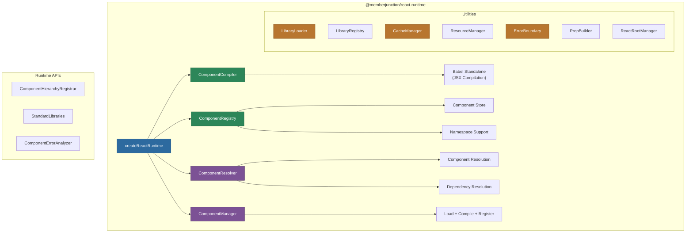

# @memberjunction/react-runtime

Platform-agnostic React component runtime for MemberJunction. Provides core compilation, registry, dynamic library management, and execution capabilities for React components in any JavaScript environment.

## Architecture



## Overview

This package enables dynamic compilation and execution of React components at runtime. Components can be loaded from MemberJunction's database, compiled with Babel, registered into a component registry, and rendered with full dependency resolution.

**Key capabilities:**

- **Component Compilation**: Transpiles JSX/TSX source code using Babel standalone
- **Component Registry**: LRU-cached registry with namespace support for up to 1000 components
- **Component Resolution**: Resolves component specs against the registry with dependency tracking
- **Component Manager**: Unified API for loading, compiling, and registering components in one call
- **Library Management**: Dynamic library loading, registration, and dependency resolution
- **Error Boundaries**: Configurable error boundary creation with logging
- **Prop Building**: Type-safe prop construction with callback normalization and style processing
- **React Root Management**: Managed React root lifecycle for mounting/unmounting components
- **Caching**: LRU cache with configurable TTL for compiled components
- **UMD Build**: Ships both CommonJS and UMD bundles for browser environments

## Installation

```bash
npm install @memberjunction/react-runtime
```

## Usage

### Quick Start

```typescript
import { createReactRuntime } from '@memberjunction/react-runtime';
import * as Babel from '@babel/standalone';

const runtime = createReactRuntime(Babel, {
    compiler: { minify: false, sourceMaps: true, cache: true },
    registry: { maxComponents: 500 }
});

// Compile a component from source
const compiled = runtime.compiler.compile(`
    function MyComponent({ name }) {
        return <div>Hello, {name}!</div>;
    }
`);

// Register it
runtime.registry.register('MyComponent', compiled);

// Resolve for rendering
const resolved = runtime.resolver.resolve({ name: 'MyComponent' });
```

### Component Manager (Unified API)

```typescript
const result = await runtime.manager.load({
    componentSpec: { name: 'MyWidget', source: jsxSource },
    autoRegister: true,
    resolveLibraries: true
});

if (result.success) {
    // Component is compiled, registered, and ready to render
    const Component = result.component;
}
```

### Library Management

```typescript
import { LibraryRegistry, LibraryLoader } from '@memberjunction/react-runtime';

// Register a library for dependency resolution
LibraryRegistry.register({
    name: 'recharts',
    module: rechartsModule,
    version: '2.x'
});

// Load libraries dynamically
const loader = new LibraryLoader();
const result = await loader.load({ name: 'recharts', url: cdnUrl });
```

### Error Boundaries

```typescript
import { createErrorBoundary, withErrorBoundary } from '@memberjunction/react-runtime';

// Create an error boundary component
const ErrorBoundary = createErrorBoundary({
    fallback: (error) => <div>Something went wrong: {error.message}</div>,
    onError: (error) => logError(error)
});

// Or wrap an existing component
const SafeComponent = withErrorBoundary(MyComponent, { fallback: ErrorFallback });
```

### Prop Building

```typescript
import { buildComponentProps, normalizeCallbacks } from '@memberjunction/react-runtime';

const props = buildComponentProps(rawData, {
    normalizeStyles: true,
    normalizeCallbacks: true,
    validateProps: true
});
```

## Exported Modules

| Module | Key Exports |
|--------|-------------|
| **Compiler** | `ComponentCompiler`, `getBabelConfig`, `getJSXConfig` |
| **Registry** | `ComponentRegistry`, `ComponentResolver`, `ComponentRegistryService` |
| **Manager** | `ComponentManager`, `LoadOptions`, `LoadResult` |
| **Runtime** | `createErrorBoundary`, `buildComponentProps`, `ComponentHierarchyRegistrar`, `ReactRootManager` |
| **Utilities** | `LibraryLoader`, `LibraryRegistry`, `CacheManager`, `ResourceManager`, `StandardLibraries` |

## Configuration

```typescript
const DEFAULT_CONFIGS = {
    compiler: {
        babel: { presets: ['react'], plugins: [] },
        minify: false,
        sourceMaps: false,
        cache: true,
        maxCacheSize: 100
    },
    registry: {
        maxComponents: 1000,
        cleanupInterval: 60000,
        useLRU: true,
        enableNamespaces: true
    }
};
```

## Build Outputs

- **CommonJS**: `dist/index.js` -- for Node.js and bundler environments
- **UMD**: `dist/umd/` -- for direct browser usage via script tags

## Dependencies

| Package | Purpose |
|---------|---------|
| `@memberjunction/core` | Core MJ functionality |
| `@memberjunction/global` | MJGlobal utilities |
| `@memberjunction/interactive-component-types` | Component type definitions |
| `@memberjunction/core-entities` | Entity types |
| `@memberjunction/graphql-dataprovider` | GraphQL data access |
| `@babel/standalone` | Runtime JSX compilation |
| `rxjs` | Observable patterns |

## License

ISC
