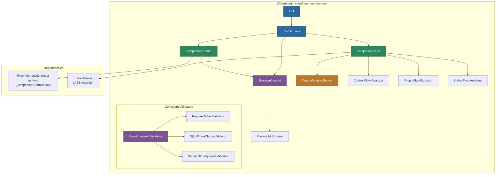

# @memberjunction/react-test-harness

Automated test harness for MemberJunction React components using Playwright. Provides static analysis (linting), constraint validation, browser-based rendering tests, and a CLI for running test suites against dynamically compiled components.

## Architecture



## Overview

This package provides comprehensive testing for MemberJunction's dynamically compiled React components. It combines static analysis (without executing) and runtime testing (via Playwright) to validate components before deployment.

**Key capabilities:**

- **Component Linting**: Static analysis of component source using Babel AST parsing
- **Type Inference**: Infers component prop types from source code and usage patterns
- **Constraint Validation**: Validates data constraints like SQL WHERE clauses, required-when conditions, and entity field subsets
- **Control Flow Analysis**: Detects unreachable code, missing returns, and complex control flow patterns
- **Browser Rendering**: Launches components in a real browser via Playwright for visual/functional testing
- **Prop Value Extraction**: Extracts and validates prop values from JSX source
- **Library Lint Caching**: Caches lint results for external libraries to improve performance
- **CLI Tool**: `mj-react-test` command for running test suites

## Installation

```bash
npm install @memberjunction/react-test-harness
```

## Usage

### CLI

```bash
# Run the test harness
npx mj-react-test

# Or if installed globally
mj-react-test
```

### Programmatic API

```typescript
import { TestHarness } from '@memberjunction/react-test-harness';

const harness = new TestHarness();

// Run all tests for a component
const results = await harness.RunTests(componentSource, {
    libraries: libraryConfigs,
    entityMetadata: entityInfo
});
```

### Component Linting

```typescript
import { ComponentLinter } from '@memberjunction/react-test-harness';

const linter = new ComponentLinter();
const lintResults = linter.Lint(componentSource, {
    checkPropTypes: true,
    checkControlFlow: true,
    validateConstraints: true
});

for (const issue of lintResults.issues) {
    console.log(`${issue.severity}: ${issue.message} (line ${issue.line})`);
}
```

### Browser-Based Testing

```typescript
import { ComponentRunner, BrowserContext } from '@memberjunction/react-test-harness';

const browser = await BrowserContext.Create();
const runner = new ComponentRunner(browser);

const result = await runner.Render(compiledComponent, {
    props: { data: testData },
    timeout: 5000
});

console.log('Rendered successfully:', result.success);
console.log('Console errors:', result.consoleErrors);

await browser.Close();
```

### Constraint Validation

```typescript
import {
    SQLWhereClauseValidator,
    RequiredWhenValidator,
    SubsetOfEntityFieldsValidator
} from '@memberjunction/react-test-harness';

// Validate a SQL WHERE clause
const sqlValidator = new SQLWhereClauseValidator();
const sqlResult = sqlValidator.Validate("Status = 'Active' AND Age > 18", context);

// Validate required-when conditions
const reqValidator = new RequiredWhenValidator();
const reqResult = reqValidator.Validate("IsAdmin = true", context);

// Validate field subset
const subsetValidator = new SubsetOfEntityFieldsValidator();
const subsetResult = subsetValidator.Validate(["Name", "Email", "Status"], context);
```

## Components

| Component | Description |
|-----------|-------------|
| `TestHarness` | Main orchestrator for running all test types |
| `ComponentLinter` | Static analysis of component source code |
| `ComponentRunner` | Browser-based component rendering tests |
| `BrowserContext` | Manages Playwright browser lifecycle |
| `TypeInferenceEngine` | Infers prop types from source code |
| `ControlFlowAnalyzer` | Detects control flow issues |
| `PropValueExtractor` | Extracts and validates prop values |
| `StylesTypeAnalyzer` | Analyzes component style patterns |
| `LibraryLintCache` | Caches lint results for external libraries |
| `LinterTestTool` | Testing utilities for linter development |

## Testing

```bash
npm test
npm run test:watch
```

Uses Vitest for unit testing.

## Dependencies

| Package | Purpose |
|---------|---------|
| `@memberjunction/react-runtime` | Component compilation and registry |
| `@memberjunction/interactive-component-types` | Component type definitions |
| `@memberjunction/core` | Core MJ functionality |
| `@memberjunction/core-entities` | Entity types |
| `@babel/parser` | AST parsing for static analysis |
| `@babel/traverse` | AST traversal |
| `@playwright/test` | Browser automation |
| `commander` | CLI framework |
| `chalk` | Terminal styling |
| `node-sql-parser` | SQL WHERE clause validation |

## License

ISC
