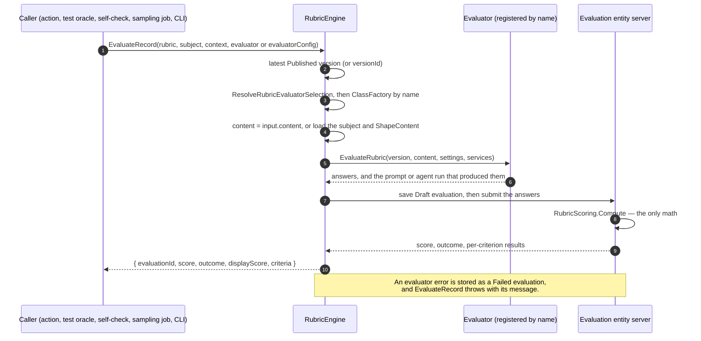

# @memberjunction/rubrics

Server evaluators for rubrics. An evaluator produces answers. `RubricScoring` in `@memberjunction/rubrics-base` is the only math.

> **Start with the [Rubrics Guide](../../../guides/RUBRICS_GUIDE.md)** — the model, the five common tasks, tests, agents, and adopting rubrics in an application. This README is the package reference.


## Engine



In server code, get an engine wired to a provider and a user:

```typescript
import { ProviderRubricEngine } from '@memberjunction/rubrics';

const result = await ProviderRubricEngine(provider, contextUser).EvaluateRecord({
    rubricName: 'Research answer',
    subjectEntityName: 'MJ: AI Agent Runs',
    subjectRecordId: runId,
});
```


`RubricEngine` has its own `Instance`. It does not extend `BaseSingleton`; an engine is built per provider and user, so use `ProviderRubricEngine`.

`Evaluate` takes a version the caller already loaded and an evaluator **name**. It creates that evaluator with `CreateRubricEvaluator`, which looks the name up under `BaseRubricEvaluator` in the class factory, and calls `EvaluateRubric` with a context: the version, the subject content, the settings, and the services. It then saves a Draft, submits it, and returns the computed result. A throw from the evaluator produces a Failed evaluation with `ErrorMessage`. An unregistered name, or an evaluator a person completes (Human), throws before anything is saved.

`EvaluateRecord` also accepts `evaluatorConfig`, an evaluator selection in the `AIAgentRubric.EvaluatorConfig` shape. `ResolveRubricEvaluatorSelection` turns it into a name and settings; `evaluator` and `settings` on the call override them.

The services are what the engine lends an evaluator. `ProviderRubricEngine` supplies all three, bound to the caller's provider and user:

| Service | Provider implementation | Used by |
|---|---|---|
| `Prompts.Run({ Prompt, Judge, Data, Subject, ModelID, ModelSelection, TimeoutMS })` | `ProviderPromptService` — `AIPromptRunner.ExecutePrompt` with the judge as a child prompt in the evaluator's `judgePrompt` slot and the subject as a user message | LLM |
| `Prompts.RenderCriteria({ Prompt, Items })` | `ProviderPromptService` — `AIPromptRunner.RenderChildPromptTemplates`, no model call | LLM, Decision |
| `Prompts.Preview({ Prompt, Judge, Data })` | `ProviderPromptService` — the composed system message `Run` would send, no model call | previews, checks |
| `Decisions.Decide(prompt, state, questions, modelId)` | `ProviderDecisionService` — `AIDecisionRunner` on the prompt's Decision-type models | Decision |
| `Agent.Run(...)` | the runner `@memberjunction/ai-agents` registers with `RegisterRubricAgentRunner` | Agent |

A call can replace any of them through `EvaluateParams.services`.

The draft stores the evaluator's `EvaluatorType` and `EvaluatorName`, the prompt or agent run that produced the evaluation in `AIPromptRunID` / `AIAgentRunID`, and `Metadata.Evaluator`: the name, the settings, and what the evaluator reported about its run.

`RubricEvaluator.Evaluate(version, candidates)` scores those candidates and returns `{ normalizedScore, rationale, evidence, result, answers }`. `BaseRubricEvaluator` extends it and adds the plugin contract: `EvaluatorName`, `EvaluatorType`, `IsAutomated`, and `EvaluateRubric(context)`.

## Evaluators

Each registers under `BaseRubricEvaluator` by the name in bold. `ListRubricEvaluators()` reports every registered one. `AI` is an alias for Agent and `AIPrompt` for LLM.

- **LLM** (stored as AIPrompt) — three metadata prompts composed into one call: **Rubric Evaluator** (the parent, which owns the JSON reply contract), a **judge** in its `judgePrompt` slot (`Rubric Evaluator - Default Judge` unless `PromptID` or `PromptName` names another, for example `Rubric Judge - Sage`), and **Rubric Criterion**, which renders each criterion. `SystemPromptID`/`Name` and `CriterionPromptID`/`Name` swap the other two. The subject is a separate, nonce-delimited user message and never passes through a template. `SinglePass` is one call for the whole rubric; `PerCriterion` is one call per leaf. `Samples` runs it up to 9 times and keeps each criterion's median level. `ModelID` pins the model; `ModelSelection: "Judge"` lets the judge's bindings choose it. A quote that is not in the subject text is dropped.
- **Decision** (stored as AIPrompt) — every leaf with a level scale becomes a typed Score question, and all of them go to a Decision-type model in one call, Default Decision (Jev, then LLM Decision) unless a prompt is named. Each question is the criterion as Rubric Criterion renders it, after the rubric's instructions. The most probable level is the answer and its probability is the confidence. It refuses a rubric with an evidence-required leaf before calling anything, and leaves numeric-scale leaves unanswered.
- **Agent** (stored as Agent) — one run of the Rubric Evaluation Agent, or the agent `AgentID` names. That agent is a Loop agent. Its tools are Get Rubric and Get Rubric Subject. Get Rubric Consensus is not one of its tools. It does not publish.
- **Deterministic** — a rule on the criterion's evaluator config. No model call.
- **Human** — not run by the engine. `HumanRubricEvaluator.Start` creates a Draft evaluation and a task titled `Score <rubric>`. It does not score. `StartHumanEvaluation` constructs that class. The person answers in the form, and submit runs `RubricScoring`.

A custom evaluator subclasses `BaseRubricEvaluator`, registers with `@RegisterClass(BaseRubricEvaluator, '<Name>')`, and scores with `this.Evaluate`. The class factory constructs it with no arguments. Its own settings go in `Settings.Extensions['<Name>']`. The [Rubrics Guide](../../../guides/RUBRICS_GUIDE.md#custom-evaluators) has a worked example.

### Prompts are metadata

The engine writes no prompt text. `promptData.ts` builds the template data (`Rubric`, `Mode`, `Criteria`, `Subject`, and per criterion `Key`, `Name`, `Levels` with anchors, `Hints`, `Scale`, `Text`, …), and the prompts in `/metadata/prompts` render it with MJ's template engine. `BuildCriteriaPromptData`, `PromptData`, `RenderCriteriaText`, and `BuildSubjectMessage` are exported for custom evaluators that want the same contract. Sixteen judge prompts ship, the default and one per core agent, and every core agent's rubric link names its own. The [Rubrics Guide](../../../guides/RUBRICS_GUIDE.md#how-the-llm-evaluator-builds-its-prompt) covers the composition, the data contract, writing a judge, and previewing a composed prompt.

Register a provider for your own entity with `RubricContentRegistry.Instance.Register(entityName, record => ({ text, data, files }))`; unregistered entities fall back to the record's readable columns. `ShapeContent` returns `RubricSubjectContent`: `text`, `data`, and `files`. A caller may pass `content` on `Evaluate` and skip the lookup. Test runs use input, expected output, actual output, and result details. Agent runs use the final payload and the in-memory message. There is no turns column and no transcript column.

## Actions

Each action calls `RubricEngine`. None of them call another action.

| Action | What it does |
|---|---|
| Evaluate Record Against Rubric | Scores one record with any registered evaluator the engine can run (LLM when omitted; Human is refused). A missing subject fails. It does not score `{}`. |
| Get Rubric | Returns the version tree. |
| Get Rubric Subject | Loads subject content. It does not score. |
| Get Rubric Consensus | Mean, median, or trimmed mean of Submitted non-Self scores on one major. |
| Create Rubric Draft | Writes a Draft. Caller-supplied ids are not primary keys. It never publishes. |
| Submit Human Rubric | One transaction for the Draft evaluation, its scores, and the move to Submitted. |

Publishing a version is the publish path, or the publication metadata for the eight shipped agent rubrics. Create Rubric Draft, the architect import, and `mj rubric evaluate` do not publish.

## CLI

`mj rubric` is a shim in `@memberjunction/cli`. The commands are implemented here, in `@memberjunction/rubrics`. The shim opens the provider and closes it.

```
mj rubric list
mj rubric show <rubric>[@version]
mj rubric diff <rubric> <version> <version>
mj rubric validate <file>
mj rubric evaluate --rubric <rubric> --entity <name> --record <id> [--evaluator <name>] [--prompt <name>] [--model <id>] [--mode SinglePass|PerCriterion]
```

`--evaluator` takes any registered evaluator name and defaults to LLM. `--prompt` names the judge for LLM (for example `"Rubric Judge - Sage"`) or the decision prompt for Decision; `--prompt`, `--model`, and `--mode` become the evaluator's settings. `evaluate` does not publish.

`mj test run --rubric <name-or-id>[@version]` and `mj test suite --rubric <name-or-id>[@version]` pin that rubric for the run. The version is `1.2.0` or a version id. Resolution order is the run flag, the rubric oracle's own config, `Test.RubricID`, the suite's `RubricID` walking up parents, then the agent's default Evaluation rubric.

`mj test promote-criteria <test>` copies the test's inline judge criteria onto a Draft rubric and sets `Test.RubricID`. The version is not published. A test that already has an `llm-judge` oracle keeps that judge when the rubric choice came from the agent.
