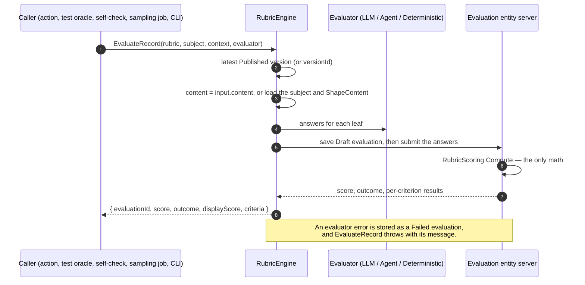

# @memberjunction/rubrics

Server evaluators for rubrics. An evaluator produces answers. `RubricScoring` in `@memberjunction/rubrics-base` is the only math.

> **Start with the [Rubrics Guide](../../../guides/RUBRICS_GUIDE.md)** — the model, the five common tasks, tests, agents, and adopting rubrics in an application. This README is the package reference.


## Engine



In server code, get an engine wired to a provider and a user:

```typescript
import { ProviderRubricEngine } from '@memberjunction/rubrics';

const result = await ProviderRubricEngine(provider, contextUser).EvaluateRecord({
    rubricName: 'Research answer',
    subjectEntityName: 'MJ: AI Agent Runs',
    subjectRecordId: runId,
});
```


`RubricEngine` has its own `Instance`. It does not extend `BaseSingleton`.

`Evaluate` does not resolve a version and does not look an evaluator up in ClassFactory. The caller passes the version. `runEvaluator` constructs the class:

- `evaluator === 'AI'` builds `AgentRubricEvaluator`.
- `evaluator === 'LLM'` builds `LLMRubricEvaluator`.
- Anything else builds `DeterministicRubricEvaluator`.

It saves a Draft, submits it, and returns the computed result. A throw produces a Failed evaluation with `ErrorMessage`.

`RubricEvaluator.Evaluate(version, candidates)` scores those candidates and returns `{ normalizedScore, rationale, evidence, result, answers }`. `BaseRubricEvaluator` extends it. Concrete classes register as Deterministic, LLM, Agent, and Human.

## Evaluators

- **LLM** — one prompt call for the whole rubric (`SinglePass`), or one decision per leaf (`PerCriterion`). A quote that is not in the subject text is dropped. `EvaluateSamples` runs the rubric more than once.
- **Agent** — one run of the Rubric Evaluation Agent. That agent is a Loop agent. Its tools are Get Rubric and Get Rubric Subject. Get Rubric Consensus is not one of its tools. It does not publish.
- **Deterministic** — a rule on the criterion's evaluator config.
- **Human** — `HumanRubricEvaluator.Start` creates a Draft evaluation and a task titled `Score <rubric>`. It does not score. `StartHumanEvaluation` constructs that class. The person answers in the form, and submit runs `RubricScoring`.

Register a provider for your own entity with `RubricContentRegistry.Instance.Register(entityName, record => ({ text, data, files }))`; unregistered entities fall back to the record's readable columns. `ShapeContent` returns `RubricSubjectContent`: `text`, `data`, and `files`. A caller may pass `content` on `Evaluate` and skip the lookup. Test runs use input, expected output, actual output, and result details. Agent runs use the final payload and the in-memory message. There is no turns column and no transcript column.

## Actions

Each action calls `RubricEngine`. None of them call another action.

| Action | What it does |
|---|---|
| Evaluate Record Against Rubric | Scores one record. A missing subject fails. It does not score `{}`. |
| Get Rubric | Returns the version tree. |
| Get Rubric Subject | Loads subject content. It does not score. |
| Get Rubric Consensus | Mean, median, or trimmed mean of Submitted non-Self scores on one major. |
| Create Rubric Draft | Writes a Draft. Caller-supplied ids are not primary keys. It never publishes. |
| Submit Human Rubric | One transaction for the Draft evaluation, its scores, and the move to Submitted. |

Publishing a version is the publish path, or the publication metadata for the seven shipped agent rubrics. Create Rubric Draft, the architect import, and `mj rubric evaluate` do not publish.

## CLI

`mj rubric` is a shim in `@memberjunction/cli`. The commands are implemented here, in `@memberjunction/rubrics`. The shim opens the provider and closes it.

```
mj rubric list
mj rubric show <rubric>[@version]
mj rubric diff <rubric> <version> <version>
mj rubric validate <file>
mj rubric evaluate --rubric <rubric> --entity <name> --record <id> [--evaluator LLM|Deterministic]
```

The default `--evaluator` is LLM, stored as AIPrompt. Deterministic is stored as Deterministic. `evaluate` does not publish.

`mj test run --rubric <name-or-id>[@version]` and `mj test suite --rubric <name-or-id>[@version]` pin that rubric for the run. The version is `1.2.0` or a version id. Resolution order is the run flag, the rubric oracle's own config, `Test.RubricID`, the suite's `RubricID` walking up parents, then the agent's default Evaluation rubric.

`mj test promote-criteria <test>` copies the test's inline judge criteria onto a Draft rubric and sets `Test.RubricID`. The version is not published. A test that already has an `llm-judge` oracle keeps that judge when the rubric choice came from the agent.
