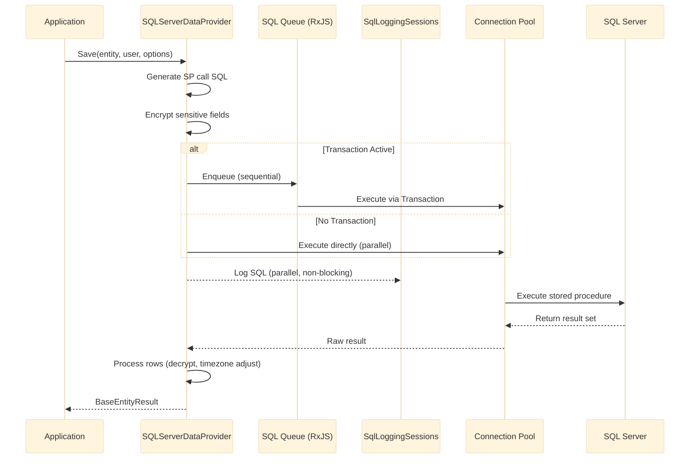
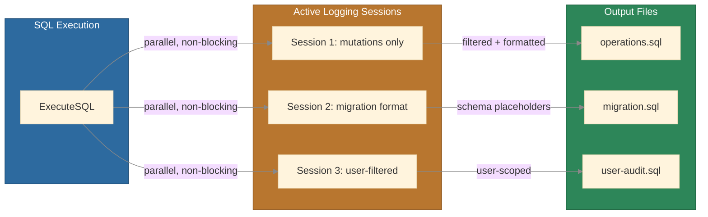
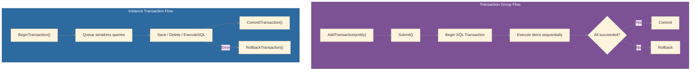
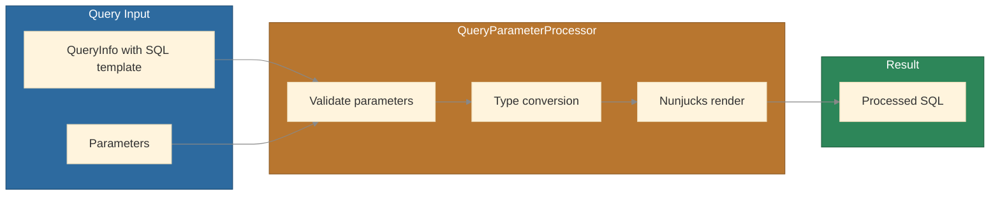

# MemberJunction SQL Server Data Provider

A comprehensive SQL Server data provider implementation for the MemberJunction framework, serving as the primary bridge between MemberJunction applications and Microsoft SQL Server databases. This package implements all core data provider interfaces -- entity CRUD, metadata management, view/query/report execution, and transaction handling. SQL logging is inherited from `@memberjunction/generic-database-provider`.

## Architecture Overview

```mermaid
%%{init: {'theme': 'base', 'themeVariables': { 'lineColor': '#888' }}}%%
graph TB
    subgraph Application["Application Layer"]
        MJS["MJServer / MJAPI"]
        MS["MetadataSync"]
        Custom["Custom Applications"]
    end

    subgraph Provider["SQLServerDataProvider"]
        style Provider fill:#2d6a9f,stroke:#1a4971,color:#fff
        SDP["SQLServerDataProvider"]
        TXG["SQLServerTransactionGroup"]
        UC["UserCache"]
        QPP["QueryParameterProcessor"]
        NFS["NodeFileSystemProvider"]
    end

    subgraph GenericDP["GenericDatabaseProvider (inherited)"]
        style GenericDP fill:#b8762f,stroke:#8a5722,color:#fff
        SL["SQL Logging Sessions"]
        EH["Entity/AI Action Hooks"]
        ENC["Field Encryption"]
    end

    subgraph Interfaces["MJ Core Interfaces"]
        style Interfaces fill:#7c5295,stroke:#563a6b,color:#fff
        IED["IEntityDataProvider"]
        IMP["IMetadataProvider"]
        IRV["IRunViewProvider"]
        IRR["IRunReportProvider"]
    end

    subgraph Database["SQL Server"]
        style Database fill:#2d8659,stroke:#1a5c3a,color:#fff
        Pool["Connection Pool"]
        SP["Stored Procedures"]
        Views["Database Views"]
        Tables["Entity Tables"]
    end

    MJS --> SDP
    MS --> SDP
    Custom --> SDP
    SDP --> IED
    SDP --> IMP
    SDP --> IRV
    SDP --> IRR
    SDP --> TXG
    SDP --> UC
    SDP --> QPP
    SDP --> NFS
    SDP --> SL
    SDP --> EH
    SDP --> ENC
    SDP --> Pool
    Pool --> SP
    Pool --> Views
    Pool --> Tables
```



## Key Features

- **Full CRUD Operations** -- Create, Read, Update, Delete for all MemberJunction entities via generated stored procedures
- **Transaction Support** -- Both transaction groups (multi-entity atomic operations) and instance-level transactions with nested savepoint support
- **View Execution** -- Run database views with filtering, sorting, pagination, and aggregation
- **Report and Query Execution** -- Execute reports and parameterized queries with Nunjucks template processing
- **Connection Pooling** -- Efficient shared connection pool management with configurable sizing
- **SQL Logging** -- Real-time SQL statement capture to files with session management, pattern filtering, and Flyway migration formatting (inherited from `GenericDatabaseProvider`)
- **User and Role Caching** -- Server-side singleton cache for user information and role assignments
- **Record Change Tracking** -- Integrated audit trail for entity modifications
- **Duplicate Detection** -- AI-powered duplicate record detection via vector similarity
- **Record Merging** -- Merge duplicate records with dependency resolution
- **Row-Level Security** -- Enforced data access controls at the database level
- **Metadata Refresh** -- Automatic and on-demand metadata refresh with configurable intervals
- **Field Encryption** -- Transparent encryption and decryption of sensitive entity fields
- **DateTime Offset Handling** -- Automatic detection and adjustment for SQL Server timezone behavior

## Installation

```bash
npm install @memberjunction/sqlserver-dataprovider
```

## Dependencies

| Package | Purpose |
|---------|---------|
| `@memberjunction/core` | Core MJ framework: base entities, metadata, providers |
| `@memberjunction/core-entities` | Generated entity subclasses and type definitions |
| `@memberjunction/generic-database-provider` | Shared base class: entity hooks, encryption, SQL logging, view execution |
| `@memberjunction/global` | Shared utilities, global object store, SQL validation |
| `@memberjunction/actions` | Server-side entity action execution |
| `@memberjunction/actions-base` | Action result types |
| `@memberjunction/ai` | AI integration capabilities |
| `@memberjunction/ai-provider-bundle` | AI provider bundle |
| `@memberjunction/ai-vector-dupe` | AI-powered duplicate detection |
| `@memberjunction/aiengine` | AI engine for entity AI actions |
| `@memberjunction/encryption` | Field-level encryption engine |
| `@memberjunction/queue` | Queue management for async operations |
| `mssql` | SQL Server client for Node.js |
| `rxjs` | Reactive extensions for transaction queue processing |

## Exported API

The package exports the following public symbols from its entry point:

| Export | Type | Description |
|--------|------|-------------|
| `SQLServerDataProvider` | Class | Main data provider implementing all MJ provider interfaces |
| `SQLServerProviderConfigData` | Class | Configuration data for provider initialization |
| `SQLServerTransactionGroup` | Class | Transaction group for atomic multi-entity operations |
| `UserCache` | Class | Singleton server-side user and role cache |
| `QueryParameterProcessor` | Class | Parameter validation and Nunjucks query template processor |
| `NodeFileSystemProvider` | Class | Node.js `fs`-based implementation of `IFileSystemProvider` |
| `SqlLoggingSessionImpl` | Class | Internal SQL logging session implementation |
| `SqlLoggingSession` | Interface | Public interface for a logging session |
| `SqlLoggingOptions` | Interface | Configuration options for SQL logging sessions |
| `ExecuteSQLOptions` | Interface | Options for SQL execution with logging support |
| `ExecuteSQLBatchOptions` | Interface | Options for batch SQL execution |
| `setupSQLServerClient` | Function | Helper to initialize provider, set global provider, start user cache |

## Data Flow



## Usage

### Initialization with setupSQLServerClient

The `setupSQLServerClient` helper handles full provider initialization: connecting to the pool, configuring the provider, loading the user cache, setting up the global MJ provider, and running the startup manager.

```typescript
import { setupSQLServerClient } from '@memberjunction/sqlserver-dataprovider';
import { SQLServerProviderConfigData } from '@memberjunction/sqlserver-dataprovider';
import sql from 'mssql';

// Create and connect a connection pool
const pool = new sql.ConnectionPool({
  server: 'your-server.database.windows.net',
  port: 1433,
  database: 'YourMJDatabase',
  user: 'your-username',
  password: 'your-password',
  options: {
    encrypt: true,
    trustServerCertificate: false,
  },
  pool: {
    max: 50,
    min: 5,
    idleTimeoutMillis: 30000,
  },
});
await pool.connect();

// Initialize the provider (sets global MJ provider, loads user cache, runs startup)
const config = new SQLServerProviderConfigData(
  pool,
  '__mj',           // MJ core schema name
  60,               // metadata refresh interval in seconds (0 to disable)
  undefined,        // includeSchemas (undefined = all)
  undefined,        // excludeSchemas
  true              // ignoreExistingMetadata (true for first instance)
);

const provider = await setupSQLServerClient(config);
```

### Working with Entities

```typescript
import { Metadata, CompositeKey } from '@memberjunction/core';
import { UserEntity } from '@memberjunction/core-entities';

const md = new Metadata();

// Load an entity by primary key
const user = await md.GetEntityObject<UserEntity>('Users', contextUser);
const key = new CompositeKey([{ FieldName: 'ID', Value: userId }]);
await user.Load(key);
console.log(`Loaded: ${user.Name}`);

// Create a new entity
const newUser = await md.GetEntityObject<UserEntity>('Users', contextUser);
newUser.Name = 'John Doe';
newUser.Email = 'john@example.com';
const saved = await newUser.Save();
if (saved) {
  console.log(`Created user with ID: ${newUser.ID}`);
}

// Delete an entity
await newUser.Delete();
```

### Transaction Groups

Transaction groups execute multiple entity operations within a single database transaction, with automatic rollback on failure.

```typescript
import { SQLServerTransactionGroup } from '@memberjunction/sqlserver-dataprovider';

const transaction = await provider.CreateTransactionGroup();

const order = await md.GetEntityObject('Orders', contextUser);
order.CustomerID = customerId;
order.Status = 'New';
order.TransactionGroup = transaction;

const item = await md.GetEntityObject('Order Items', contextUser);
item.ProductID = productId;
item.Quantity = 2;
item.TransactionGroup = transaction;

// Both saves are queued, then executed atomically on Submit
await order.Save();
await item.Save();
const results = await transaction.Submit();
```

### Instance-Level Transactions

For multi-user server environments, each provider instance supports isolated transaction state with nested savepoints.

```typescript
try {
  await provider.BeginTransaction();

  await provider.Save(entity1, contextUser, {});
  await provider.Save(entity2, contextUser, {});

  await provider.CommitTransaction();
} catch (error) {
  await provider.RollbackTransaction();
  throw error;
}
```

### Running Views

```typescript
import { RunView } from '@memberjunction/core';

const rv = new RunView();
const result = await rv.RunView({
  EntityName: 'Users',
  ExtraFilter: "Status = 'Active'",
  OrderBy: 'Name',
  MaxRows: 100,
  ResultType: 'entity_object',
}, contextUser);

if (result.Success) {
  console.log(`Found ${result.Results.length} active users`);
}
```

### Running Parameterized Queries

The `QueryParameterProcessor` validates parameters and processes Nunjucks templates for parameterized queries.

```typescript
import { RunQuery } from '@memberjunction/core';

const rq = new RunQuery();
const result = await rq.RunQuery({
  QueryName: 'ActiveUsersByDepartment',
  CategoryPath: '/Reports/Users/',
  Parameters: {
    department: 'Engineering',
    minHireDate: '2023-01-01',
  },
}, contextUser);

if (result.Success) {
  console.log('Query results:', result.Results);
}

// Ad-hoc SQL execution (SELECT/WITH only — validated via SQLExpressionValidator, read-only)
const adhocResult = await rq.RunQuery({
  SQL: 'SELECT TOP 50 Name, Status FROM __mj.vwUsers WHERE IsActive = 1',
}, contextUser);
```

### Executing Raw SQL

```typescript
// Instance method
const rows = await provider.ExecuteSQL(
  'SELECT * FROM Users WHERE Department = @dept',
  { dept: 'Engineering' }
);

// Static method (useful when you have a pool but not a provider)
const rows2 = await SQLServerDataProvider.ExecuteSQLWithPool(
  pool,
  'SELECT TOP 10 * FROM Users ORDER BY Name'
);
```

## SQL Logging

The provider includes a comprehensive SQL logging subsystem for capturing executed SQL statements to files. Logging sessions run in parallel with query execution and do not impact performance.

### Logging Architecture



### Creating a Logging Session

```typescript
const session = await provider.CreateSqlLogger('./logs/operations.sql', {
  sessionName: 'Debug session',
  statementTypes: 'both',         // 'queries', 'mutations', or 'both'
  prettyPrint: true,              // Format SQL with sql-formatter
  formatAsMigration: false,       // Replace schema names with Flyway placeholders
  logRecordChangeMetadata: false, // Log only core SP calls, not change tracking wrapper
  retainEmptyLogFiles: false,     // Delete file if no statements were logged
  filterByUserId: 'user@example.com', // Only capture this user's SQL
  filterPatterns: [/spCreateAIPromptRun/i],  // Exclude matching patterns
  filterType: 'exclude',          // 'exclude' or 'include'
});

try {
  // All SQL operations are automatically captured
  await provider.ExecuteSQL('INSERT INTO ...');
  console.log(`Captured ${session.statementCount} statements`);
} finally {
  await session.dispose(); // Stop logging, close file, clean up
}
```

### Migration-Ready Format

When `formatAsMigration: true`, the logger automatically:
- Replaces schema names with `${flyway:defaultSchema}` placeholders
- Escapes `${...}` patterns within SQL string literals to prevent Flyway interpretation
- Splits string literals exceeding SQL Server's 4000-character NVARCHAR limit into concatenated chunks with `CAST(... AS NVARCHAR(MAX))`

```typescript
const session = await provider.CreateSqlLogger(
  './migrations/V20250207120000__entity_updates.sql',
  {
    formatAsMigration: true,
    batchSeparator: 'GO',
    description: 'Entity schema updates',
  }
);
```

### Pattern Filtering

Filter which SQL statements are logged using simple wildcard patterns or full regular expressions.

**Simple wildcards** use `*` as a wildcard character:
- `*AIPrompt*` -- matches anything containing "AIPrompt"
- `spCreate*` -- matches anything starting with "spCreate"

**Regex patterns** provide full regular expression support:
- `/spCreate.*Run/i` -- case-insensitive regex
- `/^SELECT.*FROM.*vw/` -- queries from views

```typescript
// Exclude noisy patterns
const session = await provider.CreateSqlLogger('./logs/filtered.sql', {
  filterPatterns: [
    /spCreateAIPromptRun/i,
    /^SELECT.*FROM.*vw.*Metadata/i,
    '*EntityFieldValue*',
  ],
  filterType: 'exclude', // Default: skip matching statements
});

// Include only specific patterns
const auditSession = await provider.CreateSqlLogger('./logs/audit.sql', {
  filterPatterns: [/INSERT INTO Users/i, /UPDATE Users/i, /DELETE FROM Users/i],
  filterType: 'include', // Only log matching statements
});
```

### Session Management

```typescript
// List all active sessions
const active = provider.GetActiveSqlLoggingSessions();
console.log(`${active.length} sessions active`);

// Get a specific session
const session = provider.GetSqlLoggingSessionById(sessionId);

// Dispose all sessions (cleanup on shutdown)
await provider.DisposeAllSqlLoggingSessions();
```

## Transaction Processing



The provider supports two transaction mechanisms:

**Transaction Groups** (`SQLServerTransactionGroup`) -- bundle multiple entity save/delete operations and execute them within a single SQL Server transaction. If any operation fails, the entire group is rolled back. Transaction groups also support inter-entity variable references, allowing a newly created entity's ID to be passed to dependent entities in the same batch.

**Instance-Level Transactions** -- each `SQLServerDataProvider` instance maintains its own transaction state. When a transaction is active, all SQL queries from that instance are serialized through an RxJS queue (`concatMap`) and executed against the same `sql.Transaction` object. Non-transactional queries bypass the queue for maximum parallelism. Nested transactions use SQL Server savepoints.

## UserCache

The `UserCache` is a singleton that loads all users and their role assignments from the database and keeps them in memory. It is used for user lookups during authentication and authorization.

```typescript
import { UserCache } from '@memberjunction/sqlserver-dataprovider';

// Access the singleton
const cache = UserCache.Instance;

// Look up users
const user = cache.UserByName('john@example.com');
const systemUser = cache.GetSystemUser();
const allUsers = cache.Users;

// Refresh from database (with optional auto-refresh interval in ms)
await cache.Refresh(pool, 60000);
```

## QueryParameterProcessor

Handles parameter validation and Nunjucks template rendering for parameterized queries.



- Validates required parameters, applies defaults, and performs type conversion (string, number, date, boolean, array)
- Renders parameterized SQL using Nunjucks with custom SQL-safe filters registered through `RunQuerySQLFilterManager`
- Rejects unknown parameters to prevent injection

## Configuration Reference

### SQLServerProviderConfigData

| Parameter | Type | Default | Description |
|-----------|------|---------|-------------|
| `connectionPool` | `sql.ConnectionPool` | required | Connected mssql connection pool |
| `MJCoreSchemaName` | `string` | `'__mj'` | Database schema for MJ core tables |
| `checkRefreshIntervalSeconds` | `number` | `0` | Interval for automatic metadata refresh (0 = disabled) |
| `includeSchemas` | `string[]` | `undefined` | Restrict metadata loading to these schemas |
| `excludeSchemas` | `string[]` | `undefined` | Exclude these schemas from metadata loading |
| `ignoreExistingMetadata` | `boolean` | `true` | Force full metadata reload; set `false` for per-request instances to reuse cache |

### Connection Pool Settings

Configure via `mj.config.cjs` at the repository root:

```javascript
module.exports = {
  databaseSettings: {
    connectionPool: {
      max: 50,                     // Maximum connections
      min: 5,                      // Minimum connections
      idleTimeoutMillis: 30000,    // Idle timeout in ms
      acquireTimeoutMillis: 30000, // Acquire timeout in ms
    },
  },
};
```

**Recommended pool sizes:**

| Environment | max | min | Notes |
|-------------|-----|-----|-------|
| Development | 10 | 2 | Low concurrency |
| Production Standard | 50 | 5 | 2-4x CPU cores of API server |
| Production High Load | 100 | 10 | Monitor SQL Server RESOURCE_SEMAPHORE and THREADPOOL wait types |

### SqlLoggingOptions

| Option | Type | Default | Description |
|--------|------|---------|-------------|
| `formatAsMigration` | `boolean` | `false` | Replace schema names with Flyway `${flyway:defaultSchema}` placeholders |
| `defaultSchemaName` | `string` | MJ core schema | Schema name to replace with Flyway placeholder |
| `description` | `string` | `undefined` | Comment written at the start of the log file |
| `statementTypes` | `'queries' \| 'mutations' \| 'both'` | `'both'` | Which statement types to log |
| `batchSeparator` | `string` | `undefined` | Separator emitted after each statement (e.g., `'GO'`) |
| `prettyPrint` | `boolean` | `false` | Format SQL using sql-formatter with T-SQL dialect |
| `logRecordChangeMetadata` | `boolean` | `false` | Log full change-tracking wrapper SQL vs. core SP calls only |
| `retainEmptyLogFiles` | `boolean` | `false` | Keep log files that contain zero statements |
| `filterByUserId` | `string` | `undefined` | Only log SQL executed by this user |
| `sessionName` | `string` | `undefined` | Friendly name for UI display |
| `verboseOutput` | `boolean` | `false` | Output debug information to console |
| `filterPatterns` | `(string \| RegExp)[]` | `undefined` | Patterns for filtering SQL statements |
| `filterType` | `'include' \| 'exclude'` | `'exclude'` | How `filterPatterns` are applied |

## Build and Development

```bash
# Build the package
cd packages/SQLServerDataProvider && npm run build

# Run tests
cd packages/SQLServerDataProvider && npm test

# Run tests with coverage
cd packages/SQLServerDataProvider && npm run test:coverage

# Run tests in watch mode
cd packages/SQLServerDataProvider && npm run test:watch
```

## Key Implementation Details

### Connection Pool Best Practices

The provider follows SQL Server connection pool best practices:

1. **Single shared pool** -- one `sql.ConnectionPool` is created at server startup and reused for the application's lifetime
2. **Fresh request per query** -- each `ExecuteSQL` call creates a new `sql.Request` from the pool, enabling safe parallel execution
3. **No pool close in handlers** -- the pool remains open; the caller is responsible for closing it on shutdown
4. **Configurable pool sizing** -- pool `max`/`min` are tunable through `mj.config.cjs`

### DateTime Offset Adjustment

The provider automatically detects whether the SQL Server + mssql driver combination produces incorrect DATETIMEOFFSET values. On first query, it runs a diagnostic test and caches the result. If adjustment is needed, all DATETIMEOFFSET fields are corrected during row processing.

### Metadata Refresh

When `checkRefreshIntervalSeconds > 0`, the provider periodically checks whether database metadata has changed (new entities, field modifications, etc.) and reloads if needed. The `RefreshIfNeeded()` method can also be called on demand.

### Multi-Instance Pattern

In server environments like MJAPI, a new `SQLServerDataProvider` instance is created per request. Setting `ignoreExistingMetadata: false` on subsequent instances allows them to reuse the metadata loaded by the first instance, avoiding redundant database queries.

## Troubleshooting

| Symptom | Likely Cause | Solution |
|---------|-------------|----------|
| Connection timeout | Network or firewall issue | Increase `connectionTimeout`; verify SQL Server firewall rules |
| Authentication failure | Wrong credentials or permissions | Verify credentials; check encryption settings match server |
| Schema not found | Wrong `MJCoreSchemaName` | Verify schema exists (default is `__mj`); check user schema access |
| Transaction rollback | Constraint violation in entity save | Check required fields, foreign key references, unique constraints |
| Pool exhausted | Too many concurrent connections | Increase `pool.max`; check for leaked connections or long-running queries |
| EREQINPROG error | Request reuse during transaction | This is handled automatically; the provider clears stale transaction references |

## IS-A Type Relationship Transaction Support

MemberJunction supports IS-A type relationships where child entities inherit from parent entities (e.g., `MeetingEntity IS-A ProductEntity`). The SQLServerDataProvider manages SQL transactions to ensure atomic save and delete operations across the entire entity hierarchy.

### How IS-A Transactions Work

When you save or delete an entity that participates in an IS-A hierarchy, SQLServerDataProvider automatically:

1. **Creates a SQL Transaction**: The initiating (leaf) entity calls `BeginISATransaction()` to create a new `sql.Transaction` on the connection pool
2. **Propagates the Transaction**: The transaction is stored in `BaseEntity.ProviderTransaction` and shared across all entities in the parent chain
3. **Executes Operations in Order**:
   - For **saves**: Parent entities are saved first, then the child entity uses the parent's ID
   - For **deletes**: The child entity is deleted first, then parents are deleted in reverse order
4. **Commits or Rolls Back**: `CommitISATransaction()` commits all changes, or `RollbackISATransaction()` reverts everything on failure

### Transaction Lifecycle

```typescript
// Example: Saving a MeetingEntity (which IS-A ProductEntity)
const meeting = await md.GetEntityObject<MeetingEntity>('Meetings');
meeting.Name = 'Project Planning';
meeting.MeetingDate = new Date();
// ... set other fields

// When you call Save(), the provider automatically:
// 1. Begins a SQL transaction
// 2. Saves the Product parent entity first
// 3. Uses the Product ID to save the Meeting child entity
// 4. Commits the transaction
const result = await meeting.Save();

// If any step fails, the entire transaction is rolled back
```

### Key Methods

- `BeginISATransaction()`: Creates a new `sql.Transaction` on the connection pool and stores it in `BaseEntity.ProviderTransaction`
- `CommitISATransaction()`: Commits the shared transaction across the entire IS-A chain
- `RollbackISATransaction()`: Rolls back all changes if any operation in the chain fails

### Benefits

- **Atomicity**: All saves/deletes in the hierarchy succeed or fail together
- **Consistency**: No orphaned child records or missing parent data
- **Transparent**: The transaction management is automatic - no manual transaction handling required
- **Shared State**: All entities in the chain use the same `sql.Transaction` instance via `BaseEntity.ProviderTransaction`

For more details on IS-A relationships and how they work across MemberJunction, see [MJCore IS-A Relationships Documentation](../../MJCore/docs/isa-relationships.md).

## Virtual Entity Support

MemberJunction supports virtual entities that are backed by SQL views instead of physical tables. Virtual entities provide read-only access to data and are commonly used for reporting, aggregations, and denormalized views.

### Read Operations

Virtual entities work seamlessly with the SQLServerDataProvider for all read operations:

- **RunView**: Execute queries against the virtual entity's underlying SQL view
- **Get**: Load individual records by primary key (if the view supports it)
- **Filtering, Sorting, Pagination**: All standard query operations work as expected

```typescript
// Example: Querying a virtual entity backed by a view
const rv = new RunView();
const result = await rv.RunView<UserSummaryEntity>({
    EntityName: 'User Summary',  // Virtual entity backed by vwUserSummary
    ExtraFilter: "Department = 'Engineering'",
    OrderBy: 'LastLoginDate DESC',
    ResultType: 'entity_object'
});

// result.Results contains fully-typed UserSummaryEntity objects
const users = result.Results;
```

### Write Operations

Write operations (Save, Delete) are **automatically blocked** for virtual entities at the BaseEntity level before they reach the data provider:

- **BaseEntity.Save()**: Returns an error if called on a virtual entity
- **BaseEntity.Delete()**: Returns an error if called on a virtual entity
- **Why**: Virtual entities represent read-only views and cannot be modified directly

### Use Cases for Virtual Entities

- **Aggregated Data**: Summary views that combine data from multiple tables
- **Denormalized Views**: Flattened representations of complex relationships
- **Calculated Fields**: Views that include computed columns or transformations
- **Security Views**: Row-level filtering applied at the database view level
- **Reporting**: Pre-joined data optimized for reporting queries

For comprehensive documentation on virtual entities, their configuration, and advanced usage patterns, see [MJCore Virtual Entities Documentation](../../MJCore/docs/virtual-entities.md).

## License

ISC
