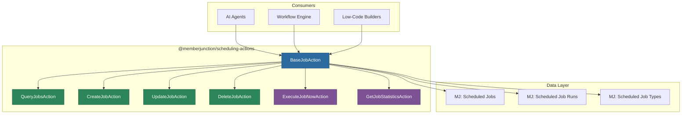
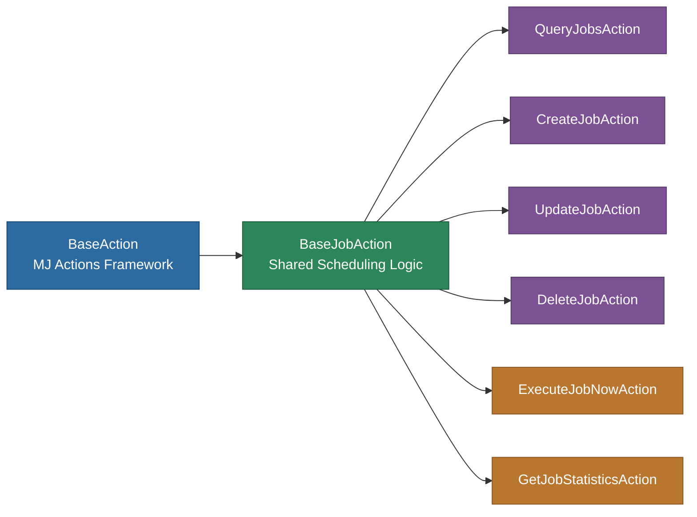

# @memberjunction/scheduling-actions

MemberJunction Actions for managing scheduled jobs. These actions enable AI agents and workflow systems to query, create, update, delete, and execute scheduled jobs through MemberJunction's metadata-driven action framework.

## Architecture



## Overview

This package provides MemberJunction Actions for scheduled job management. Actions are metadata-driven integration points designed for AI agents, workflow engines, and low-code environments -- they are NOT intended for direct code-to-code use.

**Available actions:**

| Action | Description |
|--------|-------------|
| `QueryJobsAction` | List and filter scheduled jobs with optional status filtering |
| `CreateJobAction` | Create a new scheduled job with cron expression and configuration |
| `UpdateJobAction` | Modify an existing scheduled job's schedule, status, or configuration |
| `DeleteJobAction` | Remove a scheduled job |
| `ExecuteJobNowAction` | Trigger immediate execution of a scheduled job |
| `GetJobStatisticsAction` | Retrieve execution statistics, success rates, and history |

## Installation

```bash
npm install @memberjunction/scheduling-actions
```

## Usage

These actions are registered with MemberJunction's class factory and are discovered automatically by AI agents and workflow systems. They are not typically called directly from code.

### Action Registration

All actions extend `BaseJobAction`, which provides shared utilities for:
- Parameter extraction and validation
- Cron expression validation via `cron-parser`
- Common error handling patterns
- Result formatting

### Example: Agent Using Schedule Actions

An AI agent can discover and use these actions to manage scheduled jobs:

```
User: "Schedule my daily report agent to run every morning at 8 AM"

Agent discovers: CreateJobAction
Agent executes with:
  - JobType: "Agent"
  - CronExpression: "0 8 * * *"
  - AgentID: "report-agent-guid"
  - Name: "Daily Report Agent"
```

## Base Class

`BaseJobAction` provides shared functionality inherited by all scheduling actions:



## Dependencies

| Package | Purpose |
|---------|---------|
| `@memberjunction/actions` | MJ Actions framework |
| `@memberjunction/actions-base` | Base action classes |
| `@memberjunction/core` | Metadata, RunView |
| `@memberjunction/core-entities` | Entity types |
| `@memberjunction/global` | RegisterClass, class factory |
| `@memberjunction/scheduling-base-types` | Shared type definitions |
| `cron-parser` | Cron expression validation |

## License

ISC
