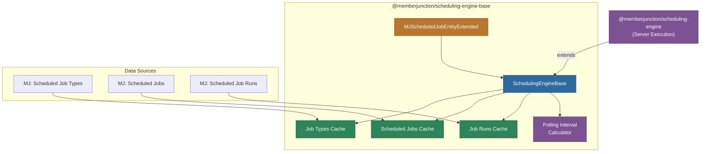
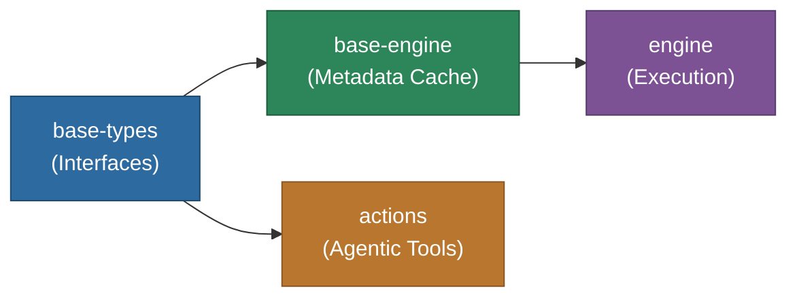

# @memberjunction/scheduling-engine-base

Base scheduling engine providing metadata caching for MemberJunction's scheduled jobs system. Loads and caches job types, scheduled jobs, and recent runs. Can be used on both client and server.

## Architecture



## Overview

This package provides two main components:

### SchedulingEngineBase

A singleton engine that extends `BaseEngine` to load and cache scheduling metadata:

- **Job Types**: Plugin registry mapping job type names to driver classes
- **Scheduled Jobs**: Active (or all) scheduled jobs with their configurations
- **Job Runs**: Recent execution history (last 7 days, optional)
- **Polling Interval**: Adaptive polling interval calculation based on next run times
- **Lookup Methods**: Find job types by name or driver class, get jobs by type, get runs for a job

### MJScheduledJobEntityExtended

An extended entity class registered via `@RegisterClass` that adds helper properties and methods to `ScheduledJobEntity`:

- **Lock Management**: `IsLocked`, `IsLockStale`, `CurrentLockHolder` properties
- **Concurrency**: `AllowsConcurrent`, `QueuesOverlappingRuns`, `SkipsOverlappingRuns`
- **Statistics**: `SuccessRate`, `FailureRate` percentage calculations
- **Timing**: `GetTimeUntilNextRun()` millisecond calculation
- **Auto-Notifications**: Overrides `Save()` and `Delete()` to auto-refresh engine metadata and recalculate polling intervals

## Installation

```bash
npm install @memberjunction/scheduling-engine-base
```

## Usage

### Loading Metadata

```typescript
import { SchedulingEngineBase } from '@memberjunction/scheduling-engine-base';

const engine = SchedulingEngineBase.Instance;

// Load active jobs only (default)
await engine.Config(false, contextUser);

// Load all jobs with recent runs
await engine.Config(false, contextUser, undefined, true, true);
```

### Accessing Cached Data

```typescript
// Job types (plugin registry)
const jobTypes = engine.ScheduledJobTypes;
const agentType = engine.GetJobTypeByName('Agent');
const byDriver = engine.GetJobTypeByDriverClass('ScheduledJobAgent');

// Scheduled jobs
const activeJobs = engine.ScheduledJobs;
const agentJobs = engine.GetJobsByType(agentType.ID);

// Job runs
const runs = engine.GetRunsForJob(jobId);

// Adaptive polling
engine.UpdatePollingInterval();
const interval = engine.ActivePollingInterval; // ms, or null if no jobs
```

### Using Extended Entity

```typescript
import { MJScheduledJobEntityExtended } from '@memberjunction/scheduling-engine-base';

const job = activeJobs[0] as MJScheduledJobEntityExtended;

console.log(job.IsLocked);          // Is currently being executed?
console.log(job.IsLockStale);       // Has the lock expired?
console.log(job.SuccessRate);       // e.g., 95.5
console.log(job.AllowsConcurrent);  // Can run in parallel?
console.log(job.GetTimeUntilNextRun()); // ms until next execution
```

## API Reference

### SchedulingEngineBase

| Member | Type | Description |
|--------|------|-------------|
| `Instance` | static getter | Singleton instance |
| `Config()` | method | Load scheduling metadata with options |
| `ScheduledJobTypes` | getter | All job type definitions |
| `ScheduledJobs` | getter | Active (or all) scheduled jobs |
| `ScheduledJobRuns` | getter | Recent job runs (if loaded) |
| `GetJobTypeByName()` | method | Find job type by name |
| `GetJobTypeByDriverClass()` | method | Find job type by driver class |
| `GetJobsByType()` | method | Get all jobs of a specific type |
| `GetRunsForJob()` | method | Get runs for a specific job |
| `ActivePollingInterval` | getter | Current polling interval (ms) or null |
| `UpdatePollingInterval()` | method | Recalculate optimal polling interval |

## Relationship to Other Scheduling Packages



## Dependencies

| Package | Purpose |
|---------|---------|
| `@memberjunction/core` | BaseEngine, UserInfo, IMetadataProvider |
| `@memberjunction/core-entities` | ScheduledJobEntity, ScheduledJobTypeEntity, ScheduledJobRunEntity |
| `@memberjunction/global` | RegisterClass decorator |
| `@memberjunction/scheduling-base-types` | Shared type definitions |

## License

ISC
