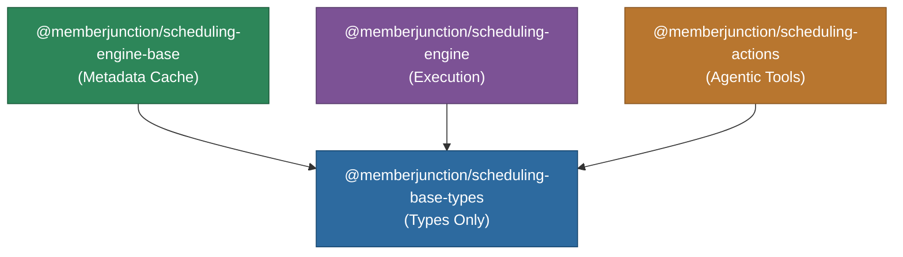

# @memberjunction/scheduling-base-types

Core type definitions for MemberJunction's scheduled jobs system. This lightweight package provides interfaces and type aliases used throughout the scheduling stack, with no heavy dependencies.

## Architecture



## Overview

This package defines the shared type contracts used across the entire scheduling subsystem. It is designed to be imported anywhere (client or server) without pulling in execution logic or heavy framework dependencies.

**Exported types:**

- **ScheduledJobResult**: Result returned by a scheduled job execution, including success/failure, error messages, and job-type-specific details
- **ScheduledJobConfiguration**: Base interface for job-specific configuration JSON
- **AgentJobConfiguration**: Configuration for AI Agent scheduled jobs (AgentID, ConversationID, etc.)
- **ActionJobConfiguration**: Configuration for Action scheduled jobs (ActionID, Params, etc.)
- **NotificationContent**: Structure for job notification messages (Subject, Body, Priority)
- **ScheduledJobRunStatus**: Union type for run statuses (`Running`, `Completed`, `Failed`, `Cancelled`, `Timeout`)
- **ScheduledJobStatus**: Union type for schedule statuses (`Pending`, `Active`, `Paused`, `Disabled`, `Expired`)
- **NotificationChannel**: Union type for notification delivery (`Email`, `InApp`)

## Installation

```bash
npm install @memberjunction/scheduling-base-types
```

## Usage

```typescript
import {
    ScheduledJobResult,
    AgentJobConfiguration,
    ActionJobConfiguration,
    ScheduledJobRunStatus,
    NotificationContent
} from '@memberjunction/scheduling-base-types';

// Job result from execution
const result: ScheduledJobResult = {
    Success: true,
    Details: {
        AgentRunID: 'run-guid',
        TokensUsed: 1500,
        Cost: 0.023
    }
};

// Agent job configuration
const agentConfig: AgentJobConfiguration = {
    AgentID: 'agent-guid',
    InitialMessage: 'Generate daily report',
    ConfigurationID: 'config-guid'
};

// Action job configuration
const actionConfig: ActionJobConfiguration = {
    ActionID: 'action-guid',
    Params: [
        { ActionParamID: 'param-1', ValueType: 'Static', Value: '42' },
        { ActionParamID: 'param-2', ValueType: 'SQL Statement', Value: 'SELECT TOP 1 ID FROM Users' }
    ]
};
```

## Type Reference

### ScheduledJobResult

| Property | Type | Description |
|----------|------|-------------|
| `Success` | boolean | Whether the job completed successfully |
| `ErrorMessage` | string (optional) | Error message if the job failed |
| `Details` | Record (optional) | Job-type-specific execution details |

### Status Types

| Type | Values |
|------|--------|
| `ScheduledJobRunStatus` | `Running`, `Completed`, `Failed`, `Cancelled`, `Timeout` |
| `ScheduledJobStatus` | `Pending`, `Active`, `Paused`, `Disabled`, `Expired` |
| `NotificationChannel` | `Email`, `InApp` |

## Dependencies

| Package | Purpose |
|---------|---------|
| `@memberjunction/global` | MJGlobal shared utilities |

## License

ISC
