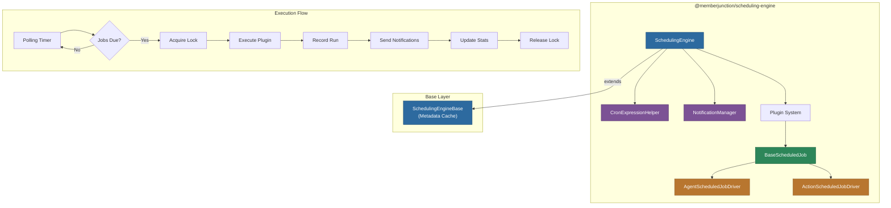

# @memberjunction/scheduling-engine

Server-side execution engine for MemberJunction scheduled jobs. Extends `SchedulingEngineBase` with cron evaluation, plugin-based job execution, distributed locking, notification management, and polling lifecycle control.

## Architecture



## Overview

**Server-side only.** This engine handles the complete lifecycle of scheduled job execution:

- **Cron Evaluation**: Parses cron expressions to determine which jobs are due for execution
- **Plugin Architecture**: Each job type has a registered `BaseScheduledJob` driver class
- **Distributed Locking**: Token-based locking for multi-server environments with stale lock detection
- **Concurrency Modes**: `Concurrent`, `Queue`, or `Skip` for overlapping executions
- **Polling Lifecycle**: Adaptive polling interval with `StartPolling()` / `StopPolling()`
- **Notifications**: Configurable notifications on success, failure, or both
- **Statistics Tracking**: Automatic update of RunCount, SuccessCount, FailureCount, and timing metrics
- **Built-in Drivers**: `AgentScheduledJobDriver` for AI agents, `ActionScheduledJobDriver` for MJ Actions

## Installation

```bash
npm install @memberjunction/scheduling-engine
```

## Usage

### Starting the Scheduler

```typescript
import { SchedulingEngine } from '@memberjunction/scheduling-engine';

const engine = SchedulingEngine.Instance;
await engine.Config(false, contextUser);

// Start continuous polling
await engine.StartPolling(contextUser);

// Stop polling (e.g., on server shutdown)
engine.StopPolling();
```

### Manual Job Execution

```typescript
// Execute all due jobs
const runs = await engine.ExecuteScheduledJobs(contextUser);
console.log(`Executed ${runs.length} scheduled jobs`);

// Execute a specific job immediately
const run = await engine.ExecuteJob(jobId, contextUser);
```

### Creating Custom Job Drivers

```typescript
import { BaseScheduledJob, ScheduledJobExecutionContext } from '@memberjunction/scheduling-engine';
import { ScheduledJobResult } from '@memberjunction/scheduling-base-types';
import { RegisterClass } from '@memberjunction/global';

@RegisterClass(BaseScheduledJob, 'ScheduledJobCustom')
export class CustomScheduledJobDriver extends BaseScheduledJob {
    async Execute(context: ScheduledJobExecutionContext): Promise<ScheduledJobResult> {
        const config = this.parseConfiguration(context.Schedule);

        // Custom job logic here
        await this.doWork(config);

        return {
            Success: true,
            Details: { processedItems: 42 }
        };
    }
}
```

## Components

### SchedulingEngine

The main singleton engine that extends `SchedulingEngineBase` with execution capabilities.

### BaseScheduledJob

Abstract base class for all job drivers. Provides:
- `Execute()` -- abstract method for job-specific logic
- `parseConfiguration()` -- type-safe configuration parsing from JSON
- `FormatNotification()` -- customizable notification content generation
- `ValidateConfiguration()` -- configuration validation before execution

### Built-in Drivers

| Driver | Job Type | Description |
|--------|----------|-------------|
| `AgentScheduledJobDriver` | Agent | Executes AI agents with configurable conversations and payloads |
| `ActionScheduledJobDriver` | Action | Executes MJ Actions with static or SQL-based parameter values |

### CronExpressionHelper

Utility for parsing and evaluating cron expressions using `cron-parser`.

### NotificationManager

Manages notification delivery based on job configuration (on success, failure, or both).

## Dependencies

| Package | Purpose |
|---------|---------|
| `@memberjunction/scheduling-engine-base` | Base engine with metadata caching |
| `@memberjunction/scheduling-base-types` | Shared type definitions |
| `@memberjunction/core` | Metadata, RunView, logging |
| `@memberjunction/core-entities` | Entity types |
| `@memberjunction/global` | Class factory, RegisterClass |
| `@memberjunction/ai-agents` | AI agent execution |
| `@memberjunction/actions` | MJ Action execution |
| `cron-parser` | Cron expression evaluation |

## License

ISC
