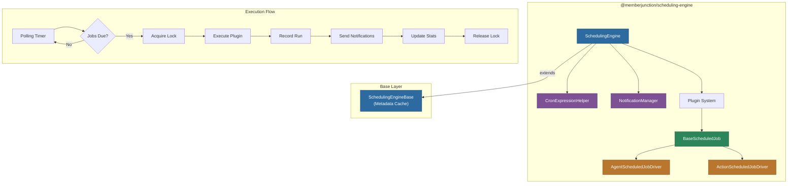

# @memberjunction/scheduling-engine

Server-side execution engine for MemberJunction scheduled jobs. Extends `SchedulingEngineBase` with cron evaluation, plugin-based job execution, distributed locking, notification management, and polling lifecycle control.

## Architecture


```mermaid
graph TD
    subgraph "@memberjunction/scheduling-engine"
        A[SchedulingEngine] --> B[CronExpressionHelper]
        A --> C[NotificationManager]
        A --> D[Plugin System]
        D --> E[BaseScheduledJob]
        E --> F[AgentScheduledJobDriver]
        E --> G[ActionScheduledJobDriver]
    end

    subgraph "Execution Flow"
        H[Polling Timer] --> I{Jobs Due?}
        I -->|Yes| J[Acquire Lock]
        J --> K[Execute Plugin]
        K --> L[Record Run]
        L --> M[Send Notifications]
        M --> N[Update Stats]
        N --> O[Release Lock]
        I -->|No| H
    end

    subgraph "Base Layer"
        P["SchedulingEngineBase<br/>(Metadata Cache)"]
    end

    A -->|extends| P

    style A fill:#2d6a9f,stroke:#1a4971,color:#fff
    style B fill:#7c5295,stroke:#563a6b,color:#fff
    style C fill:#7c5295,stroke:#563a6b,color:#fff
    style E fill:#2d8659,stroke:#1a5c3a,color:#fff
    style F fill:#b8762f,stroke:#8a5722,color:#fff
    style G fill:#b8762f,stroke:#8a5722,color:#fff
    style P fill:#2d6a9f,stroke:#1a4971,color:#fff
```

## Overview

**Server-side only.** This engine handles the complete lifecycle of scheduled job execution:

- **Cron Evaluation**: Parses cron expressions to determine which jobs are due for execution
- **Plugin Architecture**: Each job type has a registered `BaseScheduledJob` driver class
- **Distributed Locking**: Token-based locking for multi-server environments with stale lock detection. Atomic compare-and-swap via dedicated stored procedures (`spAcquireScheduledJobLock`, `spReleaseScheduledJobLockIfTokenMatches`).
- **Concurrency Modes**: `Concurrent`, `Queue`, or `Skip` for overlapping executions
- **Bounded Concurrency**: `MaxConcurrentJobs` (default 5) caps simultaneous in-flight jobs across the engine; configurable via `scheduledJobs.maxConcurrentJobs`
- **Polling Lifecycle**: Adaptive polling interval with `StartPolling()` / `StopPolling()`. As of v5.39 the poll loop dispatches jobs without awaiting completion — a single hung job no longer stalls the scheduler. See [Operational notes](#operational-notes-v539) below.
- **Notifications**: Configurable notifications on success, failure, or both
- **Statistics Tracking**: Automatic update of RunCount, SuccessCount, FailureCount, and timing metrics
- **Built-in Drivers**: `AgentScheduledJobDriver` for AI agents, `ActionScheduledJobDriver` for MJ Actions

## Installation

```bash
npm install @memberjunction/scheduling-engine
```

## Usage

### Starting the Scheduler

```typescript
import { SchedulingEngine } from '@memberjunction/scheduling-engine';

const engine = SchedulingEngine.Instance;
await engine.Config(false, contextUser);

// Start continuous polling (async since v5.39 — must be awaited)
await engine.StartPolling(contextUser);

// Stop polling on server shutdown. Graceful drain waits for currently-dispatched
// jobs to settle, bounded by maxWaitMs so a hung job can't hang shutdown.
await engine.StopPolling({ waitForInflight: true, maxWaitMs: 30_000 });
```

### Manual Job Execution

```typescript
// Execute all due jobs
const runs = await engine.ExecuteScheduledJobs(contextUser);
console.log(`Executed ${runs.length} scheduled jobs`);

// Execute a specific job immediately
const run = await engine.ExecuteJob(jobId, contextUser);
```

### Creating Custom Job Drivers

```typescript
import { BaseScheduledJob, ScheduledJobExecutionContext } from '@memberjunction/scheduling-engine';
import { ScheduledJobResult } from '@memberjunction/scheduling-base-types';
import { RegisterClass } from '@memberjunction/global';

@RegisterClass(BaseScheduledJob, 'ScheduledJobCustom')
export class CustomScheduledJobDriver extends BaseScheduledJob {
    async Execute(context: ScheduledJobExecutionContext): Promise<ScheduledJobResult> {
        const config = this.parseConfiguration(context.Schedule);

        // Custom job logic here
        await this.doWork(config);

        return {
            Success: true,
            Details: { processedItems: 42 }
        };
    }
}
```

## Components

### SchedulingEngine

The main singleton engine that extends `SchedulingEngineBase` with execution capabilities.

### BaseScheduledJob

Abstract base class for all job drivers. Provides:
- `Execute()` -- abstract method for job-specific logic
- `parseConfiguration()` -- type-safe configuration parsing from JSON
- `FormatNotification()` -- customizable notification content generation
- `ValidateConfiguration()` -- configuration validation before execution

### Built-in Drivers

| Driver | Job Type | Description |
|--------|----------|-------------|
| `AgentScheduledJobDriver` | Agent | Executes AI agents with configurable conversations and payloads |
| `ActionScheduledJobDriver` | Action | Executes MJ Actions with static or SQL-based parameter values |

### CronExpressionHelper

Utility for parsing and evaluating cron expressions using `cron-parser`.

### `RunImmediatelyIfNeverRun` Flag

Each `MJ: Scheduled Jobs` row now has a `RunImmediatelyIfNeverRun` boolean (v5.38). When `true` AND `LastRunAt IS NULL`, `SchedulingEngine.initializeNextRunTimes()` sets `NextRunAt = now()` instead of the next cron tick, so a freshly-seeded job runs on the next polling cycle rather than waiting up to a full cron interval (e.g., 24h for a daily job) for its first run.

Use this for seed metadata that should run as soon as it's installed (data backfills, initial syncs like Entity Vector Sync, etc.). The flag is a no-op once the job has run at least once — subsequent restarts follow the cron schedule normally.

### NotificationManager

Manages notification delivery based on job configuration (on success, failure, or both).

## Operational notes (v5.39+)

The v5.39 release decoupled the poll loop from job execution to fix a bug where a single hung `plugin.Execute()` would stall the entire scheduler until process restart (GH #2736). The design doc for the full rationale is at [`plans/scheduled-job-engine-decoupling.md`](../../../plans/scheduled-job-engine-decoupling.md). The summary below covers what operators and integrators need to know.

### Polling architecture

The poll loop calls `DispatchScheduledJobs(contextUser)`, which:

1. **Sweeps** stale in-flight entries (jobs whose DB lease has expired) — untracks them so their concurrency slot is freed, and fire-and-forget abandons their orphaned `Status='Running'` run records. The sweep is decoupled from `isJobDue` and from the cap; it runs unconditionally at the top of every poll.
2. **Dispatches** each due job under a cap (`MaxConcurrentJobs`, default 5), atomically acquiring its lock via `spAcquireScheduledJobLock`. Dispatched jobs run in the background; the poll loop returns immediately so the next poll fires on schedule.

Jobs that legitimately fail (throw) still recover via the existing try/catch in `executeJobWithLock`. The lock release uses `spReleaseScheduledJobLockIfTokenMatches` — atomic and token-checked, so a stale holder's late settlement after lease expiry can't clobber a fresh holder's lock.

### Cap and lease semantics

**`MaxConcurrentJobs` is a SOFT cap.** Under concurrent poll bodies overlapping, the cap may be transiently exceeded by a small amount bounded by the overlap count (typically 1–2). This is acceptable because:

- The cap exists to bound order-of-magnitude fan-out, not to enforce an exact integer count.
- The atomic lock sproc guarantees no same-job double-dispatch even under overshoot.
- Steady-state behavior holds at the configured cap.

If you need a hard ceiling, set `MaxConcurrentJobs` slightly below your true limit.

**Tuning guidance:**

- **Raise the cap** when scheduled work backs up despite plenty of headroom — many short, lightweight jobs.
- **Lower the cap** on memory / DB connection / rate-limit pressure, or when each job spawns heavy work (agent runs, LLM calls).
- **Shorten the lease** (`LeaseTimeoutMs` / `LeaseTimeoutMinutes`) to reduce the worst-case starvation window (see below), but never below the maximum runtime of any legitimate job — premature reclaim would re-dispatch healthy long jobs.

Configure via MJServer's `scheduledJobs` config block:

```javascript
// mj.config.cjs
module.exports = {
    scheduledJobs: {
        enabled: true,
        systemUserEmail: 'system@example.com',
        maxConcurrentJobs: 10,           // default 5
        defaultLockTimeout: 5 * 60_000,  // default 600000 (10 min)
    },
    // ...
};
```

`MJServer/services/ScheduledJobsService` reads these on startup and applies them to the engine via `MaxConcurrentJobs` and `LeaseTimeoutMs` setters.

### Residual starvation window

This fix eliminates the unbounded scheduler stall but does NOT eliminate all starvation scenarios. If **`≥ MaxConcurrentJobs` jobs hang simultaneously** within a single lease window, other scheduled work is starved until at least one lease expires and the sweep reclaims its slot.

With defaults (`MaxConcurrentJobs=5`, lease=10 min), the worst-case starvation is **~10 minutes** — dramatically improved from the original "stalled until process restart," but not zero. Mitigations:

- Raise `MaxConcurrentJobs` so healthy jobs have headroom while zombies hold slots.
- Shorten `LeaseTimeoutMs` to accelerate reclaim (subject to the constraint above).
- Bound `plugin.Execute()` in your job plugins — the structural cure, tracked as a follow-up.

### Leaked promise behavior

When the sweep reclaims a hung job's lease:

1. The hung `executeJobWithLock` Promise stays in memory. JavaScript doesn't support Promise cancellation; the executing async function still holds the promise alive via its suspended `await`.
2. Each leaked promise holds: the plugin instance, execution context, run entity, and any closures the plugin captured (typically single-digit MB).
3. Bounded by the count of distinct hanging jobs. Process restart on deploy clears them.
4. **Operational signal**: each sweep emits a `[sweep] Untracking inflight job <name>` log line. A spike in these is a canary for a misbehaving plugin — wire to monitoring if hangs are a concern.
5. **Orphaned run records are NOT leaked.** The sweep marks them `Status='Failed'` with an explanatory message via `abandonOrphanedRunRecords`. The DB litter pattern (phantom `Running` rows accumulating over months) is prevented going forward.

`Promise.race([plugin.Execute(), timeout])` does NOT solve the leak — `Promise.race` returns when the timeout wins, but the underlying `plugin.Execute()` promise is still alive. Same heap leak, different surface. Worker-thread isolation would let us terminate a hung plugin's execution context, but that's a multi-week design effort tracked separately.

### Job-list refresh

The engine loads the job list ONCE at `StartPolling` time. Runtime changes to the `MJ: Scheduled Jobs` table (adds, deletions, cron edits) are NOT picked up automatically by the engine. Callers must explicitly invoke `await engine.OnJobChanged(contextUser)` after making such changes. This is pre-existing behavior — not changed by v5.39 — but worth calling out because the per-poll `Config(false)` no-op was moved out of the poll path, making the explicit `OnJobChanged` trigger the only refresh mechanism.

### Graceful shutdown

`StopPolling({ waitForInflight, maxWaitMs })` lets shutdown wait for dispatched jobs to settle:

- `waitForInflight: true` — awaits `Promise.allSettled` on all tracked promises.
- `maxWaitMs` — bounds the wait so a zombie can't block shutdown indefinitely (recommended in production; `ScheduledJobsService.Stop()` uses 30s by default).
- Default (no opts) — preserves the prior fire-and-forget behavior; tasks may continue running in the background while the process exits.

## Dependencies

| Package | Purpose |
|---------|---------|
| `@memberjunction/scheduling-engine-base` | Base engine with metadata caching |
| `@memberjunction/scheduling-base-types` | Shared type definitions |
| `@memberjunction/core` | Metadata, RunView, logging |
| `@memberjunction/core-entities` | Entity types |
| `@memberjunction/global` | Class factory, RegisterClass |
| `@memberjunction/ai-agents` | AI agent execution |
| `@memberjunction/actions` | MJ Action execution |
| `cron-parser` | Cron expression evaluation |

## License

ISC
