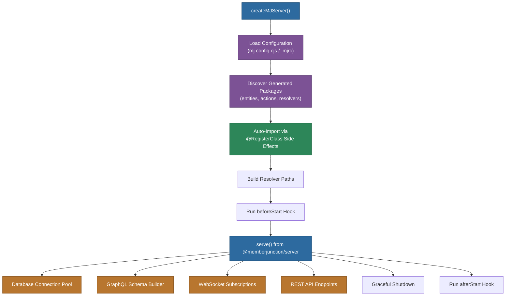

# @memberjunction/server-bootstrap

MemberJunction Server Bootstrap - Encapsulates all server initialization logic into a single, simple function.

## Overview

In MemberJunction 3.0, server applications (MJAPI) became **minimal bootstrapping files** (~6 lines of code) that import all functionality from NPM packages. This package provides the `createMJServer()` function that handles all the complex initialization logic.



## Installation

```bash
npm install @memberjunction/server-bootstrap
```

## Usage

### Basic Usage (Minimal MJAPI)

Create your `packages/api/src/index.ts`:

```typescript
import { createMJServer } from '@memberjunction/server-bootstrap';

// Import generated packages to trigger registration
import '@mycompany/generated-entities';
import '@mycompany/generated-actions';
import '@mycompany/generated-resolvers';

createMJServer().catch(console.error);
```

**That's it!** Your entire MJAPI application in 6 lines.

### With Custom Configuration

```typescript
import { createMJServer } from '@memberjunction/server-bootstrap';

createMJServer({
  // Add custom resolver paths
  resolverPaths: ['./custom-resolvers/**/*Resolver.{js,ts}'],

  // Run custom logic before server starts
  beforeStart: async () => {
    console.log('Initializing custom services...');
    // Your initialization code here
  },

  // Run custom logic after server starts
  afterStart: async () => {
    console.log('Server is ready!');
    // Your post-startup code here
  },

  // Configure REST API
  restApiOptions: {
    enabled: true,
    includeEntities: ['Users', 'Companies'],
    excludeEntities: ['SystemSettings']
  }
}).catch(console.error);
```

## What It Does

The `createMJServer()` function handles:

1. **Configuration Loading** - Automatically finds and loads `mj.config.cjs` or `.mjrc`
2. **Generated Package Discovery** - Auto-imports generated entities, actions, forms, and resolvers
3. **Database Connection** - Sets up connection pooling with configured credentials
4. **GraphQL Schema Building** - Discovers resolvers and builds the GraphQL schema
5. **WebSocket Setup** - Configures WebSocket support for GraphQL subscriptions
6. **REST API Setup** - Registers REST endpoints based on configuration
7. **Graceful Shutdown** - Handles SIGTERM/SIGINT signals properly
8. **Scheduled Jobs** - Initializes and starts scheduled job service if enabled

## Configuration

The function uses your `mj.config.cjs` for all database and server settings:

```javascript
// mj.config.cjs
module.exports = {
  dbHost: process.env.DB_HOST,
  dbPort: process.env.DB_PORT || 1433,
  dbDatabase: process.env.DB_DATABASE,
  dbUsername: process.env.DB_USERNAME,
  dbPassword: process.env.DB_PASSWORD,

  graphqlPort: process.env.PORT || 4000,

  // Code Generation Configuration
  codeGeneration: {
    outputMode: 'packages',
    packageScope: '@mycompany',
    packages: {
      entities: {
        path: './packages/generated-entities',
        name: '@mycompany/generated-entities'
      },
      actions: {
        path: './packages/generated-actions',
        name: '@mycompany/generated-actions'
      },
      graphqlResolvers: {
        path: './packages/generated-resolvers',
        name: '@mycompany/generated-resolvers'
      }
    }
  }
};
```

## API Reference

### `createMJServer(options?: MJServerConfig): Promise<void>`

Creates and starts a MemberJunction API server.

#### Parameters

- `options.configPath` - Path to config file (optional, auto-discovers if not provided)
- `options.resolverPaths` - Additional resolver paths beyond defaults
- `options.beforeStart` - Hook function to run before server starts
- `options.afterStart` - Hook function to run after server starts
- `options.restApiOptions` - REST API configuration options

#### Returns

Promise that resolves when the server is running.

## Migration from 2.x

In MemberJunction 2.x, your MJAPI/src/index.ts had ~34 lines of boilerplate code for database setup, schema building, etc.

**Before (2.x):**
```typescript
// 34 lines of configuration, pool setup, schema building, etc.
import { serve } from '@memberjunction/server';
// ... lots of setup code ...
await serve(resolverPaths);
```

**After (3.0):**
```typescript
import { createMJServer } from '@memberjunction/server-bootstrap';
createMJServer().catch(console.error);
```

All the complexity is now encapsulated in this package and updated via NPM.

## Benefits

- **Zero-copy updates** - `npm update` brings all improvements automatically
- **No stale code** - Bootstrap logic stays up-to-date with MJ releases
- **Minimal surface area** - Fewer lines of code means fewer places for bugs
- **Standard patterns** - Everyone uses the same initialization flow
- **Extensible** - Hooks allow custom logic without modifying core

## License

MIT
