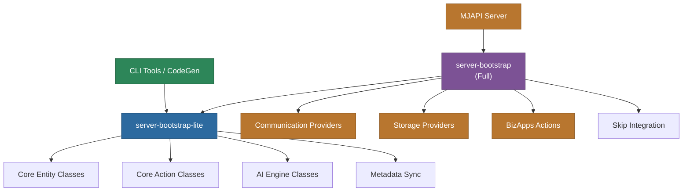

# @memberjunction/server-bootstrap-lite

Lightweight class registrations manifest for MemberJunction server-side tools. Excludes heavy and ESM-incompatible dependencies (communication providers, storage, bizapps actions) that are unnecessary for CLI tools, CodeGen, MCP Server, and similar lightweight applications.

## Overview

This package provides a pre-built class registration manifest that imports and registers all core `@memberjunction/*` classes needed for server-side operation, but intentionally excludes heavyweight packages that are only needed for the full MJAPI server.



## Installation

```bash
npm install @memberjunction/server-bootstrap-lite
```

## When to Use

Use `server-bootstrap-lite` instead of `server-bootstrap` for:

| Application | Use Lite? | Why |
|-------------|-----------|-----|
| MJCLI | Yes | Does not need communication/storage providers |
| CodeGen (CodeGenLib, MJCodeGenAPI) | Yes | Only needs entity metadata and class registration |
| MCP Server | Yes | Lightweight integration, no email/SMS needed |
| A2A Server | Yes | Agent-to-agent, no UI or storage dependencies |
| Custom CLI tools | Yes | Minimal footprint for scripting |
| MJAPI Server | No | Needs full manifest with all providers |
| MJ Explorer | No | Needs ng-bootstrap for Angular manifests |

## Usage

```typescript
// Import for side effects -- triggers all class registrations
import '@memberjunction/server-bootstrap-lite';

// Or import the manifest metadata
import {
  CLASS_REGISTRATIONS,
  CLASS_REGISTRATIONS_MANIFEST_LOADED,
  CLASS_REGISTRATIONS_COUNT,
  CLASS_REGISTRATIONS_PACKAGES
} from '@memberjunction/server-bootstrap-lite';

console.log(`Registered ${CLASS_REGISTRATIONS_COUNT} classes from ${CLASS_REGISTRATIONS_PACKAGES.length} packages`);
```

## Exports

| Export | Type | Description |
|--------|------|-------------|
| `CLASS_REGISTRATIONS` | `object[]` | Array of class instances that create static import paths |
| `CLASS_REGISTRATIONS_MANIFEST_LOADED` | `boolean` | Always `true`, confirms manifest was loaded |
| `CLASS_REGISTRATIONS_COUNT` | `number` | Total number of registered classes |
| `CLASS_REGISTRATIONS_PACKAGES` | `string[]` | List of package names included in the manifest |

## How It Works

Modern bundlers (ESBuild, Vite) use tree-shaking to eliminate unused code. MemberJunction's `@RegisterClass` decorators rely on dynamic class instantiation via `MJGlobal.ClassFactory`, which bundlers cannot detect. The manifest system prevents tree-shaking by creating explicit static import paths for every decorated class.

This "lite" variant includes a curated subset of the full manifest, excluding packages that:
- Require ESM-incompatible native modules
- Pull in heavy communication SDKs (email, SMS, push)
- Include cloud storage providers
- Contain business application-specific actions

## Dependencies

The lite manifest includes core MemberJunction packages for:
- Entity class registration
- Action class registration
- AI engine and model drivers
- Metadata synchronization
- Core business logic

See the full `server-bootstrap` package for the complete manifest including all providers.

## License

ISC
