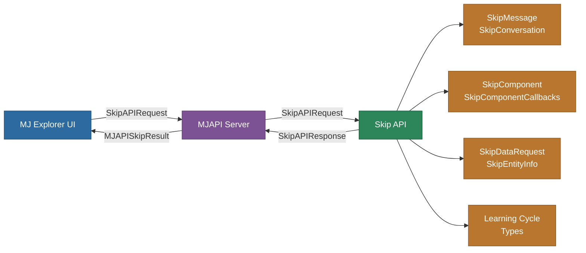

# @memberjunction/skip-types

Type definitions and interfaces for the Skip AI Assistant integration with MemberJunction. This package provides the contract between the MemberJunction API, Skip API, and the MemberJunction Explorer UI.

## Overview

The `@memberjunction/skip-types` package contains TypeScript type definitions, interfaces, and enums that facilitate communication between different components of the MemberJunction Skip AI assistant system. It ensures type safety and consistent data structures when interacting with the Skip API or rendering Skip-generated content in MemberJunction applications.



## Installation

```bash
npm install @memberjunction/skip-types
```

## Key Components

### Request Types

Types used for making requests to the Skip API:

- `SkipAPIRequest` - Base interface for Skip API requests
- `SkipAPIRequestAPIKey` - API key configuration for LLM vendors
- `SkipAPIRunScriptRequest` - Request to run an existing script
- `SkipRequestPhase` - Defines the different phases of Skip requests:
  - `initial_request` - Starting a new conversation or after component creation
  - `clarify_question_response` - Responding to Skip's clarifying questions
  - `data_gathering_response` - Returning requested data to Skip
  - `data_gathering_failure` - Reporting data gathering errors
  - `run_existing_script` - Running previously processed scripts
  - `chat_with_a_record` - Simple record chatting feature

### Response Types

Types used for handling responses from the Skip API:

- `SkipAPIResponse` - Base interface for Skip API responses
- `MJAPISkipResult` - Response format from MJAPI to the UI
- `SkipResponsePhase` - Defines the different phases of Skip responses:
  - `status_update` - Status update during processing
  - `clarifying_question` - Skip needs more information
  - `data_request` - Skip needs additional data
  - `analysis_complete` - Analysis finished with results
  - `chat_with_a_record_complete` - Record chat completed

### Message and Conversation Types

- `SkipMessage` - Individual message in a conversation with Skip
  - Includes role, content, conversationDetailID
  - Optional: error, hiddenToUser, userRating, userFeedback, reflectionInsights
- `SkipConversation` - Collection of messages forming a conversation
  - Includes id, name, userId, messages array
  - Optional: description, artifacts

### Component Types

Types for Skip-generated components and visualizations:

- `SkipComponent` - Component generated by Skip
- `SkipComponentCallbacks` - Interface for callbacks from components:
  - `RefreshData()` - Refresh the data context
  - `OpenEntityRecord(entityName, key)` - Open a specific record
  - `UpdateUserState(userState)` - Update user-specific state
  - `NotifyEvent(eventName, eventData)` - Send custom events
- `SkipComponentInitFunction` - Initialization function for components
- `SkipComponentObject` - Interface exposed by components
- `SkipComponentOption` - Alternative component options
- `SimpleDataContext` - Simplified data context for components

### Learning Cycle Types

- `SkipAPILearningCycleRequest` - Request for Skip to learn from conversation history
- `SkipAPILearningCycleResponse` - Response from learning cycle processing
- `SkipAPIAgentNote` - Notes that Skip can generate during learning
- `SkipAPIAgentNoteType` - Types of notes Skip can generate
- `SkipAPIAgentRequest` - Format for Skip's human-in-the-loop requests
- `SkipLearningCycleQueryChange` - Query changes during learning
- `SkipLearningCycleRequestChange` - Request changes during learning
- `SkipLearningCycleNoteChange` - Note changes during learning

### Data Types

- `SkipDataRequest` - Format for Skip to request additional data
- `SkipDataRequestType` - Types of data requests Skip can make:
  - `sql` - Fully executable SQL statement
  - `stored_query` - Stored query from Queries entity
- `SkipSubProcessResponse` - Results from sandboxed script execution
- `SkipEntityInfo` - Entity metadata information for Skip
- `SkipEntityFieldInfo` - Field metadata for entities
- `SkipEntityFieldValueInfo` - Possible values for entity fields
- `SkipEntityRelationshipInfo` - Relationship metadata for entities
- `SkipQueryInfo` - Stored query information
- `SkipQueryFieldInfo` - Field information for queries
- `SkipColumnInfo` - Column information for report data

### Specialized Response Types

- `SkipAPIAnalysisCompleteResponse` - Response for completed analysis
  - Includes dataContext, resultType, executionResults
  - Optional: component, drillDown, scriptText, newDataItems
- `SkipAPIClarifyingQuestionResponse` - Response when Skip needs clarification
- `SkipAPIDataRequestResponse` - Response when Skip needs more data
- `SkipAPIChatWithRecordResponse` - Response for chat-with-record feature
- `SkipAPIAnalysisDrillDown` - Drill-down information for reports
- `SkipAPIAnalysisDrillDownFilter` - Individual drill-down filter

### Artifact Types

- `SkipAPIArtifact` - Artifact information with versions
- `SkipAPIArtifactType` - Artifact type definition
- `SkipAPIArtifactVersion` - Version information for artifacts
- `SkipAPIArtifactRequest` - Request to create/update artifacts

## Usage Examples

### Creating a Skip API Request

```typescript
import { 
  SkipAPIRequest, 
  SkipMessage, 
  SkipRequestPhase 
} from '@memberjunction/skip-types';

// Create a new Skip API request
const request: SkipAPIRequest = {
  messages: [
    {
      role: "user",
      content: "Show me sales by region from last quarter",
      conversationDetailID: "12345"
    }
  ],
  dataContext: myDataContext,
  entities: myEntityMetadata,
  queries: myStoredQueries,
  conversationID: "conv-123",
  organizationID: "org-456",
  requestPhase: SkipRequestPhase.initial_request,
  apiKeys: [
    {
      vendorDriverName: "AnthropicLLM",
      apiKey: "YOUR_API_KEY"
    }
  ]
};
```

### Handling Skip API Responses

```typescript
import { 
  MJAPISkipResult, 
  SkipAPIAnalysisCompleteResponse, 
  SkipResponsePhase 
} from '@memberjunction/skip-types';

function handleSkipResponse(result: MJAPISkipResult) {
  if (result.Success) {
    if (result.ResponsePhase === SkipResponsePhase.analysis_complete) {
      // Parse the result JSON into the appropriate type
      const response = JSON.parse(result.Result) as SkipAPIAnalysisCompleteResponse;
      
      // Now you can access the analysis results
      console.log("Report title:", response.reportTitle);
      console.log("Analysis:", response.analysis);
      
      // Handle different result types
      if (response.resultType === "data") {
        // Handle table data from executionResults.tableData
        displayTable(response.executionResults.tableData);
      } else if (response.resultType === "plot") {
        // Handle plot data from executionResults.plotData
        renderPlot(response.executionResults.plotData);
      } else if (response.resultType === "html") {
        // Handle custom component
        renderComponent(response.component);
      }
    } else if (result.ResponsePhase === SkipResponsePhase.clarifying_question) {
      // Handle clarifying questions
      const questionResponse = JSON.parse(result.Result) as SkipAPIClarifyingQuestionResponse;
      promptUserForAnswer(questionResponse.clarifyingQuestion);
    } else if (result.ResponsePhase === SkipResponsePhase.data_request) {
      // Handle data requests
      const dataRequest = JSON.parse(result.Result) as SkipAPIDataRequestResponse;
      fetchAdditionalData(dataRequest.dataRequest);
    }
  } else {
    console.error("Skip API request failed:", result.Status);
  }
}
```

### Working with Skip Components and Callbacks

```typescript
import { 
  SkipComponentInitFunction, 
  SimpleDataContext, 
  SkipComponentCallbacks 
} from '@memberjunction/skip-types';

// Init function that would be called by the container application
const initComponent: SkipComponentInitFunction = (
  data: SimpleDataContext, 
  userState?: any, 
  callbacks?: SkipComponentCallbacks
) => {
  // Initialize the component with the data
  renderChart(data.data_item_1);
  
  
  document.getElementById('open-record').addEventListener('click', () => {
    callbacks?.OpenEntityRecord('Customer', { ID: 123 });
  });
};

// Register the init function globally so it can be called from the container
window.initSkipComponent = initComponent;
```

### Working with Learning Cycles

```typescript
import { 
  SkipAPILearningCycleRequest,
  SkipAPILearningCycleResponse,
  SkipConversation
} from '@memberjunction/skip-types';

// Create a learning cycle request
const learningRequest: SkipAPILearningCycleRequest = {
  organizationId: "org-456",
  learningCycleId: "cycle-123",
  newConversations: conversationsSinceLastCycle,
  entities: entityMetadata,
  queries: storedQueries,
  notes: existingNotes,
  noteTypes: availableNoteTypes,
  requests: existingRequests,
  lastLearningCycleDate: lastCycleDate,
  apiKeys: [
    {
      vendorDriverName: "AnthropicLLM",
      apiKey: "YOUR_API_KEY"
    }
  ]
};

// Handle learning cycle response
function handleLearningResponse(response: SkipAPILearningCycleResponse) {
  if (response.success) {
    // Process note changes
    response.noteChanges.forEach(change => {
      if (change.changeType === 'add') {
        addNote(change.note);
      } else if (change.changeType === 'update') {
        updateNote(change.note);
      } else if (change.changeType === 'delete') {
        deleteNote(change.note);
      }
    });
    
    // Process query changes
    response.queryChanges.forEach(change => {
      // Handle query additions, updates, deletions
    });
    
    // Process request changes
    response.requestChanges.forEach(change => {
      // Handle request changes
    });
  } else {
    console.error("Learning cycle failed:", response.error);
  }
}
```

## Supported LLM Vendors

The `vendorDriverName` in `SkipAPIRequestAPIKey` supports the following AI providers:
- `OpenAILLM` - OpenAI models
- `MistralLLM` - Mistral AI models
- `GeminiLLM` - Google Gemini models
- `AnthropicLLM` - Anthropic Claude models
- `GroqLLM` - Groq models

## Dependencies

This package relies on the following MemberJunction packages:
- `@memberjunction/core` - Core MemberJunction types (CompositeKey)
- `@memberjunction/core-entities` - Core entity definitions
- `@memberjunction/data-context` - Data context types and utilities

## TypeScript Configuration

This package is built with TypeScript and includes type definitions. No additional @types packages are required.

## Contributing

Contributions to extend or improve the type definitions are welcome. Please ensure that any additions maintain backward compatibility and follow the established naming conventions.

### Naming Conventions
- Use PascalCase for class and interface names
- Prefix Skip-specific types with `Skip`
- Use descriptive names that clearly indicate the type's purpose
- Group related types together in the source file

## License

ISC