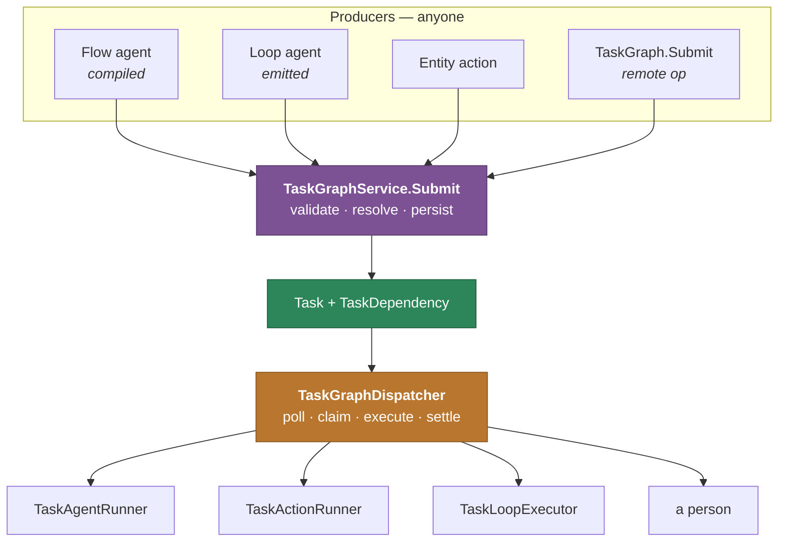
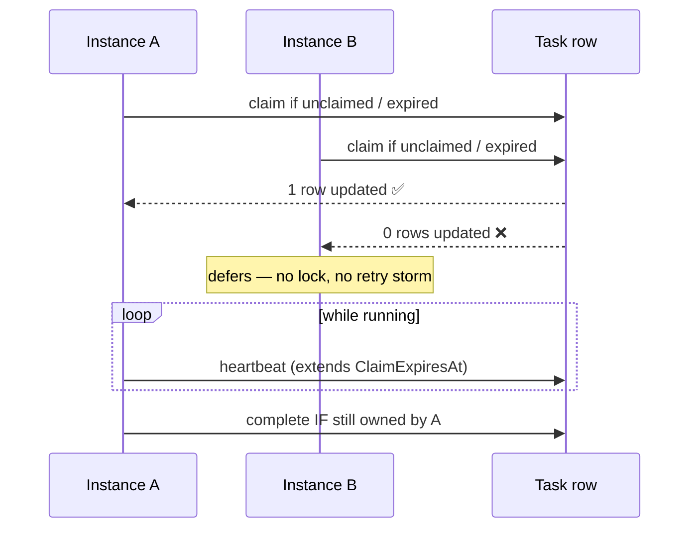

# @memberjunction/task-graph

Durable execution of task graphs: submission, the dispatcher, the claim protocol, and the runners
that turn a node into work.

> **New to workflows?** Start with the [Workflows and Task Graphs
> Guide](../../guides/WORKFLOW_AND_TASK_GRAPH_GUIDE.md), which covers what a workflow is, when to
> use one, and every rule that decides what happens next. To **step a live run**, see the
> [Workflow Debugger Guide](../../guides/WORKFLOW_DEBUGGER_GUIDE.md). This README is the package tour.

---

## What this package is for

A task graph is work that has to **outlive the thing that asked for it**. Before durable execution,
a multi-step agent plan lived inside one agent run: a page reload lost it, a server restart orphaned
it, and no channel other than the one that started it could see it.

This package is the other half of that split. Something else *produces* a graph; this package makes
it durable and runs it.



**Submission never waits for execution.** `Submit` returns as soon as the graph is durable. That
split is what makes the engine invocation-agnostic: an agent, a scheduled job, a Slack message and a
manual UI all call the same method, and whichever dispatcher instance is running picks the work up.

---

## What it deliberately does not do

**It does not decide graph semantics.** Eligibility, failure propagation, parent rollup, skip
cascade, exclusive-group resolution and stall detection all come from pure, dependency-free
functions in [`@memberjunction/ai-core-plus`](../AI/CorePlus). That is not tidiness — it is what
stops the in-run executor and the durable executor from drifting apart. Neither owns the rules.

**It does not import MJServer.** Provider minting and agent execution arrive as injected seams
(`ProviderFactory`, `TaskAgentRunner`, `TaskActionRunner`), so the dependency runs
MJServer → task-graph and never the reverse. That is also what keeps the dispatcher unit-testable
without standing up the agent framework.

---

## The pieces

| File | Responsibility |
|---|---|
| `TaskGraphService.ts` | Validate a spec, resolve names to IDs, write parent + children + edges. The only write path. |
| `TaskGraphDispatcher.ts` | Poll, claim, execute, evaluate edges, propagate, roll up, settle, credit cost. |
| `TaskClaimStore.ts` | The atomic claim protocol — guarded writes so two instances cannot run the same task. |
| `TaskLoopExecutor.ts` | `ForEach` / `While` semantics: bounds, ordering, concurrency, delay, failure. |
| `DispatcherConditionEvaluator.ts` | Edge conditions, over the superset context both dialects can read. |
| `TaskGraphSubmitterImpl.ts` | Registers the durable submitter under the `ClassFactory` seam. |
| `operations/` | The `TaskGraph.*` remote operations. |

---

## Claiming: why a task runs exactly once

Multiple dispatcher instances poll the same table. Correctness comes from a **guarded write**, not
from coordination: claiming is an update that only succeeds if the row still looks the way the
claimer expects.



If A dies, its claim expires and reconciliation makes the task claimable again. If A finishes but
the row changed underneath it (cancelled, reassigned, reclaimed), the guarded completion refuses and
A defers — overwriting would undo a newer, deliberate decision.

---

## Runners are seams, not implementations

| Seam | Implemented by | Absent means |
|---|---|---|
| `TaskAgentRunner` | `TaskGraphAgentRunner` (MJServer) | agent nodes cannot run here |
| `TaskActionRunner` | `TaskGraphActionRunner` (MJServer) | action nodes stay `Pending`, **not** Failed |
| `ProviderFactory` | `TaskGraphProviderFactory` (MJServer) | required |
| `TaskContinuationDeliverer` | `TaskGraphContinuationDeliverer` (MJServer) | outcomes are recorded but not announced |
| `TaskGraphObserver` | the frame resolver (MJServer) | nobody is watching; behaviour identical |

**A host with no runner is limited, not broken.** "Nobody here can run this" is not the same as
"this ran and did not work", so those tasks stay visible and claimable by an instance that can.

> **An Agent node starts a brand-new `AIAgentRun`** — a root run, linked from `Task.AgentRunID`
> rather than nested under the submitting run. The relationship is expressed by the Task row.

---

## Starting a dispatcher

MJAPI does this for you (`StartTaskGraphDispatcher`). For a custom host:

```typescript
import { TaskGraphDispatcher, LoadTaskGraphOperations } from '@memberjunction/task-graph';

LoadTaskGraphOperations();   // registers the remote operations + the durable submitter

const dispatcher = new TaskGraphDispatcher(
    providerFactory,
    agentRunner,
    contextUser,
    { InstanceID: `worker-${process.pid}` },
    continuationDeliverer,   // optional
    observer,                // optional
    actionRunner,            // optional
);
await dispatcher.Start();
```

Without `LoadTaskGraphOperations()` nothing registers the submitter, and
`GetTaskGraphSubmitter()` returns `null` — which callers must report rather than swallow.

---

## Cost rollup

When a graph settles, the dispatcher credits its spending back to the run that submitted it, writing
the `…Rollup` columns on `AIAgentRun`:

- `TotalCost` — what the submitting run itself spent. **Never rewritten here.**
- `TotalCostRollup` — that run plus everything it caused.

This cannot happen during the run: a submitting run *ends at submission*, so at the moment it
computes its own totals the graph has not spent anything yet. See the guide's [cost
section](../../guides/WORKFLOW_AND_TASK_GRAPH_GUIDE.md#cost-and-tokens-the-seam).

---

## Testing

```bash
cd packages/TaskGraph && pnpm test
```

Unit tests cover the pure pieces — loop semantics, dispatchable kinds, configuration persistence,
parent metadata. The dispatcher driving **real rows against SQL Server** is covered by the `IT74`
bundle in `@memberjunction/integration-test-suite`, which uses a stub agent runner so it stays in
the deterministic tier: no model calls, no tokens, real claim protocol, real condition evaluator,
real rollup.

---

## Related

- [Workflows and Task Graphs Guide](../../guides/WORKFLOW_AND_TASK_GRAPH_GUIDE.md) — start here
- [`@memberjunction/ai-core-plus`](../AI/CorePlus) — the spec, validator, compiler, pure algorithms,
  payload mapping and layout
- [`@memberjunction/ai-agents`](../AI/Agents) — the agent framework and `FlowAgentType`
- [`packages/Actions/CLAUDE.md`](../Actions/CLAUDE.md) — Actions as boundaries
