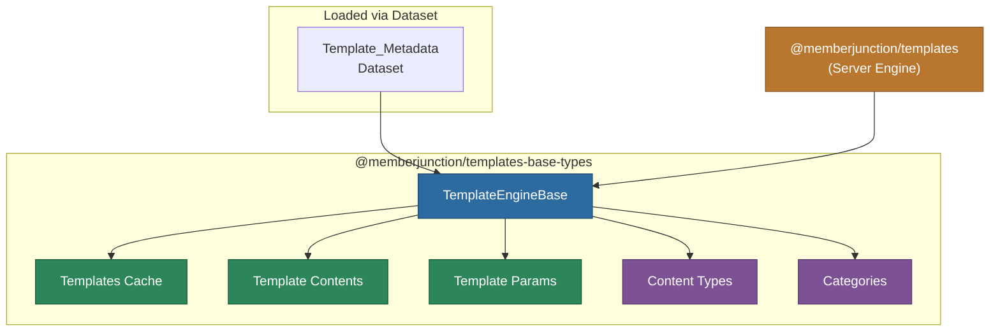
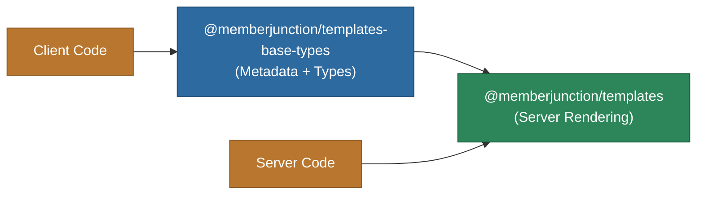

# @memberjunction/templates-base-types

Base types and metadata caching engine for MemberJunction's templating system. Provides cached access to template metadata and can be used on both client and server.

## Architecture



## Overview

This package provides the foundational layer for MemberJunction's templating system:

- **TemplateEngineBase**: Singleton engine that loads and caches all template metadata via the `Template_Metadata` dataset
- **TemplateRenderResult**: Standard result type for template rendering operations
- **Metadata Access**: Cached getters for templates, content types, categories, contents, and params
- **Template Lookup**: Convenience method for finding templates by name (case-insensitive)
- **Content Association**: Automatically associates template contents and params with their parent templates after loading

## Installation

```bash
npm install @memberjunction/templates-base-types
```

## Usage

### Initializing the Engine

```typescript
import { TemplateEngineBase } from '@memberjunction/templates-base-types';

// Load template metadata
await TemplateEngineBase.Instance.Config(false, contextUser);

// Force refresh
await TemplateEngineBase.Instance.Config(true, contextUser);
```

### Accessing Template Metadata

```typescript
const engine = TemplateEngineBase.Instance;

// All templates (with Content and Params pre-associated)
const templates = engine.Templates;

// Find a template by name
const emailTemplate = engine.FindTemplate('Welcome Email');

// Access template contents and params
const contents = emailTemplate.Content;
const params = emailTemplate.Params;

// Other metadata
const contentTypes = engine.TemplateContentTypes;
const categories = engine.TemplateCategories;
```

### TemplateRenderResult

```typescript
import { TemplateRenderResult } from '@memberjunction/templates-base-types';

// Returned by rendering operations
const result: TemplateRenderResult = {
    Success: true,
    Output: '<html>...</html>',
    Message: undefined  // Only set on failure
};
```

## API Reference

### TemplateEngineBase

| Member | Type | Description |
|--------|------|-------------|
| `Instance` | static getter | Singleton instance |
| `Config()` | method | Load/refresh template metadata |
| `Templates` | getter | All templates with associated contents and params |
| `TemplateContentTypes` | getter | Available content types |
| `TemplateCategories` | getter | Template categories |
| `TemplateContents` | getter | All template content records |
| `TemplateParams` | getter | All template parameter definitions |
| `FindTemplate()` | method | Find template by name (case-insensitive) |

### TemplateRenderResult

| Property | Type | Description |
|----------|------|-------------|
| `Success` | boolean | Whether rendering succeeded |
| `Output` | string | The rendered output |
| `Message` | string (optional) | Error message on failure |

## Relationship to @memberjunction/templates

This package provides the **metadata caching layer** usable anywhere. The `@memberjunction/templates` package extends it with server-side Nunjucks rendering, custom extensions, and AI prompt integration.



## Dependencies

| Package | Purpose |
|---------|---------|
| `@memberjunction/core` | BaseEngine, UserInfo, IMetadataProvider |
| `@memberjunction/core-entities` | Template entity types |
| `@memberjunction/global` | MJGlobal class factory |

## License

ISC
